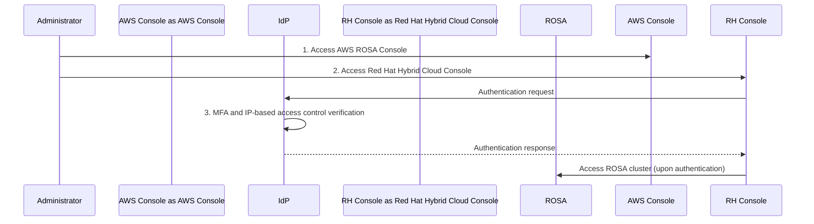
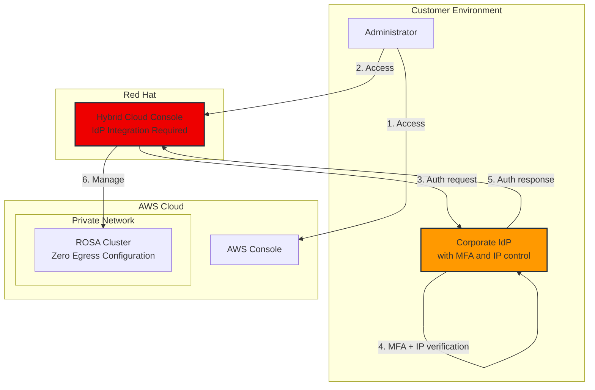

# ROSA Security Compliance Console Access Control

> **Created**: 2025-02-05 | **Updated**: 2026-02-13 | **Reading time**: ~3 min

## Overview

When adopting ROSA (Red Hat OpenShift Service on AWS) in the financial sector, access control for the Red Hat Hybrid Cloud Console is a critical security requirement. This guide explains secure administrator access control strategies utilizing IdP (Identity Provider), MFA, and IP-based access restrictions.

:::warning Notice
This document addresses security requirements for financial sector customers. Consultation with Red Hat and AWS is required for actual implementation.
:::

---

## Customer Situation

A financial institution in Korea raised concerns about access control for the Red Hat Hybrid Cloud Console while adopting ROSA (Red Hat OpenShift Service on AWS). This is a separate issue from the ROSA cluster network architecture, which has already been confirmed to meet the requirements.

## Current Understanding

- The private network configuration for ROSA clusters is well understood and implementable.
- The compliance issue is limited to the Red Hat Hybrid Cloud Console access pattern, not the ROSA cluster itself.
- When a ROSA cluster is created, administrators access the cluster through the Red Hat Hybrid Cloud Console, which currently does not meet security requirements.

## Current Obstacle

The default public access pattern to the Red Hat Hybrid Cloud Console does not meet financial regulatory requirements. Although the ROSA cluster itself can be adequately protected with private network configuration, console access must be managed separately.

## Security Requirements

### Console Access Control Requirements

The customer requires:

1. IdP (Identity Provider) integration for Red Hat Hybrid Cloud Console access
2. MFA (Multi-Factor Authentication) implementation through IdP
3. IP-based access control for the console

### Important Clarifications

- These requirements apply only to Red Hat Hybrid Cloud Console access.
- This is completely separate from OIDC/SAML configuration for the ROSA cluster itself.
- The concern is not about the ROSA cluster's network architecture, which has already been confirmed as compliant when implemented with private network configuration (including Zero Egress configuration).

## Proposed Access Control Workflow

The secure access workflow proposed by the customer is as follows:

1. Administrator accesses the AWS ROSA Console.
2. When accessing the Red Hat Hybrid Cloud Console, authentication is handled through an IdP configured in AWS.
3. The IdP enforces:
   - Multi-Factor Authentication (MFA)
   - IP-based access control

This workflow ensures that administrator access is strictly controlled and compliant with security requirements.

```mermaid
sequenceDiagram
    participant Admin as Administrator
    participant AWS Console as AWS Console
    participant IdP as IdP
    participant RH Console as Red Hat Hybrid Cloud Console
    participant ROSA

    Admin->>AWS Console: 1. Access AWS ROSA Console
    Admin->>RH Console: 2. Access Red Hat Hybrid Cloud Console
    RH Console->>IdP: Authentication request
    IdP->>IdP: 3. MFA and IP-based access control verification
    IdP-->>RH Console: Authentication response
    RH Console->>ROSA: Access ROSA cluster (upon authentication)
```

### Overall Architecture

```mermaid
graph TB
    subgraph Customer["Customer Environment"]
        Admin[Administrator]
        IdP[Corporate IdP<br/>with MFA and IP control]
    end

    subgraph AWS["AWS Cloud"]
        AWSC[AWS Console]
        subgraph Private["Private Network"]
            ROSA[ROSA Cluster<br/>Zero Egress Configuration]
        end
    end

    subgraph RedHat["Red Hat"]
        HCC[Hybrid Cloud Console<br/>IdP Integration Required]
    end

    Admin -->|1. Access| AWSC
    Admin -->|2. Access| HCC
    HCC -->|3. Auth request| IdP
    IdP -->|4. MFA + IP verification| IdP
    IdP -->|5. Auth response| HCC
    HCC -->|6. Manage| ROSA

    style IdP fill:#ff9900,stroke:#232f3e,stroke-width:2px
    style HCC fill:#EE0000,stroke:#232f3e,stroke-width:2px
```

---

## Required Responses

1. Information on similar cases in the financial sector
2. Previous solutions implemented for administrator access control
3. Best practices from other financial sector implementations

## Next Steps

- Confirm the proposed workflow meets Red Hat's technical capabilities
- Provide IdP integration documentation for the Red Hat Hybrid Cloud Console
- Share case studies from other financial sector implementations
- Provide technical guidance for implementation

:::tip Note
Detailed consultation with Red Hat and AWS is required for actual implementation.
:::
