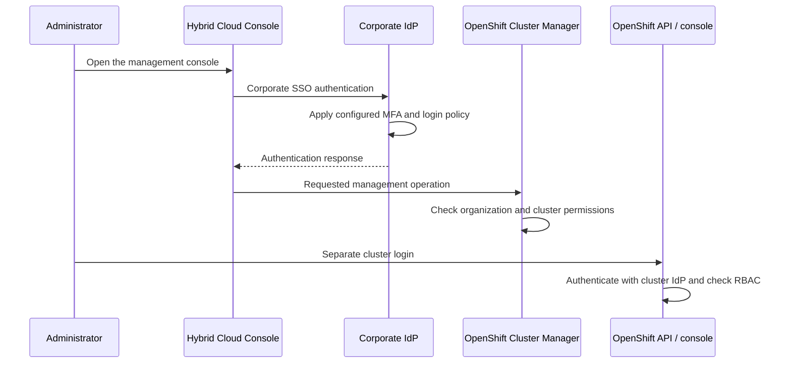
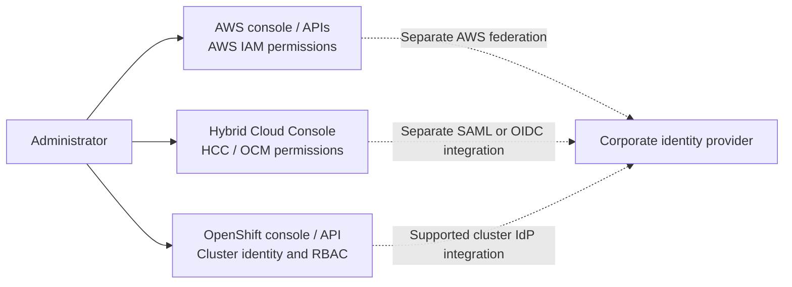

## Overview

An administrator who signs in through a corporate IdP does not automatically receive every ROSA management permission. AWS IAM, Red Hat Hybrid Cloud Console (HCC) and OpenShift Cluster Manager (OCM) permissions, and OpenShift cluster RBAC have different scopes. This design separates those boundaries and defines tests for MFA and login-location restrictions.

This repository contains no implementation logs or compliance assessment for the design. Treat the flow as a proposal to validate, not evidence that a control is effective or that a financial regulation has been satisfied.

## Customer Situation

The original note described console-access requirements from a financial institution in Korea. No publishable requirements specification or approval record accompanies it, so the customer-specific account and approval status remain unverified. The design uses only the stated assumption that administrators need corporate identity, MFA, and access from approved locations.

## Current Understanding

| Access target | Authentication and authorization | Separate check |
| --- | --- | --- |
| AWS console and APIs | AWS federation and IAM | Roles and policies for the AWS resources used by ROSA |
| HCC and OCM | Red Hat corporate SSO and organization or cluster permissions | Account eligibility, organization membership, and role scope |
| OpenShift console and API | A supported IdP for cluster OAuth and RBAC | Cluster or project roles, CLI and token access |

The AWS console is not a required hop for HCC or `oc` access. Reusing a corporate IdP still requires separate trust and permission configuration for each service.

## Current Obstacle

Determine which access paths enforce each required control. A public console URL alone does not establish a regulatory violation. Test whether a login-time IP rule also covers existing sessions and API tokens, and whether another path bypasses MFA. Specify the applicable controls and acceptance criteria separately, using the [ROSA shared-responsibility guidance](https://docs.aws.amazon.com/rosa/latest/userguide/security.html) to define the assessment scope.

## Security Requirements

### Console Access Control Requirements

1. Configure corporate SSO specifically for HCC and verify account and organization mapping.
2. Configure the required MFA and login-location policies at the IdP.
3. Grant OCM roles and cluster RBAC permissions for the intended duties.
4. Test existing sessions, CLI, API and service tokens, user deactivation, and recovery access.
5. Verify successful and denied operations and user attribution in each service's audit logs.

### Important Clarifications

The [HCC IdP integration guide](https://docs.redhat.com/en/documentation/red_hat_hybrid_cloud_console/1-latest/html-single/configuring_identity_provider_integration/index) supports SAML 2.0 and OIDC. An organization administrator must confirm account eligibility, test the integration, and enable it. The guide identifies non-web services that do not use corporate SSO and does not support federated logout. Do not assume that IdP logout or blocking a corporate identity ends every Red Hat access path.

The ROSA cluster separately uses a [supported OAuth IdP](https://docs.aws.amazon.com/rosa/latest/userguide/getting-started-classic-cli.html). OIDC in that list does not imply native SAML support. If the enterprise identity system uses SAML, identify the supported broker and protocol path.

[HCP egress-zero installation](https://docs.redhat.com/en/documentation/red_hat_openshift_service_on_aws/4/html/install_rosa_with_hcp_clusters/rosa-hcp-egress-zero-install) is a network design option. Check the release-specific VPC endpoints, regional ECR, firewall and administrator access, and feature restrictions. It does not establish a physical air gap or compliance approval and is distinct from this section's public Classic demo.

## Proposed Access Control Workflow

The administrator signs in to HCC through its separately configured corporate IdP. The IdP evaluates configured MFA and login policies and returns an authentication result. OCM then checks permissions for the requested management operation. Direct OpenShift API access follows the cluster's own login and RBAC checks.

```mermaid
sequenceDiagram
    participant A as Administrator
    participant H as Hybrid Cloud Console
    participant I as Corporate IdP
    participant O as OpenShift Cluster Manager
    participant C as OpenShift API / console
    A->>H: Open the management console
    H->>I: Corporate SSO authentication
    I->>I: Apply configured MFA and login policy
    I-->>H: Authentication response
    H->>O: Requested management operation
    O->>O: Check organization and cluster permissions
    A->>C: Separate cluster login
    C->>C: Authenticate with cluster IdP and check RBAC
```

### Overall Architecture

```mermaid
flowchart LR
    A["Administrator"]
    I["Corporate identity provider"]
    AWS["AWS console / APIs<br/>AWS IAM permissions"]
    HCC["Hybrid Cloud Console<br/>HCC / OCM permissions"]
    API["OpenShift console / API<br/>Cluster identity and RBAC"]
    A --> AWS
    A --> HCC
    A --> API
    AWS -.->|Separate AWS federation| I
    HCC -.->|Separate SAML or OIDC integration| I
    API -.->|Supported cluster IdP integration| I
```

Dotted lines represent separate identity integrations. Configuring one does not configure access control for the other two paths.

## Required Responses

| Question | Evidence required |
| --- | --- |
| Which duties and data are in scope? | Requirements naming the controls, scope, and approving authority |
| When is IdP policy evaluated? | Allowed and denied results at login, session refresh, and after a location change |
| Which access ends when an account is blocked? | Tests for HCC sessions, OCM/API tokens, service identities, and cluster tokens |
| Who can manage which resources? | Positive and negative tests for organization and cluster roles and OpenShift RBAC |
| How is access recovered after SSO failure or misconfiguration? | Tested recovery identities, owners, and Red Hat support procedures |
| Who reviews the audit trail? | Collection, retention, and access owners for AWS, Red Hat, IdP, cluster, and application logs |

## Next Steps

Choose a test organization, cluster, and identities, then record the allow and deny conditions in the table. Confirm recovery access before enabling HCC integration. Test unauthorized operations, disallowed locations, deactivated users, and existing tokens as well as successful login. Have the security owner assess the results and remaining exceptions before rollout.

This document review did not configure federation or execute access tests. Compliance status remains unverified until implementation evidence and approval are available.
