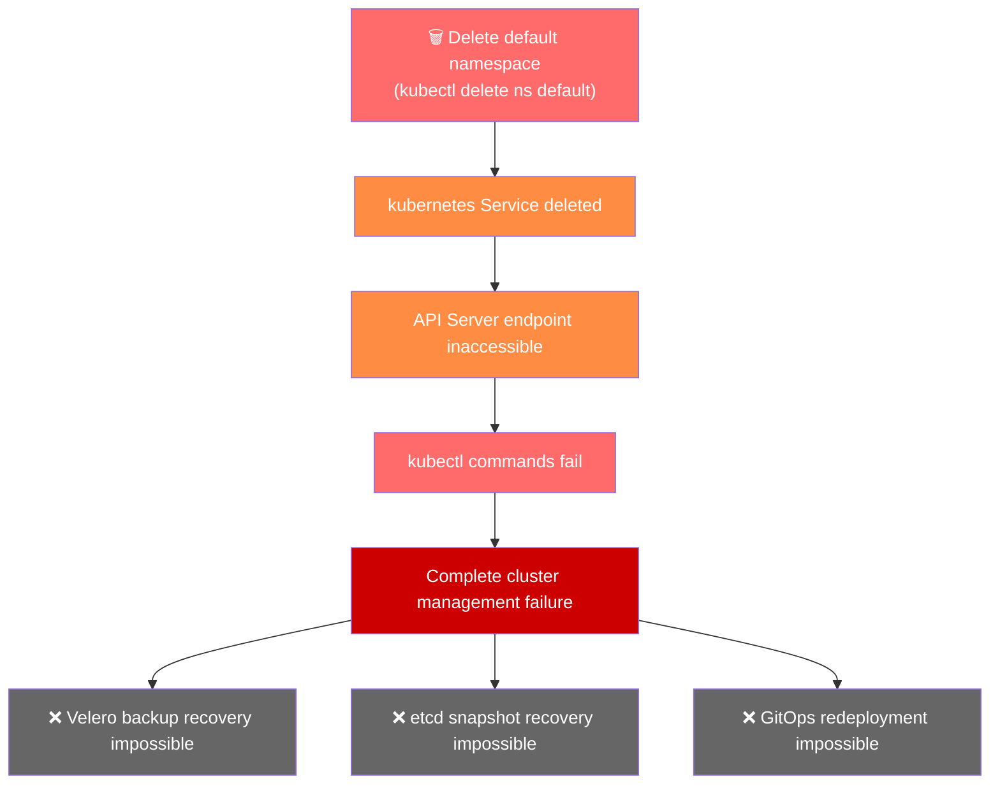
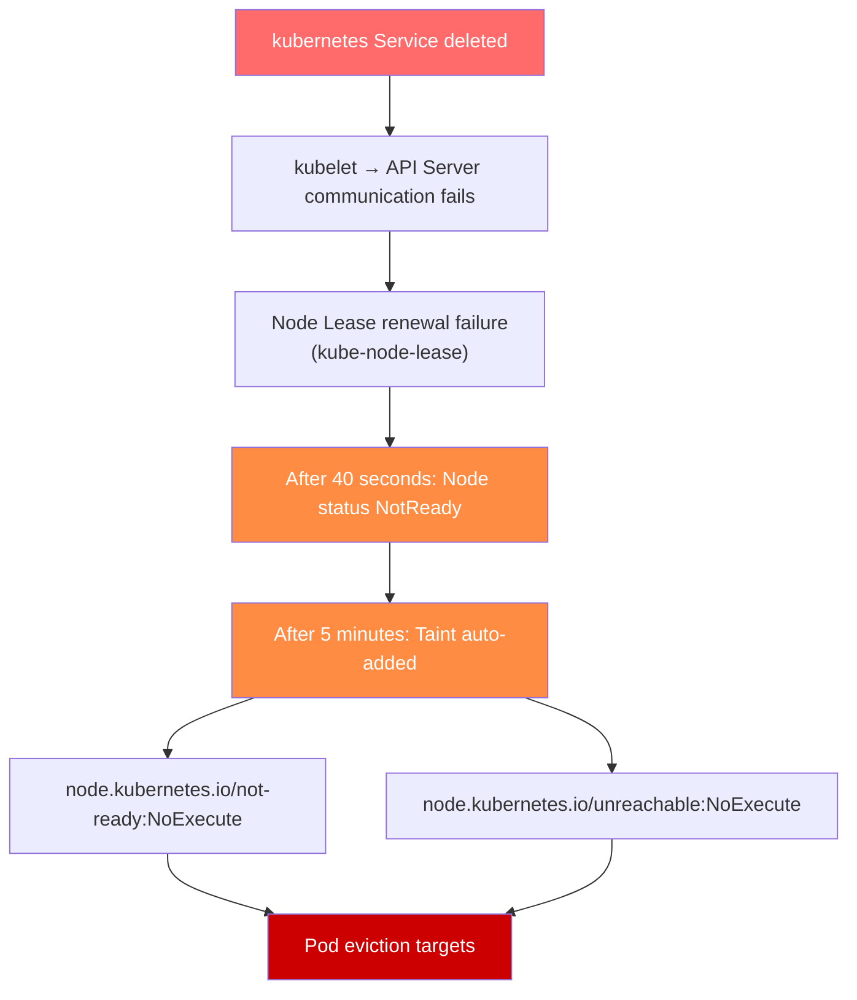

# EKS Default Namespace Deletion Incident Response Guide

## 1. Overview (TL;DR)

:::danger Critical Alert
Deleting the default namespace in an EKS cluster blocks all access to the Control Plane. kubectl commands fail, and recovery via Velero or etcd backup is not possible. The default namespace is a critical cluster resource that must be protected from deletion. It is strongly recommended to use Admission Controllers or other access control mechanisms to carefully manage this resource.
:::

- **Root Cause**: Deletion of `default` namespace removes the `kubernetes` Service
- **Impact Scope**: API Server access failure → Cluster-wide management failure → Service disruption (if prolonged)
- **Recovery Method**: **AWS Support case must be opened** (Severity: Critical)

:::tip Recovery Summary
Open a Critical AWS Support case and add your Account Team and WWSO Specialist as references to request rapid recovery.
:::

---

## 2. Root Cause Analysis

### 2.1 Role of Default Namespace

The `default` namespace is not merely a basic space for user workloads. Critical cluster resources exist in this namespace.

**Critical resources in the default namespace**:

:::warning Caution
The kubernetes Service is the only path for accessing the API Server from within the cluster. If this Service is deleted, all Kubernetes components lose connectivity to the Control Plane.
:::

### 2.2 Incident Generation Mechanism

Let's examine the cascading failure process when the `default` namespace is deleted.



**Incident sequence**:

1. **Execute namespace deletion command**: `kubectl delete namespace default`
2. **Cascading deletion**: All resources in the namespace are deleted together
3. **kubernetes Service deletion**: API Server endpoint disappears
4. **Connection severed**: Internal cluster components cannot communicate with API Server
5. **Management impossible**: No kubectl command can be executed

### Impact on Worker Nodes

Prolonged loss of the API Server endpoint creates cascading impacts on worker nodes.



**Node status changes over time**:

:::warning Important
In this situation, the Control Plane itself is inaccessible, so the Node Controller cannot actually update node status or add taints. As a result, the entire cluster enters a "frozen" state, where existing Pods continue to run but new scheduling and state changes become impossible.
:::

### Service Impact in Frozen State

When a cluster enters a frozen state, **existing workloads continue to run briefly, but service degradation increases over time**.

**Immediate impacts**:

- ❌ New Pod scheduling impossible
- ❌ Pod restart/redeployment impossible
- ❌ ConfigMap and Secret changes cannot be reflected
- ❌ HPA (Horizontal Pod Autoscaler) scaling impossible

**Service impacts over time**:

:::danger Particularly Dangerous Scenarios
- When DNS cache expires or TLS certificates expire, service discovery fails and communication becomes impossible
- If a Pod is OOMKilled or crashes, **it cannot be restarted**
- If a node fails, **all workloads on that node are lost**
- ALB/NLB Target Group updates fail, causing **traffic routing failures**

As time passes, the incident scope expands, so **contact AWS Support as soon as possible**.
:::

---

## 3. Incident Response Procedure

### Step 1: Confirm Incident Situation

If the incident is suspected to be caused by default namespace deletion, first verify the cluster status.

### 1-1. Test kubectl Access

First, verify that kubectl commands work normally.

```bash
# Attempt to retrieve cluster information
kubectl cluster-info

# Expected error messages
# Unable to connect to the server: dial tcp: lookup kubernetes on 10.100.0.10:53: no such host
# or
# The connection to the server <cluster-endpoint> was refused
```

:::warning Caution
If you see the above errors, the kubernetes Service is deleted and the API Server is inaccessible.
:::

### 1-2. Check Cluster Status via AWS CLI

Even if kubectl fails, you can check EKS cluster status using AWS CLI.

```bash
# Check cluster status
aws eks describe-cluster \
  --name <cluster-name> \
  --query 'cluster.{Name:name,Status:status,Endpoint:endpoint,Version:version}' \
  --output table

# Expected output (cluster itself is ACTIVE)
# -------------------------------------------------------------------
# |                        DescribeCluster                          |
# +----------+------------------------------------------------------+
# |  Name    |  my-eks-cluster                                      |
# |  Status  |  ACTIVE                                              |
# |  Endpoint|  https://XXXXX.gr7.ap-northeast-2.eks.amazonaws.com  |
# |  Version |  1.31                                                |
# +----------+------------------------------------------------------+
```

```bash
# Check node group status
aws eks list-nodegroups --cluster-name <cluster-name>

aws eks describe-nodegroup \
  --cluster-name <cluster-name> \
  --nodegroup-name <nodegroup-name> \
  --query 'nodegroup.{Name:nodegroupName,Status:status,DesiredSize:scalingConfig.desiredSize}' \
  --output table
```

### 1-3. Incident Situation Assessment Criteria

:::tip Key Point
If the cluster appears ACTIVE in the AWS console or CLI, but kubectl commands fail completely, suspect default namespace deletion.
:::

✅ **Checkpoint**: If the above symptoms are confirmed, proceed immediately to **Step 2: Open AWS Support Case**.

### Step 2: Open AWS Support Case

Default namespace deletion incidents **can only be recovered through AWS Support**. Open a case immediately.

### 2-1. Case Opening Information

### 2-2. Case Body Template

Copy and paste the following template into the case body.

```text
[URGENT] EKS Cluster Control Plane Access Failure Due to Default Namespace Deletion

■ Cluster Information
- Cluster Name: <Cluster Name>
- Region: <Region>
- Account ID: <AWS Account ID>
- Cluster Version: <Kubernetes Version>

■ Incident Situation
- Incident Time: <YYYY-MM-DD HH:MM UTC>
- Symptoms: kubectl commands fail after default namespace deletion
- Impact Scope: Entire cluster management impossible

■ Confirmed Details
- Cluster status via AWS CLI: ACTIVE
- kubectl cluster-info result: Connection failed
- kubectl get ns default result: Connection failed

■ Request
Please restore the default namespace and kubernetes Service.
Urgent recovery is needed for production environment.

■ Contact Information
- Contact Person: <Name>
- Phone: <Phone Number>
- Email: <Email>
```

### 2-3. How to Open Case in AWS Console

1. Access AWS Support Center
2. Click **Create case**
3. Select **Technical**
4. Service: Select **Elastic Kubernetes Service (EKS)**
5. Category: Select **Cluster Issue**
6. Severity: Select **Critical - Business-critical system down** (Enterprise Support plan only)
7. Paste the above template into the body
8. Contact options: Select **Phone** (faster response)
9. Click **Submit**

:::warning Important
Record the case ID after opening. You'll need it when contacting Account Team and WWSO Specialist.
:::

### Step 3: Contact Account Team/WWSO Specialist

Simultaneously with opening the AWS Support case, contact your Account Team and WWSO (Worldwide Specialist Organization) Specialist to expedite recovery.

### 3-1. Add References to Case

Add Account Team and WWSO Specialist to your AWS Support case as references.

1. Navigate to the **Correspondence** section of the opened case
2. Click **Reply** button
3. Add the following content to request reference

```text
CC Request:
- AWS Account Team: <Account Manager Name/Email>
- WWSO EKS Specialist: <Specialist Name/Email (if known)>

Urgent recovery needed for production environment.
Please support this case with Account Team and EKS Specialist.
```

### 3-2. Direct Contact with Account Team

Contact your Account Team directly in addition to the AWS Support case.

**Email Template**:

```text
Subject: [URGENT] EKS Cluster Incident - Support Case #<Case ID>

Hello,

I am contacting you regarding an urgent incident in our production EKS cluster.

■ Incident Summary
- Cluster: <Cluster Name>
- Symptoms: Control Plane access failure due to default namespace deletion
- Support Case ID: <Case ID>

■ Request
Please escalate this case and connect with an EKS Specialist.

Thank you,
<Your Name>
<Phone Number>
```

**Slack/SMS Message** (if available):

```text
🚨 [URGENT] EKS Cluster Incident

- Account: <Account ID>
- Cluster: <Cluster Name>
- Issue: Control Plane access failure - default namespace deleted
- Support Case: #<Case ID>

Production environment - urgent support needed.
```

### 3-3. Contact WWSO Specialist

If you know your WWSO EKS Specialist, contact them directly. Direct specialist contact routes the case through internal pipelines, escalating importance and assigning it directly to the responsible engineer.

### 3-4. Contact Checklist

### Step 4: Post-Recovery Validation

After AWS Support recovers the `default` namespace, verify the cluster is functioning normally.

### 4-1. Basic Connectivity Validation

```bash
# 1. Verify cluster connection
kubectl cluster-info

# Expected output:
# Kubernetes control plane is running at https://XXXXX.gr7.ap-northeast-2.eks.amazonaws.com
# CoreDNS is running at https://XXXXX.gr7.ap-northeast-2.eks.amazonaws.com/api/v1/namespaces/kube-system/services/kube-dns:dns/proxy
```

```bash
# 2. Verify default namespace exists
kubectl get namespace default

# Expected output:
# NAME      STATUS   AGE
# default   Active   <hours>
```

```bash
# 3. Verify kubernetes Service
kubectl get svc kubernetes -n default

# Expected output:
# NAME         TYPE        CLUSTER-IP   EXTERNAL-IP   PORT(S)   AGE
# kubernetes   ClusterIP   10.100.0.1   <none>        443/TCP   <hours>
```

### 4-2. Critical Component Status Validation

```bash
# 4. Check node status
kubectl get nodes

# Verify all nodes are Ready
```

```bash
# 5. Check system Pod status
kubectl get pods -n kube-system

# Verify all Pods are Running
# Especially verify coredns, kube-proxy, aws-node
```

```bash
# 6. Check all namespaces
kubectl get namespaces

# Verify default, kube-system, kube-public, kube-node-lease exist
```

### 4-3. API Server Function Validation

```bash
# 7. Test API resource retrieval
kubectl api-resources | head -20

# 8. Simple resource create/delete test (optional)
kubectl run test-pod --image=nginx --restart=Never -n default
kubectl get pod test-pod -n default
kubectl delete pod test-pod -n default
```

✅ **Validation Checklist**:

### Step 5: Workload Inspection

After recovery, inspect existing workloads for normal operation.

### 5-1. Workload Status Inspection

```bash
# 1. Check Pod status across all namespaces
kubectl get pods --all-namespaces | grep -v Running | grep -v Completed

# Identify Pods not in Running or Completed status
```

```bash
# 2. Check Deployment status
kubectl get deployments --all-namespaces

# Verify READY column shows desired replica count
```

```bash
# 3. Check StatefulSet status
kubectl get statefulsets --all-namespaces
```

```bash
# 4. Check DaemonSet status
kubectl get daemonsets --all-namespaces

# Verify DESIRED and READY counts match
```

### 5-2. Service Connectivity Inspection

```bash
# 5. Verify Services and Endpoints
kubectl get svc --all-namespaces
kubectl get endpoints --all-namespaces

# Verify Endpoints have IP assignments
```

```bash
# 6. Check Ingress status (if used)
kubectl get ingress --all-namespaces
```

### 5-3. Storage Inspection

```bash
# 7. Check PersistentVolumeClaim status
kubectl get pvc --all-namespaces

# Verify all PVCs are Bound
```

```bash
# 8. Check PersistentVolume status
kubectl get pv

# Verify all PVs are Bound
```

### 5-4. Event and Log Inspection

```bash
# 9. Check recent Warning events
kubectl get events --all-namespaces --field-selector type=Warning --sort-by='.lastTimestamp' | tail -20
```

```bash
# 10. Check logs of problematic Pods
kubectl logs <pod-name> -n <namespace> --tail=100
```

### 5-5. Workload Inspection Checklist

:::tip
There may be failed Jobs or CronJobs during the incident. Manually rerun if necessary.
:::

```bash
# Check failed Jobs
kubectl get jobs --all-namespaces --field-selector status.successful=0
```

✅ **Final Checkpoint**: When all workloads are verified as normal, incident response is complete. Review **prevention measures** afterward.

---

## 4. Critical Resource List

### 4.1 Critical Namespaces

Besides the default namespace, there are system namespaces that have critical impact on the cluster if deleted. These namespaces must never be deleted.

:::danger Critical Warning
The default and kube-system namespaces make kubectl access itself impossible if deleted, so manual recovery is not possible. Recovery must be done through AWS Support.
:::

**Detailed Role of Each Namespace**:

**default**:

- `kubernetes` Service: Endpoint for API Server access from within the cluster
- `default` ServiceAccount: Default authentication subject for Pods when no ServiceAccount is specified

**kube-system**:

- Namespace where all essential system components for cluster operations are deployed
- Location of EKS Add-ons (CoreDNS, kube-proxy, VPC CNI) and controllers

**kube-public**:

- Storage for public information readable by unauthenticated users
- `cluster-info` ConfigMap contains cluster CA certificate and API Server address

**kube-node-lease**:

- Lease objects for each node stored here serving as heartbeat
- Node Controller determines node status based on this information

### 4.2 kube-system Critical Components

The `kube-system` namespace has essential components for cluster operations. Deleting or modifying these components individually can cause serious outages.

### EKS Critical Add-ons

### EKS Storage Components

### Networking and Load Balancing Components

:::tip
Components managed as EKS Add-ons (CoreDNS, kube-proxy, VPC CNI, EBS CSI Driver) can be recovered by reinstalling the Add-on from AWS console or CLI.
:::

```bash
# Check EKS Add-on status
aws eks list-addons --cluster-name <cluster-name>

# Reinstall Add-on example (CoreDNS)
aws eks create-addon \
  --cluster-name <cluster-name> \
  --addon-name coredns \
  --resolve-conflicts OVERWRITE
```

:::warning Caution
The above recovery method only works when the kube-system namespace exists and kubectl access is available. If the namespace itself is deleted, AWS Support is required.
:::

### 4.3 Cluster-Scoped Resources

Cluster-scoped resources not belonging to any namespace can also impact the entire cluster if deleted or modified.

### RBAC Related Resources

:::warning Particularly Dangerous ClusterRole/ClusterRoleBinding
- `system:node` / `system:node` binding: Deletion causes **all nodes lose API Server communication**
- `system:kube-controller-manager`: Deletion causes **controller manager to stop**
- `system:kube-scheduler`: Deletion causes **Pod scheduling to stop**
:::

### CRD (Custom Resource Definition)

:::warning CRD Deletion Caution
Deleting a CRD causes cascading deletion of all Custom Resources created from that CRD. For example, deleting the Cert-Manager Certificate CRD deletes all Certificate resources in the cluster.
:::

### Storage Related Resources

### Node and Network Related Resources

### EKS Specific Resources

:::tip Best Practice
Always create backups before modifying or deleting Cluster-Scoped resources.
:::

```bash
# ClusterRole backup example
kubectl get clusterrole <role-name> -o yaml > clusterrole-backup.yaml

# Backup all ClusterRoles
kubectl get clusterroles -o yaml > all-clusterroles-backup.yaml

# Backup CRD (without CR)
kubectl get crd <crd-name> -o yaml > crd-backup.yaml
```

---

## 5. Prevention Strategies

### 5.1 Resource Protection via Admission Controller

Kubernetes Admission Controllers can prevent accidental deletion of critical resources. Here we introduce an example using Kyverno.

### Prevent Critical Namespace Deletion with Kyverno

```yaml
apiVersion: kyverno.io/v1
kind: ClusterPolicy
metadata:
  name: protect-critical-namespaces
spec:
  validationFailureAction: Enforce
  background: false
  rules:
    - name: block-critical-namespace-deletion
      match:
        any:
          - resources:
              kinds:
                - Namespace
              names:
                - default
                - kube-system
                - kube-public
                - kube-node-lease
      exclude:
        any:
          - clusterRoles:
              - cluster-admin
      validate:
        message: "Deletion of critical namespace '{{request.object.metadata.name}}' is blocked."
        deny:
          conditions:
            all:
              - key: "{{request.operation}}"
                operator: Equals
                value: DELETE
```

With this policy, non-cluster-admin users attempting to delete critical namespaces will have their requests denied.

### Alternative Admission Controller Options

Various Admission Controllers can be used besides Kyverno.

:::tip Recommendation
Choose based on your team's technology stack and policy complexity. For simple resource protection policies, Kyverno can be quickly deployed.
:::

### 5.2 GitOps and KRMOps-based Operations

Adopting GitOps and KRMOps (Kubernetes Resource Model Operations) approaches allows declarative resource management and rapid recovery from unintended changes.

### EKS Auto Mode's ArgoCD Capability

EKS Auto Mode provides ArgoCD by default, making GitOps-based operations easy to start.

```yaml
# ArgoCD Application example - Critical resource management
apiVersion: argoproj.io/v1alpha1
kind: Application
metadata:
  name: cluster-critical-resources
  namespace: argocd
spec:
  project: default
  source:
    repoURL: https://github.com/your-org/k8s-manifests.git
    targetRevision: main
    path: cluster-critical
  destination:
    server: https://kubernetes.default.svc
    namespace: default
  syncPolicy:
    automated:
      prune: false      # Prevent auto-deletion of critical resources
      selfHeal: true    # Auto-recovery on drift detection
    syncOptions:
      - CreateNamespace=false
```

**GitOps Prevention Benefits**:

:::tip
Separate critical namespaces and resources into dedicated ArgoCD Applications, and set prune: false and selfHeal: true to protect them.
:::

### ACK and KRO-based KRMOps Strategy

Using **ACK (AWS Controllers for Kubernetes)** and **KRO (Kube Resource Orchestrator)** allows managing AWS infrastructure using the Kubernetes Resource Model.

**AWS Resource Management via ACK**:

```yaml
# Example: ACK for declarative S3 bucket management
apiVersion: s3.services.k8s.aws/v1alpha1
kind: Bucket
metadata:
  name: my-app-bucket
  namespace: default
spec:
  name: my-app-bucket-12345
  tagging:
    tagSet:
      - key: Environment
        value: Production
```

**Complex Resource Orchestration via KRO**:

```yaml
# KRO ResourceGroup example - Define application stack
apiVersion: kro.run/v1alpha1
kind: ResourceGroup
metadata:
  name: web-application
spec:
  schema:
    apiVersion: v1alpha1
    kind: WebApplication
    spec:
      name: string
      replicas: integer | default=2
  resources:
    - id: deployment
      template:
        apiVersion: apps/v1
        kind: Deployment
        metadata:
          name: ${schema.spec.name}
        spec:
          replicas: ${schema.spec.replicas}
          # ... omitted
    - id: service
      template:
        apiVersion: v1
        kind: Service
        # ... omitted
```

**KRMOps Benefits**:

:::tip Recommendation
Using ACK and KRO together allows unified management of not just the EKS cluster, but also associated AWS resources (VPC, IAM, RDS, etc.) in a Kubernetes-native way.
:::

**Reference Materials**:

- AWS Controllers for Kubernetes (ACK)
- Kube Resource Orchestrator (KRO)
- EKS Auto Mode Documentation

### 5.3 EKS Access Entry-based Access Control

EKS Access Entry overcomes aws-auth ConfigMap limitations and provides safer cluster access management.

### Problems with aws-auth ConfigMap

The traditional aws-auth ConfigMap method has the following risks:

:::warning Caution
If the aws-auth ConfigMap is deleted or corrupted, all IAM-based authentication fails, preventing cluster access. Recovery also requires AWS Support.
:::

### Transition to EKS Access Entry

EKS Access Entry manages cluster access via AWS API, eliminating aws-auth ConfigMap risks.

**Access Entry Creation Example**:

```bash
# Create admin Access Entry
aws eks create-access-entry \
  --cluster-name my-cluster \
  --principal-arn arn:aws:iam::XXXXXXXXXXXX:role/EKSAdminRole \
  --type STANDARD

# Associate cluster admin permission
aws eks associate-access-policy \
  --cluster-name my-cluster \
  --principal-arn arn:aws:iam::XXXXXXXXXXXX:role/EKSAdminRole \
  --policy-arn arn:aws:eks::aws:cluster-access-policy/AmazonEKSClusterAdminPolicy \
  --access-scope type=cluster
```

**Namespace-level Access Control**:

```bash
# Set developer access with namespace scope
aws eks create-access-entry \
  --cluster-name my-cluster \
  --principal-arn arn:aws:iam::XXXXXXXXXXXX:role/DevTeamRole \
  --type STANDARD

aws eks associate-access-policy \
  --cluster-name my-cluster \
  --principal-arn arn:aws:iam::XXXXXXXXXXXX:role/DevTeamRole \
  --policy-arn arn:aws:eks::aws:cluster-access-policy/AmazonEKSEditPolicy \
  --access-scope type=namespace,namespaces=dev,staging
```

**EKS Access Entry Benefits**:

**Pre-defined Access Policies**:

:::tip Recommendations
1. **New clusters**: Use only EKS Access Entry from the start (use `-bootstrap-cluster-creator-admin-permissions` option)
2. **Existing clusters**: Gradually migrate to Access Entry, then eliminate aws-auth ConfigMap dependency
3. **Least Privilege**: Use namespace-scoped permissions instead of cluster-wide permissions
4. **Emergency Recovery**: Configure separate IAM Role with cluster admin permission via Access Entry as lockout protection
:::

**Migration Checklist**:

**Reference Materials**:

- EKS Cluster Access Management
- Migrating from aws-auth ConfigMap

---

## 6. Summary

### 6.1 Key Takeaways

:::danger Key Message
The default and kube-system namespaces make kubectl access itself impossible if deleted, so manual recovery is not possible. Recovery must be done through AWS Support.
:::

### 6.2 Reference Materials

### EKS Official Documentation

- Amazon EKS Best Practices Guide
- EKS Cluster Access Management
- Migrating from aws-auth ConfigMap to Access Entries
- EKS Add-ons
- EKS Auto Mode

### Kubernetes Official Documentation

- Kubernetes RBAC Authorization
- Kubernetes Namespaces
- Admission Controllers Reference

### Admission Controller Tools

- Kyverno - Kubernetes Native Policy Management
- OPA Gatekeeper - Policy Controller for Kubernetes

### GitOps and KRMOps Tools

- ArgoCD - Declarative GitOps CD for Kubernetes
- AWS Controllers for Kubernetes (ACK)
- Kube Resource Orchestrator (KRO)
