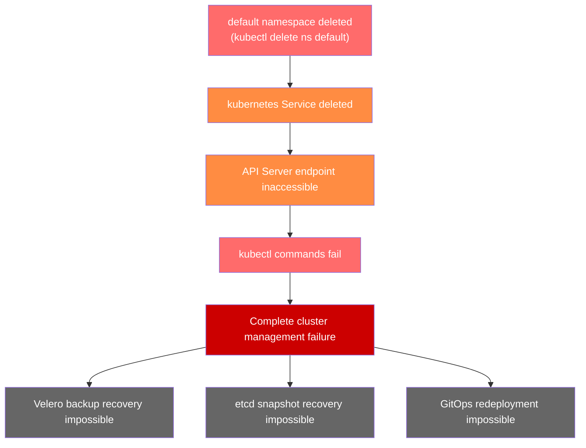
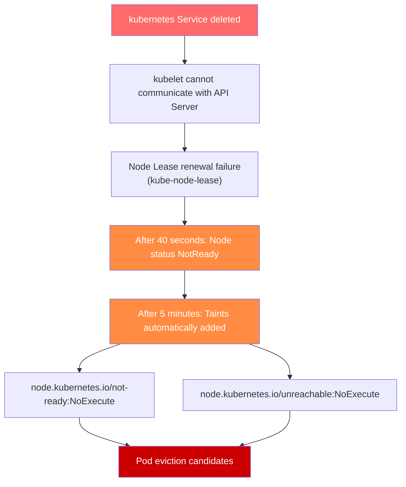

# EKS Default Namespace Deletion Incident Response Guide

> **Created**: 2025-01-07 | **Updated**: 2026-02-14 | **Reading time**: ~12 min


## 1. Overview (TL;DR)

:::danger Critical Alert
Deleting the default namespace in an EKS cluster blocks all access to the Control Plane. kubectl commands will not work, and recovery is not possible through Velero or etcd backups. The default namespace is a critical cluster resource that must be protected from deletion. It is strongly recommended to use Admission Controllers or other access control mechanisms to manage it carefully.
:::

- **Root Cause**: Deleting the `default` namespace also deletes the `kubernetes` Service
- **Impact Scope**: API Server access lost → Complete cluster management failure → Service outage (if prolonged)
- **Recovery Method**: **Must open an AWS Support case** (Severity: Critical)

:::tip Recovery Summary
Open a Critical case with AWS Support, and add your Account Team and WWSO Specialist as CC on the ticket for expedited recovery.
:::

---

## 2. Root Cause Analysis

### 2.1 Role of the Default Namespace

The `default` namespace is not merely a default space for deploying user workloads. Critical Kubernetes cluster resources reside in this namespace.

**Critical resources in the default namespace**:

:::warning Caution
The kubernetes Service is the only path for accessing the API Server from within the cluster. If this Service is deleted, all Kubernetes components lose the ability to communicate with the Control Plane.
:::

### 2.2 Failure Mechanism

The following diagram illustrates the cascading failure that occurs when the `default` namespace is deleted.


```mermaid
flowchart TD
    A["default namespace deleted<br/>(kubectl delete ns default)"] --> B["kubernetes Service deleted"]
    B --> C["API Server endpoint inaccessible"]
    C --> D["kubectl commands fail"]
    D --> E["Complete cluster management failure"]

    E --> F["Velero backup recovery impossible"]
    E --> G["etcd snapshot recovery impossible"]
    E --> H["GitOps redeployment impossible"]

    style A fill:#ff6b6b,color:#fff
    style B fill:#ff8c42,color:#fff
    style C fill:#ff8c42,color:#fff
    style D fill:#ff6b6b,color:#fff
    style E fill:#cc0000,color:#fff
    style F fill:#666,color:#fff
    style G fill:#666,color:#fff
    style H fill:#666,color:#fff
```

**Failure sequence**:

1. **Namespace deletion command executed**: `kubectl delete namespace default`
2. **Cascading deletion**: All resources within the namespace are deleted together
3. **kubernetes Service deleted**: API Server endpoint disappears
4. **Connection severed**: Internal cluster components cannot communicate with the API Server
5. **Unmanageable state**: No kubectl commands can be executed

### Impact on Worker Nodes

When the API Server endpoint disappears and the state persists, cascading effects occur on worker nodes.


```mermaid
flowchart TD
    A["kubernetes Service deleted"] --> B["kubelet cannot communicate with API Server"]
    B --> C["Node Lease renewal failure<br/>(kube-node-lease)"]
    C --> D["After 40 seconds: Node status NotReady"]
    D --> E["After 5 minutes: Taints automatically added"]
    E --> F["node.kubernetes.io/not-ready:NoExecute"]
    E --> G["node.kubernetes.io/unreachable:NoExecute"]
    F --> H["Pod eviction candidates"]
    G --> H

    style A fill:#ff6b6b,color:#fff
    style D fill:#ff8c42,color:#fff
    style E fill:#ff8c42,color:#fff
    style H fill:#cc0000,color:#fff
```

**Node state changes over time**:

:::warning Important
In this situation, the Control Plane itself is inaccessible, so the Node Controller cannot actually update node states or add taints. As a result, the entire cluster enters a "frozen" state where existing running Pods continue to operate, but new scheduling or state changes are impossible.
:::

### Service Impact in Frozen State

When the cluster enters a frozen state, **existing workloads continue to operate for a period**, but as time passes, serious service impacts occur.

**Immediately affected areas**:

- New Pod scheduling impossible
- Pod restart/redeployment impossible
- ConfigMap and Secret change propagation impossible
- HPA (Horizontal Pod Autoscaler) scaling impossible

**Service impact over time**:

:::danger Particularly Dangerous Scenarios

- Service discovery failure due to DNS cache expiration or TLS certificate expiration causing communication loss
- If a Pod is OOMKilled or crashes, **restart is impossible**
- If a node fails, **all workloads on that node are lost**
- ALB/NLB Target Group updates impossible, leading to **traffic routing failures**

The impact scope expands over time, so it is critical to **contact AWS Support as quickly as possible**.
:::

---

## 3. Incident Response Procedure

### Step 1: Confirm the Incident

When a failure caused by `default` namespace deletion is suspected, first verify the cluster state.

### 1-1. kubectl Access Test

First, check if kubectl commands work normally.

```bash
# Attempt to query cluster info
kubectl cluster-info

# Expected error messages
# Unable to connect to the server: dial tcp: lookup kubernetes on 10.100.0.10:53: no such host
# or
# The connection to the server <cluster-endpoint> was refused
```

:::warning Caution
If you see errors like the above, the kubernetes Service has been deleted and the API Server is inaccessible.
:::

### 1-2. Check Cluster Status via AWS CLI

Even if kubectl is not working, you can check the EKS cluster status through the AWS CLI.

```bash
# Check cluster status
aws eks describe-cluster \
  --name <cluster-name> \
  --query 'cluster.{Name:name,Status:status,Endpoint:endpoint,Version:version}' \
  --output table

# Expected output (cluster itself shows ACTIVE status)
# -------------------------------------------------------------------
# |                        DescribeCluster                          |
# +----------+------------------------------------------------------+
# |  Name    |  my-eks-cluster                                      |
# |  Status  |  ACTIVE                                              |
# |  Endpoint|  https://XXXXX.gr7.ap-northeast-2.eks.amazonaws.com  |
# |  Version |  1.31                                                |
# +----------+------------------------------------------------------+
```

```bash
# Check node group status
aws eks list-nodegroups --cluster-name <cluster-name>

aws eks describe-nodegroup \
  --cluster-name <cluster-name> \
  --nodegroup-name <nodegroup-name> \
  --query 'nodegroup.{Name:nodegroupName,Status:status,DesiredSize:scalingConfig.desiredSize}' \
  --output table
```

### 1-3. Incident Determination Criteria

:::tip Key Point
If the cluster appears ACTIVE in the AWS Console or CLI but kubectl commands do not work at all, you should suspect default namespace deletion.
:::

**Checkpoint**: If the above symptoms are confirmed, proceed immediately to **Step 2: Open AWS Support Case**.

### Step 2: Open AWS Support Case

Failures caused by `default` namespace deletion can **only be recovered through AWS Support**. Open a case immediately.

### 2-1. Case Information

### 2-2. Case Body Template

Copy the template below and paste it into the case body.

```text
[URGENT] EKS cluster Control Plane inaccessible due to default namespace deletion

■ Cluster Information
- Cluster Name: <cluster name>
- Region: <region>
- Account ID: <AWS account ID>
- Cluster Version: <Kubernetes version>

■ Incident Details
- Occurrence Time: <YYYY-MM-DD HH:MM UTC>
- Symptoms: kubectl commands fail after default namespace deletion
- Impact Scope: Complete cluster management failure

■ Confirmed Information
- Cluster status via AWS CLI: ACTIVE
- kubectl cluster-info result: Connection failed
- kubectl get ns default result: Connection failed

■ Request
Requesting recovery of the default namespace and kubernetes Service.
This is a production environment requiring urgent recovery.

■ Contact Information
- Contact Person: <name>
- Phone: <phone number>
- Email: <email>
```

### 2-3. How to Open a Case in AWS Console

1. Access AWS Support Center
2. Click **Create case**
3. Select **Technical**
4. Service: Select **Elastic Kubernetes Service (EKS)**
5. Category: Select **Cluster Issue**
6. Severity: Select **Critical - Business-critical system down** (only available with Enterprise Support plan)
7. Paste the template above into the body
8. Select **Phone** in Contact options (for faster response)
9. Click **Submit**

:::warning Important
After opening the case, be sure to record the case ID. You will need it when contacting the Account Team and WWSO Specialist.
:::

### Step 3: Contact Account Team/WWSO Specialist

Simultaneously with opening the AWS Support case, contact the Account Team and WWSO (Worldwide Specialist Organization) Specialist to expedite recovery.

### 3-1. Add CC to the Ticket

Add the Account Team and WWSO Specialist as CC on the AWS Support case.

1. Navigate to the **Correspondence** section of the opened case
2. Click the **Reply** button
3. Add the following content to request CC

```text
CC Request:
- AWS Account Team: <Account Manager name/email>
- WWSO EKS Specialist: <Specialist name/email (if known)>

This is a production environment requiring urgent recovery.
Requesting support from Account Team and EKS Specialist.
```

### 3-2. Direct Contact with Account Team

Contact the Account Team directly, separate from the AWS Support case.

**Email Template**:

```text
Subject: [URGENT] EKS Cluster Incident - Support Case #<case ID>

Hello,

We are contacting you regarding an urgent incident in our production EKS cluster.

■ Incident Summary
- Cluster: <cluster name>
- Symptoms: Control Plane inaccessible due to default namespace deletion
- Support Case ID: <case ID>

■ Request
Requesting priority escalation of this case and connection to an EKS Specialist.

Thank you.
<name>
<contact information>
```

**Slack/SMS Message** (if Account Team channel exists):

```text
[URGENT] EKS Cluster Incident

- Account: <account ID>
- Cluster: <cluster name>
- Issue: Control Plane inaccessible due to default namespace deletion
- Support Case: #<case ID>

Production environment - requesting urgent support.
```

### 3-3. Contact WWSO Specialist

If you know a WWSO EKS Specialist, contact them directly. Contacting a specialist allows them to use internal tickets to escalate the importance of the ticket and directly request work from the assigned engineer through the internal pipeline.

### 3-4. Contact Checklist

### Step 4: Post-Recovery Verification

Once the `default` namespace is recovered through AWS Support, verify that the cluster is functioning normally.

### 4-1. Basic Connectivity Verification

```bash
# 1. Verify cluster connectivity
kubectl cluster-info

# Expected output:
# Kubernetes control plane is running at https://XXXXX.gr7.ap-northeast-2.eks.amazonaws.com
# CoreDNS is running at https://XXXXX.gr7.ap-northeast-2.eks.amazonaws.com/api/v1/namespaces/kube-system/services/kube-dns:dns/proxy
```

```bash
# 2. Verify default namespace exists
kubectl get namespace default

# Expected output:
# NAME      STATUS   AGE
# default   Active   <time>
```

```bash
# 3. Verify kubernetes Service
kubectl get svc kubernetes -n default

# Expected output:
# NAME         TYPE        CLUSTER-IP   EXTERNAL-IP   PORT(S)   AGE
# kubernetes   ClusterIP   10.100.0.1   <none>        443/TCP   <time>
```

### 4-2. Core Component Status Verification

```bash
# 4. Check node status
kubectl get nodes

# Verify all nodes are in Ready state
```

```bash
# 5. Check system Pod status
kubectl get pods -n kube-system

# Verify all Pods are in Running state
# Especially check coredns, kube-proxy, aws-node
```

```bash
# 6. Verify all namespaces
kubectl get namespaces

# Verify existence of default, kube-system, kube-public, kube-node-lease
```

### 4-3. API Server Functionality Verification

```bash
# 7. API resource query test
kubectl api-resources | head -20

# 8. Simple resource create/delete test (optional)
kubectl run test-pod --image=nginx --restart=Never -n default
kubectl get pod test-pod -n default
kubectl delete pod test-pod -n default
```

**Verification Checklist**:

### Step 5: Workload Inspection

After recovery, inspect that existing workloads are functioning normally.

### 5-1. Workload Status Inspection

```bash
# 1. Check Pod status across all namespaces
kubectl get pods --all-namespaces | grep -v Running | grep -v Completed

# Identify Pods not in Running or Completed state
```

```bash
# 2. Check Deployment status
kubectl get deployments --all-namespaces

# Verify the READY column matches desired and actual replica counts
```

```bash
# 3. Check StatefulSet status
kubectl get statefulsets --all-namespaces
```

```bash
# 4. Check DaemonSet status
kubectl get daemonsets --all-namespaces

# Verify DESIRED and READY counts match
```

### 5-2. Service Connectivity Inspection

```bash
# 5. Verify Services and Endpoints
kubectl get svc --all-namespaces
kubectl get endpoints --all-namespaces

# Verify IPs are properly assigned to Endpoints
```

```bash
# 6. Check Ingress status (if applicable)
kubectl get ingress --all-namespaces
```

### 5-3. Storage Inspection

```bash
# 7. Check PersistentVolumeClaim status
kubectl get pvc --all-namespaces

# Verify all PVCs are in Bound state
```

```bash
# 8. Check PersistentVolume status
kubectl get pv

# Verify all PVs are in Bound state
```

### 5-4. Event and Log Inspection

```bash
# 9. Check recent Warning events
kubectl get events --all-namespaces --field-selector type=Warning --sort-by='.lastTimestamp' | tail -20
```

```bash
# 10. Check logs of problematic Pods
kubectl logs <pod-name> -n <namespace> --tail=100
```

### 5-5. Workload Inspection Checklist

:::tip
Jobs or CronJobs may have failed during the incident period. Manually re-run them if necessary.
:::

```bash
# Check failed Jobs
kubectl get jobs --all-namespaces --field-selector status.successful=0
```

**Final Checkpoint**: Once all workloads are confirmed to be in normal state, the incident response is complete. Then review **prevention measures**.

---

## 4. Critical Resource List

### 4.1 Critical Namespaces

Beyond the `default` namespace, there are system namespaces whose deletion would have fatal impacts on the cluster. These namespaces must never be deleted.

:::danger Critical Warning
Deleting the default and kube-system namespaces makes kubectl access itself impossible, preventing manual recovery. Recovery must be done through AWS Support.
:::

**Detailed roles of each namespace**:

**default**:

- `kubernetes` Service: Endpoint for accessing the API Server from within the cluster
- `default` ServiceAccount: Default authentication principal for Pods without a specified ServiceAccount

**kube-system**:

- Namespace where all essential system components for cluster operations are deployed
- EKS Add-ons (CoreDNS, kube-proxy, VPC CNI) and controllers are located here

**kube-public**:

- Stores public information readable by unauthenticated users
- `cluster-info` ConfigMap contains cluster CA certificate and API Server address

**kube-node-lease**:

- Stores Lease objects for each node, serving as heartbeats
- Node Controller uses this information to determine node status

### 4.2 kube-system Core Components

The `kube-system` namespace contains essential components for cluster operations. Deleting or modifying these components individually can cause serious failures.

### EKS Core Add-ons

### EKS Storage Components

### Networking and Load Balancing Components

:::tip
Components managed as EKS Add-ons (CoreDNS, kube-proxy, VPC CNI, EBS CSI Driver) can be recovered by reinstalling the Add-on through the AWS Console or CLI.
:::

```bash
# Check EKS Add-on status
aws eks list-addons --cluster-name <cluster-name>

# Add-on reinstallation example (CoreDNS)
aws eks create-addon \
  --cluster-name <cluster-name> \
  --addon-name coredns \
  --resolve-conflicts OVERWRITE
```

:::warning Caution
The above recovery method can only be used when the kube-system namespace exists and kubectl access is available. If the namespace itself has been deleted, AWS Support is required.
:::

### 4.3 Cluster-Scoped Resources

Cluster-scoped resources that do not belong to any namespace can also affect the entire cluster when deleted or modified.

### RBAC-Related Resources

:::warning Particularly Dangerous ClusterRole/ClusterRoleBindings

- `system:node` / `system:node` binding: Deletion causes **all nodes to lose communication with API Server**
- `system:kube-controller-manager`: Deletion causes **controller manager to stop operating**
- `system:kube-scheduler`: Deletion causes **Pod scheduling to stop**
:::

### CRD (Custom Resource Definition)

:::warning CRD Deletion Warning
Deleting a CRD also cascading deletes all Custom Resources created from that CRD. For example, deleting Cert-Manager's Certificate CRD will delete all Certificate resources in the cluster.
:::

### Storage-Related Resources

### Node and Network-Related Resources

### EKS-Specific Resources

:::tip Best Practice
Always create backups before modifying or deleting cluster-scoped resources.
:::

```bash
# ClusterRole backup example
kubectl get clusterrole <role-name> -o yaml > clusterrole-backup.yaml

# Backup all ClusterRoles
kubectl get clusterroles -o yaml > all-clusterroles-backup.yaml

# CRD backup (does not include CRs)
kubectl get crd <crd-name> -o yaml > crd-backup.yaml
```

---

## 5. Prevention Strategies

### 5.1 Resource Protection via Admission Controllers

Kubernetes Admission Controllers can proactively block deletion of critical resources. Here we introduce an example using Kyverno.

### Preventing Critical Namespace Deletion with Kyverno

```yaml
apiVersion: kyverno.io/v1
kind: ClusterPolicy
metadata:
  name: protect-critical-namespaces
spec:
  validationFailureAction: Enforce
  background: false
  rules:
    - name: block-critical-namespace-deletion
      match:
        any:
          - resources:
              kinds:
                - Namespace
              names:
                - default
                - kube-system
                - kube-public
                - kube-node-lease
      exclude:
        any:
          - clusterRoles:
              - cluster-admin
      validate:
        message: "Deletion of critical namespace '{{request.object.metadata.name}}' has been blocked."
        deny:
          conditions:
            all:
              - key: "{{request.operation}}"
                operator: Equals
                value: DELETE
```

When this policy is applied, requests to delete critical namespaces from users without the `cluster-admin` role will be denied.

### Other Admission Controller Options

Various Admission Controllers can be used beyond Kyverno.

:::tip Recommendation
Choose based on your team's tech stack and policy complexity. For simple resource protection policies, Kyverno can be applied quickly.
:::

### 5.2 GitOps and KRMOps-Based Operations

Adopting GitOps and KRMOps (Kubernetes Resource Model Operations) based operational practices enables declarative management of cluster resources and rapid recovery from unintended changes.

### EKS Auto Mode ArgoCD Capability

EKS Auto Mode provides ArgoCD out of the box, making it easy to start GitOps-based operations.

```yaml
# ArgoCD Application example - Critical resource management
apiVersion: argoproj.io/v1alpha1
kind: Application
metadata:
  name: cluster-critical-resources
  namespace: argocd
spec:
  project: default
  source:
    repoURL: https://github.com/your-org/k8s-manifests.git
    targetRevision: main
    path: cluster-critical
  destination:
    server: https://kubernetes.default.svc
    namespace: default
  syncPolicy:
    automated:
      prune: false      # Prevent automatic deletion of critical resources
      selfHeal: true    # Automatic recovery on drift
    syncOptions:
      - CreateNamespace=false
```

**GitOps prevention benefits**:

:::tip
Separate critical namespaces and resources into a dedicated ArgoCD Application, and set prune: false and selfHeal: true for protection.
:::

### KRMOps Strategy with ACK and KRO

Using **ACK (AWS Controllers for Kubernetes)** and **KRO (Kube Resource Orchestrator)**, you can manage AWS infrastructure as Kubernetes Resource Model.

**AWS Resource Management with ACK**:

```yaml
# Declarative S3 bucket management example using ACK
apiVersion: s3.services.k8s.aws/v1alpha1
kind: Bucket
metadata:
  name: my-app-bucket
  namespace: default
spec:
  name: my-app-bucket-12345
  tagging:
    tagSet:
      - key: Environment
        value: Production
```

**Composite Resource Orchestration with KRO**:

```yaml
# KRO ResourceGroup example - Application stack definition
apiVersion: kro.run/v1alpha1
kind: ResourceGroup
metadata:
  name: web-application
spec:
  schema:
    apiVersion: v1alpha1
    kind: WebApplication
    spec:
      name: string
      replicas: integer | default=2
  resources:
    - id: deployment
      template:
        apiVersion: apps/v1
        kind: Deployment
        metadata:
          name: ${schema.spec.name}
        spec:
          replicas: ${schema.spec.replicas}
          # ... omitted
    - id: service
      template:
        apiVersion: v1
        kind: Service
        # ... omitted
```

**Benefits of KRMOps**:

:::tip Recommendation
Using ACK and KRO together enables Kubernetes-style unified management of not only the EKS cluster but also associated AWS resources (VPC, IAM, RDS, etc.).
:::

**References**:

- AWS Controllers for Kubernetes (ACK)
- Kube Resource Orchestrator (KRO)
- EKS Auto Mode Documentation

### 5.3 EKS Access Entry-Based Access Control

EKS Access Entry overcomes the limitations of `aws-auth` ConfigMap and provides safer cluster access management.

### Problems with aws-auth ConfigMap

The existing `aws-auth` ConfigMap approach has the following risks:

:::warning Caution
If the aws-auth ConfigMap is deleted or corrupted, all IAM-based authentication fails, making cluster access impossible. Recovery also requires AWS Support in this case.
:::

### Transitioning to EKS Access Entry

EKS Access Entry manages cluster access through the AWS API, eliminating the risks of `aws-auth` ConfigMap.

**Access Entry Creation Example**:

```bash
# Create admin Access Entry
aws eks create-access-entry \
  --cluster-name my-cluster \
  --principal-arn arn:aws:iam::XXXXXXXXXXXX:role/EKSAdminRole \
  --type STANDARD

# Associate cluster admin policy
aws eks associate-access-policy \
  --cluster-name my-cluster \
  --principal-arn arn:aws:iam::XXXXXXXXXXXX:role/EKSAdminRole \
  --policy-arn arn:aws:eks::aws:cluster-access-policy/AmazonEKSClusterAdminPolicy \
  --access-scope type=cluster
```

**Namespace-Level Access Control**:

```bash
# Set developer permissions limited to specific namespaces
aws eks create-access-entry \
  --cluster-name my-cluster \
  --principal-arn arn:aws:iam::XXXXXXXXXXXX:role/DevTeamRole \
  --type STANDARD

aws eks associate-access-policy \
  --cluster-name my-cluster \
  --principal-arn arn:aws:iam::XXXXXXXXXXXX:role/DevTeamRole \
  --policy-arn arn:aws:eks::aws:cluster-access-policy/AmazonEKSEditPolicy \
  --access-scope type=namespace,namespaces=dev,staging
```

**Benefits of EKS Access Entry**:

**Pre-defined Access Policies**:

:::tip Recommendations

1. **New clusters**: Use only EKS Access Entry from the start (`--bootstrap-cluster-creator-admin-permissions` option)
2. **Existing clusters**: Gradually migrate to Access Entry, then remove `aws-auth` ConfigMap dependency
3. **Least privilege principle**: Use namespace-scoped permissions instead of cluster-wide permissions
4. **Emergency recovery account**: Set up a separate IAM Role with cluster admin permissions via Access Entry to prepare for lockout situations
:::

**Migration Checklist**:

**References**:

- EKS Cluster Access Management
- Migrating from aws-auth ConfigMap

---

## 6. Summary

### 6.1 Key Takeaways

:::danger Core Message
Deleting the default or kube-system namespaces makes kubectl access itself impossible, preventing manual recovery. Recovery is only possible through AWS Support.
:::

### 6.2 References

### EKS Official Documentation

- Amazon EKS Best Practices Guide
- EKS Cluster Access Management
- Migrating from aws-auth ConfigMap to Access Entries
- EKS Add-ons
- EKS Auto Mode

### Kubernetes Official Documentation

- Kubernetes RBAC Authorization
- Kubernetes Namespaces
- Admission Controllers Reference

### Admission Controller Tools

- Kyverno - Kubernetes Native Policy Management
- OPA Gatekeeper - Policy Controller for Kubernetes

### GitOps and KRMOps Tools

- ArgoCD - Declarative GitOps CD for Kubernetes
- AWS Controllers for Kubernetes (ACK)
- Kube Resource Orchestrator (KRO)
