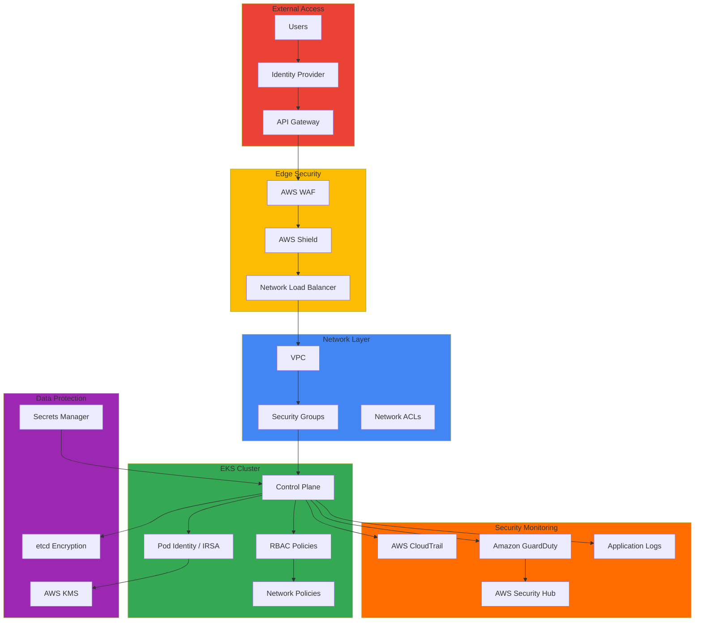

# Security & Governance

> 📅 **Created**: 2025-02-05 | **Updated**: 2026-02-13 | ⏱️ **Reading Time**: ~10 minutes

In modern cloud environments, security extends beyond simply building firewalls to require a defense-in-depth strategy and continuous security posture assessment. Security hardening in Amazon EKS environments requires a comprehensive approach covering everything from cluster-level access control to network isolation, data encryption, and runtime security monitoring. This section addresses security architecture design and implementation methods based on the Defense in Depth principle.

Security governance goes beyond technical controls to embed organizational policies, processes, and compliance requirements into code and infrastructure. In regulated industries, including finance, compliance with frameworks such as PCI-DSS, SOC 2, and ISO 27001 is mandatory, requiring automated policy enforcement, continuous audit logging, and real-time threat detection systems. In Kubernetes-based environments, a robust security posture can be established by integrating native security features like RBAC, Network Policy, and Pod Security Standards with AWS cloud-native services such as IAM, KMS, and GuardDuty.

Incident response capability is a core element of security strategy. Operating under the premise that perfect defense is impossible, it's crucial to have swift detection, accurate analysis, effective isolation, and systematic recovery processes when security incidents occur. API audit logs through CloudTrail, network traffic analysis through VPC Flow Logs, and anomalous behavior detection through runtime security tools like Falco form the foundation of incident response. Furthermore, security posture should be continuously improved by identifying root causes through post-incident analysis and automating recurrence prevention measures.

Security is not a one-time configuration but an area requiring continuous evaluation and improvement. Security vulnerabilities must be proactively discovered and addressed through regular vulnerability scanning, CIS benchmark-based security assessments, and penetration testing. Applying Zero Trust principles to deny all access by default and permit only explicitly verified requests is fundamental to modern security architecture.

## Key Documents

**Operations Security & Incident Management**

[1. Default Namespace Incident Response](./default-namespace-incident.md) - Default namespace security threat analysis, incident detection and response procedures, post-incident analysis and improvement measures, security monitoring automation

**Identity & Access Management**

[2. Identity-First Security Architecture](./identity-first-security.md) - EKS Pod Identity-based zero-trust access control, migration from IRSA to Pod Identity, least privilege principle automation

**Threat Detection & Response**

[3. GuardDuty Extended Threat Detection](./guardduty-extended-threat-detection.md) - EC2/ECS host and container signal correlation analysis, MITRE ATT&CK mapping, automated threat response

**Policy Management**

[4. Kyverno-based Policy Management](./kyverno-policy-management.md) - Kyverno v1.16 CEL-based policies, namespace-level policies, policy exception management, OPA Gatekeeper comparison

**Supply Chain Security**

[5. Container Supply Chain Security](./supply-chain-security.md) - ECR image scanning and signing, Sigstore/Cosign integration, SBOM generation and management, CI/CD security gates

## Architecture Patterns

## Security Domains

The security architecture consists of three layers: cluster level, workload level, and data level. Cluster security is implemented through the integration of AWS IAM and Kubernetes RBAC, centered on authentication and authorization management. Using IRSA (IAM Roles for Service Accounts), fine-grained AWS resource access permissions can be granted at the Pod level, minimizing the attack surface by applying the principle of least privilege. User authentication security can be strengthened by integrating with enterprise SSO systems through OIDC provider integration and applying MFA.

:::info EKS Pod Identity (2025 Recommended)
EKS Pod Identity is an evolved form of IRSA, offering simpler configuration and enhanced security. IAM roles can be directly bound to Pods without OIDC provider setup, and cross-account access is simplified. For new projects, prioritize evaluating Pod Identity.
:::

Network security is a core element of defense in depth, controlling Pod-to-Pod communication and implementing namespace isolation through Kubernetes Network Policies. Introducing a service mesh (Istio, Linkerd) enables automatic mTLS configuration to encrypt all inter-service communication and automate certificate management. At the VPC level, public and private subnets are separated, outbound traffic is controlled through NAT Gateway, and network traffic is continuously monitored through VPC Flow Logs.

Workload security strengthens the security of container execution environments through Pod Security Standards. Applying the Restricted level blocks root privilege execution, restricts host network access, and removes dangerous Capabilities. Through Security Context configuration, read-only file systems are enforced and execution privileges are minimized. Container images are scanned in CI/CD pipelines with tools like Trivy to preemptively block vulnerabilities, and policies are enforced to use only signed images from approved registries.

Secret management is centrally managed by integrating AWS Secrets Manager with External Secrets Operator. Secrets are stored in external secret stores rather than directly as Kubernetes Secrets, minimizing secret exposure risks through automatic rotation and periodic synchronization. Data encryption keys are protected through KMS-based Envelope encryption, and key rotation policies are applied to manage long-term key exposure risks.

Data security includes encryption of both data at rest and data in transit. EBS volumes are protected at the block level through KMS-based encryption, and etcd is transparently encrypted by integrating with AWS KMS to protect the Kubernetes configuration database. At the application level, end-to-end encryption for sensitive data provides multi-layer protection. Data in transit is encrypted through TLS/mTLS, the API server is protected by TLS, and mTLS is automatically applied to Pod-to-Pod communication through the service mesh. At the ingress level, HTTPS is enforced, and certificates are automatically renewed through Let's Encrypt and Cert Manager.

## Compliance Frameworks

Compliance requires the integration of technical implementation and organizational processes. SOC 2 covers data security, availability, and processing integrity, implemented in EKS environments through high-availability architecture, data encryption, and access control. PCI-DSS is an essential standard for payment card data processing, requiring network isolation, data encryption, access control, and regular security assessments. HIPAA is a regulation for protecting health information, with data encryption and audit logging as key components. GDPR requires data minimization, user rights protection, and data processing transparency for personal information protection, while ISO 27001 provides an overall framework for information security management systems.

Compliance requirements in EKS environments are mapped to technical controls. Access control requirements are implemented through combinations of AWS IAM and Kubernetes RBAC, encryption requirements are met through TLS/mTLS and AWS KMS. Audit requirements are implemented through API call logging via CloudTrail and application log collection, and monitoring requirements are met through real-time threat detection via GuardDuty and Security Hub. Policy enforcement is automated through OPA Gatekeeper at the admission control stage to preemptively block policy violations.

Compliance tools enable automated assessment and continuous monitoring. AWS Config continuously monitors resource configuration and detects policy violations, while Security Hub integrates results from multiple security services to provide a central dashboard. GuardDuty identifies anomalous behavior through machine learning-based threat detection, and CloudTrail provides audit trails by recording all API calls. Inspector assesses vulnerabilities in EC2 instances and container images and provides security recommendations.

## Security Tools & Technologies

Open source security tools are key elements for strengthening Kubernetes environment security. Falco monitors runtime security at the system call level to detect abnormal behavior in real-time. It detects and alerts on unexpected process execution, sensitive file access, network connection attempts, etc. OPA Gatekeeper provides policy-based control, operating as an admission webhook, validating security policies at Pod creation time and blocking deployment on violations. Trivy scans container images and file systems to detect known vulnerabilities, integrating into CI/CD pipelines to prevent vulnerable images from being deployed to production environments. Kube-bench evaluates cluster security configuration based on CIS Kubernetes benchmarks and provides recommendations, while kube-hunter performs penetration testing on clusters to discover potential security vulnerabilities.

AWS native security services provide security features optimized for cloud environments. AWS WAF is a web application firewall that blocks common web attacks like SQL injection and XSS, implementing application-specific security policies through custom rules. AWS Shield automatically provides basic DDoS protection to all AWS services, while Shield Advanced provides advanced protection against large-scale DDoS attacks and 24/7 DDoS response team support. Amazon Inspector continuously assesses vulnerabilities in EC2 instances and container images and provides CVE-based security recommendations, while AWS Systems Manager automates operating system and application patching to quickly resolve vulnerabilities.

## Security Monitoring & Response

Real-time security monitoring is essential for early threat detection and rapid response. Security event logs are collected from multiple sources including CloudTrail, VPC Flow Logs, application logs, and container logs, and integrated into a centralized log repository. Anomalous behavior detection is implemented through machine learning-based analysis and rule-based alerts, with GuardDuty automatically detecting abnormal API call patterns, suspicious network activity, and compromised instance behavior. Automated security response workflows are implemented through EventBridge and Lambda to automatically perform isolation, notification, and recovery operations when specific security events occur.

The incident response process minimizes the impact of security incidents through systematic and repeatable procedures. In the detection phase, security monitoring tools automatically identify anomalies and generate alerts. In the analysis phase, the security team assesses the severity, scope of impact, and attack vectors of the incident to determine response priorities. In the isolation phase, affected resources are separated from the network to prevent further damage propagation. In the recovery phase, compromised systems are restored to normal state and service is resumed. In the post-incident analysis phase, root causes are identified and attack paths are reconstructed, while in the improvement phase, security policies and technical controls are strengthened based on lessons learned to prevent recurrence.

Forensic analysis is the process of understanding the full context of security incidents and collecting evidence. CloudTrail log analysis tracks attackers' API call patterns and privilege escalation attempts, and reviewing VPC Flow Logs identifies abnormal network traffic and data exfiltration attempts. Container logs are collected to analyze application-level attack traces, and network traffic analysis detects communication with C&C servers or internal reconnaissance activities. This forensic data can be used as evidence when legal action is required and provides insights for improving security posture.

## Security Roadmap 2025

### Latest Security Features (AWS re:Invent 2025)

| Feature | Status | Impact |
|---------|--------|--------|
| GuardDuty Extended Threat Detection | GA | Enhanced container threat detection |
| IAM Policy Autopilot | Preview | Code-based least privilege policy generation |
| EKS Pod Identity | GA | IRSA replacement/complement |
| Security Hub Analytics | GA | Real-time risk quantification |
| ECR Enhanced Scanning | GA | Supply chain security enhancement |

### Kyverno v1.16 Key Updates

- **CEL-based Policies (Beta)**: Use Common Expression Language instead of Rego
- **Namespace CEL Policies**: Autonomous policy management per team
- **Granular Policy Exceptions**: Refined exception handling
- **Enhanced Observability**: Policy enforcement metrics and dashboards

## Related Categories

[Hybrid Infrastructure](/docs/hybrid-infrastructure) - Hybrid environment security

[Operations & Observability](/docs/operations-observability) - Security monitoring

[Infrastructure Optimization](/docs/infrastructure-optimization) - Network security
