import Tabs from '@theme/Tabs';
import TabItem from '@theme/TabItem';
import { ChallengeSummary, K8sCoreFeatures, SolutionMapping, ModelServingComparison, InferenceGatewayComparison, ObservabilityComparison, KAgentFeatures, ObservabilityLayerStack, LlmdFeatures, DistributedTrainingStack, GpuInfraStack } from '@site/src/components/AgenticChallengesTables';

> 📅 **撰写日期**: 2025-02-05 | **修改日期**: 2026-02-14 | ⏱️ **阅读时间**: 约 7 分钟

## 简介

在构建和运营 Agentic AI 平台时，平台工程师和架构师面临着与传统 Web 应用根本不同的独特技术挑战。本文分析了 **4 大核心挑战**，并探讨了旨在解决这些挑战的**基于 Kubernetes 的开源生态系统**。

## Agentic AI 平台的 4 大核心技术挑战

利用前沿模型（最新大语言模型）的 Agentic AI 系统与传统 Web 应用有着**根本不同的基础设施需求**。

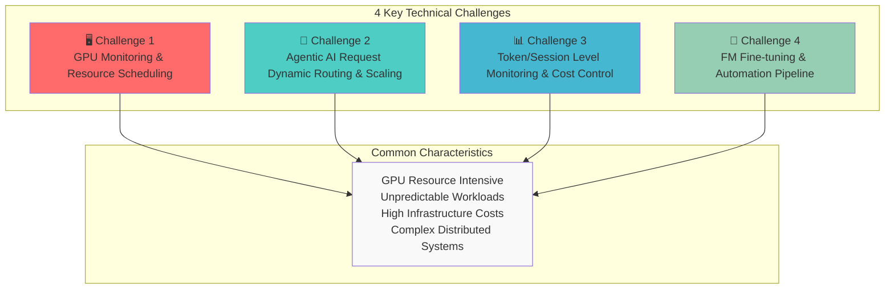

### 挑战概述

<ChallengeSummary />

:::warning 传统基础设施方案的局限性
传统的基于虚拟机的基础设施或手动管理方式无法有效应对 Agentic AI 的**动态且不可预测的工作负载模式**。GPU 资源的高昂成本和复杂的分布式系统要求使得**自动化基础设施管理**成为必需。
:::

---

## 解决之道：云基础设施自动化与 AI 平台的融合

解决 Agentic AI 平台挑战的关键在于**云基础设施自动化与 AI 工作负载的有机融合**。以下是这种融合至关重要的原因：

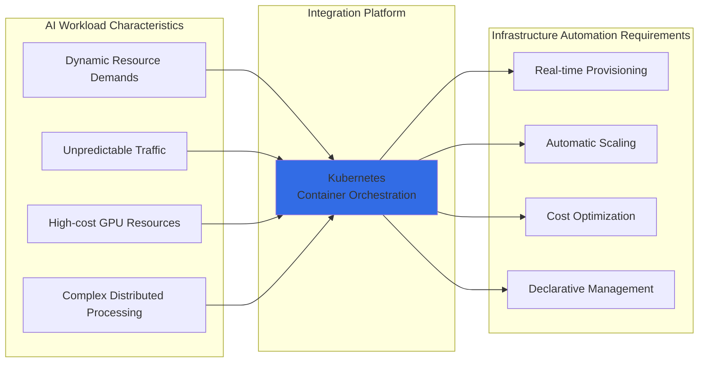

## 为什么选择 Kubernetes？

Kubernetes 是解决 Agentic AI 平台所有挑战的**理想基础平台**：

<K8sCoreFeatures />

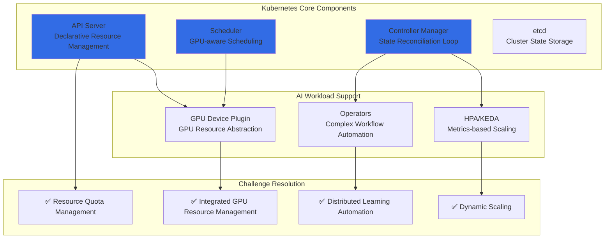

:::info Kubernetes 对 AI 工作负载的支持
Kubernetes 提供了与 AI/ML 生态系统的丰富集成，包括 NVIDIA GPU Operator、Kubeflow 和 KEDA。通过这些集成，GPU 资源管理、分布式训练和模型服务可以在**单一平台上统一管理**。
:::

---

既然我们已经了解了为什么 Kubernetes 是 AI 工作负载的理想选择，接下来让我们看看**针对每个挑战的具体开源解决方案**。

## Kubernetes Agentic AI 解决方案鸟瞰图

Kubernetes 生态系统拥有**专门的开源解决方案**来解决 Agentic AI 平台的每个挑战。这些解决方案被设计为 Kubernetes 原生的，让您能够充分利用**声明式管理、自动扩展和高可用性**的优势。

### 解决方案映射概览

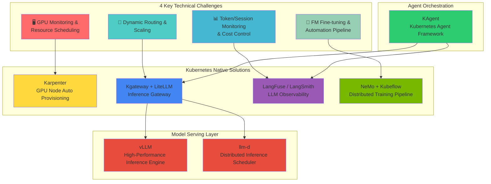

### 挑战对应的解决方案详细映射

<SolutionMapping />

---

到目前为止，我们已经概览了 Kubernetes 生态系统中的各种解决方案。现在让我们从开源架构的角度，深入了解**这些解决方案如何实际集成和协同工作**。

## 开源生态系统与 Kubernetes 集成架构

Agentic AI 平台由各种开源项目组成，它们围绕 Kubernetes 有机地集成在一起。本节说明 **LLM 可观测性、模型服务、向量数据库和 GPU 基础设施**中的核心开源项目如何协作，形成完整的 Agentic AI 平台。

### 1. 模型服务：vLLM + llm-d

**vLLM** 是一个高性能的 LLM 推理服务引擎，通过 PagedAttention **最大化内存效率**。

**llm-d** 是一个在 Kubernetes 环境中**智能分发** LLM 推理请求的调度器。

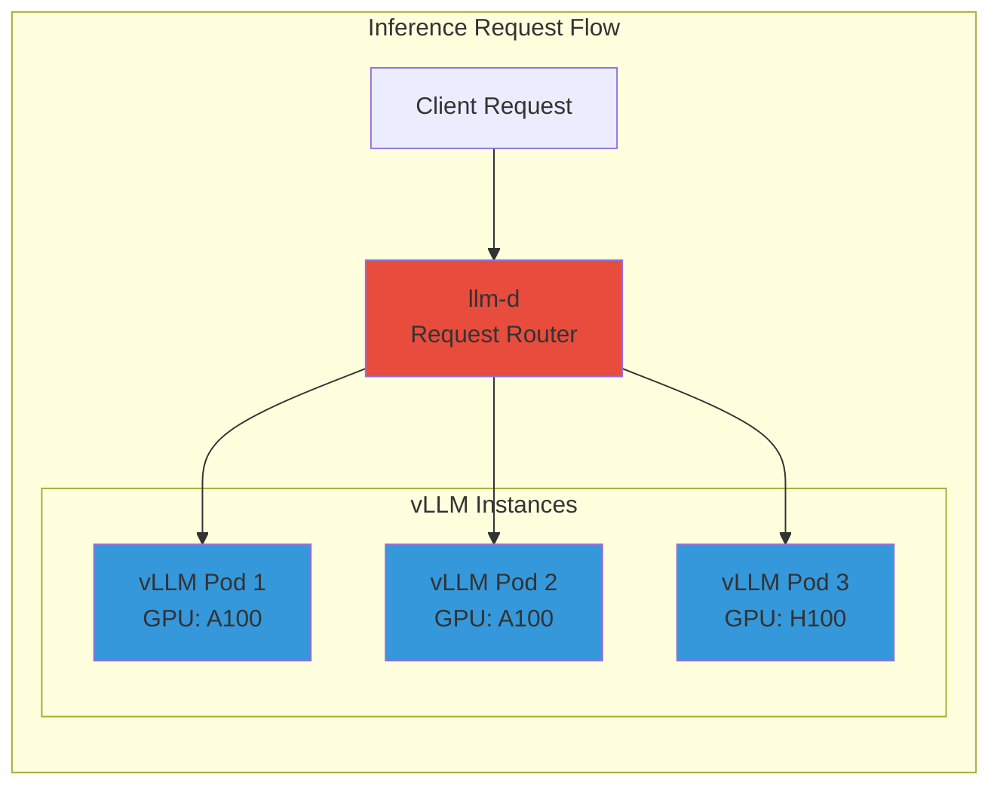

<ModelServingComparison />

**Kubernetes 集成：**

- 以 Kubernetes Deployment 形式部署
- 通过 Service 暴露服务
- 基于队列深度指标通过 HPA 进行扩展
- 通过资源请求/限制进行 GPU 分配

### 2. 推理网关：Kgateway + LiteLLM

**Kgateway** 是一个基于 Kubernetes Gateway API 的 AI 推理网关，提供**多模型路由和流量管理**。

**LiteLLM** 通过统一 API **抽象各种 LLM 提供商**，使模型切换变得简单。

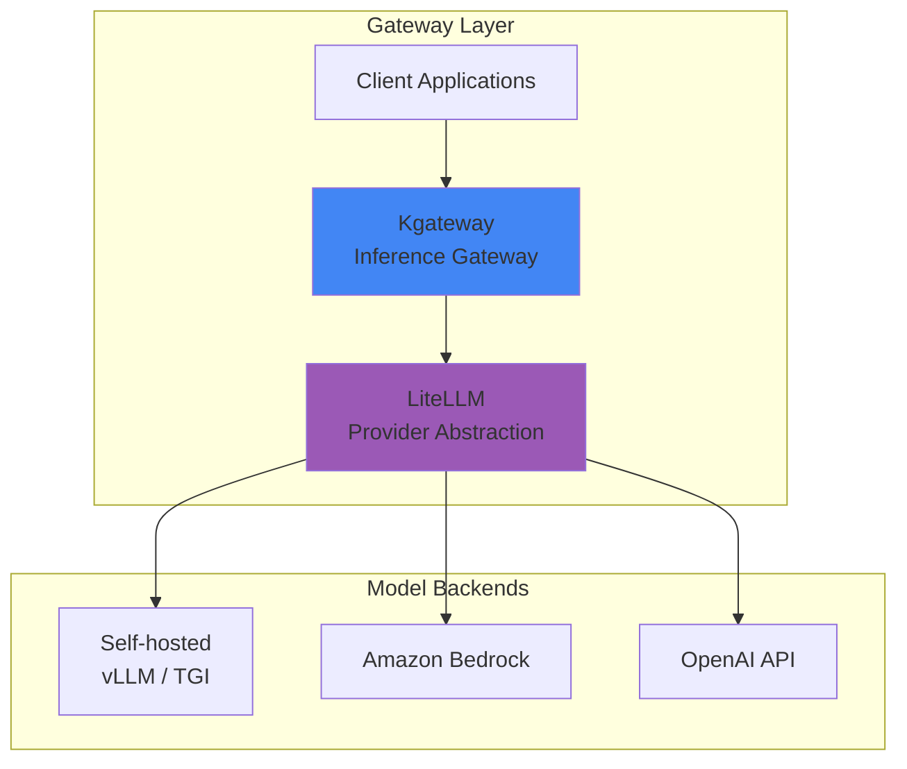

<InferenceGatewayComparison />

**Kubernetes 集成：**

- 实现 Kubernetes Gateway API（标准）
- 通过 HTTPRoute 资源进行声明式路由
- 与 Kubernetes Service 原生集成
- 支持跨命名空间路由

### 3. LLM 可观测性：LangFuse + LangSmith

**LangFuse** 和 **LangSmith** 是**追踪 LLM 应用全生命周期**的可观测性平台。

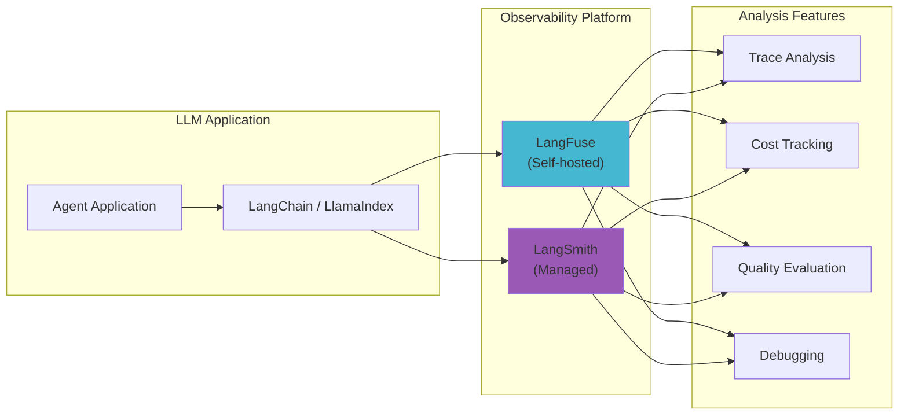

<ObservabilityComparison />

**Kubernetes 集成（LangFuse）：**

- 以 StatefulSet 或 Deployment 形式部署
- 需要 PostgreSQL 后端（可使用托管 RDS 或集群内部署）
- 以 Prometheus 格式暴露指标
- 通过 Pod 中的环境变量进行 SDK 集成

### 4. Agent 编排：KAgent

**KAgent** 是一个 Kubernetes 原生的 AI Agent 框架，**将 Agent 工作流定义为 CRD 并进行管理**。

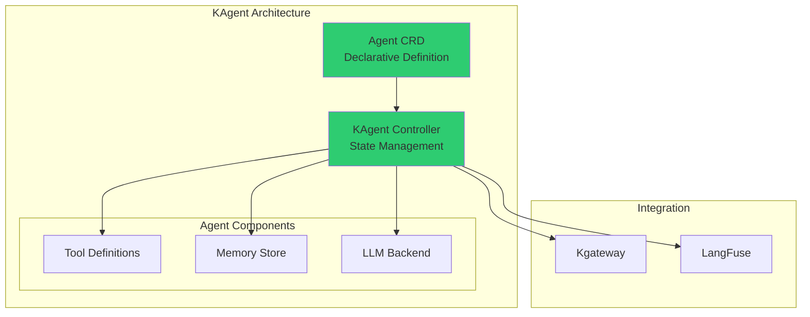

<KAgentFeatures />

**Kubernetes 集成：**

- 通过自定义资源定义（CRD）扩展 Kubernetes
- 控制器模式实现状态协调
- 与 Kubernetes RBAC 原生集成
- 利用 Kubernetes Secrets 管理 API 密钥

### 解决方案栈集成架构

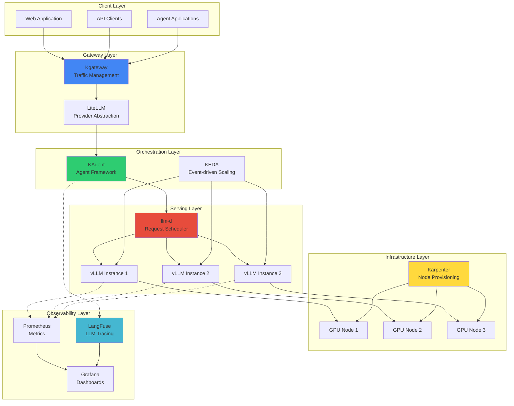

---

### 完整的开源集成架构

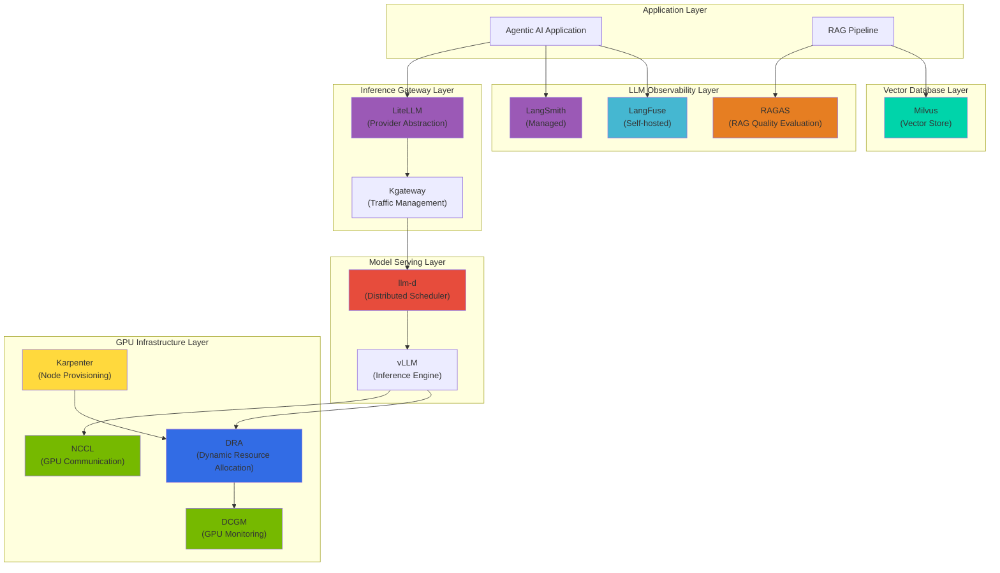

### 各层开源组件角色与集成

#### LLM 可观测性层：LangFuse、LangSmith、RAGAS

**追踪 LLM 应用全生命周期并评估质量**的核心工具。

<ObservabilityLayerStack />

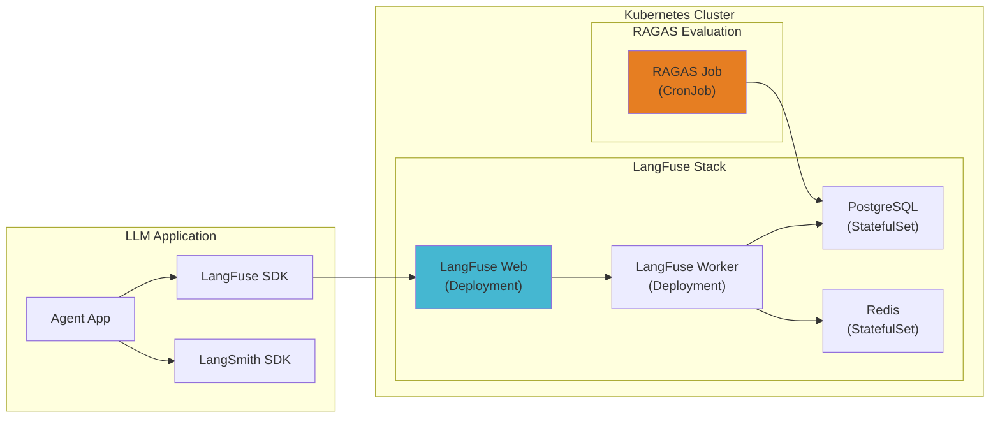

**LangFuse Kubernetes 部署示例：**

```yaml
apiVersion: apps/v1
kind: Deployment
metadata:
  name: langfuse-web
  namespace: observability
spec:
  replicas: 2
  selector:
    matchLabels:
      app: langfuse-web
  template:
    spec:
      containers:
        - name: langfuse
          image: langfuse/langfuse:latest
          env:
            - name: DATABASE_URL
              valueFrom:
                secretKeyRef:
                  name: langfuse-secrets
                  key: database-url
            - name: NEXTAUTH_SECRET
              valueFrom:
                secretKeyRef:
                  name: langfuse-secrets
                  key: nextauth-secret
          resources:
            requests:
              memory: "512Mi"
              cpu: "250m"
---
apiVersion: batch/v1
kind: CronJob
metadata:
  name: ragas-evaluation
  namespace: observability
spec:
  schedule: "0 */6 * * *"  # 每 6 小时运行一次
  jobTemplate:
    spec:
      template:
        spec:
          containers:
            - name: ragas
              image: ragas/ragas:latest
              command: ["python", "-m", "ragas.evaluate"]
              env:
                - name: LANGFUSE_HOST
                  value: "http://langfuse-web:3000"
          restartPolicy: OnFailure
```

#### 推理网关层：LiteLLM

**LiteLLM** 将 100 多个 LLM 提供商抽象为**统一的 OpenAI 兼容 API**。

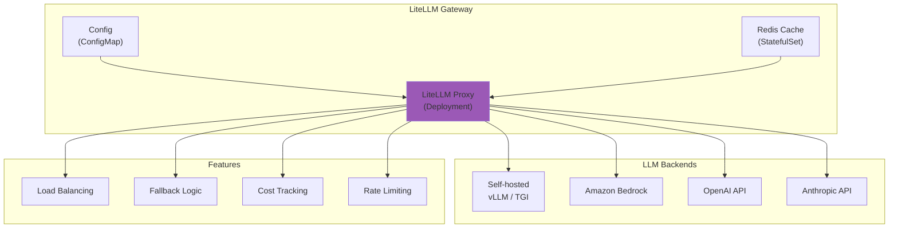

**LiteLLM Kubernetes 部署示例：**

```yaml
apiVersion: apps/v1
kind: Deployment
metadata:
  name: litellm-proxy
  namespace: ai-gateway
spec:
  replicas: 3
  selector:
    matchLabels:
      app: litellm
  template:
    spec:
      containers:
        - name: litellm
          image: ghcr.io/berriai/litellm:main-latest
          ports:
            - containerPort: 4000
          env:
            - name: LITELLM_MASTER_KEY
              valueFrom:
                secretKeyRef:
                  name: litellm-secrets
                  key: master-key
            - name: REDIS_HOST
              value: "redis-cache"
          volumeMounts:
            - name: config
              mountPath: /app/config.yaml
              subPath: config.yaml
      volumes:
        - name: config
          configMap:
            name: litellm-config
---
apiVersion: v1
kind: ConfigMap
metadata:
  name: litellm-config
  namespace: ai-gateway
data:
  config.yaml: |
    model_list:
      - model_name: gpt-4
        litellm_params:
          model: openai/gpt-4
          api_key: os.environ/OPENAI_API_KEY
      - model_name: claude-3
        litellm_params:
          model: anthropic/claude-3-opus
          api_key: os.environ/ANTHROPIC_API_KEY
      - model_name: llama-70b
        litellm_params:
          model: openai/llama-70b
          api_base: http://vllm-llama:8000/v1

    router_settings:
      routing_strategy: least-busy
      enable_fallbacks: true

    general_settings:
      master_key: os.environ/LITELLM_MASTER_KEY
```

#### 分布式推理层：llm-d

**llm-d** 是一个在 Kubernetes 环境中**智能分发** LLM 推理请求的调度器。

<LlmdFeatures />

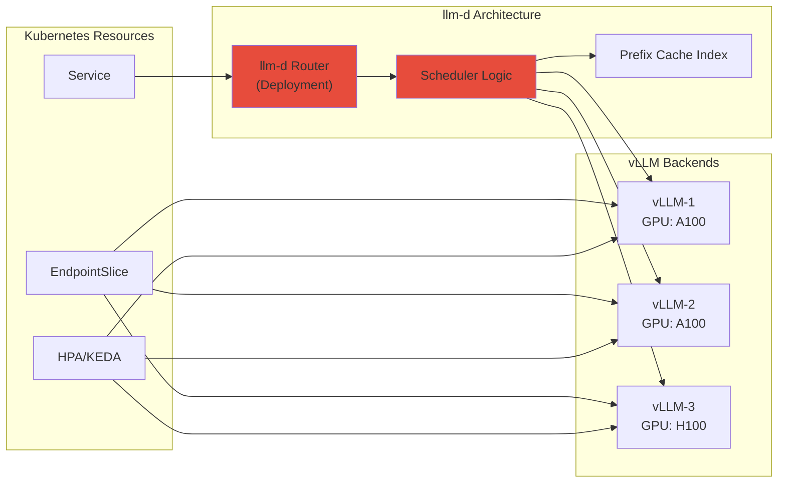

**llm-d Kubernetes 部署示例：**

```yaml
apiVersion: apps/v1
kind: Deployment
metadata:
  name: llm-d-router
  namespace: ai-inference
spec:
  replicas: 2
  selector:
    matchLabels:
      app: llm-d
  template:
    spec:
      containers:
        - name: llm-d
          image: ghcr.io/llm-d/llm-d:latest
          ports:
            - containerPort: 8080
          env:
            - name: BACKENDS
              value: "vllm-0.vllm:8000,vllm-1.vllm:8000,vllm-2.vllm:8000"
            - name: ROUTING_STRATEGY
              value: "prefix-aware"
            - name: PROMETHEUS_ENDPOINT
              value: "http://prometheus:9090"
          resources:
            requests:
              memory: "256Mi"
              cpu: "500m"
---
apiVersion: v1
kind: Service
metadata:
  name: llm-d
  namespace: ai-inference
spec:
  selector:
    app: llm-d
  ports:
    - port: 8080
      targetPort: 8080
```

### 5. 向量数据库层：Milvus

Milvus 是 RAG 管线的核心组件，在 Kubernetes 上以分布式架构运行。

详细信息请参阅 **[Milvus 向量数据库](./milvus-vector-database.md)**。

**Milvus 的核心特性：**

- **分布式架构**：将访问层、协调层、工作节点层和存储层分离，实现独立扩展
- **Kubernetes Operator**：基于 CRD 的声明式管理
- **GPU 加速**：在索引节点上进行 GPU 加速的索引构建
- **S3 集成**：使用 Amazon S3 作为持久化存储

### 6. 分布式训练：NeMo + Kubeflow

**NVIDIA NeMo** 和 **Kubeflow** 为大规模模型提供**自动化分布式训练管线**。

<DistributedTrainingStack />

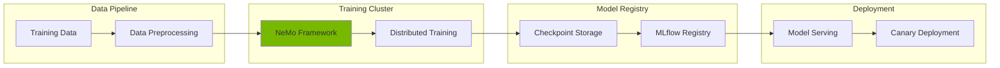

**Kubernetes 集成：**

- Kubeflow Training Operator（PyTorchJob、MPIJob 等）
- 分布式工作负载的 Gang 调度
- 拓扑感知调度（节点亲和性、反亲和性）
- 与 CSI 驱动集成实现共享存储（FSx for Lustre）

---

## GPU 基础设施与资源管理

GPU 资源管理是 Agentic AI 平台的核心。详细信息请参阅：

- **[GPU 资源管理](./gpu-resource-management.md)**：Device Plugin、DRA（动态资源分配）、GPU 拓扑感知调度
- **[NeMo 框架](./nemo-framework.md)**：分布式训练和 NCCL 优化

:::tip 关键 GPU 管理概念

- **Device Plugin**：Kubernetes 基础 GPU 分配机制
- **DRA（动态资源分配）**：Kubernetes 1.26+ 中的灵活资源管理
- **NCCL**：用于分布式 GPU 训练的高性能通信库
:::

### GPU 基础设施栈概览

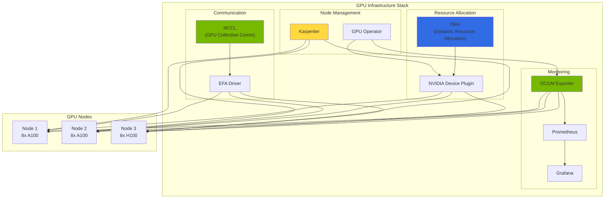

<GpuInfraStack />

---

## 结论：为什么 Agentic AI 选择 Kubernetes？

Kubernetes 提供了使现代 Agentic AI 平台成为可能的**基础设施底层**：

### 核心优势

1. **统一平台**：推理、训练和编排的单一平台
2. **声明式管理**：基础设施即代码，支持版本控制
3. **丰富的生态系统**：面向 AI 工作负载的大量开源解决方案
4. **云端可移植性**：随处运行（本地、AWS、GCP、Azure）
5. **成熟的工具链**：kubectl、Helm、Operator、监控栈
6. **活跃的社区**：Kubernetes AI/ML SIG 推动创新

### 前进之路

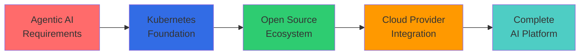

对于构建 Agentic AI 平台的组织：

1. **从 Kubernetes 开始**：在团队中建立 Kubernetes 专业能力
2. **采用开源**：利用经过验证的解决方案（vLLM、LangFuse 等）
3. **与云集成**：将开源与托管服务相结合
4. **自动化基础设施**：实施自动扩展和自动配置
5. **全面可观测**：从第一天起就建立全面的可观测性

:::info 下一步：基于 EKS 的解决方案
有关使用 **Amazon EKS 和 AWS 服务**应对这些挑战的详细解决方案，请参阅 [基于 EKS 的 Agentic AI 解决方案](./agentic-ai-solutions-eks.md)。
:::

---

## 后续步骤

本文探讨了 Agentic AI 工作负载的 4 大核心挑战及基于 Kubernetes 的开源生态系统。

:::info 下一步：基于 EKS 的解决方案
有关使用 **Amazon EKS 和 AWS 服务**解决本文介绍的挑战的具体方法，请参阅 [基于 EKS 的 Agentic AI 解决方案](./agentic-ai-solutions-eks.md)。

下一篇文档涵盖的主题：

- 使用 EKS Auto Mode 构建全自动化集群
- 使用 Karpenter 进行 GPU 节点自动配置
- 与 AWS 服务集成（Bedrock、S3、CloudWatch）
- 生产环境的安全和运维策略
- 实战部署指南与故障排除
:::

---

## 参考资料

### Kubernetes 与基础设施

- [Kubernetes 官方文档](https://kubernetes.io/docs/)
- [Karpenter 官方文档](https://karpenter.sh/docs/)
- [Amazon EKS 最佳实践指南](https://docs.aws.amazon.com/eks/latest/best-practices/introduction.html)
- [NVIDIA GPU Operator 文档](https://docs.nvidia.com/datacenter/cloud-native/gpu-operator/overview.html)
- [KEDA - Kubernetes 事件驱动自动扩展](https://keda.sh/)

### 模型服务与推理

- [vLLM 文档](https://docs.vllm.ai/)
- [llm-d 项目](https://github.com/llm-d/llm-d)
- [Kgateway 文档](https://kgateway.io/docs/)
- [LiteLLM 文档](https://docs.litellm.ai/)

### LLM 可观测性

- [LangFuse 文档](https://langfuse.com/docs)
- [LangSmith 文档](https://docs.smith.langchain.com/)
- [RAGAS 文档](https://docs.ragas.io/)

### 向量数据库

- [Milvus 文档](https://milvus.io/docs)
- [Milvus Operator](https://github.com/milvus-io/milvus-operator)

### GPU 基础设施

- [NVIDIA GPU Operator 文档](https://docs.nvidia.com/datacenter/cloud-native/gpu-operator/latest/)
- [DCGM Exporter](https://github.com/NVIDIA/dcgm-exporter)
- [NCCL 文档](https://docs.nvidia.com/deeplearning/nccl/user-guide/docs/index.html)
- [AWS EFA 文档](https://docs.aws.amazon.com/AWSEC2/latest/UserGuide/efa.html)

### Agent 框架与训练

- [KAgent - Kubernetes Agent 框架](https://github.com/kagent-dev/kagent)
- [NVIDIA NeMo 框架](https://docs.nvidia.com/nemo-framework/user-guide/latest/overview.html)
- [Kubeflow 文档](https://www.kubeflow.org/docs/)
