import Tabs from '@theme/Tabs';
import TabItem from '@theme/TabItem';
import {
  EksKarpenterLayers,
  ClusterAutoscalerVsKarpenter,
  KarpenterKeyFeatures,
  EksAutoModeVsStandard,
  KarpenterGpuOptimization,
  SpotInstancePricingInference,
  SavingsPlansPricingTraining,
  SmallScaleCostCalculation,
  MediumScaleCostCalculation,
  LargeScaleCostCalculation,
  CostOptimizationStrategies,
  TroubleshootingGuide,
  SecurityLayers,
  CostOptimizationDetails,
  TrainingCostOptimization,
  DeploymentTimeComparison,
  EksIntegrationBenefits
} from '@site/src/components/AgenticSolutionsTables';

# 基于 EKS 的 Agentic AI 解决方案

:::info 前置阅读：技术挑战
在阅读本文档之前，请先查阅 [Agentic AI 工作负载的技术挑战](./agentic-ai-challenges.md)。该文档解释了 4 个关键挑战以及基于 Kubernetes 的开源生态系统。
:::

## 概述

本文档提供在 Amazon EKS 上部署 Agentic AI 工作负载的全面解决方案。[技术挑战文档](./agentic-ai-challenges.md) 介绍了用于解决四个关键挑战的开源 Kubernetes 生态系统，而本指南侧重于**最大化 AWS 服务集成的 EKS 原生解决方案**。

**核心关注领域：**

1. EKS + Karpenter 如何解决 GPU 资源管理问题
2. 开源工具的 AWS 原生替代方案
3. 与 AWS 服务集成的生产就绪架构
4. 使用 AWS 特定功能的成本优化策略

---

## Amazon EKS 和 Karpenter：最大化 Kubernetes 优势

### EKS + Karpenter + AWS 集成架构

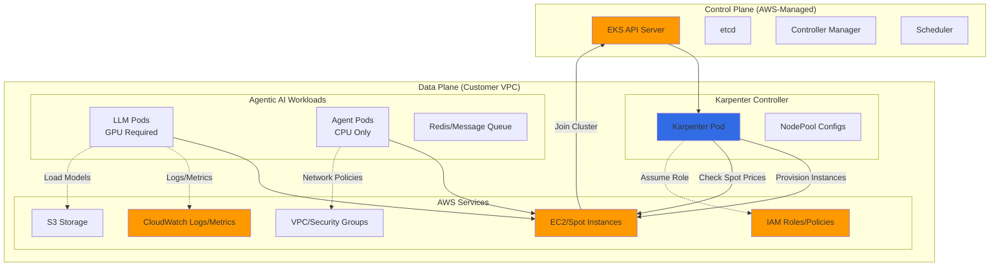

**关键集成点：**

- **托管控制平面**：AWS 负责 API 服务器、etcd 和控制器升级
- **Karpenter 原生**：专为 AWS 构建，集成 EC2/Spot API
- **服务集成**：与 CloudWatch、IAM、VPC、S3 无缝连接
- **安全设计**：Pod IAM 角色（IRSA）、网络策略、静态/传输加密

### 为什么选择 EKS + Karpenter？

<EksKarpenterLayers />
**Karpenter 对 Agentic AI 的优势：**

1. **异构工作负载**：混合仅 CPU 的 Agent 和 GPU 密集型 LLM Pod
2. **突发性**：通过毫秒级配置决策处理突发流量高峰
3. **成本优化**：自动选择 Spot 实例并进行整合
4. **简洁性**：使用声明式 NodePool 代替复杂的 ASG 配置

### EKS Auto Mode

**什么是 EKS Auto Mode？**

EKS Auto Mode 是一个完全托管的节点生命周期产品，自动化管理以下内容：

- **计算管理**：自动节点配置、升级和安全补丁
- **存储配置**：动态 EBS/EFS 卷创建，具有最优性能
- **网络**：自动化 VPC-CNI 配置和 IP 地址管理
- **成本优化**：智能实例选择和 Spot 集成

**对 Agentic AI 的关键优势：**

<ClusterAutoscalerVsKarpenter />
**何时使用 EKS Auto Mode vs. Karpenter：**

<Tabs>
<TabItem value="auto-mode" label="EKS Auto Mode">

**最适合：**

- 希望零基础设施管理的初创团队
- 无复杂 GPU 需求的标准工作负载
- 使用 AWS 优化默认值的简化成本管理
- 以最少配置快速投入生产

**局限性：**

- 对实例类型选择的控制较少
- 在极端成本效率场景中可能无法优化
- GPU 支持取决于 AWS 托管节点类型的可用性

</TabItem>
<TabItem value="karpenter" label="Karpenter">

**最适合：**

- 需要精细控制的生产工作负载
- 具有复杂调度需求的混合 GPU/CPU 工作负载
- 高级成本优化（可节省 70% 以上）
- 自定义实例需求（特定 GPU 类型、网络）

**权衡：**

- 需要管理 Karpenter 控制器
- 配置复杂度更高
- 团队需要 Kubernetes 专业知识

</TabItem>
</Tabs>

**Agentic AI 的建议：**

- **从 EKS Auto Mode 开始**用于快速原型和 MVP
- **升级到 Karpenter** 当需要 GPU 优化或超过 50 个节点时
- **混合方案**：控制平面使用 Auto Mode，GPU 节点使用 Karpenter

### Karpenter vs. Cluster Autoscaler：深入对比

**配置流程对比：**

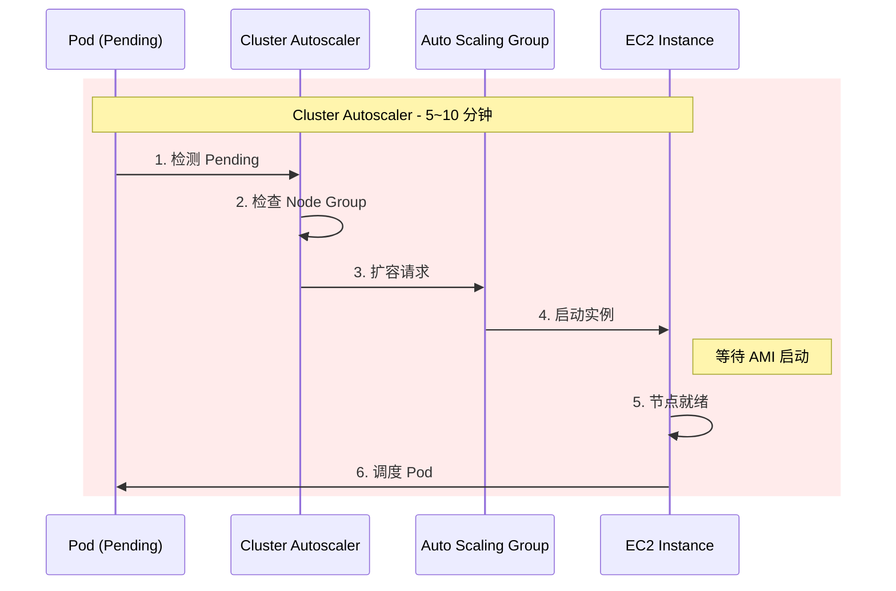

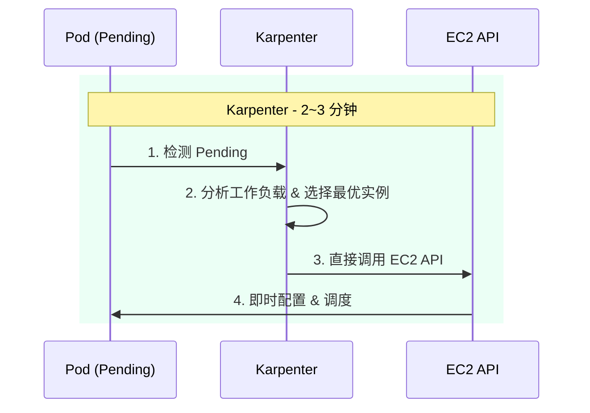

<KarpenterKeyFeatures />
**决策标准：**

<EksAutoModeVsStandard />
---

## 4 个关键技术挑战的详细分析

### 挑战 1：GPU 监控与资源调度

**问题描述：**

- Agent 编排需要实时 GPU 内存和利用率指标
- Kubernetes 默认指标不暴露 GPU 特定数据
- LLM Pod 需要最优 GPU 分配以防止 OOM 或利用率不足

**EKS + Karpenter 解决方案：**

#### 1. 使用 DCGM-Exporter 采集 GPU 指标

```yaml
# dcgm-exporter-daemonset.yaml
apiVersion: apps/v1
kind: DaemonSet
metadata:
  name: dcgm-exporter
  namespace: monitoring
spec:
  selector:
    matchLabels:
      app: dcgm-exporter
  template:
    metadata:
      labels:
        app: dcgm-exporter
    spec:
      nodeSelector:
        karpenter.sh/capacity-type: on-demand  # GPU 节点
      tolerations:
      - key: nvidia.com/gpu
        operator: Exists
        effect: NoSchedule
      containers:
      - name: dcgm-exporter
        image: nvcr.io/nvidia/k8s/dcgm-exporter:3.3.0-3.2.0-ubuntu22.04
        env:
        - name: DCGM_EXPORTER_LISTEN
          value: ":9400"
        - name: DCGM_EXPORTER_KUBERNETES
          value: "true"
        ports:
        - name: metrics
          containerPort: 9400
        volumeMounts:
        - name: pod-resources
          mountPath: /var/lib/kubelet/pod-resources
        securityContext:
          privileged: true
      volumes:
      - name: pod-resources
        hostPath:
          path: /var/lib/kubelet/pod-resources
```

**AWS 特定集成：**

- 使用 **CloudWatch Container Insights** 配合自定义指标采集 GPU 数据
- 设置 **CloudWatch Alarms** 用于 GPU 内存阈值
- 启用 **CloudWatch Logs Insights** 用于 GPU 错误关联

```bash
# 启用 CloudWatch Container Insights 及 GPU 指标
aws eks create-addon \
  --cluster-name agentic-ai-cluster \
  --addon-name amazon-cloudwatch-observability \
  --configuration-values '{
    "containerInsights": {
      "enabled": true,
      "customMetrics": ["dcgm_gpu_utilization", "dcgm_fb_used"]
    }
  }'
```

#### 2. Karpenter GPU NodePool 配置

```yaml
# gpu-nodepool.yaml
apiVersion: karpenter.sh/v1beta1
kind: NodePool
metadata:
  name: gpu-inference
spec:
  # GPU 节点模板
  template:
    metadata:
      labels:
        workload-type: gpu-inference
        karpenter.sh/capacity-type: spot  # 使用 Spot 节省成本
    spec:
      requirements:
      # GPU 实例系列
      - key: karpenter.k8s.aws/instance-family
        operator: In
        values: ["g5", "g6", "p4d", "p5"]  # 最新 GPU 代际

      # GPU 数量需求
      - key: karpenter.k8s.aws/instance-gpu-count
        operator: In
        values: ["1", "2", "4", "8"]

      # Spot + On-Demand 回退
      - key: karpenter.sh/capacity-type
        operator: In
        values: ["spot", "on-demand"]

      # 可用区（用于多 AZ 高可用）
      - key: topology.kubernetes.io/zone
        operator: In
        values: ["us-west-2a", "us-west-2b", "us-west-2c"]

      # 节点配置
      nodeClassRef:
        name: gpu-nodes

      # GPU 专用工作负载的 Taint
      taints:
      - key: nvidia.com/gpu
        value: "true"
        effect: NoSchedule

  # 扩缩容限制
  limits:
    cpu: "1000"
    memory: 4000Gi
    nvidia.com/gpu: "32"  # 此池最多 32 个 GPU

  # 中断控制
  disruption:
    consolidationPolicy: WhenUnderutilized
    consolidateAfter: 30s
    expireAfter: 720h  # 节点最长 30 天
    budgets:
    - nodes: "10%"  # 一次最多中断 10% 的节点
    - schedule: "0 9 * * MON-FRI"  # 维护窗口
      duration: 4h
      nodes: "50%"

  # 多池场景中的权重
  weight: 10
---
apiVersion: karpenter.k8s.aws/v1beta1
kind: EC2NodeClass
metadata:
  name: gpu-nodes
spec:
  # AMI 配置
  amiFamily: AL2  # Amazon Linux 2，含 GPU 驱动

  # 具有所需权限的实例配置文件
  role: KarpenterNodeRole-agentic-ai

  # 安全和网络
  subnetSelectorTerms:
  - tags:
      karpenter.sh/discovery: agentic-ai-cluster
  securityGroupSelectorTerms:
  - tags:
      karpenter.sh/discovery: agentic-ai-cluster

  # GPU 设置的用户数据
  userData: |
    #!/bin/bash
    # 安装 NVIDIA 驱动（如 AMI 中未包含）
    yum install -y nvidia-driver-latest-dkms

    # 配置 DCGM 用于监控
    systemctl enable nvidia-dcgm
    systemctl start nvidia-dcgm

    # 设置 GPU 持久化模式
    nvidia-smi -pm 1

    # CloudWatch agent 用于 GPU 指标
    wget https://s3.amazonaws.com/amazoncloudwatch-agent/amazon_linux/amd64/latest/amazon-cloudwatch-agent.rpm
    rpm -U ./amazon-cloudwatch-agent.rpm

  # 模型存储的块设备配置
  blockDeviceMappings:
  - deviceName: /dev/xvda
    ebs:
      volumeSize: 500Gi  # 大容量 EBS 用于模型缓存
      volumeType: gp3
      iops: 16000
      throughput: 1000
      encrypted: true
      deleteOnTermination: true

  # 安全元数据选项
  metadataOptions:
    httpEndpoint: enabled
    httpProtocolIPv6: disabled
    httpPutResponseHopLimit: 2
    httpTokens: required  # 必须使用 IMDSv2

  # 成本分配标签
  tags:
    Project: agentic-ai
    Environment: production
    ManagedBy: karpenter
    CostCenter: ml-platform
```

**GPU 工作负载的 Karpenter 关键特性：**

<KarpenterGpuOptimization />
#### 3. 使用 Karpenter 进行智能 GPU 调度

**包含 GPU 需求的 Pod 规范：**

```yaml
# llm-inference-deployment.yaml
apiVersion: apps/v1
kind: Deployment
metadata:
  name: llm-inference
  namespace: agentic-ai
spec:
  replicas: 3
  selector:
    matchLabels:
      app: llm-inference
  template:
    metadata:
      labels:
        app: llm-inference
    spec:
      # 节点选择
      nodeSelector:
        workload-type: gpu-inference

      # 容忍 GPU Taint
      tolerations:
      - key: nvidia.com/gpu
        operator: Exists
        effect: NoSchedule

      # 拓扑分布用于高可用
      topologySpreadConstraints:
      - maxSkew: 1
        topologyKey: topology.kubernetes.io/zone
        whenUnsatisfiable: DoNotSchedule
        labelSelector:
          matchLabels:
            app: llm-inference

      containers:
      - name: llm-server
        image: XXXXXXXXXXXX.dkr.ecr.us-west-2.amazonaws.com/llm-inference:v1.0.0

        # GPU 资源请求
        resources:
          requests:
            nvidia.com/gpu: 1  # 请求 1 个 GPU
            memory: 32Gi
            cpu: 8
          limits:
            nvidia.com/gpu: 1  # 必须与 request 一致
            memory: 32Gi

        # AWS 集成的环境变量
        env:
        - name: AWS_REGION
          value: us-west-2
        - name: MODEL_S3_BUCKET
          value: agentic-ai-models-bucket
        - name: DCGM_METRICS_ENABLED
          value: "true"

        # 模型缓存的卷挂载
        volumeMounts:
        - name: model-cache
          mountPath: /models
        - name: dshm  # 多进程推理的共享内存
          mountPath: /dev/shm

      volumes:
      - name: model-cache
        persistentVolumeClaim:
          claimName: model-cache-pvc
      - name: dshm
        emptyDir:
          medium: Memory
          sizeLimit: 16Gi

      # 具有 S3 访问 IAM 角色的服务账户
      serviceAccountName: llm-inference-sa
```

**Karpenter 调度行为：**

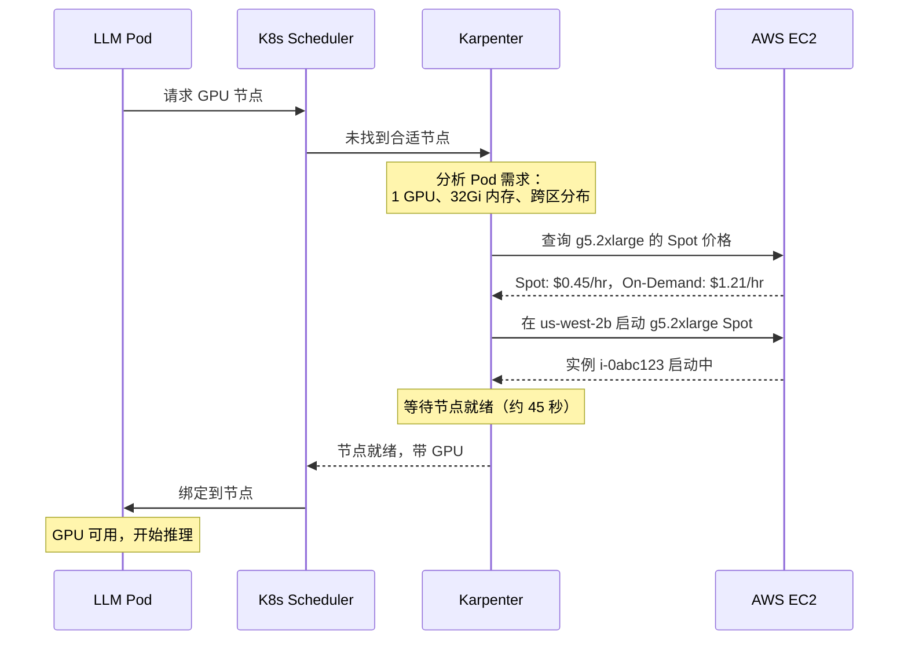

#### 4. AWS CloudWatch GPU 监控集成

**自定义指标仪表板：**

```json
{
  "widgets": [
    {
      "type": "metric",
      "properties": {
        "title": "GPU Utilization",
        "metrics": [
          ["ContainerInsights", "dcgm_gpu_utilization", {"stat": "Average"}]
        ],
        "region": "us-west-2",
        "period": 60
      }
    },
    {
      "type": "metric",
      "properties": {
        "title": "GPU Memory Usage",
        "metrics": [
          ["ContainerInsights", "dcgm_fb_used", {"stat": "Average"}],
          [".", "dcgm_fb_free", {"stat": "Average"}]
        ],
        "region": "us-west-2",
        "yAxis": {
          "left": {
            "label": "Memory (MiB)"
          }
        }
      }
    }
  ]
}
```

**GPU 问题的自动化告警：**

```bash
# GPU OOM 的 CloudWatch 告警
aws cloudwatch put-metric-alarm \
  --alarm-name gpu-memory-high \
  --alarm-description "Alert when GPU memory >90%" \
  --metric-name dcgm_fb_used \
  --namespace ContainerInsights \
  --statistic Average \
  --period 300 \
  --threshold 90 \
  --comparison-operator GreaterThanThreshold \
  --evaluation-periods 2 \
  --alarm-actions arn:aws:sns:us-west-2:XXXXXXXXXXXX:gpu-alerts
```

**解决方案总结：**

<SpotInstancePricingInference />
---
### 挑战 2：动态路由与扩缩容

**问题描述：**

- Agentic AI 产生不可预测的流量模式（突发性、多模态）
- 请求需要根据任务类型路由到专门的 LLM
- 自动扩缩容必须根据队列深度响应，而不仅仅是 CPU/内存
- 必须最小化面向用户的 Agent 的冷启动延迟

**EKS + Karpenter + KEDA 解决方案：**

#### 1. 架构概览

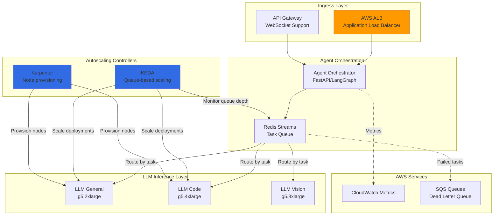

#### 2. 基于队列的 KEDA 扩缩容配置

**在 EKS 上安装 KEDA：**

```bash
# 添加 KEDA Helm 仓库
helm repo add kedacore https://kedacore.github.io/charts
helm repo update

# 使用 AWS IAM 角色安装 KEDA
helm install keda kedacore/keda \
  --namespace keda \
  --create-namespace \
  --set serviceAccount.annotations."eks\.amazonaws\.com/role-arn"="arn:aws:iam::XXXXXXXXXXXX:role/KedaOperatorRole"
```

**Redis Streams 的 ScaledObject：**

```yaml
# keda-redis-scaler.yaml
apiVersion: keda.sh/v1alpha1
kind: ScaledObject
metadata:
  name: llm-inference-scaler
  namespace: agentic-ai
spec:
  # 要扩缩容的目标 Deployment
  scaleTargetRef:
    name: llm-inference
    kind: Deployment

  # 扩缩容行为
  minReplicaCount: 1   # 保留预热实例以快速响应
  maxReplicaCount: 50  # 成本控制上限

  # 冷却周期
  pollingInterval: 10  # 每 10 秒检查一次
  cooldownPeriod: 300  # 缩容前等待 5 分钟

  # 高级扩缩容行为（类似 HPA）
  advanced:
    horizontalPodAutoscalerConfig:
      behavior:
        scaleDown:
          stabilizationWindowSeconds: 300
          policies:
          - type: Percent
            value: 10  # 一次最多缩容 10%
            periodSeconds: 60
        scaleUp:
          stabilizationWindowSeconds: 0  # 立即扩容
          policies:
          - type: Percent
            value: 100  # 如需可翻倍容量
            periodSeconds: 15
          - type: Pods
            value: 5    # 至少添加 5 个 Pod
            periodSeconds: 15
          selectPolicy: Max

  # 扩缩容触发器
  triggers:
  # 触发器 1：Redis Stream 队列深度
  - type: redis-streams
    metadata:
      addressFromEnv: REDIS_ADDRESS
      stream: llm-tasks
      consumerGroup: llm-workers
      pendingEntriesCount: "5"  # 待处理任务 >5 时扩容
      streamLength: "10"         # 总任务 >10 时扩容
    authenticationRef:
      name: redis-auth

  # 触发器 2：SQS 队列深度（回退方案）
  - type: aws-sqs-queue
    metadata:
      queueURL: https://sqs.us-west-2.amazonaws.com/XXXXXXXXXXXX/llm-tasks
      queueLength: "10"
      awsRegion: us-west-2
      identityOwner: operator  # 使用 KEDA Pod 的 IAM 角色

  # 触发器 3：自定义 CloudWatch 指标（延迟）
  - type: aws-cloudwatch
    metadata:
      namespace: AgenicAI
      metricName: LLMResponseLatency
      targetMetricValue: "2000"  # p95 延迟 >2s 时扩容
      minMetricValue: "500"
      awsRegion: us-west-2
      identityOwner: operator
---
# Redis 认证 Secret
apiVersion: v1
kind: Secret
metadata:
  name: redis-auth
  namespace: agentic-ai
type: Opaque
stringData:
  password: <redis-password>
---
# Redis 的 TriggerAuthentication
apiVersion: keda.sh/v1alpha1
kind: TriggerAuthentication
metadata:
  name: redis-auth
  namespace: agentic-ai
spec:
  secretTargetRef:
  - parameter: password
    name: redis-auth
    key: password
```

**KEDA 扩缩容行为：**

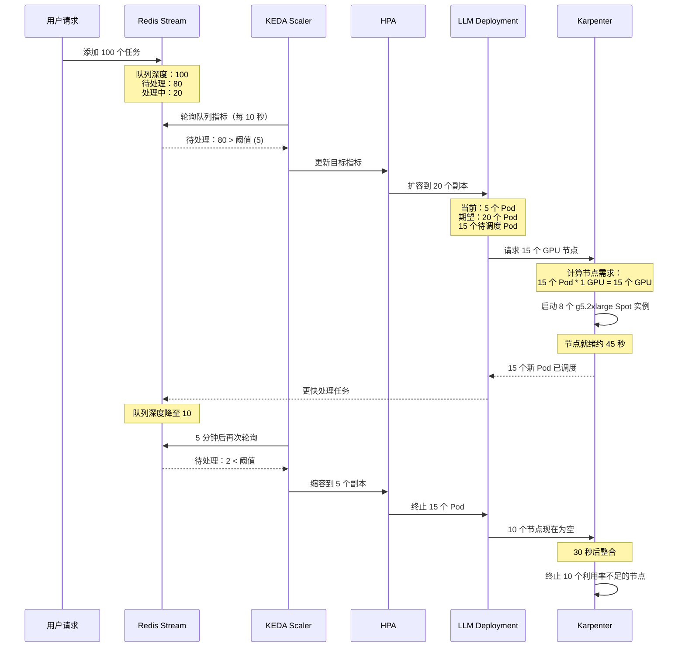

#### 3. KEDA 工作负载的 Karpenter NodePool

**不同 LLM 类型使用独立 NodePool：**

```yaml
# karpenter-llm-general.yaml
apiVersion: karpenter.sh/v1beta1
kind: NodePool
metadata:
  name: llm-general
spec:
  template:
    metadata:
      labels:
        workload-type: llm-general
    spec:
      requirements:
      # 通用任务的中小型 GPU 实例
      - key: karpenter.k8s.aws/instance-family
        operator: In
        values: ["g5"]
      - key: karpenter.k8s.aws/instance-size
        operator: In
        values: ["xlarge", "2xlarge"]  # 1-2 个 GPU

      # 优先使用 Spot
      - key: karpenter.sh/capacity-type
        operator: In
        values: ["spot", "on-demand"]

      nodeClassRef:
        name: gpu-nodes

      taints:
      - key: workload-type
        value: llm-general
        effect: NoSchedule

  limits:
    cpu: "500"
    memory: 2000Gi

  disruption:
    consolidationPolicy: WhenUnderutilized
    consolidateAfter: 30s

  weight: 10
---
# karpenter-llm-code.yaml
apiVersion: karpenter.sh/v1beta1
kind: NodePool
metadata:
  name: llm-code
spec:
  template:
    metadata:
      labels:
        workload-type: llm-code
    spec:
      requirements:
      # 代码生成需要更大的 GPU 实例
      - key: karpenter.k8s.aws/instance-family
        operator: In
        values: ["g5", "g6"]
      - key: karpenter.k8s.aws/instance-size
        operator: In
        values: ["4xlarge", "8xlarge"]  # 4-8 个 GPU

      - key: karpenter.sh/capacity-type
        operator: In
        values: ["spot", "on-demand"]

      nodeClassRef:
        name: gpu-nodes

      taints:
      - key: workload-type
        value: llm-code
        effect: NoSchedule

  limits:
    cpu: "1000"
    memory: 4000Gi

  disruption:
    consolidationPolicy: WhenUnderutilized
    consolidateAfter: 60s  # 高价节点使用更长的整合时间

  weight: 5  # 较低权重 = 较高优先级
```

**使用 Karpenter 亲和性的 LLM Deployment：**

```yaml
# llm-general-deployment.yaml
apiVersion: apps/v1
kind: Deployment
metadata:
  name: llm-general
  namespace: agentic-ai
spec:
  replicas: 1  # KEDA 将管理此值
  selector:
    matchLabels:
      app: llm-general
  template:
    metadata:
      labels:
        app: llm-general
    spec:
      nodeSelector:
        workload-type: llm-general  # 匹配 Karpenter NodePool

      tolerations:
      - key: workload-type
        value: llm-general
        effect: NoSchedule
      - key: nvidia.com/gpu
        operator: Exists
        effect: NoSchedule

      # 高可用的 Pod 拓扑
      topologySpreadConstraints:
      - maxSkew: 1
        topologyKey: topology.kubernetes.io/zone
        whenUnsatisfiable: ScheduleAnyway  # 倾向分散但允许偏差
        labelSelector:
          matchLabels:
            app: llm-general

      containers:
      - name: llm-server
        image: XXXXXXXXXXXX.dkr.ecr.us-west-2.amazonaws.com/llm-general:v1.0.0

        resources:
          requests:
            nvidia.com/gpu: 1
            memory: 24Gi
            cpu: 6
          limits:
            nvidia.com/gpu: 1
            memory: 24Gi

        env:
        - name: REDIS_ADDRESS
          value: redis-master.agentic-ai.svc.cluster.local:6379
        - name: REDIS_STREAM
          value: llm-tasks
        - name: CONSUMER_GROUP
          value: llm-workers

        # KEDA 健康检查的存活探针
        livenessProbe:
          httpGet:
            path: /health
            port: 8080
          initialDelaySeconds: 60
          periodSeconds: 10

        # 负载均衡的就绪探针
        readinessProbe:
          httpGet:
            path: /ready
            port: 8080
          initialDelaySeconds: 30
          periodSeconds: 5
```

#### 4. 多模型路由的 AWS ALB Ingress

**ALB Ingress Controller 配置：**

```yaml
# alb-ingress.yaml
apiVersion: networking.k8s.io/v1
kind: Ingress
metadata:
  name: agentic-ai-ingress
  namespace: agentic-ai
  annotations:
    # ALB 配置
    alb.ingress.kubernetes.io/scheme: internet-facing
    alb.ingress.kubernetes.io/target-type: ip  # 直接使用 Pod IP
    alb.ingress.kubernetes.io/load-balancer-name: agentic-ai-alb

    # SSL/TLS
    alb.ingress.kubernetes.io/certificate-arn: arn:aws:acm:us-west-2:XXXXXXXXXXXX:certificate/xxxx-xxxx-example
    alb.ingress.kubernetes.io/listen-ports: '[{"HTTP": 80}, {"HTTPS": 443}]'
    alb.ingress.kubernetes.io/ssl-redirect: '443'

    # 健康检查
    alb.ingress.kubernetes.io/healthcheck-path: /health
    alb.ingress.kubernetes.io/healthcheck-interval-seconds: '15'
    alb.ingress.kubernetes.io/healthcheck-timeout-seconds: '5'
    alb.ingress.kubernetes.io/healthy-threshold-count: '2'
    alb.ingress.kubernetes.io/unhealthy-threshold-count: '2'

    # 连接设置
    alb.ingress.kubernetes.io/target-group-attributes: |
      stickiness.enabled=true,
      stickiness.lb_cookie.duration_seconds=3600,
      deregistration_delay.timeout_seconds=30

    # WAF 集成
    alb.ingress.kubernetes.io/wafv2-acl-arn: arn:aws:wafv2:us-west-2:XXXXXXXXXXXX:regional/webacl/agentic-ai/xxxx-example

    # CloudWatch 日志
    alb.ingress.kubernetes.io/load-balancer-attributes: |
      access_logs.s3.enabled=true,
      access_logs.s3.bucket=agentic-ai-alb-logs,
      access_logs.s3.prefix=production
spec:
  ingressClassName: alb
  rules:
  # 路由 1：通用 LLM 任务
  - host: api.agentic-ai.example.com
    http:
      paths:
      - path: /v1/general
        pathType: Prefix
        backend:
          service:
            name: llm-general
            port:
              number: 8080

  # 路由 2：代码生成任务
  - host: api.agentic-ai.example.com
    http:
      paths:
      - path: /v1/code
        pathType: Prefix
        backend:
          service:
            name: llm-code
            port:
              number: 8080

  # 路由 3：视觉任务
  - host: api.agentic-ai.example.com
    http:
      paths:
      - path: /v1/vision
        pathType: Prefix
        backend:
          service:
            name: llm-vision
            port:
              number: 8080
```

**AWS API Gateway 替代方案（WebSocket 支持）：**

```bash
# 创建 API Gateway WebSocket API
aws apigatewayv2 create-api \
  --name agentic-ai-websocket \
  --protocol-type WEBSOCKET \
  --route-selection-expression '$request.body.action' \
  --tags Project=agentic-ai

# 与 EKS 服务前端的 NLB 集成
aws apigatewayv2 create-integration \
  --api-id abc123 \
  --integration-type HTTP_PROXY \
  --integration-uri http://nlb-internal.us-west-2.elb.amazonaws.com:8080 \
  --integration-method POST
```

**解决方案总结：**

<SavingsPlansPricingTraining />
**性能特征：**

<SmallScaleCostCalculation />
---
### 挑战 3：Token/会话成本控制

**问题描述：**

- LLM 推理成本随 Token 数量和会话长度增长
- GPU 实例价格昂贵（根据类型 $1-30/小时）
- 需要在保持响应速度的同时最小化 GPU 空闲时间
- Spot 实例可以降低成本但会引入中断风险

**Karpenter 成本优化解决方案：**

#### 1. Karpenter 的 Spot 实例策略

**多层级 Spot 配置：**

```yaml
# karpenter-cost-optimized.yaml
apiVersion: karpenter.sh/v1beta1
kind: NodePool
metadata:
  name: gpu-spot-optimized
spec:
  template:
    metadata:
      labels:
        workload-type: gpu-inference
        cost-tier: spot-optimized
    spec:
      requirements:
      # 多种实例类型提高 Spot 可用性
      - key: karpenter.k8s.aws/instance-family
        operator: In
        values: ["g5", "g6", "g4dn"]  # 多个代际

      - key: karpenter.k8s.aws/instance-size
        operator: In
        values: ["xlarge", "2xlarge", "4xlarge"]

      # Spot 优先，On-Demand 回退
      - key: karpenter.sh/capacity-type
        operator: In
        values: ["spot", "on-demand"]

      # 分布在所有 AZ 以提高 Spot 多样性
      - key: topology.kubernetes.io/zone
        operator: In
        values: ["us-west-2a", "us-west-2b", "us-west-2c", "us-west-2d"]

      nodeClassRef:
        name: gpu-spot-nodes

      taints:
      - key: nvidia.com/gpu
        value: "true"
        effect: NoSchedule

  limits:
    cpu: "2000"
    memory: 8000Gi

  # 激进的成本优化
  disruption:
    consolidationPolicy: WhenUnderutilized
    consolidateAfter: 30s  # 快速整合

    # 优雅的 Spot 中断处理
    budgets:
    - nodes: "33%"  # 一次最多中断 1/3 节点
      reasons:
      - "Drifted"
      - "Empty"
      - "Underutilized"

    - nodes: "100%"  # 允许所有中断
      reasons:
      - "Expired"  # Spot 中断不可协商

  weight: 100  # 优先使用此池以节省成本
---
apiVersion: karpenter.k8s.aws/v1beta1
kind: EC2NodeClass
metadata:
  name: gpu-spot-nodes
spec:
  amiFamily: AL2
  role: KarpenterNodeRole-agentic-ai

  # 子网多样化以提高 Spot 可用性
  subnetSelectorTerms:
  - tags:
      karpenter.sh/discovery: agentic-ai-cluster
      tier: spot-enabled  # 仅标记为 Spot 启用的子网

  securityGroupSelectorTerms:
  - tags:
      karpenter.sh/discovery: agentic-ai-cluster

  # 包含 Spot 中断处理的用户数据
  userData: |
    #!/bin/bash
    # 安装 AWS Node Termination Handler（用于 Spot 中断）
    kubectl apply -f https://github.com/aws/aws-node-termination-handler/releases/download/v1.21.0/all-resources.yaml

    # GPU 设置
    nvidia-smi -pm 1

    # CloudWatch agent
    wget https://s3.amazonaws.com/amazoncloudwatch-agent/amazon_linux/amd64/latest/amazon-cloudwatch-agent.rpm
    rpm -U ./amazon-cloudwatch-agent.rpm

  # 成本优化的存储
  blockDeviceMappings:
  - deviceName: /dev/xvda
    ebs:
      volumeSize: 200Gi  # 比专用节点更小
      volumeType: gp3
      iops: 3000  # 较低 IOPS 以节省成本
      throughput: 125
      encrypted: true
      deleteOnTermination: true

  # 成本跟踪标签
  tags:
    Project: agentic-ai
    CostCenter: ml-platform
    InstanceLifecycle: spot
```

**Spot 中断处理：**

```yaml
# aws-node-termination-handler.yaml
apiVersion: apps/v1
kind: DaemonSet
metadata:
  name: aws-node-termination-handler
  namespace: kube-system
spec:
  selector:
    matchLabels:
      app: aws-node-termination-handler
  template:
    metadata:
      labels:
        app: aws-node-termination-handler
    spec:
      serviceAccountName: aws-node-termination-handler
      hostNetwork: true
      containers:
      - name: handler
        image: public.ecr.aws/aws-ec2/aws-node-termination-handler:v1.21.0
        env:
        - name: NODE_NAME
          valueFrom:
            fieldRef:
              fieldPath: spec.nodeName
        - name: POD_NAME
          valueFrom:
            fieldRef:
              fieldPath: metadata.name
        - name: NAMESPACE
          valueFrom:
            fieldRef:
              fieldPath: metadata.namespace
        - name: ENABLE_SPOT_INTERRUPTION_DRAINING
          value: "true"
        - name: ENABLE_SCHEDULED_EVENT_DRAINING
          value: "true"
        - name: ENABLE_REBALANCE_DRAINING
          value: "true"  # 收到再平衡建议时排空
        - name: DELETE_LOCAL_DATA
          value: "true"
        - name: IGNORE_DAEMON_SETS
          value: "true"
        - name: POD_TERMINATION_GRACE_PERIOD
          value: "120"  # 2 分钟优雅关闭
        - name: WEBHOOK_URL
          value: https://hooks.slack.com/services/YOUR/WEBHOOK/URL  # 中断时告警
```

#### 2. 成本分配与跟踪

**基于标签的成本分配：**

```yaml
# 用于成本跟踪的 Pod 标签
apiVersion: v1
kind: Pod
metadata:
  name: llm-inference-pod
  labels:
    app: llm-inference
    cost-center: ml-platform
    team: agentic-ai
    environment: production
    workload-type: gpu-inference
spec:
  # ... Pod 规范 ...
```

**CloudWatch 成本指标：**

```bash
# 逐 Pod 成本跟踪的自定义指标
aws cloudwatch put-metric-data \
  --namespace AgenicAI/Cost \
  --metric-name GPUInstanceCost \
  --dimensions InstanceType=g5.2xlarge,CapacityType=spot \
  --value 0.45 \
  --unit None
```

**AWS Cost Explorer 查询：**

```python
# cost-analysis.py
import boto3
from datetime import datetime, timedelta

ce = boto3.client('ce')

# 按 Karpenter NodePool 获取成本
response = ce.get_cost_and_usage(
    TimePeriod={
        'Start': (datetime.now() - timedelta(days=30)).strftime('%Y-%m-%d'),
        'End': datetime.now().strftime('%Y-%m-%d')
    },
    Granularity='DAILY',
    Filter={
        'Tags': {
            'Key': 'karpenter.sh/nodepool',
            'Values': ['gpu-spot-optimized']
        }
    },
    Metrics=['UnblendedCost'],
    GroupBy=[
        {'Type': 'TAG', 'Key': 'karpenter.sh/capacity-type'},
        {'Type': 'DIMENSION', 'Key': 'INSTANCE_TYPE'}
    ]
)

# 计算 Spot 节省
spot_cost = sum([float(r['Total']['UnblendedCost']['Amount'])
                 for r in response['ResultsByTime']
                 if r['Groups'][0]['Keys'][0] == 'spot'])
on_demand_cost = sum([float(r['Total']['UnblendedCost']['Amount'])
                      for r in response['ResultsByTime']
                      if r['Groups'][0]['Keys'][0] == 'on-demand'])

print(f"Spot savings: ${on_demand_cost - spot_cost:.2f} ({(1 - spot_cost/on_demand_cost)*100:.1f}%)")
```

#### 3. Token 使用优化

**带有 Token 跟踪的 LLM Pod：**

```yaml
# llm-deployment-cost-aware.yaml
apiVersion: apps/v1
kind: Deployment
metadata:
  name: llm-inference
spec:
  template:
    spec:
      containers:
      - name: llm-server
        image: llm-inference:v1.0.0
        env:
        # 每请求 Token 限制
        - name: MAX_TOKENS_PER_REQUEST
          value: "2048"

        # 成本控制的会话超时
        - name: SESSION_TIMEOUT_SECONDS
          value: "300"  # 5 分钟

        # Token 使用的 CloudWatch 指标
        - name: CLOUDWATCH_NAMESPACE
          value: AgenicAI/Tokens
        - name: CLOUDWATCH_METRIC_NAME
          value: TokensGenerated

        # 应用代码跟踪 Token
        command:
        - python
        - -c
        - |
          import boto3
          from llm_server import serve

          cloudwatch = boto3.client('cloudwatch')

          def track_tokens(prompt_tokens, completion_tokens, model_name):
              cloudwatch.put_metric_data(
                  Namespace='AgenicAI/Tokens',
                  MetricData=[
                      {
                          'MetricName': 'PromptTokens',
                          'Value': prompt_tokens,
                          'Unit': 'Count',
                          'Dimensions': [
                              {'Name': 'ModelName', 'Value': model_name},
                              {'Name': 'PodName', 'Value': os.environ['POD_NAME']}
                          ]
                      },
                      {
                          'MetricName': 'CompletionTokens',
                          'Value': completion_tokens,
                          'Unit': 'Count',
                          'Dimensions': [
                              {'Name': 'ModelName', 'Value': model_name},
                              {'Name': 'PodName', 'Value': os.environ['POD_NAME']}
                          ]
                      }
                  ]
              )

          serve(token_callback=track_tokens)
```

**成本监控的 CloudWatch 仪表板：**

```json
{
  "widgets": [
    {
      "type": "metric",
      "properties": {
        "title": "GPU Instance Cost (Hourly)",
        "metrics": [
          ["AgenicAI/Cost", "GPUInstanceCost", {"stat": "Sum", "label": "Total Cost"}],
          ["...", {"stat": "Average", "label": "Avg Cost per Instance"}]
        ],
        "period": 3600,
        "region": "us-west-2",
        "yAxis": {
          "left": {
            "label": "Cost (USD)"
          }
        }
      }
    },
    {
      "type": "metric",
      "properties": {
        "title": "Token Usage by Model",
        "metrics": [
          ["AgenicAI/Tokens", "PromptTokens", {"stat": "Sum"}],
          [".", "CompletionTokens", {"stat": "Sum"}]
        ],
        "period": 300,
        "region": "us-west-2",
        "stacked": true
      }
    },
    {
      "type": "metric",
      "properties": {
        "title": "Cost per 1M Tokens",
        "metrics": [
          [{"expression": "m1 / (m2 / 1000000)", "label": "Cost Efficiency"}]
        ],
        "period": 3600
      }
    }
  ]
}
```

#### 4. Karpenter 整合减少空闲 GPU

**激进整合配置：**

```yaml
# karpenter-consolidation.yaml
apiVersion: karpenter.sh/v1beta1
kind: NodePool
metadata:
  name: gpu-consolidated
spec:
  disruption:
    # 利用率不足时整合
    consolidationPolicy: WhenUnderutilized
    consolidateAfter: 30s  # 快速整合（默认：30s）

    # 认为节点利用率不足的条件：
    # - CPU requests < 可分配量的 50%
    # - Memory requests < 可分配量的 50%
    # - GPU requests < 可分配量的 100%（GPU 很贵！）

    # 防止中断风暴的预算
    budgets:
    - nodes: "20%"  # 一次最多中断 20%
      schedule: "* * * * *"  # 始终活跃

    # 较大中断的维护窗口
    - nodes: "50%"
      schedule: "0 2 * * *"  # 每天凌晨 2 点
      duration: 2h
```

**整合行为示例：**

```mermaid
gantt
    title Karpenter 整合生命周期
    dateFormat HH:mm
    axisFormat %H:%M

    section Node 1 (g5.2xlarge)
    Pod A (1 GPU) :active, n1p1, 10:00, 2h
    Idle :crit, n1idle, after n1p1, 30s
    Node Terminated :milestone, n1term, after n1idle, 0s

    section Node 2 (g5.2xlarge)
    Pod B (1 GPU) :active, n2p1, 10:30, 1h
    Idle :crit, n2idle, after n2p1, 30s
    Node Terminated :milestone, n2term, after n2idle, 0s

    section Node 3 (g5.4xlarge)
    Pod C (2 GPU) :active, n3p1, 11:00, 3h
    Pod A Migrated :active, n3p2, 12:00, 30m
    Pod B Migrated :active, n3p3, 11:30, 1h
    All Pods Running :active, n3p4, after n3p3, 30m
```

**整合指标：**

```bash
# 整合节省的 CloudWatch 指标
aws cloudwatch put-metric-data \
  --namespace AgenicAI/Cost \
  --metric-name ConsolidationSavings \
  --value 45.60 \
  --unit None \
  --dimensions Action=Consolidation,NodePool=gpu-consolidated
```

**解决方案总结：**

<MediumScaleCostCalculation />
**预估成本明细（100 GPU 小时/月）：**

<LargeScaleCostCalculation />
---
### 挑战 4：FM 微调基础设施

**问题描述：**

- 微调与推理需要不同的基础设施（更多 GPU、更长会话）
- 训练作业是批处理工作负载，对延迟不敏感
- 需要跨多个 GPU 节点的分布式训练
- 成本优化至关重要（每次训练可能花费数千美元）

**Karpenter 训练基础设施解决方案：**

#### 1. 专用训练 NodePool

```yaml
# karpenter-training-nodepool.yaml
apiVersion: karpenter.sh/v1beta1
kind: NodePool
metadata:
  name: ml-training
spec:
  template:
    metadata:
      labels:
        workload-type: ml-training
        karpenter.sh/capacity-type: spot  # 训练可中断
    spec:
      requirements:
      # 用于训练的高端 GPU 实例
      - key: karpenter.k8s.aws/instance-family
        operator: In
        values: ["p4d", "p5", "g5"]  # P4d/P5 用于大模型，G5 用于小模型

      - key: karpenter.k8s.aws/instance-size
        operator: In
        values: ["12xlarge", "24xlarge", "48xlarge"]  # 多 GPU 实例

      # Spot 节省成本（训练检查点处理中断）
      - key: karpenter.sh/capacity-type
        operator: In
        values: ["spot", "on-demand"]

      # 用于低延迟多节点训练的放置组
      - key: karpenter.k8s.aws/instance-hypervisor
        operator: In
        values: ["nitro"]  # 放置组必需

      nodeClassRef:
        name: training-nodes

      taints:
      - key: workload-type
        value: ml-training
        effect: NoSchedule

  limits:
    cpu: "4000"
    memory: 16000Gi
    nvidia.com/gpu: "128"  # 支持最多 128 个 GPU 的分布式训练

  # 训练专用的中断行为
  disruption:
    consolidationPolicy: WhenEmpty  # 仅整合空节点（训练是长时间运行的）
    consolidateAfter: 300s  # 终止前等待 5 分钟
    expireAfter: Never  # 永不过期（训练作业管理生命周期）

    budgets:
    - nodes: "0"  # 永不中断运行中的训练
      reasons: ["Underutilized"]
    - nodes: "100%"  # 允许 Spot 中断（检查点处理）
      reasons: ["Expired"]

  weight: 1  # 低优先级（让位于推理工作负载）
---
apiVersion: karpenter.k8s.aws/v1beta1
kind: EC2NodeClass
metadata:
  name: training-nodes
spec:
  amiFamily: AL2
  role: KarpenterNodeRole-training

  # 支持放置组的子网
  subnetSelectorTerms:
  - tags:
      karpenter.sh/discovery: agentic-ai-cluster
      training-enabled: "true"

  securityGroupSelectorTerms:
  - tags:
      karpenter.sh/discovery: agentic-ai-cluster

  # 包含 EFA 驱动的用户数据，用于分布式训练
  userData: |
    #!/bin/bash
    # 安装 EFA 驱动（Elastic Fabric Adapter，用于低延迟网络）
    curl -O https://efa-installer.amazonaws.com/aws-efa-installer-latest.tar.gz
    tar -xf aws-efa-installer-latest.tar.gz
    cd aws-efa-installer
    ./efa_installer.sh -y --minimal

    # GPU 设置
    nvidia-smi -pm 1
    nvidia-smi -c 3  # 训练用独占计算模式

    # 多 GPU 训练的 NCCL 优化
    echo "export NCCL_DEBUG=INFO" >> /etc/environment
    echo "export NCCL_SOCKET_IFNAME=eth0" >> /etc/environment
    echo "export NCCL_IB_DISABLE=1" >> /etc/environment
    echo "export NCCL_P2P_DISABLE=0" >> /etc/environment

  # 用于数据集和检查点的大容量 EBS
  blockDeviceMappings:
  - deviceName: /dev/xvda
    ebs:
      volumeSize: 2000Gi  # 2TB 用于大型数据集
      volumeType: gp3
      iops: 16000
      throughput: 1000
      encrypted: true
      deleteOnTermination: true

  # 训练成本跟踪标签
  tags:
    Project: agentic-ai
    CostCenter: ml-training
    InstanceLifecycle: training
```

#### 2. 使用 Kubeflow 的 PyTorch 分布式训练

**用于微调的 Kubeflow PyTorchJob：**

```yaml
# pytorch-training-job.yaml
apiVersion: kubeflow.org/v1
kind: PyTorchJob
metadata:
  name: llm-finetuning
  namespace: ml-training
spec:
  # PyTorch 分布式训练配置
  pytorchReplicaSpecs:
    Master:
      replicas: 1
      restartPolicy: OnFailure
      template:
        metadata:
          labels:
            app: llm-finetuning
            role: master
        spec:
          nodeSelector:
            workload-type: ml-training

          tolerations:
          - key: workload-type
            value: ml-training
            effect: NoSchedule
          - key: nvidia.com/gpu
            operator: Exists
            effect: NoSchedule

          containers:
          - name: pytorch
            image: XXXXXXXXXXXX.dkr.ecr.us-west-2.amazonaws.com/llm-training:v1.0.0

            # 每个 Pod 的 GPU 资源
            resources:
              requests:
                nvidia.com/gpu: 8  # 整个节点（p4d.24xlarge = 8x A100）
                memory: 1000Gi
                cpu: 96
              limits:
                nvidia.com/gpu: 8
                memory: 1000Gi

            env:
            # 数据和检查点的 S3 路径
            - name: TRAINING_DATA_S3
              value: s3://agentic-ai-datasets/fine-tuning/data.jsonl
            - name: CHECKPOINT_S3
              value: s3://agentic-ai-checkpoints/llm-finetuning/
            - name: MODEL_S3
              value: s3://agentic-ai-models/base-llm/

            # 训练超参数
            - name: BATCH_SIZE
              value: "8"
            - name: GRADIENT_ACCUMULATION_STEPS
              value: "4"
            - name: LEARNING_RATE
              value: "5e-5"
            - name: NUM_EPOCHS
              value: "3"
            - name: MAX_SEQ_LENGTH
              value: "2048"

            # 分布式训练设置
            - name: WORLD_SIZE
              value: "16"  # 2 个节点 * 8 个 GPU
            - name: NCCL_DEBUG
              value: INFO

            # Spot 中断处理
            - name: CHECKPOINT_INTERVAL
              value: "100"  # 每 100 步保存检查点

            volumeMounts:
            - name: dshm
              mountPath: /dev/shm
            - name: efa
              mountPath: /opt/amazon/efa

          volumes:
          - name: dshm
            emptyDir:
              medium: Memory
              sizeLimit: 64Gi  # 大容量共享内存用于数据加载
          - name: efa
            hostPath:
              path: /opt/amazon/efa

          # 具有 S3 访问权限的服务账户
          serviceAccountName: ml-training-sa

    Worker:
      replicas: 1  # 1 个额外 Worker = 共 2 个节点
      restartPolicy: OnFailure
      template:
        metadata:
          labels:
            app: llm-finetuning
            role: worker
        spec:
          # 与 Master 相同的规范（为简洁省略）
          nodeSelector:
            workload-type: ml-training
          tolerations:
          - key: workload-type
            value: ml-training
            effect: NoSchedule
          containers:
          - name: pytorch
            image: XXXXXXXXXXXX.dkr.ecr.us-west-2.amazonaws.com/llm-training:v1.0.0
            resources:
              requests:
                nvidia.com/gpu: 8
                memory: 1000Gi
                cpu: 96
              limits:
                nvidia.com/gpu: 8
                memory: 1000Gi
```

#### 3. AWS Batch 集成（Kubeflow 的替代方案）

**适用于偏好托管服务的团队：**

```yaml
# aws-batch-job-definition.yaml
apiVersion: batch.aws.amazon.com/v1
kind: JobDefinition
metadata:
  name: llm-finetuning
spec:
  type: multinode
  nodeProperties:
    numNodes: 2
    mainNode: 0
    nodeRangeProperties:
    - targetNodes: "0:"  # 所有节点
      container:
        image: XXXXXXXXXXXX.dkr.ecr.us-west-2.amazonaws.com/llm-training:v1.0.0
        vcpus: 96
        memory: 1000000  # 1TB
        resourceRequirements:
        - type: GPU
          value: "8"

        command:
        - python
        - -m
        - torch.distributed.launch
        - --nproc_per_node=8
        - --nnodes=2
        - --node_rank=$AWS_BATCH_JOB_NODE_INDEX
        - --master_addr=$AWS_BATCH_JOB_MAIN_NODE_PRIVATE_IPV4_ADDRESS
        - train.py

        environment:
        - name: TRAINING_DATA_S3
          value: s3://agentic-ai-datasets/fine-tuning/data.jsonl
        - name: CHECKPOINT_S3
          value: s3://agentic-ai-checkpoints/llm-finetuning/

        mountPoints:
        - sourceVolume: efa
          containerPath: /opt/amazon/efa
        - sourceVolume: fsx
          containerPath: /fsx  # FSx for Lustre 用于快速数据访问

      volumes:
      - name: efa
        host:
          sourcePath: /opt/amazon/efa
      - name: fsx
        host:
          sourcePath: /fsx

  platformCapabilities:
  - EC2
  - EFA  # 启用 EFA 低延迟网络

  schedulingPriority: 10
  retryStrategy:
    attempts: 3
    evaluateOnExit:
    - action: RETRY
      onStatusReason: "Spot instance interrupted"
```

#### 4. 训练的 Spot 中断处理

**基于检查点的恢复：**

```python
# train.py（节选）
import torch
import boto3
from datetime import datetime

s3 = boto3.client('s3')
CHECKPOINT_BUCKET = 'agentic-ai-checkpoints'
CHECKPOINT_PREFIX = 'llm-finetuning'

def save_checkpoint(model, optimizer, epoch, step, loss):
    """保存检查点到 S3，用于 Spot 中断恢复"""
    checkpoint = {
        'epoch': epoch,
        'step': step,
        'model_state_dict': model.state_dict(),
        'optimizer_state_dict': optimizer.state_dict(),
        'loss': loss,
        'timestamp': datetime.now().isoformat()
    }

    # 先保存到本地（快速）
    local_path = f'/tmp/checkpoint-epoch{epoch}-step{step}.pt'
    torch.save(checkpoint, local_path)

    # 异步上传到 S3
    s3_key = f'{CHECKPOINT_PREFIX}/checkpoint-epoch{epoch}-step{step}.pt'
    s3.upload_file(local_path, CHECKPOINT_BUCKET, s3_key)

    # 同时保存为 "latest" 方便恢复
    latest_key = f'{CHECKPOINT_PREFIX}/checkpoint-latest.pt'
    s3.copy_object(
        CopySource={'Bucket': CHECKPOINT_BUCKET, 'Key': s3_key},
        Bucket=CHECKPOINT_BUCKET,
        Key=latest_key
    )

    print(f"Checkpoint saved to s3://{CHECKPOINT_BUCKET}/{s3_key}")

def load_checkpoint(model, optimizer):
    """从 S3 加载最新检查点"""
    try:
        latest_key = f'{CHECKPOINT_PREFIX}/checkpoint-latest.pt'
        local_path = '/tmp/checkpoint-latest.pt'

        s3.download_file(CHECKPOINT_BUCKET, latest_key, local_path)
        checkpoint = torch.load(local_path)

        model.load_state_dict(checkpoint['model_state_dict'])
        optimizer.load_state_dict(checkpoint['optimizer_state_dict'])

        print(f"Resumed from epoch {checkpoint['epoch']}, step {checkpoint['step']}")
        return checkpoint['epoch'], checkpoint['step']
    except:
        print("No checkpoint found, starting from scratch")
        return 0, 0

# 带检查点的训练循环
def train():
    model = create_model()
    optimizer = create_optimizer()

    # 如果存在检查点则恢复
    start_epoch, start_step = load_checkpoint(model, optimizer)

    for epoch in range(start_epoch, NUM_EPOCHS):
        for step, batch in enumerate(dataloader, start=start_step):
            # 训练步骤
            loss = train_step(model, batch, optimizer)

            # 每 N 步保存检查点（用于 Spot 中断恢复）
            if step % CHECKPOINT_INTERVAL == 0:
                save_checkpoint(model, optimizer, epoch, step, loss)
```

**Spot 中断监听器：**

```bash
# spot-interruption-handler.sh（作为 sidecar 运行）
#!/bin/bash
while true; do
  # 检查 EC2 元数据获取 Spot 中断通知
  HTTP_CODE=$(curl -s -o /dev/null -w "%{http_code}" http://169.254.169.254/latest/meta-data/spot/instance-action)

  if [ "$HTTP_CODE" == "200" ]; then
    echo "Spot interruption detected! Triggering graceful shutdown..."

    # 向训练进程发送 SIGTERM
    pkill -TERM -f train.py

    # 等待检查点完成（最多 2 分钟）
    sleep 120

    exit 0
  fi

  sleep 5
done
```

#### 5. 训练作业的成本跟踪

**CloudWatch 自定义指标：**

```python
# training_cost_tracker.py
import boto3

> 📅 **撰写日期**: 2025-02-05 | **修改日期**: 2026-02-14 | ⏱️ **阅读时间**: 约 12 分钟

from datetime import datetime

cloudwatch = boto3.client('cloudwatch')

def track_training_cost(job_name, instance_type, num_instances, duration_hours, cost_per_hour):
    """在 CloudWatch 中跟踪训练作业成本"""
    total_cost = num_instances * duration_hours * cost_per_hour

    cloudwatch.put_metric_data(
        Namespace='AgenicAI/Training',
        MetricData=[
            {
                'MetricName': 'TrainingJobCost',
                'Value': total_cost,
                'Unit': 'None',
                'Timestamp': datetime.now(),
                'Dimensions': [
                    {'Name': 'JobName', 'Value': job_name},
                    {'Name': 'InstanceType', 'Value': instance_type}
                ]
            },
            {
                'MetricName': 'TrainingDuration',
                'Value': duration_hours,
                'Unit': 'None',
                'Timestamp': datetime.now(),
                'Dimensions': [
                    {'Name': 'JobName', 'Value': job_name}
                ]
            }
        ]
    )

# 使用示例
track_training_cost(
    job_name='llm-finetuning-v1',
    instance_type='p4d.24xlarge',
    num_instances=2,
    duration_hours=8.5,
    cost_per_hour=32.77  # On-Demand 价格
)
```

**解决方案总结：**

<CostOptimizationStrategies />
**训练成本对比：**

<TroubleshootingGuide />
---
## 在 EKS 上轻松部署 Agentic AI 平台

### 使用 Terraform 快速开始

**完整的 EKS + Karpenter + 可观测性技术栈：**

```hcl
# terraform/main.tf
module "eks_agentic_ai" {
  source  = "terraform-aws-modules/eks/aws"
  version = "~> 20.0"

  cluster_name    = "agentic-ai-cluster"
  cluster_version = "1.30"

  # VPC 配置
  vpc_id     = module.vpc.vpc_id
  subnet_ids = module.vpc.private_subnets

  # 系统工作负载的托管节点组
  eks_managed_node_groups = {
    system = {
      min_size     = 2
      max_size     = 4
      desired_size = 2

      instance_types = ["m5.xlarge"]
      capacity_type  = "ON_DEMAND"

      labels = {
        role = "system"
      }

      taints = [{
        key    = "CriticalAddonsOnly"
        value  = "true"
        effect = "NO_SCHEDULE"
      }]
    }
  }

  # 启用 EKS 插件
  cluster_addons = {
    coredns = {
      most_recent = true
    }
    kube-proxy = {
      most_recent = true
    }
    vpc-cni = {
      most_recent = true
    }
    aws-ebs-csi-driver = {
      most_recent = true
    }
  }

  # 启用 IRSA（IAM Roles for Service Accounts）
  enable_irsa = true

  tags = {
    Project = "agentic-ai"
  }
}

# Karpenter 安装
module "karpenter" {
  source  = "terraform-aws-modules/eks/aws//modules/karpenter"
  version = "~> 20.0"

  cluster_name = module.eks_agentic_ai.cluster_name

  irsa_oidc_provider_arn          = module.eks_agentic_ai.oidc_provider_arn
  irsa_namespace_service_accounts = ["karpenter:karpenter"]

  # Karpenter 节点 IAM 角色
  create_node_iam_role = true
  node_iam_role_additional_policies = {
    AmazonSSMManagedInstanceCore = "arn:aws:iam::aws:policy/AmazonSSMManagedInstanceCore"
  }

  tags = {
    Project = "agentic-ai"
  }
}

# CloudWatch Container Insights
resource "aws_eks_addon" "cloudwatch_observability" {
  cluster_name = module.eks_agentic_ai.cluster_name
  addon_name   = "amazon-cloudwatch-observability"

  configuration_values = jsonencode({
    containerInsights = {
      enabled = true
    }
  })
}

# ALB Ingress Controller
module "alb_controller" {
  source  = "terraform-aws-modules/iam/aws//modules/iam-role-for-service-accounts-eks"
  version = "~> 5.0"

  role_name = "alb-ingress-controller"

  attach_load_balancer_controller_policy = true

  oidc_providers = {
    main = {
      provider_arn               = module.eks_agentic_ai.oidc_provider_arn
      namespace_service_accounts = ["kube-system:aws-load-balancer-controller"]
    }
  }
}

# KEDA 自动扩缩容
resource "helm_release" "keda" {
  name       = "keda"
  repository = "https://kedacore.github.io/charts"
  chart      = "keda"
  namespace  = "keda"
  create_namespace = true

  set {
    name  = "serviceAccount.annotations.eks\\.amazonaws\\.com/role-arn"
    value = aws_iam_role.keda.arn
  }
}

# Kubeflow Training Operator
resource "helm_release" "training_operator" {
  name       = "training-operator"
  repository = "https://kubeflow.github.io/training-operator"
  chart      = "training-operator"
  namespace  = "kubeflow"
  create_namespace = true
}

# Prometheus + Grafana 可观测性
module "observability" {
  source = "./modules/observability"

  cluster_name = module.eks_agentic_ai.cluster_name
  enable_prometheus = true
  enable_grafana = true
  enable_dcgm_exporter = true  # GPU 指标
}
```

### 一键部署

```bash
# 1. 克隆参考架构
git clone https://github.com/aws-samples/agentic-ai-eks-blueprint
cd agentic-ai-eks-blueprint

# 2. 配置变量
cat > terraform.tfvars <<EOF
region = "us-west-2"
cluster_name = "agentic-ai-prod"
enable_gpu_nodes = true
enable_spot_instances = true
enable_karpenter = true
enable_keda = true
enable_kubeflow = true
EOF

# 3. 部署所有组件
terraform init
terraform apply -auto-approve

# 4. 安装 GPU NodePool
kubectl apply -f manifests/karpenter/gpu-nodepools.yaml

# 5. 部署示例 Agentic AI 应用
kubectl apply -f manifests/apps/llm-inference.yaml
```

### 预配置 Helm Chart

```yaml
# agentic-ai-platform Helm chart 的 values.yaml
global:
  cluster:
    name: agentic-ai-cluster
    region: us-west-2

  observability:
    enabled: true
    cloudwatch: true
    prometheus: true
    grafana: true

karpenter:
  enabled: true
  nodePools:
    gpu:
      enabled: true
      instanceFamilies: ["g5", "g6", "p4d", "p5"]
      spotEnabled: true
      consolidationEnabled: true

keda:
  enabled: true
  scalers:
    redis: true
    sqs: true
    cloudwatch: true

llm:
  inference:
    enabled: true
    replicas: 3
    image: llm-inference:v1.0.0
    gpu:
      count: 1
      memory: 24Gi
    autoscaling:
      enabled: true
      minReplicas: 1
      maxReplicas: 50

redis:
  enabled: true
  architecture: replication
  master:
    persistence:
      size: 8Gi
  replica:
    replicaCount: 2

training:
  enabled: true
  kubeflow: true
  checkpointing:
    s3Bucket: agentic-ai-checkpoints
```

**使用 Helm 部署：**

```bash
helm repo add agentic-ai https://charts.agentic-ai.example.com
helm install agentic-ai agentic-ai/platform -f values.yaml
```

---

## EKS Capability：面向 Agentic AI 的集成平台功能

### 什么是 EKS Capability？

**EKS Capability** 是指**集成经过验证的开源工具和 AWS 服务的平台级功能**，以有效地在 Amazon EKS 上运行特定工作负载。EKS 不仅仅是一个简单的托管 Kubernetes 服务，它提供针对特定领域（AI/ML、数据分析、Web 应用等）优化的**端到端解决方案栈**。

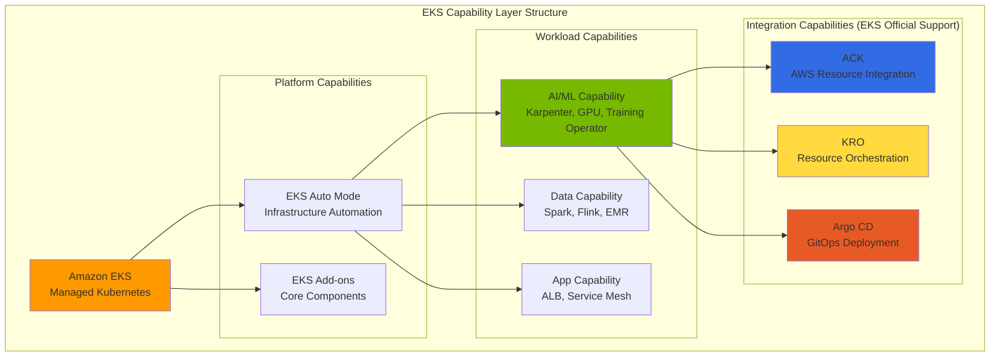

### Agentic AI 的核心 EKS Capability

为有效运行 Agentic AI 工作负载，EKS 官方支持以下**集成 Capability**：

<SecurityLayers />
:::warning Argo Workflows 需要手动安装
**Argo Workflows** 并非 EKS Capability 官方支持的组件，因此**需要手动安装**。
与 Argo CD（EKS Capability）结合使用时，可以实现强大的 ML 流水线自动化。

```bash
# 安装 Argo Workflows
kubectl create namespace argo
kubectl apply -n argo -f https://github.com/argoproj/argo-workflows/releases/download/v3.5.0/install.yaml
```

:::

:::info EKS Capability 的核心价值
通过组合 ACK、KRO 和 Argo CD（EKS Capability）：

- **声明式管理**：在 YAML 中定义所有基础设施和工作负载
- **基于 GitOps**：使用 Git 作为单一事实来源
- **完全自动化**：从代码提交到生产部署的零停机流水线
- **统一监控**：集成 AWS CloudWatch 和 Kubernetes 指标
:::

---

### ACK（AWS Controllers for Kubernetes）

**ACK** 是 EKS Capability 的核心组件，是一个开源项目，使您能够通过 Kubernetes 自定义资源直接配置和管理 AWS 服务。它可以**轻松地作为 EKS Add-on 安装**。

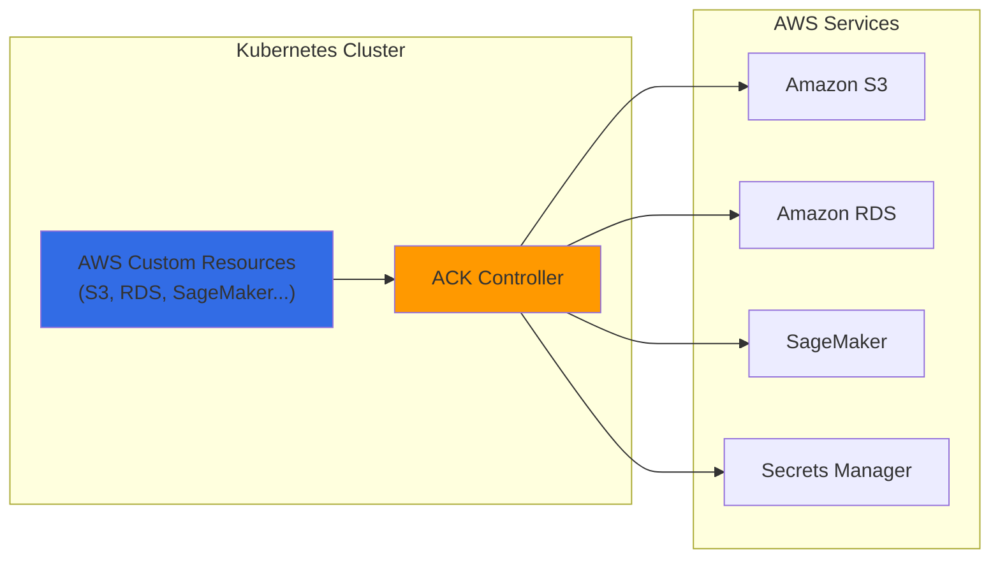

**AI 平台的 ACK 使用场景：**

<CostOptimizationDetails />
**示例：使用 ACK 创建 S3 Bucket：**

```yaml
# s3-model-bucket.yaml
apiVersion: s3.services.k8s.aws/v1alpha1
kind: Bucket
metadata:
  name: agentic-ai-models
  namespace: ai-platform
spec:
  name: agentic-ai-models-prod
  versioning:
    status: Enabled
  encryption:
    rules:
    - applyServerSideEncryptionByDefault:
        sseAlgorithm: aws:kms
  tags:
  - key: Project
    value: agentic-ai
  - key: Environment
    value: production
```

### KRO（Kubernetes Resource Orchestrator）

**KRO** 允许您**将多个 Kubernetes 和 AWS 资源组合为单个抽象单元**，实现复杂基础设施的简单部署。

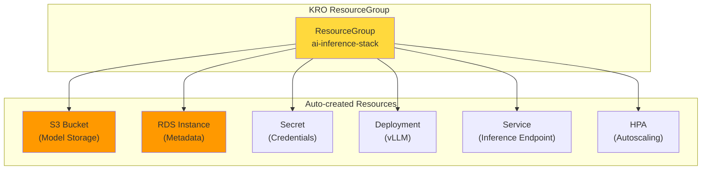

**KRO ResourceGroup 定义示例：**

```yaml
# ai-inference-stack.yaml
apiVersion: kro.aws.io/v1alpha1
kind: ResourceGroup
metadata:
  name: ai-inference-stack
spec:
  schema:
    apiVersion: v1alpha1
    kind: AIInferenceStack
    spec:
      modelName: string
      gpuType: string | default="g5.xlarge"
      minReplicas: integer | default=1
      maxReplicas: integer | default=10

  resources:
  # S3 Bucket（ACK）
  - id: modelBucket
    template:
      apiVersion: s3.services.k8s.aws/v1alpha1
      kind: Bucket
      metadata:
        name: ${schema.spec.modelName}-models
      spec:
        name: ${schema.spec.modelName}-models-${schema.metadata.namespace}

  # vLLM Deployment
  - id: inference
    template:
      apiVersion: apps/v1
      kind: Deployment
      metadata:
        name: ${schema.spec.modelName}-vllm
      spec:
        replicas: ${schema.spec.minReplicas}
        template:
          spec:
            containers:
            - name: vllm
              image: vllm/vllm-openai:latest
              env:
              - name: MODEL_PATH
                value: s3://${modelBucket.status.bucketName}/

  # HPA
  - id: autoscaler
    template:
      apiVersion: autoscaling/v2
      kind: HorizontalPodAutoscaler
      metadata:
        name: ${schema.spec.modelName}-hpa
      spec:
        scaleTargetRef:
          name: ${inference.metadata.name}
        minReplicas: ${schema.spec.minReplicas}
        maxReplicas: ${schema.spec.maxReplicas}
```

**使用 KRO 部署 AI 推理栈：**

```yaml
# 单个资源部署整个栈
apiVersion: v1alpha1
kind: AIInferenceStack
metadata:
  name: llama-inference
  namespace: ai-platform
spec:
  modelName: llama-3-70b
  gpuType: g5.12xlarge
  minReplicas: 2
  maxReplicas: 20
```
### 基于 Argo 的 ML 流水线自动化

通过组合 **Argo Workflows** 和 **Argo CD**，您可以使用 GitOps 原则**自动化从训练到评估到部署的整个 MLOps 流水线**。

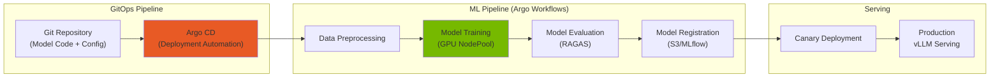

**使用 Argo Workflows 的 FM 微调流水线：**

```yaml
# fine-tuning-pipeline.yaml
apiVersion: argoproj.io/v1alpha1
kind: Workflow
metadata:
  name: llm-fine-tuning
  namespace: ai-platform
spec:
  entrypoint: fine-tuning-pipeline

  templates:
  - name: fine-tuning-pipeline
    dag:
      tasks:
      # 1. 数据准备
      - name: prepare-data
        template: data-preparation

      # 2. 模型训练（GPU）
      - name: train-model
        template: training
        dependencies: [prepare-data]

      # 3. 模型评估
      - name: evaluate-model
        template: evaluation
        dependencies: [train-model]

      # 4. 模型注册（评估通过时）
      - name: register-model
        template: registration
        dependencies: [evaluate-model]
        when: "{{tasks.evaluate-model.outputs.parameters.quality-score}} > 0.8"

  - name: training
    nodeSelector:
      karpenter.sh/nodepool: gpu-training
    tolerations:
    - key: nvidia.com/gpu
      operator: Exists
    container:
      image: nvcr.io/nvidia/nemo:24.01
      command: [python, train.py]
      resources:
        limits:
          nvidia.com/gpu: 8
      env:
      - name: TRAINING_DATA
        value: s3://agentic-ai-data/training/
      - name: MODEL_OUTPUT
        value: s3://agentic-ai-models/checkpoints/

  - name: evaluation
    container:
      image: ai-platform/ragas-evaluator:latest
      command: [python, evaluate.py]
    outputs:
      parameters:
      - name: quality-score
        valueFrom:
          path: /tmp/quality-score.txt
```

**使用 Argo CD 的模型部署自动化：**

```yaml
# argocd-application.yaml
apiVersion: argoproj.io/v1alpha1
kind: Application
metadata:
  name: llm-inference-prod
  namespace: argocd
spec:
  project: ai-platform
  source:
    repoURL: https://github.com/myorg/ai-platform-configs
    targetRevision: main
    path: deployments/llm-inference
  destination:
    server: https://kubernetes.default.svc
    namespace: ai-platform
  syncPolicy:
    automated:
      prune: true
      selfHeal: true
    syncOptions:
    - CreateNamespace=true
```

### ACK + KRO + Argo 集成架构

组合这三个工具可以实现**完全自动化的 AI 平台运维**：

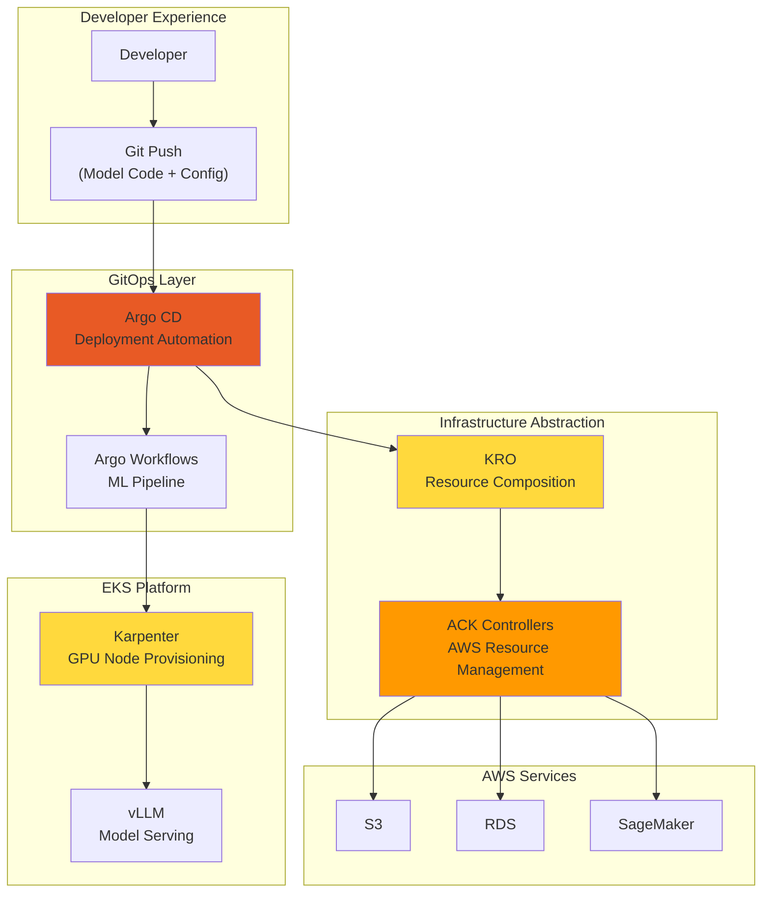

<TrainingCostOptimization />
:::info 完全自动化的优势
使用此集成架构：

- **开发者**：通过简单的 git push 部署模型
- **平台团队**：最小化基础设施管理开销
- **成本优化**：动态配置仅需要的资源
- **一致性**：所有环境使用相同的部署流程
:::

---

## 结论：Kubernetes + EKS Auto Mode 实现 AI 基础设施自动化

Agentic AI 平台建设的四个关键挑战可以通过**云基础设施自动化与 AI 平台的有机集成**来有效解决。特别是，**EKS Auto Mode** 通过自动管理包括 Karpenter 在内的核心组件，完成了**完全自动化的最后一块拼图**。

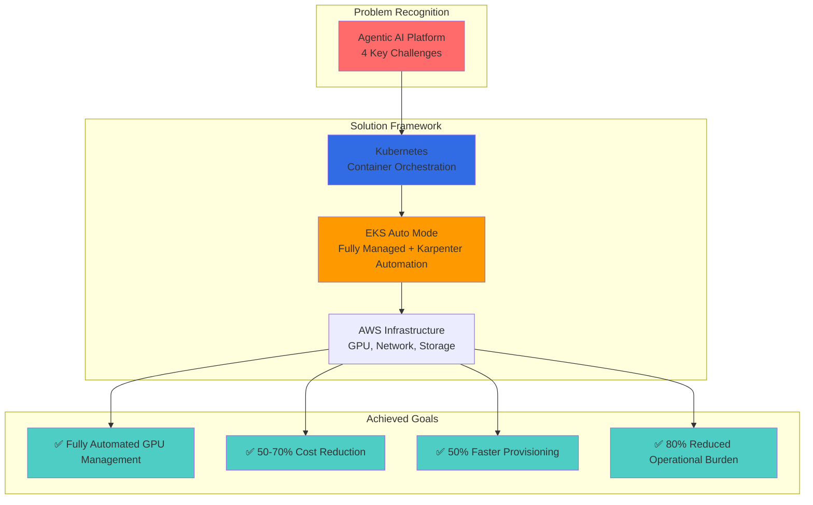

### 核心要点

1. **Kubernetes 是 AI 基础设施的必要基础**：通过声明式资源管理、自动扩缩容和 Operator 模式有效管理复杂的 AI 工作负载
2. **EKS Auto Mode 实现完全自动化**：通过自动管理 Karpenter、VPC CNI、EBS CSI Driver 等核心组件大幅减少运维负担
3. **Karpenter 是 GPU 基础设施自动化的核心**：通过即时配置、Spot 实例和整合优化成本与性能
4. **AWS 基础设施集成最大化协同效应**：与 EFA 网络、多种 GPU 实例和 FSx 存储的紧密集成

### EKS Auto Mode：推荐的起点

我们建议在构建新的 Agentic AI 平台时从 **EKS Auto Mode** 开始。

<DeploymentTimeComparison />
### 各挑战的最终解决方案总结

<EksIntegrationBenefits />
### 关键建议

1. **从 EKS Auto Mode 开始**：使用 Auto Mode 创建新集群以利用自动 Karpenter 配置
2. **定义自定义 GPU NodePool**：添加适合工作负载特征的 GPU NodePool（分离推理/训练/实验）
3. **积极使用 Spot 实例**：70%+ 的推理工作负载运行在 Spot 上
4. **默认启用整合**：利用 EKS Auto Mode 中自动启用的 Consolidation
5. **集成 KEDA**：将基于指标的 Pod 扩缩容与 Karpenter 节点配置联动
6. **添加 EFA NodeClass**：为分布式训练工作负载配置高性能网络

---

## 参考资料

### Kubernetes 和基础设施

- [Kubernetes 官方文档](https://kubernetes.io/docs/)
- [Karpenter 官方文档](https://karpenter.sh/docs/)
- [Amazon EKS 最佳实践指南](https://docs.aws.amazon.com/eks/latest/best-practices/introduction.html)
- [NVIDIA GPU Operator 文档](https://docs.nvidia.com/datacenter/cloud-native/gpu-operator/overview.html)
- [KEDA - Kubernetes 事件驱动自动扩缩容](https://keda.sh/)

### 模型服务与推理

- [vLLM 文档](https://docs.vllm.ai/)
- [llm-d 项目](https://github.com/llm-d/llm-d)
- [Kgateway 文档](https://kgateway.io/docs/)
- [LiteLLM 文档](https://docs.litellm.ai/)

### LLM 可观测性

- [LangFuse 文档](https://langfuse.com/docs)
- [LangSmith 文档](https://docs.smith.langchain.com/)

### Agent 框架与训练

- [KAgent - Kubernetes Agent 框架](https://github.com/kagent-dev/kagent)
- [NVIDIA NeMo 框架](https://docs.nvidia.com/nemo-framework/user-guide/latest/overview.html)
- [Kubeflow 文档](https://www.kubeflow.org/docs/)

### AWS 服务

- [Amazon EKS 文档](https://docs.aws.amazon.com/eks/)
- [EKS Auto Mode](https://docs.aws.amazon.com/eks/latest/userguide/automode.html)
- [AWS Elastic Fabric Adapter (EFA)](https://aws.amazon.com/hpc/efa/)
- [Amazon FSx for Lustre](https://aws.amazon.com/fsx/lustre/)

### EKS 对 Agentic AI 的优势

**为什么 EKS 是最佳平台：**

1. **从第一天起即生产就绪**
   - AWS 托管控制平面，99.95% SLA
   - 自动安全补丁和 Kubernetes 升级
   - 与 AWS 服务（IAM、VPC、CloudWatch）深度集成

2. **简化运维**
   - EKS Auto Mode 消除节点管理
   - Karpenter 自动化 GPU 配置
   - CloudWatch 提供统一可观测性

3. **规模化成本优化**
   - Spot 实例集成节省 60-90%
   - Karpenter 整合减少 30-40% 的空闲浪费
   - 合理选型和自动扩缩容最小化过度配置

4. **企业级安全**
   - Pod 级 IAM 角色（IRSA）
   - VPC 和 Security Groups 的网络隔离
   - 合规认证（HIPAA、PCI-DSS、SOC 2）

### 选择您的路径

<Tabs>
<TabItem value="auto-mode" label="EKS Auto Mode（推荐大多数场景）">

**最适合：**

- 初创公司和小型团队
- Kubernetes 新手团队
- 标准 Agentic AI 工作负载（CPU + 适度 GPU）
- 需要快速上市

**开始使用：**

```bash
aws eks create-cluster \
  --name agentic-ai-auto \
  --region us-west-2 \
  --compute-config enabled=true
```

**优点：**

- 零基础设施管理
- AWS 优化的默认值
- 内置成本优化
- 自动安全补丁

**缺点：**

- 对实例类型的控制较少
- 可能无法针对极端成本场景优化
- GPU 支持限于 AWS 托管类型

</TabItem>
<TabItem value="karpenter" label="EKS + Karpenter（最大控制）">

**最适合：**

- 规模化生产工作负载
- 复杂 GPU 需求（混合实例类型）
- 成本优化是首要优先级（70%+ 节省）
- 具备 Kubernetes 专业知识的团队

**开始使用：**

```bash
terraform apply -f eks-karpenter-blueprint/
kubectl apply -f karpenter-nodepools/
```

**优点：**

- 对实例的精细控制
- 最大成本优化（70-80% 节省）
- 灵活的 GPU 调度
- 自定义 AMI 和节点配置

**缺点：**

- 需要管理 Karpenter
- 配置复杂度更高
- 团队需要 K8s 专业知识

</TabItem>
<TabItem value="hybrid" label="混合模式（两者兼得）">

**最适合：**

- 成长中的平台（从简单开始，扩展到复杂）
- 混合工作负载类型（CPU Agent + GPU LLM）
- 从 Auto Mode 逐步迁移到 Karpenter

**架构：**

- 控制平面使用 EKS Auto Mode
- 系统工作负载使用托管节点组
- GPU 工作负载使用 Karpenter NodePool

**开始使用：**

```bash
# 步骤 1：使用 Auto Mode 创建 EKS 集群
aws eks create-cluster --name agentic-ai --compute-config enabled=true

# 步骤 2：为 GPU 节点安装 Karpenter
helm install karpenter oci://public.ecr.aws/karpenter/karpenter

# 步骤 3：部署 GPU NodePool
kubectl apply -f gpu-nodepools.yaml
```

**优点：**

- 逐步增加复杂度
- 在关键处优化（GPU 成本）
- AWS 托管控制平面 + 自定义数据平面

**缺点：**

- 同时管理 Auto Mode 和 Karpenter
- 可能存在配置冲突

</TabItem>
</Tabs>

### 未来：AI 原生 Kubernetes

**新兴趋势：**

- **AI 优化调度**：Karpenter 配合基于 ML 的实例选择
- **动态模型路由**：基于任务复杂度的智能 LLM 选择
- **联邦学习**：使用 EKS Anywhere 的多集群训练
- **无服务器 GPU**：AWS Lambda GPU 实例用于突发工作负载

**EKS 路线图重点：**

- 原生 GPU 共享（MIG/MPS 支持）
- 集成模型服务（SageMaker + EKS）
- 多租户 AI 平台的成本分配
- LLM 工作负载的增强可观测性

### 行动号召

**立即开始：**

1. **原型验证**（1 周）
   - 部署 EKS Auto Mode 集群
   - 运行示例 Agentic AI 工作负载
   - 测量基线成本和性能

2. **优化**（2-4 周）
   - 为 GPU 工作负载迁移到 Karpenter
   - 实施 KEDA 自动扩缩容
   - 设置 CloudWatch 仪表板

3. **扩展**（持续）
   - 微调整合策略
   - 实施训练流水线
   - 构建多租户平台

**资源：**

- [AWS EKS 最佳实践指南](https://docs.aws.amazon.com/eks/latest/best-practices/introduction.html)
- [Karpenter 文档](https://karpenter.sh/)
- [KEDA Scalers 参考](https://keda.sh/docs/scalers/)
- [Kubeflow on AWS](https://awslabs.github.io/kubeflow-manifests/)

**有问题？**

- 加入 [AWS Containers Slack](https://aws-containers.slack.com)
- 在 [EKS Blueprints](https://github.com/aws-ia/terraform-aws-eks-blueprints) 提交 Issue
- 联系 AWS Solutions Architects 进行架构评审

---

**后续步骤：**

- 查阅[技术挑战文档](./agentic-ai-challenges.md)了解开源替代方案
- 探索 [AWS EKS Workshop](https://eksworkshop.com/) 进行实战练习
- 加入 [Cloud Native 社区](https://community.cncf.io/)了解最新趋势