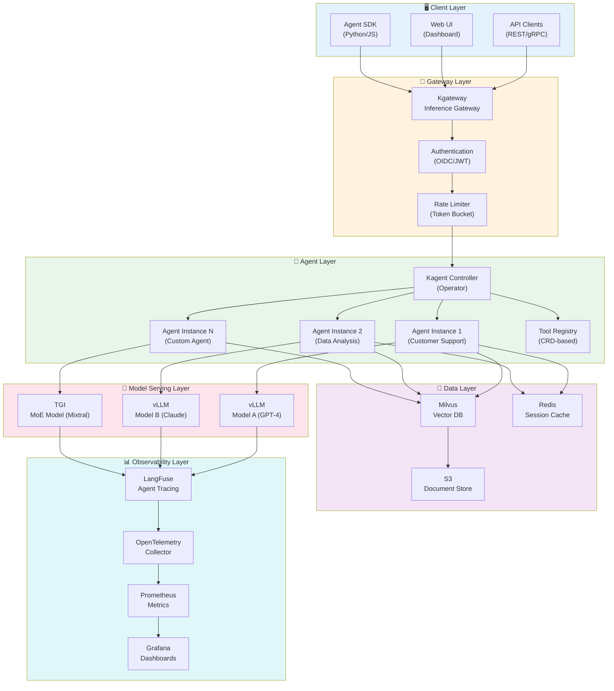
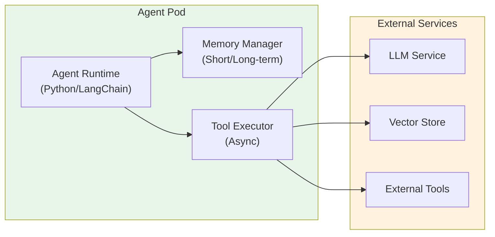
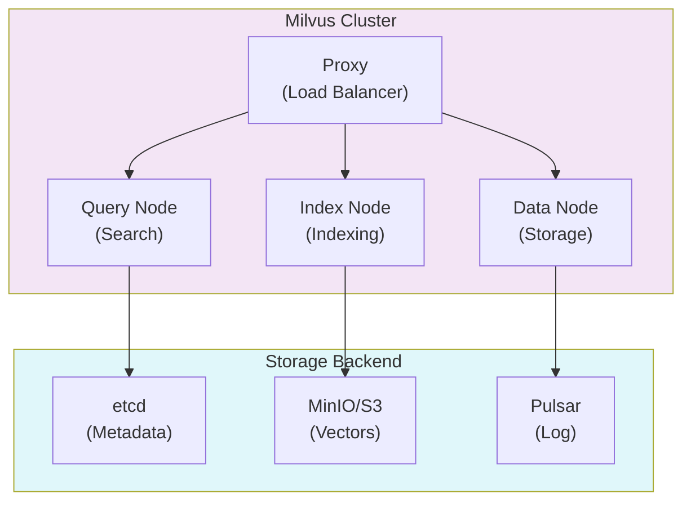
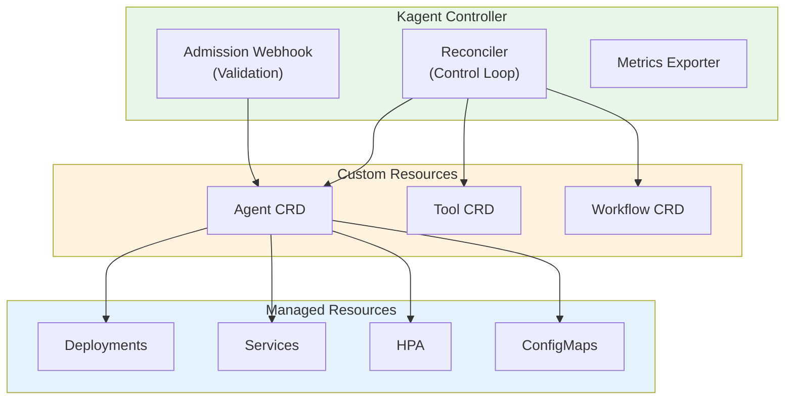
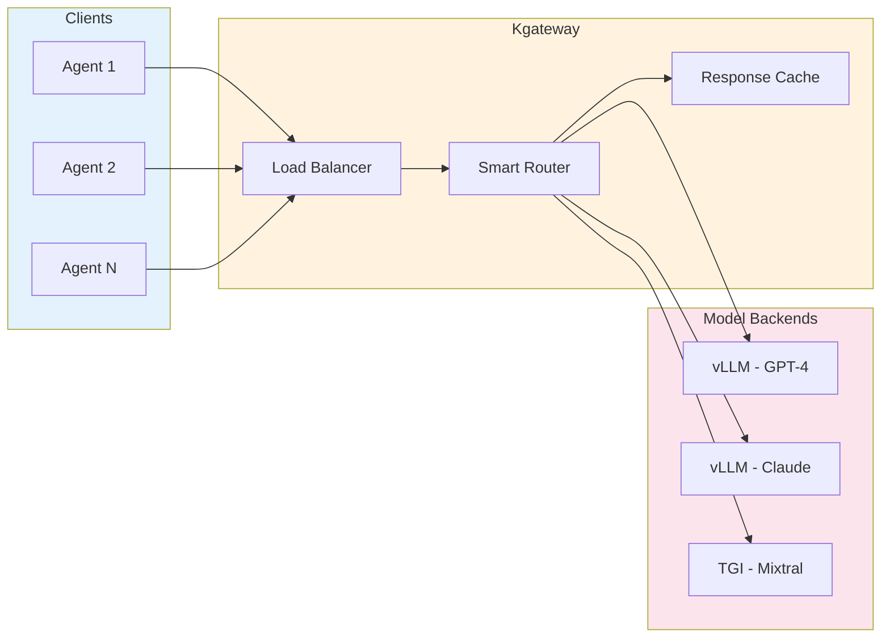
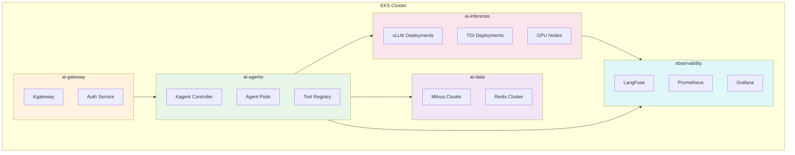
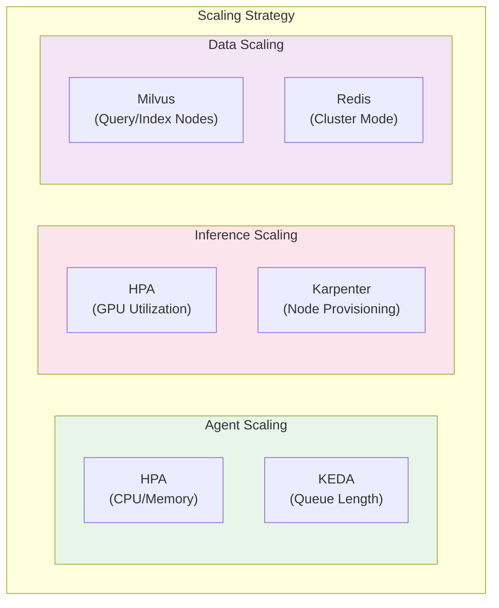
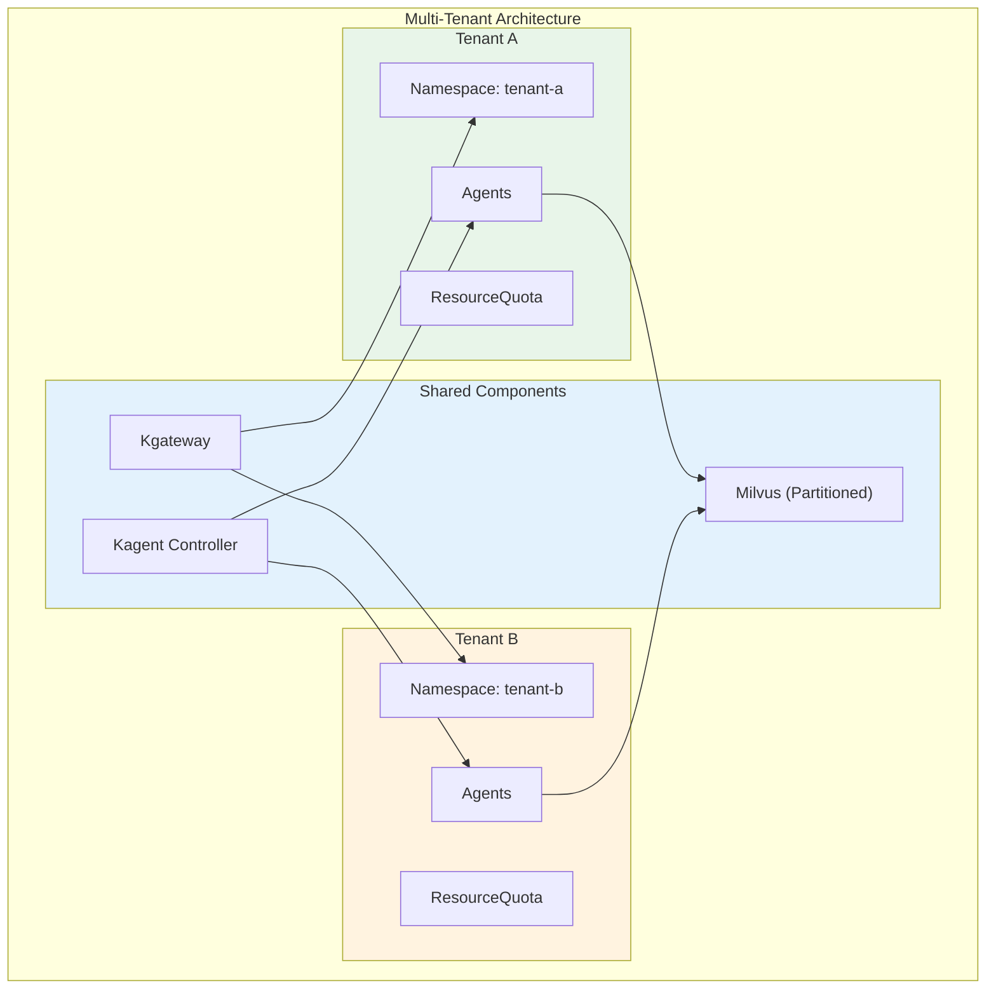
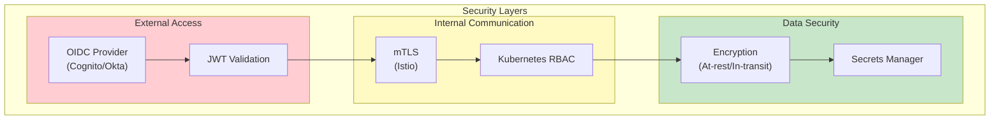
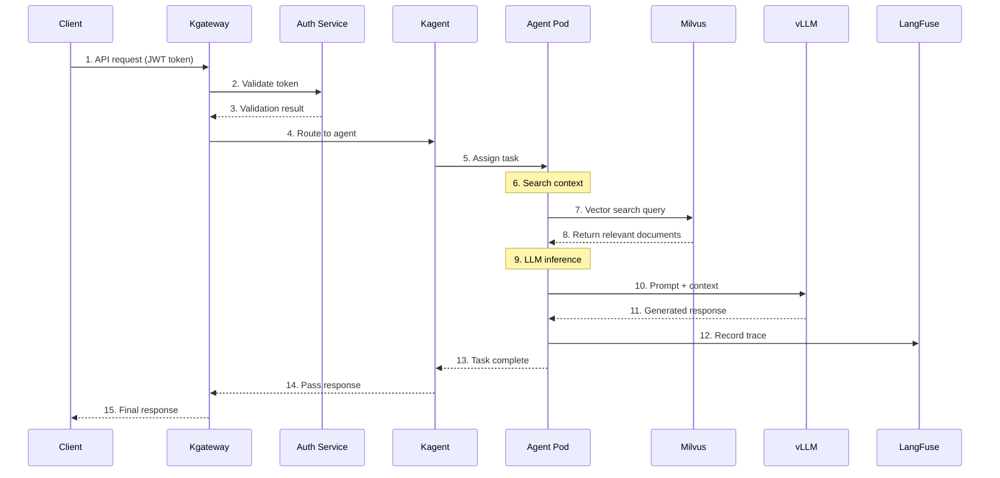

import { CoreCapabilities, LayerRoles, ToolTypes, K8sFeatures, RoutingStrategies, TenantIsolation, RequestProcessing, TechnologyStack } from '@site/src/components/ArchitectureTables';

# Agentic AI 平台架构

> 📅 **撰写日期**: 2025-02-05 | **修改日期**: 2026-02-14 | ⏱️ **阅读时间**: 约 4 分钟

本文涵盖基于 Amazon EKS 的生产级 Agentic AI 平台的完整系统架构和核心组件设计。文中呈现了一种平台架构，用于高效构建和运营能够执行复杂任务的自主 AI Agent。

## 概述

Agentic AI 平台是一个集成平台，使自主 AI Agent 能够执行复杂任务。它通过整合最新的 AI/ML 技术、容器编排和云原生架构，提供稳定且可扩展的 GenAI 服务。

### 问题描述

现有 GenAI 服务实现中的挑战：

- **AI 模型服务的复杂性**：部署和管理各种模型的资源困难
- **缺乏集成**：各种 ML 框架和工具之间缺少集成
- **扩展问题**：性能优化和自动扩展困难
- **MLOps 自动化**：缺少部署管线和自动化
- **成本效率**：缺乏资源利用优化策略

本指南提出了系统性解决这些挑战的实用策略。

### 核心能力

<CoreCapabilities />

:::info 目标读者
本文面向解决方案架构师、平台工程师和 DevOps 工程师。需要具备 Kubernetes 和 AI/ML 工作负载的基本理解。
:::

## 完整系统架构

Agentic AI 平台由 6 个主要层组成。每个层具有明确的职责，通过松耦合实现独立扩展和运维。



### 各层角色

<LayerRoles />

## 核心组件

### Agent 运行时层

Agent 运行时层提供 AI Agent 运行的环境。每个 Agent 作为独立的 Pod 运行，由 Kagent Controller 管理。



#### 核心特性

- **状态管理**：维护 Agent 对话上下文和任务状态
- **工具执行**：异步执行已注册的工具
- **记忆管理**：通过短期/长期记忆维护上下文
- **错误恢复**：对失败任务进行自动重试和降级

### 工具注册表

工具注册表集中管理 Agent 可用的工具。工具通过 Kubernetes CRD（自定义资源定义）以声明方式定义。

```yaml
apiVersion: kagent.dev/v1alpha1
kind: Tool
metadata:
  name: web-search
  namespace: ai-agents
spec:
  type: api
  description: "Perform web search to retrieve latest information"
  config:
    endpoint: http://search-service/api/search
    method: POST
    timeout: 30s
  parameters:
    - name: query
      type: string
      required: true
      description: "Search query"
    - name: max_results
      type: integer
      default: 10
      description: "Maximum number of results"
  authentication:
    type: bearer
    secretRef:
      name: search-api-token
      key: token
```

#### 工具类型

<ToolTypes />

### 记忆存储（Milvus）

Milvus 作为向量存储服务，是 RAG 系统的关键组件。Agent 通过 Milvus 搜索相关文档并增强上下文。



#### Collection 设计示例

```python
from pymilvus import Collection, FieldSchema, CollectionSchema, DataType

# 定义 Collection Schema
fields = [
    FieldSchema(name="id", dtype=DataType.VARCHAR, max_length=64, is_primary=True),
    FieldSchema(name="content", dtype=DataType.VARCHAR, max_length=65535),
    FieldSchema(name="embedding", dtype=DataType.FLOAT_VECTOR, dim=1536),
    FieldSchema(name="metadata", dtype=DataType.JSON),
    FieldSchema(name="tenant_id", dtype=DataType.VARCHAR, max_length=64),
]

schema = CollectionSchema(fields, description="Knowledge base for agents")
collection = Collection(name="agent_knowledge", schema=schema)

# 创建 HNSW 索引（高性能搜索）
index_params = {
    "metric_type": "COSINE",
    "index_type": "HNSW",
    "params": {"M": 16, "efConstruction": 256}
}
collection.create_index(field_name="embedding", index_params=index_params)
```

### 编排器（Kagent）

Kagent 使用 Kubernetes Operator 模式管理 AI Agent 的完整生命周期。



#### Agent CRD 示例

```yaml
apiVersion: kagent.dev/v1alpha1
kind: Agent
metadata:
  name: customer-support-agent
  namespace: ai-agents
spec:
  # 模型配置
  model:
    provider: openai
    name: gpt-4-turbo
    temperature: 0.7
    maxTokens: 4096

  # 系统提示词
  systemPrompt: |
    You are a friendly and professional customer support agent.
    Always provide accurate information, and honestly admit when you don't know something.

  # 使用的工具
  tools:
    - name: search-knowledge-base
      type: retrieval
      config:
        vectorStore: milvus
        collection: support-docs
        topK: 5
    - name: create-ticket
      type: api
      config:
        endpoint: http://ticketing-service/api/tickets
        method: POST

  # 记忆配置
  memory:
    type: redis
    config:
      host: redis-master.ai-data.svc.cluster.local
      port: 6379
      ttl: 3600
      maxHistory: 50

  # 扩展配置
  scaling:
    minReplicas: 2
    maxReplicas: 10
    targetCPUUtilization: 70
    targetMemoryUtilization: 80

  # 资源限制
  resources:
    requests:
      memory: "512Mi"
      cpu: "250m"
    limits:
      memory: "1Gi"
      cpu: "500m"
```

### 推理网关（Kgateway）

Kgateway 基于 Kubernetes Gateway API 对 AI 模型推理请求进行智能路由。



#### HTTPRoute 配置示例

```yaml
apiVersion: gateway.networking.k8s.io/v1
kind: HTTPRoute
metadata:
  name: inference-routing
  namespace: ai-gateway
spec:
  parentRefs:
    - name: ai-gateway
      namespace: ai-gateway
  rules:
    # GPT-4 模型路由（基于权重）
    - matches:
        - path:
            type: PathPrefix
            value: /v1/chat/completions
          headers:
            - name: x-model-id
              value: "gpt-4"
      backendRefs:
        - name: vllm-gpt4-primary
          port: 8000
          weight: 80
        - name: vllm-gpt4-canary
          port: 8000
          weight: 20

    # Claude 模型路由
    - matches:
        - path:
            type: PathPrefix
            value: /v1/chat/completions
          headers:
            - name: x-model-id
              value: "claude-3"
      backendRefs:
        - name: vllm-claude3
          port: 8000

    # MoE 模型路由（用于复杂任务）
    - matches:
        - path:
            type: PathPrefix
            value: /v1/chat/completions
          headers:
            - name: x-model-id
              value: "mixtral-8x7b"
      backendRefs:
        - name: tgi-mixtral
          port: 8080
```

#### 路由策略

<RoutingStrategies />

## Kubernetes 部署架构

### 命名空间组织策略

Agentic AI 平台按功能分离命名空间，以实现关注点分离和安全性。



#### 命名空间配置

```yaml
# ai-gateway 命名空间
apiVersion: v1
kind: Namespace
metadata:
  name: ai-gateway
  labels:
    istio-injection: enabled
    pod-security.kubernetes.io/enforce: restricted
---
# ai-agents 命名空间
apiVersion: v1
kind: Namespace
metadata:
  name: ai-agents
  labels:
    istio-injection: enabled
    pod-security.kubernetes.io/enforce: baseline
---
# ai-inference 命名空间（GPU 工作负载）
apiVersion: v1
kind: Namespace
metadata:
  name: ai-inference
  labels:
    pod-security.kubernetes.io/enforce: privileged
  annotations:
    scheduler.alpha.kubernetes.io/defaultTolerations: '[{"key":"nvidia.com/gpu","operator":"Exists"}]'
---
# ai-data 命名空间
apiVersion: v1
kind: Namespace
metadata:
  name: ai-data
  labels:
    pod-security.kubernetes.io/enforce: baseline
---
# observability 命名空间
apiVersion: v1
kind: Namespace
metadata:
  name: observability
  labels:
    pod-security.kubernetes.io/enforce: baseline
```

### 资源分配策略

在每个命名空间上设置 ResourceQuota 以限制资源使用并确保公平分配。

```yaml
apiVersion: v1
kind: ResourceQuota
metadata:
  name: ai-inference-quota
  namespace: ai-inference
spec:
  hard:
    requests.cpu: "100"
    requests.memory: "500Gi"
    limits.cpu: "200"
    limits.memory: "1Ti"
    requests.nvidia.com/gpu: "32"
    persistentvolumeclaims: "50"
---
apiVersion: v1
kind: ResourceQuota
metadata:
  name: ai-agents-quota
  namespace: ai-agents
spec:
  hard:
    requests.cpu: "50"
    requests.memory: "100Gi"
    limits.cpu: "100"
    limits.memory: "200Gi"
    pods: "200"
```

:::warning 资源规划
GPU 资源昂贵，需要仔细规划。初始阶段保守配置，通过监控逐步调整。
:::

## 可扩展性设计

### 水平扩展策略

Agentic AI 平台的每个组件可以独立进行水平扩展。



#### Agent 自动扩展（KEDA）

```yaml
apiVersion: keda.sh/v1alpha1
kind: ScaledObject
metadata:
  name: agent-scaler
  namespace: ai-agents
spec:
  scaleTargetRef:
    name: customer-support-agent
  minReplicaCount: 2
  maxReplicaCount: 20
  pollingInterval: 15
  cooldownPeriod: 300
  triggers:
    # 基于 Redis 队列长度扩展
    - type: redis
      metadata:
        address: redis-master.ai-data.svc:6379
        listName: agent-task-queue
        listLength: "10"
    # 基于 Prometheus 指标扩展
    - type: prometheus
      metadata:
        serverAddress: http://prometheus.observability.svc:9090
        metricName: agent_active_sessions
        threshold: "50"
        query: |
          sum(agent_active_sessions{agent="customer-support"})
```

#### GPU 节点自动配置（Karpenter）

```yaml
apiVersion: karpenter.sh/v1
kind: NodePool
metadata:
  name: gpu-inference-pool
spec:
  template:
    spec:
      requirements:
        - key: "node.kubernetes.io/instance-type"
          operator: In
          values:
            - "p4d.24xlarge"   # 8x A100 40GB
            - "p5.48xlarge"   # 8x H100 80GB
            - "g5.48xlarge"   # 8x A10G 24GB
        - key: "karpenter.sh/capacity-type"
          operator: In
          values: ["on-demand", "spot"]
        - key: "kubernetes.io/arch"
          operator: In
          values: ["amd64"]
      nodeClassRef:
        group: karpenter.k8s.aws
        kind: EC2NodeClass
        name: gpu-nodeclass
  limits:
    nvidia.com/gpu: 64
  disruption:
    consolidationPolicy: WhenEmptyOrUnderutilized
    consolidateAfter: 30s
    budgets:
      - nodes: "20%"
---
apiVersion: karpenter.k8s.aws/v1
kind: EC2NodeClass
metadata:
  name: gpu-nodeclass
spec:
  amiFamily: AL2
  subnetSelectorTerms:
    - tags:
        karpenter.sh/discovery: "ai-cluster"
  securityGroupSelectorTerms:
    - tags:
        karpenter.sh/discovery: "ai-cluster"
  blockDeviceMappings:
    - deviceName: /dev/xvda
      ebs:
        volumeSize: 500Gi
        volumeType: gp3
        iops: 10000
        throughput: 500
  tags:
    Environment: production
    Workload: ai-inference
```

### 多租户支持

Agentic AI 平台支持多租户，使多个团队或项目能够共享同一平台。



#### 租户隔离策略

<TenantIsolation />

#### 每租户资源分配

```yaml
apiVersion: v1
kind: ResourceQuota
metadata:
  name: tenant-a-quota
  namespace: tenant-a
spec:
  hard:
    requests.cpu: "20"
    requests.memory: "40Gi"
    limits.cpu: "40"
    limits.memory: "80Gi"
    requests.nvidia.com/gpu: "4"
    pods: "50"
    services: "10"
---
apiVersion: networking.k8s.io/v1
kind: NetworkPolicy
metadata:
  name: tenant-isolation
  namespace: tenant-a
spec:
  podSelector: {}
  policyTypes:
    - Ingress
    - Egress
  ingress:
    - from:
        - namespaceSelector:
            matchLabels:
              name: tenant-a
        - namespaceSelector:
            matchLabels:
              name: ai-gateway
  egress:
    - to:
        - namespaceSelector:
            matchLabels:
              name: tenant-a
        - namespaceSelector:
            matchLabels:
              name: ai-inference
        - namespaceSelector:
            matchLabels:
              name: ai-data
```

## 安全架构

### 认证/授权

Agentic AI 平台采用多层安全模型。



#### RBAC 配置示例

```yaml
# Agent 操作员角色
apiVersion: rbac.authorization.k8s.io/v1
kind: Role
metadata:
  name: agent-operator
  namespace: ai-agents
rules:
  - apiGroups: ["kagent.dev"]
    resources: ["agents", "tools", "workflows"]
    verbs: ["get", "list", "watch", "create", "update", "patch", "delete"]
  - apiGroups: [""]
    resources: ["pods", "pods/log", "services", "configmaps"]
    verbs: ["get", "list", "watch"]
  - apiGroups: [""]
    resources: ["secrets"]
    verbs: ["get", "list"]
    resourceNames: ["agent-*"]
---
# Agent 查看者角色
apiVersion: rbac.authorization.k8s.io/v1
kind: Role
metadata:
  name: agent-viewer
  namespace: ai-agents
rules:
  - apiGroups: ["kagent.dev"]
    resources: ["agents", "tools", "workflows"]
    verbs: ["get", "list", "watch"]
  - apiGroups: [""]
    resources: ["pods", "pods/log"]
    verbs: ["get", "list", "watch"]
```

### 网络策略

```yaml
# ai-inference 命名空间的网络策略
apiVersion: networking.k8s.io/v1
kind: NetworkPolicy
metadata:
  name: inference-network-policy
  namespace: ai-inference
spec:
  podSelector: {}
  policyTypes:
    - Ingress
    - Egress
  ingress:
    # 仅允许来自 ai-agents 的访问
    - from:
        - namespaceSelector:
            matchLabels:
              name: ai-agents
        - namespaceSelector:
            matchLabels:
              name: ai-gateway
      ports:
        - protocol: TCP
          port: 8000
        - protocol: TCP
          port: 8080
  egress:
    # 允许外部模型 API 访问（如需要）
    - to:
        - ipBlock:
            cidr: 0.0.0.0/0
            except:
              - 10.0.0.0/8
              - 172.16.0.0/12
              - 192.168.0.0/16
      ports:
        - protocol: TCP
          port: 443
    # 向 observability 发送指标
    - to:
        - namespaceSelector:
            matchLabels:
              name: observability
      ports:
        - protocol: TCP
          port: 9090
```

:::danger 安全注意事项

- 在生产环境中始终启用 mTLS
- 将 API 密钥和令牌存储在 Kubernetes Secrets 或 AWS Secrets Manager 中
- 定期进行安全审计并修补漏洞

:::

## 数据流

以下图表展示了用户请求如何在平台中被处理。



### 请求处理步骤

<RequestProcessing />

## 监控与可观测性

### 核心指标

```yaml
# Prometheus ServiceMonitor
apiVersion: monitoring.coreos.com/v1
kind: ServiceMonitor
metadata:
  name: agent-metrics
  namespace: observability
spec:
  selector:
    matchLabels:
      app: kagent
  namespaceSelector:
    matchNames:
      - ai-agents
  endpoints:
    - port: metrics
      interval: 15s
      path: /metrics
---
# PrometheusRule 告警规则
apiVersion: monitoring.coreos.com/v1
kind: PrometheusRule
metadata:
  name: agent-alerts
  namespace: observability
spec:
  groups:
    - name: agent-alerts
      rules:
        - alert: AgentHighLatency
          expr: |
            histogram_quantile(0.99,
              rate(agent_request_duration_seconds_bucket[5m])
            ) > 10
          for: 5m
          labels:
            severity: warning
          annotations:
            summary: "Agent 响应延迟增加"
            description: "P99 延迟超过 10 秒"

        - alert: AgentHighErrorRate
          expr: |
            rate(agent_request_errors_total[5m]) /
            rate(agent_request_total[5m]) > 0.05
          for: 5m
          labels:
            severity: critical
          annotations:
            summary: "Agent 错误率增加"
            description: "错误率超过 5%"
```

### Grafana 仪表板配置

关键监控仪表板：

- **Agent 概览**：按 Agent 查看请求数、延迟、错误率
- **LLM 性能**：按模型查看 Token 吞吐量、推理时间
- **资源使用**：CPU、内存、GPU 利用率
- **成本追踪**：按租户和模型进行成本追踪

## 技术栈

<TechnologyStack />

## 结论

Agentic AI 平台架构遵循以下核心原则：

1. **模块化**：每个组件可以独立部署、扩展和更新
2. **可扩展性**：通过 Kubernetes 原生扩展灵活应对流量变化
3. **可观测性**：通过集成监控追踪和分析完整请求流程
4. **安全性**：通过多层安全模型保护数据和服务
5. **多租户**：通过资源隔离和公平分配支持多个团队

:::tip 后续步骤

- [GPU 资源管理](./gpu-resource-management.md) - 动态资源分配详细指南
- [Kagent Agent 管理](./kagent-kubernetes-agents.md) - Agent 部署与运维
- [Agent 监控](./agent-monitoring.md) - LangFuse 集成指南

:::

## 参考资料

- [Kagent GitHub 仓库](https://github.com/kagent-dev/kagent)
- [Kgateway 文档](https://kgateway.dev/)
- [Milvus 文档](https://milvus.io/docs)
- [LangFuse 文档](https://langfuse.com/docs)
- [Kubernetes Gateway API](https://gateway-api.sigs.k8s.io/)
- [Karpenter 文档](https://karpenter.sh/docs/)
