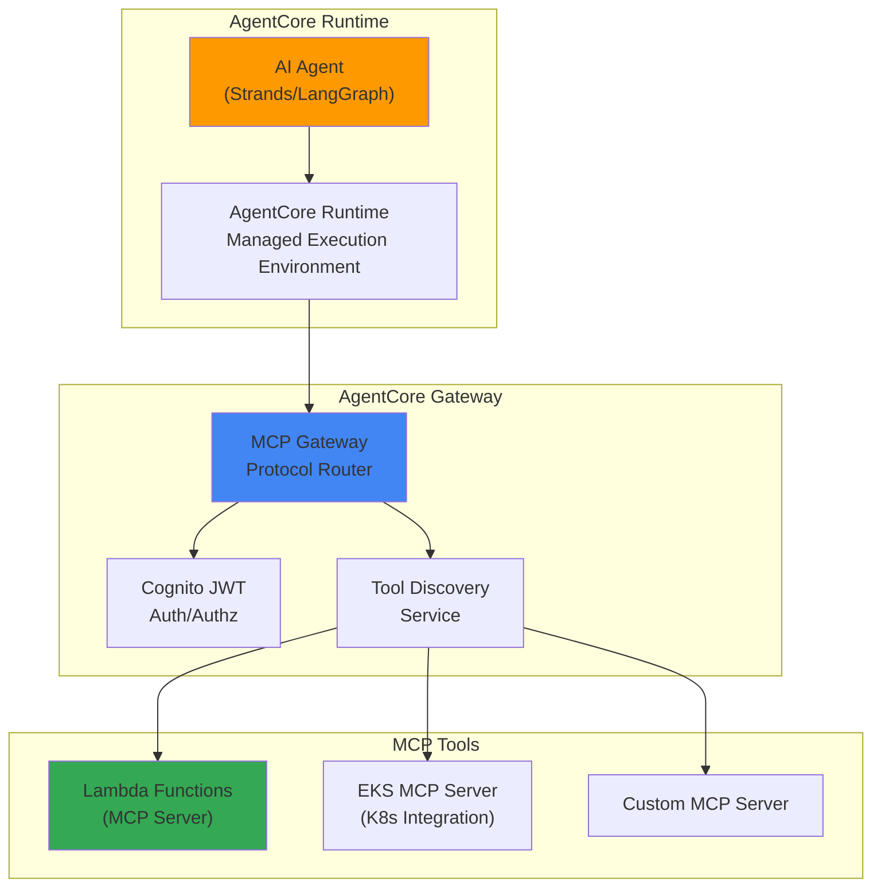
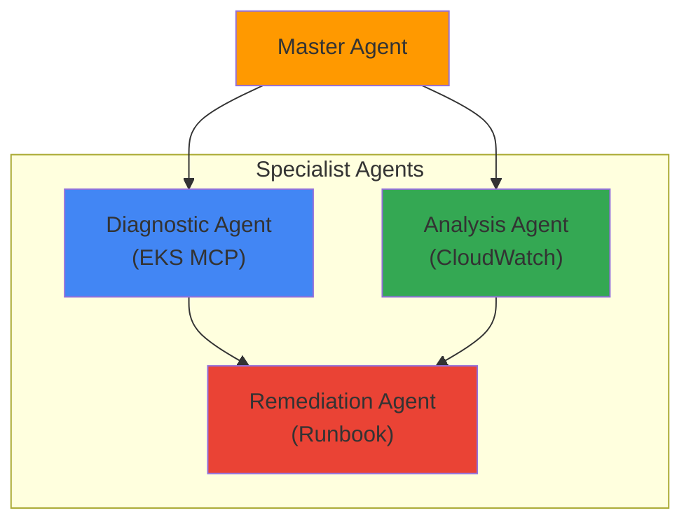

import { EKSMCPFeatures, KagentVsAgentCore, MultiAgentPatterns, MCPServerEcosystem } from '@site/src/components/BedrockMcpTables';

# Bedrock AgentCore 与 MCP 集成

> 📅 **撰写日期**: 2026-02-13 | **修改日期**: 2026-02-14 | ⏱️ **阅读时间**: 约 3 分钟

## 概述

:::caution Bedrock AgentCore 状态
Amazon Bedrock AgentCore 在 AWS re:Invent 2025 上发布，目前处于预览阶段。请查看 AWS 官方公告了解 GA（正式发布）时间表。在生产环境部署前需要进行充分的测试。
:::

Amazon Bedrock AgentCore 是一个完全托管的 AI Agent 生产运行时。它原生支持 Model Context Protocol (MCP)，以标准化 Agent 间通信、工具发现和调用。

本文档介绍如何在基于 EKS 的 Agentic AI 平台上使用 Bedrock AgentCore 运维生产级 AI Agent。

## 核心架构

### AgentCore 三层结构



### MCP 协议

MCP（Model Context Protocol）是 AI Agent 与工具之间的标准通信协议：

- **工具发现**：Agent 动态发现可用工具
- **上下文传递**：以标准化格式传递执行上下文和状态
- **结果返回**：以结构化格式返回工具执行结果
- **Agent 间通信**：通过 MCP 实现多 Agent 协作

## EKS MCP Server 集成

### EKS MCP Server 概述

AWS 为 EKS 提供了专用的托管 MCP Server，以支持 Kubernetes 集群与 AI Agent 之间的集成：

<EKSMCPFeatures />

### SRE Agent 示例

:::info 说明
下面的 `AgentDefinition` CRD 是展示 AgentCore 声明式 Agent 定义概念的示例。实际部署时，请通过 AWS 控制台、Bedrock Agent API (boto3) 或 CloudFormation 配置 Agent。
:::

**实际部署方法（使用 boto3）：**

```python
import boto3

bedrock_agent = boto3.client('bedrock-agent')

# 创建 Agent
response = bedrock_agent.create_agent(
    agentName='sre-agent',
    foundationModel='anthropic.claude-sonnet-4-20250514',
    instruction='You are an SRE agent that helps troubleshoot Kubernetes clusters.',
    agentResourceRoleArn='arn:aws:iam::ACCOUNT:role/BedrockAgentRole',
)

agent_id = response['agent']['agentId']

# 连接 MCP 工具（Action Group）
bedrock_agent.create_agent_action_group(
    agentId=agent_id,
    agentVersion='DRAFT',
    actionGroupName='eks-mcp-tools',
    actionGroupExecutor={
        'customControl': 'RETURN_CONTROL'  # 路由到 MCP Server
    },
    apiSchema={
        'payload': json.dumps({
            'openapi': '3.0.0',
            'info': {'title': 'EKS MCP Tools', 'version': '1.0'},
            'paths': {
                '/pod-logs': {'post': {'description': 'Get pod logs'}},
                '/k8s-events': {'post': {'description': 'Get K8s events'}},
            }
        })
    }
)
```

**概念性 CRD 示例（非实际使用）：**

```yaml
# 使用 AgentCore 的 SRE Agent 定义（概念示例）
apiVersion: agentcore.aws/v1
kind: AgentDefinition
metadata:
  name: sre-agent
spec:
  runtime:
    model: anthropic.claude-sonnet-4-20250514
    maxTokens: 4096
  tools:
    - type: mcp
      server: eks-mcp-server
      capabilities:
        - pod-logs
        - k8s-events
        - cloudwatch-metrics
    - type: mcp
      server: custom-runbook-server
      capabilities:
        - execute-runbook
        - create-incident
  policies:
    - name: read-only-production
      effect: allow
      actions: ["read"]
      resources: ["pods", "services", "deployments"]
```

### Kagent 与 AgentCore 集成

您可以将现有的基于 Kagent 的 Agent 与 Bedrock AgentCore 结合使用：

<KagentVsAgentCore />

**混合方案**：一种有效的策略是将成本敏感的高频调用路由到 Kagent + vLLM，将需要复杂推理的低频调用路由到 Bedrock AgentCore。

### 多 Agent 编排

AgentCore 通过 MCP 支持 Agent 间协作：

```python
import boto3

bedrock_runtime = boto3.client('bedrock-agent-runtime')

# 调用主 Agent
response = bedrock_runtime.invoke_agent(
    agentId='master-agent-id',
    sessionId='session-123',
    inputText='请诊断生产集群中不健康的 Pod 并提出解决方案'
)

# 主 Agent 内部调用以下 Agent：
# 1. 诊断 Agent（使用 EKS MCP Server）
# 2. 分析 Agent（CloudWatch 指标分析）
# 3. 修复 Agent（Runbook 执行）
```

**多 Agent 模式：**

<MultiAgentPatterns />



## 安全与访问控制

### Cognito JWT 认证

AgentCore Gateway 通过 Amazon Cognito 提供基于 JWT 的认证：

```yaml
# MCP Gateway 认证配置
apiVersion: v1
kind: ConfigMap
metadata:
  name: agentcore-auth-config
data:
  auth.yaml: |
    provider: cognito
    userPoolId: ap-northeast-2_xxxxx
    clientId: your-client-id
    scopes:
      - agents/invoke
      - tools/read
      - tools/execute
```

### IAM 策略

```json
{
  "Version": "2012-10-17",
  "Statement": [
    {
      "Effect": "Allow",
      "Action": [
        "bedrock:InvokeAgent",
        "bedrock:GetAgent"
      ],
      "Resource": "arn:aws:bedrock:ap-northeast-2:123456789012:agent/your-agent-id"
    },
    {
      "Effect": "Allow",
      "Action": [
        "bedrock:InvokeModel"
      ],
      "Resource": "arn:aws:bedrock:ap-northeast-2::foundation-model/anthropic.claude-*"
    }
  ]
}
```

## 监控与可观测性

### AgentCore 指标

Bedrock AgentCore 自动将 Agent 执行指标发布到 CloudWatch：

- `AgentInvocations`：Agent 调用次数
- `AgentLatency`：Agent 响应时间
- `ToolInvocations`：工具调用次数
- `ToolErrors`：工具执行错误
- `TokenUsage`：Token 使用量

### LangFuse 集成

您可以将现有的 LangFuse 监控与 AgentCore 集成，实现统一的可观测性：

```python
from langfuse import Langfuse
import boto3

langfuse = Langfuse()
bedrock = boto3.client('bedrock-agent-runtime')

# 使用 LangFuse 追踪 AgentCore 调用
trace = langfuse.trace(name="sre-agent-invocation")
span = trace.span(name="bedrock-agentcore")

response = bedrock.invoke_agent(
    agentId="your-agent-id",
    sessionId="session-123",
    inputText="请诊断生产命名空间中不健康的 Pod"
)

span.end(output=response)
```

### CloudWatch 生成式 AI 可观测性集成

:::tip CloudWatch Gen AI 可观测性正式发布
CloudWatch 生成式 AI 可观测性已于 **2025 年 10 月正式发布**。它与 AgentCore 原生集成，无需额外配置即可自动将 Agent 调用、工具执行和 Token 使用情况记录到 CloudWatch。
:::

AgentCore 与 **CloudWatch 生成式 AI 可观测性** 原生集成：

- **Agent 执行追踪**：端到端追踪可视化整个推理流程
- **工具调用监控**：按 MCP Server 追踪调用次数、延迟和错误率
- **Token 消耗分析**：按模型追踪输入/输出 Token 使用量和成本
- **异常检测**：使用 CloudWatch 异常检测自动发现异常模式

**在 CloudWatch 控制台中查看：**

1. CloudWatch 控制台 → "AgentCore" 标签页
2. 自动生成 Agent 专属指标仪表板
3. 通过提示追踪查看完整执行流程
4. 使用 Logs Insights 进行详细日志分析

同时使用 LangFuse（自托管的详细追踪）和 CloudWatch Gen AI 可观测性（AWS 原生集成）可以提供最全面的可观测性。

## AWS MCP Server 部署

AWS 以开源形式提供官方 MCP Server（[github.com/awslabs/mcp](https://github.com/awslabs/mcp)）：

### EKS MCP Server 部署

```bash
# 克隆 AWS MCP Server 仓库
git clone https://github.com/awslabs/mcp.git
cd mcp/servers/eks

# 构建 Docker 镜像
docker build -t eks-mcp-server:latest .

# 部署到 EKS
kubectl apply -f k8s/deployment.yaml
```

**EKS MCP Server 部署：**

```yaml
apiVersion: apps/v1
kind: Deployment
metadata:
  name: eks-mcp-server
  namespace: mcp-servers
spec:
  replicas: 2
  selector:
    matchLabels:
      app: eks-mcp-server
  template:
    metadata:
      labels:
        app: eks-mcp-server
    spec:
      serviceAccountName: eks-mcp-server
      containers:
      - name: server
        image: eks-mcp-server:latest
        ports:
        - containerPort: 8080
          name: http
        env:
        - name: CLUSTER_NAME
          value: "production-cluster"
        - name: AWS_REGION
          value: "ap-northeast-2"
        resources:
          requests:
            cpu: "500m"
            memory: "512Mi"
          limits:
            cpu: "1"
            memory: "1Gi"
---
apiVersion: v1
kind: Service
metadata:
  name: eks-mcp-server
  namespace: mcp-servers
spec:
  selector:
    app: eks-mcp-server
  ports:
  - port: 80
    targetPort: 8080
  type: ClusterIP
```

**IAM 权限设置（IRSA）：**

```json
{
  "Version": "2012-10-17",
  "Statement": [
    {
      "Effect": "Allow",
      "Action": [
        "eks:DescribeCluster",
        "eks:ListClusters"
      ],
      "Resource": "arn:aws:eks:ap-northeast-2:*:cluster/*"
    },
    {
      "Effect": "Allow",
      "Action": [
        "logs:GetLogEvents",
        "logs:FilterLogEvents"
      ],
      "Resource": "arn:aws:logs:ap-northeast-2:*:log-group:/aws/eks/*"
    },
    {
      "Effect": "Allow",
      "Action": [
        "cloudwatch:GetMetricData",
        "cloudwatch:GetMetricStatistics"
      ],
      "Resource": "*"
    }
  ]
}
```

## AWS MCP Server 生态系统

AWS 以开源形式提供官方 MCP Server（[github.com/awslabs/mcp](https://github.com/awslabs/mcp)）：

<MCPServerEcosystem />

## 相关文档

- [Agentic AI 平台架构](./agentic-platform-architecture.md)
- [Kagent Kubernetes Agent](./kagent-kubernetes-agents.md)
- [Agent 监控](./agent-monitoring.md)
- [推理网关路由](./inference-gateway-routing.md)

## 参考资料

- [Amazon Bedrock AgentCore 文档](https://docs.aws.amazon.com/bedrock/latest/userguide/agents.html)
- [AWS MCP Servers (GitHub)](https://github.com/awslabs/mcp)
- [Model Context Protocol 规范](https://modelcontextprotocol.io/)
- [CloudWatch 生成式 AI 可观测性](https://aws.amazon.com/blogs/mt/launching-amazon-cloudwatch-generative-ai-observability-preview/)
- [CNS421: Streamline EKS Operations with Agentic AI (re:Invent 2025)](https://www.youtube.com/watch?v=4s-a0jY4kSE)
