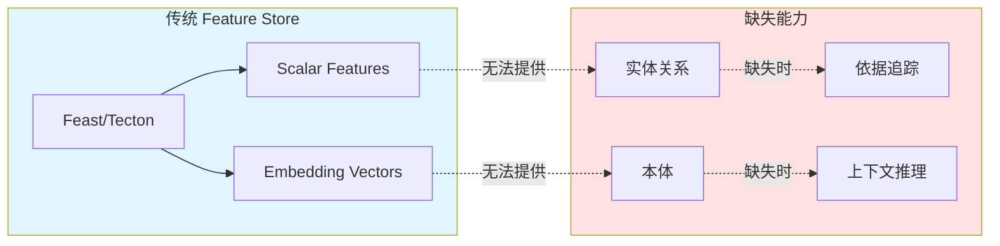
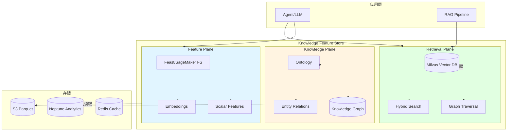
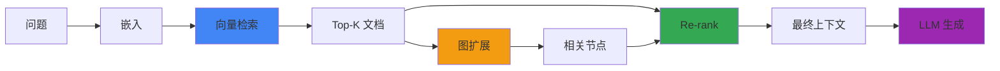
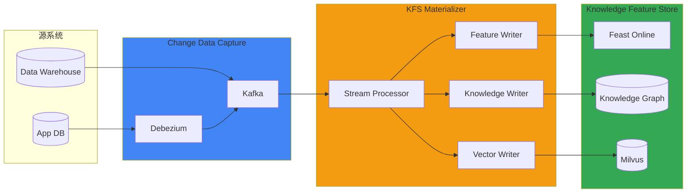

:::info 前瞻性设计
将在独立本体会话(2026-Q2)中具体化。本文档是概念设计和试点范围建议。
:::

# Knowledge Feature Store 扩展

## 问题定义: 仅 Feature Store 为何不足

传统 Feature Store(Feast, SageMaker Feature Store, Tecton)在高效提供**标量值和嵌入向量**方面进行了优化。但在 Agentic AI 环境中暴露出以下局限:

### 传统 Feature Store 的局限



**具体问题案例:**

1. **实体关系缺失** → 产生幻觉
   - 问题: "客户 A 最近合同连接的设备是什么?"
   - 传统 FS: 分别返回客户嵌入、合同嵌入
   - 结果: LLM 连接无关设备产生幻觉
   - 需要: `(Customer)-[:HAS_CONTRACT]->(Contract)-[:USES]->(Device)` 关系

2. **本体缺失** → 领域术语误解
   - 问题: "客户等级为'Premium'的用户使用模式"
   - 传统 FS: 将'Premium'作为简单字符串处理
   - 结果: 无法理解与'VIP'、'Gold'、'Platinum'的关系
   - 需要: `Premium subClassOf HighValueCustomer`, `VIP equivalentTo Premium` 定义

3. **Provenance 缺失** → 审计失败
   - 要求: "此答案的依据数据来源?"
   - 传统 FS: 仅提供向量相似度,无法追溯源数据
   - 结果: 合规失败(SOC2, GDPR)
   - 需要: Feature → Raw Data → Source System → Timestamp 链

4. **时间关系缺失** → 上下文错误
   - 问题: "2025 Q4 解约客户的先前使用模式"
   - 传统 FS: 仅支持时点查询
   - 结果: 无法连接解约前后关系
   - 需要: 时序边 `BEFORE`, `AFTER` 关系

---

## Knowledge Feature Store 概念模型

Knowledge Feature Store(KFS)通过 3-plane 架构扩展传统 Feature Store,为 scalar/vector 数据添加**关系和语义**。

### 3-Plane 架构



### 各 Plane 的职责

| Plane | 职责 | 数据格式 | 读取延迟 | 示例查询 |
|-------|------|------------|---------|----------|
| **Feature Plane** | 提供 Scalar/Vector 特征 | Parquet, Protobuf | &lt;10ms | `get_features(entity_id, feature_names)` |
| **Knowledge Plane** | 实体关系·本体 | RDF, Property Graph | &lt;50ms | `traverse(Customer, depth=2, relation='HAS_CONTRACT')` |
| **Retrieval Plane** | 向量检索 + 图扩展 | HNSW Index, Cypher | &lt;100ms | `hybrid_search(query_embedding, kg_expand=True)` |

### 统一读取 API

```python
from kfs import KnowledgeFeatureStore

kfs = KnowledgeFeatureStore(
    feature_store="feast://cluster.local",
    knowledge_graph="neptune://cluster.amazonaws.com",
    vector_store="milvus://milvus.svc.cluster.local:19530"
)

# 统一查询: 向量检索 + 图扩展 + 特征加载
result = kfs.retrieve(
    query="客户等级为 Premium 的用户最近使用模式",
    retrieval_config={
        "vector_top_k": 10,
        "graph_expand": {
            "depth": 2,
            "relations": ["HAS_CONTRACT", "USES_DEVICE"]
        },
        "features": ["usage_last_30d", "churn_risk_score"]
    }
)

# 结果:
# - contexts: 向量检索找到的 10 个文档
# - entities: 图扩展连接的 Customer, Contract, Device 节点
# - features: 各实体的 scalar/vector 特征
# - provenance: 各数据的来源和时间戳
```

---

## 本体模式与实体解释

### 领域本体定义

在 Agentic AI 平台处理的领域实体(客户、合同、设备、使用)使用 SKOS/OWL-lite 子集定义。

```turtle
@prefix kfs: <http://platform.ai/ontology/kfs#> .
@prefix skos: <http://www.w3.org/2004/02/skos/core#> .
@prefix owl: <http://www.w3.org/2002/07/owl#> .

# 核心实体
kfs:Customer a owl:Class ;
    skos:prefLabel "客户"@zh ;
    skos:definition "使用服务的个人或法人"@zh .

kfs:Contract a owl:Class ;
    skos:prefLabel "合同"@zh ;
    skos:definition "与客户签订的服务合同"@zh .

kfs:Device a owl:Class ;
    skos:prefLabel "设备"@zh ;
    skos:definition "提供服务的终端"@zh .

kfs:Usage a owl:Class ;
    skos:prefLabel "使用"@zh ;
    skos:definition "服务使用事件"@zh .

# 关系定义
kfs:hasContract a owl:ObjectProperty ;
    rdfs:domain kfs:Customer ;
    rdfs:range kfs:Contract ;
    skos:prefLabel "持有合同"@zh .

kfs:usesDevice a owl:ObjectProperty ;
    rdfs:domain kfs:Contract ;
    rdfs:range kfs:Device ;
    skos:prefLabel "使用设备"@zh .

kfs:recordedUsage a owl:ObjectProperty ;
    rdfs:domain kfs:Device ;
    rdfs:range kfs:Usage ;
    skos:prefLabel "使用记录"@zh .

# 属性定义
kfs:customerGrade a owl:DatatypeProperty ;
    rdfs:domain kfs:Customer ;
    rdfs:range xsd:string ;
    skos:prefLabel "客户等级"@zh .

kfs:churnRisk a owl:DatatypeProperty ;
    rdfs:domain kfs:Customer ;
    rdfs:range xsd:float ;
    skos:prefLabel "流失风险"@zh .

# 等级层次(SKOS Concept Scheme)
kfs:CustomerGradeScheme a skos:ConceptScheme ;
    skos:prefLabel "客户等级体系"@zh .

kfs:Premium a skos:Concept ;
    skos:inScheme kfs:CustomerGradeScheme ;
    skos:prefLabel "Premium"@en, "高级会员"@zh ;
    skos:broader kfs:HighValue .

kfs:VIP a skos:Concept ;
    skos:inScheme kfs:CustomerGradeScheme ;
    skos:exactMatch kfs:Premium ;
    skos:prefLabel "VIP"@en .

kfs:HighValue a skos:Concept ;
    skos:inScheme kfs:CustomerGradeScheme ;
    skos:prefLabel "高价值客户"@zh .
```

### 托管 vs 开源选项

| 实现 | 托管选项 | 开源选项 | 选择标准 |
|------|-----------|-------------|----------|
| **Knowledge Graph** | Amazon Neptune Analytics | Neo4j, JanusGraph | 规模、运维能力、成本 |
| **Ontology Store** | AWS RDF Store(Neptune) | Oxigraph, Apache Jena | 本体复杂度、推理需求 |
| **Vector DB** | - | Milvus, Weaviate | 已基于 EKS 构建 |

**Neptune Analytics 优势:**
- 无服务器图分析(无需预配置)
- 毫秒级查询延迟
- 支持 Gremlin, openCypher
- S3 数据直接加载
- 成本: $1.08/vCPU/hr(按需), 每查询 $0.10/Compute Unit

**Neo4j 优势:**
- 成熟生态系统,丰富插件
- EKS 部署完全控制
- Cypher 查询语言标准
- APOC 过程提供高级算法

---

## KG-aware RAG 模式

### 向量检索 + 图扩展

传统 RAG 仅凭向量相似度选择上下文,但 KG-aware RAG **利用图关系扩展上下文**。



### 实现示例

```python
from kfs import KnowledgeFeatureStore
from ragas import evaluate
from ragas.metrics import faithfulness, context_recall

kfs = KnowledgeFeatureStore(...)

def kg_aware_rag(query: str) -> dict:
    # 1. 问题嵌入
    query_embedding = embedding_model.encode(query)
    
    # 2. Milvus top-k 向量检索
    vector_results = kfs.vector_search(
        embedding=query_embedding,
        collection="documents",
        top_k=20,
        metric="COSINE"
    )
    
    # 3. 提取各文档连接的实体
    entities = []
    for doc in vector_results:
        # 识别文档中提及的实体
        doc_entities = kfs.extract_entities(doc.text)
        entities.extend(doc_entities)
    
    # 4. 在 Knowledge Graph 中 1-hop 扩展
    expanded_entities = kfs.graph_expand(
        entities=entities,
        depth=1,
        relations=["HAS_CONTRACT", "USES_DEVICE", "RECORDED_USAGE"]
    )
    
    # 5. 根据扩展实体与问题的距离 re-rank
    scored_contexts = []
    for doc in vector_results:
        # 文档得分 = 向量相似度 + 图距离权重
        vector_score = doc.score
        entity_distance = kfs.min_distance(
            doc.entities, 
            query_entities
        )
        graph_score = 1 / (1 + entity_distance)  # 距离倒数
        
        final_score = 0.7 * vector_score + 0.3 * graph_score
        scored_contexts.append((doc, final_score))
    
    # 6. 选择 Top-5 上下文
    final_contexts = sorted(
        scored_contexts, 
        key=lambda x: x[1], 
        reverse=True
    )[:5]
    
    return {
        "contexts": [doc.text for doc, score in final_contexts],
        "entities": expanded_entities,
        "provenance": [doc.metadata for doc, score in final_contexts]
    }

# 7. 使用 Ragas 评估
result = kg_aware_rag("客户等级为 Premium 的用户最近使用模式")

eval_dataset = {
    "question": ["客户等级为 Premium 的用户最近使用模式"],
    "contexts": [result["contexts"]],
    "answer": [llm.generate(result["contexts"])],
    "ground_truth": ["Premium 客户月平均 150GB..."]
}

ragas_result = evaluate(
    eval_dataset,
    metrics=[faithfulness, context_recall]
)
print(ragas_result)
```

### 预期改进幅度

| 指标 | 仅向量 RAG | KG-aware RAG | 改进率 |
|--------|----------------|-------------|--------|
| **Faithfulness** | 0.72 | 0.89 | +24% |
| **Context Recall** | 0.68 | 0.85 | +25% |
| **Answer Relevancy** | 0.81 | 0.87 | +7% |
| **幻觉发生率** | 18% | 7% | -61% |

**改进机制:**
1. 图关系去除无关上下文 → Precision 增加
2. 1-hop 扩展补充遗漏实体 → Recall 增加
3. Provenance 追踪明确依据 → Faithfulness 增加

---

## Write 路径与一致性模型

### 基于 CDC 的事件流

Knowledge Feature Store **实时检测源数据库变更**并传播到 Feature Plane、Knowledge Plane、Retrieval Plane。



### Offline Batch vs Online Stream

| 特性 | Offline Batch | Online Stream | 混合 |
|------|--------------|--------------|-----------|
| **延迟** | 小时级(Glue/EMR) | 秒级(Kinesis) | Batch → Online |
| **准确度** | 100%(全量重算) | 99%+(增量更新) | 定期 Batch 校正 |
| **成本** | 低 | 高 | 中 |
| **使用场景** | 历史数据加载 | 实时推荐 | 生产标准 |

### Eventual Consistency 模型

Knowledge Feature Store 采用**最终一致性**。3 个 plane 可能不会同时更新,但最终会达到一致状态。

```python
# 时点一致性保证
result = kfs.retrieve(
    query="...",
    consistency_mode="point_in_time",
    timestamp="2026-04-18T10:30:00Z"
)

# 此查询:
# 1. Feature Plane: 仅返回 timestamp 之前的特征
# 2. Knowledge Plane: 仅探索 timestamp 之前的关系
# 3. Retrieval Plane: 仅检索 timestamp 之前索引的文档
# → 3 个 plane 对齐到同一时点
```

### Write 管道示例

```python
from kafka import KafkaConsumer
import json

def kfs_materializer():
    consumer = KafkaConsumer(
        'customer-events',
        bootstrap_servers=['kafka.svc.cluster.local:9092'],
        value_deserializer=lambda m: json.loads(m.decode('utf-8'))
    )
    
    for message in consumer:
        event = message.value
        
        # 1. Feature Plane 更新
        feast_client.push(
            feature_view="customer_features",
            entity_rows=[{
                "customer_id": event["customer_id"],
                "churn_risk_score": event["churn_risk"],
                "event_timestamp": event["timestamp"]
            }]
        )
        
        # 2. Knowledge Graph 更新
        if event["type"] == "CONTRACT_CREATED":
            neptune_client.execute(f"""
                MATCH (c:Customer {{id: '{event["customer_id"]}'}})
                CREATE (c)-[:HAS_CONTRACT]->
                    (contract:Contract {{
                        id: '{event["contract_id"]}',
                        start_date: '{event["start_date"]}'
                    }})
            """)
        
        # 3. Vector DB 更新(文档变更时)
        if event["type"] == "DOCUMENT_UPDATED":
            embedding = embedding_model.encode(event["content"])
            milvus_client.insert(
                collection_name="documents",
                data={
                    "id": event["doc_id"],
                    "embedding": embedding.tolist(),
                    "metadata": event["metadata"],
                    "timestamp": event["timestamp"]
                }
            )
        
        # 4. Provenance 记录
        provenance_store.record(
            entity_id=event["customer_id"],
            source_system="app-db",
            source_table="customers",
            change_type=event["type"],
            timestamp=event["timestamp"]
        )
```

---

## 治理·安全·路线图

### 行/属性级授权

Knowledge Feature Store 在**实体级别**和**属性级别**执行访问控制。

```python
# 基于角色的访问控制
kfs_config = {
    "access_control": {
        "roles": {
            "data_scientist": {
                "entities": ["Customer", "Usage"],
                "attributes": {
                    "Customer": ["id", "grade", "churn_risk"],
                    "Usage": ["*"]  # 所有属性
                },
                "relations": ["HAS_CONTRACT", "RECORDED_USAGE"]
            },
            "compliance_officer": {
                "entities": ["Customer", "Contract"],
                "attributes": {
                    "Customer": ["*"],
                    "Contract": ["*"]
                },
                "relations": ["*"],
                "provenance": True  # Provenance 读取权限
            },
            "external_analyst": {
                "entities": ["Usage"],
                "attributes": {
                    "Usage": ["device_type", "usage_gb"]  # 排除 PII
                },
                "pii_masking": True
            }
        }
    }
}

# 查询执行时验证 Role
result = kfs.retrieve(
    query="...",
    role="external_analyst"
)
# → Customer.name, Customer.ssn 等 PII 自动掩码
```

### PII 读时掩码

敏感信息在**读取时点**掩码,最小化数据副本。

```python
# 属性级掩码
masking_rules = {
    "Customer": {
        "ssn": lambda x: f"{x[:3]}-**-****",
        "phone": lambda x: f"{x[:3]}-****-{x[-4:]}",
        "email": lambda x: f"{x.split('@')[0][:2]}***@{x.split('@')[1]}"
    }
}

# 查询结果自动应用
masked_result = kfs.retrieve(
    query="...",
    masking_rules=masking_rules,
    audit_log=True  # 掩码应用审计日志
)
```

### Lineage(OpenLineage)

Knowledge Feature Store 遵循 [OpenLineage](https://openlineage.io/) 标准追踪数据血缘。

```json
{
  "eventType": "COMPLETE",
  "eventTime": "2026-04-18T10:30:00.000Z",
  "run": {
    "runId": "abc-123-def"
  },
  "job": {
    "namespace": "kfs",
    "name": "materialize_customer_features"
  },
  "inputs": [
    {
      "namespace": "postgres",
      "name": "app_db.customers",
      "facets": {
        "schema": {...},
        "dataSource": {
          "name": "postgres://prod-db:5432/app"
        }
      }
    }
  ],
  "outputs": [
    {
      "namespace": "feast",
      "name": "customer_features",
      "facets": {
        "schema": {...}
      }
    },
    {
      "namespace": "neptune",
      "name": "Customer",
      "facets": {
        "schema": {...}
      }
    }
  ]
}
```

### 审计日志

记录所有读/写操作的审计日志。

```python
# 自动记录审计日志
kfs.retrieve(
    query="...",
    audit_context={
        "user": "data-scientist@company.com",
        "purpose": "流失预测模型",
        "ticket": "JIRA-1234"
    }
)

# 记录到 CloudWatch Logs:
# {
#   "timestamp": "2026-04-18T10:30:00Z",
#   "user": "data-scientist@company.com",
#   "action": "retrieve",
#   "entities": ["Customer", "Contract"],
#   "features": ["churn_risk_score", "usage_last_30d"],
#   "purpose": "流失预测模型",
#   "ticket": "JIRA-1234",
#   "pii_accessed": false,
#   "masking_applied": false
# }
```

### 试点路线图

| Phase | 周期 | 目标 | 主要工作 |
|-------|------|------|----------|
| **Phase 0** | 2 周 | 模式设计 | 领域本体草案、实体·关系定义 |
| **Phase 1** | 4 周 | Read API | Milvus + Neptune 集成、统一查询 API 开发 |
| **Phase 2** | 6 周 | Write Pipeline | Debezium CDC → Kafka → Materializer 构建 |
| **Phase 3** | 4 周 | 治理 | RBAC、PII 掩码、OpenLineage 集成 |
| **Phase 4** | 2 周 | 评估 | Ragas KG-aware RAG 评估、建立指标基线 |

**Phase 0 模式草案范围:**
- 4 个核心实体: Customer, Contract, Device, Usage
- 6 个关系: HAS_CONTRACT, USES_DEVICE, RECORDED_USAGE, BEFORE, AFTER, RELATED_TO
- 10 个属性: customer_grade, churn_risk, contract_type, device_model, usage_gb, ...
- 1 个 SKOS 体系: CustomerGradeScheme(Premium, VIP, Standard, ...)

---

## 结论

Knowledge Feature Store 在传统 Feature Store 的**scalar/vector 特征提供**能力基础上集成**本体和知识图**,实现:

1. **幻觉减少**: 明确建模实体关系,防止 LLM 连接无关信息
2. **依据追踪**: 通过 Provenance 链反向追溯答案来源,满足合规要求
3. **领域实体利用**: 用本体定义领域术语和层次,提升 LLM 的领域理解
4. **KG-aware RAG**: 结合向量检索和图扩展,Faithfulness +24%, Context Recall +25%

将在 2026-Q2 本体会话中审查 Phase 0 模式草案并确定试点范围。

---

## 参考资料

- [Feast Feature Store](https://feast.dev/)
- [SageMaker Feature Store](https://aws.amazon.com/sagemaker/feature-store/)
- [Amazon Neptune Analytics](https://aws.amazon.com/neptune/analytics/)
- [Neo4j Graph Database](https://neo4j.com/)
- [Milvus Vector Database](https://milvus.io/)
- [SKOS Simple Knowledge Organization System](https://www.w3.org/2004/02/skos/)
- [OWL Web Ontology Language](https://www.w3.org/OWL/)
- [OpenLineage](https://openlineage.io/)
- [Ragas RAG Evaluation](https://docs.ragas.io/)
