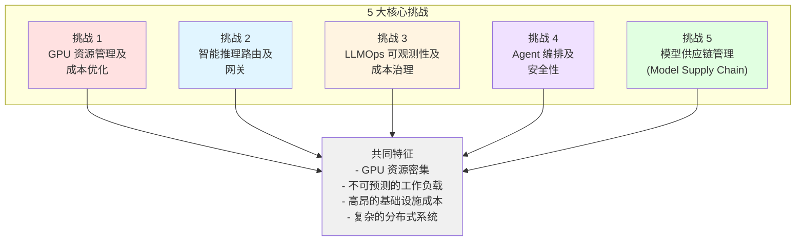
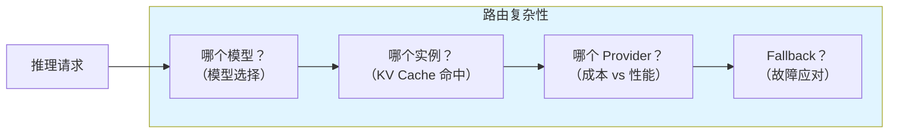
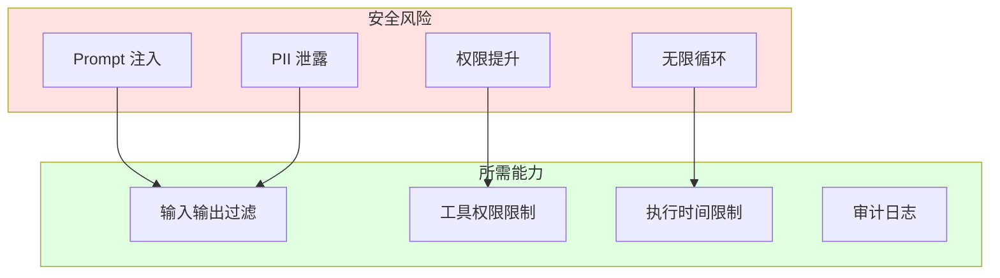
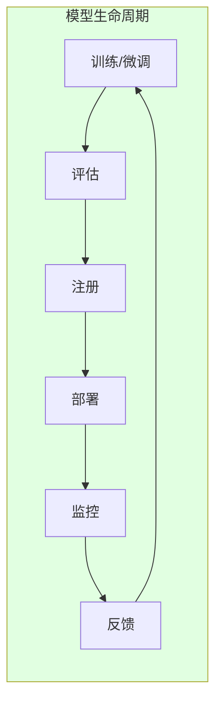

import { ChallengeSummary } from '@site/src/components/AgenticChallengesTables';

> 📅 **创建日期**：2025-02-05 | **修改日期**：2026-03-27 | ⏱️ **阅读时间**：约 7 分钟

## 简介

构建和运营 Agentic AI 平台时，平台工程师和架构师会面临与传统 Web 应用根本不同的技术挑战。本文档分析 **5 大核心挑战**。

:::info 前置文档
阅读本文之前，请先在[平台架构](./agentic-platform-architecture.md)中了解 Agentic AI Platform 的整体结构。
:::

## 背景：为什么单一 LLM 不够

Agentic AI 时代企业首先面临的问题是*"只用一个最大最贵的 LLM 不行吗？"*。在实际企业环境中，完全依赖单一大型 LLM 会遇到以下实际限制。

### 企业实务中单一 LLM 的 4 大局限

| 局限领域 | 企业面临的问题 | 平台应对 |
|----------|---------------|-----------|
| **成本** | 70B+ 模型的 Token 计费在大流量时每月可达数千万元，Agent 内部的工具调用、格式化等简单任务也产生同样费用。研究表明 Agent LLM 调用的 **40~70% 可由 SLM 替代**。 | 通过 **Bifrost 2-Tier 路由**将简单调用分配给自托管 SLM，仅复杂推理使用 LLM |
| **性能 · 延迟** | 大型模型的响应延迟（TTFT）较长，在实时客服（AICC）或对话型 Agent 中降低用户体验。领域特化 SLM 在同样任务上可实现 **10 倍以上的响应速度**。 | **3-Tier 编排** — Tier 1（SLM 直接）约 50ms，Tier 2（LLM）仅用于复杂推理 |
| **信息准确性** | LLM 幻觉是结构性特征，在费率计算、条款验证等需要准确性的业务中是致命的。Transformer 架构在复杂算术和逻辑运算上存在本质局限。 | **Tool Delegation** — 算术交给规则引擎，事实验证交给 Knowledge Graph。LLM 只专注自然语言理解 |
| **治理 · 安全** | 敏感数据（PII/PHI）泄露到外部 LLM API 的风险，Agent 自主行为的审计追踪，团队级访问控制和预算管理的需求。 | **NeMo Guardrails**（输入输出过滤）+ **LangGraph HITL**（人工审批门）+ **Langfuse**（审计追踪）|

### 基础设施优化：超级智能研究企业与 K8s 生态的方向

要高效运营这种多模型生态，**基础设施平台化**是必需的。这不仅是成本削减的问题，也是 AI 领先企业共同投入核心领域的方向。

**Meta** 在超级智能（ASI）研究的同时大力投资自有 AI 基础设施优化。Grand Teton（GPU 服务器架构）、MTIA（自研推理芯片）、PyTorch 生态的推理效率化（torch.compile、ExecuTorch）都源于**模型性能和基础设施效率同等重要**的认知。

**CNCF Kubernetes** 生态也在快速扩展面向 AI 工作负载的功能：

| K8s AI 功能 | 版本 | 角色 | 在多模型生态中的意义 |
|------------|------|------|------------------------|
| **DRA** (Dynamic Resource Allocation) | 1.31 Beta | 以 MIG 粒度精细分配 GPU | SLM 用 MIG 分区，LLM 用完整 GPU — 在同一集群中共存 |
| **Gateway API + Inference Extension** | 2025 | LLM 推理请求的标准化路由 | 基于 KV Cache 状态的智能路由，按模型分配流量 |
| **Kueue** | GA | AI 工作负载队列/调度 | 训练/推理任务的公平 GPU 资源分配，团队级配额 |
| **LeaderWorkerSet** | 1.31 | 分布式推理/训练工作负载模式 | 以 K8s 原生方式管理 70B+ 模型的 Tensor Parallel 分布式推理 |
| **KAI Scheduler** | 2025 | GPU 感知 Pod 调度 | 考虑 GPU 拓扑（NVLink、NVSwitch）的最优放置 |

如此，Kubernetes 正在从简单的容器编排器演进为**AI 工作负载的基础设施**，是运营多模型生态最成熟的平台。

### 结论：多模型生态与基础设施平台化

企业需要摆脱对单一 LLM 的依赖，构建**异构多模型（Heterogeneous Multi-model）生态系统**，同时必须配备支撑它的**基础设施平台**。

```
战略规划 · 复杂推理             重复实务 · 领域特化
┌──────────────────┐         ┌──────────────────┐
│  LLM Orchestrator │   任务   │   SLM Expert Pool │
│  (Claude, GPT 等)  │──分配──→ │  (7B/14B + LoRA)  │
│  Tier 2 工作流     │         │  Tier 1 直接调用   │
└──────────────────┘         └──────────────────┘
         │                            │
         └── 外部工具委派 ─────────────┘
             (算术, 搜索, 知识图谱)
                      │
         ┌────────────┴────────────┐
         │  Kubernetes 基础设施平台   │
         │  DRA · Gateway API · Kueue │
         │  Karpenter · vLLM · Bifrost│
         └─────────────────────────┘
```

下面分析为在 **Kubernetes 原生环境中高效运营**这一生态系统，平台需要解决的 5 大核心挑战。

---

## Agentic AI 平台的 5 大核心挑战

基于前沿模型（Frontier Model）的 Agentic AI 系统具有与传统 Web 应用**根本不同的基础设施需求**。



### 挑战概要

<ChallengeSummary />

:::warning 传统基础设施方法的局限
传统的基于 VM 的基础设施或手动管理方式无法有效应对 Agentic AI **动态且不可预测的工作负载模式**。GPU 资源的高成本和复杂的分布式系统需求使**自动化基础设施管理**成为必须。
:::

---

## 挑战 1：GPU 资源管理及成本优化

GPU 是 Agentic AI 平台中**成本最高的资源**。需要根据模型大小和工作负载特性制定合适的 GPU 分配策略。

**为什么困难：**

- **高成本**：GPU 实例比 CPU 贵 10~100 倍（H100 8 卡基准每小时约 $98）
- **多样的模型大小**：从 3B 参数模型到 70B+ 模型，所需 GPU 内存差异极大
- **动态工作负载**：推理流量按时段波动 10 倍以上
- **闲置浪费**：GPU 配置后利用率低会造成巨大成本浪费
- **多租户**：多个模型和团队需要共享有限的 GPU

| 模型大小 | GPU 需求 | 成本压力 |
|-----------|-------------|----------|
| 70B+ 参数 | Full GPU（H100/A100）8 卡 | 每小时 $30~$98 |
| 7B~30B 参数 | GPU 1~2 卡或 MIG 分区 | 每小时 $1~$10 |
| 3B 以下参数 | Time-Slicing 或共享 GPU | 每小时 $0.5~$2 |

---

## 挑战 2：智能推理路由及网关

Agentic AI 工作负载**同时利用多种模型和 Provider**。需要的不是简单的负载均衡，而是理解模型特性的智能路由。

**为什么困难：**

- **多模型运营**：在一个平台上同时运营 Llama、Qwen、Claude、GPT 等多种模型
- **KV Cache 效率**：不考虑 LLM 的 KV Cache 状态的路由会严重降低性能
- **成本-性能权衡**：需要根据任务复杂度动态选择低成本模型和高性能模型
- **Provider 多元化**：需要统一管理 Self-hosted 模型和外部 API（Bedrock、OpenAI）
- **Canary/A-B 部署**：需要安全地进行新模型版本的流量切换



---

## 挑战 3：LLMOps 可观测性及成本治理

基于 LLM 的系统具有与传统应用**根本不同的可观测性需求**。需要 Token 级别成本追踪、Agent 工作流调试、Prompt 质量监控。

**为什么困难：**

- **非确定性输出**：相同输入可能产生不同输出，传统测试/监控不充分
- **Token 成本追踪**：需要同时追踪基础设施成本（GPU）和应用成本（Token）
- **多步骤调试**：在 Agent 调用多个工具的复杂链中难以定位瓶颈
- **Prompt 质量**：需要实时检测生产环境中 Prompt 性能退化
- **团队级预算**：多团队共享的 AI 基础设施中需要按团队进行成本分配和限额管理

| 可观测性领域 | 传统应用 | LLM 应用 |
|------------|----------------|----------------|
| 成本追踪 | 仅基础设施成本 | 基础设施 + Token 成本双重追踪 |
| 调试 | 请求-响应日志 | 多步骤 Agent Trace |
| 质量监控 | 错误率、延迟 | Faithfulness、Relevance、Hallucination |
| 预算管理 | 基于资源 | 按模型/团队的 Token 预算 |

---

## 挑战 4：Agent 编排及安全性

在 Agentic AI 系统中，Agent **自主调用工具并与外部系统交互**。这种自主性在安全性和可控性方面带来了新的挑战。

**为什么困难：**

- **自主行为**：Agent 自主判断调用工具，可能出现意外行为
- **Prompt 注入**：恶意输入可能导致 Agent 执行非预期操作
- **工具连接标准化**：需要将各种外部系统（DB、API、文件）安全连接到 Agent 的标准
- **多 Agent 通信**：多个 Agent 协作时需要安全高效的通信协议
- **状态管理**：长时间运行的 Agent 需要状态保存、恢复、检查点
- **扩展**：Agent 工作负载是 CPU 密集型但流量模式不规律，高效扩展困难



---

## 挑战 5：模型供应链管理（Model Supply Chain）

不仅仅是部署模型，还需要系统化管理**完整的模型生命周期**（训练 → 评估 → 注册 → 部署 → 反馈）。

**为什么困难：**

- **模型版本管理**：管理基础模型、微调模型、适配器（LoRA）等多种制品
- **分布式训练基础设施**：大规模模型微调需要多节点 GPU 集群和高速网络（EFA）
- **评估流水线**：需要自动评估模型质量并设置部署门控
- **安全部署**：通过 Canary/Blue-Green 部署最小化模型更新对服务的影响
- **混合环境**：本地 GPU 和云端 GPU 间的模型传输与同步
- **RAG 数据流水线**：文档处理、嵌入生成、向量存储的持续更新流水线
- **反馈循环**：将生产追踪数据反馈到再训练的持续改进体系



---

## 下一步：挑战解决方案

为解决这 5 大挑战，提出两种方案：

1. **[AWS Native 平台](./aws-native-agentic-platform.md)**：利用 AWS 托管服务（Bedrock、AgentCore）最小化基础设施运维负担，专注 Agent 开发
2. **[EKS 开放架构](./agentic-ai-solutions-eks.md)**：利用 Amazon EKS 和开源生态实现精细控制和成本优化

两种方案**互为补充**，可根据工作负载特性组合使用。

| 标准 | AWS Native | EKS 开放架构 |
|------|-----------|----------------------|
| GPU 管理 | 不需要（Serverless）| Karpenter 自动配置 |
| 模型选择 | Bedrock 支持的模型 | 所有 Open Weight 模型 |
| 运维负担 | 最小 | 中等（Auto Mode 可减轻）|
| 成本优化 | 按用量计费 | Spot、Consolidation 等精细控制 |
| 定制化 | 受限 | 完全灵活 |

:::tip 如何选择？
- **快速启动、专注 Agent 逻辑**：AWS Native 平台
- **Open Weight 模型 + 混合 + 成本优化**：EKS 开放架构
- **现实最优解**：两种方案组合（从 AWS Native 起步，需要时扩展到 EKS）
:::
