import Tabs from '@theme/Tabs';
import TabItem from '@theme/TabItem';
import {
  EksKarpenterLayers,
  ClusterAutoscalerVsKarpenter,
  KarpenterKeyFeatures,
  EksAutoModeVsStandard,
  DeploymentTimeComparison,
  EksIntegrationBenefits,
  EksCapabilities,
  AckControllers,
  AutomationComponents,
  EksAutoModeBenefits,
  ChallengeSolutionsSummary,
  EksClusterConfiguration
} from '@site/src/components/AgenticSolutionsTables';

> 📅 **创建日期**：2025-02-05 | **修改日期**：2026-04-06 | ⏱️ **阅读时间**：约 12 分钟

:::info 前置文档
阅读本文之前请先参阅以下文档：
- [平台架构](./agentic-platform-architecture.md) — Agentic AI Platform 的结构与核心层级
- [技术挑战](./agentic-ai-challenges.md) — 5 大核心挑战
- [AWS Native 平台](./aws-native-agentic-platform.md) — 基于托管服务的替代方案（对比参考）
:::

---

## Part 1：为什么选择 EKS 开放架构？

[AWS Native 平台](./aws-native-agentic-platform.md)是快速启动的强大方案。但当出现以下需求时，就需要 **EKS 开放架构**：

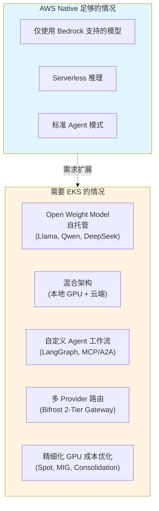

**核心信息：AWS Native → EKS 是互补关系。**

| 标准 | AWS Native | EKS 开放架构 |
|------|-----------|----------------------|
| 模型选择 | Bedrock 支持的模型 | 所有 Open Weight 模型 |
| GPU 管理 | 不需要（Serverless）| Karpenter 自动配置 |
| 成本优化 | 按用量计费 | Spot、MIG、Consolidation |
| 运维负担 | 最小 | 中等（Auto Mode 可减轻）|
| 混合 | 受限 | EKS Hybrid Nodes |
| 定制化 | 受限 | 完全灵活 |

现实的做法是**从 AWS Native 开始，按需扩展到 EKS**。两种方案可在同一 VPC 内共存。

---

## Part 2：用 EKS Auto Mode 快速启动

### EKS 集群配置选项：控制平面与数据平面

EKS 集群配置分为**两个独立层**。

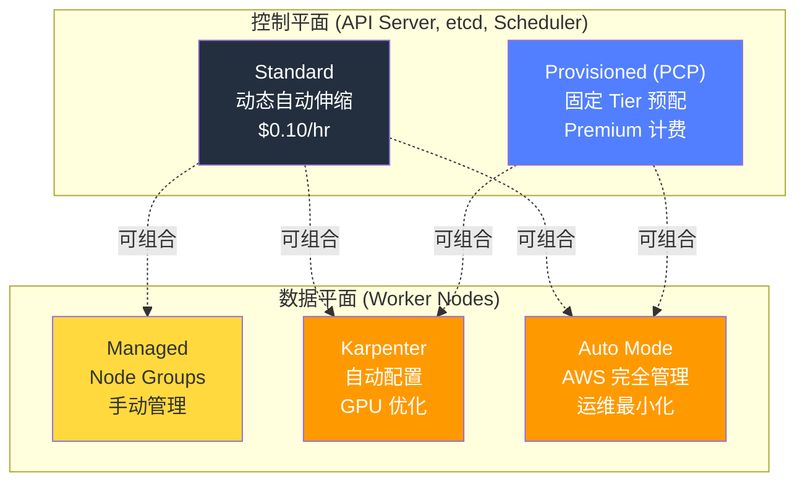

### Provisioned Control Plane (PCP)

**PCP** 是预先以固定 Tier 配置控制平面容量，保证 API Server 性能一致性的 Premium 选项。

#### PCP Tier 规格

| Tier | API 并发 (seats) | Pod 调度 | etcd DB | SLA | 费用 |
|------|:-----------------:|:----------:|:------:|:---:|-----:|
| **Standard** | 动态（AWS 自动调整）| 动态 | 8GB | 99.95% | $0.10/hr |
| **XL** | 1,700 | 167/sec | 16GB | 99.99% | - |
| **2XL** | 3,400 | 283/sec | 16GB | 99.99% | - |
| **4XL** | 6,800 | 400/sec | 16GB | 99.99% | - |
| **8XL** | 13,600 | 400/sec | 16GB | 99.99% | - |

> 来源：[AWS EKS Provisioned Control Plane 官方文档](https://docs.aws.amazon.com/eks/latest/userguide/eks-provisioned-control-plane.html)（K8s 1.30+ 基准）。PCP Tier 价格请参阅 AWS 官方定价页面。

#### Tier 选择标准：基于指标的判断

:::warning Worker 节点数不是 PCP Tier 选择标准
PCP Tier 应基于 **Kubernetes 控制平面指标**来选择。
:::

**核心监控指标：**

| 指标 | Prometheus 查询 | 判断标准 |
|--------|----------------|----------|
| **API Inflight Seats**（最重要）| `apiserver_flowcontrol_current_executing_seats_total` | 持续超过 1,200 seats → XL 以上 |
| **Pod Scheduling Rate** | `scheduler_schedule_attempts_SCHEDULED` | 100/sec 以上 → XL, 200/sec 以上 → 2XL |
| **etcd DB Size** | `apiserver_storage_size_bytes` | 超过 10GB → 需要 XL 以上 |

:::info PCP vs Auto Mode — 不同层
**PCP** 是控制平面容量选项，**Auto Mode** 是数据平面管理选项。两者**可组合使用**。
:::

### 控制平面 × 数据平面对比及组合

<EksClusterConfiguration />

:::tip AI 平台按规模推荐配置
- **小规模（PoC/Demo）**：Standard + Auto Mode — 最小运维负担，99.95% SLA
- **中规模（生产推理）**：Standard + Karpenter — GPU 成本优化，99.95% SLA
- **大规模（企业级 AI）**：PCP XL + Auto Mode — API seats ≤ 1,700，99.99% SLA
- **超大规模（训练集群）**：PCP 4XL+ + Karpenter — API seats ≤ 6,800+，GPU 精细控制
:::

---

### Amazon EKS 与 Karpenter：最大化 Kubernetes 优势

**Amazon EKS 与 Karpenter 的组合**最大化 Kubernetes 优势，实现完全自动化的最优基础设施。

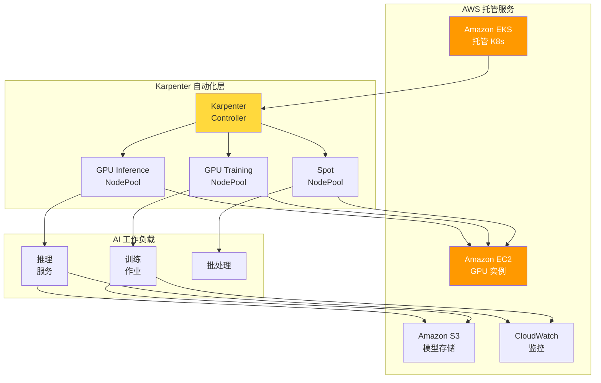

#### 为什么选择 EKS + Karpenter？

<EksKarpenterLayers />

#### Karpenter：AI 基础设施自动化的核心

Karpenter 克服了传统 Cluster Autoscaler 的局限，提供**面向 AI 工作负载优化的节点配置**。

:::info Karpenter v1.0+ GA
Karpenter 在 **v1.0 以上为 GA 状态**。请使用 v1 API（`karpenter.sh/v1`）。
:::

<ClusterAutoscalerVsKarpenter />

<KarpenterKeyFeatures />

### EKS Auto Mode：完全自动化的完成

**EKS Auto Mode** 自动配置和管理包括 Karpenter 在内的核心组件。

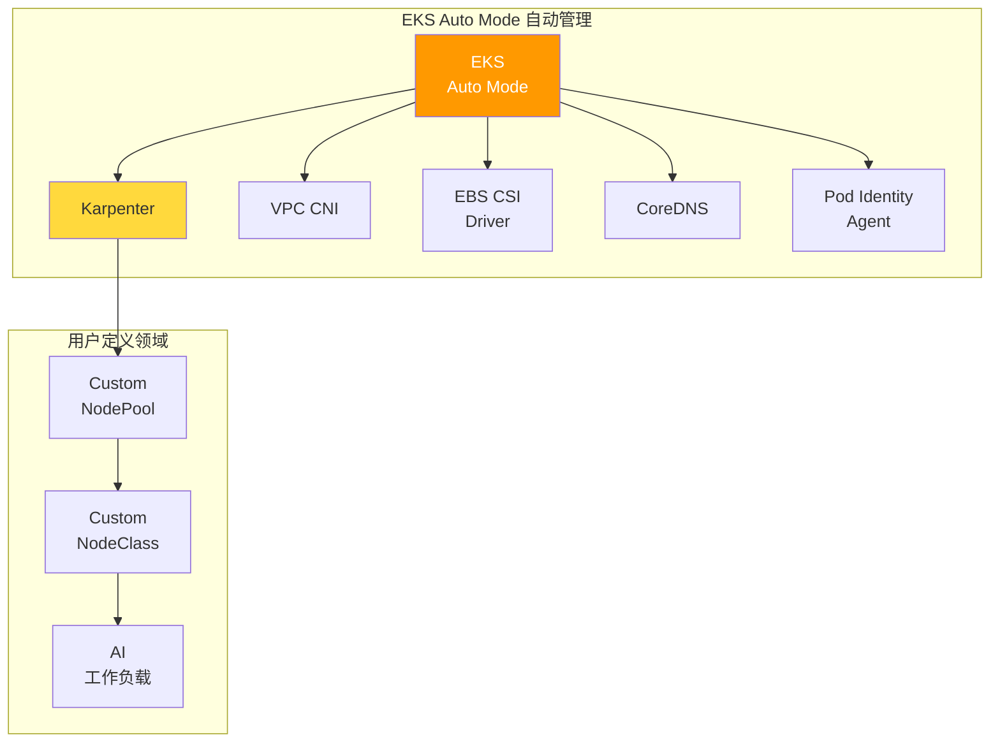

#### EKS Auto Mode vs 手动配置对比

<EksAutoModeVsStandard />

#### GPU 工作负载的 EKS Auto Mode 设置

```yaml
# 在 EKS Auto Mode 中添加 GPU NodePool
apiVersion: karpenter.sh/v1
kind: NodePool
metadata:
  name: gpu-inference-pool
spec:
  template:
    metadata:
      labels:
        node-type: gpu-inference
        eks-auto-mode: "true"
    spec:
      requirements:
        - key: karpenter.sh/capacity-type
          operator: In
          values: ["spot", "on-demand"]
        - key: node.kubernetes.io/instance-type
          operator: In
          values:
            - g5.xlarge
            - g5.2xlarge
            - g5.4xlarge
            - g5.12xlarge
            - p4d.24xlarge
        - key: karpenter.k8s.aws/instance-gpu-count
          operator: Gt
          values: ["0"]
      nodeClassRef:
        group: karpenter.k8s.aws
        kind: EC2NodeClass
        name: default  # 利用 EKS Auto Mode 默认 NodeClass
  limits:
    nvidia.com/gpu: 50
  disruption:
    consolidationPolicy: WhenEmptyOrUnderutilized
    consolidateAfter: 30s
```

:::tip EKS Auto Mode 推荐事项
EKS Auto Mode 是**构建新 AI 平台时推荐的选项**。
- Karpenter 安装和配置自动化可**缩短 80% 初始构建时间**
- 核心组件自动升级可**大幅减少运维负担**
- 只需自定义 GPU NodePool 即可**立即部署 AI 工作负载**
:::

:::info EKS Auto Mode 与 GPU 支持
EKS Auto Mode 完全支持包括 NVIDIA GPU 在内的加速计算实例。

**re:Invent 2024/2025 新功能：**
- **EKS Hybrid Nodes（GA）**：将本地 GPU 基础设施集成到 EKS 集群
- **Enhanced Pod Identity v2**：跨账户 IAM 角色支持
- **Native Inferentia/Trainium Support**：Neuron SDK 自动配置
- **Provisioned Control Plane**：大规模 AI 训练工作负载的预配置
:::

---

### Auto Mode 可部署的 Agentic AI 组件

在 EKS Auto Mode 上可以部署 Agentic AI 平台的所有核心组件。

#### 推理：vLLM + llm-d

**vLLM** 是 LLM 推理专用引擎，**llm-d** 提供考虑 KV Cache 状态的智能路由。

:::info 模型服务栈构成
- **vLLM**：LLM 推理专用（GPT、Claude、Llama 等）— 基于 PagedAttention 的 KV Cache 优化
- **Triton Inference Server**：非 LLM 推理（嵌入、重排序、Whisper STT）
- **llm-d**：通过 KV Cache 感知路由最大化 Prefix cache 命中率

详细配置请参阅 [vLLM 模型服务](../model-serving/vllm-model-serving.md) 和 [llm-d 分布式推理](../model-serving/llm-d-eks-automode.md)。
:::

#### 网关：kgateway + Bifrost（2-Tier Gateway）

2-Tier Gateway 架构将流量管理和模型路由分离：
- **Tier 1（kgateway）**：基于 Gateway API 的认证、Rate Limiting、流量管理
- **Tier 2（Bifrost）**：模型抽象、Fallback、成本追踪、Cascade Routing

> 详细架构请参阅 [Inference Gateway 路由](./inference-gateway-routing.md)。

#### Agent：LangGraph + NeMo Guardrails + MCP/A2A

EKS 中 Agent 工作流由以下组件构成：

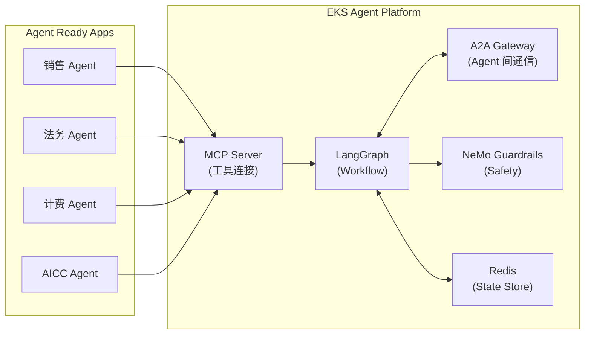

- **LangGraph**：多步骤 Agent 工作流定义、条件分支、并行执行
- **NeMo Guardrails**：Prompt 注入防御、PII 泄露防护、输出验证
- **MCP**：Agent Ready 应用以标准化方式提供 Tool
- **A2A**：Agent 间安全高效通信
- **Redis（ElastiCache）**：作为 LangGraph checkpointer 管理状态

Agent Pod 通过 KEDA 基于 Redis 队列长度自动伸缩。

> 详细内容请参阅 [Kagent Agent 管理](../operations-mlops/kagent-kubernetes-agents.md) 和 [AWS Native 平台 — AgentCore & MCP](./aws-native-agentic-platform.md#mcp-协议与-eks-集成)。

#### RAG + 可观测性

- **Milvus**：向量数据库 — RAG 系统核心（[详情](../operations-mlops/milvus-vector-database.md)）
- **Langfuse**：生产 LLM 链路追踪、Token 成本追踪（Self-hosted、MIT 许可）
- **Prometheus + Grafana**：基础设施指标监控

---

### EKS 快速部署

<DeploymentTimeComparison />

#### 各方案的 EKS 部署方法

<EksIntegrationBenefits />

#### 快速部署示例

部署指南请参阅 [Reference Architecture](../reference-architecture/)。

:::info GPU 成本优化详情
Spot 实例利用、Consolidation、基于时段的调度成本管理等 GPU 成本优化策略请参阅 [GPU 资源管理](../model-serving/gpu-resource-management.md) 文档。
:::

:::info GPU 安全与故障排除
GPU Pod 安全策略、Network Policy、IAM、MIG 隔离及 GPU 故障排除指南请参阅 [EKS GPU 节点策略](../model-serving/eks-gpu-node-strategy.md) 文档。
:::

---

## Part 3：通过 EKS Capability 最小化基础设施运维负担

### 什么是 EKS Capability？

**EKS Capability** 是 Amazon EKS 为有效运营特定工作负载而**集成经验证的开源工具和 AWS 服务提供的平台级功能**。

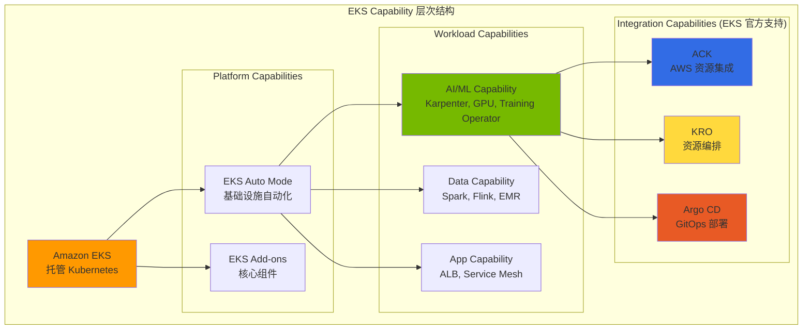

### 面向 Agentic AI 的核心 EKS Capability

<EksCapabilities />

:::warning Argo Workflows 需要单独安装
**Argo Workflows** 不是 EKS Capability 官方支持，需要**自行安装**。

部署指南请参阅 [Argo Workflows 官方文档](https://argoproj.github.io/argo-workflows/installation/)。
:::

---

### ACK（AWS Controllers for Kubernetes）

**ACK** 通过 Kubernetes Custom Resource 直接配置和管理 AWS 服务。可**通过 EKS Add-on 简便安装**。

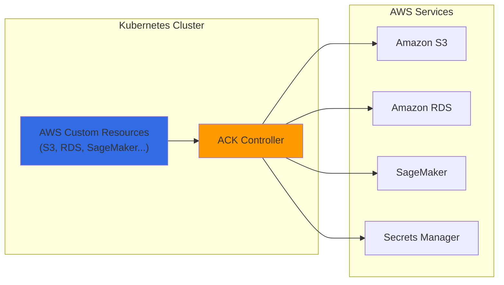

**AI 平台中 ACK 的应用场景：**

<AckControllers />

**使用 ACK 创建 S3 存储桶示例：**

```yaml
apiVersion: s3.services.k8s.aws/v1alpha1
kind: Bucket
metadata:
  name: agentic-ai-models
  namespace: ai-platform
spec:
  name: agentic-ai-models-prod
  versioning:
    status: Enabled
  encryption:
    rules:
    - applyServerSideEncryptionByDefault:
        sseAlgorithm: aws:kms
  tags:
  - key: Project
    value: agentic-ai
```

### KRO（Kubernetes Resource Orchestrator）

**KRO** 将多个 Kubernetes 资源和 AWS 资源**组合为一个抽象化单元**，简化复杂基础设施的部署。

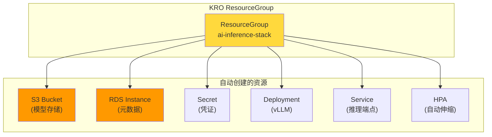

**用 KRO 以单一资源部署 AI 推理栈：**

```yaml
# 以单一资源部署完整栈
apiVersion: v1alpha1
kind: AIInferenceStack
metadata:
  name: llama-inference
  namespace: ai-platform
spec:
  modelName: llama-3-70b
  gpuType: g5.12xlarge
  minReplicas: 2
  maxReplicas: 20
```

### 基于 Argo 的 ML 流水线自动化

结合 **Argo Workflows** 和 **Argo CD** 可以**以 GitOps 方式自动化整个 MLOps 流水线**，从模型训练、评估到部署。

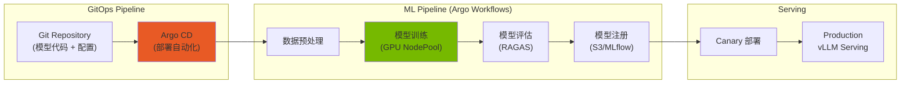

### ACK + KRO + ArgoCD 集成架构

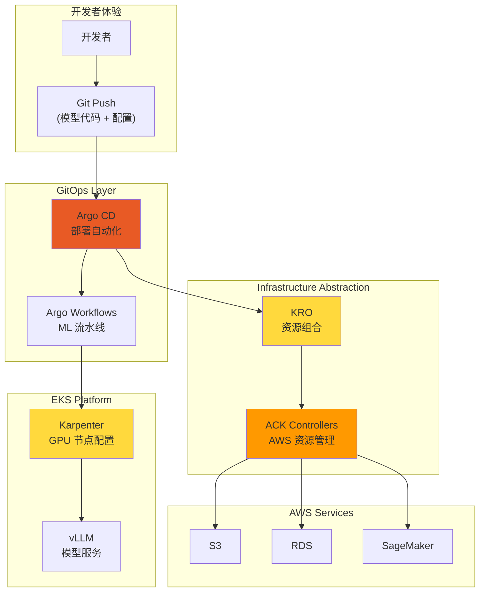

<AutomationComponents />

:::info 完全自动化的优势 — 将基础设施运维委托给 EKS，专注 Agent 开发
- **开发者**：仅通过 Git push 即可部署模型
- **平台团队**：最小化基础设施管理负担
- **成本优化**：仅动态配置所需资源
- **一致性**：所有环境使用相同部署方式
:::

---

## Part 4：总结 + 下一步

### 渐进式路径：AWS Native → Auto Mode → EKS Capability

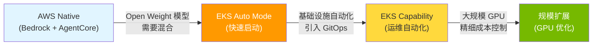

### EKS Auto Mode：推荐起步点

<EksAutoModeBenefits />

### 挑战解决方案总结

<ChallengeSolutionsSummary />

### EKS Auto Mode GPU 限制与混合策略

EKS Auto Mode 最适合一般工作负载和基本 GPU 推理，但在 GPU 高级功能上存在限制。

| 工作负载类型 | Auto Mode 适用性 | 原因 |
|---|---|---|
| API Gateway、Agent Framework | 适合 | Non-GPU，自动伸缩足够 |
| Observability Stack | 适合 | Non-GPU，管理负担最小化 |
| 基本 GPU 推理（完整 GPU）| 适合 | AWS 管理 GPU 栈足够 |
| 需要 MIG 分区 | **不适合** | NodeClass 只读，无法进行 MIG 分割（GPU Operator 本身可安装）|
| Run:ai GPU 调度 | **可行** | 安装 GPU Operator 后禁用 Device Plugin 标签 |

**推荐混合配置**：在单一集群中运营 Auto Mode（一般工作负载）+ Karpenter（GPU 高级功能）。详细配置请参阅 [EKS GPU 节点策略](../model-serving/eks-gpu-node-strategy.md)。

### Gateway API 限制与绕过

EKS Auto Mode 的内置负载均衡器不直接支持 Kubernetes Gateway API。使用 kgateway 时需要通过独立的 Service（type: LoadBalancer）配置 NLB。

```yaml
apiVersion: v1
kind: Service
metadata:
  name: kgateway-proxy
  namespace: kgateway-system
  annotations:
    service.beta.kubernetes.io/aws-load-balancer-type: "external"
    service.beta.kubernetes.io/aws-load-balancer-nlb-target-type: "ip"
    service.beta.kubernetes.io/aws-load-balancer-scheme: "internet-facing"
spec:
  type: LoadBalancer
  selector:
    app: kgateway-proxy
  ports:
    - name: https
      port: 443
      targetPort: 8443
```

> 2-Tier Gateway 架构的完整设计请参阅 [LLM Gateway 2-Tier 架构](./inference-gateway-routing.md)。

### 核心建议

1. **以 EKS Auto Mode 起步**：新集群以 Auto Mode 创建，利用 Karpenter 自动配置
2. **GPU 高级功能用 Karpenter 节点**：需要 MIG、Run:ai 等 GPU Operator 时添加 Karpenter NodePool
3. **自定义 GPU NodePool**：按工作负载特性添加 GPU NodePool（推理/训练/实验分离）
4. **积极使用 Spot 实例**：70% 以上的推理工作负载用 Spot 运行
5. **默认启用 Consolidation**：利用 EKS Auto Mode 自动启用的 Consolidation
6. **KEDA 联动**：将基于指标的 Pod 伸缩与 Karpenter 节点配置联动

### 选择部署路径

<Tabs>
<TabItem value="auto-mode" label="EKS Auto Mode（大多数推荐）">

**适用场景：**
- 初创公司和小团队
- Kubernetes 初学者团队
- 标准 Agentic AI 工作负载

**开始使用：**

部署指南请参阅 [EKS Auto Mode 官方文档](https://docs.aws.amazon.com/eks/latest/userguide/automode.html)。

**优势：** 零基础设施管理负担、AWS 优化默认设置、自动安全补丁

</TabItem>
<TabItem value="karpenter" label="EKS + Karpenter（最大控制）">

**适用场景：**
- 大规模生产工作负载
- 复杂 GPU 需求（混合实例类型）
- 成本优化为最优先

**开始使用：**

部署指南请参阅 [Karpenter 官方文档](https://karpenter.sh/docs/getting-started/)。

**优势：** 精细实例控制、最大成本优化（节省 70-80%）、自定义 AMI

</TabItem>
<TabItem value="hybrid" label="混合（两种方式的优势结合）">

**适用场景：**
- 成长中的平台（简单开始，复杂扩展）
- 混合工作负载类型（CPU Agent + GPU LLM）

**开始使用：**

部署指南请参阅 [Reference Architecture](../reference-architecture/)。

**优势：** 渐进式复杂度增加、GPU 成本优化、AWS 托管 + 自定义组合

</TabItem>
</Tabs>

### 规模扩展参考文档

| 领域 | 文档 | 内容 |
|------|------|------|
| GPU 节点策略 | [EKS GPU 节点策略](../model-serving/eks-gpu-node-strategy.md) | Auto Mode + Karpenter + Hybrid Node + 安全/故障排除 |
| GPU 资源管理 | [GPU 资源管理](../model-serving/gpu-resource-management.md) | Karpenter 伸缩、KEDA、DRA、成本优化 |
| NVIDIA GPU 栈 | [NVIDIA GPU 栈](../model-serving/nvidia-gpu-stack.md) | GPU Operator、DCGM、MIG、Time-Slicing |
| 模型服务 | [vLLM 模型服务](../model-serving/vllm-model-serving.md) | vLLM 配置、性能优化 |
| 分布式推理 | [llm-d 分布式推理](../model-serving/llm-d-eks-automode.md) | KV Cache 感知路由 |
| 训练基础设施 | [NeMo 框架](../model-serving/nemo-framework.md) | 分布式训练、EFA 网络 |

---

## 参考资料

### Kubernetes 及基础设施

- [Amazon EKS Documentation](https://docs.aws.amazon.com/eks/)
- [EKS Auto Mode](https://docs.aws.amazon.com/eks/latest/userguide/automode.html)
- [Karpenter Documentation](https://karpenter.sh/docs/)
- [KEDA - Kubernetes Event-driven Autoscaling](https://keda.sh/)

### 模型服务及网关

- [vLLM Documentation](https://docs.vllm.ai/)
- [llm-d Project](https://github.com/llm-d/llm-d)
- [Kgateway Documentation](https://kgateway.dev/docs/)
- [Bifrost Documentation](https://www.getmaxim.ai/bifrost)

### LLM Observability 及 Agent

- [Langfuse Documentation](https://langfuse.com/docs)
- [LangSmith Documentation](https://docs.smith.langchain.com/)
- [KAgent - Kubernetes Agent Framework](https://github.com/kagent-dev/kagent)
- [NVIDIA NeMo Framework](https://docs.nvidia.com/nemo-framework/user-guide/latest/overview.html)
