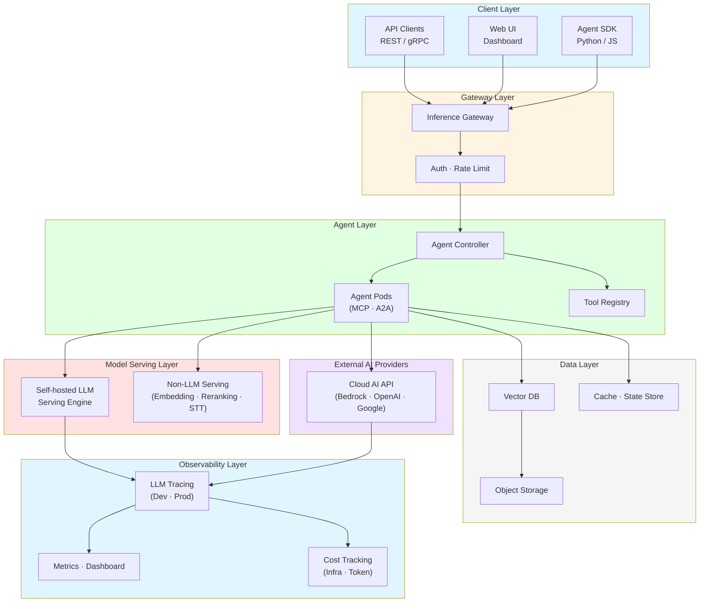
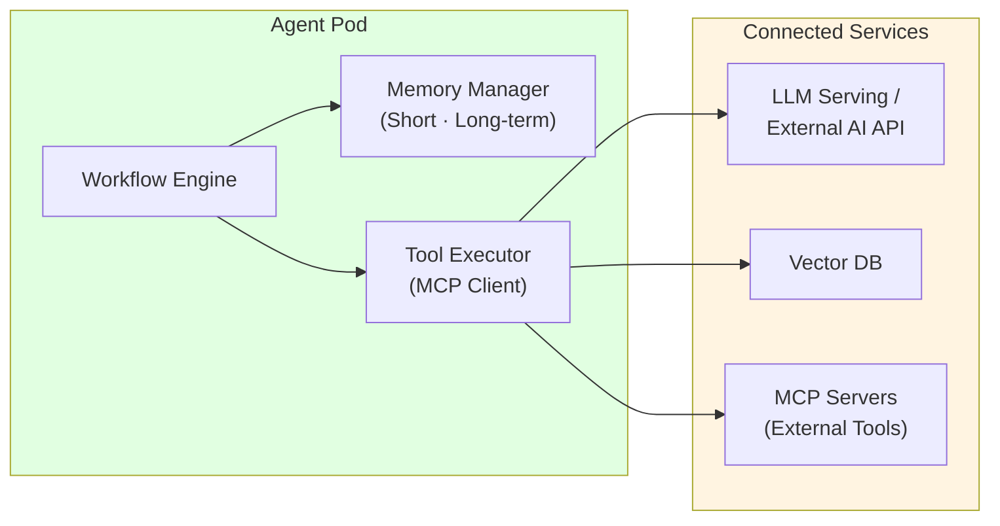
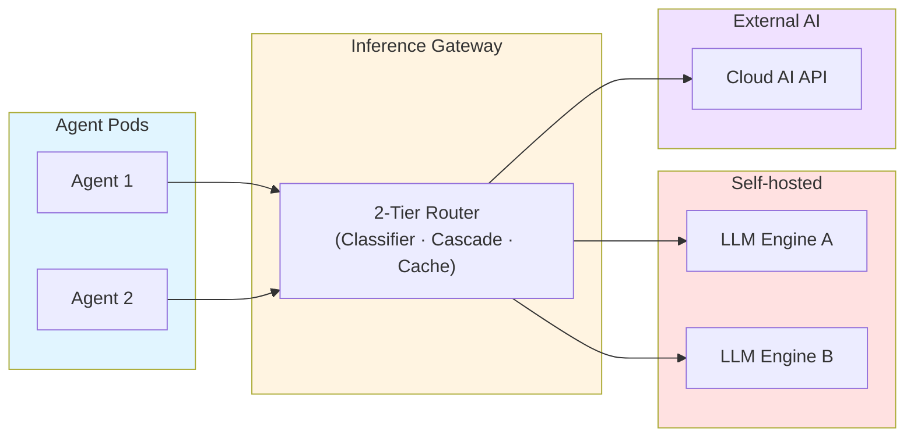
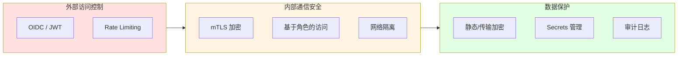
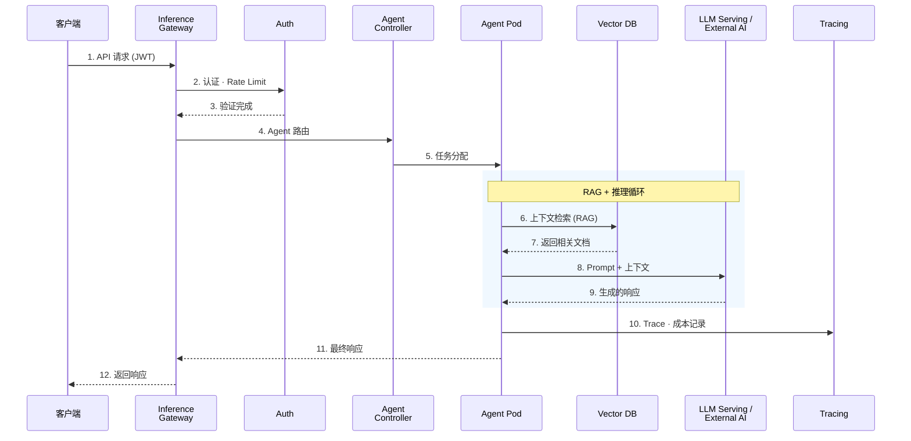

import { LayerRoles, TenantIsolation, RequestProcessing } from '@site/src/components/ArchitectureTables';

# Agentic AI Platform 架构

> 📅 **创建日期**：2025-02-05 | **修改日期**：2026-03-20 | ⏱️ **阅读时间**：约 6 分钟

## 概述

Agentic AI Platform 是一个支持自主 AI Agent 执行复杂任务的统一平台。该平台旨在解决构建 GenAI 服务时面临的模型服务复杂性、框架集成缺失、自动扩展困难、MLOps 自动化缺失、成本优化等挑战。平台以**Agent 编排**、**智能推理路由**、**基于向量搜索的 RAG**、**LLM 链路追踪与成本分析**、**水平自动扩展**、**多租户资源隔离**为核心功能，各挑战的详细分析请参阅[技术挑战](./agentic-ai-challenges.md)文档。

:::info 目标读者
本文档面向解决方案架构师、平台工程师、DevOps 工程师。需要对 Kubernetes 和 AI/ML 工作负载有基本了解。
:::

---

## 整体系统架构

Agentic AI Platform 由 6 个主要层级组成。每层具有明确职责，通过松耦合实现独立扩展和运维。

**核心设计原则：**

- **Self-hosted + External AI 混合**：在同一网关中统一管理自托管 LLM 和外部 AI Provider API
- **2-Tier 成本追踪**：基础设施层（模型单价 × Token）与应用层（Agent 步骤级成本）双重追踪
- **MCP/A2A 标准协议**：标准化 Agent 与工具间（MCP）、Agent 间（A2A）通信，确保互操作性

### 各层职责

<LayerRoles />

---

## 核心组件

### Agent Runtime

Agent Runtime 是 AI Agent 的执行环境。每个 Agent 以独立容器运行，由 Agent Controller 管理其生命周期。

| 功能 | 说明 |
|------|------|
| **状态管理** | 维护对话上下文和任务状态，支持检查点 |
| **工具执行** | 通过 MCP 协议异步执行已注册工具 |
| **内存管理** | 结合短期内存（会话）和长期内存（向量数据库）|
| **Agent 间通信** | 通过 A2A 协议实现多 Agent 协作 |
| **错误恢复** | 失败任务的自动重试和回退 |

### Tool Registry

以声明式方式集中管理 Agent 可用的工具。每个工具以 MCP Server 形式暴露，Agent 通过标准协议调用。

| 工具类型 | 用途 | 示例 |
|----------|------|------|
| **API 工具** | 调用外部 REST/gRPC 服务 | CRM 查询、订单处理 |
| **检索工具** | 向量数据库搜索、文档检索 | RAG 上下文增强 |
| **代码执行** | 沙箱环境中执行代码 | 数据分析、计算 |
| **A2A 工具** | 将任务委派给其他 Agent | 专业 Agent 协作 |

### Vector DB（RAG 存储）

向量数据库是 RAG 系统的核心。将文档转换为嵌入向量存储，Agent 请求时通过相似度搜索提供相关上下文。

**设计考量：**
- **多租户隔离**：通过 Partition Key 实现租户级数据隔离
- **索引策略**：HNSW 索引实现高性能近似最近邻搜索
- **混合搜索**：Dense Vector + Sparse Vector（BM25）结合提升检索质量

### Inference Gateway

Inference Gateway 是智能路由模型推理请求的核心组件。将 Self-hosted LLM 和外部 AI Provider 统一为单一端点。

**路由策略：**

| 策略 | 说明 |
|------|------|
| **基于模型的路由** | 根据请求头/参数分发到合适的模型后端 |
| **KV Cache 感知路由** | 考虑 LLM 的 Prefix Cache 状态最小化 TTFT |
| **Cascade 路由** | 先尝试低成本模型 → 失败时自动切换到高性能模型 |
| **基于权重的路由** | 用于 Canary/Blue-Green 部署的流量比例分割 |
| **Fallback** | Provider 故障时自动切换到备用 Provider |

---

## 部署架构

### 命名空间配置

为关注点分离和安全，按功能划分命名空间。

| 命名空间 | 组件 | Pod Security | GPU |
|-------------|---------|-------------|-----|
| **ai-gateway** | Inference Gateway、Auth | restricted | - |
| **ai-agents** | Agent Controller、Agent Pods、Tool Registry | baseline | - |
| **ai-inference** | LLM Serving Engine、GPU Nodes | privileged | 需要 |
| **ai-data** | Vector DB、Cache | baseline | - |
| **observability** | Tracing、Metrics、Dashboard | baseline | - |

---

## 可扩展性设计

### 水平扩展策略

各组件可独立水平扩展。

| 组件 | 扩展触发器 | 方式 |
|---------|---------------|------|
| Agent Pod | 消息队列长度、活跃会话数 | Event-driven Autoscaling |
| LLM Serving | GPU 利用率、等待队列长度 | HPA + GPU Node Auto-provisioning |
| Vector DB | 查询延迟、索引大小 | Query/Index Node 独立扩展 |
| Cache | 内存利用率 | Cluster 扩展 |

### 多租户支持

通过命名空间隔离、资源配额、网络策略的组合支持多租户，使多个团队或项目共享同一平台。

<TenantIsolation />

---

## 安全架构

Agentic AI Platform 采用外部访问、内部通信、数据安全的**三层安全**机制。

**Agent 专属安全考量：**

- **Prompt 注入防御**：通过输入验证层（Guardrails）阻止恶意 Prompt
- **工具执行权限限制**：声明式定义每个 Agent 可调用的工具，应用最小权限原则
- **PII 泄露防护**：通过输出过滤阻止敏感信息暴露
- **执行时间限制**：设置超时和最大步骤数防止 Agent 无限循环

:::danger 安全注意事项
- 生产环境必须启用 mTLS
- API Key 和 Token 应存储在 Secrets Manager 中
- 定期进行安全审计并修补漏洞
:::

---

## 数据流

用户请求通过平台处理的完整流程。

<RequestProcessing />

---

## 监控与可观测性

### 核心监控领域

| 领域 | 目标指标 | 目的 |
|------|-----------|------|
| **Agent Performance** | 请求数、P50/P99 延迟、错误率、步骤数 | Agent 性能追踪 |
| **LLM Performance** | Token 吞吐量、TTFT、TPS、队列等待时间 | 模型服务性能 |
| **Resource Usage** | CPU、内存、GPU 利用率/温度 | 资源效率 |
| **Cost Tracking** | 按租户/模型的 Token 成本、基础设施成本 | 成本治理 |

**告警规则示例：**
- Agent P99 延迟 > 10 秒 → Warning
- Agent 错误率 > 5% → Critical
- GPU 利用率 < 20%（持续 30 分钟）→ Cost Warning
- Token 成本达到每日预算 80% → Budget Warning

---

## 平台需求

| 领域 | 所需能力 | 说明 |
|------|----------|------|
| 容器编排 | 托管 Kubernetes | GPU 节点自动配置、声明式工作负载管理 |
| 网络 | Gateway API 支持 | 智能模型路由、mTLS、Rate Limiting |
| 模型服务 | LLM 推理引擎 | PagedAttention、KV Cache 优化、分布式推理 |
| External AI 集成 | API Gateway / Proxy | 外部 AI Provider 集成、Fallback、成本追踪 |
| Agent 框架 | 工作流引擎 | 多步骤执行、状态管理、MCP/A2A 协议 |
| 数据层 | 向量数据库 + 缓存 | RAG 检索、会话状态存储、长期记忆 |
| 可观测性 | LLM 链路追踪 + 指标 | Token 成本追踪、Agent Trace 分析、质量评估 |
| 安全 | 多层安全模型 | OIDC/JWT、RBAC、NetworkPolicy、Guardrails |

具体技术栈和实现方法请参阅 [AWS Native 平台](./aws-native-agentic-platform.md) 或 [EKS 开放架构](./agentic-ai-solutions-eks.md)。

---

## 总结

Agentic AI Platform 架构的核心原则：

1. **模块化**：各组件可独立部署、扩展、更新
2. **混合 AI**：统一管理 Self-hosted LLM 和 External AI Provider
3. **标准协议**：通过 MCP/A2A 标准化工具连接和 Agent 间通信
4. **可观测性**：统一监控整个请求流的 Trace、成本、质量
5. **安全**：多层安全模型 + Agent 专属安全（Guardrails、工具权限限制）
6. **多租户**：通过命名空间隔离、资源配额、网络策略支持多团队

:::tip 实现指南
本平台架构的具体实现方法在以下文档中介绍：

- [技术挑战](./agentic-ai-challenges.md) — 构建平台时面临的核心挑战
- [AWS Native 平台](./aws-native-agentic-platform.md) — 基于托管服务的实现
- [EKS 开放架构](./agentic-ai-solutions-eks.md) — 基于 EKS + 开源的实现
:::

## 参考资料

- [Kubernetes Gateway API](https://gateway-api.sigs.k8s.io/)
- [MCP (Model Context Protocol)](https://modelcontextprotocol.io/)
- [A2A (Agent-to-Agent Protocol)](https://google.github.io/A2A/)
