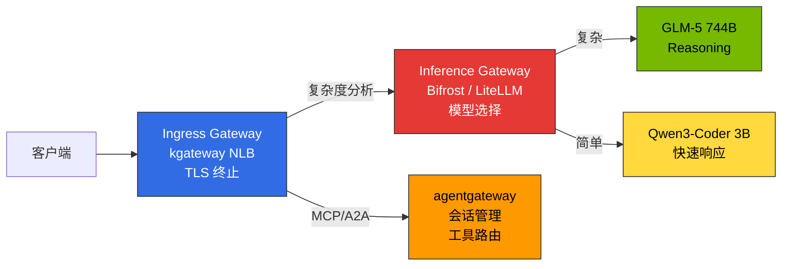
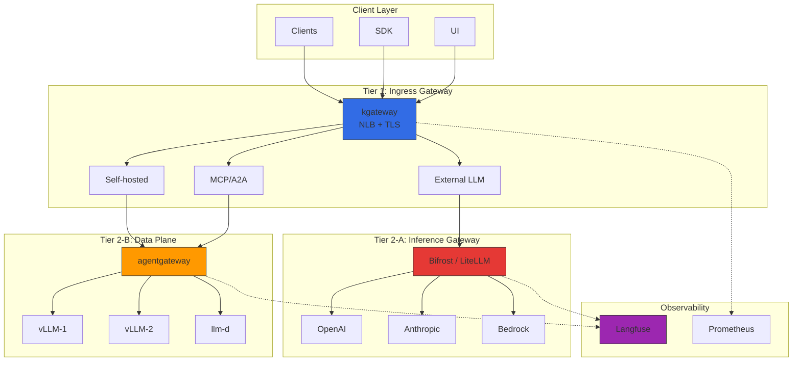
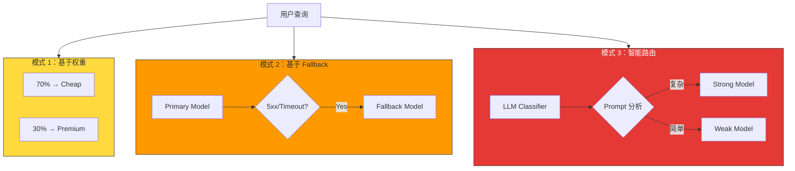
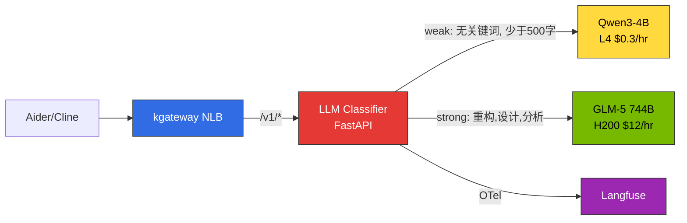
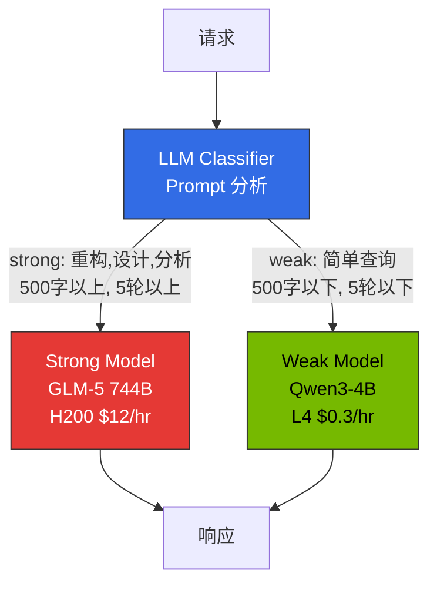
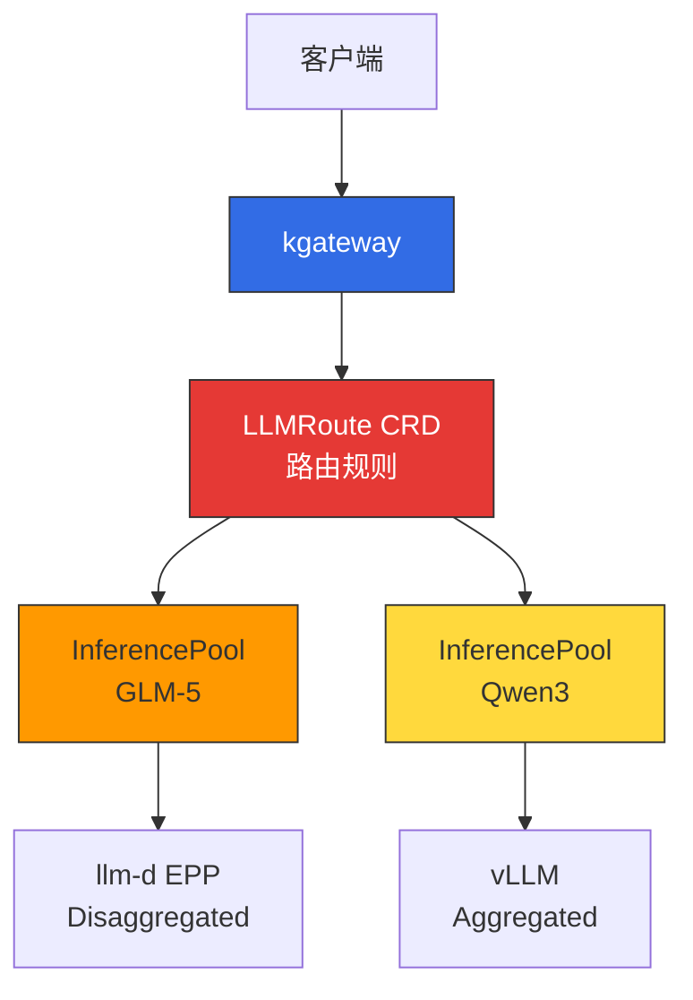

# 推理网关与 LLM Gateway 架构

> 创建日期：2025-02-05 | 修改日期：2026-04-06 | 阅读时间：约 15 分钟

## 概述

大规模 AI 模型服务环境中，需要将**基础设施流量管理**与 **LLM Provider 抽象**分离。单一 Gateway 会导致复杂度急剧增加，各层优化困难。

**2-Tier Gateway 架构**：
- **L1（Ingress Gateway）**：kgateway — Kubernetes Gateway API 标准、流量路由、mTLS、rate limiting
- **L2-A（Inference Gateway）**：Bifrost/LiteLLM — Provider 集成、cascade routing、semantic caching
- **L2-B（Data Plane）**：agentgateway — MCP/A2A 协议、stateful 会话管理

各 Tier 独立管理，分离基础设施和 AI 工作负载。

---

## 2-Tier Gateway 架构

### Gateway 层级区分

LLM 推理平台需要明确区分 **3 种不同的 Gateway 角色**：

| Gateway 类型 | 角色 | 实现 | 位置 |
|-------------|------|-------|------|
| **Ingress Gateway** | 外部流量接收、TLS 终止、路径路由 | kgateway（NLB 联动）| Tier 1 |
| **Inference Gateway** | 模型选择、智能路由、请求级联 | Bifrost / LiteLLM | Tier 2-A |
| **Data Plane** | MCP/A2A 协议、stateful 会话、工具路由 | agentgateway | Tier 2-B |



**核心原则：**
- **Ingress Gateway（kgateway）**：仅负责网络级流量控制。不包含模型选择逻辑
- **Inference Gateway（Bifrost/LiteLLM）**：请求复杂度分析 → 自动选择合适模型 → 成本优化
- **Data Plane（agentgateway）**：处理 AI 专用协议（MCP/A2A），维护 stateful 会话

### 整体结构



### Tier 职责分离

| Tier | 组件 | 职责 | 协议 |
|------|----------|------|----------|
| **Tier 1** | kgateway（基于 Envoy）| 流量路由、mTLS、rate limiting、网络策略 | HTTP/HTTPS、gRPC |
| **Tier 2-A** | Bifrost / LiteLLM | 智能模型选择、成本追踪、request cascading、semantic caching | OpenAI 兼容 API |
| **Tier 2-B** | agentgateway | MCP/A2A 会话管理、自托管推理基础设施路由、Tool Poisoning 防护 | HTTP、JSON-RPC、MCP、A2A |

### 流量流程

**外部 LLM**：Client → kgateway → Bifrost/LiteLLM（Cascade + Cache）→ OpenAI → 响应 + 成本记录
**自托管 vLLM**：Client → kgateway → agentgateway → vLLM → 响应

---

## kgateway（L1 Inference Gateway）

### 基于 Gateway API 的路由

kgateway 实现 Kubernetes Gateway API 标准，可以进行厂商中立的配置。

import { ComponentStructureTable } from '@site/src/components/InferenceGatewayTables';

<ComponentStructureTable />

Gateway API v1.2.0+ 提供 HTTPRoute 改进、GRPCRoute 稳定化、BackendTLSPolicy，kgateway v2.0+ 完全支持。

### Dynamic Routing 概念

| 路由类型 | 依据 | 使用场景 |
|------------|------|----------|
| **基于 Header** | `x-model-id`、`x-provider` | 按模型/Provider 选择后端 |
| **基于路径** | `/v1/chat/completions`、`/v1/embeddings` | 按 API 类型分离服务 |
| **基于权重** | backendRef weight | Canary 部署、A/B 测试 |
| **复合条件** | Header + 路径 + Tier | 按 Premium/普通客户选择后端 |

Canary 部署从 5-10% 流量开始逐步增加，出现问题时 weight=0 立即回滚。

### 负载均衡策略

| 策略 | 说明 | 适用场景 |
|------|------|--------------|
| **Round Robin** | 顺序分配（默认）| 均匀的模型实例 |
| **Random** | 随机分配 | 大规模后端池 |
| **Consistent Hash** | 相同 Key → 相同后端 | KV Cache 复用、会话保持 |

Consistent Hash 在 LLM 推理中特别有用。将同一用户的请求路由到相同的 vLLM 实例可以提高 prefix cache 命中率，从而显著改善 TTFT（Time to First Token）。

### Topology-Aware Routing（Kubernetes 1.33+）

利用 Kubernetes 1.33+ 的 topology-aware routing 优先同 AZ 内 Pod 间通信，减少跨 AZ 数据传输成本。

import { TopologyEffectsTable } from '@site/src/components/InferenceGatewayTables';

<TopologyEffectsTable />

### 故障应对概念

| 机制 | 说明 | LLM 推理考量 |
|----------|------|-------------------|
| **超时** | 每请求最大处理时间限制 | LLM 长响应生成可能需要数十秒。需要充足超时（120s+）|
| **重试** | 5xx、超时、连接失败时自动重试 | 限制最多 3 次。无限重试会导致系统过载 |
| **熔断** | 连续失败时临时阻断后端 | `maxEjectionPercent` 设置 50% 以下，保证至少一半后端可用 |

流式响应中 `backendRequest` 超时是到第一个字节，`request` 是整个请求时间。POST 重试需要保证幂等性（注意工具调用）。

---

## LLM Gateway 方案对比

### 主要方案对比表

| 方案 | 语言 | 主要特点 | Cascade Routing | 许可 | 适用环境 |
|--------|------|-----------|-----------------|----------|-----------|
| **Bifrost** | Go/Rust | 50 倍速、CEL Rules 条件路由、failover | CEL Rules + 外部 classifier | Apache 2.0 | 高性能、低成本、自托管 |
| **LiteLLM** | Python | 100+ Provider、原生 complexity-based routing | `routing_strategy: complexity-based` | MIT | Python 生态、快速原型 |
| **vLLM Semantic Router** | Python | vLLM 专用、轻量嵌入路由 | 嵌入相似度 | Apache 2.0 | vLLM 独立环境 |
| **Portkey** | TypeScript | SOC2 认证、semantic caching、Virtual Keys | 支持 | Proprietary + OSS | 企业级、法规遵从 |
| **Kong AI Gateway** | Lua/C | MCP 支持、利用现有 Kong 基础设施 | 插件 | Apache 2.0 / Enterprise | 现有 Kong 用户 |
| **Helicone** | Rust | Gateway + Observability 集成、高性能 | 支持 | Apache 2.0 | 高性能 + 可观测性同时需要 |

### Bifrost vs LiteLLM

**Bifrost**：Go/Rust 实现，比 Python 快 50 倍、内存使用 1/10。可通过 CEL Rules 实现条件路由（基于 Header 的 cascade、failover）。Helm Chart 部署，OpenAI 兼容 API。代理延迟低于 100us。智能 cascade 通过 App 计算 complexity score → `x-complexity-score` Header → CEL rule 分支模式或 Go Plugin 实现。

**LiteLLM**：100+ Provider 支持，**原生 complexity-based routing**（`routing_strategy: complexity-based` 一行配置即可激活），Langfuse 一行集成（`success_callback: ["langfuse"]`），LangChain/LlamaIndex 直接集成。但基于 Python 导致吞吐量低、内存使用高。

### 选择标准

| 使用场景 | 推荐方案 | 原因 |
|-----------|-----------|------|
| 智能 cascade（便利性优先）| **LiteLLM** | Complexity-based routing 原生、一行配置 |
| 智能 cascade（性能优先）| **Bifrost** | CEL Rules + 外部 classifier、50 倍速 |
| vLLM 独立环境 | **vLLM Semantic Router** | vLLM 原生、轻量路由 |
| 高性能、低成本自托管 | **Bifrost** | 50 倍处理速度、低内存 |
| Python 生态（LangChain）| **LiteLLM** | 原生集成、100+ Provider |
| 企业法规遵从 | **Portkey** | SOC2/HIPAA/GDPR、Semantic Cache |
| 高性能 + 可观测性集成 | **Helicone** | 基于 Rust 的 All-in-one |

### 场景推荐组合

| 场景 | 推荐组合 | 原因 |
|----------|----------|------|
| **初创/PoC** | kgateway + LiteLLM | 低成本、10 分钟部署、complexity routing 一行 |
| **自托管为主（性能）** | kgateway + Bifrost（CEL cascade）+ agentgateway | 高性能、外部+自托管 2-Tier |
| **企业多 Provider** | kgateway + Portkey + Langfuse | 法规遵从、250+ Provider |
| **混合（外部+自托管）** | kgateway + Bifrost/LiteLLM + agentgateway | 外部用 Bifrost/LiteLLM、自托管用 agentgateway |
| **全球部署** | Cloudflare AI Gateway + kgateway | Edge caching、DDoS 防护 |

---

## Request Cascading：智能模型路由

### 概念

**Request Cascading** 是自动分析请求复杂度并路由到合适模型的智能优化技术。简单查询路由到低成本快速模型，复杂推理路由到强大模型，同时优化成本和延迟。IDE 只使用单一端点，模型选择在平台级别集中管控。

### Cascading 3 种模式

| 模式 | 说明 | 实现 | 使用场景 |
|------|------|------|----------|
| **1. 基于权重** | 固定比例分配流量 | kgateway `backendRef weight` | A/B 测试、渐进式模型迁移 |
| **2. 基于 Fallback** | 错误时自动切换到其他模型 | kgateway retry + 多 backendRef | 提升可用性、绕过 rate limit |
| **3. 智能路由** | 分析请求后自动选择模型 | **LLM Classifier** / LiteLLM / vLLM Semantic Router | 成本优化、质量维持 |



### Request Cascading 实战实现

智能 cascade routing 分析请求复杂度并自动路由到合适模型。以自托管环境中实际验证的方法为主进行说明。

#### 方案 A：LLM Classifier（推荐 — 实战验证）

**LLM Classifier** 是基于 Python FastAPI 的轻量路由器，直接分析 Prompt 内容自动选择 SLM/LLM。在 kgateway 后作为 ExtProc（External Processing）或独立服务运行，客户端只使用单一端点（`/v1`）。



**分类标准：**

| 标准 | weak（SLM）| strong（LLM）|
|------|-----------|-------------|
| **关键词** | 无 | 重构、架构、设计、分析、调试、优化、迁移等 |
| **输入长度** | 少于 500 字 | 500 字以上 |
| **对话轮数** | 5 轮以下 | 5 轮以上 |

**核心分类逻辑：**

```python
STRONG_KEYWORDS = ["重构", "架构", "设计", "分析", "优化", "调试",
                   "迁移", "refactor", "architect", "design", "analyze",
                   "optimize", "debug", "migration", "complex"]
TOKEN_THRESHOLD = 500

def classify(messages: list[dict]) -> str:
    content = " ".join(m.get("content", "") for m in messages if m.get("content"))
    # 关键词匹配
    if any(kw in content.lower() for kw in STRONG_KEYWORDS):
        return "strong"
    # 输入长度
    if len(content) > TOKEN_THRESHOLD:
        return "strong"
    # 对话轮数
    if len(messages) > 5:
        return "strong"
    return "weak"
```

**优点**：无需修改客户端、直接分析 Prompt 内容、直接发送 Langfuse OTel、部署简单（单 Pod）
**缺点**：分类精度依赖启发式规则（可逐步改进为 ML classifier）

:::tip LLM Classifier 最优的原因
标准 OpenAI 兼容客户端（Aider、Cline 等）**只设置单一 `base_url`**。LLM Classifier 在此单一端点后分析 Prompt 并直接代理到后端 vLLM 实例。客户端完全感知不到模型选择。
:::

#### Bifrost 自托管 Cascade 限制

尝试将 Bifrost 用于自托管 vLLM cascade，但由于以下限制**转向了 LLM Classifier**：

| 限制 | 说明 |
|------|------|
| **provider/model 格式强制** | 请求时需要 `openai/glm-5` 格式。标准 OpenAI 客户端（Aider 等）期望 `model: "auto"` 这样的单一模型名 |
| **每个 provider 单一 base_url** | 一个 provider（如 `openai`）只能设置一个 `network_config.base_url`。SLM 和 LLM 在不同 Service 时无法以相同 provider 路由 |
| **CEL 无法访问 Prompt** | CEL Rules 只能访问 `request.headers`。无法分析请求 body（Prompt 内容）进行路由 |
| **模型名归一化问题** | 删除连字符等不可预测的归一化导致与 vLLM `served-model-name` 不匹配 |

:::warning Bifrost 适合外部 LLM Provider 集成
Bifrost 针对 OpenAI/Anthropic/Bedrock 等**外部 Provider 集成**和 **failover** 进行了优化。自托管 vLLM 间的智能 cascade routing 更适合 LLM Classifier。
:::

#### RouteLLM 评估结果

[RouteLLM](https://github.com/lm-sys/RouteLLM) 是 LMSYS 开发的开源路由框架，基于 Matrix Factorization 的分类模型在学术上已验证（LMSYS Chatbot Arena 数据基准 90%+ 精度）。

但在 K8s 部署时确认了以下问题：

- **依赖冲突**：`torch`、`transformers`、`sentence-transformers` 等大型依赖树与 vLLM 环境冲突
- **容器大小**：包含分类模型时镜像大小 10GB+（不适合轻量路由器）
- **部署不稳定**：pip dependency resolution 失败频率高
- **维护**：研究项目性质，缺乏生产支持

**结论**：RouteLLM 的 MF classifier **概念**有效，但生产部署推荐 **LLM Classifier**（轻量启发式）或 **LiteLLM complexity routing**（外部 Provider 环境）。

#### 方案 B：LiteLLM 原生（外部 Provider 环境）

LiteLLM 原生支持 **complexity-based routing**。只需在配置文件中添加 1 行即可自动分析请求复杂度并选择模型。

```yaml
model_list:
  - model_name: gpt-4-turbo
    litellm_params:
      model: gpt-4-turbo-preview
      api_key: os.environ/OPENAI_API_KEY
  - model_name: gpt-3.5-turbo
    litellm_params:
      model: gpt-3.5-turbo
      api_key: os.environ/OPENAI_API_KEY

router_settings:
  routing_strategy: complexity-based  # 此 1 行激活
  complexity_threshold: 0.7           # 0.7 以上 → 强模型
```

**优点**：1 行配置激活、自动分析 Prompt 长度·代码包含·推理关键词、100+ Provider 支持
**缺点**：基于 Python 低吞吐量、复杂度算法不可定制、自托管 vLLM 有额外开销

#### 方案 C：vLLM Semantic Router（vLLM 专用）

vLLM 环境可使用 **vLLM Semantic Router** 进行轻量嵌入路由。将预定义的"类别"与嵌入匹配来选择模型。

```python
# vLLM Semantic Router 设置
from vllm import SemanticRouter

router = SemanticRouter(
    categories={
        "simple": ["basic question", "quick answer", "definition"],
        "complex": ["explain in detail", "analyze", "step by step"]
    },
    models={
        "simple": "qwen3-4b",
        "complex": "glm-5-744b"
    },
    threshold=0.85
)

# 自动路由
response = router.route(prompt="Explain the architecture...")  # → glm-5-744b
```

**优点**：vLLM 原生、轻量嵌入使用（推理延迟 < 5ms）、配置简单
**缺点**：vLLM 专用、需要预定义类别

### Cascade Routing 实现方法选择指南

| 环境 | 推荐方案 | 原因 |
|------|----------|------|
| **自托管 vLLM（Aider/Cline）** | **LLM Classifier** | 直接分析 Prompt、单一端点、无需修改客户端 |
| **外部 Provider（OpenAI/Anthropic）** | **LiteLLM** | 100+ Provider 原生、complexity routing 1 行 |
| **vLLM 独立 + 嵌入可用** | **vLLM Semantic Router** | vLLM 原生、轻量 |
| **混合（外部 + 自托管）** | **LLM Classifier + LiteLLM** | 自托管用 Classifier、外部用 LiteLLM |

### Cascade Routing 策略（基于 Fallback）

根据复杂度**逐步尝试 cheap → medium → premium** 模型。Fallback 条件：HTTP 5xx、Rate Limit 超限、Timeout、Quality Score 低于 0.7（可选）。复杂度分类：Token 少于 100 → Cheap（GPT-3.5）、少于 500 → Cheap+（Haiku）、少于 1500 或含代码 → Medium（GPT-4o）、大于 1500 → Premium（GPT-4 Turbo）。

### 成本节省效果

每日 10,000 请求场景：Simple（50% GPT-3.5 $2.5）+ Medium（30% Haiku $2.4）+ Complex（15% GPT-4o $3.75）+ Very Complex（5% GPT-4 Turbo $5）= **$13.65/天**。所有请求用 GPT-4 Turbo 处理为 $50/天，**节省 73%**。

**自托管 LLM Classifier 场景**：Qwen3-4B（70% weak、L4 $0.3/hr）+ GLM-5 744B（30% strong、H200 $12/hr）= **月 $3,020**（GLM-5 独立运行 $8,900 对比**节省 66%**）。

### 企业模型路由模式

**实现位置优先级**：Gateway > IDE > 客户端

| 位置 | 优点 | 适用环境 |
|------|------|----------|
| **Gateway（LLM Classifier）** | Prompt 分析、集中管控、客户端无修改 | 自托管**（推荐）** |
| **Gateway（LiteLLM/Bifrost）** | 多 Provider、策略一致性 | 外部 Provider |
| **IDE（Claude Code）** | 上下文感知 | 开发工具厂商 |
| **客户端（SDK）** | 灵活性高 | 原型 |

**实战推荐**：自托管环境中以 **kgateway → LLM Classifier → vLLM** 结构部署进行集中路由。开发者只使用单一端点（`/v1`），平台团队管理分类策略。详细部署指南请参阅 [网关配置指南](../reference-architecture/inference-gateway-setup.md)。

---

## 研究参考：RouteLLM

**RouteLLM** 是 LMSYS 开发的开源 LLM 路由框架。轻量分类模型（Matrix Factorization）分析请求后自动选择 strong/weak 模型。



| 项目 | RouteLLM（研究）| LLM Classifier（实战）|
|------|----------------|---------------------|
| **分类方式** | Matrix Factorization 嵌入 | 关键词 + Token 长度 + 对话轮数 |
| **输入** | 用户 Prompt + 对话历史 | 相同 |
| **输出** | Strong/Weak + 置信度分数 | Strong/Weak |
| **额外延迟** | 小于 10ms（MF 推理）| 小于 1ms（规则）|
| **依赖** | torch、transformers、sentence-transformers | FastAPI、httpx（轻量）|
| **K8s 部署** | 不稳定（依赖冲突）| 稳定（50MB 镜像）|

:::warning RouteLLM 生产部署注意
RouteLLM 是研究项目，不推荐 K8s 生产部署。依赖冲突和大镜像（10GB+）是问题。MF classifier **概念**有用，但实战中推荐 **LLM Classifier**（自托管）或 **LiteLLM complexity routing**（外部 Provider）。
:::

详细部署代码请参阅 [网关配置指南](../reference-architecture/inference-gateway-setup.md)。

---

## Gateway API Inference Extension

Kubernetes Gateway API 通过 **Inference Extension** 将 LLM 推理作为 Kubernetes 原生资源管理。

### 核心 CRD（Custom Resource Definitions）

| CRD | 角色 | 示例 |
|-----|------|------|
| **InferenceModel** | 定义模型级服务策略（criticality、路由规则）| `criticality: high` → 专用 GPU 分配 |
| **InferencePool** | 模型服务 Pod 组（vLLM replicas）| `replicas: 3` → 3 个 vLLM 实例 |
| **LLMRoute** | 将请求路由到 InferenceModel 的规则 | `x-model-id: glm-5` → GLM-5 Pool |

详细 YAML 清单请参阅 [网关配置指南](../reference-architecture/inference-gateway-setup.md)。

### Gateway API Inference Extension 集成

Gateway API Inference Extension 与 **kgateway + llm-d EPP** 联动提供 Kubernetes 原生推理路由：



**当前状态**：作为 CNCF 项目活跃开发中。预计 Kubernetes 1.34+ 提供 alpha，当前不推荐生产使用。实战部署请参阅 [Reference Architecture](../reference-architecture/) 指南。

---

## Semantic Caching

### 概念

Semantic Caching 检测**语义上相似的 Prompt** 并复用之前的响应，从而节省 LLM API 成本。使用基于嵌入的相似度匹配（threshold 大于 0.85），Cache HIT 时跳过 LLM 调用。

### 相似度阈值（Similarity Threshold）

| Threshold | 含义 | 缓存命中率 | 精度 |
|-----------|------|-------------|--------|
| **0.95+** | 几乎相同的句子 | 低（约 10%）| 非常高 |
| **0.85-0.94** | 意思相同，表达略有不同 | 中等（约 30%）| 高**（推荐）** |
| **0.75-0.84** | 相似主题 | 高（约 50%）| 中等（假阳性风险）|
| **0.70 以下** | 相关主题 | 非常高 | 低（不当响应风险）|

**推荐设置**：**0.85**（意思相同但表达不同的情况复用缓存）

### 成本节省效果

每日 10,000 请求、缓存命中率 30%、GPT-4 Turbo 基准：月费用 $4,500 → $3,150（节省 30%）。额外成本（嵌入约 $0.5/月、Redis/Milvus 约 $10-20/月）计入后净节省约 $1,300/月（29%）。

**实现选项**：Portkey（内置 semantic cache）、Helicone（基于 Rust 高性能）、自实现（Redis + 嵌入）。详细配置参阅 Reference Architecture。

---

## agentgateway 数据平面

### 概述

**agentgateway** 是 kgateway 的 AI 工作负载专用数据平面。现有 Envoy 针对 stateless HTTP/gRPC 优化，但 AI Agent 有 stateful JSON-RPC 会话、MCP 协议、Tool Poisoning 防护等特殊需求。

### Envoy vs agentgateway 对比

| 项目 | Envoy 数据平面 | agentgateway |
|------|---------------------|---------------------------|
| **会话管理** | Stateless、HTTP Cookie | Stateful JSON-RPC 会话、内存会话存储 |
| **协议** | HTTP/1.1、HTTP/2、gRPC | MCP（Model Context Protocol）、A2A（Agent-to-Agent）|
| **安全** | mTLS、RBAC | Tool Poisoning 防护、per-session Authorization |
| **路由** | 路径/Header | 会话 ID、工具调用验证 |
| **可观测性** | HTTP 指标、Access Log | LLM Token 追踪、工具调用链、成本 |

### 核心功能

**1. Stateful JSON-RPC 会话管理**：基于 `X-MCP-Session-ID` Header 的会话追踪、Sticky Session 路由、非活跃会话自动清理（默认 30 分钟）

**2. MCP/A2A 协议原生支持**：`/mcp/v1`（MCP 协议）、`/a2a/v1`（A2A Agent 通信）路径支持

**3. Tool Poisoning 防护**：允许工具列表、危险工具阻断（`exec_shell`、`read_credentials`）、响应大小限制、完整性验证（SHA-256）

**4. Per-session Authorization**：JWT Token 验证、基于角色的工具访问、会话劫持防护

:::info agentgateway 项目现状
agentgateway 于 2025 年末从 kgateway 项目分离的 AI 专用数据平面，目前活跃开发中。随着 MCP 和 A2A 协议的快速发展，功能持续增加。
:::

---

## 监控与可观测性

### 核心指标

AI 推理网关中需要监控的核心指标如下：

import { MonitoringMetricsTable } from '@site/src/components/InferenceGatewayTables';

<MonitoringMetricsTable />

| 指标类别 | 主要项目 | 含义 |
|----------------|----------|------|
| **延迟** | TTFT（Time to First Token）| 首个 Token 生成时间。用户体验响应性 |
| **吞吐量** | TPS（Tokens Per Second）| 每秒生成 Token 数。模型服务效率 |
| **错误率** | 5xx / 总请求 | 后端故障比率。超过 5% 需立即处理 |
| **缓存命中率** | Cache Hit / 总请求 | Semantic Cache 效率。推荐 30% 以上 |
| **成本** | 模型级 Token 使用量 × 单价 | 实时成本追踪 |

### Langfuse OTel 联动

Bifrost/LiteLLM 向 Langfuse 发送 OTel trace 以追踪 Prompt/完成内容、Token 使用量、成本分析、工具调用链。Bifrost 通过 `otel` 插件激活，LiteLLM 通过 `success_callback: ["langfuse"]` 配置激活。详细配置请参阅 [监控栈设置](../reference-architecture/monitoring-observability-setup.md)。

### 推荐告警规则

| 告警 | 条件 | 严重度 |
|------|------|--------|
| 高错误率 | 5xx 大于 5%（5 分钟内）| Critical |
| 高延迟 | P99 大于 30 秒（5 分钟内）| Warning |
| 熔断器激活 | circuit_breaker_open == 1 | Critical |
| 缓存命中率骤降 | Cache hit 低于 30% | Warning |
| 预算即将超限 | Budget 大于 80% | Warning |

---

## 相关文档

### 实战部署指南

实际代码示例和 YAML 清单请参阅 Reference Architecture 章节：

- [网关配置指南](../reference-architecture/inference-gateway-setup.md) - kgateway、Bifrost、agentgateway 安装及 YAML 清单
- [OpenClaw AI Gateway 部署](../reference-architecture/openclaw-ai-gateway.mdx) - OpenClaw + Bifrost + Hubble 实战部署
- [自定义模型部署](../reference-architecture/custom-model-deployment.md) - vLLM/llm-d 部署指南

### 成本与可观测性

- [编码工具与成本分析](../reference-architecture/coding-tools-cost-analysis.md) - Aider/Cline 连接、NLB 集成路由模式
- [监控栈设置](../reference-architecture/monitoring-observability-setup.md) - Langfuse OTel 联动、Prometheus、Grafana 仪表板
- [LLMOps Observability](../operations-mlops/llmops-observability.md) - 基于 Langfuse/LangSmith 的 LLM 可观测性

### 相关基础设施

- [GPU 资源管理](../model-serving/gpu-resource-management.md) - 动态资源分配策略
- [llm-d 分布式推理](../model-serving/llm-d-eks-automode.md) - 基于 EKS Auto Mode 的分布式推理
- [Agent 监控](../operations-mlops/agent-monitoring.md) - Langfuse 集成指南

---

## 参考资料

### 官方文档

- [Kubernetes Gateway API](https://gateway-api.sigs.k8s.io/)
- [Gateway API Inference Extension (Proposal)](https://github.com/kubernetes-sigs/gateway-api/issues/2813)
- [kgateway 官方文档](https://kgateway.dev/docs/)
- [agentgateway GitHub](https://github.com/kgateway-dev/agentgateway)
- [Bifrost 官方文档](https://www.getmaxim.ai/bifrost/docs)
- [LiteLLM 官方文档](https://docs.litellm.ai/)
- [LiteLLM Complexity Routing](https://docs.litellm.ai/docs/routing)
- [vLLM Semantic Router](https://github.com/vllm-project/semantic-router)

### LLM Provider

- [OpenAI API Reference](https://platform.openai.com/docs/api-reference)
- [Anthropic Claude API](https://docs.anthropic.com/claude/reference)
- [AWS Bedrock](https://docs.aws.amazon.com/bedrock/)

### 相关协议

- [Model Context Protocol (MCP) Spec](https://modelcontextprotocol.io/specification)
- [Agent-to-Agent (A2A) Protocol](https://github.com/a2a-protocol/spec)

### 研究资料与模式

- [RouteLLM: Learning to Route LLMs with Preference Data (arXiv)](https://arxiv.org/abs/2406.18665)
- [LMSYS Chatbot Arena Leaderboard](https://chat.lmsys.org/?leaderboard)
- [LLM Router Pattern: Model Switching](https://markaicode.com/llm-router-pattern-model-switching/)
