# AgentCore 混合部署模式

> 📅 **编写日期**: 2026-04-18 | ⏱️ **阅读时间**: 约 15 分钟

## 概述

Bedrock AgentCore 是一个强大的托管 Agent 平台,但在企业环境中通常需要与自托管基础设施相结合。本文档提供了一个**结合 AgentCore 的无服务器优势与基于 EKS 的自托管基础设施灵活性**的决策框架和经过验证的模式目录,用于设计最优的混合架构。

:::info 前置文档
阅读本文档前,请先参考以下文档:
- [AWS Native 平台](./aws-native-agentic-platform.md) — AgentCore 7 项服务概述(避免重复)
- [基于 EKS 的开放架构](./agentic-ai-solutions-eks.md) — 自托管技术栈配置
- [AI 平台选择指南](./ai-platform-decision-framework.md) — 托管 vs 开源决策
- [SageMaker-EKS 集成](../../reference-architecture/integrations/sagemaker-eks-integration.md) — 混合 VPC/IAM 参考
:::

---

## 混合部署动机

### 单一方案的局限

**仅使用 AgentCore 的约束**:
- 以 Bedrock GA 100+ 模型为中心(无法托管自定义 Fine-tuned SLM)
- 基于 Token 计费(高频简单任务成本增加)
- 与本地数据源的延迟
- MCP 服务器位于 VPC 内部时需要复杂的 PrivateLink 配置

**仅使用 EKS 自托管的约束**:
- Agent Runtime 基础设施运维负担(Kagent Pod + Redis State Store)
- 相比无服务器扩展的复杂自动扩缩容(基于 KEDA Queue)
- 缺乏托管内存管理(需自行实现)
- 需自行构建多 Agent 编排框架

### 混合架构的核心价值

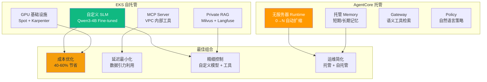

### 成本损益平衡点计算

| 月推理量 | 仅 AgentCore | 仅 EKS 自托管 | 混合(Cascade) | 最优方案 |
|-------------|---------------|---------------------|------------------|----------|
| ~10 万次 | **$300-500** | $800-1,200 | $400-700 | 仅 AgentCore |
| ~50 万次 | $1,500-2,000 | $1,200-1,800 | **$800-1,200** | 混合起点 |
| ~150 万次 | $4,500-6,000 | $2,500-3,500 | **$2,000-2,800** | 必选混合 |
| ~500 万次+ | $15,000+ | **$3,500-5,000** | **$4,000-6,000** | EKS 为主混合 |

:::tip 损益平衡点
月推理量超过 50 万次时混合方案具有成本效益。详细计算公式请参考[编码工具成本分析](../../reference-architecture/integrations/coding-tools-cost-analysis.md)。
:::

---

## 决策矩阵: Agent 部署位置

通过 8 个核心维度评估来决定 Agent 部署位置。

| 评估维度 | AgentCore | EKS Kagent | 混合 | 判断标准 |
|--------|-----------|------------|--------|----------|
| **推理延迟** | 中等(50-200ms) | 低(10-50ms) | **低** | VPC 内部工具调用 → EKS |
| **成本** | 高频时高 | 高频时低 | **最优** | 简单=EKS, 复杂=AgentCore |
| **PII 处理** | VPC 外部(受限) | VPC 内部(有利) | **灵活** | 敏感数据 → EKS MCP |
| **模型定制** | 仅 Bedrock 模型 | 自由(Qwen3, 自定义) | **自由** | Fine-tuned 模型 → EKS |
| **工具链** | REST→MCP 转换 | K8s 原生 | **两者** | 外部 SaaS → AgentCore Gateway |
| **会话长度** | 最大 8 小时 | 无限制 | **无限制** | 长时间对话 → EKS State |
| **审计要求** | CloudTrail 自动 | 需自行实现 | **CloudTrail + 自定义** | 合规 → 优先 AgentCore |
| **团队能力** | 无需 Kubernetes | 必须 Kubernetes | **可选** | K8s 新手 → AgentCore 为主 |

### 决策流程图

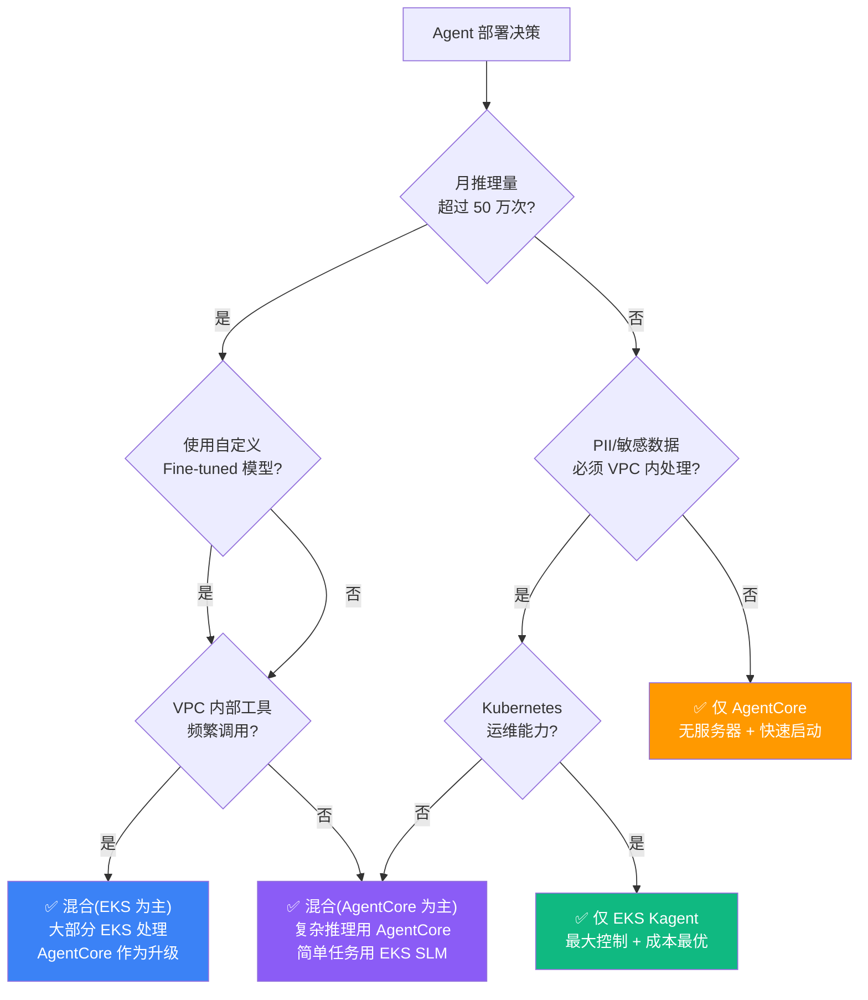

---

## 数据引力与工具共址模式

### 什么是数据引力(Data Gravity)?

将计算资源部署在数据密集区域可最小化网络延迟和成本。

**典型场景**:
- EKS VPC 内部有 Milvus 向量数据库(数 GB~TB 规模)
- AgentCore Runtime 在 VPC 外部(Bedrock 服务账号)
- Agent 为进行 RAG 检索查询 Milvus 时**需经 PrivateLink** → 延迟增加 + 复杂度增加

### 反向调用模式

AgentCore Runtime 调用 EKS VPC 内部 MCP 服务器的架构。

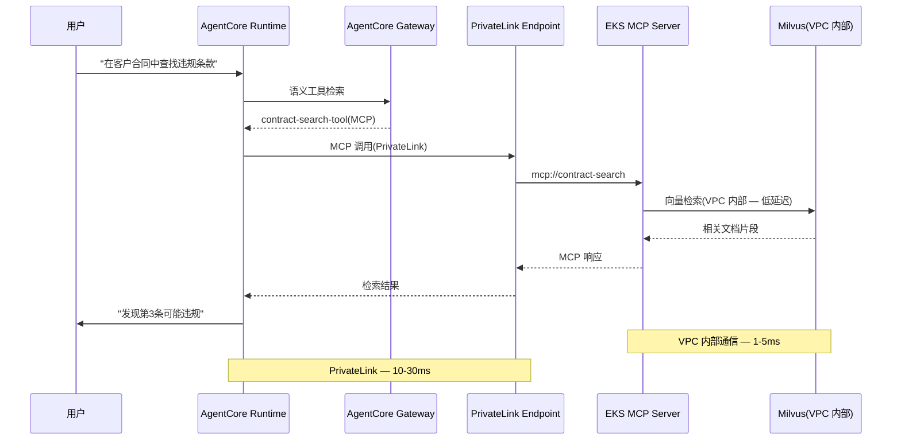

### PrivateLink 配置

```yaml
# privatelink-mcp-endpoint.yaml
apiVersion: v1
kind: Service
metadata:
  name: mcp-server-nlb
  namespace: mcp-system
  annotations:
    service.beta.kubernetes.io/aws-load-balancer-type: "nlb"
    service.beta.kubernetes.io/aws-load-balancer-internal: "true"
    service.beta.kubernetes.io/aws-load-balancer-nlb-target-type: "ip"
spec:
  type: LoadBalancer
  selector:
    app: mcp-server
  ports:
    - port: 443
      targetPort: 8080
      protocol: TCP
---
# 创建 VPC Endpoint Service(AWS Console 或 Terraform)
# 1. 确认 NLB ARN
# 2. 创建 VPC Endpoint Service(Acceptance required: No)
# 3. 为 AgentCore IAM Role 添加 Endpoint 访问权限
```

### S3+KMS 边界设置

通过 S3 + KMS 加密在 AgentCore 和 EKS 间安全共享敏感数据。

```python
# secure_artifact_manager.py
import boto3
import json

class SecureArtifactManager:
    def __init__(self, bucket: str, kms_key_id: str):
        self.s3 = boto3.client('s3')
        self.kms = boto3.client('kms')
        self.bucket = bucket
        self.kms_key_id = kms_key_id
    
    def store_sensitive_result(self, agent_id: str, session_id: str, data: dict) -> str:
        """将敏感结果加密存储到 S3"""
        key = f"agentcore/{agent_id}/{session_id}/result.json"
        
        self.s3.put_object(
            Bucket=self.bucket,
            Key=key,
            Body=json.dumps(data),
            ServerSideEncryption='aws:kms',
            SSEKMSKeyId=self.kms_key_id,
            Metadata={'pii': 'true', 'agent-session': session_id}
        )
        return f"s3://{self.bucket}/{key}"
    
    def load_from_eks(self, s3_uri: str) -> dict:
        """从 EKS Pod 加载 S3 对象(通过 Pod Identity 进行 KMS 解密)"""
        bucket, key = s3_uri.replace('s3://', '').split('/', 1)
        response = self.s3.get_object(Bucket=bucket, Key=key)
        return json.loads(response['Body'].read())
```

**IAM 策略**:
```json
{
  "Version": "2012-10-17",
  "Statement": [
    {
      "Effect": "Allow",
      "Principal": {
        "AWS": "arn:aws:iam::ACCOUNT:role/AgentCoreExecutionRole"
      },
      "Action": ["s3:PutObject"],
      "Resource": "arn:aws:s3:::my-secure-artifacts/agentcore/*",
      "Condition": {
        "StringEquals": {"s3:x-amz-server-side-encryption": "aws:kms"}
      }
    },
    {
      "Effect": "Allow",
      "Principal": {
        "AWS": "arn:aws:iam::ACCOUNT:role/EKSPodRole"
      },
      "Action": ["s3:GetObject"],
      "Resource": "arn:aws:s3:::my-secure-artifacts/agentcore/*"
    }
  ]
}
```

---

## 切换模式目录

### 模式 (a): Router-front(AgentCore Gateway→自托管)

AgentCore Gateway 分析请求后路由到 AgentCore Agent 或 EKS 自托管 Agent。

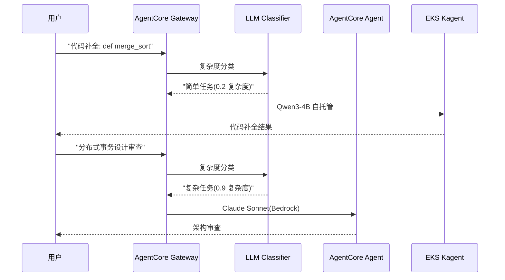

**分类标准**:

| 复杂度得分 | 路由目标 | 示例任务 |
|-----------|-----------|----------|
| 0.0-0.3 | EKS Qwen3-4B | 代码补全、翻译、摘要 |
| 0.3-0.7 | AgentCore Claude Haiku | 基础分析、简单推理 |
| 0.7-1.0 | AgentCore Claude Sonnet | 架构审查、复杂推理 |

**实现**:

```python
# classifier_router.py
from strands import Agent
from strands.models import BedrockModel
import boto3

bedrock_runtime = boto3.client('bedrock-agent-runtime')

class HybridRouter:
    def __init__(self):
        self.classifier = Agent(
            model=BedrockModel(model_id="anthropic.claude-haiku-20250320"),
            system_prompt="""你是一个请求复杂度分类器。
请评估复杂度为 0.0-1.0 之间并以 JSON 格式响应。
{"complexity": 0.0-1.0, "reason": "原因"}"""
        )
    
    def route(self, user_request: str) -> dict:
        classification = self.classifier(f"请求: {user_request}")
        complexity = classification['complexity']
        
        if complexity < 0.3:
            return self._route_to_eks(user_request)
        elif complexity < 0.7:
            return self._route_to_agentcore(user_request, model='haiku')
        else:
            return self._route_to_agentcore(user_request, model='sonnet')
    
    def _route_to_eks(self, request: str) -> dict:
        """路由到 EKS Kagent"""
        import requests
        response = requests.post(
            "http://kagent-service.agents.svc.cluster.local/invoke",
            json={"prompt": request, "model": "qwen3-4b"}
        )
        return {"response": response.json(), "routed_to": "eks-kagent"}
    
    def _route_to_agentcore(self, request: str, model: str) -> dict:
        """路由到 AgentCore"""
        response = bedrock_runtime.invoke_agent(
            agentId='AGENT123',
            agentAliasId='ALIAS456',
            sessionId='session-' + str(hash(request)),
            inputText=request
        )
        return {"response": response, "routed_to": f"agentcore-{model}"}
```

---

### 模式 (b): Escalation(Qwen3 Self→AgentCore 推理)

EKS 自托管 Agent 先处理,当复杂度超过阈值时升级到 AgentCore。

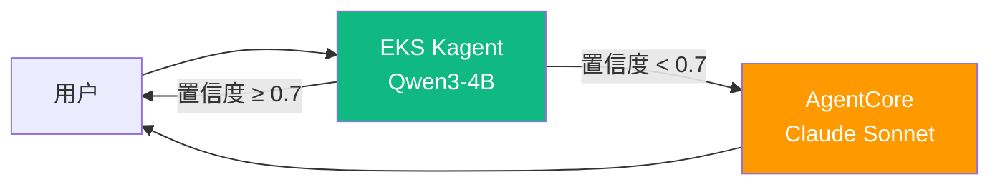

**升级触发条件**:
- LLM 响应置信度得分 < 0.7
- 工具调用失败 2 次以上
- 用户明确请求("需要更准确的答案")

**实现**:

```python
# escalation_agent.py
from strands import Agent
import boto3

class EscalatingAgent:
    def __init__(self):
        self.primary_agent = Agent(
            model=LocalModel("http://vllm-qwen3.vllm.svc.cluster.local"),
            tools=["code_completion", "translation"]
        )
        self.bedrock_runtime = boto3.client('bedrock-agent-runtime')
    
    def process(self, user_request: str) -> dict:
        # 第一步: EKS 自托管 Agent
        response = self.primary_agent(user_request)
        confidence = response.metadata.get('confidence', 0.0)
        
        if confidence >= 0.7:
            return {"response": response, "agent": "eks-qwen3", "confidence": confidence}
        
        # 升级: AgentCore Claude Sonnet
        print(f"⚠️ 低置信度({confidence}) → AgentCore 升级")
        agentcore_response = self.bedrock_runtime.invoke_agent(
            agentId='EXPERT_AGENT_ID',
            agentAliasId='PROD_ALIAS',
            sessionId='escalation-session',
            inputText=f"原始请求: {user_request}\n\n初次尝试失败(置信度: {confidence})。需提供准确答案。"
        )
        return {"response": agentcore_response, "agent": "agentcore-sonnet", "escalated": True}
```

---

### 模式 (c): Dual-write Memory(AgentCore Memory↔EKS Langfuse)

在 AgentCore 和 EKS Agent 之间同步对话记录以保持一致的上下文。

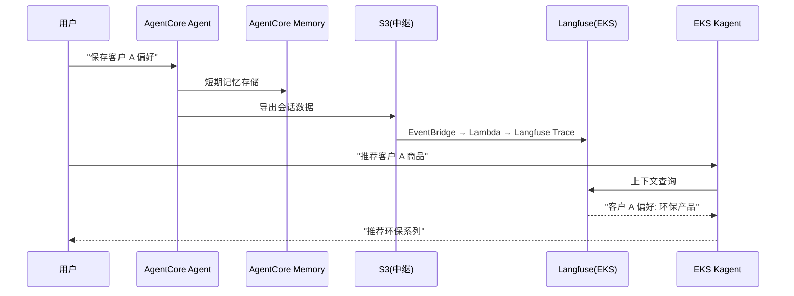

**同步策略**:

| 事件 | AgentCore → EKS | EKS → AgentCore |
|--------|----------------|----------------|
| 会话开始 | Memory Session ID → S3 | Langfuse Trace ID → DynamoDB |
| 工具调用 | Action Group 执行日志 → CloudWatch → Langfuse | Langfuse Span → CloudWatch Logs Insights |
| 会话结束 | Memory 摘要 → S3 → Langfuse | Langfuse 会话统计 → AgentCore Analytics |

**实现**:

```python
# dual_memory_sync.py
import boto3
from langfuse import Langfuse
from datetime import datetime

class DualMemoryManager:
    def __init__(self):
        self.s3 = boto3.client('s3')
        self.langfuse = Langfuse(
            public_key="lf_pk_...",
            secret_key="lf_sk_...",
            host="https://langfuse.eks.internal"
        )
        self.agentcore_memory_bucket = "agentcore-memory-export"
    
    def sync_agentcore_to_langfuse(self, agent_id: str, session_id: str):
        """AgentCore Memory → Langfuse 同步"""
        # 导出 AgentCore Memory(S3)
        memory_key = f"{agent_id}/{session_id}/memory.json"
        memory_obj = self.s3.get_object(Bucket=self.agentcore_memory_bucket, Key=memory_key)
        memory_data = json.loads(memory_obj['Body'].read())
        
        # 创建 Langfuse Trace
        trace = self.langfuse.trace(
            id=session_id,
            name=f"AgentCore Session {agent_id}",
            metadata={"source": "agentcore", "agent_id": agent_id}
        )
        
        for turn in memory_data['conversation']:
            trace.span(
                name=f"Turn {turn['turn_id']}",
                input=turn['user_input'],
                output=turn['agent_response'],
                metadata={"timestamp": turn['timestamp']}
            )
        
        trace.update(output=memory_data.get('summary'))
        print(f"✅ AgentCore Memory → Langfuse 同步完成: {session_id}")
    
    def sync_langfuse_to_agentcore(self, trace_id: str, agent_id: str):
        """Langfuse → AgentCore Memory 同步"""
        trace = self.langfuse.get_trace(trace_id)
        
        # 转换为 AgentCore Memory 格式
        memory_data = {
            "agent_id": agent_id,
            "session_id": trace_id,
            "conversation": [
                {"turn_id": i, "user_input": span.input, "agent_response": span.output}
                for i, span in enumerate(trace.spans)
            ],
            "synced_at": datetime.utcnow().isoformat()
        }
        
        # 上传到 S3(AgentCore 导入)
        self.s3.put_object(
            Bucket=self.agentcore_memory_bucket,
            Key=f"{agent_id}/{trace_id}/imported-memory.json",
            Body=json.dumps(memory_data)
        )
        print(f"✅ Langfuse → AgentCore Memory 同步完成: {trace_id}")
```

---

### 模式 (d): Cost-arbitrage(高频=EKS, 低频复杂=AgentCore)

根据请求频率和复杂度选择成本最优的 Agent。

**成本模型**:

| 场景 | 月请求数 | 平均 Token | AgentCore 成本 | EKS 成本 | 最优选择 |
|---------|-----------|---------|--------------|----------|----------|
| 代码补全 | 500 万次 | 300 token | ~$15,000 | ~$3,500 | **EKS** |
| 架构审查 | 5 万次 | 5,000 token | ~$2,500 | $3,500(GPU 闲置) | **AgentCore** |
| 翻译 | 200 万次 | 500 token | ~$10,000 | ~$2,000 | **EKS** |
| 复杂推理 | 10 万次 | 8,000 token | ~$8,000 | $4,000(专用 GPU) | **AgentCore** |

**路由逻辑**:

```python
# cost_arbitrage_router.py
class CostArbitrageRouter:
    def __init__(self):
        self.request_counts = {}  # 跟踪请求频率
        
        # 成本系数(示例)
        self.agentcore_cost_per_1k_tokens = 0.003  # Claude Haiku
        self.eks_fixed_monthly = 500  # GPU 实例固定成本
        self.eks_break_even_requests = 200000  # 损益平衡点
    
    def should_use_eks(self, task_type: str, estimated_tokens: int) -> bool:
        """基于成本的路由决策"""
        monthly_requests = self.request_counts.get(task_type, 0)
        
        # 高频任务 → EKS
        if monthly_requests > self.eks_break_even_requests:
            return True
        
        # 低频 + 复杂 → AgentCore
        if estimated_tokens > 5000 and monthly_requests < 50000:
            return False
        
        # 简单任务 → EKS(分摊固定成本)
        if estimated_tokens < 1000:
            return True
        
        return False  # 默认: AgentCore
```

---

## IAM·会话·可观测性集成边界

### AgentCore Identity OAuth Token 传播

将 AgentCore Identity 签发的 OAuth Token 安全传递到 EKS MCP 服务器。

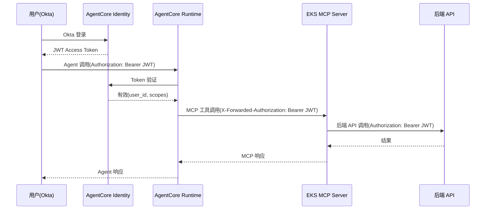

**EKS MCP Server 认证验证**:

```python
# mcp_auth_middleware.py
import jwt
from functools import wraps
from flask import request, jsonify

def validate_agentcore_token(f):
    @wraps(f)
    def decorated(*args, **kwargs):
        token = request.headers.get('X-Forwarded-Authorization', '').replace('Bearer ', '')
        
        if not token:
            return jsonify({"error": "缺少授权 token"}), 401
        
        try:
            # 使用 AgentCore Identity 公钥验证
            payload = jwt.decode(
                token,
                audience="mcp-server",
                issuer="https://bedrock.amazonaws.com/agentcore/identity",
                algorithms=["RS256"],
                options={"verify_signature": True}
            )
            request.user_id = payload['sub']
            request.scopes = payload['scope']
            return f(*args, **kwargs)
        except jwt.ExpiredSignatureError:
            return jsonify({"error": "Token 已过期"}), 401
        except jwt.InvalidTokenError:
            return jsonify({"error": "无效 token"}), 401
    
    return decorated

@app.route('/mcp/customer-lookup', methods=['POST'])
@validate_agentcore_token
def customer_lookup():
    """仅认证用户可查询客户"""
    customer_id = request.json.get('customer_id')
    # 使用 request.user_id 记录审计日志
    return {"customer": fetch_customer(customer_id)}
```

### CloudWatch GenAI Observability ↔ Langfuse OTel 桥接

集成 AgentCore trace 和 EKS Langfuse trace 以追踪完整 Agent 流程。

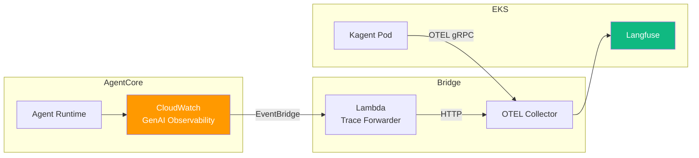

**Trace Correlation ID 规则**:

| 来源 | Trace ID 格式 | Parent Span ID |
|------|--------------|----------------|
| AgentCore | `ac-{session_id}-{timestamp}` | `ac-root` |
| EKS Kagent | `eks-{pod_name}-{trace_id}` | `ac-{session_id}`(AgentCore 调用时) |
| 混合 Trace | `hybrid-{session_id}` | 双方共享 |

**Lambda Trace Forwarder**:

```python
# trace_forwarder_lambda.py
import boto3
import json
import requests
from datetime import datetime

cloudwatch = boto3.client('logs')
langfuse_endpoint = "https://langfuse.eks.internal/api/public/ingestion"

def lambda_handler(event, context):
    """CloudWatch GenAI Observability → Langfuse 转发"""
    for record in event['Records']:
        message = json.loads(record['Sns']['Message'])
        
        if message['source'] == 'aws.bedrock.agentcore':
            trace_data = message['detail']
            
            # 转换为 Langfuse 格式
            langfuse_trace = {
                "id": f"hybrid-{trace_data['sessionId']}",
                "name": f"AgentCore {trace_data['agentId']}",
                "metadata": {
                    "source": "agentcore",
                    "agent_id": trace_data['agentId'],
                    "aws_region": message['region']
                },
                "spans": [
                    {
                        "name": step['actionGroupName'],
                        "input": step['input'],
                        "output": step['output'],
                        "start_time": step['startTime'],
                        "end_time": step['endTime']
                    }
                    for step in trace_data.get('actionGroupInvocations', [])
                ]
            }
            
            # 发送到 Langfuse
            response = requests.post(
                langfuse_endpoint,
                json=langfuse_trace,
                headers={"Authorization": f"Bearer {os.environ['LANGFUSE_API_KEY']}"}
            )
            print(f"✅ Trace 转发完成: {trace_data['sessionId']} → Langfuse")
    
    return {"statusCode": 200}
```

---

## 渐进迁移路线图

### Phase 1: 仅 AgentCore(0-3 个月)

**目标**: 快速生产部署,零基础设施运维负担

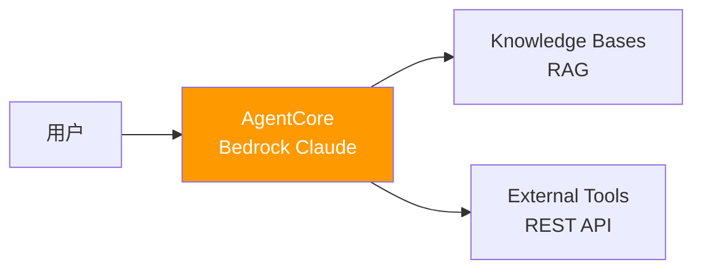

**检查清单**:
- [ ] Bedrock 模型选择(Claude Sonnet/Haiku)
- [ ] 使用 Strands SDK 实现 Agent
- [ ] 部署到 AgentCore(`agentcore deploy`)
- [ ] 配置 Knowledge Bases RAG
- [ ] 启用 CloudWatch GenAI Observability

**退出标准(转 Phase 2 触发器)**:
- 月推理量超过 50 万次
- Bedrock token 成本月超 $1,500
- VPC 内部工具调用频率高(p95 延迟 > 100ms)

---

### Phase 2: Bedrock + 自托管 SLM(3-6 个月)

**目标**: 成本优化,将简单任务卸载到 EKS Qwen3-4B

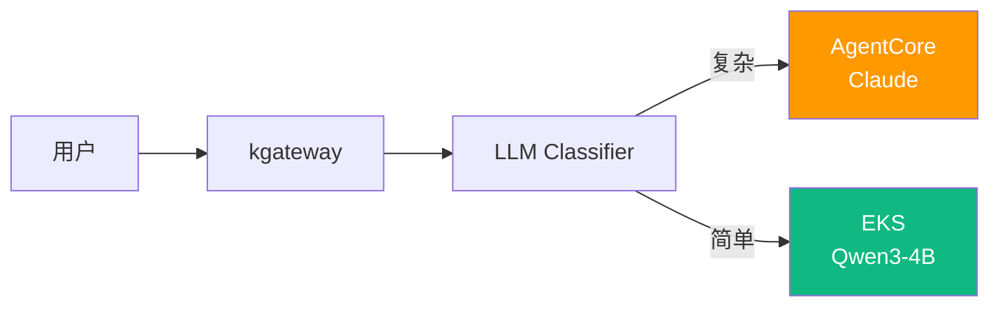

**检查清单**:
- [ ] EKS 集群配置(Auto Mode 或 Karpenter)
- [ ] 使用 vLLM 部署 Qwen3-4B
- [ ] 实现 LLM Classifier(Cascade Routing)
- [ ] 配置 kgateway + Bifrost 2-Tier Gateway
- [ ] 构建成本仪表板(追踪 AgentCore vs EKS 成本)

**退出标准(转 Phase 3 触发器)**:
- EKS Agent 与 AgentCore Agent 间需共享上下文
- 双方需维护相同会话
- 需要 Fine-tuned 自定义模型

---

### Phase 3: 完全混合跨路由(6-12 个月)

**目标**: 双向路由,统一上下文,成本最优

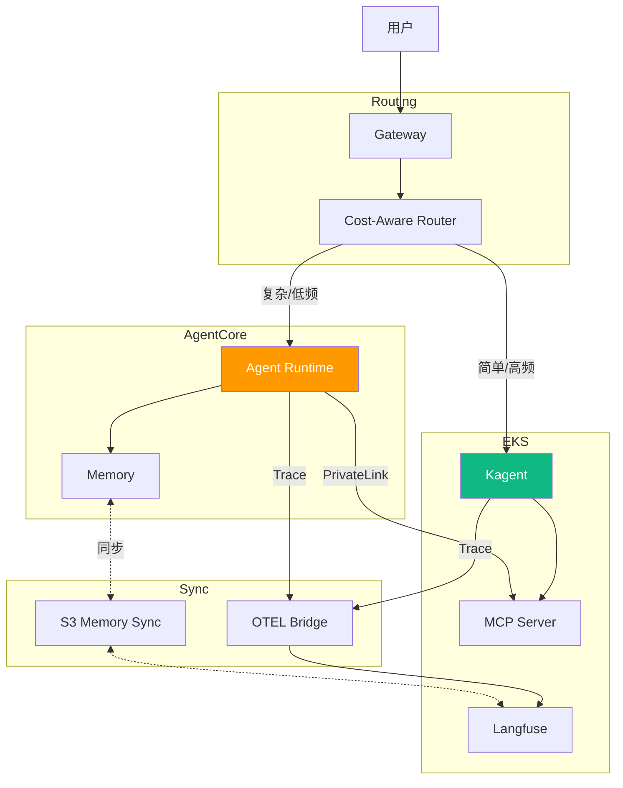

**检查清单**:
- [ ] 实现 Dual-write Memory 同步(模式 c)
- [ ] 集成 Trace Correlation ID
- [ ] 为 MCP 配置 PrivateLink Endpoint
- [ ] 实现 Cost-arbitrage Router(模式 d)
- [ ] 实现 Escalation 逻辑(模式 b)
- [ ] 统一仪表板(AgentCore + EKS 集成可观测性)

**成功指标**:
- 成本节省率: 40-60%(相比仅 Bedrock)
- p95 延迟: 比仅 AgentCore 改善 20%
- 会话上下文一致性: 95% 以上
- Agent 可用性: 99.9%(双向故障转移)

---

## 转换触发指标

各 Phase 转换的量化指标。

| 指标 | Phase 1 → 2 阈值 | Phase 2 → 3 阈值 |
|------|-------------------|-------------------|
| **月推理量** | > 50 万次 | > 150 万次 |
| **月成本** | > $1,500 | > $3,000 |
| **平均延迟(p95)** | > 100ms | > 200ms |
| **会话上下文丢失率** | N/A | > 5% |
| **自定义模型需求** | 需要 Fine-tuning | 需要领域专用 SLM |
| **团队 K8s 能力** | 初学者 | 中级以上 |

---

## 参考资料

### AgentCore 官方文档
- [Amazon Bedrock AgentCore](https://docs.aws.amazon.com/bedrock/latest/userguide/agents.html)
- [AgentCore Identity & Policy](https://docs.aws.amazon.com/bedrock/latest/userguide/agents-identity.html)
- [CloudWatch Generative AI Observability](https://aws.amazon.com/blogs/mt/launching-amazon-cloudwatch-generative-ai-observability-preview/)

### EKS & Kubernetes
- [EKS PrivateLink](https://docs.aws.amazon.com/eks/latest/userguide/private-clusters.html)
- [Kagent - Kubernetes Agent Framework](https://github.com/kagent-dev/kagent)
- [Langfuse Self-Hosting](https://langfuse.com/docs/deployment/self-host)

### 混合架构参考
- [SageMaker-EKS 集成](../../reference-architecture/integrations/sagemaker-eks-integration.md)
- [推理网关路由](../../reference-architecture/inference-gateway/routing-strategy.md)
- [编码工具成本分析](../../reference-architecture/integrations/coding-tools-cost-analysis.md)

### MCP & A2A
- [AWS MCP Servers(GitHub)](https://github.com/awslabs/mcp)
- [Model Context Protocol 规范](https://modelcontextprotocol.io/)
- [Agent-to-Agent Protocol](https://agentprotocol.io/)
