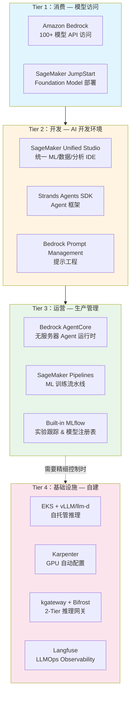
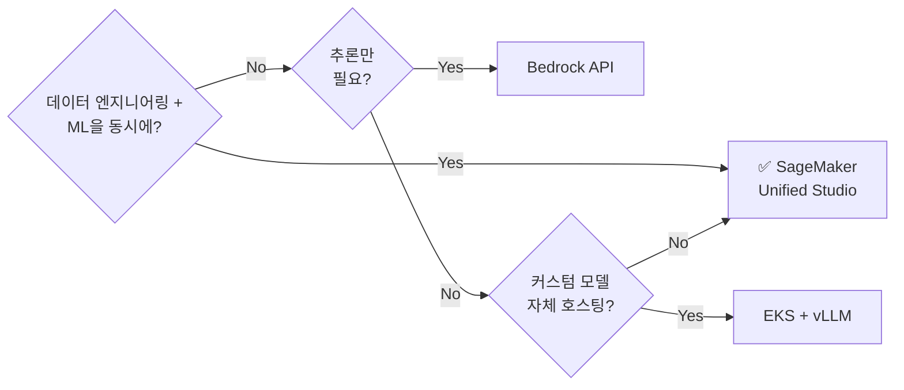
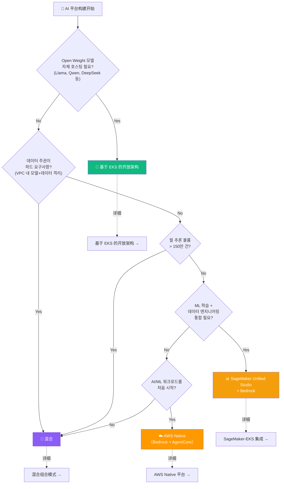
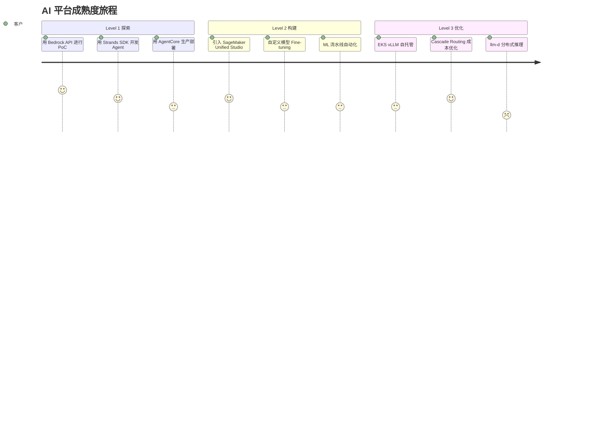
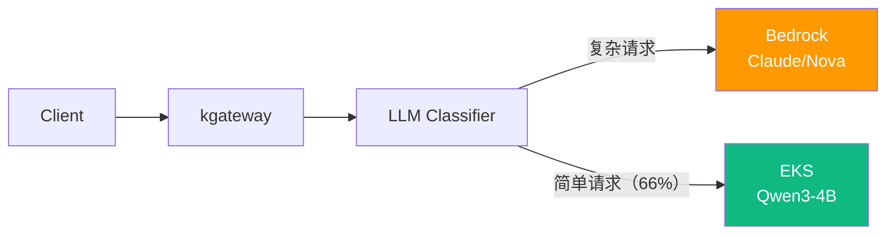
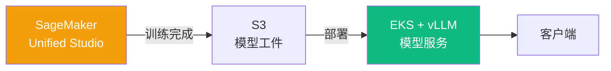
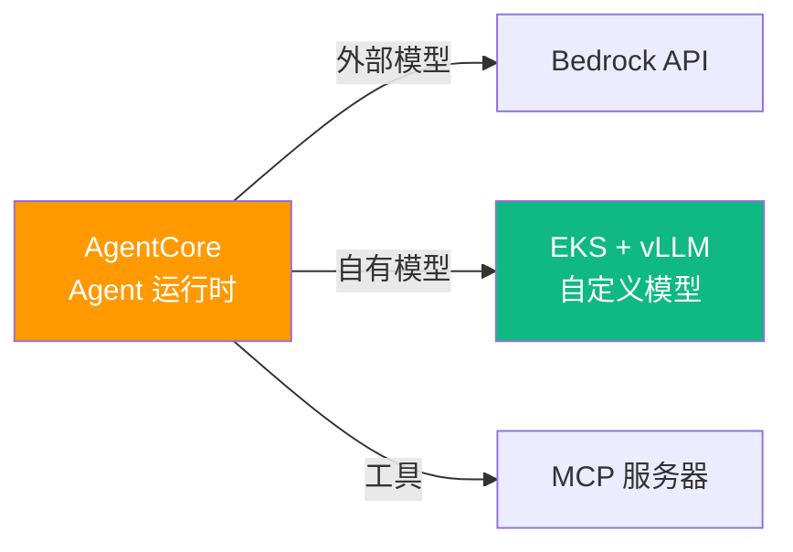

import { PlatformComparisonMatrix, MaturityPathTable, HybridPatternSummary } from '@site/src/components/DecisionFrameworkTables';

# AI 平台选择指南

> 📅 **撰写日期**：2026-04-15 | ⏱️ **阅读时间**：约 15 分钟

고객이 AI를 직접 개발하려 할 때 가장 먼저 직면하는 질문은 "매니지드 서비스를 쓸 것인가, 오픈소스로 직접 구축할 것인가?"입니다. 이 문서는 **SageMaker Unified Studio**, **Bedrock AgentCore**, **EKS 기반 오픈 아키텍처** 중 고객 상황에 맞는 최적 접근을 선택할 수 있도록 의사결정 프레임워크를 제공합니다.

AI 平台构建路径大致分为 3 种：

- **(A) AWS 托管**：通过 Bedrock + Strands SDK + AgentCore 无需基础设施运营即可开始
- **(B) EKS + 开源**：通过 vLLM、llm-d、Langfuse 等自托管获得最大控制权
- **(C) 混合**：结合 Bedrock 和 EKS 实现成本·控制·速度的平衡

:::info 前置文档
阅读本文档前请先参考以下文档：
- [平台架构](./agentic-platform-architecture.md) — 6 个核心层设计蓝图
- [技术挑战](./agentic-ai-challenges.md) — 5 个核心挑战分析
:::

---

## AWS AI 平台服务全景

AWS AI 服务分为 4 个 Tier 层次。客户从下层 Tier 开始，根据需要向上层 Tier 迁移。

**Tier 划分的核心**：
- **Tier 1-3**：通过 AWS 托管服务无需基础设施运营即可开始。
- **Tier 4**：需要精细控制、成本优化、数据主权时选择。
- **大多数客户从 Tier 1 开始逐步扩展**，企业倾向于将 Tier 3 和 Tier 4 混合组合。

---

## SageMaker Unified Studio

### 统一 AI 开发环境

**SageMaker Unified Studio** 是 2024 年下半年发布的统一 AI 开发环境，旨在让 ML/数据/分析工作在一个 IDE 中完成。以前需要分别使用 SageMaker Studio Classic、Athena、Glue Studio 等分散的工具，但 Unified Studio 将它们统一为一体。

### 核心差异点

| 功能 | 说明 | 相比现有的改进 |
|------|------|--------------|
| **统一 IDE** | JupyterLab + SQL 编辑器 + 无代码界面 | 相比 SageMaker Studio Classic 集成数据+ML |
| **Built-in MLflow** | 实验跟踪、模型注册表、模型比较 | 无需单独运营 MLflow 服务器 |
| **Lakehouse 集成** | Apache Iceberg 表、Glue Catalog 原生联动 | 数据工程 → ML 流水线一站式 |
| **治理协作** | 基于 Amazon DataZone 的 IAM 共享、数据血缘跟踪 | 团队间安全的数据/模型共享 |
| **统一计算** | 在单一环境中管理训练、笔记本、流水线 | 防止资源碎片化 |

### 定位：何时选择？?

:::tip 核心信息
SageMaker Unified Studio 是**开发环境（Tier 2）**。与 Bedrock（推理）或 EKS（服务）是**互补关系**，特别是当数据团队和 ML 团队需要在一个平台上协作时提供最大价值。
:::

---

## 平台比较矩阵

根据客户情况，最佳方法有所不同。用 5 个核心评估轴比较各平台选项。

<PlatformComparisonMatrix />

:::info 成本详细分析
自托管和 Bedrock 的详细成本比较（盈亏平衡点、Cascade Routing 节省效果）请参考[编码工具成本分析](../reference-architecture/integrations/coding-tools-cost-analysis.md)。
:::

---

## 决策流程图

可在客户会议中使用的决策流程。通过回答核心问题找到最佳方法。

:::warning 流程图是起点
此流程图是对话的起点，不是最终结论。实际客户情况复杂，大多数企业会收敛到**混合方法**。
:::

---

## 按客户成熟度推荐路径

根据客户当前的 AI/ML 成熟度，起点和扩展路径有所不同。

<MaturityPathTable />

**各级别详细指南**：
- **Level 1（探索）**：→ [AWS Native 平台](./aws-native-agentic-platform.md)
- **Level 2（构建）**：→ [SageMaker-EKS 集成](../reference-architecture/integrations/sagemaker-eks-integration.md)
- **Level 3（优化）**：→ [基于 EKS 的开放架构](./agentic-ai-solutions-eks.md)、[推理网关](../reference-architecture/inference-gateway/routing-strategy.md)

---

## 混合组合模式

大多数企业不是单一方法，而是收敛到混合方式。以下是经过验证的 4 种组合模式。

<HybridPatternSummary />

### 模式 1：Bedrock + EKS SLM（Cascade Routing）

**使用时机**：月推理量超过 50 万次，且请求的 60-70% 是简单任务（代码完成、翻译、摘要）时

**核心价值**：保持 Bedrock API 质量的同时降低 40-60% 成本

**参考**：[推理网关 & Cascade Routing](../reference-architecture/inference-gateway/routing-strategy.md)

---

### 模式 2：SageMaker 训练 + EKS 服务

**使用时机**：训练自定义模型并希望最小化推理成本时

**核心价值**：SageMaker 的托管训练环境 + EKS 的成本高效服务

**参考**：[SageMaker-EKS 集成](../reference-architecture/integrations/sagemaker-eks-integration.md)

---

### 模式 3：AgentCore + 自有模型

**使用时机**：Agent 运行时以无服务器方式运营，但特定领域模型自托管时

**核心价值**：AgentCore 的无服务器运营性 + 自定义模型的领域准确度

**参考**：[AWS Native 平台](./aws-native-agentic-platform.md)

---

### 模式 4：Full Stack（SageMaker + Bedrock + EKS）

最复杂但提供最大灵活性的模式：
- **数据 & 训练**：SageMaker Unified Studio + Pipelines
- **生产推理**：Bedrock API（高可靠任务）+ EKS vLLM（高容量任务）
- **Agent 运行时**：AgentCore（无服务器）+ Kagent（Kubernetes 原生）
- **Observability**：CloudWatch（托管）+ Langfuse（自托管）

该模式在大型企业中为满足各团队不同需求而选择。架构复杂度高，因此明确的运营责任边界和服务目录是必需的。

**参考**：混合架构的技术实现请参考 [SageMaker-EKS 集成](../reference-architecture/integrations/sagemaker-eks-integration.md)。

---

## 成本模拟总结

根据月推理量的最佳选项和预期成本。

| 月推理量 | 最佳选项 | 预期月成本 | 备注 |
|-------------|----------|------------|------|
| ~10 万次 | Bedrock API | ~$300-500 | 无需 GPU 管理，最快启动 |
| ~50 万次 | Bedrock + Cascade | ~$800-1,200 | 开始用 SLM 分离简单请求 |
| ~150 万次 | 混合转换点 | ~$2,500-3,500 | 接近自托管盈亏平衡 |
| ~500 万次+ | EKS 自托管 | ~$3,500-5,000 | 用 Spot + Cascade 节省 60%+ |

:::info 详细成本分析
关于具体实例成本、Spot 节省率、Cascade Routing 效果的详细分析请参考[编码工具成本分析](../reference-architecture/integrations/coding-tools-cost-analysis.md)。
:::

---

## 客户 Discovery 检查清单

在客户会议中为确定最佳方法的 10 个核心问题。

1. **当前是否运营 AI/ML 工作负载？** *→ 判断成熟度级别*
2. **月推理请求规模有多大？** *→ 成本优化路径*
3. **需要 Open Weight 模型自托管吗？** *→ EKS 必要性*
4. **有数据主权或 VPC 隔离要求吗？** *→ 自托管/混合*
5. **团队有 Kubernetes 运营经验吗？** *→ 评估运营负担*
6. **是否同时进行 ML 训练和数据工程？** *→ SageMaker Unified Studio*
7. **月预算范围有多大？** *→ 匹配成本结构*
8. **生产部署目标时间是何时？** *→ Time-to-Value 路径*
9. **有多云或本地混合需求吗？** *→ EKS Hybrid Nodes*
10. **当前使用哪些 AWS 服务？** *→ 利用现有投资*

---

## 相关文档

### 设计 & 架构
- [平台架构](./agentic-platform-architecture.md) — 6 个核心层设计蓝图
- [技术挑战](./agentic-ai-challenges.md) — 5 个核心挑战分析
- [AWS Native 平台](./aws-native-agentic-platform.md) — Bedrock + Strands SDK + AgentCore 详细
- [基于 EKS 的开放架构](./agentic-ai-solutions-eks.md) — EKS Auto Mode + 开源栈详细
- [推理网关 & Cascade Routing](../reference-architecture/inference-gateway/routing-strategy.md) — 2-Tier Gateway 架构

### Reference Architecture
- [SageMaker-EKS 集成](../reference-architecture/integrations/sagemaker-eks-integration.md) — 混合 ML 流水线实现
- [编码工具成本分析](../reference-architecture/integrations/coding-tools-cost-analysis.md) — Bedrock vs 自托管盈亏平衡分析
- [自定义模型部署](../reference-architecture/model-lifecycle/custom-model-deployment.md) — vLLM 部署实战指南
