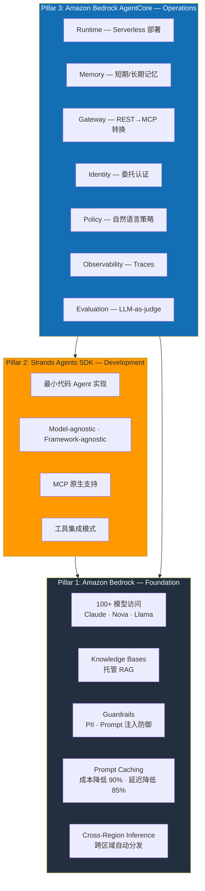
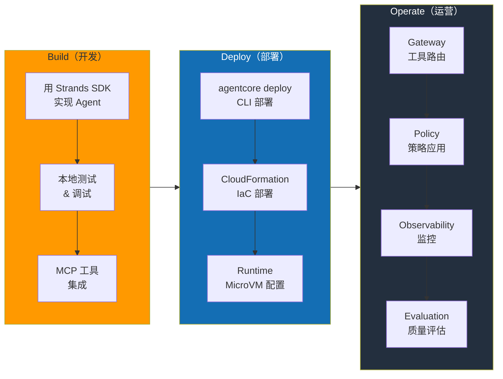
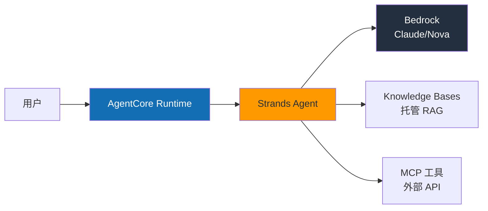
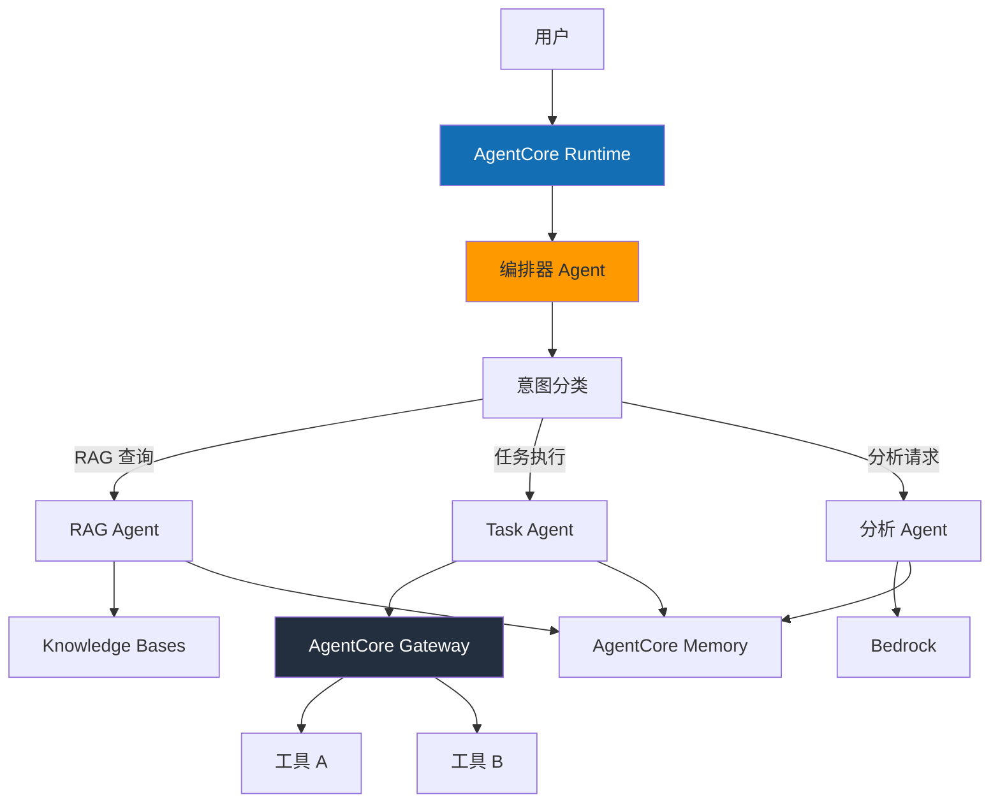
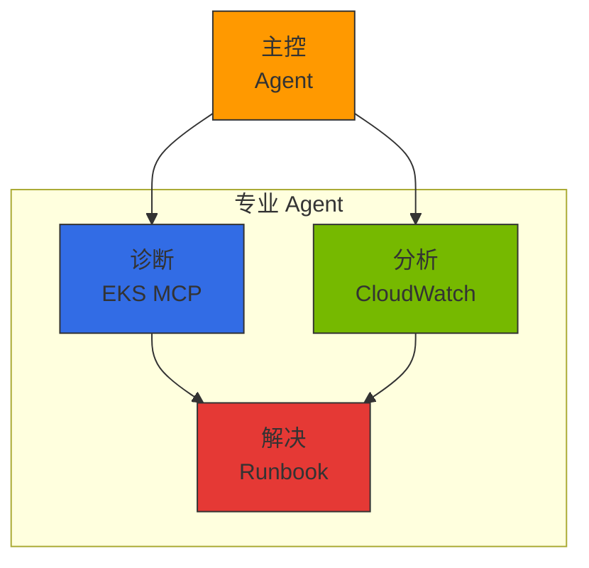

import { EKSMCPFeatures, KagentVsAgentCore, MultiAgentPatterns, MCPServerEcosystem } from '@site/src/components/BedrockMcpTables';

# AWS Native Agentic AI Platform

> **创建日期**：2026-03-18 | **修改日期**：2026-03-20 | **状态**：Draft

## 概述

利用 AWS 托管服务可以**专注于 Agent 的业务逻辑而非基础设施运维**。GPU 管理、弹性伸缩、可用性、安全由 AWS 处理，开发团队只需投入精力解决 Agent 要处理的问题。

AWS Agentic AI 技术栈由三大支柱（Pillar）构成。

| Pillar | 服务 | 角色 |
|--------|--------|------|
| **基础（Foundation）** | Amazon Bedrock | 模型访问、RAG、Guardrails、Prompt 缓存 |
| **开发（Development）** | Strands Agents SDK | Agent 框架、MCP 原生、工具集成 |
| **运营（Operations）** | Amazon Bedrock AgentCore | Serverless 部署、Memory、Gateway、Policy、评估 |

:::info 核心观点
本文档介绍 AWS 托管服务提供的 **Agent 开发优化方案**。托管服务能满足的领域交给 AWS，团队的能力集中在 Agent 业务逻辑上。但这只是多模型之旅的**第一步**。当流量增长带来成本压力、需要领域特化 SLM、出现数据主权要求时，可扩展到 [EKS 开放架构](./agentic-ai-solutions-eks.md)，将自托管模型与 Bedrock **混合组合**是现实的最优解。
:::

### 挑战解决映射

通过 AWS Native 方案解决[技术挑战](../foundations/agentic-ai-challenges.md)中的 5 大核心问题：

| 挑战 | AWS Native 解决方案 |
|---------|---------------------|
| GPU 资源管理及成本优化 | Bedrock Serverless 推理 — 无需 GPU 管理 |
| 智能推理路由及网关 | Bedrock Cross-Region Inference + AgentCore Gateway |
| LLMOps 可观测性及成本治理 | AgentCore Observability + CloudWatch |
| Agent 编排及安全性 | Strands SDK + Bedrock Guardrails + AgentCore Policy |
| 模型供应链管理 | Bedrock Model Evaluation + Prompt Management |

:::tip AWS Native 的核心价值
GPU 基础设施管理、弹性伸缩、可用性、安全由 AWS 处理，团队可以只专注于 Agent 业务逻辑。需要更精细控制时可与 [EKS 开放架构](./agentic-ai-solutions-eks.md) 组合。
:::

---

## AWS Agentic AI 服务架构

### 3-Pillar 架构



---

## Amazon Bedrock：基础层

Amazon Bedrock 提供 Agentic AI 平台的**基础设施**。通过单一 API 访问 100 多个基础模型，并以托管方式支持 RAG、Guardrails、Prompt 缓存。

### 核心功能

| 功能 | 说明 | 核心价值 |
|------|------|----------|
| **模型访问** | Claude、Nova、Llama、Mistral 等 100+ 模型 | 单一 API，模型切换无需代码变更 |
| **Knowledge Bases** | 文档解析 → 分块 → 嵌入 → 索引 → 检索 | 一键 RAG 流水线，只需上传 S3 文档 |
| **Guardrails** | PII 过滤、Prompt 注入防御、主题限制 | 控制台设置策略，无需代码变更 |
| **Prompt Caching** | 重复上下文缓存 | 成本最多降低 90%，延迟最多缩短 85% |
| **Cross-Region Inference** | 跨区域自动流量分发 | 容量达限时自动回退，提升可用性 |
| **Prompt Management** | Prompt 版本管理、A/B 测试 | Prompt 历史追踪、回滚支持 |
| **Model Evaluation** | 自动化模型评估、批处理 | LLM-as-a-judge、人工评估工作流 |

:::tip Prompt Caching 活用
使用长系统 Prompt 或重复工具定义的 Agent 应启用 Prompt Caching，可大幅降低成本和延迟。特别适合 RAG 上下文频繁重复的场景。
:::

---

## Strands Agents SDK：开发框架

**Strands Agents SDK** 是 AWS 以 Apache 2.0 开源的 Agent 框架。以最少代码实现生产级 Agent，Model-agnostic 设计支持 Bedrock 以外的多种模型 Provider。

### 最少代码 Agent 实现

```python
from strands import Agent
from strands.models import BedrockModel

# 基础 Agent — 3 行代码完成
agent = Agent(
    model=BedrockModel(model_id="anthropic.claude-sonnet-4-20250514"),
    tools=["calculator", "web_search"],
)
result = agent("请将首尔当前气温转换为摄氏和华氏")
```

### MCP 原生支持

```python
from strands import Agent
from strands.tools.mcp import MCPClient

# 连接 MCP 服务器 — 自动发现外部工具并集成到 Agent
mcp_client = MCPClient(server_url="http://mcp-server:8080")

agent = Agent(
    model=BedrockModel(model_id="anthropic.claude-sonnet-4-20250514"),
    tools=[mcp_client],  # MCP 工具自动发现与注册
)
result = agent("查询最近的订单记录并确认配送状态")
```

### 自定义工具定义

```python
from strands import Agent, tool

@tool
def lookup_customer(customer_id: str) -> dict:
    """查询客户信息。"""
    # 业务逻辑实现
    return {"name": "张三", "tier": "GOLD", "since": "2023-01"}

@tool
def create_ticket(title: str, priority: str, description: str) -> dict:
    """创建客户咨询工单。"""
    return {"ticket_id": "TK-2026-0042", "status": "OPEN"}

agent = Agent(
    model=BedrockModel(model_id="anthropic.claude-sonnet-4-20250514"),
    tools=[lookup_customer, create_ticket],
    system_prompt="你是客户服务 Agent。查询客户信息并在需要时创建工单。",
)
```

### Strands SDK 核心特性

| 特性 | 说明 |
|------|------|
| **Apache 2.0** | 商业使用自由，可 Fork |
| **Model-agnostic** | 支持 Bedrock、OpenAI、Anthropic API、Ollama 等多种后端 |
| **Framework-agnostic** | 可在 FastAPI、Flask、Lambda 等任何运行时执行 |
| **MCP 原生** | 内置 Model Context Protocol 支持，无需额外适配器 |
| **AgentCore 集成** | 一行 `agentcore deploy` 即可生产部署 |
| **流式响应** | Token 级流式，支持实时 UX |

---

## Amazon Bedrock AgentCore：运营平台

AgentCore 是以托管方式提供 **Agent 生产运营所需一切** 的平台。于 2025 年 GA（General Availability）发布，由 7 大核心服务组成。

### 7 大核心服务

#### 1. Runtime — Serverless Agent 部署

AgentCore Runtime 提供基于 **Firecracker MicroVM** 的隔离执行环境。

| 项目 | 规格 |
|------|------|
| 隔离级别 | Firecracker MicroVM（硬件级隔离）|
| 会话持续 | 最长 8 小时连续会话 |
| 伸缩 | 从 0 自动扩展，无请求时缩至 0 |
| 部署 | `agentcore deploy` CLI 或 CloudFormation |
| 冷启动 | 数秒以内 |

```bash
# 将 Strands Agent 部署到 AgentCore
agentcore deploy \
  --agent-name "customer-service" \
  --entry-point "agent.py" \
  --runtime python3.12 \
  --memory 512 \
  --timeout 3600
```

#### 2. Memory — 短期/长期记忆管理

使 Agent 记住对话上下文和用户偏好的托管内存服务。

| 内存类型 | 说明 | 应用示例 |
|------------|------|----------|
| **短期内存** | 会话内对话记录 | 多轮对话中引用先前问题 |
| **长期内存** | 跨会话持久化信息 | 用户偏好、过往交互模式 |
| **自动摘要** | 自动摘要长对话并存储 | 超出上下文窗口时保留核心信息 |
| **用户画像** | 个性化信息学习 | "该用户偏好简洁的回答" |

#### 3. Gateway — 智能工具路由

AgentCore Gateway **自动将 REST API 转换为 MCP 协议**，通过语义工具搜索从数百个工具中筛选相关工具。

:::info 语义工具搜索
即使 Agent 注册了 300 个工具，Gateway 也会分析用户请求，仅将相关的 4 个工具传递给 Agent。这节省了 LLM 上下文窗口并提高了工具选择准确度。
:::

| 功能 | 说明 |
|------|------|
| **REST → MCP 转换** | 自动将现有 REST API 包装为 MCP 工具 |
| **语义搜索** | 300 个工具 → 自动筛选相关 4 个 |
| **工具注册表** | 集中式工具注册与版本管理 |
| **认证传播** | 安全传递用户认证信息到工具 |

#### 4. Identity — 委托认证

| 功能 | 说明 |
|------|------|
| **IdP 集成** | Okta、Amazon Cognito、OIDC 兼容 Provider |
| **委托认证** | Agent 代表用户向工具认证（OAuth 2.0 Token 交换）|
| **细粒度权限** | 按工具、资源级访问控制 |
| **审计日志** | 所有认证事件记录到 CloudTrail |

#### 5. Policy — 自然语言策略定义

以自然语言定义策略后**编译为确定性运行时**，保证一致的策略执行。

```text
# 自然语言策略示例
策略："仅允许金牌及以上等级客户进行退款处理"
→ 编译 → 确定性规则引擎执行（无需 LLM 调用）

策略："调用外部 API 时必须对 PII 进行脱敏"
→ 编译 → 在 Gateway 层自动应用
```

| 特性 | 说明 |
|------|------|
| **自然语言输入** | 非开发人员也可定义策略 |
| **确定性执行** | 编译后的策略无需 LLM 确定性应用 |
| **实时强制** | 运行时对每个请求进行策略验证 |
| **审计追踪** | 完整记录策略应用/拒绝历史 |

#### 6. Observability — 统一监控

| 功能 | 说明 |
|------|------|
| **CloudWatch 集成** | 自动收集指标、日志、告警 |
| **OpenTelemetry** | 标准检测兼容现有监控工具 |
| **逐步 Trace** | 追踪 Agent 推理 → 工具调用 → 响应全过程 |
| **成本仪表板** | 按模型、Agent、会话可视化成本 |

#### 7. Evaluation — 持续质量监控

| 功能 | 说明 |
|------|------|
| **LLM-as-judge** | LLM 自动评估 Agent 响应质量 |
| **13 项评估标准** | 准确性、相关性、有害性、一致性等 |
| **A/B 测试** | 定量测量 Prompt/模型变更对质量的影响 |
| **持续监控** | 在生产流量中实时追踪质量 |
| **人工评估工作流** | 自动评估与专家评估并行 |

---

## 架构模式

### Build → Deploy → Operate 工作流



### 简单 Agent 模式

适用于 FAQ、账单查询、状态检查等执行单一任务的 Agent。



### 复杂 Agent 模式（多步骤）

适用于顺序/并行调用多个工具，根据中间结果分支的 Agent。



### 多 Agent 模式

独立的 Agent 协作处理复杂业务流程。

```python
from strands import Agent
from strands.models import BedrockModel
from strands.multiagent import MultiAgentOrchestrator

# 定义专业 Agent
research_agent = Agent(
    model=BedrockModel(model_id="anthropic.claude-sonnet-4-20250514"),
    system_prompt="你是研究专家。",
    tools=["web_search", "document_reader"],
)

analysis_agent = Agent(
    model=BedrockModel(model_id="anthropic.claude-sonnet-4-20250514"),
    system_prompt="你是数据分析专家。",
    tools=["calculator", "chart_generator"],
)

writer_agent = Agent(
    model=BedrockModel(model_id="anthropic.claude-sonnet-4-20250514"),
    system_prompt="你是报告撰写专家。",
    tools=["document_writer"],
)

# 多 Agent 编排
orchestrator = MultiAgentOrchestrator(
    agents=[research_agent, analysis_agent, writer_agent],
    strategy="sequential",  # 顺序执行：研究 → 分析 → 撰写
)
result = orchestrator("请撰写 2026 年一季度市场趋势报告")
```

---

## 部署指南

AWS Native Agentic AI Platform 的实战部署方法包含以下三种方案：

### 部署方法概览

| 方案 | 工具 | 适用场景 |
|------|------|--------------|
| **CLI 部署** | `agentcore deploy` | 快速原型、单个 Agent 部署 |
| **IaC 部署** | CloudFormation / CDK | 生产环境、可重现基础设施 |
| **全栈模板** | FAST 模板 | 全栈（Agent + API + UI）引导 |

### Strands + AgentCore 概念

**Strands Agent 结构：**
```python
from strands import Agent
from strands.models import BedrockModel

# 最少代码定义 Agent
agent = Agent(
    model=BedrockModel(model_id="anthropic.claude-sonnet-4-20250514"),
    tools=["calculator", "web_search"],
    system_prompt="你是数学助手。",
)

# 包装为 Lambda Handler
def handler(event, context):
    return agent(event["prompt"])
```

**AgentCore 部署工作流：**
1. 编写 Agent 代码（Python）
2. 执行 `agentcore deploy` → 自动部署到 Firecracker MicroVM
3. 生成端点 → 可通过 REST API 调用 Agent
4. Memory/Gateway/Policy 自动连接

### CloudFormation IaC 模式

使用 AWS CloudFormation 可以声明式管理 Agent 及相关资源（Knowledge Base、Guardrails 等）：

```yaml
Resources:
  CustomerServiceAgent:
    Type: AWS::Bedrock::AgentCoreEndpoint
    Properties:
      AgentName: customer-service
      Runtime: python3.12
      EntryPoint: agent.py:handler
      Environment:
        Variables:
          MODEL_ID: anthropic.claude-sonnet-4-20250514
          KNOWLEDGE_BASE_ID: !Ref KnowledgeBase

  KnowledgeBase:
    Type: AWS::Bedrock::KnowledgeBase
    Properties:
      Name: customer-faq
      StorageConfiguration:
        Type: OPENSEARCH_SERVERLESS
```

:::info 实战部署指南
详细的 kubectl/helm 命令、完整 YAML 清单、Python boto3 部署脚本请参阅 [Reference Architecture](../../reference-architecture/) 章节。本文档聚焦于 AWS Native 方案的**概念与模式**。
:::

---

## 企业应用案例

### Baemin（外卖平台）：基于 RAG 的知识 Agent

| 项目 | 内容 |
|------|------|
| **课题** | 缩短客服人员内部政策搜索时间 |
| **架构** | Strands Agent + Bedrock Knowledge Bases + Claude |
| **成果** | 客服效率**提升 30%**，政策搜索时间缩短 90% |
| **核心价值** | 无需构建 RAG 流水线，仅上传 S3 文档即可完成知识 Agent |

### CJ OnStyle：多 Agent 直播电商

| 项目 | 内容 |
|------|------|
| **课题** | 直播期间实时客户问答自动化 |
| **架构** | 多 Agent（商品信息 Agent + 订单 Agent + 推荐 Agent）|
| **成果** | 客户响应率**提升 3 倍**，实时处理延迟在 2 秒以内 |
| **核心价值** | AgentCore Runtime 的自动伸缩应对直播流量激增 |

### Amazon Devices：制造 Agent

| 项目 | 内容 |
|------|------|
| **课题** | 制造产线品质检测模型微调自动化 |
| **架构** | Strands Agent + Bedrock Fine-tuning + AgentCore |
| **成果** | 微调耗时从**数天缩短至 1 小时** |
| **核心价值** | Agent 自动编排数据预处理 → 微调 → 评估 |

---

## 成本结构

AgentCore 平台的成本遵循**按用量付费**的 Serverless 模型。

### 计费体系

| 服务 | 计费依据 | 特点 |
|--------|----------|------|
| **Bedrock 推理** | 输入/输出 Token 数 | 可选按需、预留吞吐量 |
| **AgentCore Runtime** | 会话时间 + 内存使用量 | 无请求时零计费，最长 8 小时会话 |
| **Knowledge Bases** | 存储 + 查询数 | 基于 OpenSearch Serverless |
| **Guardrails** | 处理的文本单位 | 输入/输出分别计费 |
| **Prompt Caching** | 缓存命中时 90% 折扣 | 重复模式越多节省越多 |

### 运营成本节省要点

| 领域 | 节省因素 |
|------|----------|
| **GPU 管理** | 无需 GPU 实例配置、补丁、弹性伸缩运维人员 |
| **基础设施运维** | Serverless 架构消除集群管理负担 |
| **安全合规** | 利用 AWS 的 SOC 2、HIPAA、ISO 27001 认证 |
| **可用性管理** | 多 AZ 自动部署、Cross-Region Inference 内置 DR |
| **监控构建** | CloudWatch 原生集成，无需单独监控栈 |

:::info 成本优化建议
- **Prompt Caching**：长系统 Prompt 的 Agent 务必启用
- **预留吞吐量**：稳定流量场景比按需最多节省 50%
- **Cross-Region Inference**：特定区域容量达限时自动回退防止限流
- **Batch Inference**：非实时的评估/分析任务使用批处理模式节省成本
:::

---

## MCP 协议与 EKS 集成

### MCP（Model Context Protocol）概述

MCP 是 AI Agent 与工具之间的**标准通信协议**：

- **工具发现**：Agent 动态发现可用工具
- **上下文传递**：以标准化格式传递执行上下文和状态
- **结果返回**：以结构化格式返回工具执行结果
- **Agent 间通信**：通过 A2A 协议实现多 Agent 协作

### EKS MCP Server 集成

AWS 提供 EKS 专用托管 MCP Server，支持 Kubernetes 集群与 AI Agent 的集成：

<EKSMCPFeatures />

**EKS MCP Server 部署概念：**

MCP Server 在 Kubernetes 集群内运行，使 Agent 无需执行 kubectl 命令即可查询集群状态和执行操作。

```bash
# 克隆 AWS MCP 服务器仓库
git clone https://github.com/awslabs/mcp.git
cd mcp/servers/eks

# 构建 Docker 镜像并部署到 EKS
docker build -t eks-mcp-server:latest .
kubectl apply -f k8s/deployment.yaml
```

**AgentCore + MCP 集成模式：**

Bedrock AgentCore 将 MCP Server 注册为 Action Group，使 Agent 可以使用 Kubernetes 工具：

```python
import boto3

bedrock_agent = boto3.client('bedrock-agent')

# 创建 Agent
response = bedrock_agent.create_agent(
    agentName='sre-agent',
    foundationModel='anthropic.claude-sonnet-4-20250514',
    instruction='You are an SRE agent for Kubernetes troubleshooting.',
    agentResourceRoleArn='arn:aws:iam::ACCOUNT:role/BedrockAgentRole',
)

# 连接 MCP 工具（Action Group）
bedrock_agent.create_agent_action_group(
    agentId=response['agent']['agentId'],
    agentVersion='DRAFT',
    actionGroupName='eks-mcp-tools',
    actionGroupExecutor={'customControl': 'RETURN_CONTROL'},
    apiSchema={
        'payload': {
            'openapi': '3.0.0',
            'info': {'title': 'EKS MCP Tools', 'version': '1.0'},
            'paths': {
                '/pod-logs': {'post': {'description': 'Get pod logs'}},
                '/k8s-events': {'post': {'description': 'Get K8s events'}},
            }
        }
    }
)
```

:::info 实战部署详情
完整的 boto3 脚本、IAM 策略、YAML 清单请参阅 [Reference Architecture](../../reference-architecture/) 章节。
:::

### Self-hosted Agent 的混合策略

可以同时利用 EKS 上的 Self-hosted Agent 和 Bedrock AgentCore：

<KagentVsAgentCore />

**混合方案**：高频率调用且成本敏感的用 EKS Self-hosted Agent，需要复杂推理的低频率调用用 Bedrock AgentCore 路由的策略非常有效。

### 多 Agent 编排

AgentCore 通过 MCP/A2A 支持 Agent 间协作：

<MultiAgentPatterns />



### AWS MCP Server 生态系统

AWS 以开源形式提供官方 MCP Server（[github.com/awslabs/mcp](https://github.com/awslabs/mcp)）：

<MCPServerEcosystem />

### CloudWatch Gen AI Observability 集成

:::tip CloudWatch Gen AI Observability GA
CloudWatch Generative AI Observability 于 **2025 年 10 月 GA**。与 AgentCore 原生集成，无需额外配置，Agent 调用、工具执行、Token 使用量自动记录到 CloudWatch。
:::

- **Agent 执行追踪**：端到端 Tracing 可视化完整推理流程
- **工具调用监控**：按 MCP Server 追踪调用次数、延迟、错误率
- **Token 消费分析**：按模型追踪输入输出 Token 使用量和成本
- **异常检测**：联动 CloudWatch Anomaly Detection 自动检测异常模式

---

## 下一步

- 如需 EKS 开源架构 → [EKS 开放架构](./agentic-ai-solutions-eks.md)
- 整体平台设计 → [平台架构](../foundations/agentic-platform-architecture.md)

## 参考资料

- [Amazon Bedrock AgentCore 文档](https://docs.aws.amazon.com/bedrock/latest/userguide/agents.html)
- [AWS MCP Servers (GitHub)](https://github.com/awslabs/mcp)
- [Model Context Protocol 规范](https://modelcontextprotocol.io/)
- [CloudWatch Generative AI Observability](https://aws.amazon.com/blogs/mt/launching-amazon-cloudwatch-generative-ai-observability-preview/)
- [CNS421: Streamline EKS Operations with Agentic AI (re:Invent 2025)](https://www.youtube.com/watch?v=4s-a0jY4kSE)
