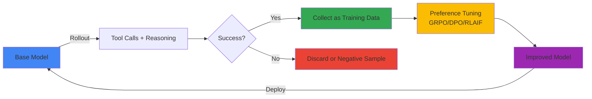
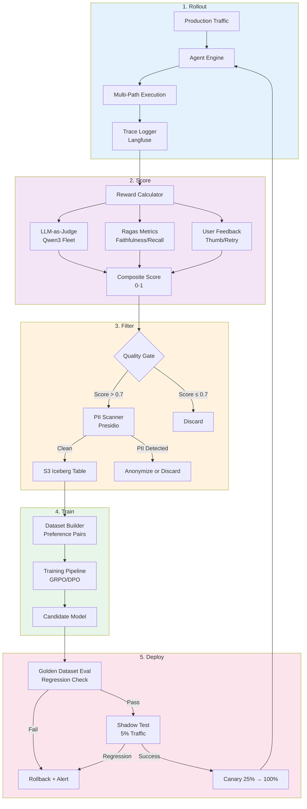
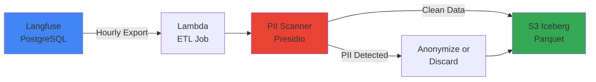

:::warning 自托管 SLM 专用
本循环专用于自托管开放权重模型(Qwen3, Llama 4, GLM-5 等)。AgentCore 的 Claude/Nova 等托管闭源模型无法自我学习,因此排除在外。
:::

# Self-Improving Agent Loop(Autosearch)

## Autosearch 论述与企业解释

### Karpathy 的核心主张

Andrej Karpathy 认为 LLM 将超越简单的"next token prediction"机器,进化为**自我探索(autosearch)**系统。核心机制:

1. **Tool-use Rollout**: LLM 使用工具(代码执行、网页搜索、计算器等)探索多条推理路径
2. **Success as Signal**: 成功路径(达到正确答案、完成任务)成为下一轮学习的信号
3. **Self-Supervised Loop**: 无需人工标注,积累自身成功·失败数据并通过强化学习重新训练
4. **Compound Growth**: 更强的模型生成更多成功 trace → 变得更强的良性循环



**示例**: 数学问题求解 Agent
- **Rollout**: 对"53 × 47 = ?"尝试 5 种方法(直接计算、Python 执行、Wolfram Alpha、近似估算、分解计算)
- **Success**: Python 执行和分解计算达到正确答案 2491
- **Training**: 成功路径作为 preferred 样本,失败路径作为 rejected 样本进行 DPO 学习
- **Next Iteration**: 模型在复杂计算时优先尝试 Python 执行的偏好增加

### 企业环境的约束

将 Karpathy 的理想论应用于企业环境需考虑以下约束:

| 约束 | 说明 | 解决方向 |
|------|------|----------|
| **数据治理** | 生产 trace 可能包含 PII、机密信息 | Presidio PII 扫描器、k-anonymity、同意追踪 |
| **成本** | 每次 Rollout 的 LLM 调用增加 N 倍(N=探索路径数) | 成本·质量权衡优化,优先使用低成本模型 |
| **Reward 建模** | "成功"的定义模糊(客户满意度? 准确度? 延迟?) | 复合 reward: LLM-as-judge + Ragas + 用户反馈 |
| **Mode Collapse** | 仅重复生成特定模式(多样性丢失) | 熵正则化、多样化采样 |
| **法规** | 每次模型变更需审计日志、模型卡更新 | 版本管理、审计追踪、[Agent 版本管理](../../aidlc/enterprise/agent-versioning/index.md)联动 |

:::tip 企业洞察
Self-improving loop 应解释为**"人工监督下的自动强化"**而非"完全自动化"。每次迭代都需要质量门控和人在回路验证。
:::

---

## 5 阶段循环架构

### 整体架构图



### Stage 1: Rollout — 生产流量收集

**目标**: 收集实际用户请求的 Agent 执行 trace。

**执行周期**: 连续(实时)

**输入**: 用户请求、上下文、Agent 状态  
**输出**: Trace(提示、工具调用、中间推理、最终响应、延迟、token 数)

**收集机制**:

```python
from langfuse import Langfuse

langfuse = Langfuse()

@trace_agent_call  # 装饰器自动 trace
def execute_agent(user_query: str, context: dict):
    trace = langfuse.trace(name="agent-execution", metadata={"user_id": context["user_id"]})
    
    with trace.span(name="retrieval"):
        docs = vector_db.search(user_query)
    
    with trace.span(name="reasoning"):
        response = llm.generate(prompt=build_prompt(user_query, docs))
    
    with trace.span(name="tool-execution"):
        if response.requires_tool:
            tool_result = execute_tool(response.tool_name, response.tool_args)
    
    trace.event(name="completion", metadata={"tokens": response.token_count})
    return response
```

**确保多样性**: 对同一请求用不同 temperature(0.7/0.9/1.1)生成 3 种响应 → 增加多样性

**故障恢复**: Trace 收集失败也要正常返回用户响应(异步日志)

---

### Stage 2: Score — Reward 计算

**目标**: 为每个 trace 分配 0-1 分数,量化"响应有多好"。

**执行周期**: 小时级批处理

**输入**: Langfuse trace ID 批次  
**输出**: `{trace_id: reward_score}` 表

**复合 Reward 公式**:

```python
reward_score = (
    w1 * llm_judge_score +      # LLM-as-Judge (0-1)
    w2 * ragas_faithfulness +   # Ragas faithfulness (0-1)
    w3 * ragas_context_recall + # Ragas context recall (0-1)
    w4 * user_feedback_score +  # Thumbs up=1, down=0, neutral=0.5
    w5 * latency_penalty        # P99 超标时扣分
)

# 默认权重(实验调整)
w1, w2, w3, w4, w5 = 0.3, 0.25, 0.2, 0.2, 0.05
```

**LLM-as-Judge 提示**:

```python
judge_prompt = f"""
请评估以下 Agent 响应:

**问题**: {question}
**上下文**: {context}
**响应**: {answer}

评估标准:
1. 准确性: 基于上下文的事实准确性
2. 完整性: 是否涵盖问题的所有方面
3. 清晰性: 用户是否容易理解
4. 简洁性: 是否仅传达核心内容无冗余信息

请以 JSON 格式返回 0-1 之间的分数和理由。
{{"score": 0.85, "reasoning": "准确完整但略显冗长"}}
"""

judge_response = cheap_llm.generate(judge_prompt)  # 使用 Qwen3-7B(节省成本)
```

**Ragas 评估**:

```python
from ragas.metrics import faithfulness, context_recall

eval_data = {
    "question": [question],
    "answer": [answer],
    "contexts": [contexts],
    "ground_truth": [ground_truth] if available else None
}

ragas_result = evaluate(Dataset.from_dict(eval_data), metrics=[faithfulness, context_recall])
```

**用户反馈集成**:

```python
# 从 Langfuse 查询用户反馈
feedback = langfuse.get_scores(trace_id=trace_id, name="user-feedback")
user_score = 1.0 if feedback.value == "positive" else 0.0 if feedback.value == "negative" else 0.5
```

**成本优化**:
- LLM-as-Judge 使用低成本模型(Qwen3-7B, Llama 4 Scout)
- Ragas 使用缓存(相同 question+context 组合重用)
- 用户反馈优先 — 有反馈时跳过 LLM-as-Judge

---

### Stage 3: Filter — 数据策展 & PII 门控

**目标**: 仅筛选高质量 trace 作为训练数据,并去除敏感信息。

**执行周期**: 小时级批处理

**输入**: 已评分 traces  
**输出**: 清洁训练数据集(S3 Iceberg 表)

**质量门控**:

```python
def filter_traces(scored_traces):
    filtered = []
    for trace in scored_traces:
        # 1. 最低分数阈值
        if trace.reward_score < 0.7:
            continue
        
        # 2. 延迟异常值去除(P99 > 30秒)
        if trace.latency > 30:
            continue
        
        # 3. 排除错误 trace
        if trace.error_count > 0:
            continue
        
        # 4. 去重(相同 question+answer 组合)
        if is_duplicate(trace):
            continue
        
        filtered.append(trace)
    
    return filtered
```

**PII 扫描(Presidio)**:

```python
from presidio_analyzer import AnalyzerEngine
from presidio_anonymizer import AnonymizerEngine

analyzer = AnalyzerEngine()
anonymizer = AnonymizerEngine()

def scan_and_anonymize(text: str) -> tuple[str, bool]:
    """检测 PII 后匿名化。返回(匿名化文本, 是否发现 PII)"""
    results = analyzer.analyze(text=text, language='zh')
    
    if not results:
        return text, False  # 无 PII
    
    # 发现 PII → 匿名化
    anonymized = anonymizer.anonymize(text=text, analyzer_results=results)
    return anonymized.text, True

# Trace 处理
for trace in filtered_traces:
    trace.question, q_has_pii = scan_and_anonymize(trace.question)
    trace.answer, a_has_pii = scan_and_anonymize(trace.answer)
    
    if q_has_pii or a_has_pii:
        trace.metadata["pii_detected"] = True
```

**k-Anonymity 检查**(同一 query 模式需有 k 人以上才可用作训练数据):

```python
def check_k_anonymity(traces, k=5):
    """去除 k 个以下的相同模式"""
    query_counts = defaultdict(int)
    for trace in traces:
        query_pattern = extract_pattern(trace.question)  # 去除实体后提取模式
        query_counts[query_pattern] += 1
    
    return [t for t in traces if query_counts[extract_pattern(t.question)] >= k]
```

**存储 — S3 + Iceberg**:

```python
import pyiceberg

catalog = pyiceberg.catalog.load_catalog("training_data")
table = catalog.load_table("agent_traces")

# 追加到 Iceberg 表
table.append([
    {"trace_id": t.id, "question": t.question, "answer": t.answer, 
     "reward": t.reward_score, "timestamp": t.timestamp}
    for t in filtered_traces
])
```

**法规遵从**:
- **GDPR/PIPA**: 未经用户同意不可使用学习数据时需 opt-out 机制
- **数据保留期**: 训练完成后 90 天内删除(策略设置)
- **审计日志**: 将所有 PII 检测·匿名化事件记录到 CloudTrail/Audit DB

---

### Stage 4: Train — Preference Tuning

**目标**: 使用高质量 trace 通过强化学习重新训练模型。

**执行周期**: 周级或月级

**输入**: S3 Iceberg 表(偏好对)  
**输出**: 候选模型检查点

**Preference Pair 构建**:

Self-improving loop 使用"对同一问题的多个响应"中 reward 高的作为 preferred,低的作为 rejected。

```python
def build_preference_pairs(traces):
    """将同一 question 的 trace 分组生成 pair"""
    grouped = defaultdict(list)
    for trace in traces:
        grouped[trace.question].append(trace)
    
    pairs = []
    for question, trace_list in grouped.items():
        if len(trace_list) < 2:
            continue  # 无法配对
        
        # 按 Reward 排序
        sorted_traces = sorted(trace_list, key=lambda t: t.reward_score, reverse=True)
        
        # Top 1 vs Bottom 1 配对
        preferred = sorted_traces[0]
        rejected = sorted_traces[-1]
        
        # Reward 差异需足够大才有意义
        if preferred.reward_score - rejected.reward_score < 0.2:
            continue
        
        pairs.append({
            "prompt": question,
            "chosen": preferred.answer,
            "rejected": rejected.answer,
            "reward_diff": preferred.reward_score - rejected.reward_score
        })
    
    return pairs
```

**学习方法选择指南**:

| 方法 | 数据需求量 | GPU-hours(7B 模型) | 收敛稳定性 | 适用场景 |
|------|-------------|---------------------|------------|-------------|
| **GRPO** | 1k+ pairs | ~50(4×H100) | ⭐⭐⭐ | 初期 self-improvement,快速迭代 |
| **DPO** | 5k+ pairs | ~200(8×H100) | ⭐⭐⭐⭐ | 充足数据后,稳定学习 |
| **RLAIF** | 10k+ pairs + reward model | ~500(8×H100) | ⭐⭐ | 需要复杂 reward 建模时 |
| **RFT** | 10k+ high-quality traces | ~300(8×H100) | ⭐⭐⭐⭐⭐ | 可用 Supervised 学习的 golden dataset |

:::tip 选择指南
- **初期(数据 &lt;2k pairs)**: GRPO — 最快速,数据需求最少
- **中期(数据 5k-10k pairs)**: DPO — 稳定性和效果的平衡
- **成熟期(数据 >10k)**: RLAIF 或 RFT — 复杂 reward 建模
:::

**GRPO 训练示例(NeMo-RL)**:

```python
from nemo.collections.nlp.models.language_modeling import MegatronGPTSFTModel
from nemo_aligner.algorithms.grpo import GRPOTrainer

# 加载 Base model
model = MegatronGPTSFTModel.restore_from("qwen3-7b-base.nemo")

# GRPO 配置
grpo_config = {
    "num_rollouts": 4,  # 每个问题生成 4 个响应
    "kl_coef": 0.05,    # KL divergence penalty(防止 policy drift)
    "clip_range": 0.2,
    "learning_rate": 1e-6,
    "batch_size": 16,
    "gradient_accumulation": 4,
}

trainer = GRPOTrainer(model=model, config=grpo_config)

# 执行训练
trainer.fit(train_dataset=preference_pairs, val_dataset=golden_dataset)

# 保存检查点
model.save_to("qwen3-7b-grpo-2026-04-18.nemo")
```

**DPO 训练示例(TRL)**:

```python
from transformers import AutoModelForCausalLM, AutoTokenizer
from trl import DPOTrainer, DPOConfig

model = AutoModelForCausalLM.from_pretrained("Qwen/Qwen3-7B-Instruct")
tokenizer = AutoTokenizer.from_pretrained("Qwen/Qwen3-7B-Instruct")

dpo_config = DPOConfig(
    beta=0.1,  # DPO loss 的 Temperature
    learning_rate=5e-7,
    per_device_train_batch_size=2,
    gradient_accumulation_steps=8,
    max_length=2048,
    num_train_epochs=1,
)

trainer = DPOTrainer(
    model=model,
    args=dpo_config,
    train_dataset=preference_dataset,
    tokenizer=tokenizer,
)

trainer.train()
model.save_pretrained("qwen3-7b-dpo-2026-04-18")
```

**训练监控**:

```python
# Wandb 联动实时跟踪指标
import wandb

wandb.init(project="self-improving-agent", name="grpo-2026-04-18")

# 跟踪指标
- Reward mean/std(按批次)
- KL divergence(相对 base model 的 policy drift)
- Loss curve
- Validation accuracy(golden dataset)
- Training time per epoch
```

**成本估算(Qwen3-7B, 5k pairs, DPO)**:
- GPU: 8× H100 × 25小时 = 200 GPU-hours
- 云成本(p5.48xlarge, $98.32/hr): ~$2,458
- 对比: 周训练月 $10k,月训练月 $2.5k

---

### Stage 5: Deploy — 回归验证 & 渐进部署

**目标**: 验证新训练的模型相比现有模型没有退化后部署到生产。

**执行周期**: 训练完成后 1 次

**输入**: 候选模型检查点  
**输出**: 生产部署或回滚

**Golden Dataset 评估**:

```python
from ragas import evaluate
from datasets import Dataset

# Golden Dataset(领域专家验证的 100-200 个 QA)
golden_data = load_golden_dataset("s3://golden-eval/agent-qa-v2.jsonl")

# Baseline 模型评估
baseline_results = evaluate_model(baseline_model, golden_data)

# Candidate 模型评估
candidate_results = evaluate_model(candidate_model, golden_data)

# 统计比较
from scipy.stats import ttest_rel

t_stat, p_value = ttest_rel(baseline_results, candidate_results)

if p_value < 0.05 and mean(candidate_results) > mean(baseline_results):
    print("✅ Candidate 模型统计显著优于 Baseline")
    decision = "PROCEED_TO_SHADOW"
elif mean(candidate_results) < mean(baseline_results) * 0.95:
    print("❌ 检测到 5% 以上退化 → 回滚")
    decision = "ROLLBACK"
else:
    print("⚠️ 无显著差异 → 需额外验证")
    decision = "MANUAL_REVIEW"
```

**Shadow Test(5% 流量)**:

```python
# Inference Gateway 配置(LiteLLM + Feature Flag)
from ldclient import LDClient, Context

ld_client = LDClient(sdk_key="sdk-key")

def select_model(user_id: str) -> str:
    context = Context.builder(user_id).kind("user").build()
    variant = ld_client.get_variant("agent-model-shadow-test", context)
    
    # 95% baseline, 5% candidate(shadow)
    return "qwen3-7b-baseline" if variant.name == "control" else "qwen3-7b-candidate"

# Shadow 响应仅记录日志,向用户返回 baseline
async def execute_with_shadow(query: str, user_id: str):
    baseline_task = agent_call(model="qwen3-7b-baseline", query=query)
    candidate_task = agent_call(model="qwen3-7b-candidate", query=query, shadow=True)
    
    baseline_resp, candidate_resp = await asyncio.gather(baseline_task, candidate_task)
    
    # 对比日志
    log_shadow_comparison(query, baseline_resp, candidate_resp)
    
    return baseline_resp  # 仅向用户返回 baseline
```

**回归监控(24小时)**:

```promql
# Prometheus 查询: Candidate vs Baseline 错误率
rate(agent_errors_total{model="candidate"}[1h]) / rate(agent_requests_total{model="candidate"}[1h])
vs
rate(agent_errors_total{model="baseline"}[1h]) / rate(agent_requests_total{model="baseline"}[1h])

# Latency P99
histogram_quantile(0.99, rate(agent_latency_bucket{model="candidate"}[1h]))
vs
histogram_quantile(0.99, rate(agent_latency_bucket{model="baseline"}[1h]))

# User Feedback 比例
sum(rate(user_feedback_positive{model="candidate"}[1h])) / sum(rate(user_feedback_total{model="candidate"}[1h]))
```

**自动回滚触发器**:

```yaml
# Prometheus AlertManager
- alert: CandidateModelRegression
  expr: |
    (rate(agent_errors_total{model="candidate"}[30m]) 
     / rate(agent_requests_total{model="candidate"}[30m]))
    > 1.5 * 
    (rate(agent_errors_total{model="baseline"}[30m]) 
     / rate(agent_requests_total{model="baseline"}[30m]))
  for: 30m
  annotations:
    summary: "Candidate 模型错误率增加 1.5 倍 → 自动回滚"
  # Webhook → Lambda → LaunchDarkly API(将 variant weight 改为 0%)
```

**Canary 部署(Shadow 成功后)**:

```python
# LaunchDarkly 控制台逐步增加比例
# Day 1: 5%(shadow) → 5%(live)
# Day 2: 25%
# Day 3: 50%
# Day 4: 100%

# 每个阶段监控 24 小时 → 无回归则进入下一阶段
```

---

## Reward 设计

### LLM-as-Judge + Ragas + User Feedback 权重

**默认权重**(需实验调整):

```python
REWARD_WEIGHTS = {
    "llm_judge": 0.30,        # LLM-as-Judge 评估
    "faithfulness": 0.25,     # Ragas faithfulness(防止幻觉)
    "context_recall": 0.20,   # Ragas context recall(检索质量)
    "user_feedback": 0.20,    # Thumbs up/down
    "latency_penalty": 0.05,  # P99 超标时扣分
}

def compute_reward(trace):
    score = 0.0
    
    # 1. LLM-as-Judge
    judge_score = llm_judge_evaluate(trace.question, trace.answer, trace.context)
    score += REWARD_WEIGHTS["llm_judge"] * judge_score
    
    # 2. Ragas faithfulness
    faith_score = ragas.faithfulness.score(trace.answer, trace.context)
    score += REWARD_WEIGHTS["faithfulness"] * faith_score
    
    # 3. Ragas context recall
    recall_score = ragas.context_recall.score(trace.context, trace.ground_truth)
    score += REWARD_WEIGHTS["context_recall"] * recall_score
    
    # 4. User feedback
    feedback_score = 1.0 if trace.user_feedback == "positive" else \
                     0.0 if trace.user_feedback == "negative" else 0.5
    score += REWARD_WEIGHTS["user_feedback"] * feedback_score
    
    # 5. Latency penalty(P99 > 10秒时扣分)
    if trace.latency > 10:
        penalty = min(0.05, (trace.latency - 10) / 100)  # 最多扣 5%
        score -= penalty
    
    return max(0.0, min(1.0, score))  # 限制在 0-1 范围
```

### 权重调整实验

**A/B Test 探索最优权重**:

```python
# 定义实验组
experiments = [
    {"name": "baseline", "weights": {"llm_judge": 0.3, "faithfulness": 0.25, ...}},
    {"name": "user-first", "weights": {"llm_judge": 0.2, "user_feedback": 0.4, ...}},
    {"name": "quality-first", "weights": {"faithfulness": 0.4, "context_recall": 0.3, ...}},
]

# 对各实验组执行独立训练流水线
for exp in experiments:
    model = train_with_rewards(base_model, preference_pairs, reward_weights=exp["weights"])
    
    # Golden dataset 评估
    results = evaluate(model, golden_dataset)
    
    # 生产测试(Canary 5%)
    production_metrics = deploy_canary(model, traffic_pct=0.05, duration_hours=24)
    
    # 追踪业务指标
    print(f"{exp['name']}: Accuracy={results.accuracy}, User Satisfaction={production_metrics.satisfaction}")
```

**迭代优化**:
1. 用初始权重训练模型
2. 生产部署后收集业务指标(user satisfaction, task completion rate)
3. 调整权重后重新训练
4. 2-3 次迭代后确定最优组合

---

## 数据策展 & PII 门控

### Langfuse Trace → S3 Iceberg 表

**数据流**:



**Lambda ETL Job**:

```python
import boto3
import psycopg2
from presidio_analyzer import AnalyzerEngine
from pyiceberg.catalog import load_catalog

def lambda_handler(event, context):
    # 1. 从 Langfuse DB 查询过去 1 小时的 trace
    conn = psycopg2.connect(os.environ["LANGFUSE_DB_URL"])
    cursor = conn.execute("""
        SELECT id, input, output, metadata, score
        FROM traces
        WHERE created_at > NOW() - INTERVAL '1 hour'
          AND score > 0.7
    """)
    traces = cursor.fetchall()
    
    # 2. PII 扫描
    analyzer = AnalyzerEngine()
    clean_traces = []
    
    for trace in traces:
        input_results = analyzer.analyze(text=trace["input"], language="zh")
        output_results = analyzer.analyze(text=trace["output"], language="zh")
        
        if input_results or output_results:
            # 发现 PII → 匿名化 or 丢弃
            if should_anonymize(trace):
                trace = anonymize_trace(trace, input_results, output_results)
            else:
                continue  # 丢弃
        
        clean_traces.append(trace)
    
    # 3. 保存到 Iceberg 表
    catalog = load_catalog("glue", **{"s3.endpoint": "https://s3.amazonaws.com"})
    table = catalog.load_table("training_data.agent_traces")
    table.append(clean_traces)
    
    return {"status": "success", "traces_processed": len(clean_traces)}
```

### Presidio PII 扫描器

**支持实体**(中文):
- 姓名、邮箱、电话号码、身份证号、信用卡号、地址、IP 地址

**添加自定义识别器**:

```python
from presidio_analyzer import Pattern, PatternRecognizer

# 中国银行账号模式
account_number_recognizer = PatternRecognizer(
    supported_entity="CN_ACCOUNT_NUMBER",
    patterns=[Pattern("account", r"\d{16,19}", 0.8)],
)

analyzer.registry.add_recognizer(account_number_recognizer)
```

### k-Anonymity

**概念**: 同一模式的 query 至少需有 k 人以上存在才认为个人识别风险低。

**实现**:

```python
from collections import defaultdict

def apply_k_anonymity(traces, k=5):
    """去除 k-anonymity 标准不达标的 trace"""
    
    # 1. 提取 Query 模式(去除 named entity)
    pattern_groups = defaultdict(list)
    for trace in traces:
        pattern = extract_pattern(trace.question)  # "张三" → "[NAME]", "2026-04-18" → "[DATE]"
        pattern_groups[pattern].append(trace)
    
    # 2. 去除 k 个以下的组
    filtered = []
    for pattern, group in pattern_groups.items():
        if len(group) >= k:
            filtered.extend(group)
        else:
            print(f"⚠️ 模式 '{pattern}' 去除(k={len(group)} < {k})")
    
    return filtered

def extract_pattern(text: str) -> str:
    """将 Named entity 替换为 placeholder"""
    # 用 NER 模型提取实体后替换
    entities = ner_model.predict(text)
    for entity in entities:
        text = text.replace(entity.text, f"[{entity.label}]")
    return text
```

### 条款 & 地区存储要求

**中国 PIPL(个人信息保护法)**:
- 禁止未经用户同意的基于画像的自动决策 → **需 opt-in 同意**
- 境外转移时需单独同意 → **国内区域(cn-north-1)存储**

**GDPR**:
- 被遗忘权 → **用户请求后 7 天内删除**
- 数据最小化 → **训练完成后 90 天内删除原始 trace**

**同意追踪**:

```python
# User consent 表
consent_table = {
    "user_id": "u123",
    "consent_to_training": True,
    "consent_date": "2026-04-01",
    "withdraw_date": None,
}

# Trace 收集时确认 consent
if not user_consents[trace.user_id].consent_to_training:
    continue  # 无法用作训练数据
```

---

## Preference Tuning 选择指南

### GRPO(Group Relative Policy Optimization)

**原理**: 基于对同一提示的多个响应(rollout)的相对 reward 更新 policy。PPO 的变体但不需要 reference model。

**优势**:
- 数据少也有效(从 1k pairs 起)
- 快速收敛(50 GPU-hours)
- 无需 Reference model → 节省内存

**劣势**:
- 收敛不稳定(learning rate 调整敏感)
- 难以应对复杂 reward 函数

**使用示例**:

```python
# NeMo-Aligner GRPO
from nemo_aligner.algorithms.grpo import GRPOTrainer

trainer = GRPOTrainer(
    model=base_model,
    num_rollouts=4,           # 每个问题生成 4 个响应
    kl_coef=0.05,             # KL penalty
    learning_rate=1e-6,
    batch_size=16,
)

trainer.fit(train_dataset)
```

**适用场景**: 初期 self-improvement,需要快速迭代时

---

### DPO(Direct Preference Optimization)

**原理**: 直接使用 Preferred/rejected pair 学习 implicit reward。无需 Reward model 直接优化 policy。

**优势**:
- 稳定收敛
- 自动控制与 Reference model 的 KL divergence
- 实现简单(TRL 库)

**劣势**:
- 需要充足数据(5k+ pairs)
- 训练时间长(200 GPU-hours)

**使用示例**:

```python
from trl import DPOTrainer, DPOConfig

config = DPOConfig(
    beta=0.1,                 # DPO temperature
    learning_rate=5e-7,
    max_length=2048,
    num_train_epochs=1,
)

trainer = DPOTrainer(
    model=base_model,
    args=config,
    train_dataset=preference_dataset,  # {"prompt", "chosen", "rejected"} 格式
    tokenizer=tokenizer,
)

trainer.train()
```

**适用场景**: 充足数据确保后的稳定学习

---

### RLAIF(Reinforcement Learning from AI Feedback)

**原理**: 用 AI 生成的反馈学习 reward model → 用 PPO 优化 policy。RLHF 的"Human" → "AI"变体。

**优势**:
- 可表达复杂 reward 函数
- 有利于大规模训练

**劣势**:
- Reward model 学习开销(额外 GPU-hours)
- 收敛不稳定(超参数敏感)
- 实现复杂度高

**使用示例**:

```python
# 1. Reward model 学习
from transformers import AutoModelForSequenceClassification

reward_model = AutoModelForSequenceClassification.from_pretrained("Qwen/Qwen3-7B", num_labels=1)

reward_trainer = Trainer(
    model=reward_model,
    train_dataset=labeled_comparisons,  # (prompt, response_a, response_b, preference)
)
reward_trainer.train()

# 2. 用 PPO 优化 policy
from trl import PPOTrainer

ppo_trainer = PPOTrainer(
    model=base_model,
    ref_model=reference_model,
    reward_model=reward_model,
    config=ppo_config,
)

ppo_trainer.train()
```

**适用场景**: 需要复杂 reward 建模时(如多步推理、创造性评估)

---

### RFT(Rejection Sampling Fine-Tuning)

**原理**: 从多次 rollout 中仅筛选 high-reward 响应 → supervised fine-tuning。无 RL,用 SFT 强化。

**优势**:
- 最稳定收敛
- 实现简单(与 SFT 相同)
- 确保 High-quality dataset 时最高效率

**劣势**:
- 需要 Golden dataset(10k+ high-quality traces)
- Exploration 不足(仅学习筛选后的响应)

**使用示例**:

```python
# 1. 筛选 High-reward trace
high_quality_traces = [t for t in traces if t.reward_score > 0.9]

# 2. 构建 SFT 数据集
sft_dataset = [
    {"prompt": t.question, "completion": t.answer}
    for t in high_quality_traces
]

# 3. SFT 学习
from transformers import Trainer

trainer = Trainer(
    model=base_model,
    train_dataset=sft_dataset,
    args=TrainingArguments(learning_rate=2e-5, num_train_epochs=3),
)

trainer.train()
```

**适用场景**: 确保领域专家验证的 golden dataset 时

---

### 实战对比(Qwen3-7B, 5k pairs 基准)

| 指标 | GRPO | DPO | RLAIF | RFT |
|--------|------|-----|-------|-----|
| **GPU-hours** | 50 | 200 | 500 | 300 |
| **最少数据** | 1k | 5k | 10k | 10k |
| **收敛稳定性** | ⭐⭐⭐ | ⭐⭐⭐⭐ | ⭐⭐ | ⭐⭐⭐⭐⭐ |
| **实现复杂度** | 中 | 低 | 高 | 低 |
| **Reward 灵活性** | 低 | 中 | 高 | 低 |
| **云成本** | $500 | $2,000 | $5,000 | $3,000 |

**推荐路线图**:
1. **Phase 1(1-2个月)**: GRPO 快速 proof-of-concept
2. **Phase 2(3-6个月)**: 积累数据后转向 DPO
3. **Phase 3(6个月+)**: 需要复杂 reward 时引入 RLAIF,或确保 golden dataset 时并行 RFT

---

## 安全 — Reward Hacking 检测与防御

### 什么是 Reward Hacking?

模型学习的不是"真正好的响应"而是"能得高 reward 的响应"的现象。

**示例**:
- **过度冗长**: 写得长就能提高 completeness 分数 → 生成不必要的长答案
- **模板重复**: "请按以下步骤: 1) ... 2) ..."模式得高分 → 所有答案同样格式
- **过度自信**: "绝对确定"等断定表达提高 LLM-as-Judge 分数 → 幻觉也自信回答

### Diverse Rollout 采样

**策略**: 对同一问题生成多样化响应 → 确保多样性。

```python
def diverse_rollout(prompt: str, n=4):
    """确保多样性的采样"""
    responses = []
    
    for i in range(n):
        # Temperature, top_p 变化
        temp = 0.7 + i * 0.1  # 0.7, 0.8, 0.9, 1.0
        top_p = 0.9 - i * 0.05  # 0.9, 0.85, 0.8, 0.75
        
        response = llm.generate(
            prompt=prompt,
            temperature=temp,
            top_p=top_p,
            max_tokens=512,
        )
        responses.append(response)
    
    return responses
```

**Diversity 指标监控**:

```python
from sentence_transformers import SentenceTransformer
from sklearn.metrics.pairwise import cosine_similarity

embedder = SentenceTransformer("sentence-transformers/paraphrase-multilingual-mpnet-base-v2")

def measure_diversity(responses: list[str]) -> float:
    """响应间 cosine similarity 平均(越低越 diverse)"""
    embeddings = embedder.encode(responses)
    similarities = cosine_similarity(embeddings)
    
    # 排除对角线(与自身的相似度)
    avg_sim = (similarities.sum() - len(responses)) / (len(responses) * (len(responses) - 1))
    
    return 1 - avg_sim  # diversity score(越高越 diverse)

# 告警设置
if measure_diversity(batch_responses) < 0.3:
    alert("⚠️ 响应 diversity 不足 → 可能 mode collapse")
```

### Entropy Regularization

**目的**: 保持输出分布的熵,防止模型过度偏向特定模式。

```python
import torch
import torch.nn.functional as F

def entropy_regularized_loss(logits, labels, entropy_coef=0.01):
    """Cross-entropy loss + entropy regularization"""
    
    # 1. 基本 loss
    ce_loss = F.cross_entropy(logits, labels)
    
    # 2. 计算 Output distribution 的 entropy
    probs = F.softmax(logits, dim=-1)
    entropy = -torch.sum(probs * torch.log(probs + 1e-10), dim=-1).mean()
    
    # 3. 从 loss 中减去 Entropy,偏好 high-entropy
    total_loss = ce_loss - entropy_coef * entropy
    
    return total_loss
```

**Entropy 监控**:

```python
# 训练中按批次跟踪 entropy
wandb.log({"output_entropy": entropy.item()})

# Entropy 急剧下降时警告 mode collapse
if entropy < 2.0:  # threshold 根据 vocab size 调整
    alert("⚠️ 检测到低 entropy → 可能 mode collapse")
```

### Policy Drift 监控(KL Divergence)

**目的**: 追踪 KL divergence 以防重新训练后的模型与 base model 距离过远。

```python
import torch.nn.functional as F

def compute_kl_divergence(base_model, new_model, test_prompts):
    """计算 Base model 与 new model 的 KL divergence"""
    
    kl_divs = []
    for prompt in test_prompts:
        # Base model logits
        with torch.no_grad():
            base_logits = base_model(prompt).logits
            base_probs = F.softmax(base_logits, dim=-1)
        
        # New model logits
        new_logits = new_model(prompt).logits
        new_probs = F.softmax(new_logits, dim=-1)
        
        # KL(new || base)
        kl = F.kl_div(new_probs.log(), base_probs, reduction='batchmean')
        kl_divs.append(kl.item())
    
    return sum(kl_divs) / len(kl_divs)

# 部署前检查
kl_threshold = 0.5  # 经验调整
avg_kl = compute_kl_divergence(base_model, candidate_model, golden_prompts)

if avg_kl > kl_threshold:
    alert(f"⚠️ KL divergence {avg_kl:.3f} > {kl_threshold} → policy drift 过度")
    decision = "ROLLBACK"
```

### 人在回路验证

**策略**: 对整体训练数据的 1-2% 进行周级人工审查确认质量。

```python
def sample_for_human_review(traces, sample_rate=0.02):
    """随机采样 + edge case 优先选择"""
    
    # 1. 随机样本
    random_sample = random.sample(traces, int(len(traces) * sample_rate * 0.5))
    
    # 2. Edge case 优先样本(高 reward + 低 user feedback)
    edge_cases = sorted(
        traces,
        key=lambda t: abs(t.reward_score - t.user_feedback_score),
        reverse=True
    )[:int(len(traces) * sample_rate * 0.5)]
    
    return random_sample + edge_cases

# Weekly review
review_batch = sample_for_human_review(last_week_traces)

# 发送到 Labeling UI
for trace in review_batch:
    send_to_labeling_ui(trace, reviewer="domain_expert")
```

**审查结果反馈**:

```python
# 人工审查结果
human_labels = load_human_reviews("s3://reviews/week-2026-04-18.json")

# 计算 Reward 函数与人工评估间的相关系数
from scipy.stats import spearmanr

corr, p_value = spearmanr(
    [h.reward_score for h in human_labels],
    [h.human_score for h in human_labels]
)

if corr < 0.7:
    alert(f"⚠️ Reward-human 相关系数 {corr:.2f} < 0.7 → 需重新调整 reward 函数")
```

---

## 组织决策检查清单

### 成本收益分析

**投资成本(月度基准)**:

| 项目 | 成本(USD) | 备注 |
|------|-----------|------|
| **GPU 训练** | $2,500 | 周级 DPO 训练, 8×H100 × 25h |
| **Trace 存储** | $300 | S3 + Iceberg(1TB) |
| **LLM-as-Judge 推理** | $500 | Qwen3-7B, 每小时 10k 评估 |
| **Ragas 评估** | $200 | 利用缓存 |
| **基础设施运维** | $500 | Lambda, Glue, Athena |
| **总计** | **$4,000** | 月度运营成本 |

**预期效果(3个月基准)**:

| 指标 | Before | After | 改进率 |
|--------|--------|-------|--------|
| **Exact Match** | 0.78 | 0.85 | +9%p |
| **User Satisfaction** | 3.5/5 | 4.2/5 | +20% |
| **Task Completion** | 72% | 83% | +11%p |
| **Escalation Rate** | 15% | 9% | -40% |

**ROI 计算**:
- 月成本: $4,000
- 节省 1 名人工 agent(年薪 $60k) → 月节省 $5,000
- **回本期**: 0.8个月

### 治理

**模型卡更新**:

```yaml
# model-card.yaml
model_name: "qwen3-7b-agent-v2"
version: "2.0"
training_date: "2026-04-18"
base_model: "Qwen/Qwen3-7B-Instruct"

training_data:
  source: "生产 traces(2026-01 ~ 2026-03)"
  size: "5,247 个偏好对"
  pii_filtered: true
  consent_verified: true

training_method:
  algorithm: "DPO"
  hyperparameters:
    beta: 0.1
    learning_rate: 5e-7
    epochs: 1

evaluation:
  golden_dataset: "agent-qa-v2(150 样本)"
  exact_match: 0.85
  faithfulness: 0.88
  user_satisfaction: 4.2/5

safety:
  pii_scanning: "Presidio v2.2"
  k_anonymity: 5
  human_review_rate: 0.02

approval:
  approved_by: "Jane Doe(Lead ML Engineer)"
  approval_date: "2026-04-18"
  deployment_stage: "Canary 5%"
```

**审计日志**:

```sql
-- 记录所有训练事件
CREATE TABLE training_audit_log (
    id UUID PRIMARY KEY,
    event_type VARCHAR(50),  -- 'training_started', 'model_deployed', 'rollback'
    model_version VARCHAR(50),
    triggered_by VARCHAR(100),
    timestamp TIMESTAMP,
    metadata JSONB
);

-- 示例查询: "2026年4月谁部署了模型?"
SELECT * FROM training_audit_log
WHERE event_type = 'model_deployed'
  AND timestamp BETWEEN '2026-04-01' AND '2026-04-30';
```

### 团队能力检查

**需要的能力**:

| 能力 | 必要度 | 当前水平 | 差距弥补方案 |
|------|--------|----------|--------------|
| **RL 专业性** | ⭐⭐⭐ | - | 外部咨询 or 招聘 |
| **MLOps 成熟度** | ⭐⭐⭐⭐ | - | 构建 CI/CD 流水线 |
| **LLM 评估经验** | ⭐⭐⭐ | - | Ragas/Langfuse 培训 |
| **生产运维** | ⭐⭐⭐⭐⭐ | - | 与 SRE 团队协作 |
| **数据治理** | ⭐⭐⭐⭐ | - | 联动 Legal/Compliance 团队 |

**最小团队构成**:
- ML Engineer(RL 经验) × 1
- MLOps Engineer × 1
- Data Engineer × 1
- SRE × 0.5(兼职)
- Domain Expert(标注) × 1

### Go/No-Go 标准

**Go(继续)条件**:
- ✅ 确保月 $4k 预算
- ✅ 至少 3 个月生产 trace 积累(>2k traces)
- ✅ 准备 Golden dataset(>100 样本)
- ✅ 构建 MLOps 流水线(CI/CD, monitoring)
- ✅ Legal/Compliance 批准(PII 处理, consent)
- ✅ 确保 RL/MLOps 专业性(内部 or 外部)

**No-Go(中止)条件**:
- ❌ 数据不足(&lt;1k traces)
- ❌ 团队能力不足(无 RL 专业性)
- ❌ Compliance 未解决(无 PII 处理方案)
- ❌ ROI 为负(成本 > 预期效果)

**按 Phase 决策**:

1. **Phase 0(Pilot, 1个月)**: GRPO 小规模实验, 500 traces, $500 预算
   - **Go 标准**: Exact Match +3%p 以上改进
2. **Phase 1(PoC, 3个月)**: DPO 扩展, 5k traces, $12k 预算
   - **Go 标准**: User Satisfaction +10% 以上,无回归
3. **Phase 2(Production, 6个月+)**: 建立定期学习循环
   - **Go 标准**: ROI > 1.5, 质量门控通过率 >95%

---

## 参考资料

### 学术论文

- **DPO**: Rafailov et al., "Direct Preference Optimization: Your Language Model is Secretly a Reward Model"(NeurIPS 2023)  
  [arxiv.org/abs/2305.18290](https://arxiv.org/abs/2305.18290)

- **GRPO**: DeepSeek, "DeepSeek-R1: Incentivizing Reasoning Capability in LLMs via Reinforcement Learning"(2024)  
  [arxiv.org/abs/2401.02954](https://arxiv.org/abs/2401.02954)

- **RLAIF**: Bai et al., "Constitutional AI: Harmlessness from AI Feedback"(2022)  
  [arxiv.org/abs/2212.08073](https://arxiv.org/abs/2212.08073)

### 开源库

- **TRL(Transformer Reinforcement Learning)**: [github.com/huggingface/trl](https://github.com/huggingface/trl)
- **NeMo-Aligner**: [github.com/NVIDIA/NeMo-Aligner](https://github.com/NVIDIA/NeMo-Aligner)
- **Ragas**: [docs.ragas.io](https://docs.ragas.io/)
- **Presidio**: [microsoft.github.io/presidio](https://microsoft.github.io/presidio/)

### 相关文档

- [Agent 变更管理 — 提示·模型版本管理](../../aidlc/enterprise/agent-versioning/index.md)
- [Agent 监控与运维](../operations-mlops/agent-monitoring.md)
- [Ragas RAG 评估框架](../operations-mlops/ragas-evaluation.md)
- [Cascade Routing 调优策略](../reference-architecture/cascade-routing-tuning.md)(同一提交中创建)
- [持续训练流水线](../reference-architecture/continuous-training-pipeline.md)(同一提交中创建)

:::danger Reward Hacking 免责声明
Self-improving loop **无法"完全自动化"**。Reward hacking、mode collapse、policy drift 随时可能发生,人在回路验证和统计监控**必不可少**。盲目自动化可能导致模型质量退化。
:::

---

## 下一步

如果正在考虑引入 Self-improving loop:

1. **[Cascade Routing 调优](../reference-architecture/cascade-routing-tuning.md)** — 优先尝试低成本模型确保训练数据多样性
2. **[持续训练流水线](../reference-architecture/continuous-training-pipeline.md)** — 设计定期学习自动化流水线
3. **[Agent 变更管理](../../aidlc/enterprise/agent-versioning/index.md)** — 模型版本管理与渐进部署策略
4. **[Agent 监控](../operations-mlops/agent-monitoring.md)** — 基于 Langfuse 的 trace 收集与成本追踪
