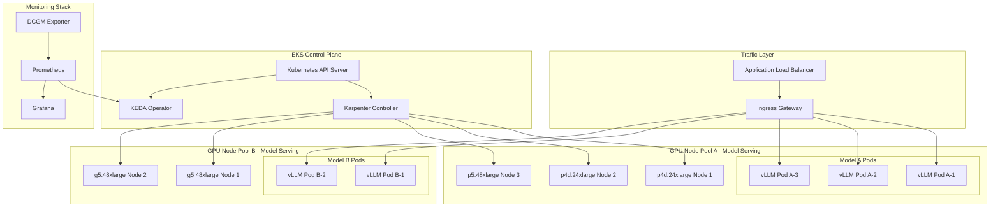
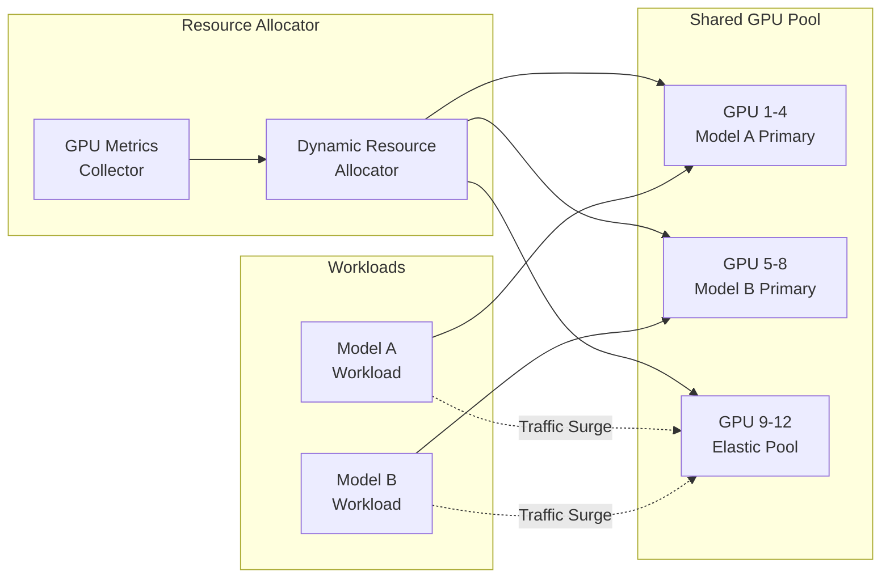
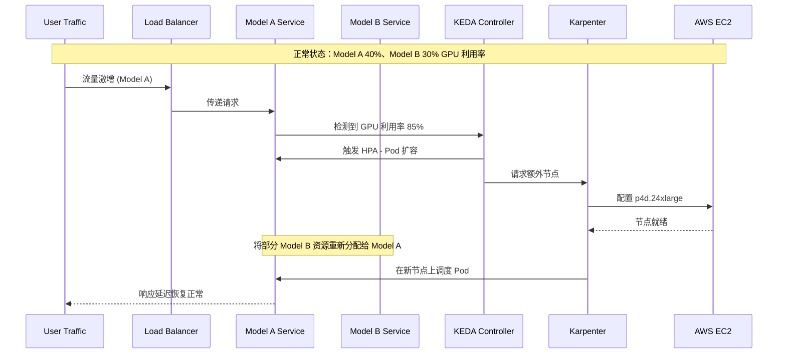
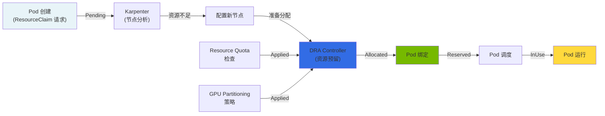
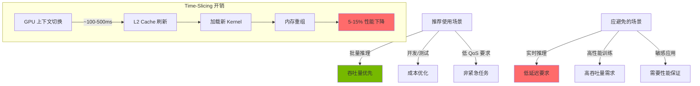

import { DraLimitationsTable, ScalingDecisionTable } from '@site/src/components/GpuResourceTables';

# 动态 GPU 集群资源管理

> 📅 **撰写日期**: 2025-02-05 | **修改日期**: 2026-02-14 | ⏱️ **阅读时间**: 约 8 分钟

## 概述

在大规模 GenAI 服务环境中，关键在于高效管理多个 GPU 集群，并根据流量变化动态重新分配资源。本文档涵盖在 Amazon EKS 环境中使用 Karpenter 进行 GPU 节点自动扩缩容、使用 DCGM（Data Center GPU Manager）进行指标采集，以及通过 KEDA 实现工作负载自动扩缩容策略。

### 核心目标

- **资源效率**：最大限度减少 GPU 资源的空闲时间
- **成本优化**：通过使用 Spot 实例和整合策略降低成本
- **自动化扩缩容**：根据流量模式自动调整资源
- **服务稳定性**：确保获取适当资源以满足 SLA

---

## 多 GPU 集群架构

### 完整架构图



### 资源共享架构

用于在多个模型之间高效共享 GPU 资源的架构。



:::info 资源共享原则

- **主要资源池**：为每个模型分配的基础 GPU 资源
- **弹性资源池**：在流量激增时动态分配的共享资源
- **基于优先级的分配**：通过基于优先级的资源分配保护关键工作负载

:::

---

## 动态资源分配策略

### 流量激增场景

生产环境中可能出现的流量激增场景及相应的应对策略。



### 模型间资源重新分配流程

当 Model A 经历流量激增时，将 Model B 的空闲资源重新分配给 Model A 的具体流程。

#### 步骤 1：指标采集与分析

```yaml
# DCGM Exporter 采集的核心指标
# - DCGM_FI_DEV_GPU_UTIL: GPU 利用率
# - DCGM_FI_DEV_MEM_COPY_UTIL: 内存拷贝利用率
# - DCGM_FI_DEV_FB_USED: 帧缓冲区已用内存
```

#### 步骤 2：扩缩容决策

<ScalingDecisionTable />

#### 步骤 3：执行资源重新分配

```bash
# 减少 Model B 副本数（释放空闲资源）
kubectl scale deployment model-b-serving --replicas=1 -n inference

# 增加 Model A 副本数
kubectl scale deployment model-a-serving --replicas=5 -n inference

# 或由 KEDA 自动处理
```

#### 步骤 4：节点级扩缩容

Karpenter 自动配置额外节点或清理空闲节点。

:::warning 注意事项

重新分配资源时，请通过设置 `minReplicas` 确保 Model B 的最低 SLA。完全回收资源可能导致服务中断。

:::

---

## 基于 Karpenter 的节点扩缩容

### NodePool 配置

用于 GPU 工作负载的 Karpenter NodePool 配置示例。

```yaml
apiVersion: karpenter.sh/v1
kind: NodePool
metadata:
  name: gpu-inference-pool
spec:
  template:
    metadata:
      labels:
        node-type: gpu-inference
        workload: genai
    spec:
      requirements:
        - key: kubernetes.io/arch
          operator: In
          values: ["amd64"]
        - key: karpenter.sh/capacity-type
          operator: In
          values: ["on-demand", "spot"]
        - key: node.kubernetes.io/instance-type
          operator: In
          values:
            - p4d.24xlarge    # 8x A100 40GB
            - p5.48xlarge     # 8x H100 80GB
            - g5.48xlarge     # 8x A10G 24GB
        - key: karpenter.k8s.aws/instance-gpu-count
          operator: Gt
          values: ["0"]
      nodeClassRef:
        group: karpenter.k8s.aws
        kind: EC2NodeClass
        name: gpu-nodeclass
      taints:
        - key: nvidia.com/gpu
          value: "true"
          effect: NoSchedule
  limits:
    cpu: 1000
    memory: 4000Gi
    nvidia.com/gpu: 64
  disruption:
    consolidationPolicy: WhenEmptyOrUnderutilized
    consolidateAfter: 30s
  weight: 100
```

### EC2NodeClass 配置

用于 GPU 实例的 EC2NodeClass 配置。

```yaml
apiVersion: karpenter.k8s.aws/v1
kind: EC2NodeClass
metadata:
  name: gpu-nodeclass
spec:
  role: KarpenterNodeRole-${CLUSTER_NAME}
  amiSelectorTerms:
    - alias: al2023@latest
  subnetSelectorTerms:
    - tags:
        karpenter.sh/discovery: ${CLUSTER_NAME}
  securityGroupSelectorTerms:
    - tags:
        karpenter.sh/discovery: ${CLUSTER_NAME}
  blockDeviceMappings:
    - deviceName: /dev/xvda
      ebs:
        volumeSize: 500Gi
        volumeType: gp3
        iops: 10000
        throughput: 500
        encrypted: true
        deleteOnTermination: true
  instanceStorePolicy: RAID0
  userData: |
    #!/bin/bash
    # NVIDIA 驱动和 Container Toolkit 设置
    nvidia-smi

    # 设置 GPU 内存模式（Persistence Mode）
    nvidia-smi -pm 1

    # 加载 EFA 驱动（用于 p4d、p5 实例）
    modprobe efa
  tags:
    Environment: production
    Workload: genai-inference
```

### GPU 实例类型对比

| 实例类型 | GPU | GPU 内存 | vCPU | 内存 | 网络 | 使用场景 |
|--------------|-----|-----------|------|--------|---------|------|
| p4d.24xlarge | 8x A100 | 40GB x 8 | 96 | 1152 GiB | 400 Gbps EFA | 大型 LLM 推理 |
| p5.48xlarge | 8x H100 | 80GB x 8 | 192 | 2048 GiB | 3200 Gbps EFA | 超大模型、训练 |
| g5.48xlarge | 8x A10G | 24GB x 8 | 192 | 768 GiB | 100 Gbps | 中小型模型推理 |

:::tip 实例选择指南

- **p5.48xlarge**：70B+ 参数模型，需要最高性能
- **p4d.24xlarge**：13B-70B 参数模型，成本与性能的平衡
- **g5.48xlarge**：7B 及以下模型，高性价比推理

:::

---

## 基于 GPU 指标的自动扩缩容

### DCGM Exporter 设置

通过 NVIDIA DCGM Exporter 将 GPU 指标采集到 Prometheus。

```yaml
apiVersion: apps/v1
kind: DaemonSet
metadata:
  name: dcgm-exporter
  namespace: gpu-monitoring
  labels:
    app: dcgm-exporter
spec:
  selector:
    matchLabels:
      app: dcgm-exporter
  template:
    metadata:
      labels:
        app: dcgm-exporter
    spec:
      nodeSelector:
        nvidia.com/gpu.present: "true"
      tolerations:
        - key: nvidia.com/gpu
          operator: Exists
          effect: NoSchedule
      containers:
        - name: dcgm-exporter
          image: nvcr.io/nvidia/k8s/dcgm-exporter:3.3.5-3.4.0-ubuntu22.04
          ports:
            - name: metrics
              containerPort: 9400
          env:
            - name: DCGM_EXPORTER_LISTEN
              value: ":9400"
            - name: DCGM_EXPORTER_KUBERNETES
              value: "true"
            - name: DCGM_EXPORTER_COLLECTORS
              value: "/etc/dcgm-exporter/dcp-metrics-included.csv"
          volumeMounts:
            - name: pod-resources
              mountPath: /var/lib/kubelet/pod-resources
              readOnly: true
          securityContext:
            runAsNonRoot: false
            runAsUser: 0
            capabilities:
              add: ["SYS_ADMIN"]
      volumes:
        - name: pod-resources
          hostPath:
            path: /var/lib/kubelet/pod-resources
```

### 核心 GPU 指标

DCGM Exporter 采集的核心指标。

| 指标名称 | 描述 | 扩缩容用途 |
|------------|------|--------------|
| `DCGM_FI_DEV_GPU_UTIL` | GPU 核心利用率 (%) | HPA 触发阈值 |
| `DCGM_FI_DEV_MEM_COPY_UTIL` | 内存带宽利用率 (%) | 内存瓶颈检测 |
| `DCGM_FI_DEV_FB_USED` | 帧缓冲区已用内存 (MB) | 防止 OOM |
| `DCGM_FI_DEV_FB_FREE` | 帧缓冲区可用内存 (MB) | 容量规划 |
| `DCGM_FI_DEV_POWER_USAGE` | 功耗 (W) | 成本监控 |
| `DCGM_FI_DEV_SM_CLOCK` | SM 时钟频率 (MHz) | 性能监控 |
| `DCGM_FI_DEV_GPU_TEMP` | GPU 温度 (°C) | 散热管理 |

### Prometheus ServiceMonitor 设置

```yaml
apiVersion: monitoring.coreos.com/v1
kind: ServiceMonitor
metadata:
  name: dcgm-exporter
  namespace: gpu-monitoring
spec:
  selector:
    matchLabels:
      app: dcgm-exporter
  endpoints:
    - port: metrics
      interval: 15s
      path: /metrics
  namespaceSelector:
    matchNames:
      - gpu-monitoring
```

### KEDA ScaledObject 设置

使用 KEDA 配置基于 GPU 指标的自动扩缩容。

```yaml
apiVersion: keda.sh/v1alpha1
kind: ScaledObject
metadata:
  name: model-a-gpu-scaler
  namespace: inference
spec:
  scaleTargetRef:
    apiVersion: apps/v1
    kind: Deployment
    name: model-a-serving
  pollingInterval: 15
  cooldownPeriod: 60
  minReplicaCount: 2
  maxReplicaCount: 10
  fallback:
    failureThreshold: 3
    replicas: 3
  advanced:
    horizontalPodAutoscalerConfig:
      behavior:
        scaleDown:
          stabilizationWindowSeconds: 300
          policies:
            - type: Percent
              value: 25
              periodSeconds: 60
        scaleUp:
          stabilizationWindowSeconds: 0
          policies:
            - type: Percent
              value: 100
              periodSeconds: 15
            - type: Pods
              value: 4
              periodSeconds: 15
          selectPolicy: Max
  triggers:
    - type: prometheus
      metadata:
        serverAddress: http://prometheus-server.monitoring:9090
        metricName: gpu_utilization
        query: |
          avg(DCGM_FI_DEV_GPU_UTIL{pod=~"model-a-.*"})
        threshold: "70"
        activationThreshold: "50"
```

### 自动扩缩容阈值配置

基于工作负载特征的推荐阈值。

| 工作负载类型 | 扩容阈值 | 缩容阈值 | 冷却时间 |
|--------------|----------------|------------------|----------|
| 实时推理 | GPU 70% | GPU 30% | 60 秒 |
| 批处理 | GPU 85% | GPU 40% | 300 秒 |
| 交互式服务 | GPU 60% | GPU 25% | 30 秒 |

:::tip 阈值调优指南

1. **初始设置**：从保守值开始（扩容 80%，缩容 20%）
2. **监控**：观察 2-3 天的实际流量模式
3. **调整**：综合考虑响应时间 SLA 和成本逐步调整
4. **验证**：通过压力测试验证设置

:::

### HPA 与 KEDA 集成

同时使用基础 HPA 和 KEDA 的配置。

```yaml
apiVersion: autoscaling/v2
kind: HorizontalPodAutoscaler
metadata:
  name: model-a-hpa
  namespace: inference
spec:
  scaleTargetRef:
    apiVersion: apps/v1
    kind: Deployment
    name: model-a-serving
  minReplicas: 2
  maxReplicas: 10
  metrics:
    - type: External
      external:
        metric:
          name: gpu_utilization
          selector:
            matchLabels:
              scaledobject.keda.sh/name: model-a-gpu-scaler
        target:
          type: AverageValue
          averageValue: "70"
```

---

## 成本优化策略

### Spot 实例使用

使用 GPU Spot 实例可以降低高达 90% 的成本。

```yaml
apiVersion: karpenter.sh/v1
kind: NodePool
metadata:
  name: gpu-spot-pool
spec:
  template:
    spec:
      requirements:
        - key: karpenter.sh/capacity-type
          operator: In
          values: ["spot"]
        - key: node.kubernetes.io/instance-type
          operator: In
          values:
            - g5.12xlarge
            - g5.24xlarge
            - g5.48xlarge
      nodeClassRef:
        group: karpenter.k8s.aws
        kind: EC2NodeClass
        name: gpu-spot-nodeclass
      taints:
        - key: nvidia.com/gpu
          value: "true"
          effect: NoSchedule
        - key: karpenter.sh/capacity-type
          value: "spot"
          effect: NoSchedule
  limits:
    nvidia.com/gpu: 32
  disruption:
    consolidationPolicy: WhenEmpty
    consolidateAfter: 30s
  weight: 50
```

:::warning Spot 实例注意事项

- **中断处理**：Spot 实例在中断前会收到 2 分钟的通知。请实现适当的优雅关闭机制
- **工作负载适用性**：最适合无状态推理工作负载
- **可用性**：特定实例类型的 Spot 可用性可能有限；建议指定多种类型

:::

### Spot 实例中断处理

```yaml
apiVersion: apps/v1
kind: Deployment
metadata:
  name: model-serving-spot
  namespace: inference
spec:
  template:
    spec:
      terminationGracePeriodSeconds: 120
      containers:
        - name: vllm
          lifecycle:
            preStop:
              exec:
                command:
                  - /bin/sh
                  - -c
                  - |
                    # 停止接受新请求
                    curl -X POST localhost:8000/drain
                    # 等待进行中的请求完成
                    sleep 90
      tolerations:
        - key: karpenter.sh/capacity-type
          operator: Equal
          value: "spot"
          effect: NoSchedule
```

### 整合策略

自动清理空闲节点以优化成本。

```yaml
apiVersion: karpenter.sh/v1
kind: NodePool
metadata:
  name: gpu-inference-pool
spec:
  disruption:
    # 当节点为空或利用率不足时进行整合
    consolidationPolicy: WhenEmptyOrUnderutilized
    # 整合等待时间
    consolidateAfter: 30s
    # 预算设置 - 限制同时可被中断的节点数量
    budgets:
      - nodes: "20%"
      - nodes: "0"
        schedule: "0 9 * * 1-5"  # 工作时间内防止中断
        duration: 8h
```

### 成本优化清单

| 项目 | 描述 | 预期节省 |
|------|------|----------|
| Spot 实例使用 | 用于非生产环境和容错工作负载 | 60-90% |
| 启用整合 | 自动清理空闲节点 | 20-30% |
| 合理选型 | 选择匹配工作负载的实例 | 15-25% |
| 基于调度的扩缩容 | 非工作时间减少资源 | 30-40% |

:::tip 成本监控

使用 Kubecost 或 AWS Cost Explorer 跟踪 GPU 工作负载成本，并定期审查优化机会。

:::

---

## 运维最佳实践

### GPU 资源请求配置

```yaml
apiVersion: apps/v1
kind: Deployment
metadata:
  name: model-a-serving
  namespace: inference
spec:
  template:
    spec:
      containers:
        - name: vllm
          resources:
            requests:
              nvidia.com/gpu: 1
              memory: "32Gi"
              cpu: "8"
            limits:
              nvidia.com/gpu: 1
              memory: "64Gi"
              cpu: "16"
```

### 监控仪表板配置

Grafana 仪表板中需要监控的关键面板：

1. **GPU 利用率趋势**：GPU 利用率随时间的变化
2. **内存使用情况**：GPU 内存使用量和可用空间
3. **Pod 扩缩容事件**：HPA/KEDA 扩缩容历史
4. **节点配置**：Karpenter 节点创建/删除事件
5. **成本跟踪**：每小时/每天的 GPU 成本

### 告警配置

```yaml
apiVersion: monitoring.coreos.com/v1
kind: PrometheusRule
metadata:
  name: gpu-alerts
  namespace: monitoring
spec:
  groups:
    - name: gpu-alerts
      rules:
        - alert: HighGPUUtilization
          expr: avg(DCGM_FI_DEV_GPU_UTIL) > 90
          for: 5m
          labels:
            severity: warning
          annotations:
            summary: "GPU 利用率超过 90%"

        - alert: GPUMemoryPressure
          expr: (DCGM_FI_DEV_FB_USED / DCGM_FI_DEV_FB_FREE) > 0.9
          for: 2m
          labels:
            severity: critical
          annotations:
            summary: "GPU 内存不足风险"
```

---

## 总结

GPU 集群的动态资源管理是决定 GenAI 服务性能和成本效率的关键因素。

### 核心要点

1. **利用 Karpenter**：通过自动配置和清理 GPU 节点最大化资源效率
2. **DCGM 指标**：通过精确的 GPU 利用率监控做出数据驱动的扩缩容决策
3. **KEDA 集成**：基于 GPU 指标实现工作负载自动扩缩容
4. **Spot 实例**：通过对合适的工作负载使用 Spot 降低成本
5. **整合**：通过自动清理空闲资源优化成本

### 后续步骤

- [Agentic AI 平台架构](./agentic-platform-architecture.md) - 完整平台配置
- [Agentic AI 基础设施](./agentic-ai-challenges.md) - AI Agent 运维策略

---

---

## 深入探讨：动态资源分配（DRA）

### DRA 的背景与必要性

在 Kubernetes 早期阶段，GPU 资源分配使用的是 **Device Plugin** 模型。该模型存在根本性的局限：

<DraLimitationsTable />

**DRA（Dynamic Resource Allocation）** 在 Kubernetes 1.26+ 中引入，以克服这些局限。

### DRA 的核心概念

DRA 是一种新范式，将**声明式资源请求与即时分配**分离：



### ResourceClaim 生命周期

DRA 的核心是 **ResourceClaim**，一种新的 Kubernetes 资源：

```yaml
# 1. 生命周期状态描述

# PENDING 状态：等待资源分配
apiVersion: resource.k8s.io/v1alpha2
kind: ResourceClaim
metadata:
  name: gpu-claim-vllm
  namespace: ai-inference
spec:
  resourceClassName: gpu.nvidia.com
  parametersRef:
    apiGroup: gpu.nvidia.com
    kind: GpuClaimParameters
    name: h100-params
status:
  phase: Pending  # 尚未分配

---

# ALLOCATED 状态：DRA 控制器完成资源预留
status:
  phase: Allocated
  allocation:
    resourceHandle: "gpu-handle-12345"
    shareable: false

---

# RESERVED 状态：准备好进行 Pod 绑定
status:
  phase: Reserved
  allocation:
    resourceHandle: "gpu-handle-12345"
    nodeName: "gpu-node-01"

---

# INUSE 状态：Pod 正在运行
status:
  phase: InUse
  allocation:
    resourceHandle: "gpu-handle-12345"
    nodeName: "gpu-node-01"
  reservedFor:
    - kind: Pod
      name: vllm-inference
      namespace: ai-inference
      uid: "abc123"
```

从一个状态转换到下一个状态需要满足特定条件：

- **Pending → Allocated**：DRA 驱动确认并预留可用资源
- **Allocated → Reserved**：Pod 指定 ResourceClaim，调度器确定节点
- **Reserved → InUse**：Pod 实际在节点上开始运行

### 详细对比：DRA vs Device Plugin

| 方面 | Device Plugin | DRA |
| --- | --- | --- |
| **资源分配时机** | 节点启动时（静态） | Pod 调度时（动态） |
| **分配单位** | 仅整个 GPU | GPU 可分割（MIG、time-slicing） |
| **优先级支持** | 无（先到先得） | 支持 ResourceClaim 优先级 |
| **多资源协调** | 不可能 | 在 Pod 级别协调多个资源 |
| **性能约束策略** | 无 | 可通过 ResourceClass 定义性能策略 |
| **分配弹性** | 节点故障时需手动清理 | 自动恢复机制 |
| **Kubernetes 版本** | 1.8+ | 1.26+（Alpha）、1.29+（Beta） |
| **成熟度** | 生产就绪 | 建议逐步采用 |

:::tip DRA 选择指南
**何时使用 DRA：**

- 需要 GPU 分区（MIG、time-slicing）
- 多租户环境中需要公平的资源分配
- 需要应用资源优先级
- 动态扩缩容至关重要

**Device Plugin 足够的场景：**

- 简单地以整个 GPU 为单位分配
- 与遗留系统的兼容性很重要
- Kubernetes 版本为 1.25 或以下
:::

### 高级 GPU 分区策略

#### 1. 基于 MIG（Multi-Instance GPU）的分区

MIG 可以将 H100 和 A100 等现代 GPU 最多分割为 7 个独立 GPU：

```yaml
# MIG Profile 定义
apiVersion: gpu.nvidia.com/v1alpha1
kind: GpuClaimParameters
metadata:
  name: a100-mig-1g.5gb
  namespace: ai-inference
spec:
  # MIG Profile 选择：1g.5gb、2g.10gb、3g.20gb、7g.40gb
  mig:
    profile: "1g.5gb"  # 5GB 内存的 MIG 实例
    count: 1

---

# 基于 MIG 的 ResourceClass
apiVersion: resource.k8s.io/v1alpha2
kind: ResourceClass
metadata:
  name: gpu.nvidia.com/mig
driverName: nvidia.com/gpu
structuredParameters: true
parametersSchema:
  openAPIV3Schema:
    type: object
    properties:
      gpuProfile:
        type: string
        enum: ["1g.5gb", "2g.10gb", "3g.20gb", "7g.40gb"]
        default: "1g.5gb"

---

# MIG ResourceClaim 使用示例
apiVersion: resource.k8s.io/v1alpha2
kind: ResourceClaim
metadata:
  name: inference-gpu-mig
  namespace: ai-inference
spec:
  resourceClassName: gpu.nvidia.com/mig
  parametersRef:
    apiGroup: gpu.nvidia.com
    kind: GpuClaimParameters
    name: a100-mig-1g.5gb

---

# 在 Pod 中使用 MIG ResourceClaim
apiVersion: v1
kind: Pod
metadata:
  name: vllm-mig-inference
  namespace: ai-inference
spec:
  containers:
    - name: vllm
      image: vllm/vllm-openai:latest
      command: ["python", "-m", "vllm.entrypoints.openai.api_server"]
      args:
        - "--model"
        - "meta-llama/Llama-2-7b-hf"
        - "--gpu-memory-utilization"
        - "0.9"
      resources:
        requests:
          memory: "4Gi"
          cpu: "4"
        claims:
          - name: mig-gpu
  resourceClaims:
    - name: mig-gpu
      source:
        resourceClaimTemplateName: mig-template
```

**MIG Profile 性能指标：**

| Profile | 内存 | SM 数量 | 使用场景 | 预期吞吐量 |
| --- | --- | --- | --- | --- |
| 1g.5gb | 5GB | 14 | 小型模型（3B-7B） | ~20 tok/s |
| 2g.10gb | 10GB | 28 | 中型模型（7B-13B） | ~50 tok/s |
| 3g.20gb | 20GB | 42 | 大型模型（13B-70B） | ~100 tok/s |
| 7g.40gb | 40GB | 84 | 超大型模型（70B+） | ~200 tok/s |

#### 2. 基于 Time-Slicing 的分区

Time-Slicing 通过分割 GPU 时间来允许多个 Pod 共享同一个 GPU：

```yaml
# Time-Slicing ResourceSlice 定义
apiVersion: gpu.nvidia.com/v1alpha1
kind: ResourceSlice
metadata:
  name: gpu-node-timeslice
  namespace: ai-inference
spec:
  nodeName: gpu-node-01
  devices:
    - id: 0  # GPU 0
      vendor: nvidia
      model: "A100-SXM4-80GB"
      # Time-slicing 配置：最多 4 个 Pod 可共享同一 GPU
      timeSlicing:
        replicas: 4
        # GPU 调度策略："aggressive"、"default"、"conservative"
        schedulingPolicy: "default"
        # 上下文切换开销 (ms)
        contextSwitchInterval: 100

---

# Time-Slicing ResourceClass
apiVersion: resource.k8s.io/v1alpha2
kind: ResourceClass
metadata:
  name: gpu.nvidia.com/timeslice
driverName: nvidia.com/gpu
structuredParameters: true

---

# Time-Slicing ResourceClaim 使用
apiVersion: resource.k8s.io/v1alpha2
kind: ResourceClaim
metadata:
  name: inference-gpu-slice
  namespace: ai-inference
spec:
  resourceClassName: gpu.nvidia.com/timeslice

---

# 多个 Pod 通过 time-slice 共享同一 GPU
apiVersion: apps/v1
kind: Deployment
metadata:
  name: vllm-timeslice-replicas
  namespace: ai-inference
spec:
  replicas: 3  # 3 个 Pod 共享同一 GPU
  selector:
    matchLabels:
      app: vllm-slice
  template:
    metadata:
      labels:
        app: vllm-slice
    spec:
      containers:
        - name: vllm
          image: vllm/vllm-openai:latest
          resources:
            requests:
              memory: "8Gi"
              cpu: "2"
            claims:
              - name: gpu-slice
      resourceClaims:
        - name: gpu-slice
          source:
            resourceClaimTemplateName: timeslice-template
```

**Time-Slicing 性能考量：**



---

## 参考资料

- [Karpenter 官方文档](https://karpenter.sh/)
- [NVIDIA DCGM Exporter](https://github.com/NVIDIA/dcgm-exporter)
- [KEDA 官方文档](https://keda.sh/)
- [AWS GPU 实例指南](https://aws.amazon.com/ec2/instance-types/#Accelerated_Computing)
- [Kubernetes 动态资源分配（DRA）](https://kubernetes.io/docs/concepts/scheduling-eviction/dynamic-resource-allocation/)
- [NVIDIA GPU Operator 文档](https://docs.nvidia.com/datacenter/cloud-native/gpu-operator/overview.html)
