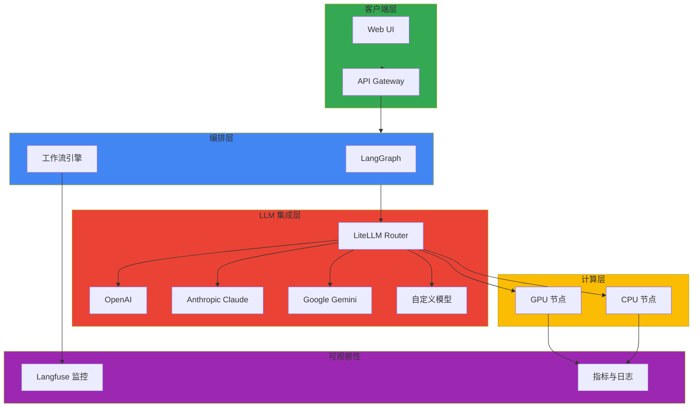

# Agentic AI Platform

> 📅 **撰写日期**: 2025-02-05 | **修改日期**: 2026-02-13 | ⏱️ **阅读时间**: 约 3 分钟

现代生成式 AI 平台需要的不仅仅是简单的模型服务，还需要一个综合技术栈来满足复杂的代理系统、动态资源管理和成本效益运营的需求。基于 Amazon EKS 的 Agentic AI 平台是一种现代化方法，利用 Kubernetes 强大的编排能力来满足这些需求。该平台通过统一系统提供 GPU 资源的动态分配和扩展、多个 LLM 提供商之间的智能路由，以及通过实时监控进行成本优化。

Kubernetes 原生方法的核心理念是积极利用开源生态系统，同时确保企业级稳定性。通过 LiteLLM 和 vLLM 的模型服务、基于 LangGraph 的复杂代理工作流、使用 Milvus 的向量数据库集成，以及通过 Langfuse 的全流程监控，在 Kubernetes 集群上和谐运作。特别是，通过结合 Karpenter 的节点自动扩展和 NVIDIA GPU Operator，可以根据工作负载模式动态配置和释放 GPU 资源，从而大幅降低云成本。

作为生产环境构建的实践起点，AWS 提供了两个核心示例存储库。GenAI on EKS Starter Kit (aws-samples/sample-genai-on-eks-starter-kit) 提供了 LiteLLM、vLLM、SGLang、Langfuse、Milvus、Open WebUI、n8n、Strands Agents、Agno 等必要组件的集成配置，支持快速原型设计和开发。另一方面，Scalable Model Inference and Agentic AI (aws-solutions-library-samples/guidance-for-scalable-model-inference-and-agentic-ai-on-amazon-eks) 展示了包括 Karpenter 自动扩展、基于 llm-d 的分布式推理、LiteLLM 网关、基于 OpenSearch 的 RAG 系统，以及构建多代理系统所需的生产级架构模式。

这种技术栈组合有效解决了处理 Frontier Model 流量时面临的四个核心挑战。GPU 调度和资源隔离通过 MIG 和 Time-Slicing 在多租户环境中确保稳定性能，动态路由层执行考虑模型可用性和成本的智能请求分配。代理生命周期管理通过 Kagent CRD 声明式定义，整个系统的可观察性通过 Langfuse 和基于 Prometheus 的指标确保。所有这些与 Kubernetes 的自愈能力相结合，完成了一个可以 24/7 无中断运营的平台。

## 主要文档（实施顺序）

:::tip 文档完整性
本节的所有 16 个文档已完成编写，提供了顺序学习路径。每个文档都基于前一个文档的概念构建，因此建议按顺序学习。
:::

### 理解与设计

- [1. 技术挑战](./agentic-ai-challenges.md) - 理解 Agentic AI 平台的核心挑战
- [2. 基于 EKS 的解决方案](./agentic-ai-solutions-eks.md) - Kubernetes 基础解决方案方法
- [3. 平台架构](./agentic-platform-architecture.md) - 整体架构设计

### GPU 基础设施配置

- [4. GPU 资源管理](./gpu-resource-management.md) - MIG、Time-Slicing 等 GPU 资源设置

### 模型服务（基础 → 高级）

- [5. vLLM 模型服务](./vllm-model-serving.md) - 基础模型服务配置
- [6. MoE 模型服务](./moe-model-serving.md) - Mixture of Experts 模型服务
- [7. llm-d EKS Auto Mode](./llm-d-eks-automode.md) - Kubernetes 原生分布式推理
- [8. NeMo 框架](./nemo-framework.md) - 训练和服务框架

### 推理路由和网关

- [9. Inference Gateway](./inference-gateway-routing.md) - 智能请求路由

### RAG 数据层

- [10. Milvus 向量 DB](./milvus-vector-database.md) - 向量存储构建

### AI 代理部署

- [11. Kagent 代理管理](./kagent-kubernetes-agents.md) - 基于 CRD 的代理管理

### 运营和监控

- [12. 代理监控与运营](./agent-monitoring.md) - 代理状态和性能监控

### 评估与验证

- [13. Ragas 评估](./ragas-evaluation.md) - RAG 管道质量评估

### Bedrock AgentCore 集成

- [14. Bedrock AgentCore & MCP](./bedrock-agentcore-mcp.md) - AWS Bedrock 代理集成

### MLOps 管道

- [15. MLOps 管道](./mlops-pipeline-eks.md) - Kubeflow + MLflow + KServe 端到端 ML 生命周期
- [16. SageMaker-EKS 集成](./sagemaker-eks-integration.md) - SageMaker 训练 + EKS 服务混合配置

## 🎯 学习目标

通过本节，您可以学习：

- 理解构建 Agentic AI 平台时的 4 个核心技术挑战
- 如何在 EKS 上构建可扩展的 GenAI 平台
- 集成多个 LLM 提供商（OpenAI、Anthropic、Google 等）
- 设计和实现复杂的 AI 工作流
- GPU 资源的高效利用和优化策略
- AI/ML 工作负载的自动扩展和资源管理
- 在生产环境中部署和运营 AI 模型
- 利用 Kagent、Kgateway、Milvus、Ragas、NeMo 等开源工具
- 成本跟踪和优化
- 性能监控和分析

## 🏗️ 架构模式

## 🔧 主要技术和工具

| 技术 | 版本 | 描述 | 用途 |
| --- | --- | --- | --- |
| **Kagent** | v0.3+ | Kubernetes 代理管理 | 基于 CRD 的代理生命周期 |
| **Kgateway** | v1.2+ | Inference Gateway | 动态路由和负载均衡 |
| **Milvus** | v2.4+ | 向量数据库 | RAG 管道支持 |
| **Ragas** | v0.1+ | RAG 评估框架 | 质量测量和 CI/CD 集成 |
| **NeMo** | v25.02 | LLM 训练框架 | 微调和优化 |
| **LiteLLM** | v1.50+ | 多 LLM 提供商集成 | LLM 路由和故障转移 |
| **LangGraph** | v0.2+ | AI 工作流编排 | 复杂 AI 工作流实现 |
| **Langfuse** | v2.70+ | GenAI 应用监控 | 跟踪、监控、分析 |
| **NVIDIA GPU Operator** | v24.9+ | GPU 资源管理 | GPU 驱动和运行时 |
| **Karpenter** | v1.0+ (GA) | 节点自动扩展 | 成本效益资源管理 |
| **vLLM** | v0.6+ | 高性能 LLM 服务 | 基于 PagedAttention 的推理 |
| **llm-d** | v0.2+ | 分布式推理调度器 | Prefix Caching 感知路由 |

## 💡 核心概念

### LiteLLM 路由

- **提供商抽象**: 使用统一接口访问各种 LLM API
- **故障转移机制**: 当一个提供商失败时自动切换到另一个提供商
- **负载均衡**: 将请求分散到多个模型
- **成本优化**: 自动选择性价比高的模型

### LangGraph 工作流

- **状态管理**: 清晰管理每个步骤的状态
- **条件分支**: 基于结果的动态流程控制
- **并行处理**: 同时执行独立任务
- **错误处理**: 稳定的异常处理机制

### Langfuse 监控

- **请求跟踪**: 记录每个 API 调用的完整过程
- **成本分析**: 按模型、项目跟踪成本
- **性能分析**: 分析响应时间、准确度等指标
- **用户反馈**: 收集生成结果的反馈

### GPU 资源优化

#### MIG (Multi-Instance GPU)

- **单个 GPU 分割**: 将一个 GPU 分割成多个实例
- **资源隔离**: 提供完全的计算隔离
- **效率**: 在多租户环境中稳定

#### Time-Slicing

- **时间共享**: GPU 时间被多个任务共享
- **灵活性**: 适合开发/测试环境
- **成本**: 比 MIG 便宜但性能共享

## 📊 性能和成本优化

### 模型选择标准

| 模型 | 性能 | 成本 | 用途 |
|------|------|------|------|
| GPT-4o | 最高 | 中等 | 复杂任务、平衡选择 |
| GPT-4o mini | 中等 | 低 | 需要快速响应时 |
| Claude 3.5 Sonnet | 非常高 | 中等 | 编码、分析任务 |
| Claude 3 Opus | 非常高 | 非常高 | 需要高精度时 |
| Open Source (Llama 3) | 多样 | 低 | 需要完全控制时 |

### 成本优化策略

- **提示缓存**: 缓存重复的提示
- **批处理**: 批处理非业务关键任务
- **模型分层**: 根据复杂度使用不同模型
- **上下文最小化**: 删除不必要的令牌

## 🔗 相关类别

- [Operations & Observability](/docs/operations-observability) - AI/ML 工作负载监控
- [Infrastructure Optimization](/docs/infrastructure-optimization) - GPU 性能优化
- [Hybrid Infrastructure](/docs/hybrid-infrastructure) - 混合环境中的 AI 部署

---

:::tip 提示
GenAI 工作负载使用大量 GPU 资源，因此请积极使用 Spot 实例和自动扩展来优化成本。另外，通过 Langfuse 跟踪成本并持续监控。
:::

:::info 推荐学习路径

**Agentic AI 平台构建路径：**

1. [1. 技术挑战](./agentic-ai-challenges.md) - 理解核心挑战
2. [2. 基于 EKS 的解决方案](./agentic-ai-solutions-eks.md) - Kubernetes 解决方案
3. [3. 平台架构](./agentic-platform-architecture.md) - 架构设计
4. [4. GPU 资源管理](./gpu-resource-management.md) - GPU 基础设施设置
5. [9. Inference Gateway](./inference-gateway-routing.md) - 动态路由配置
6. [12. 代理监控与运营](./agent-monitoring.md) - 运营体系构建

**GenAI 应用开发路径：**

1. [5. vLLM 模型服务](./vllm-model-serving.md) - 基础模型服务
2. [9. Inference Gateway](./inference-gateway-routing.md) - LiteLLM 路由
3. [10. Milvus 向量 DB](./milvus-vector-database.md) - RAG 数据层
4. [11. Kagent 代理管理](./kagent-kubernetes-agents.md) - 代理部署
5. [13. Ragas 评估](./ragas-evaluation.md) - 质量评估
:::

:::warning 注意 - 成本管理
生成式 AI 服务的 API 调用成本可能会快速累积。初期请设置请求速率限制，并通过 Langfuse 持续监控成本。
:::