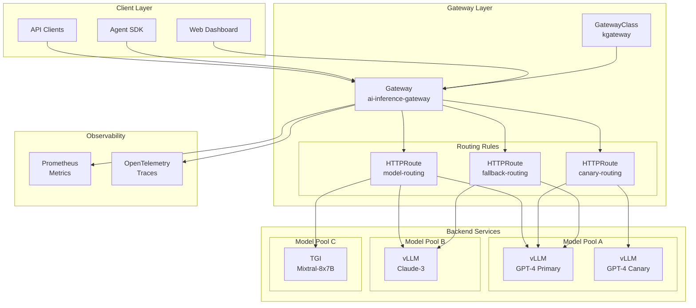
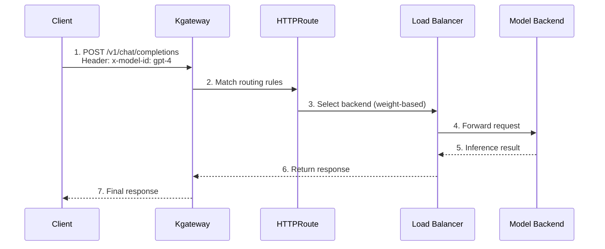

# 推理网关与动态路由

> 📅 **撰写日期**: 2025-02-05 | **修改日期**: 2026-02-14 | ⏱️ **阅读时间**: 约 4 分钟

在大规模 AI 模型服务环境中，高效地路由和管理各种模型的推理请求至关重要。本文涵盖如何使用 Kubernetes Gateway API 和 Kgateway 为 AI 模型推理请求配置动态路由、负载均衡和故障响应策略。

## 概述

### 核心目标

- **智能路由**：根据请求特征选择最优模型后端
- **流量分配**：通过基于权重的负载均衡提供稳定服务
- **渐进式部署**：通过金丝雀发布和 A/B 测试实现安全的模型更新
- **高可用性**：通过降级和重试策略确保服务连续性

---

## 推理网关架构

### 完整架构图



### 组件结构

import { ComponentStructureTable } from '@site/src/components/InferenceGatewayTables';

<ComponentStructureTable />

{/* Original table preserved for reference
| Component | Role | Description |
|---------|------|------|
| **GatewayClass** | Gateway implementation definition | Designate Kgateway controller |
| **Gateway** | Entry point definition | Configure listeners, TLS, addresses |
| **HTTPRoute** | Routing rules | Path, header-based routing |
| **Backend** | Model service | vLLM, TGI and other inference servers |
*/}

### 流量流程



:::info Gateway API 标准
Kgateway 实现了 Kubernetes Gateway API 标准，支持厂商无关的配置。这有助于迁移到其他网关实现。
:::

---

## Kgateway 安装与配置

### 前置条件

- Kubernetes 1.28 或更高版本
- Helm 3.x
- 已安装 Gateway API CRD

### 安装 Gateway API CRD

```bash
# 安装标准 Gateway API CRD
kubectl apply -f https://github.com/kubernetes-sigs/gateway-api/releases/download/v1.2.0/standard-install.yaml

# 安装实验性功能（HTTPRoute filters 等）
kubectl apply -f https://github.com/kubernetes-sigs/gateway-api/releases/download/v1.2.0/experimental-install.yaml
```

### 安装 Kgateway Helm Chart

```bash
# 添加 Helm 仓库
helm repo add kgateway https://kgateway-dev.github.io/kgateway/
helm repo update

# 创建命名空间
kubectl create namespace kgateway-system

# 安装 Kgateway
helm install kgateway kgateway/kgateway \
  --namespace kgateway-system \
  --set controller.replicaCount=2 \
  --set controller.resources.requests.cpu=500m \
  --set controller.resources.requests.memory=512Mi \
  --set controller.resources.limits.cpu=1000m \
  --set controller.resources.limits.memory=1Gi \
  --set metrics.enabled=true \
  --set metrics.serviceMonitor.enabled=true
```

### Helm Values 详细配置

```yaml
# values.yaml
controller:
  replicaCount: 2

  resources:
    requests:
      cpu: 500m
      memory: 512Mi
    limits:
      cpu: 1000m
      memory: 1Gi

  # 高可用配置
  affinity:
    podAntiAffinity:
      preferredDuringSchedulingIgnoredDuringExecution:
        - weight: 100
          podAffinityTerm:
            labelSelector:
              matchLabels:
                app: kgateway
            topologyKey: kubernetes.io/hostname

# 指标配置
metrics:
  enabled: true
  port: 9090
  serviceMonitor:
    enabled: true
    interval: 15s
    labels:
      release: prometheus

# 日志配置
logging:
  level: info
  format: json

# TLS 配置
tls:
  enabled: true
  certManager:
    enabled: true
    issuerRef:
      name: letsencrypt-prod
      kind: ClusterIssuer
```

---

## GatewayClass 与 Gateway 配置

### GatewayClass 定义

定义网关实现。

```yaml
apiVersion: gateway.networking.k8s.io/v1
kind: GatewayClass
metadata:
  name: kgateway
spec:
  controllerName: kgateway.dev/kgateway-controller
  description: "Kgateway for AI inference routing"
  parametersRef:
    group: kgateway.dev
    kind: GatewayClassConfig
    name: kgateway-config
---
apiVersion: kgateway.dev/v1alpha1
kind: GatewayClassConfig
metadata:
  name: kgateway-config
spec:
  # 代理配置
  proxy:
    replicas: 3
    resources:
      requests:
        cpu: "1"
        memory: "2Gi"
      limits:
        cpu: "2"
        memory: "4Gi"

  # 连接设置
  connectionSettings:
    maxConnections: 10000
    connectTimeout: 10s
    idleTimeout: 60s
```

### Gateway 资源定义

```yaml
apiVersion: gateway.networking.k8s.io/v1
kind: Gateway
metadata:
  name: ai-inference-gateway
  namespace: ai-gateway
  annotations:
    # AWS ALB 集成
    service.beta.kubernetes.io/aws-load-balancer-type: "external"
    service.beta.kubernetes.io/aws-load-balancer-nlb-target-type: "ip"
    service.beta.kubernetes.io/aws-load-balancer-scheme: "internet-facing"
spec:
  gatewayClassName: kgateway

  listeners:
    # HTTPS 监听器
    - name: https
      protocol: HTTPS
      port: 443
      hostname: "inference.example.com"
      tls:
        mode: Terminate
        certificateRefs:
          - name: inference-tls-cert
            kind: Secret
      allowedRoutes:
        namespaces:
          from: Selector
          selector:
            matchLabels:
              gateway-access: "true"

    # HTTP 监听器（用于 HTTPS 重定向）
    - name: http
      protocol: HTTP
      port: 80
      hostname: "inference.example.com"
      allowedRoutes:
        namespaces:
          from: Same

    # 内部 gRPC 监听器
    - name: grpc
      protocol: HTTPS
      port: 8443
      hostname: "inference-grpc.example.com"
      tls:
        mode: Terminate
        certificateRefs:
          - name: inference-grpc-tls-cert
      allowedRoutes:
        kinds:
          - kind: GRPCRoute
```

:::warning TLS 证书管理
在生产环境中，使用 cert-manager 自动管理 TLS 证书。手动证书管理存在因证书过期导致服务中断的风险。
:::

---

## 动态路由配置

### 基于 Header 的路由

根据 `x-model-id` Header 值路由到相应的模型后端。

```yaml
apiVersion: gateway.networking.k8s.io/v1
kind: HTTPRoute
metadata:
  name: model-header-routing
  namespace: ai-gateway
spec:
  parentRefs:
    - name: ai-inference-gateway
      namespace: ai-gateway
      sectionName: https

  hostnames:
    - "inference.example.com"

  rules:
    # GPT-4 模型路由
    - matches:
        - path:
            type: PathPrefix
            value: /v1/chat/completions
          headers:
            - name: x-model-id
              value: "gpt-4"
      backendRefs:
        - name: vllm-gpt4-service
          namespace: ai-inference
          port: 8000
          weight: 100

    # Claude-3 模型路由
    - matches:
        - path:
            type: PathPrefix
            value: /v1/chat/completions
          headers:
            - name: x-model-id
              value: "claude-3"
      backendRefs:
        - name: vllm-claude3-service
          namespace: ai-inference
          port: 8000
          weight: 100

    # Mixtral MoE 模型路由
    - matches:
        - path:
            type: PathPrefix
            value: /v1/chat/completions
          headers:
            - name: x-model-id
              value: "mixtral-8x7b"
      backendRefs:
        - name: tgi-mixtral-service
          namespace: ai-inference
          port: 8080
          weight: 100
```

### 基于路径的路由

根据 API 路径路由到不同的服务。

```yaml
apiVersion: gateway.networking.k8s.io/v1
kind: HTTPRoute
metadata:
  name: path-based-routing
  namespace: ai-gateway
spec:
  parentRefs:
    - name: ai-inference-gateway
      namespace: ai-gateway

  hostnames:
    - "inference.example.com"

  rules:
    # Chat Completions API
    - matches:
        - path:
            type: PathPrefix
            value: /v1/chat/completions
      backendRefs:
        - name: chat-completion-service
          port: 8000

    # Embeddings API
    - matches:
        - path:
            type: PathPrefix
            value: /v1/embeddings
      backendRefs:
        - name: embedding-service
          port: 8000

    # Completions API（旧版）
    - matches:
        - path:
            type: PathPrefix
            value: /v1/completions
      backendRefs:
        - name: completion-service
          port: 8000

    # 健康检查
    - matches:
        - path:
            type: Exact
            value: /health
      backendRefs:
        - name: health-check-service
          port: 8080
```

### 高级组合路由

组合多个条件的高级路由规则。

```yaml
apiVersion: gateway.networking.k8s.io/v1
kind: HTTPRoute
metadata:
  name: advanced-routing
  namespace: ai-gateway
spec:
  parentRefs:
    - name: ai-inference-gateway

  rules:
    # 高级客户 + GPT-4 请求 → 专用后端
    - matches:
        - path:
            type: PathPrefix
            value: /v1/chat/completions
          headers:
            - name: x-model-id
              value: "gpt-4"
            - name: x-customer-tier
              value: "premium"
      backendRefs:
        - name: vllm-gpt4-premium
          port: 8000

    # 标准客户 + GPT-4 请求 → 共享后端
    - matches:
        - path:
            type: PathPrefix
            value: /v1/chat/completions
          headers:
            - name: x-model-id
              value: "gpt-4"
            - name: x-customer-tier
              value: "standard"
      backendRefs:
        - name: vllm-gpt4-shared
          port: 8000
```

---

## 负载均衡策略

### 基于权重的流量分配

按权重在模型版本间分配流量。

```yaml
apiVersion: gateway.networking.k8s.io/v1
kind: HTTPRoute
metadata:
  name: weighted-routing
  namespace: ai-gateway
spec:
  parentRefs:
    - name: ai-inference-gateway

  rules:
    - matches:
        - path:
            type: PathPrefix
            value: /v1/chat/completions
          headers:
            - name: x-model-id
              value: "gpt-4"
      backendRefs:
        # 主后端：80% 流量
        - name: vllm-gpt4-v1
          port: 8000
          weight: 80
        # 副后端：20% 流量
        - name: vllm-gpt4-v2
          port: 8000
          weight: 20
```

### A/B 测试路由

仅向特定用户组暴露新模型版本。

```yaml
apiVersion: gateway.networking.k8s.io/v1
kind: HTTPRoute
metadata:
  name: ab-test-routing
  namespace: ai-gateway
spec:
  parentRefs:
    - name: ai-inference-gateway

  rules:
    # A/B 测试组 A（基线模型）
    - matches:
        - path:
            type: PathPrefix
            value: /v1/chat/completions
          headers:
            - name: x-ab-test-group
              value: "control"
      backendRefs:
        - name: vllm-model-baseline
          port: 8000

    # A/B 测试组 B（新模型）
    - matches:
        - path:
            type: PathPrefix
            value: /v1/chat/completions
          headers:
            - name: x-ab-test-group
              value: "experiment"
      backendRefs:
        - name: vllm-model-new
          port: 8000
```

### 金丝雀部署

逐步发布新模型版本。

```yaml
apiVersion: gateway.networking.k8s.io/v1
kind: HTTPRoute
metadata:
  name: canary-deployment
  namespace: ai-gateway
  annotations:
    # 追踪金丝雀部署阶段
    deployment.kubernetes.io/canary-weight: "10"
spec:
  parentRefs:
    - name: ai-inference-gateway

  rules:
    - matches:
        - path:
            type: PathPrefix
            value: /v1/chat/completions
          headers:
            - name: x-model-id
              value: "gpt-4"
      backendRefs:
        # 稳定版本：90%
        - name: vllm-gpt4-stable
          port: 8000
          weight: 90
        # 金丝雀版本：10%
        - name: vllm-gpt4-canary
          port: 8000
          weight: 10
```

:::tip 金丝雀部署策略

1. **初始阶段**：从 5-10% 流量开始
2. **监控**：检查错误率、延迟、质量指标
3. **逐步增加**：无问题则增加到 25% → 50% → 75% → 100%
4. **随时回滚**：出现问题时立即回滚到 0%

:::

### 金丝雀部署时间线示例

```mermaid
gantt
    title Canary Deployment Timeline
    dateFormat  HH:mm
    axisFormat %H:%M

    section Traffic Ratio
    Canary 10%     :a1, 00:00, 30m
    Canary 25%     :a2, after a1, 30m
    Canary 50%     :a3, after a2, 60m
    Canary 75%     :a4, after a3, 60m
    Canary 100%    :a5, after a4, 60m

    section Monitoring
    Check Metrics  :b1, 00:00, 300m
```



---

## 故障响应配置

### 降级配置

当主后端故障时自动切换到备用后端。

```yaml
apiVersion: gateway.networking.k8s.io/v1
kind: HTTPRoute
metadata:
  name: fallback-routing
  namespace: ai-gateway
spec:
  parentRefs:
    - name: ai-inference-gateway

  rules:
    - matches:
        - path:
            type: PathPrefix
            value: /v1/chat/completions
          headers:
            - name: x-model-id
              value: "gpt-4"
      backendRefs:
        # 主后端
        - name: vllm-gpt4-primary
          port: 8000
          weight: 100
      # 通过 BackendLBPolicy 配置降级
---
apiVersion: gateway.networking.k8s.io/v1alpha2
kind: BackendLBPolicy
metadata:
  name: gpt4-fallback-policy
  namespace: ai-gateway
spec:
  targetRefs:
    - group: ""
      kind: Service
      name: vllm-gpt4-primary
  sessionPersistence:
    sessionName: "model-session"
    type: Cookie
  # 指定降级后端
  default:
    backendRef:
      name: vllm-gpt4-fallback
      port: 8000
```

### 超时配置

为推理请求设置超时。

```yaml
apiVersion: gateway.networking.k8s.io/v1
kind: HTTPRoute
metadata:
  name: timeout-config
  namespace: ai-gateway
spec:
  parentRefs:
    - name: ai-inference-gateway

  rules:
    - matches:
        - path:
            type: PathPrefix
            value: /v1/chat/completions
      backendRefs:
        - name: vllm-service
          port: 8000
      timeouts:
        # 请求超时（总请求处理时间）
        request: 120s
        # 后端连接超时
        backendRequest: 60s
```

### 重试策略

为瞬时故障配置自动重试。

```yaml
apiVersion: gateway.networking.k8s.io/v1
kind: HTTPRoute
metadata:
  name: retry-policy
  namespace: ai-gateway
spec:
  parentRefs:
    - name: ai-inference-gateway

  rules:
    - matches:
        - path:
            type: PathPrefix
            value: /v1/chat/completions
      backendRefs:
        - name: vllm-service
          port: 8000
      # 重试配置（Kgateway 扩展）
      filters:
        - type: ExtensionRef
          extensionRef:
            group: kgateway.dev
            kind: RetryPolicy
            name: inference-retry-policy
---
apiVersion: kgateway.dev/v1alpha1
kind: RetryPolicy
metadata:
  name: inference-retry-policy
  namespace: ai-gateway
spec:
  # 最大重试次数
  numRetries: 3

  # 重试条件
  retryOn:
    - "5xx"
    - "reset"
    - "connect-failure"
    - "retriable-4xx"

  # 每次尝试超时
  perTryTimeout: 30s

  # 退避配置
  retryBackOff:
    baseInterval: 100ms
    maxInterval: 1s
```

### 熔断器配置

连续故障时临时阻断后端。

```yaml
apiVersion: kgateway.dev/v1alpha1
kind: CircuitBreakerPolicy
metadata:
  name: inference-circuit-breaker
  namespace: ai-gateway
spec:
  targetRefs:
    - group: ""
      kind: Service
      name: vllm-gpt4-service

  # 最大并发连接数
  maxConnections: 1000

  # 最大挂起请求数
  maxPendingRequests: 100

  # 最大并发请求数
  maxRequests: 1000

  # 连续失败阈值
  consecutiveErrors: 5

  # 阻断持续时间
  interval: 10s

  # 解除阻断后的测试请求
  maxEjectionPercent: 50
```

:::danger 故障响应配置注意事项

- **超时设置**：LLM 推理可能耗时较长，需设置充足的超时时间
- **重试限制**：无限重试可能导致系统过载
- **熔断器**：设置过于敏感可能阻断正常流量

:::

---

## 监控与可观测性

### Prometheus 指标

Kgateway 暴露的关键指标。

import { MonitoringMetricsTable } from '@site/src/components/InferenceGatewayTables';

<MonitoringMetricsTable />

{/* Original table preserved for reference
| Metric | Description | Usage |
|--------|------|------|
| `kgateway_requests_total` | Total request count | Traffic monitoring |
| `kgateway_request_duration_seconds` | Request processing time | Latency analysis |
| `kgateway_upstream_rq_xx` | Backend response codes | Error tracking |
| `kgateway_upstream_cx_active` | Active connections | Capacity planning |
| `kgateway_retry_count` | Retry count | Stability analysis |
*/}

### ServiceMonitor 配置

```yaml
apiVersion: monitoring.coreos.com/v1
kind: ServiceMonitor
metadata:
  name: kgateway-metrics
  namespace: monitoring
spec:
  selector:
    matchLabels:
      app: kgateway
  namespaceSelector:
    matchNames:
      - kgateway-system
  endpoints:
    - port: metrics
      interval: 15s
      path: /metrics
```

### Grafana 仪表板查询示例

```promql
# 每秒请求数（RPS）
sum(rate(kgateway_requests_total[5m])) by (route)

# P99 延迟
histogram_quantile(0.99,
  sum(rate(kgateway_request_duration_seconds_bucket[5m])) by (le, route)
)

# 错误率
sum(rate(kgateway_upstream_rq_5xx[5m])) /
sum(rate(kgateway_requests_total[5m])) * 100

# 按后端的活跃连接数
sum(kgateway_upstream_cx_active) by (upstream_cluster)
```

### 告警规则

```yaml
apiVersion: monitoring.coreos.com/v1
kind: PrometheusRule
metadata:
  name: kgateway-alerts
  namespace: monitoring
spec:
  groups:
    - name: kgateway-alerts
      rules:
        - alert: HighErrorRate
          expr: |
            sum(rate(kgateway_upstream_rq_5xx[5m])) /
            sum(rate(kgateway_requests_total[5m])) > 0.05
          for: 5m
          labels:
            severity: critical
          annotations:
            summary: "推理网关错误率超过 5%"
            description: "过去 5 分钟的错误率为 {{ $value | humanizePercentage }}"

        - alert: HighLatency
          expr: |
            histogram_quantile(0.99,
              sum(rate(kgateway_request_duration_seconds_bucket[5m])) by (le)
            ) > 30
          for: 5m
          labels:
            severity: warning
          annotations:
            summary: "推理网关 P99 延迟超过 30 秒"

        - alert: CircuitBreakerOpen
          expr: kgateway_circuit_breaker_open == 1
          for: 1m
          labels:
            severity: critical
          annotations:
            summary: "熔断器已激活"
            description: "{{ $labels.upstream_cluster }} 的熔断器已打开"
```

---

## 运维最佳实践

### 路由规则管理

1. **版本控制**：使用 Git 管理 HTTPRoute 以追踪变更
2. **命名空间分离**：按环境（dev/staging/prod）分离命名空间
3. **标签化**：使用一致的标签便于资源管理

### 性能优化

```yaml
# 连接池优化
apiVersion: kgateway.dev/v1alpha1
kind: ConnectionPoolSettings
metadata:
  name: inference-connection-pool
spec:
  targetRefs:
    - kind: Service
      name: vllm-service
  tcp:
    maxConnections: 1000
    connectTimeout: 10s
  http:
    h2UpgradePolicy: UPGRADE
    maxRequestsPerConnection: 100
    maxRetries: 3
```

### 安全配置

```yaml
# 速率限制
apiVersion: kgateway.dev/v1alpha1
kind: RateLimitPolicy
metadata:
  name: inference-rate-limit
spec:
  targetRefs:
    - kind: HTTPRoute
      name: model-routing
  local:
    tokenBucket:
      maxTokens: 1000
      tokensPerFill: 100
      fillInterval: 1s
  # 每租户速率限制
  descriptors:
    - entries:
        - key: x-tenant-id
      limit:
        requestsPerUnit: 100
        unit: MINUTE
```

---

## 总结

推理网关是 AI 模型服务环境中流量管理的核心组件。

### 核心要点

1. **Kubernetes Gateway API**：基于标准的配置确保可移植性
2. **动态路由**：灵活的基于 Header 和路径的路由规则
3. **负载均衡**：基于权重的流量分配支持渐进式部署
4. **故障响应**：超时、重试和熔断器确保可靠性
5. **可观测性**：通过 Prometheus 指标进行实时监控

### 后续步骤

- [GPU 资源管理](./gpu-resource-management.md) - 动态资源分配策略
- [MoE 模型服务](./moe-model-serving.md) - Mixture of Experts 模型部署
- [Agent 监控](./agent-monitoring.md) - LangFuse 集成指南

---

## 参考资料

- [Kubernetes Gateway API 官方文档](https://gateway-api.sigs.k8s.io/)
- [Kgateway 官方文档](https://kgateway.dev/docs/)
- [vLLM 官方文档](https://docs.vllm.ai/)
- [Envoy Proxy 文档](https://www.envoyproxy.io/docs/)
