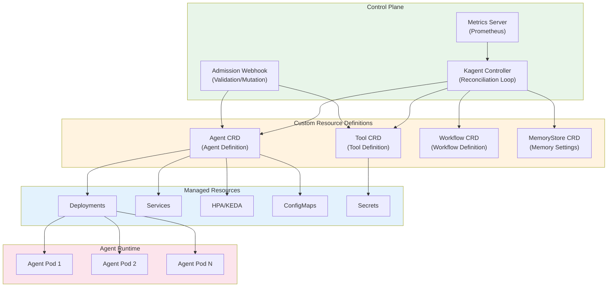
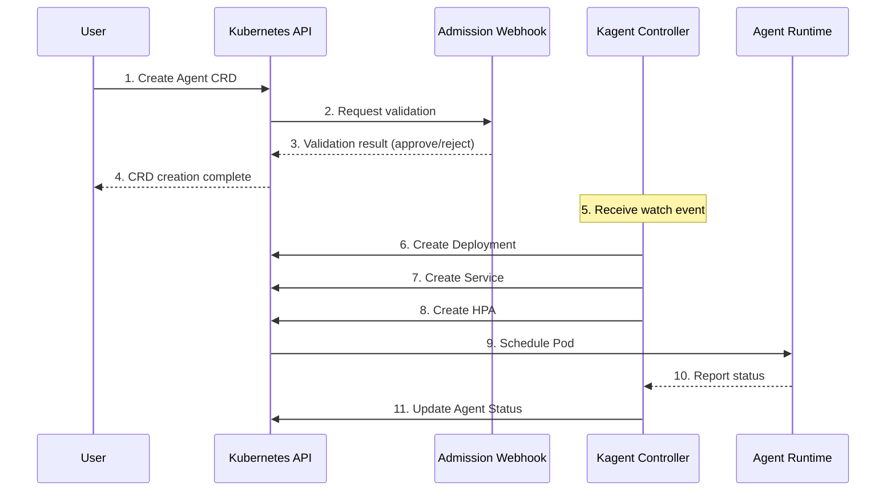
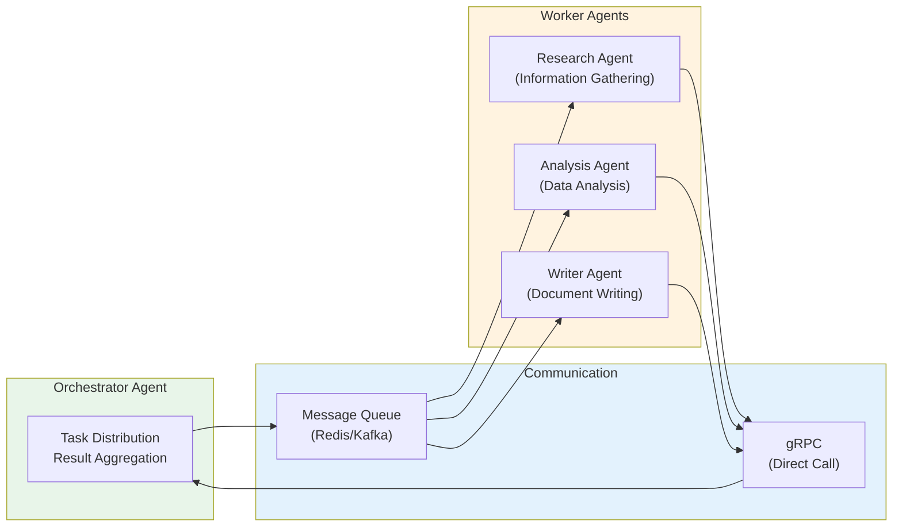

# Kagent - Kubernetes AI Agent 管理

> 📅 **撰写日期**: 2026-02-14 | **修改日期**: 2026-02-14 | ⏱️ **阅读时间**: 约 5 分钟


本文档介绍如何使用 Kagent 在 Kubernetes 环境中高效部署和管理 AI Agent。Kagent 是一个基于 Kubernetes Operator 模式的开源工具，支持对 AI Agent 的完整生命周期进行声明式管理。

## 概述

Kagent 是一个以 Kubernetes 原生方式管理 AI Agent 的开源项目。通过 Custom Resource Definitions（CRD），可以声明式地定义 Agent、工具和工作流，然后由 Operator 自动部署和管理。

### 核心特性

- **声明式 Agent 管理**：基于 YAML 的 Agent 定义与部署
- **工具注册中心**：通过 CRD 集中管理 Agent 可使用的工具
- **自动扩缩容**：通过 HPA/KEDA 集成实现动态扩展
- **多 Agent 编排**：复杂工作流中的 Agent 协作
- **可观测性集成**：与 LangFuse 和 OpenTelemetry 原生集成

:::info 目标受众
本文档面向 Kubernetes 管理员、平台工程师和 MLOps 工程师。需要具备 Kubernetes 基本概念（Pod、Deployment、CRD）的基础知识。
:::

## Kagent 架构

Kagent 遵循 Kubernetes Operator 模式，由 Controller、CRD 和 Webhook 组件组成。




### 替代方案对比

import { SolutionsComparisonTable } from '@site/src/components/KagentTables';

<SolutionsComparisonTable />

{/* Original table preserved for reference
| 方案 | 特性 | 适用场景 |
| --- | --- | --- |
| **Kagent（参考）** | AI Agent 专用 CRD、工作流编排 | 多 Agent 系统、复杂工作流 |
| **KubeAI** | 轻量级 LLM 服务、OpenAI 兼容 API | 简单模型服务、快速原型开发 |
| **Seldon Core** | MLOps 平台、A/B 测试、金丝雀部署 | 企业级 ML 运维、复杂部署策略 |
| **KServe** | Serverless 推理、自动扩缩容 | 事件驱动推理、成本优化 |
*/}

### 组件说明

import { ComponentsTable } from '@site/src/components/KagentTables';

<ComponentsTable />

{/* Original table preserved for reference
| 组件 | 角色 | 说明 |
| -------- | ---- | ---- |
| **Kagent Controller** | 调谐循环 | 检测 CRD 变更并将资源调谐到期望状态 |
| **Admission Webhook** | 验证/变更 | 对 CRD 的创建/修改进行验证和默认值设置 |
| **Metrics Server** | 指标采集 | 暴露 Agent 状态和性能指标 |
| **Agent CRD** | Agent 定义 | AI Agent 的规格、模型和工具配置 |
| **Tool CRD** | 工具定义 | 定义 Agent 可使用的工具（API、搜索等） |
| **Workflow CRD** | 工作流定义 | 定义多 Agent 协作工作流 |
*/}

### 组件交互



## Kagent 安装

### 前置条件

- Kubernetes 集群（v1.25 或更高版本）
- kubectl CLI 工具
- Helm v3（用于 Helm 安装）
- cert-manager（用于 Webhook TLS 证书管理）

:::warning 需要 cert-manager
Kagent 的 Admission Webhook 需要 TLS 证书。安装前必须在集群上安装 cert-manager。
:::


### Helm Chart 安装

推荐使用 Helm 安装方式。

#### 1. 添加 Helm 仓库

```bash
# 添加 Kagent Helm 仓库
helm repo add kagent https://kagent-dev.github.io/kagent
helm repo update

# 查看可用版本
helm search repo kagent --versions
```

#### 2. 创建 Namespace

```bash
# 创建 Kagent 系统 namespace
kubectl create namespace kagent-system

# 创建 Agent 部署 namespace
kubectl create namespace ai-agents
```

#### 3. 配置 values.yaml

```yaml
# values.yaml
controller:
  # Controller 副本数（高可用）
  replicaCount: 2

  # 资源设置
  resources:
    requests:
      cpu: 100m
      memory: 128Mi
    limits:
      cpu: 500m
      memory: 512Mi

  # 日志级别
  logLevel: info

  # 指标设置
  metrics:
    enabled: true
    port: 8080

webhook:
  # 启用 webhook
  enabled: true

  # 证书设置（使用 cert-manager）
  certManager:
    enabled: true
    issuerRef:
      name: kagent-selfsigned-issuer
      kind: Issuer

# 监控设置
monitoring:
  # 创建 ServiceMonitor（Prometheus Operator）
  serviceMonitor:
    enabled: true
    namespace: observability
    interval: 30s

# RBAC 设置
rbac:
  create: true

# 服务账户
serviceAccount:
  create: true
  name: kagent-controller

# 节点选择器
nodeSelector:
  kubernetes.io/os: linux

# 容忍度
tolerations: []

# 亲和性
affinity:
  podAntiAffinity:
    preferredDuringSchedulingIgnoredDuringExecution:
      - weight: 100
        podAffinityTerm:
          labelSelector:
            matchExpressions:
              - key: app.kubernetes.io/name
                operator: In
                values:
                  - kagent
          topologyKey: kubernetes.io/hostname
```

#### 4. 执行 Helm 安装

```bash
# 安装 Kagent
helm install kagent kagent/kagent \
  --namespace kagent-system \
  --values values.yaml \
  --wait

# 检查安装状态
helm status kagent -n kagent-system
```


### Manifest 安装

也可以不使用 Helm，直接应用 manifest 进行安装。

#### 1. 安装 CRD

```bash
# 下载并应用 CRD manifest
kubectl apply -f https://github.com/kagent-dev/kagent/releases/latest/download/crds.yaml

# 验证 CRD 安装
kubectl get crds | grep kagent
```

预期输出：

```text
agents.kagent.dev                    2025-02-05T00:00:00Z
tools.kagent.dev                     2025-02-05T00:00:00Z
workflows.kagent.dev                 2025-02-05T00:00:00Z
memorystores.kagent.dev              2025-02-05T00:00:00Z
```

#### 2. 部署 Controller

```yaml
# kagent-controller.yaml
apiVersion: v1
kind: Namespace
metadata:
  name: kagent-system
---
apiVersion: v1
kind: ServiceAccount
metadata:
  name: kagent-controller
  namespace: kagent-system
---
apiVersion: rbac.authorization.k8s.io/v1
kind: ClusterRole
metadata:
  name: kagent-controller-role
rules:
  - apiGroups: ["kagent.dev"]
    resources: ["agents", "tools", "workflows", "memorystores"]
    verbs: ["*"]
  - apiGroups: ["kagent.dev"]
    resources: ["agents/status", "workflows/status"]
    verbs: ["get", "update", "patch"]
  - apiGroups: ["apps"]
    resources: ["deployments"]
    verbs: ["*"]
  - apiGroups: [""]
    resources: ["services", "configmaps", "secrets", "pods"]
    verbs: ["*"]
  - apiGroups: ["autoscaling"]
    resources: ["horizontalpodautoscalers"]
    verbs: ["*"]
  - apiGroups: ["keda.sh"]
    resources: ["scaledobjects"]
    verbs: ["*"]
---
apiVersion: rbac.authorization.k8s.io/v1
kind: ClusterRoleBinding
metadata:
  name: kagent-controller-binding
roleRef:
  apiGroup: rbac.authorization.k8s.io
  kind: ClusterRole
  name: kagent-controller-role
subjects:
  - kind: ServiceAccount
    name: kagent-controller
    namespace: kagent-system
---
apiVersion: apps/v1
kind: Deployment
metadata:
  name: kagent-controller
  namespace: kagent-system
spec:
  replicas: 2
  selector:
    matchLabels:
      app: kagent-controller
  template:
    metadata:
      labels:
        app: kagent-controller
    spec:
      serviceAccountName: kagent-controller
      containers:
        - name: controller
          image: ghcr.io/kagent-dev/kagent-controller:latest
          args:
            - --leader-elect=true
            - --metrics-bind-address=:8080
            - --health-probe-bind-address=:8081
          ports:
            - containerPort: 8080
              name: metrics
            - containerPort: 8081
              name: health
          resources:
            requests:
              cpu: 100m
              memory: 128Mi
            limits:
              cpu: 500m
              memory: 512Mi
          livenessProbe:
            httpGet:
              path: /healthz
              port: 8081
            initialDelaySeconds: 15
            periodSeconds: 20
          readinessProbe:
            httpGet:
              path: /readyz
              port: 8081
            initialDelaySeconds: 5
            periodSeconds: 10
```

```bash
# 部署 controller
kubectl apply -f kagent-controller.yaml
```


### 安装验证

安装完成后验证安装状态。

```bash
# 检查 controller Pod 状态
kubectl get pods -n kagent-system

# 预期输出：
# NAME                                 READY   STATUS    RESTARTS   AGE
# kagent-controller-5d4f6b7c8d-abc12   1/1     Running   0          2m
# kagent-controller-5d4f6b7c8d-def34   1/1     Running   0          2m

# 验证 CRD
kubectl get crds | grep kagent.dev

# 检查 controller 日志
kubectl logs -n kagent-system -l app=kagent-controller --tail=50

# 验证 webhook 状态（Helm 安装时）
kubectl get validatingwebhookconfigurations | grep kagent
kubectl get mutatingwebhookconfigurations | grep kagent
```

:::tip 安装故障排查
如果 controller 启动失败：

1. 检查事件：`kubectl describe pod -n kagent-system <pod-name>`
2. 验证 RBAC 权限是否正确
3. 验证 cert-manager 是否正常运行（如使用 webhook）
:::

## Agent CRD 定义

Agent CRD 以声明式方式定义所有 Agent 配置。

### Agent 资源规格

```yaml
apiVersion: kagent.dev/v1alpha1
kind: Agent
metadata:
  name: customer-support-agent
  namespace: ai-agents
  labels:
    app: customer-support
    team: support
    environment: production
spec:
  # Agent 基本信息
  displayName: "Customer Support Agent"
  description: "响应客户咨询并创建工单的 AI Agent"

  # 模型配置
  model:
    provider: openai          # openai, anthropic, bedrock, vllm
    name: gpt-4-turbo
    endpoint: ""              # 自定义端点（vLLM 等）
    temperature: 0.7
    maxTokens: 4096
    topP: 0.9
    frequencyPenalty: 0.0
    presencePenalty: 0.0
    # API 密钥引用
    apiKeySecretRef:
      name: openai-api-key
      key: api-key

  # 系统提示词
  systemPrompt: |
    You are a helpful and professional customer support agent.

    ## Role
    - Provide accurate and helpful answers to customer inquiries
    - Search knowledge base when needed
    - Create tickets for unresolved issues

    ## Guidelines
    - Always maintain a polite and empathetic tone
    - Be honest about what you don't know
    - Guide through verification when sensitive information is requested

  # 使用的工具列表
  tools:
    - name: search-knowledge-base
    - name: create-ticket
    - name: get-customer-info

  # 记忆配置
  memory:
    type: redis
    config:
      host: redis-master.ai-data.svc.cluster.local
      port: 6379
      database: 0
      ttl: 3600           # 会话 TTL（秒）
      maxHistory: 50      # 最大对话历史记录数
    secretRef:
      name: redis-credentials
      key: password

  # 扩缩容配置
  scaling:
    minReplicas: 2
    maxReplicas: 10
    metrics:
      - type: cpu
        target:
          type: Utilization
          averageUtilization: 70
      - type: memory
        target:
          type: Utilization
          averageUtilization: 80
    # KEDA 扩缩容（可选）
    keda:
      enabled: true
      triggers:
        - type: prometheus
          metadata:
            serverAddress: http://prometheus.observability.svc:9090
            metricName: agent_active_sessions
            threshold: "50"
            query: sum(agent_active_sessions{agent="customer-support"})

  # 资源限制
  resources:
    requests:
      memory: "512Mi"
      cpu: "250m"
    limits:
      memory: "1Gi"
      cpu: "500m"

  # 环境变量
  env:
    - name: LOG_LEVEL
      value: "info"
    - name: LANGFUSE_ENABLED
      value: "true"
    - name: LANGFUSE_HOST
      value: "http://langfuse.observability.svc:3000"

  # 可观测性配置
  observability:
    tracing:
      enabled: true
      provider: langfuse
      sampleRate: 1.0
    metrics:
      enabled: true
      port: 9090

  # 健康检查
  healthCheck:
    enabled: true
    path: /health
    port: 8080
    initialDelaySeconds: 10
    periodSeconds: 30
```


### Tool CRD 定义

Tool CRD 定义 Agent 可使用的工具。

```yaml
apiVersion: kagent.dev/v1alpha1
kind: Tool
metadata:
  name: search-knowledge-base
  namespace: ai-agents
  labels:
    category: retrieval
spec:
  # 工具类型：api、retrieval、code、human
  type: retrieval

  # 工具描述（LLM 在工具选择时参考）
  displayName: "Knowledge Base Search"
  description: |
    搜索公司知识库中的相关文档。
    用于查找信息以回答客户咨询。

  # 检索配置
  retrieval:
    vectorStore:
      type: milvus
      host: milvus.ai-data.svc.cluster.local
      port: 19530
      collection: support-knowledge
    embedding:
      provider: openai
      model: text-embedding-3-small
      dimension: 1536
    search:
      topK: 5
      scoreThreshold: 0.7
      filter: ""

  # 定义输入参数
  parameters:
    - name: query
      type: string
      required: true
      description: "搜索问题或关键词"
    - name: category
      type: string
      required: false
      description: "筛选文档类别（如 faq、manual、policy）"
      enum: ["faq", "manual", "policy", "all"]
      default: "all"

  # 输出模式
  output:
    type: array
    items:
      type: object
      properties:
        content:
          type: string
          description: "文档内容"
        score:
          type: number
          description: "相似度分数"
        metadata:
          type: object
          description: "文档元数据"
---
apiVersion: kagent.dev/v1alpha1
kind: Tool
metadata:
  name: create-ticket
  namespace: ai-agents
  labels:
    category: api
spec:
  type: api

  displayName: "Create Ticket"
  description: |
    创建客户咨询工单。
    当 Agent 无法直接解决问题时使用。

  # API 配置
  api:
    endpoint: http://ticketing-service.support.svc:8080/api/v1/tickets
    method: POST
    timeout: 30s
    retries: 3
    headers:
      Content-Type: application/json
    # 认证设置
    authentication:
      type: bearer
      secretRef:
        name: ticketing-api-token
        key: token

  parameters:
    - name: title
      type: string
      required: true
      description: "工单标题"
      maxLength: 200
    - name: description
      type: string
      required: true
      description: "详细问题描述"
    - name: priority
      type: string
      required: false
      description: "优先级"
      enum: ["low", "medium", "high", "urgent"]
      default: "medium"
    - name: category
      type: string
      required: true
      description: "咨询类别"
      enum: ["billing", "technical", "general", "complaint"]
    - name: customer_id
      type: string
      required: true
      description: "客户 ID"

  output:
    type: object
    properties:
      ticket_id:
        type: string
        description: "创建的工单 ID"
      status:
        type: string
        description: "工单状态"
      created_at:
        type: string
        description: "创建时间"
---
apiVersion: kagent.dev/v1alpha1
kind: Tool
metadata:
  name: get-customer-info
  namespace: ai-agents
  labels:
    category: api
spec:
  type: api

  displayName: "Get Customer Info"
  description: |
    通过 ID 查询客户信息。
    需要进行客户验证时使用。

  api:
    endpoint: http://customer-service.crm.svc:8080/api/v1/customers/{customer_id}
    method: GET
    timeout: 10s
    authentication:
      type: bearer
      secretRef:
        name: crm-api-token
        key: token

  parameters:
    - name: customer_id
      type: string
      required: true
      description: "要查询的客户 ID"
      pattern: "^[A-Z0-9]{8}$"

  output:
    type: object
    properties:
      id:
        type: string
      name:
        type: string
      email:
        type: string
      tier:
        type: string
      created_at:
        type: string
```


### 记忆配置

用于存储 Agent 对话上下文和状态的记忆配置。

```yaml
apiVersion: kagent.dev/v1alpha1
kind: MemoryStore
metadata:
  name: agent-memory-redis
  namespace: ai-agents
spec:
  # 记忆类型：redis、postgres、in-memory
  type: redis

  # Redis 配置
  redis:
    host: redis-master.ai-data.svc.cluster.local
    port: 6379
    database: 0
    # TLS 设置
    tls:
      enabled: true
      secretRef:
        name: redis-tls-cert
    # 认证
    auth:
      secretRef:
        name: redis-credentials
        passwordKey: password

  # 记忆策略
  policy:
    # 会话 TTL
    sessionTTL: 3600
    # 最大对话历史记录数
    maxConversationHistory: 100
    # 记忆压缩（对长对话进行摘要）
    compression:
      enabled: true
      threshold: 50
      model: gpt-3.5-turbo
    # 长期记忆设置
    longTermMemory:
      enabled: true
      vectorStore:
        type: milvus
        collection: agent-memories
```

### 扩缩容配置

Agent 自动扩缩容的详细配置。

```yaml
# 基于 HPA 的扩缩容
scaling:
  minReplicas: 2
  maxReplicas: 20

  # 扩缩容行为设置
  behavior:
    scaleDown:
      stabilizationWindowSeconds: 300
      policies:
        - type: Percent
          value: 10
          periodSeconds: 60
    scaleUp:
      stabilizationWindowSeconds: 0
      policies:
        - type: Percent
          value: 100
          periodSeconds: 15
        - type: Pods
          value: 4
          periodSeconds: 15
      selectPolicy: Max

  # 基于指标的扩缩容
  metrics:
    - type: Resource
      resource:
        name: cpu
        target:
          type: Utilization
          averageUtilization: 70
    - type: Resource
      resource:
        name: memory
        target:
          type: Utilization
          averageUtilization: 80
    # 自定义指标
    - type: Pods
      pods:
        metric:
          name: agent_requests_per_second
        target:
          type: AverageValue
          averageValue: "100"
```

## Agent 生命周期管理

### Agent 部署流程

#### 1. 准备工作

```bash
# 创建 namespace
kubectl create namespace ai-agents

# 创建 API 密钥 secret
kubectl create secret generic openai-api-key \
  --namespace ai-agents \
  --from-literal=api-key='sk-your-api-key-here'

# 创建 Redis 凭证 secret
kubectl create secret generic redis-credentials \
  --namespace ai-agents \
  --from-literal=password='your-redis-password'
```

#### 2. 部署 Tool 资源

```bash
# 应用 Tool CRD
kubectl apply -f tools/search-knowledge-base.yaml
kubectl apply -f tools/create-ticket.yaml
kubectl apply -f tools/get-customer-info.yaml

# 检查 Tool 状态
kubectl get tools -n ai-agents
```

#### 3. 部署 Agent 资源

```bash
# 应用 Agent CRD
kubectl apply -f agents/customer-support-agent.yaml

# 检查部署状态
kubectl get agents -n ai-agents

# 检查详细状态
kubectl describe agent customer-support-agent -n ai-agents
```

#### 4. 验证部署

```bash
# 检查已创建的资源
kubectl get deployments -n ai-agents
kubectl get services -n ai-agents
kubectl get hpa -n ai-agents

# 检查 Pod 状态
kubectl get pods -n ai-agents -l app=customer-support-agent

# 检查日志
kubectl logs -n ai-agents -l app=customer-support-agent --tail=100

# 测试 Agent 端点
kubectl port-forward svc/customer-support-agent 8080:8080 -n ai-agents

# 在另一个终端中测试
curl -X POST http://localhost:8080/chat \
  -H "Content-Type: application/json" \
  -d '{"message": "Hello, I have a billing question."}'
```


### 更新流程

更新 Agent 配置的流程。

#### 更新并应用配置

```bash
# 查看当前配置
kubectl get agent customer-support-agent -n ai-agents -o yaml

# 编辑配置（使用默认编辑器）
kubectl edit agent customer-support-agent -n ai-agents

# 或修改文件后重新应用
kubectl apply -f agents/customer-support-agent.yaml
```

#### 监控滚动更新

```bash
# 监控更新状态
kubectl rollout status deployment/customer-support-agent -n ai-agents

# 检查 Pod 替换状态
kubectl get pods -n ai-agents -l app=customer-support-agent -w

# 检查事件
kubectl get events -n ai-agents --sort-by='.lastTimestamp' | grep customer-support
```

#### 金丝雀部署（可选）

```yaml
apiVersion: kagent.dev/v1alpha1
kind: Agent
metadata:
  name: customer-support-agent-canary
  namespace: ai-agents
  labels:
    app: customer-support
    version: canary
spec:
  # 使用新模型或配置进行测试
  model:
    provider: openai
    name: gpt-4o  # 新模型
    temperature: 0.5

  # 使用最小副本数进行测试
  scaling:
    minReplicas: 1
    maxReplicas: 2

  # 其余配置相同...
```

### 回滚流程

出现问题时回滚到之前版本的流程。

#### Deployment 回滚

```bash
# 检查滚动更新历史
kubectl rollout history deployment/customer-support-agent -n ai-agents

# 检查特定修订版本详情
kubectl rollout history deployment/customer-support-agent -n ai-agents --revision=2

# 回滚到上一个版本
kubectl rollout undo deployment/customer-support-agent -n ai-agents

# 回滚到指定修订版本
kubectl rollout undo deployment/customer-support-agent -n ai-agents --to-revision=2

# 检查回滚状态
kubectl rollout status deployment/customer-support-agent -n ai-agents
```

#### Agent CRD 回滚

```bash
# 应用之前版本的 Agent CRD
kubectl apply -f agents/customer-support-agent-v1.yaml

# 或从 Git 恢复
git checkout HEAD~1 -- agents/customer-support-agent.yaml
kubectl apply -f agents/customer-support-agent.yaml
```

:::danger 回滚注意事项

- 回滚前备份当前状态
- 如果存在 Schema 变更，需验证数据库 Schema 兼容性
- 回滚后测试所有功能
:::

## 多 Agent 编排

通过工作流实现 Agent 协作，处理复杂任务。

### Agent 间通信




### 工作流定义

使用 Workflow CRD 定义多 Agent 工作流。

```yaml
apiVersion: kagent.dev/v1alpha1
kind: Workflow
metadata:
  name: research-report-workflow
  namespace: ai-agents
spec:
  displayName: "Research Report Generation Workflow"
  description: "对指定主题进行研究并生成分析报告"

  # 工作流输入
  input:
    - name: topic
      type: string
      required: true
      description: "研究主题"
    - name: depth
      type: string
      required: false
      default: "standard"
      enum: ["quick", "standard", "deep"]

  # 工作流步骤定义
  steps:
    # 步骤 1：信息收集
    - name: research
      agent: research-agent
      input:
        topic: "{{ .input.topic }}"
        sources: ["web", "academic", "news"]
      output:
        - name: research_data
          path: ".result.data"
      timeout: 300s
      retries: 2

    # 步骤 2：数据分析（并行执行）
    - name: analyze-trends
      agent: analysis-agent
      dependsOn: [research]
      input:
        data: "{{ .steps.research.output.research_data }}"
        analysis_type: "trend"
      output:
        - name: trend_analysis
          path: ".result"
      parallel: true

    - name: analyze-sentiment
      agent: analysis-agent
      dependsOn: [research]
      input:
        data: "{{ .steps.research.output.research_data }}"
        analysis_type: "sentiment"
      output:
        - name: sentiment_analysis
          path: ".result"
      parallel: true

    # 步骤 3：报告撰写
    - name: write-report
      agent: writer-agent
      dependsOn: [analyze-trends, analyze-sentiment]
      input:
        research: "{{ .steps.research.output.research_data }}"
        trends: "{{ .steps.analyze-trends.output.trend_analysis }}"
        sentiment: "{{ .steps.analyze-sentiment.output.sentiment_analysis }}"
        format: "markdown"
      output:
        - name: report
          path: ".result.document"

    # 步骤 4：审核与修订
    - name: review
      agent: reviewer-agent
      dependsOn: [write-report]
      input:
        document: "{{ .steps.write-report.output.report }}"
        criteria: ["accuracy", "clarity", "completeness"]
      output:
        - name: final_report
          path: ".result.reviewed_document"

  # 工作流输出
  output:
    report: "{{ .steps.review.output.final_report }}"
    metadata:
      research_sources: "{{ .steps.research.output.research_data.sources }}"
      analysis_summary: "{{ .steps.analyze-trends.output.trend_analysis.summary }}"

  # 错误处理
  errorHandling:
    # 步骤失败时的操作
    onStepFailure: retry
    maxRetries: 3
    # 工作流失败时的操作
    onWorkflowFailure: notify
    notificationChannel:
      type: slack
      webhook:
        secretRef:
          name: slack-webhook
          key: url

  # 超时设置
  timeout: 1800s  # 30 分钟

  # 并发限制
  concurrency:
    maxConcurrent: 5
    policy: queue  # queue, reject, replace
```

### 工作流执行

```bash
# 应用工作流定义
kubectl apply -f workflows/research-report-workflow.yaml

# 执行工作流（创建 WorkflowRun）
cat <<EOF | kubectl apply -f -
apiVersion: kagent.dev/v1alpha1
kind: WorkflowRun
metadata:
  name: research-run-001
  namespace: ai-agents
spec:
  workflowRef:
    name: research-report-workflow
  input:
    topic: "2024 AI Trends Analysis"
    depth: "deep"
EOF

# 检查执行状态
kubectl get workflowruns -n ai-agents

# 检查详细状态
kubectl describe workflowrun research-run-001 -n ai-agents

# 检查执行日志
kubectl logs -n ai-agents -l workflow-run=research-run-001 --tail=100
```

### 工作流监控

```yaml
# 检查工作流运行状态
apiVersion: kagent.dev/v1alpha1
kind: WorkflowRun
metadata:
  name: research-run-001
status:
  phase: Running  # Pending, Running, Succeeded, Failed
  startTime: "2025-02-05T10:00:00Z"
  steps:
    - name: research
      phase: Succeeded
      startTime: "2025-02-05T10:00:00Z"
      completionTime: "2025-02-05T10:03:00Z"
    - name: analyze-trends
      phase: Running
      startTime: "2025-02-05T10:03:00Z"
    - name: analyze-sentiment
      phase: Running
      startTime: "2025-02-05T10:03:00Z"
    - name: write-report
      phase: Pending
    - name: review
      phase: Pending
  conditions:
    - type: Initialized
      status: "True"
    - type: Running
      status: "True"
```


## 运维指南

### 监控配置

```yaml
# Prometheus 的 ServiceMonitor
apiVersion: monitoring.coreos.com/v1
kind: ServiceMonitor
metadata:
  name: kagent-agents
  namespace: observability
spec:
  selector:
    matchLabels:
      kagent.dev/monitored: "true"
  namespaceSelector:
    matchNames:
      - ai-agents
  endpoints:
    - port: metrics
      interval: 15s
      path: /metrics
---
# 告警的 PrometheusRule
apiVersion: monitoring.coreos.com/v1
kind: PrometheusRule
metadata:
  name: kagent-alerts
  namespace: observability
spec:
  groups:
    - name: kagent-agent-alerts
      rules:
        - alert: AgentHighErrorRate
          expr: |
            sum(rate(agent_request_errors_total[5m])) by (agent) /
            sum(rate(agent_request_total[5m])) by (agent) > 0.05
          for: 5m
          labels:
            severity: critical
          annotations:
            summary: "Agent {{ $labels.agent }} 错误率上升"
            description: "错误率超过 5%。当前：{{ $value | humanizePercentage }}"

        - alert: AgentHighLatency
          expr: |
            histogram_quantile(0.99,
              sum(rate(agent_request_duration_seconds_bucket[5m])) by (agent, le)
            ) > 30
          for: 5m
          labels:
            severity: warning
          annotations:
            summary: "Agent {{ $labels.agent }} 响应延迟"
            description: "P99 延迟超过 30 秒"

        - alert: AgentPodNotReady
          expr: |
            kube_deployment_status_replicas_ready{deployment=~".*-agent"} /
            kube_deployment_status_replicas{deployment=~".*-agent"} < 0.5
          for: 5m
          labels:
            severity: critical
          annotations:
            summary: "Agent Pod 可用性降低"
            description: "{{ $labels.deployment }} 的就绪 Pod 低于 50%"
```

### 日志配置

```yaml
# Agent 日志 ConfigMap
apiVersion: v1
kind: ConfigMap
metadata:
  name: agent-logging-config
  namespace: ai-agents
data:
  logging.yaml: |
    version: 1
    disable_existing_loggers: false
    formatters:
      json:
        class: pythonjsonlogger.jsonlogger.JsonFormatter
        format: "%(asctime)s %(name)s %(levelname)s %(message)s"
    handlers:
      console:
        class: logging.StreamHandler
        formatter: json
        stream: ext://sys.stdout
    loggers:
      kagent:
        level: INFO
        handlers: [console]
        propagate: false
      langchain:
        level: WARNING
        handlers: [console]
        propagate: false
    root:
      level: INFO
      handlers: [console]
```

### 故障排查

#### 常见问题解决

import { TroubleshootingTable } from '@site/src/components/KagentTables';

<TroubleshootingTable />

{/* Original table preserved for reference
| 问题 | 原因 | 解决方案 |
| ---- | ---- | --------- |
| Pod CrashLoopBackOff | API 密钥错误、内存不足 | 验证 secret，增加资源 |
| 高延迟 | 模型响应延迟、网络问题 | 调整超时时间，更换模型 |
| 工具执行失败 | 端点错误、认证失败 | 验证工具配置，刷新 secret |
| 扩缩容不生效 | 指标采集失败、HPA 配置错误 | 检查 Prometheus 连接，验证 HPA |
*/}

#### 调试命令

```bash
# 详细检查 Agent 状态
kubectl describe agent <agent-name> -n ai-agents

# 检查 Pod 事件
kubectl get events -n ai-agents --field-selector involvedObject.name=<pod-name>

# 检查容器日志（包括上一次）
kubectl logs <pod-name> -n ai-agents --previous

# 实时流式查看日志
kubectl logs -f -l app=<agent-name> -n ai-agents

# 进入 Pod 内部
kubectl exec -it <pod-name> -n ai-agents -- /bin/sh

# 测试网络连通性
kubectl run debug --rm -it --image=curlimages/curl -- \
  curl -v http://customer-support-agent.ai-agents.svc:8080/health
```

## 总结

Kagent 支持在 Kubernetes 环境中对 AI Agent 进行声明式管理。核心优势：

- **声明式管理**：基于 YAML 的 Agent 定义，支持 GitOps 工作流
- **自动化运维**：Operator 模式提供自动恢复和扩缩容
- **标准化**：CRD 实现 Agent 定义的标准化
- **可扩展性**：利用 Kubernetes 原生的扩缩容机制
- **可观测性**：集成监控和链路追踪支持

:::tip 后续步骤

- [Agentic AI 平台架构](./agentic-platform-architecture.md) - 完整平台设计
- [Agent 监控](./agent-monitoring.md) - LangFuse 集成指南
- [GPU 资源管理](./gpu-resource-management.md) - 动态资源分配

:::

## 参考资料

- [Kagent GitHub 仓库](https://github.com/kagent-dev/kagent)
- [Kagent 文档](https://kagent.dev/docs)
- [Kubernetes Operator 模式](https://kubernetes.io/docs/concepts/extend-kubernetes/operator/)
- [Custom Resource Definitions](https://kubernetes.io/docs/concepts/extend-kubernetes/api-extension/custom-resources/)
- [Horizontal Pod Autoscaler](https://kubernetes.io/docs/tasks/run-application/horizontal-pod-autoscale/)
- [KEDA 文档](https://keda.sh/docs/)
