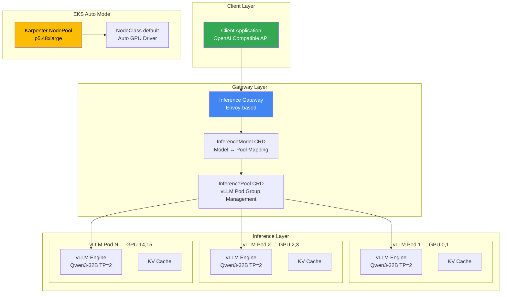
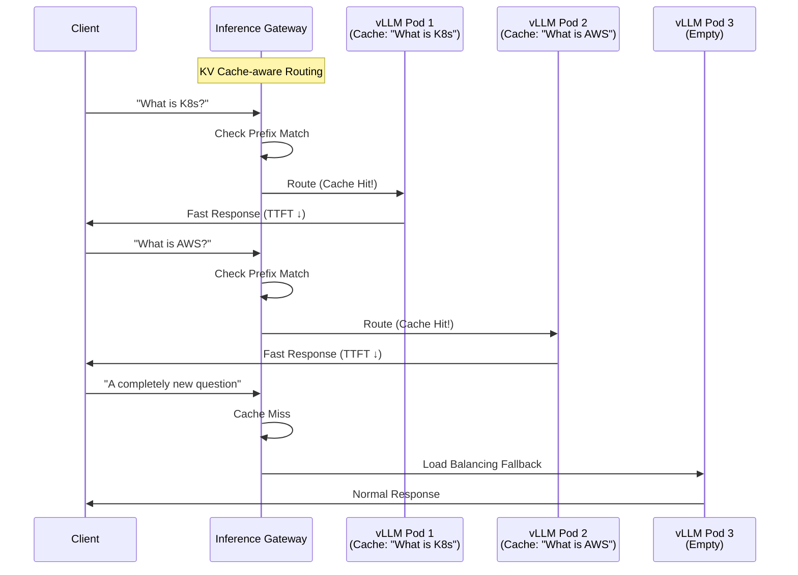

import {
  WellLitPathTable,
  VllmComparisonTable,
  Qwen3SpecsTable,
  PrerequisitesTable,
  P5InstanceTable,
  P5eInstanceTable,
  GatewayCRDTable,
  DefaultDeploymentTable,
  KVCacheEffectsTable,
  MonitoringMetricsTable,
  ModelLoadingTable,
  CostOptimizationTable,
  TroubleshootingTable
} from '@site/src/components/LlmdTables';

# llm-d 在 EKS Auto Mode 上的推理部署指南

> 📅 **撰写日期**: 2026-02-10 | **修改日期**: 2026-02-14 | ⏱️ **阅读时间**: 约 7 分钟

> **📌 当前版本**: llm-d v0.4 (2025)。本文档中的部署示例基于 Intelligent Inference Scheduling well-lit path。

> 📅 **发布日期**: 2026-02-10 | ⏱️ **阅读时间**: 约 15 分钟

## 概述

llm-d 是由 Red Hat 主导的 Kubernetes 原生分布式推理栈，基于 Apache 2.0 许可证。它结合了 vLLM 推理引擎、基于 Envoy 的 Inference Gateway 和 Kubernetes Gateway API，为大语言模型提供智能推理路由。

传统的 vLLM 部署依赖简单的 Round-Robin 负载均衡，而 llm-d 使用感知 KV Cache 状态的智能路由，将具有相同前缀的请求定向到已持有对应 KV Cache 的 Pod。这显著降低了 Time To First Token (TTFT) 并节省 GPU 计算资源。

本文档涵盖在 Amazon EKS Auto Mode 环境中部署 llm-d 并使用 Qwen3-32B 模型配置推理服务的完整流程。EKS Auto Mode 提供基于 Karpenter 的自动节点供应和自动 NVIDIA GPU 驱动管理，大幅降低了 GPU 基础设施设置的复杂性。

:::warning llm-d Inference Gateway ≠ 通用 Gateway API 实现
llm-d 基于 Envoy 的 Inference Gateway 是一个**专门为 LLM 推理请求设计的专用网关**。它在目的和范围上与替代 NGINX Ingress Controller 的通用 Gateway API 实现（AWS LBC v3、Cilium、Envoy Gateway 等）有本质区别。

- **llm-d Gateway**：基于 InferenceModel/InferencePool CRD，KV Cache 感知路由，仅处理推理流量
- **通用 Gateway API**：基于 HTTPRoute/GRPCRoute，TLS/认证/限流，集群范围的流量管理

在生产环境中，应使用通用 Gateway API 实现作为集群入口点，llm-d 在其下方优化 AI 推理流量。关于通用 Gateway API 实现的选择，请参阅 [Gateway API 采用指南](/docs/infrastructure-optimization/gateway-api-adoption-guide)。
:::

### 主要目标

- **理解 llm-d 架构**：Inference Gateway 和 KV Cache 感知路由的工作原理
- **EKS Auto Mode GPU 配置**：设置 p5.48xlarge 节点的自动供应
- **Qwen3-32B 部署**：使用 helmfile 进行集成部署和验证
- **推理测试**：通过 OpenAI 兼容 API 进行推理请求和流式传输
- **运维优化**：监控、成本优化和故障排除

### llm-d 的 3 条 Well-Lit Path

llm-d 提供三条经过验证的部署路径。

<WellLitPathTable />

---

## 架构

llm-d 的 Intelligent Inference Scheduling 架构如下。



### llm-d 与传统 vLLM 部署对比

<VllmComparisonTable />

### 为什么选择 Qwen3-32B

<Qwen3SpecsTable />

:::info 为什么选择 Qwen3-32B
Qwen3-32B 是 llm-d 的官方默认模型，基于 Apache 2.0 许可证可免费商用。在 BF16 精度下需要约 65GB VRAM，可以使用 TP=2（2 个 GPU）在 H100 80GB GPU 上稳定运行。
:::

---

## 前提条件

<PrerequisitesTable />

### 客户端工具安装

```bash
# 安装 eksctl（macOS）
brew tap weaveworks/tap
brew install weaveworks/tap/eksctl

# 安装 helmfile
brew install helmfile

# 安装 yq
brew install yq

# 验证版本
eksctl version
kubectl version --client
helm version
helmfile --version
yq --version
```

:::warning 验证 p5.48xlarge 配额
p5.48xlarge 使用 192 个 vCPU。请验证 AWS Service Quotas 中的 **Running On-Demand P instances** 限制至少为 192。配额增加请求可能需要 1-3 个工作日才能获批。

```bash
# 检查当前 P 实例配额
aws service-quotas get-service-quota \
  --service-code ec2 \
  --quota-code L-417A185B \
  --region us-west-2 \
  --query 'Quota.Value'
```

:::

---

## 创建 EKS Auto Mode 集群

### 集群配置文件

```yaml
# cluster-config.yaml
apiVersion: eksctl.io/v1alpha5
kind: ClusterConfig
metadata:
  name: llm-d-cluster
  region: us-west-2
  version: "1.31"
autoModeConfig:
  enabled: true
```

```bash
# 创建集群（大约需要 15-20 分钟）
eksctl create cluster -f cluster-config.yaml

# 验证集群状态
kubectl get nodes
kubectl cluster-info
```

### 创建 GPU NodePool

在 EKS Auto Mode 中创建用于自动供应 p5.48xlarge 实例的 Karpenter NodePool。

```yaml
# gpu-nodepool.yaml
apiVersion: karpenter.sh/v1
kind: NodePool
metadata:
  name: gpu-p5
spec:
  template:
    spec:
      requirements:
        - key: eks.amazonaws.com/instance-family
          operator: In
          values: ["p5"]
        - key: kubernetes.io/arch
          operator: In
          values: ["amd64"]
        - key: karpenter.sh/capacity-type
          operator: In
          values: ["on-demand"]
      nodeClassRef:
        group: eks.amazonaws.com
        kind: NodeClass
        name: default
      taints:
        - key: nvidia.com/gpu
          effect: NoSchedule
  limits:
    cpu: "384"
    memory: 4096Gi
    nvidia.com/gpu: "16"
  disruption:
    consolidationPolicy: WhenEmpty
    consolidateAfter: 30s
```

```bash
kubectl apply -f gpu-nodepool.yaml

# 验证 NodePool 状态
kubectl get nodepool gpu-p5
```

:::info EKS Auto Mode 中的 GPU 支持
EKS Auto Mode 自动安装和管理 NVIDIA GPU 驱动。无需单独安装 GPU Operator 或 NVIDIA Device Plugin。使用 `default` NodeClass 可让 Auto Mode 自动选择最佳 AMI 和驱动版本。
:::

### p5.48xlarge 实例规格

<P5InstanceTable />

---

## 部署 llm-d

### 5.1 创建命名空间和密钥

```bash
export NAMESPACE=llm-d
kubectl create namespace ${NAMESPACE}

# 创建 HuggingFace Token 密钥
kubectl create secret generic llm-d-hf-token \
  --from-literal=HF_TOKEN=<your-huggingface-token> \
  -n ${NAMESPACE}

# 验证密钥创建
kubectl get secret llm-d-hf-token -n ${NAMESPACE}
```

### 5.2 克隆 llm-d 仓库

```bash
git clone https://github.com/llm-d/llm-d.git
cd llm-d/guides/inference-scheduling
```

目录结构：

```text
guides/inference-scheduling/
├── helmfile.yaml          # 统一部署定义
├── values/
│   ├── vllm-values.yaml   # vLLM 服务器配置
│   ├── gateway-values.yaml # Gateway 配置
│   └── ...
└── README.md
```

### 5.3 安装 Gateway API CRD

llm-d 使用 Kubernetes Gateway API 和 Inference Extension CRD。

```bash
# 安装标准 Gateway API CRD
kubectl apply -f https://github.com/kubernetes-sigs/gateway-api/releases/download/v1.2.1/standard-install.yaml

# 安装 Inference Extension CRD（InferencePool、InferenceModel）
kubectl apply -f https://github.com/kubernetes-sigs/gateway-api-inference-extension/releases/download/v0.3.0/manifests.yaml
```

已安装的 CRD：

<GatewayCRDTable />

```bash
# 验证 CRD 安装
kubectl get crd | grep -E "gateway|inference"
```

### 5.4 安装 Gateway 控制平面

```bash
# 安装基于 Istio 的 Gateway 控制平面
helmfile apply -n ${NAMESPACE} -l component=gateway-control-plane
```

### 5.5 完整 llm-d 部署

```bash
# 部署所有组件（vLLM + Gateway + InferencePool + InferenceModel）
helmfile apply -n ${NAMESPACE}
```

默认部署配置：

<DefaultDeploymentTable />

:::tip 资源调整
默认配置使用 8 个副本 × 2 个 GPU = 16 个 GPU。为了测试目的，可以减少 `helmfile.yaml` 中的 `replicaCount` 以节省成本。例如，设置 4 个副本可在单个 p5.48xlarge（8 个 GPU）上运行。
:::

### 5.6 验证部署

```bash
# 验证 Helm 发布
helm list -n ${NAMESPACE}

# 检查所有资源
kubectl get all -n ${NAMESPACE}

# 检查 InferencePool 状态
kubectl get inferencepool -n ${NAMESPACE}

# 检查 InferenceModel 状态
kubectl get inferencemodel -n ${NAMESPACE}

# 检查 vLLM Pod 状态（包括 GPU 分配）
kubectl get pods -n ${NAMESPACE} -o wide

# 等待 Pod 就绪（模型加载需要 5-10 分钟）
kubectl wait --for=condition=Ready pods -l app=vllm \
  -n ${NAMESPACE} --timeout=600s
```

:::warning 模型加载时间
Qwen3-32B（BF16，约 65GB）从 HuggingFace Hub 首次下载可能需要 10-20 分钟，取决于网络速度。后续部署将利用节点的本地缓存，显著缩短加载时间。
:::

---

## 推理请求测试

### 6.1 端口转发

```bash
# 对 Inference Gateway 进行端口转发
kubectl port-forward svc/inference-gateway -n ${NAMESPACE} 8080:8080
```

### 6.2 基本 curl 测试

```bash
curl -s http://localhost:8080/v1/chat/completions \
  -H "Content-Type: application/json" \
  -d '{
    "model": "Qwen/Qwen3-32B",
    "messages": [
      {
        "role": "user",
        "content": "What is Kubernetes? Please explain briefly."
      }
    ],
    "max_tokens": 256,
    "temperature": 0.7
  }' | jq .
```

预期响应结构：

```json
{
  "id": "chatcmpl-...",
  "object": "chat.completion",
  "model": "Qwen/Qwen3-32B",
  "choices": [
    {
      "index": 0,
      "message": {
        "role": "assistant",
        "content": "Kubernetes is an open-source platform for automating the deployment, scaling..."
      },
      "finish_reason": "stop"
    }
  ],
  "usage": {
    "prompt_tokens": 15,
    "completion_tokens": 128,
    "total_tokens": 143
  }
}
```

### 6.3 Python 客户端

```python
from openai import OpenAI

client = OpenAI(
    base_url="http://localhost:8080/v1",
    api_key="not-needed"  # llm-d 不需要单独的认证
)

response = client.chat.completions.create(
    model="Qwen/Qwen3-32B",
    messages=[
        {"role": "system", "content": "You are a cloud native expert."},
        {"role": "user", "content": "Explain 3 advantages of EKS Auto Mode."}
    ],
    max_tokens=512,
    temperature=0.7
)
print(response.choices[0].message.content)
```

### 6.4 流式响应测试

```python
stream = client.chat.completions.create(
    model="Qwen/Qwen3-32B",
    messages=[
        {"role": "user", "content": "How does llm-d's KV Cache-aware routing work?"}
    ],
    max_tokens=512,
    stream=True
)

for chunk in stream:
    if chunk.choices[0].delta.content:
        print(chunk.choices[0].delta.content, end="", flush=True)
print()
```

### 6.5 查看模型列表

```bash
curl -s http://localhost:8080/v1/models | jq .
```

:::info OpenAI 兼容 API
llm-d 提供 OpenAI 兼容 API。使用现有 OpenAI SDK 的应用只需更改 `base_url` 即可立即使用。支持 `/v1/chat/completions`、`/v1/completions` 和 `/v1/models` 端点。
:::

---

## 理解 KV Cache 感知路由

llm-d 的核心差异化特性是其感知 KV Cache 状态的智能路由。



### 路由工作原理

1. **接收请求**：客户端向 Inference Gateway 发送推理请求
2. **前缀分析**：Gateway 对请求的提示前缀进行哈希以进行识别
3. **缓存查找**：检查每个 vLLM Pod 的 KV Cache 状态，找到持有匹配前缀的 Pod
4. **智能路由**：缓存命中时路由到匹配的 Pod；未命中时回退到基于负载的均衡
5. **返回响应**：vLLM 通过 Gateway 将推理结果返回给客户端

### KV Cache 感知路由的效果

<KVCacheEffectsTable />

:::tip 最大化缓存命中率
KV Cache 感知路由在使用相同系统提示的应用中最为有效。例如，在重复引用相同上下文文档的 RAG 管道中，复用该前缀的 KV Cache 可以显著降低 TTFT。
:::

---

## 监控与验证

### 8.1 查看 vLLM 指标

```bash
# 访问 vLLM Pod 的指标端点
VLLM_POD=$(kubectl get pods -n ${NAMESPACE} -l app=vllm -o jsonpath='{.items[0].metadata.name}')
kubectl port-forward ${VLLM_POD} -n ${NAMESPACE} 9090:9090

# 查询指标
curl -s http://localhost:9090/metrics | grep -E "vllm_"
```

### 关键监控指标

<MonitoringMetricsTable />

### 8.2 检查 GPU 利用率

```bash
# 在特定 vLLM Pod 上运行 nvidia-smi
kubectl exec -it ${VLLM_POD} -n ${NAMESPACE} -- nvidia-smi

# 实时 GPU 监控（1 秒间隔）
kubectl exec -it ${VLLM_POD} -n ${NAMESPACE} -- nvidia-smi dmon -s u -d 1
```

### 8.3 查看 Gateway 日志

```bash
# 查看 Inference Gateway 日志
kubectl logs -f deployment/inference-gateway -n ${NAMESPACE}

# 详细查看 InferencePool 状态
kubectl describe inferencepool -n ${NAMESPACE}
```

### 8.4 Prometheus ServiceMonitor 配置

```yaml
apiVersion: monitoring.coreos.com/v1
kind: ServiceMonitor
metadata:
  name: llm-d-vllm-monitor
  namespace: monitoring
spec:
  selector:
    matchLabels:
      app: vllm
  endpoints:
    - port: metrics
      path: /metrics
      interval: 15s
  namespaceSelector:
    matchNames:
      - llm-d
```

---

## 运维注意事项

### 9.1 S3 模型缓存

每次从 HuggingFace Hub 下载模型会增加冷启动时间。可以将模型权重缓存到 S3 以减少加载时间。

```yaml
# 在 vLLM 环境变量中添加 S3 缓存路径
env:
  - name: VLLM_S3_MODEL_CACHE
    value: "s3://your-bucket/model-cache/qwen3-32b/"
```

<ModelLoadingTable />

### 9.2 HPA（Horizontal Pod Autoscaler）配置

您可以根据 vLLM 等待请求数配置自动扩展。

```yaml
apiVersion: autoscaling/v2
kind: HorizontalPodAutoscaler
metadata:
  name: vllm-hpa
  namespace: llm-d
spec:
  scaleTargetRef:
    apiVersion: apps/v1
    kind: Deployment
    name: vllm-deployment
  minReplicas: 2
  maxReplicas: 8
  metrics:
    - type: Pods
      pods:
        metric:
          name: vllm_num_requests_waiting
        target:
          type: AverageValue
          averageValue: "5"
  behavior:
    scaleUp:
      stabilizationWindowSeconds: 60
      policies:
        - type: Pods
          value: 2
          periodSeconds: 120
    scaleDown:
      stabilizationWindowSeconds: 300
      policies:
        - type: Pods
          value: 1
          periodSeconds: 180
```

:::info HPA 与 Karpenter 集成
当 HPA 增加 vLLM 副本数且需要额外 GPU 时，Karpenter 会自动供应新的 p5.48xlarge 节点。在 EKS Auto Mode 中，此过程完全自动化。
:::

### 9.3 成本优化

<CostOptimizationTable />

:::warning 成本警告
p5.48xlarge 的费用约为每小时 $98.32（us-west-2 按需定价）。运行 2 个实例每月约需 **$141,580**。测试完成后务必清理资源。

```bash
# 清理资源
helmfile destroy -n ${NAMESPACE}
kubectl delete namespace ${NAMESPACE}
kubectl delete nodepool gpu-p5

# 删除集群（如需要）
eksctl delete cluster --name llm-d-cluster --region us-west-2
```

:::

---

## 故障排除

### 常见问题及解决方案

<TroubleshootingTable />

### 调试命令参考

```bash
# 检查 Pod 状态和事件
kubectl describe pod <pod-name> -n llm-d

# 查看 vLLM 日志（最后 100 行）
kubectl logs <vllm-pod> -n llm-d --tail=100

# 检查 GPU 状态
kubectl exec -it <vllm-pod> -n llm-d -- nvidia-smi

# 详细查看 InferencePool 状态
kubectl describe inferencepool -n llm-d

# 查看 InferenceModel 状态
kubectl describe inferencemodel -n llm-d

# 查看 Gateway 日志
kubectl logs -f deployment/inference-gateway -n llm-d

# 查看节点 GPU 资源
kubectl get nodes -o custom-columns=\
  NAME:.metadata.name,\
  GPU:.status.allocatable.nvidia\\.com/gpu,\
  STATUS:.status.conditions[-1].type

# 查看 Karpenter 日志（排查节点供应问题）
kubectl logs -f deployment/karpenter -n kube-system
```

:::tip NCCL 调试
如果出现多 GPU 通信问题，添加以下环境变量以启用详细日志：

```yaml
env:
  - name: NCCL_DEBUG
    value: "INFO"
  - name: NCCL_DEBUG_SUBSYS
    value: "ALL"
```

:::

---

## 后续步骤

本指南涵盖了 llm-d 的 Intelligent Inference Scheduling 路径。作为后续步骤，您可以探索高级功能。

- **Prefill/Decode 分离**：将 Prefill 和 Decode 阶段分离到不同的 Pod 组，为大批量处理和长上下文工作负载最大化吞吐量
- **Expert 并行**：将 MoE 模型（Mixtral、DeepSeek 等）的 Expert 分布到多个节点，实现超大模型服务
- **LoRA Adapter 热切换**：在单个基础模型上动态加载/卸载多个 LoRA 适配器，实现多任务服务
- **Prometheus + Grafana 仪表板**：基于 vLLM 指标构建实时监控仪表板
- **多模型服务**：使用 InferenceModel CRD 在单个 llm-d 集群上同时服务多个模型

### 相关文档

- [基于 vLLM 的基础模型部署与性能优化](./vllm-model-serving.md) — vLLM 基础和部署
- [MoE 模型服务指南](./moe-model-serving.md) — Mixture of Experts 模型服务
- [推理网关与动态路由](./inference-gateway-routing.md) — 推理路由策略
- [GPU 资源管理](./gpu-resource-management.md) — GPU 集群资源管理

---

## 参考资料

- [llm-d GitHub](https://github.com/llm-d/llm-d)
- [llm-d Deployer (Helm Charts)](https://github.com/llm-d/llm-d-deployer)
- [EKS Auto Mode 文档](https://docs.aws.amazon.com/eks/latest/userguide/automode.html)
- [Gateway API Inference Extension](https://gateway-api.sigs.k8s.io/geps/gep-3567/)
- [vLLM 官方文档](https://docs.vllm.ai/)
- [Qwen3-32B HuggingFace](https://huggingface.co/Qwen/Qwen3-32B)
- [Kubernetes Gateway API](https://gateway-api.sigs.k8s.io/)
