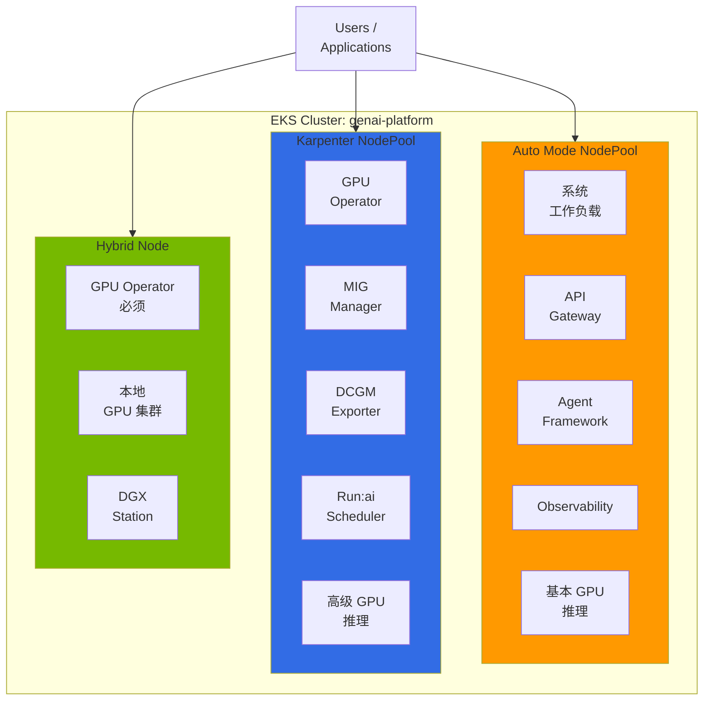
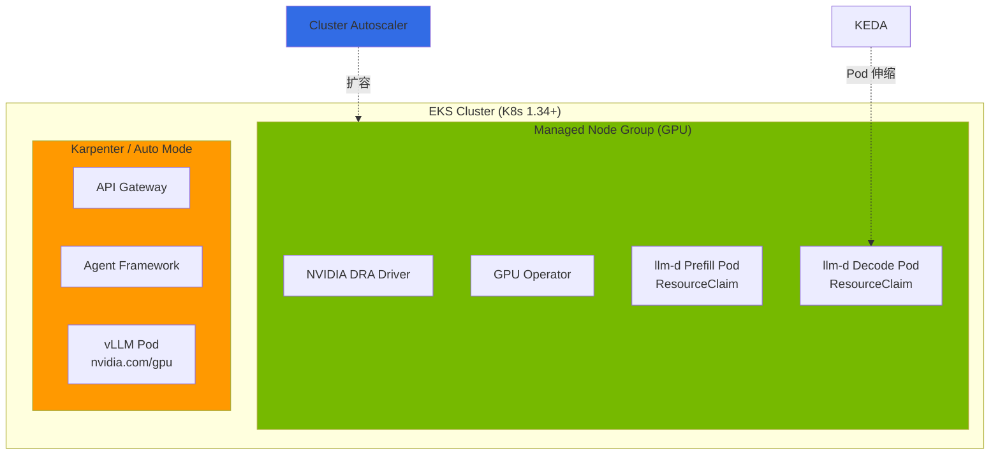
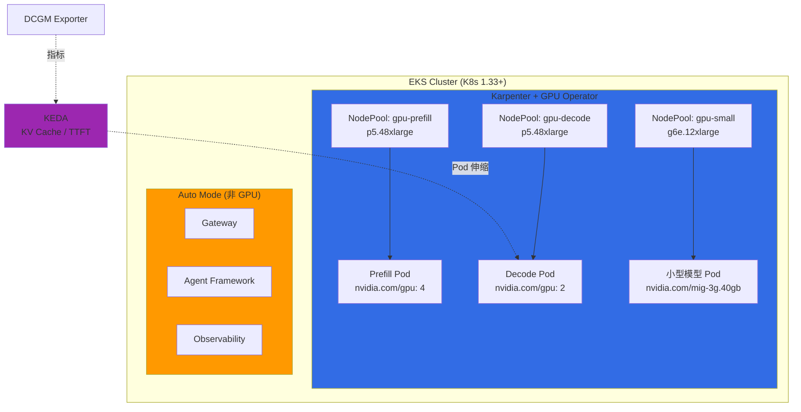
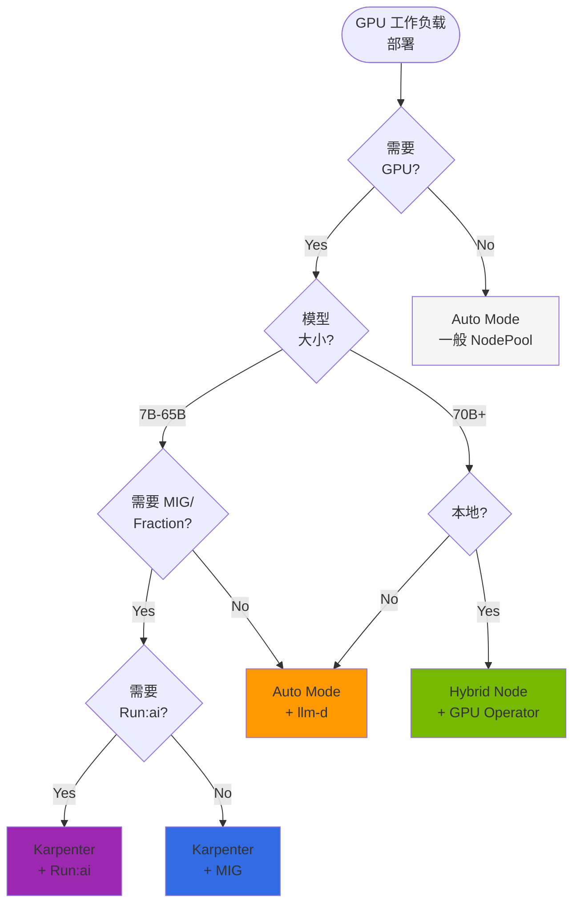

# EKS GPU 节点策略

## 1. 概述

在 EKS 上运营 GPU 工作负载时，节点类型选择直接影响运维复杂度、成本和功能利用度。GPU 推理和训练工作负载与一般容器工作负载不同，有以下特殊需求：

- **驱动依赖**：NVIDIA GPU 驱动、Container Toolkit、Device Plugin
- **高级功能**：MIG（Multi-Instance GPU）、Time-Slicing、Fractional GPU
- **监控**：基于 DCGM（Data Center GPU Manager）的指标
- **调度**：Topology-Aware Placement、Gang Scheduling

AWS EKS 为 GPU 工作负载提供 4 种节点类型：

| 节点类型 | 说明 |
|-----------|------|
| **EKS Auto Mode** | AWS 管理全部节点生命周期（GPU 驱动预装）|
| **Karpenter** | 自动伸缩 + Custom AMI、MIG 等完全用户自定义 |
| **Managed Node Group** | AWS 托管节点组，唯一支持 DRA（Dynamic Resource Allocation）|
| **Hybrid Node** | 将本地 GPU 服务器连接到 EKS 集群 |

:::tip 核心原则
在一个 EKS 集群中可以**同时**运营多种节点类型。请根据工作负载特性配置最优的节点组合。
:::

### 本文档范围

本文档聚焦于**节点类型选择和混合架构设计**。GPU Operator/DCGM/Dynamo 等 NVIDIA 软件栈详情、GPU 自动伸缩、llm-d 分布式推理、安全/故障排除请参阅各专门文档（第 7 章相关文档参考）。

---

## 2. 节点类型特性对比

### 2.1 功能对比表

| 特性 | Auto Mode | Karpenter | Managed Node Group | Hybrid Node |
|------|-----------|-----------|-------------------|-------------|
| **管理主体** | AWS 完全管理 | 自管理 | AWS 管理 | 本地 |
| **自动伸缩** | 自动（AWS 控制）| 自动（NodePool）| 手动/受限 | 手动 |
| **Custom AMI** | 不可 | 可以 | 可以 | 可以 |
| **SSH 访问** | 不可 | 可以 | 可以 | 可以 |
| **GPU 驱动** | 预装（AWS）| 用户安装 | 用户安装 | 用户安装 |
| **GPU Operator** | **可以**（禁用 Device Plugin 标签）| **可以** | 可以 | 可以 |
| **Root Filesystem** | 只读 | 读写 | 读写 | 读写 |
| **MIG 支持** | 不可（NodeClass 只读）| 可以 | 可以 | 可以 |
| **DRA 兼容** | **不可**（内部 Karpenter）| **不可**（[#1231](https://github.com/kubernetes-sigs/karpenter/issues/1231)）| **可以**（推荐）| 可以 |
| **DCGM Exporter** | 通过 GPU Operator 安装 | GPU Operator 包含 | 手动安装 | GPU Operator 包含 |
| **Run:ai 兼容** | **可以**（禁用 Device Plugin）| **可以** | 可以 | 可以 |
| **成本** | 低（无需管理）| 中等 | 中等 | 低（Capex）|
| **适用工作负载** | 简单推理 | 高级 GPU 功能 | DRA 工作负载 | 本地集成 |

### 2.2 选择指南：何时使用哪种节点

**选择 Auto Mode 的情况：**
- 希望无 GPU 驱动管理负担快速启动推理服务
- 不需要 MIG、Fractional GPU 的大型模型（70B+）服务
- 系统/非 GPU 工作负载（API Gateway、Agent、Observability）

**选择 Karpenter 的情况：**
- 需要 MIG 分区、Custom AMI、Spot Instance 灵活控制
- 使用 Run:ai、KAI Scheduler 等依赖 GPU Operator ClusterPolicy 的项目
- 中小型模型的 GPU 利用率优化（MIG 分割）

**选择 Managed Node Group 的情况：**
- 需要基于 DRA（Dynamic Resource Allocation）的 GPU 管理
- 使用 P6e-GB200 UltraServer 等 DRA 专用实例

**选择 Hybrid Node 的情况：**
- 将现有本地 GPU 服务器资产集成到 EKS
- 数据主权（Data Residency）需求

---

## 3. EKS Auto Mode GPU 支持与限制

### 3.1 Auto Mode 自动提供的 GPU 栈

EKS Auto Mode 在 GPU 实例上预装以下内容：

1. **NVIDIA GPU 驱动** - AWS 管理版本，`/dev/nvidia*` 设备自动创建
2. **NVIDIA Container Toolkit** - containerd 插件自动配置
3. **NVIDIA Device Plugin** - `nvidia.com/gpu` 资源自动注册
4. **GPU 资源注册** - Pod 可立即请求 `nvidia.com/gpu: 1`

```yaml
apiVersion: v1
kind: Pod
metadata:
  name: gpu-test
spec:
  containers:
  - name: cuda-test
    image: nvidia/cuda:12.2.0-runtime-ubuntu22.04
    command: ["nvidia-smi"]
    resources:
      limits:
        nvidia.com/gpu: 1
```

### 3.2 Auto Mode 安装 GPU Operator：Device Plugin 禁用模式

GPU Operator 在 Auto Mode 中**可以安装**。关键是**仅通过节点标签禁用 Device Plugin**，其他组件（DCGM Exporter、NFD、GFD）正常运行。此模式已在 [awslabs/ai-on-eks PR #288](https://github.com/awslabs/ai-on-eks/pull/288) 中验证。

**为什么需要 GPU Operator？** KAI Scheduler、Run:ai 等多个项目依赖 GPU Operator 的 **ClusterPolicy CRD**。没有 ClusterPolicy 这些项目甚至无法启动。这是在 Auto Mode 中也需要安装 GPU Operator 的核心原因。

```
ClusterPolicy CRD (GPU Operator)
  ↓ depends on
KAI Scheduler (GPU-aware Pod 放置)
Run:ai (Fractional GPU, Gang Scheduling)
  ↓ reads
DCGM Exporter (GPU 指标)
NFD/GFD (硬件标签)
```

| GPU Operator 组件 | Auto Mode 设置 | 原因 |
|---------------------|--------------|------|
| **Driver** | `enabled: false` | AMI 中预装 |
| **Container Toolkit** | `enabled: false` | AMI 中预装 |
| **Device Plugin** | 通过标签禁用 | AWS 自管理 Device Plugin |
| **DCGM Exporter** | `enabled: true` | GPU 指标采集 |
| **NFD / GFD** | `enabled: true` | 硬件功能检测及 GPU 属性标签 |

NodePool 中禁用 Device Plugin 的标签设置：

```yaml
apiVersion: karpenter.sh/v1
kind: NodePool
metadata:
  name: gpu-auto-mode
spec:
  template:
    metadata:
      labels:
        nvidia.com/gpu.deploy.device-plugin: "false"
    spec:
      requirements:
        - key: eks.amazonaws.com/instance-family
          operator: In
          values: ["p5", "g6e", "g5"]
      nodeClassRef:
        group: eks.amazonaws.com
        kind: NodeClass
        name: default
```

Helm Values（Auto Mode 用）：

```yaml
driver:
  enabled: false
toolkit:
  enabled: false
devicePlugin:
  enabled: true           # 全局启用，通过节点标签选择性禁用
dcgmExporter:
  enabled: true
  serviceMonitor:
    enabled: true
nfd:
  enabled: true
gfd:
  enabled: true
```

:::caution Auto Mode 的实际限制
GPU Operator 可以安装，但 NodeClass 是只读的，因此以下不可行：
- **MIG 分区**：无法在 NodeClass 中设置 MIG 配置文件
- **Custom AMI**：无法锁定特定驱动版本
- **SSH/SSM 访问**：无法直接调试节点

如需基于 MIG 的 GPU 分割，请切换到 Karpenter + GPU Operator。
:::

### 3.3 大型 GPU 实例支持现状（2026.04 验证）

GLM-5（744B MoE）部署过程中确认的 Auto Mode 大型 GPU 实例支持现状。

| 实例 | GPU | VRAM | Auto Mode | 验证结果 |
|---------|-----|------|-----------|----------|
| p5.48xlarge | H100 80GB x 8 | 640GB | 支持 | Spot 配置成功（us-east-2）|
| p5en.48xlarge | H200 141GB x 8 | 1,128GB | 受限 | NoCompatibleInstanceTypes |
| p6-b200.48xlarge | B200 192GB x 8 | 1,536GB | 不支持 | 配置失败 |

:::danger p5en/p6 Auto Mode 限制
Auto Mode 的托管 Karpenter **无法配置 p5en 和 p6 实例**。NodePool validation 通过但实际部署时出现以下错误：

```
NodePool requirements filtered out all compatible available instance types
NoCompatibleInstanceTypes
```

**原因**：Auto Mode 的内部 Karpenter 在 offering 匹配过程中过滤了 p5en/p6 实例类型。
:::

### 3.4 Auto Mode + MNG 混合限制

为使用 p5en/p6 在 Auto Mode 集群中添加 MNG 的混合模式**当前不可行**：

- MNG 创建时在 `CREATING` 状态停滞 30 分钟以上
- CloudFormation 栈的 `Resources` 字段保持 `null`
- Auto Mode 的托管计算层与 MNG 的 ASG 管理内部冲突

**结论**：使用大型 GPU（H200+、B200）时请使用 **EKS Standard Mode + Karpenter + MNG**。

### 3.5 Device Plugin 冲突解决

在 Auto Mode 节点上以 `devicePlugin.enabled=true` 安装 GPU Operator 会与内置 Device Plugin 冲突。

```bash
kubectl describe node <gpu-node> | grep nvidia.com/gpu
# Allocatable: nvidia.com/gpu: 0  (期望: 8)
```

**解决**：在 NodePool 添加 `nvidia.com/gpu.deploy.device-plugin: "false"` 标签（参见 3.2 节）

### 3.6 无法强制终止节点

Auto Mode 管理的 EC2 实例会阻止 `ec2:TerminateInstances`。异常节点恢复流程：

1. 删除工作负载：`kubectl delete pod <gpu-pod>`
2. 删除 NodeClaim：`kubectl delete nodeclaim <nodeclaim-name>`
3. Karpenter 检测到 Empty 节点后自动终止（5-10 分钟）
4. 创建新 NodeClaim 启动正常节点

### 3.7 Auto Mode 实例支持确认方法

可通过 NodePool dry-run 预先确认特定实例类型的支持情况：

```yaml
apiVersion: karpenter.sh/v1
kind: NodePool
metadata:
  name: gpu-test-dryrun
spec:
  template:
    spec:
      requirements:
        - key: node.kubernetes.io/instance-type
          operator: In
          values: ["p5en.48xlarge"]
      nodeClassRef:
        group: eks.amazonaws.com
        kind: NodeClass
        name: default
  limits:
    nvidia.com/gpu: "8"
```

dry-run 后如果 `kubectl get nodeclaim` 事件中出现 `NoCompatibleInstanceTypes`，则该实例类型在 Auto Mode 中不支持。

---

## 4. Karpenter GPU NodePool 配置

### 4.1 为什么选择 Karpenter

Karpenter 在保持 Auto Mode 自动伸缩优势的同时，可以完全利用 GPU Operator 的最佳平衡点。

| 功能 | Auto Mode | Karpenter |
|------|-----------|-----------|
| **自动伸缩** | 自动（AWS 控制）| 自动（NodePool）|
| **GPU Operator** | 可以（禁用 Device Plugin）| 完全可以 |
| **Custom AMI** | 不可 | 可以 |
| **MIG 支持** | 不可 | 可以 |
| **Spot Instance** | 受限 | 完全支持 |
| **节点替换速度** | 快 | 非常快 |

### 4.2 推理工作负载 NodePool

```yaml
apiVersion: karpenter.sh/v1
kind: NodePool
metadata:
  name: gpu-inference
spec:
  template:
    metadata:
      labels:
        node-type: gpu-inference
        gpu-operator: enabled
    spec:
      requirements:
        - key: node.kubernetes.io/instance-type
          operator: In
          values:
            - p5.48xlarge      # H100 x8 (640GB HBM3)
            - g6e.12xlarge     # L40S x4 (192GB GDDR6)
            - g5.12xlarge      # A10G x4 (96GB GDDR6)
        - key: karpenter.sh/capacity-type
          operator: In
          values: [on-demand]
        - key: topology.kubernetes.io/zone
          operator: In
          values: [us-west-2a, us-west-2b, us-west-2c]
      taints:
        - key: nvidia.com/gpu
          effect: NoSchedule
          value: "true"
      kubelet:
        maxPods: 110
        evictionHard:
          memory.available: "10Gi"
  disruption:
    consolidationPolicy: WhenEmpty
    consolidateAfter: 5m
  limits:
    cpu: "1000"
    memory: "4000Gi"
    nvidia.com/gpu: "32"
```

### 4.3 训练工作负载 NodePool（Spot + On-Demand 回退）

```yaml
apiVersion: karpenter.sh/v1
kind: NodePool
metadata:
  name: gpu-training
spec:
  template:
    metadata:
      labels:
        node-type: gpu-training
        gpu-operator: enabled
    spec:
      requirements:
        - key: node.kubernetes.io/instance-type
          operator: In
          values:
            - p5.48xlarge      # H100 x8
        - key: karpenter.sh/capacity-type
          operator: In
          values: [spot, on-demand]  # Spot 优先，On-Demand 回退
      taints:
        - key: workload
          effect: NoSchedule
          value: "training"
      kubelet:
        maxPods: 50
        evictionHard:
          memory.available: "20Gi"
  disruption:
    consolidationPolicy: WhenUnderutilized
    consolidateAfter: 30m  # 防止训练中断
  limits:
    nvidia.com/gpu: "64"
```

### 4.4 EC2NodeClass 配置

```yaml
apiVersion: karpenter.k8s.aws/v1
kind: EC2NodeClass
metadata:
  name: gpu-inference
spec:
  amiSelectorTerms:
    - alias: al2023
  role: KarpenterNodeRole-eks-genai-cluster
  subnetSelectorTerms:
    - tags:
        karpenter.sh/discovery: eks-genai-cluster
        subnet-type: private
  securityGroupSelectorTerms:
    - tags:
        karpenter.sh/discovery: eks-genai-cluster
  blockDeviceMappings:
    - deviceName: /dev/xvda
      ebs:
        volumeSize: 200Gi
        volumeType: gp3
        iops: 16000
        throughput: 1000
        encrypted: true
        deleteOnTermination: true
  metadataOptions:
    httpEndpoint: enabled
    httpPutResponseHopLimit: 2
    httpTokens: required  # IMDSv2
  tags:
    Environment: production
    ManagedBy: karpenter
```

### 4.5 GPU Operator Helm Values（Karpenter 节点专用）

```yaml
# helm install gpu-operator nvidia/gpu-operator -f values.yaml
driver:
  enabled: false          # AL2023: AMI 预装

toolkit:
  enabled: false          # AL2023: AMI 预装

devicePlugin:
  enabled: true
  nodeSelector:
    gpu-operator: enabled
  tolerations:
    - key: nvidia.com/gpu
      operator: Exists
      effect: NoSchedule

migManager:
  enabled: true
  nodeSelector:
    gpu-operator: enabled
  config:
    name: mig-parted-config
    default: "all-balanced"

dcgmExporter:
  enabled: true
  serviceMonitor:
    enabled: true
    interval: 15s
  nodeSelector:
    gpu-operator: enabled

nfd:
  enabled: true

gfd:
  enabled: true
  nodeSelector:
    gpu-operator: enabled

operator:
  nodeSelector:
    node-type: gpu-inference  # Karpenter NodePool 标签
  tolerations:
    - key: nvidia.com/gpu
      operator: Exists
      effect: NoSchedule
  defaultRuntime: containerd
```

**核心配置要点：**
- `nodeSelector: gpu-operator: enabled` -- 排除 Auto Mode 节点
- `driver/toolkit: false` -- AL2023 AMI 中预装
- `migManager: true` -- 在 Karpenter 节点上使用 MIG 功能

### 4.6 GPU 拓扑调度

分布式训练中将 NVLink 连接的 GPU 放置在同一节点对性能至关重要：

```yaml
# Pod 中设置 GPU 拓扑提示
apiVersion: v1
kind: Pod
spec:
  containers:
  - name: pytorch-ddp
    resources:
      limits:
        nvidia.com/gpu: 4
  # 在同一 NVLink 域内放置 GPU
  topologySpreadConstraints:
    - maxSkew: 1
      topologyKey: topology.kubernetes.io/zone
      whenUnsatisfiable: DoNotSchedule
      labelSelector:
        matchLabels:
          app: distributed-training
```

### 4.7 Spot 价格对比（us-east-2，2026.04）

| 实例 | On-Demand | Spot（最低）| VRAM | 节省率 |
|---------|-----------|------------|------|-------|
| p5.48xlarge | $98/hr | $12.5/hr | 640GB | 87% |
| p5en.48xlarge | ~$120/hr | $12.1/hr | 1,128GB | 90% |
| p6-b200.48xlarge | $180/hr | $11.4/hr | 1,536GB | 94% |

:::tip Spot 使用建议
大型 GPU 实例使用 Spot 可节省 85-90% 成本。PoC/Demo 环境积极使用 Spot，同时设置 `consolidationPolicy: WhenEmpty` 防止不必要的中断。
:::

---

## 5. 推荐混合架构

### 5.1 3 节点类型共存架构

在一个 EKS 集群中同时运营 Auto Mode + Karpenter + Hybrid Node。



### 5.2 按工作负载的节点分配策略

| 工作负载类型 | 节点类型 | GPU Operator | 原因 |
|--------------|-----------|--------------|------|
| **系统组件** | Auto Mode | 不需要 | 无需管理，成本最小 |
| **API Gateway / Agent** | Auto Mode | 不需要 | CPU 工作负载 |
| **简单 GPU 推理（70B+）** | Auto Mode | 可选（DCGM 时需要）| 不需要 MIG，快速伸缩 |
| **MIG 推理** | Karpenter | 必须 | 需要 MIG Manager |
| **Fractional GPU** | Karpenter | 必须 | 需要 Run:ai |
| **模型训练** | Karpenter | 必须 | Gang Scheduling、Spot |
| **DRA 工作负载** | Managed Node Group | 必须 | Karpenter/Auto Mode 不支持 |
| **本地 GPU** | Hybrid Node | 必须 | 没有 AWS 托管 GPU 栈 |

### 5.3 DRA 工作负载的 MNG 混合

DRA（Dynamic Resource Allocation）在 K8s 1.34 中升级为 GA，提供 GPU 内存精细分配、NVLink 拓扑感知调度等超越 Device Plugin 的高级 GPU 管理。**但 DRA 无法在 Karpenter 和 Auto Mode 中使用。**

:::danger DRA + Karpenter/Auto Mode 不兼容
Karpenter 检测到 Pod 的 `spec.resourceClaims` 时会跳过节点配置（[PR #2384](https://github.com/kubernetes-sigs/karpenter/pull/2384)）。Karpenter 模拟 Pod 需求来计算最优实例，但 DRA 的 ResourceSlice 需要节点存在后 DRA Driver 才会发布，因此**节点创建前的模拟不可能**（鸡和蛋问题）。

DRA 工作负载的节点管理只有 **Managed Node Group + Cluster Autoscaler** 是唯一官方支持的方式。
:::



| 工作负载 | 节点类型 | GPU 分配方式 | 伸缩 |
|---|---|---|---|
| DRA 工作负载（llm-d、P6e-GB200）| **Managed Node Group** | ResourceClaim（DRA）| Cluster Autoscaler |
| 一般 GPU 推理（vLLM 独立）| Karpenter / Auto Mode | `nvidia.com/gpu`（Device Plugin）| Karpenter |
| 非 GPU 工作负载 | Karpenter / Auto Mode | - | Karpenter |

DRA 扩容策略详情请参阅 [GPU 资源管理](./gpu-resource-management.md#dra-工作负载的扩容)。

### 5.4 按模型大小推荐节点策略

| 模型大小 | 示例 | 推荐节点 | 原因 |
|---|---|---|---|
| **70B+** | Qwen3-72B、Llama-3-70B | Auto Mode + llm-d | GPU 几乎全部使用，管理便利 |
| **30B-65B** | Qwen3-32B | Auto Mode 或 Karpenter | GPU 50%+ 使用，根据情况选择 |
| **13B-30B** | Llama-3-13B | Karpenter + MIG 2 分割 | 需要改善 GPU 利用率 |
| **7B 以下** | Llama-3-8B、Mistral-7B | Karpenter + MIG 4-7 分割 | GPU 浪费严重，MIG 必须 |
| **多模型** | 多模型同时运营 | Karpenter + MIG | 按模型分离 MIG 分区 |
| **开发/测试** | 模型无关 | Auto Mode | 快速启动 |

### 5.5 按模型大小的成本影响

p5.48xlarge（H100 x8）基准，月成本约 $98,000：

| 配置 | 7B 模型实例数 | GPU 使用量 | GPU 利用率 | 有效成本/实例 |
|---|---|---|---|---|
| Auto Mode（GPU 全量分配）| 8 个 | GPU 8 个 | ~25% | $12,250 |
| Karpenter + MIG（4 分割）| 8 个 | GPU 2 个 | ~80% | **$3,063** |
| **节省效果** | 相同 | **节省 75%** | **提升 3.2 倍** | **节省 75%** |

:::warning 模型大小与成本效率
模型参数越少，Auto Mode 中的 GPU 浪费越大。在 H100 上运行 7B 模型会导致 80% 的 GPU 内存闲置，这是直接的成本浪费。中小型模型必须使用 MIG 分区。
:::

### 5.6 当前最优配置（2026.04）

大多数 LLM 服务环境中 DRA 尚非必须。Device Plugin + MIG 组合可以充分覆盖 GPU 分割和拓扑放置，Karpenter 的快速扩容比 MNG + Cluster Autoscaler 对 LLM 服务 SLO 更有利。



| 标准 | Karpenter + Device Plugin | MNG + DRA |
|---|---|---|
| **扩容速度** | 快（Karpenter）| 慢（Cluster Autoscaler）|
| **GPU 分割** | MIG 支持（GPU Operator）| DRA 原生 |
| **运维复杂度** | 单一栈 | MNG + Karpenter 混用 |
| **K8s 版本** | 1.32+ | 1.34+（DRA GA）|
| **生态成熟度** | 生产验证 | 早期阶段 |

### 5.7 按规模推荐配置

**小规模（少于 32 GPU）**

```yaml
配置: Auto Mode + Karpenter (GPU 专用)
  - Auto Mode: 一般工作负载
  - Karpenter: GPU 推理 (Device Plugin)
  - GPU Operator: DCGM 监控
成本: $5,000 - $15,000/月
```

**中规模（32 - 128 GPU）**

```yaml
配置: Karpenter + GPU Operator + KEDA
  - Karpenter NodePool: Prefill / Decode / 小模型分离
  - GPU Operator: MIG, DCGM, NFD/GFD
  - KEDA: KV Cache / TTFT 基于 Pod 伸缩
成本: $15,000 - $80,000/月
```

**大规模（超过 128 GPU）**

```yaml
配置: Karpenter + GPU Operator + Run:ai + Hybrid Node
  - Karpenter: GPU Operator + Run:ai
  - Hybrid Node: 本地 GPU 集群集成
  - 引入 P6e-GB200 时: 添加 MNG + DRA
成本: $80,000 - $500,000/月 (云端) + Capex (本地)
```

### 5.8 DRA 迁移时机

| 条件 | 是否需要迁移 |
|---|---|
| 引入 P6e-GB200 UltraServer | 必须（Device Plugin 不支持）|
| 需要 Multi-Node NVLink / IMEX | 必须（ComputeDomain 是 DRA 专用）|
| 基于 CEL 的精细 GPU 属性选择 | 推荐 |
| GPU 共享（MPS）| 推荐 |
| Karpenter DRA 支持 GA | 最佳迁移时机（无需 MNG）|

:::tip 迁移策略
**现在**：Karpenter + GPU Operator（Device Plugin + MIG）-- 最快且可运营的生产配置

**引入 P6e-GB200 时**：MNG（DRA、GPU）+ Karpenter（非 GPU）混合

**Karpenter DRA GA 后**：Karpenter + DRA 集成 -- 最终目标配置
:::

---

## 6. 节点策略决策流程图



### 决策总结表

| 问题 | 回答 | 推荐节点类型 | GPU Operator |
|------|------|---------------|--------------|
| 不需要 GPU | - | Auto Mode | 不需要 |
| 简单 GPU 推理（不需要 MIG）| - | Auto Mode GPU | 可选 |
| 需要 MIG | - | Karpenter | 必须 |
| 需要 DRA | - | **Managed Node Group** | 必须 |
| Fractional GPU / Run:ai | - | Karpenter | 必须 |
| 本地 GPU | - | Hybrid Node | 必须 |
| 成本最小化（允许 Spot）| - | Karpenter Spot | 必须 |
| 大规模训练（Gang Scheduling）| - | Karpenter + Run:ai | 必须 |
| P6e-GB200 | DRA 必须 | **Managed Node Group** | 必须 |

---

## 7. 相关文档

### GPU 栈及监控

GPU Operator、DCGM、MIG、Time-Slicing、KAI Scheduler、Dynamo 等 NVIDIA GPU 软件栈详情请参阅单独文档。

- **[NVIDIA GPU 栈](./nvidia-gpu-stack.md)** - GPU Operator、DCGM Exporter、MIG Manager、Dynamo、KAI Scheduler

### GPU 资源管理

Karpenter、KEDA、DRA 基于 GPU 自动伸缩策略请参阅以下文档。

- **[GPU 资源管理](./gpu-resource-management.md)** - Karpenter NodePool、KEDA 伸缩、DRA 扩容策略

### 推理引擎

- **[llm-d EKS Auto Mode](./llm-d-eks-automode.md)** - llm-d 分布式推理、KV-cache 感知路由、Auto Mode/Karpenter 节点策略
- **[vLLM 模型服务](./vllm-model-serving.md)** - vLLM 部署及优化

### 混合基础设施

本地 GPU 服务器的 EKS Hybrid Node 注册、VPN/Direct Connect 配置、GPU Operator 安装请参阅以下文档。

- **[Hybrid Infrastructure](/docs/hybrid-infrastructure)** - 本地 + 云端混合架构

### 部署及安全

GPU 工作负载的实战部署 YAML、安全策略（Pod Security Standards、NetworkPolicy、IAM）、故障排除指南请参阅 Reference Architecture。

- **[Reference Architecture: GPU 基础设施](../reference-architecture/custom-model-deployment.md)** - GPU 安全、故障排除、部署指南

### 平台架构

- **[EKS 开放架构](../design-architecture/agentic-ai-solutions-eks.md)** - 完整 Agentic AI 平台架构
