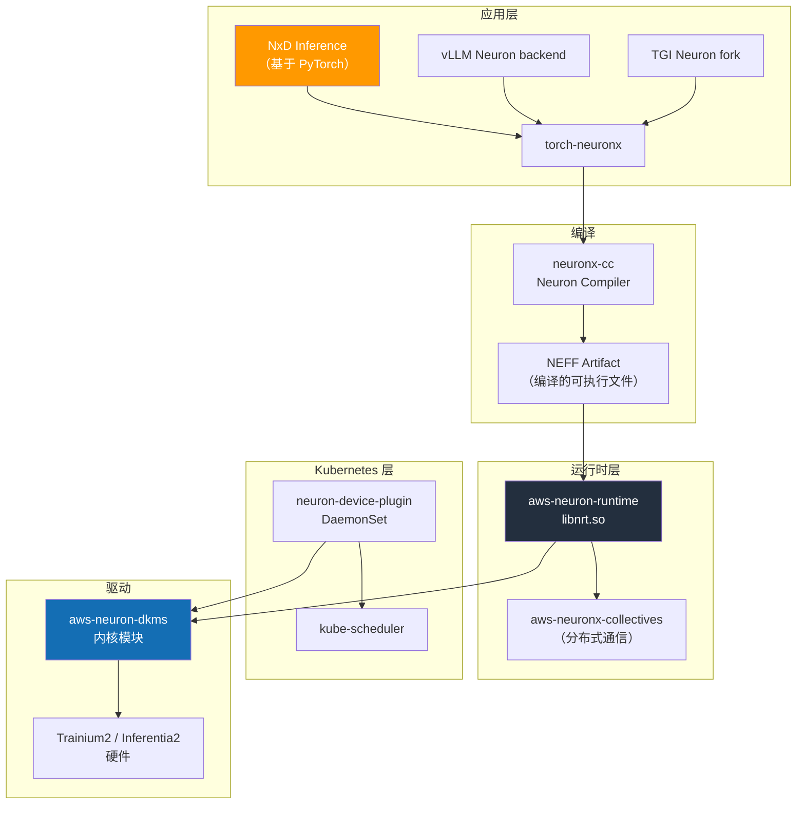
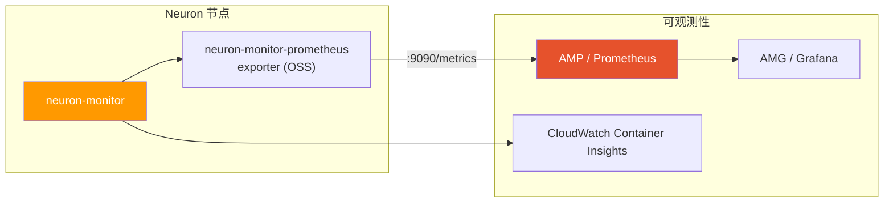

# AWS Neuron Stack

AWS Neuron 是用于在 AWS 设计的 AI 加速器（Trainium、Inferentia）上执行训练·推理工作负载的软件栈。类似于 NVIDIA 的 CUDA + GPU Operator 组合在 NVIDIA GPU 上发挥的作用，Neuron SDK + Neuron Device Plugin 在 EKS 上将 Trainium/Inferentia 芯片抽象为 Kubernetes 资源。

本文档涵盖在 EKS 上运行 Trainium2/Inferentia2 实例所需的 Neuron 软件栈、Device Plugin、Karpenter 配置、推理框架选择标准。关于 NVIDIA GPU 栈请参阅 [NVIDIA GPU 栈](./nvidia-gpu-stack.md)，关于节点类型选择请参阅 [EKS GPU 节点策略](./eks-gpu-node-strategy.md)。

| 层次 | 作用 | 核心组件 |
|------|------|-------------|
| **基础设施自动化** | Neuron 驱动、运行时、Device Plugin | aws-neuron-dkms, neuron-device-plugin |
| **编译器** | 模型 → NEFF（Neuron Executable）编译 | neuronx-cc (Neuron Compiler) |
| **运行时** | NeuronCore 执行、内存管理 | aws-neuron-runtime, neuronx-collectives |
| **推理框架** | 大规模 LLM 服务 | NxD Inference, vLLM Neuron backend, TGI Neuron |
| **观测** | NeuronCore 指标、性能分析 | neuron-monitor, neuron-top, neuron-ls |

---

## 1. 为什么选择 Neuron

### 1.1 选择 Neuron 的三个理由

**1) 成本效益（Per-Token TCO）**

根据 AWS 官方资料，Trainium2/Inferentia2 相比同等性能 GPU 的每 token 成本更低。特别是在以下条件下效果显著。

- 长期（> 3 个月）持续的稳定推理流量
- 基于 FP8/INT8/BF16 的标准 Transformer 系列模型
- 可应用 AWS Reserved/Savings Plan 的工作负载

**2) Capacity 可用性**

在 NVIDIA H100/H200/B200 供应紧张的时期，Trainium2 相对容易获得。特别是在美国/亚洲特定地区 p5/p5en 库存不足时，Neuron 成为实际替代方案。

**3) 与 Bedrock 的连续性**

Bedrock 服务的部分 FM（Claude、Llama、Titan 等）内部在 Neuron 栈上运行。在 Bedrock → Self-hosted 迁移路径中选择 Neuron，可以重用编译的工件和运营模式。

### 1.2 适合/不适合的工作负载

| 分类 | 工作负载 |
|------|---------|
| **适合** | 标准 Llama/Mistral/Qwen 系列推理、大规模长期运营、基于 FP8/BF16 的服务、Bedrock 风格治理 |
| **需注意** | 新架构首次发布模型（支持延迟）、依赖自定义 CUDA 内核的工作负载、部分 AWQ/GPTQ 量化格式 |
| **不适合** | 研究·实验环境中频繁更改模型结构的情况、与 CUDA 专用库（Triton inference server custom kernels）强耦合的代码 |

:::info Neuron vs NVIDIA 决策原则
- **模型生态系统最新性是核心** → NVIDIA GPU (H100/H200/B200)
- **长期运营 TCO / Capacity 是核心** → Trainium2 / Inferentia2
- **与 Bedrock 混合运营** → 优先考虑 Neuron
:::

---

## 2. 实例阵容

基于 AWS 官方产品页面和 EC2 用户指南的 2026-04 时点 Neuron 实例阵容。实际区域可用性需在 AWS 控制台确认。

### 2.1 推理专用实例（Inferentia2）

| 实例 | 芯片数 | NeuronCore | 总加速器内存 | vCPU | 内存 | 网络 |
|---------|------|-----------|----------------|------|-------|---------|
| inf2.xlarge | 1× Inferentia2 | 2 | 32 GB | 4 | 16 GB | 最高 15 Gbps |
| inf2.8xlarge | 1× Inferentia2 | 2 | 32 GB | 32 | 128 GB | 最高 25 Gbps |
| inf2.24xlarge | 6× Inferentia2 | 12 | 192 GB | 96 | 384 GB | 50 Gbps |
| inf2.48xlarge | 12× Inferentia2 | 24 | 384 GB | 192 | 768 GB | 100 Gbps |

### 2.2 训练·推理兼用实例（Trainium1/Trainium2）

| 实例 | 芯片数 | NeuronCore | 总加速器内存 | vCPU | 内存 | 网络 |
|---------|------|-----------|----------------|------|-------|---------|
| trn1.2xlarge | 1× Trainium1 | 2 | 32 GB | 8 | 32 GB | 最高 12.5 Gbps |
| trn1.32xlarge | 16× Trainium1 | 32 | 512 GB | 128 | 512 GB | 800 Gbps EFA |
| trn1n.32xlarge | 16× Trainium1 | 32 | 512 GB | 128 | 512 GB | 1,600 Gbps EFA |
| trn2.48xlarge | 16× Trainium2 | 128 | 1.5 TB (HBM3) | 192 | 2 TiB | 3.2 Tbps EFA v3 |
| **trn2 Ultra** (trn2u.48xlarge, preview/limited availability) | 64× Trainium2 (4×trn2 NeuronLink) | 512 | 6 TB (HBM3) | - | - | 12.8 Tbps |

:::caution 版本·数值注意
- NeuronCore 数量和内存容量基于 AWS 官方资料，可能因 SDK 版本不同报告单位有所变化。部署前请使用 `neuron-ls` 确认实际设备。
- **trn2 Ultra(trn2u)** 根据 AWS 官方公告是"通过 NeuronLink 连接 4 个 trn2 的 ultraserver"。**截至 2026-04 时点可能处于 preview 或有限可用性**，一般可用性·区域范围·Spot 支持需向 AWS 客户团队或官方文档确认。
- inf1（第一代 Inferentia）不在本文档涵盖范围。新部署请使用 Inferentia2/Trainium2。
:::

---

## 3. Neuron SDK 2.x 栈架构

### 3.1 层次结构



### 3.2 核心组件

| 组件 | 说明 | 部署形态 |
|---------|------|---------|
| **aws-neuron-dkms** | Linux 内核模块。创建 `/dev/neuron*` 设备节点 | AMI 预安装或 DKMS 包 |
| **aws-neuron-runtime (libnrt)** | NeuronCore 执行、内存管理、调度 | 包含在容器镜像中 |
| **aws-neuronx-collectives** | 分布式训练·推理用 collectives（AllReduce、AllGather 等） | 包含在容器镜像中 |
| **neuronx-cc** | 图编译器。将 PyTorch/JAX 模型转换为 NEFF | 在开发·构建阶段使用 |
| **torch-neuronx** | PyTorch 2.x 前端。`torch.compile(backend="neuronx")` | pip 包 |
| **neuron-device-plugin** | Kubernetes Device Plugin。注册 `aws.amazon.com/neuron*` 资源 | DaemonSet |
| **neuron-monitor / neuron-top / neuron-ls** | 观测和性能分析工具 | 容器镜像/CLI |

:::info Neuron SDK 2.x（2026-04 时点最新稳定版本）
Neuron SDK 在 2.x 发布系列中定期更新。2026-04 时点最新稳定版本的主要特性：

- Trainium2 (trn2) + trn2 Ultra(NeuronLink) 正式支持
- NxD Inference 的 LLM 库（Llama 3/4、DBRX、Mistral 系列 pre-compiled checkpoint）
- vLLM Neuron backend 正式支持（continuous batching、类 PagedAttention 结构）
- PyTorch 2.5+ / JAX 兼容
- FP8 (E4M3/E5M2) 推理路径

准确的小版本号请查看 [AWS Neuron SDK Release Notes](https://awsdocs-neuron.readthedocs-hosted.com/en/latest/release-notes/)。
:::

### 3.3 编译模型和 NEFF

Neuron 是**预编译（Ahead-of-Time）模型**。不会在 PyTorch eager 模式下直接执行，需要 `neuronx-cc` 将运算图转换为 NeuronCore 硬件指令（NEFF, Neuron Executable File Format）后才能执行。

```
PyTorch / JAX 模型
        ↓  torch-neuronx trace/compile
Neuron IR (HLO)
        ↓  neuronx-cc
NEFF (Neuron Executable) — 首次编译 5-30 分钟，之后缓存复用
        ↓  aws-neuron-runtime
Trainium / Inferentia 硬件执行
```

**运营方面的含义：**
- 首次 Pod 启动时 NEFF 编译可能需要 20-30 分钟以上 → **预编译后缓存到 S3/ECR**
- 模型权重更改时需要重新编译 → 在 CI 流水线中一起管理 NEFF 工件
- NxD Inference 为官方模型提供 **pre-compiled checkpoint**，缩短初始启动时间

---

## 4. EKS 集成

### 4.1 Neuron Device Plugin 部署

Neuron Device Plugin 将节点的 `/dev/neuron*` 设备注册为 Kubernetes 扩展资源。使用 AWS 官方 YAML/Helm chart。

```bash
# 官方 YAML 部署示例
kubectl apply -f https://raw.githubusercontent.com/aws-neuron/aws-neuron-sdk/master/src/k8/k8s-neuron-device-plugin.yml
kubectl apply -f https://raw.githubusercontent.com/aws-neuron/aws-neuron-sdk/master/src/k8/k8s-neuron-device-plugin-rbac.yml
```

部署后节点资源中会显示以下内容。

```bash
kubectl describe node <trn2-node> | grep aws.amazon.com
# Allocatable:
#   aws.amazon.com/neuron:       16    # trn2.48xlarge: Trainium2 芯片数
#   aws.amazon.com/neuroncore:  128    # 总 NeuronCore 数
#   aws.amazon.com/neurondevice: 16    # 设备文件数
```

### 4.2 资源请求模式

在 Pod 规范中请求 Neuron 资源时，从三种单位中选择一种。

| 资源 | 含义 | 使用时机 |
|-------|------|---------|
| `aws.amazon.com/neuron` | Neuron 芯片单位（trn2 的 Trainium2 芯片） | 芯片单位分配明确的情况 |
| `aws.amazon.com/neuroncore` | NeuronCore 单位（trn2 每芯片 8 个） | 精细的核心单位调度 |
| `aws.amazon.com/neurondevice` | `/dev/neuron*` 设备文件单位 | 遗留/特定工具兼容 |

```yaml
# 示例：使用整个 trn2.48xlarge（16 个芯片 = 128 个 NeuronCore）
apiVersion: v1
kind: Pod
metadata:
  name: llama3-70b-neuron
spec:
  nodeSelector:
    node.kubernetes.io/instance-type: trn2.48xlarge
  tolerations:
    - key: aws.amazon.com/neuron
      operator: Exists
      effect: NoSchedule
  containers:
    - name: server
      image: public.ecr.aws/neuron/pytorch-inference-neuronx:2.x
      resources:
        limits:
          aws.amazon.com/neuron: "16"
        requests:
          aws.amazon.com/neuron: "16"
```

```yaml
# 示例：仅使用 4 个 NeuronCore（inf2.xlarge 2 个 + 一半 NeuronCore）
resources:
  limits:
    aws.amazon.com/neuroncore: "4"
```

### 4.3 节点 Taint / Toleration 模式

建议使用与 NVIDIA GPU 节点相同的模式。

```yaml
# 在节点上应用 taint（在 Karpenter NodePool 中设置）
taints:
  - key: aws.amazon.com/neuron
    effect: NoSchedule
```

```yaml
# 在 Pod 中声明 toleration
tolerations:
  - key: aws.amazon.com/neuron
    operator: Exists
    effect: NoSchedule
```

### 4.4 AMI 选择

| AMI | Neuron 驱动 | 推荐用途 |
|-----|--------------|---------|
| **EKS Optimized AMI (Neuron)** | 预安装 | 生产标准 — `--ami-type AL2023_x86_64_NEURON` 或等效 |
| **Deep Learning AMI (Neuron)** | 预安装 + Neuron SDK tools | 开发/调试节点 |
| **通用 AL2023** | 手动安装（DKMS） | 不推荐 |

在 EKS 托管节点组中使用 Neuron 优化 AMI 时，`nodeadm` 会自动配置 Neuron 驱动。

---

## 5. Karpenter NodePool 示例

### 5.1 trn2 训练/大型推理 NodePool

```yaml
apiVersion: karpenter.sh/v1
kind: NodePool
metadata:
  name: neuron-trn2
spec:
  template:
    metadata:
      labels:
        accelerator: neuron
        accelerator-family: trainium2
    spec:
      requirements:
        - key: karpenter.k8s.aws/instance-family
          operator: In
          values: ["trn2"]
        - key: karpenter.sh/capacity-type
          operator: In
          values: ["spot", "on-demand"]
        - key: topology.kubernetes.io/zone
          operator: In
          values: ["us-east-2a", "us-east-2b", "us-east-2c"]
      taints:
        - key: aws.amazon.com/neuron
          effect: NoSchedule
      nodeClassRef:
        group: karpenter.k8s.aws
        kind: EC2NodeClass
        name: neuron-nodeclass
  disruption:
    consolidationPolicy: WhenEmpty
    consolidateAfter: 10m
  limits:
    aws.amazon.com/neuron: "64"
```

### 5.2 inf2 低成本推理 NodePool

```yaml
apiVersion: karpenter.sh/v1
kind: NodePool
metadata:
  name: neuron-inf2
spec:
  template:
    metadata:
      labels:
        accelerator: neuron
        accelerator-family: inferentia2
    spec:
      requirements:
        - key: karpenter.k8s.aws/instance-family
          operator: In
          values: ["inf2"]
        - key: karpenter.sh/capacity-type
          operator: In
          values: ["spot", "on-demand"]
      taints:
        - key: aws.amazon.com/neuron
          effect: NoSchedule
      nodeClassRef:
        group: karpenter.k8s.aws
        kind: EC2NodeClass
        name: neuron-nodeclass
  limits:
    aws.amazon.com/neuron: "48"
```

### 5.3 EC2NodeClass（Neuron AMI）

```yaml
apiVersion: karpenter.k8s.aws/v1
kind: EC2NodeClass
metadata:
  name: neuron-nodeclass
spec:
  amiSelectorTerms:
    - alias: al2023@latest   # 使用 Neuron 优化 AMI variant 时建议明确指定 id
  role: KarpenterNodeRole-eks-genai
  subnetSelectorTerms:
    - tags:
        karpenter.sh/discovery: eks-genai
        subnet-type: private
  securityGroupSelectorTerms:
    - tags:
        karpenter.sh/discovery: eks-genai
  blockDeviceMappings:
    - deviceName: /dev/xvda
      ebs:
        volumeSize: 500Gi   # NEFF 缓存 + 模型权重空间
        volumeType: gp3
        iops: 16000
        throughput: 1000
        encrypted: true
  metadataOptions:
    httpTokens: required
```

:::tip AMI 选择注意事项
Karpenter EC2NodeClass 的 `amiSelectorTerms` 中的 `al2023` alias 指的是标准 AL2023 AMI。要使用预装 Neuron 驱动的 variant，请指定 AWS 发布的 Neuron optimized AMI 的 SSM parameter 或明确的 AMI ID。虽然也可以通过 UserData 安装 Neuron DKMS，但不推荐这种方式。
:::

---

## 6. 推理框架

在 Neuron 上服务 LLM 的主要框架有三种。

### 6.1 NxD Inference（Neuron Distributed Inference）

AWS 官方维护的**大规模 LLM 推理库**。基于 PyTorch，为 Llama 系列和主要开源模型提供 Tensor/Pipeline Parallelism、Continuous Batching、类 PagedAttention 内存管理、Speculative Decoding。

**特性：**
- Llama 3/4、DBRX、Mistral、Mixtral 等**官方提供 pre-compiled checkpoint**
- NeuronCore 单位的 TP/PP 配置 API
- 与 Bedrock 内部服务路径相似的优化配置
- Apache 2.0 / AWS 官方支持

### 6.2 vLLM Neuron backend

vLLM 的 Neuron 后端从 2024 年开始实验性引入，2025~2026 时点功能 parity 快速改善。截至 2026-04，主要 LLM（Llama 3/4、Qwen、Mistral）可实现 continuous batching 和 OpenAI 兼容 API 服务。

**特性：**
- 以 `vllm --device neuron --tensor-parallel-size N` 形式与现有 vLLM 部署脚本兼容
- PagedAttention 本身是 CUDA 实现，但 Neuron backend 提供等效的块单位 KV 管理
- 最新 vLLM 功能（speculative decoding、chunked prefill、prefix caching）的 Neuron parity 因功能而异，**必须确认发布说明**

### 6.3 TGI（Text Generation Inference）Neuron fork

HuggingFace 维护的 TGI 的 **optimum-neuron** 基础 fork。通过 `optimum[neuronx]` 简单地将 HuggingFace 模型编译·服务到 Neuron。

**特性：**
- 与基于 HuggingFace Hub 的工作流紧密集成
- TGI 本身从 2025 年进入维护模式 → 新功能相比 vLLM 较慢
- 与 SageMaker 的 HuggingFace LLM DLC 兼容

### 6.4 框架比较

| 项目 | NxD Inference | vLLM Neuron backend | TGI Neuron fork |
|------|--------------|--------------------|-----------------| 
| **维护主体** | AWS 官方 | vLLM 社区 + AWS 贡献 | HuggingFace + AWS 贡献 |
| **模型覆盖范围** | AWS 选定的官方模型（Llama/Mistral/DBRX 等） | vLLM 支持模型中已移植到 Neuron 的 | HuggingFace 模型中 optimum-neuron 支持的 |
| **pre-compiled checkpoint** | 提供 | 部分 | 部分 |
| **OpenAI 兼容 API** | 支持 | 支持 | 支持 |
| **Continuous Batching** | 支持 | 支持 | 支持 |
| **Speculative Decoding** | 支持（按模型） | 部分支持 | 有限 |
| **Prefix Caching** | 按模型 | 有限 | 有限 |
| **更新速度** | AWS 发布周期 | vLLM 发布周期（快） | 慢（维护模式） |
| **推荐用途** | AWS 官方模型大规模生产 | 多样模型·功能最新功能利用 | HuggingFace 生态连续性 |

:::tip 框架选择指南
- **Llama 系列大规模生产** → NxD Inference（pre-compiled checkpoint 优势）
- **多样模型、利用最新 vLLM 功能** → vLLM Neuron backend
- **基于 HuggingFace Hub 的现有流水线** → TGI Neuron fork
- **新项目**建议在 NxD Inference 或 vLLM Neuron 中选择一种
:::

---

## 7. 支持模型矩阵

基于 AWS Neuron 官方 Model Zoo 和 NxD Inference 支持矩阵。最新支持范围请查看 [AWS Neuron Samples GitHub](https://github.com/aws-neuron/aws-neuron-samples) 和 [NxD Inference 文档](https://awsdocs-neuron.readthedocs-hosted.com/en/latest/libraries/nxd-inference/index.html)。

### 7.1 主要官方支持模型（2026-04 时点）

| 模型 | 大小 | 推荐实例 | Pre-compiled | 备注 |
|------|-----|------------|-------------|------|
| Llama 3.1 8B / 70B | 8B / 70B | inf2.48xlarge / trn2.48xlarge | ✅ | NxD 官方 |
| Llama 3.3 70B | 70B | trn2.48xlarge | ✅ | NxD 官方 |
| Llama 4 (Scout/Maverick) | 17B-400B | trn2.48xlarge / trn2 Ultra | 按发布确认 | NxD 支持扩展中 |
| Mistral 7B / Mixtral 8x7B | 7B / 47B | inf2.48xlarge | ✅ | NxD/vLLM 支持 |
| Mixtral 8x22B | 141B | trn2.48xlarge | 部分 | MoE，需要 EP |
| Qwen3 系列 | 4B-32B | inf2 / trn2 | 部分 | 建议通过 vLLM Neuron backend |
| DBRX 132B | 132B | trn2.48xlarge | ✅ | NxD 官方（MoE） |
| DeepSeek V3 | 671B MoE | trn2 Ultra | 有限 | 需确认编译·内存限制 |

:::caution 未来支持模型
DeepSeek V3、Llama 4 Maverick、GLM-5 等最新大型 MoE 模型的 Neuron 支持将逐步添加。部署前务必确认**该时点的 NxD Inference 支持矩阵和 Release Notes**。本文档中的表格仅供参考，不保证具体版本的支持情况。
:::

### 7.2 量化支持

| 格式 | Neuron 支持 |
|------|------------|
| BF16 | 默认 |
| FP16 | 支持 |
| FP8 (E4M3, E5M2) | Trainium2 支持，Inferentia2 有限 |
| INT8 (weights) | 支持（按模型） |
| AWQ | 有限（需按模型·版本确认） |
| GPTQ | 有限 |
| GGUF | 不支持 |

---

## 8. 可观测性

### 8.1 Neuron 专用工具

| 工具 | 作用 | 使用时机 |
|-----|------|---------|
| **neuron-ls** | 列出节点的 Neuron 设备 | 初始诊断 |
| **neuron-top** | 实时 NeuronCore 使用率、内存、功耗 | 实时监控 |
| **neuron-monitor** | JSON 格式指标流 | Prometheus exporter 输入 |
| **neuron-profile** | NEFF 执行性能分析 | 性能优化 |

### 8.2 Prometheus / CloudWatch 集成



**采集链：**
- `neuron-monitor` 以 JSON 流输出 NeuronCore 使用率、HBM 使用量、设备温度、执行延迟等
- OSS 社区的 `neuron-monitor-prometheus` exporter 将其转换为 Prometheus 格式
- 在 AMP（Amazon Managed Prometheus）中通过 remote-write 采集，在 AMG（Amazon Managed Grafana）中仪表板化
- CloudWatch Container Insights 的 Neuron 指标也可一起使用

详细 AMP/AMG 配置请参阅[监控·Observability 设置](../../reference-architecture/monitoring-observability-setup.md)。

### 8.3 主要指标

| 指标 | 说明 | 用途 |
|-------|------|------|
| `neuron_core_utilization` | NeuronCore 使用率（%） | HPA/KEDA 触发器 |
| `neuron_device_memory_used` | HBM 使用量（MB） | OOM 防止、容量规划 |
| `neuron_execution_latency` | 推理请求处理延迟 | SLO 监控 |
| `neuron_hardware_ecc_events` | ECC 错误数 | 硬件健康检查 |
| `neuron_power_watts` | 每芯片功耗（W） | 散热·成本管理 |

---

## 9. 限制和注意事项

### 9.1 功能限制

| 类别 | 限制 |
|------|------|
| **自定义内核** | CUDA 专用内核（FlashAttention custom impl 等）需要直接移植到 Neuron |
| **量化** | 部分 AWQ/GPTQ 变种、GGUF 不支持 |
| **编译时间** | 新模型首次编译 20-30 分钟以上 → NEFF 缓存必需 |
| **调试** | 相比 nvidia-smi，GPU 遥测工具生态较窄 |
| **开源生态** | 缺少类似 NVIDIA GPU Operator / DCGM 的"统一编排器" — 需组合 Neuron Device Plugin + 单独 exporter |

### 9.2 运营注意事项

:::warning 生产部署前检查清单
- [ ] 确认目标模型在 NxD Inference 或 vLLM Neuron backend **当前版本中是否支持**
- [ ] 在 **CI 阶段预编译**模型 NEFF 并作为工件管理到 S3/ECR
- [ ] 考虑首次 Pod 启动延迟，设置 `readinessProbe` / `startupProbe`（initialDelaySeconds 足够大）
- [ ] 验证 HPA/KEDA 触发器指标中 `neuron_core_utilization` 是否正常采集
- [ ] 确认各区域 Trainium2 容量并制定 Spot 中断策略
- [ ] 与 Bedrock 混合运营时明确模型版本同步策略
:::

### 9.3 Neuron 应避免的工作负载

- 每周更改模型结构的 R&D 实验 — 编译成本反复发生
- 已深度耦合 Triton Inference Server + 自定义 Python backend 的现有栈
- 非常小的请求（&lt;10 tokens/sec）的罕见调用 — 预热·编译开销相对较大

---

## 10. 相关文档

- [EKS GPU 节点策略](./eks-gpu-node-strategy.md) — AWS 加速器选择指南，NVIDIA vs Neuron
- [NVIDIA GPU 栈](./nvidia-gpu-stack.md) — 与 NVIDIA 栈的比较标准
- [GPU 资源管理](./gpu-resource-management.md) — 基于 Karpenter/KEDA/DRA 的自动扩展
- [vLLM 模型服务](../inference-frameworks/vllm-model-serving.md) — 基于 vLLM 的推理引擎（CUDA 路径）
- [MoE 模型服务](../inference-frameworks/moe-model-serving.md) — MoE 结构概念和 Trainium2 部署策略
- [监控·Observability 设置](../../reference-architecture/monitoring-observability-setup.md) — AMP/AMG、Langfuse、OTel

## 参考资料

- [AWS Neuron SDK GitHub (aws-neuron)](https://github.com/aws-neuron/aws-neuron-sdk)
- [AWS Neuron Documentation](https://awsdocs-neuron.readthedocs-hosted.com/)
- [AWS Neuron Samples](https://github.com/aws-neuron/aws-neuron-samples)
- [NxD Inference Documentation](https://awsdocs-neuron.readthedocs-hosted.com/en/latest/libraries/nxd-inference/index.html)
- [Neuron SDK Release Notes](https://awsdocs-neuron.readthedocs-hosted.com/en/latest/release-notes/)
- [AWS Trainium2 产品页面](https://aws.amazon.com/machine-learning/trainium/)
- [AWS Inferentia2 产品页面](https://aws.amazon.com/machine-learning/inferentia/)
- [vLLM Neuron backend 文档](https://docs.vllm.ai/en/latest/getting_started/installation.html#neuron-installation)
- [optimum-neuron (HuggingFace)](https://github.com/huggingface/optimum-neuron)
- [AWS Neuron Kubernetes Device Plugin](https://github.com/aws-neuron/aws-neuron-sdk/tree/master/src/k8)
