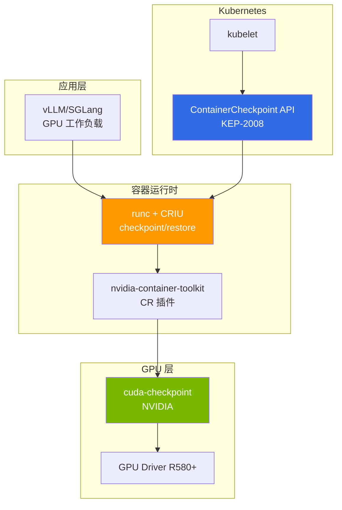

:::caution 实验性/研究预览
截至 2026.04，GPU CRIU 的 NVIDIA cuda-checkpoint + CRIU + runc 集成处于 alpha/beta 状态，不可用于生产环境。本文档旨在提供技术趋势和验证检查清单。
:::

# 基于 CRIU 的 GPU 无中断迁移（预览）

## 1. 为什么选择 CRIU：Spot 回收与 KV cache 丢失问题

### 问题场景

在大型 LLM 服务环境中，使用 Spot 实例是成本节约的核心策略（85-94% 节约）。然而，当 Spot 回收发生时会出现以下问题：

**p5en.48xlarge H200×8 环境中的 GLM-5（744B MoE）案例：**

| 项目 | 时间 | 备注 |
|------|-----|------|
| Spot 回收警告 | 2分钟 | AWS 提供的唯一时间 |
| 模型重新加载时间 | 15-20分钟 | 744B 参数权重加载 |
| KV Cache 预热 | 5-10分钟 | 主要 prefix 重新生成 |
| **总恢复时间** | **22-32分钟** | 无法处理紧急请求 |
| **成本** | $40-65/回收 | 按 p5en 每小时约 $120 计算 |

**Spot 回收的根本限制：**

```
Spot 回收警告（2分钟）
  ↓
  ├─ gracefulShutdown（1-2分钟）— 完成进行中的请求
  ├─ 模型卸载（30秒-1分钟）— 释放内存
  └─ Pod 终止
       ↓
  新节点配置（3-5分钟）
       ↓
  模型重新加载（15-20分钟）← 瓶颈
       ↓
  KV Cache 预热（5-10分钟）← 瓶颈
       ↓
  服务恢复（总计 25-37分钟）
```

### 现有替代方案的局限性

| 替代方案 | 优点 | 局限性 |
|------|------|------|
| **Warm Replica** | 可立即切换 | GPU 成本翻倍（$240/hr → $480/hr）|
| **llm-d KV Offload** | 仅传输 KV Cache | 仍需要模型重新加载 |
| **On-Demand fallback** | 稳定 | 比 Spot 贵 10 倍 |
| **Multi-AZ 分布** | 应对 AZ 故障 | 无法解决 Spot 回收本身 |

### CRIU 要解决的核心问题

CRIU（Checkpoint/Restore In Userspace）可以将运行中进程的**完整状态**保存到磁盘（checkpoint），并在另一个节点上从该时间点恢复（restore）。

**应用于 GPU 工作负载时的预期效果：**

```
Spot 回收警告（2分钟）
  ↓
  CRIU checkpoint（1-2分钟）— GPU 内存 + 进程状态 dump
  ↓
  新节点配置（3-5分钟）
  ↓
  CRIU restore（1-3分钟）← 跳过模型重新加载
  ↓
  服务恢复（总计 5-10分钟，缩短 70-80%）
```

**节约效果：**

- **恢复时间**：25-37分钟 → 5-10分钟（缩短 70-80%）
- **成本**：每次回收 $40-65 → $10-20（节约 50-70%）
- **SLA**：可在 5 分钟内处理紧急请求，而非 22 分钟

---

## 2. 技术栈现状（2026.04）

### 整体架构



### 核心组件成熟度

| 组件 | 版本 | 状态 | 备注 |
|---------|------|------|------|
| **CRIU** | v4.0+ | 稳定 | CPU 工作负载已有生产验证 |
| **cuda-checkpoint** | alpha/beta | **实验性** | NVIDIA 官方工具，GPU 内存 dump |
| **nvidia-container-toolkit** | v1.17+ | Beta | 包含 CR（checkpoint/restore）插件 |
| **runc** | v1.2+ | Alpha | CRIU 集成，支持 GPU CR |
| **K8s ContainerCheckpoint API** | 1.30 alpha | **Alpha** | KEP-2008，需要 feature gate |
| **EKS 支持** | - | **不支持** | 需要自行验证 |

:::warning 成熟度警告
- **cuda-checkpoint**：NVIDIA Labs 项目，处于 beta 以下。无官方支持
- **K8s API**：1.30 alpha，预计 1.34 达到 beta。GA 预计在 1.35+
- **EKS**：ContainerCheckpoint API 是 feature gate，EKS 是否启用尚不明确
- **生产案例**：截至 2026.04，无公开的 GPU CRIU 生产案例
:::

### 技术栈详细信息

#### CRIU（Checkpoint/Restore In Userspace）

- **作用**：checkpoint Linux 进程的内存、文件描述符、网络套接字、线程状态
- **GPU 限制**：默认无法识别 GPU 内存 → 需要 cuda-checkpoint
- **成熟度**：CPU 工作负载有 10 年以上历史，稳定。Docker/Podman 也在使用

#### cuda-checkpoint（NVIDIA）

- **GitHub**：[NVIDIA/cuda-checkpoint](https://github.com/NVIDIA/cuda-checkpoint)
- **作用**：dump/restore CUDA context、GPU 内存（device memory）、unified memory
- **限制条件**：
  - H100/H200：device memory 最大 80GB/141GB → checkpoint 文件大小相同
  - PCIe BAR 重映射：仅可 restore 到具有相同 GPU UUID 的节点
  - NVLink topology 固定：多 GPU 工作负载需要相同拓扑
  - CUDA 版本一致：checkpoint/restore 时必须使用相同 CUDA 版本

#### nvidia-container-toolkit CR 插件

- **作用**：当 containerd/runc checkpoint/restore GPU 容器时自动调用 cuda-checkpoint
- **配置**：在 `/etc/nvidia-container-runtime/config.toml` 中设置 `checkpoint-restore = true`
- **现状**：v1.17+ 提供实验性支持

#### K8s ContainerCheckpoint API（KEP-2008）

```yaml
# K8s 1.30+（alpha，需要 feature gate）
apiVersion: v1
kind: Pod
metadata:
  name: vllm-pod
spec:
  enableServiceLinks: false
  containers:
  - name: vllm
    image: vllm/vllm-openai:latest
    # checkpoint 目标容器
```

**创建 checkpoint：**

```bash
kubectl checkpoint create <pod-name> \
  --container=vllm \
  --output=/var/lib/kubelet/checkpoints/vllm-ckpt.tar
```

**restore（在新节点上）：**

```bash
kubectl apply -f pod-restore.yaml  # 引用 checkpoint 路径
```

:::caution K8s API 限制
- 1.30：alpha，需要 feature gate `ContainerCheckpoint=true`
- EKS Auto Mode：无法控制 feature gate → 不可用
- EKS Standard Mode：需要修改 kube-apiserver/kubelet flag
:::

---

## 3. GPU 状态 checkpoint 的根本限制

### Device Memory Dump 大小

| GPU | VRAM | checkpoint 文件大小 | 传输时间（10GbE）| 传输时间（100GbE）|
|-----|------|-------------------|-----------------|------------------|
| A100 40GB | 40GB | ~40GB | 32秒 | 3.2秒 |
| H100 80GB | 80GB | ~80GB | 64秒 | 6.4秒 |
| H200 141GB | 141GB | ~141GB | 113秒 | 11.3秒 |
| H200 x8 | 1,128GB | ~1,128GB | **15分钟** | **1.5分钟** |

:::warning 网络瓶颈
p5en.48xlarge（H200×8）的 checkpoint 为 **1.1TB**。如果需要节点间传输：
- 10GbE：15 分钟（Spot 回收 2 分钟内不可能）
- 100GbE：1.5 分钟（Spot 回收 2 分钟内可能，但受 ENA 限制）
- **实际上节点间 migrate 不可行**，仅同节点重启现实可行
:::

### PCIe BAR 重映射限制

GPU 通过 PCIe Base Address Register（BAR）与 CPU 通信。checkpoint 时保存的 BAR 地址**依赖于硬件**，因此有以下限制：

| 场景 | 可行性 | 原因 |
|---------|---------|------|
| 同节点重启 | ✅ | 相同 PCIe 插槽，相同 BAR 地址 |
| 相同实例类型（同 AZ）| ⚠️ 实验性 | 难以保证 GPU UUID 一致 |
| 相同实例类型（跨 AZ）| ❌ | PCIe 拓扑不同 |
| 异构（H200→H100）| ❌ | 架构和内存大小不同 |

### NVLink Topology 固定

多 GPU 工作负载（TP=4、TP=8）依赖于 GPU 之间的 NVLink 连接结构。checkpoint 将 **GPU 索引和 NVLink 拓扑保存为绝对路径**，因此：

```
原始：
  GPU 0 <--NVLink--> GPU 1
  GPU 2 <--NVLink--> GPU 3

在不同拓扑上 Restore：
  GPU 0 <--PCIe--> GPU 1  ← NVLink 断开
  GPU 2 <--NVLink--> GPU 3
  → Tensor Parallelism 通信失败
```

**结论**：TP>1 工作负载**仅可 restore 到具有相同 NVLink 配置的节点**

### CUDA Context 版本一致

- **CUDA Runtime 版本**：checkpoint/restore 时必须使用相同 CUDA 版本（12.2 ↔ 12.3 不可）
- **Driver ABI 兼容性**：GPU 驱动主版本需一致（R580 ↔ R570 不可）
- **AMI 固定**：EKS Auto Mode 无法控制驱动版本 → 需要 Karpenter + Custom AMI

---

## 4. EKS 应用场景矩阵

### 各场景可行性

| 场景 | 可行性 | 复杂度 | 备注 |
|---------|-----------|-------|------|
| **(a) 同节点重启** | ✅ 就绪 | 中等 | OS 更新、kubelet 重启 |
| **(b) 相同实例类型 migrate** | ⚠️ 实验性 | 高 | 难以保证 GPU UUID 一致 |
| **(c) 异构 migrate（H200↔H100）**| ❌ 阻止 | - | 架构不同 |
| **(d) 跨 AZ migrate** | ❌ 阻止 | - | 推荐 NIXL |

### (a) 同节点重启 — 就绪

**使用场景：**
- 无 Spot 回收的节点 OS 更新
- kubelet/containerd 重启
- GPU 驱动更新（相同主版本）

**流程：**

```bash
# 1. 创建 Checkpoint
kubectl checkpoint create gpu-pod-1 \
  --container=vllm \
  --output=/mnt/efs/checkpoints/vllm-$(date +%s).tar

# 2. 节点维护
kubectl drain <node> --ignore-daemonsets
# ... OS 更新、驱动更新
kubectl uncordon <node>

# 3. Restore
kubectl apply -f vllm-pod-restore.yaml
```

**限制条件：**
- 必须将 checkpoint 保存到 EFS/FSx（本地磁盘重启时删除）
- 需要保持相同 GPU 索引（CUDA_VISIBLE_DEVICES）
- 需要 kubelet feature gate `ContainerCheckpoint=true`（EKS Standard）

**预期效果：**
- 重启时间：20-30分钟 → 3-5分钟（缩短 80-85%）
- 维护窗口：1小时 → 10分钟

### (b) 相同实例类型 migrate — 实验性

**使用场景：**
- Spot 回收时迁移到相同实例类型节点
- 节点更换（硬件故障）

**前提条件：**
- 相同实例类型（p5en.48xlarge → p5en.48xlarge）
- 相同 AZ（us-east-2a → us-east-2a）
- **相同 GPU UUID** — AWS 不保证 ⚠️

**GPU UUID 预检查：**

```bash
# 收集所有 p5en 节点的 GPU UUID
kubectl get nodes -l node.kubernetes.io/instance-type=p5en.48xlarge \
  -o json | jq '.items[].metadata.labels["nvidia.com/gpu.uuid"]'
```

**NodePool 限制：**

```yaml
apiVersion: karpenter.sh/v1
kind: NodePool
metadata:
  name: gpu-checkpoint-pool
spec:
  template:
    spec:
      requirements:
        - key: node.kubernetes.io/instance-type
          operator: In
          values: ["p5en.48xlarge"]  # 固定单一类型
        - key: topology.kubernetes.io/zone
          operator: In
          values: ["us-east-2a"]  # 固定单一 AZ
        # 无法保证 GPU UUID 一致 — AWS API 不支持
```

**问题：**
- AWS 不提供 GPU UUID 预约 API
- checkpoint/restore 失败时需要 fallback 到 cold start
- Spot 回收 2 分钟内无法完成 checkpoint + 网络传输 + restore

**结论：** 技术上可行但**实战运营不可行**。适合验证环境实验

### (c) 异构 migrate（H200↔H100）— 阻止

**不可行原因：**
- GPU 架构不同（Hopper vs Ada）
- VRAM 大小不同（141GB vs 80GB）
- CUDA Compute Capability 不同（9.0 vs 8.0）
- cuda-checkpoint 不支持架构间转换

### (d) 跨 AZ migrate — 阻止

**使用场景：**
- AZ 故障时迁移到其他 AZ

**替代方案：llm-d NIXL KV Offload**

跨 AZ GPU 工作负载迁移，CRIU 不如 **llm-d NIXL** 合适：

```
AZ-A：
  Prefill Pod → 通过 NIXL 将 KV Cache 传输到 AZ-B

AZ-B：
  Decode Pod ← 接收 KV Cache → 模型已加载
```

| 项目 | CRIU | llm-d NIXL |
|------|------|-----------|
| 传输数据 | 全部 GPU 内存（1TB+）| 仅 KV Cache（数十 GB）|
| 传输时间 | 15分钟+ | 数秒 |
| 模型重新加载 | 不需要 | 需要（但 Decode Pod 已加载）|
| 网络 | 10GbE → 瓶颈 | RDMA/NVLink → 超高速 |

**详情**：[llm-d EKS Auto Mode — Disaggregated Serving](../inference-frameworks/llm-d-eks-automode.md#disaggregated-serving-概念)

---

## 5. 实战替代方案与组合策略

### 替代方案对比表

| 策略 | 恢复时间 | 成本 | 复杂度 | 成熟度 | 推荐 |
|------|---------|-----|-------|-------|:----:|
| **Warm Replica** | 立即 | 2倍 | 低 | 生产 | ⭐⭐⭐ |
| **llm-d NIXL KV Offload** | 5-10分钟 | 1倍 | 中等 | GA | ⭐⭐⭐⭐ |
| **vLLM Prefix Cache Warm-up** | 10-15分钟 | 1倍 | 低 | GA | ⭐⭐⭐ |
| **Karpenter do-not-evict** | - | 无法使用 Spot | 低 | GA | ⭐⭐ |
| **2-replica Hot Standby** | 1-2分钟 | 2倍 | 低 | 生产 | ⭐⭐⭐⭐⭐ |
| **CRIU（同节点）** | 3-5分钟 | 1倍 | 高 | 实验性 | ⭐ |
| **CRIU（跨节点）** | 不可能 | - | - | 阻止 | ❌ |

### llm-d NIXL KV Offload

llm-d 的 Disaggregated Serving 分离 Prefill/Decode，通过 NIXL 传输 KV Cache。Spot 回收时：

```
Prefill Pod（Spot，p5en.48xlarge）：
  - Spot 回收警告 → checkpoint KV Cache 到 S3/FSx（数秒）
  - Pod 终止

Decode Pod（On-Demand，p5.48xlarge）：
  - 继续现有模型服务
  - 仅执行 decode，无 Prefill（暂时 TTFT 增加）

新 Prefill Pod：
  - 从 S3/FSx 恢复 KV Cache（5-10秒）
  - 恢复服务
```

**优点：**
- Decode Pod 无中断
- Prefill 恢复仅需 5-10秒
- 无需模型重新加载

**缺点：**
- TTFT 暂时增加（Prefill Pod 恢复中）

**详情**：[llm-d EKS Auto Mode](../inference-frameworks/llm-d-eks-automode.md)

### vLLM Prefix Cache Warm-up

vLLM v0.18+ 支持自动 prefix caching。Spot 回收前可预先处理主要 prefix 来预热缓存：

```python
# warm-up 脚本
prefixes = [
    "You are a helpful assistant...",
    "Analyze the following document...",
    # ... 主要系统提示
]

for prefix in prefixes:
    client.completions.create(
        model="gpt-4",
        prompt=prefix,
        max_tokens=1  # 最小生成仅预热缓存
    )
```

**优点：**
- vLLM 基本功能，无需额外工具
- Spot 回收后主要 prefix 快速响应

**缺点：**
- 模型重新加载仍需 15-20 分钟
- 无法恢复全部 KV Cache

### Karpenter do-not-evict

Karpenter 的 `do-not-evict` annotation 可将特定 Pod 排除在 Spot 回收对象之外：

```yaml
apiVersion: v1
kind: Pod
metadata:
  annotations:
    karpenter.sh/do-not-evict: "true"
spec:
  # ... GPU Pod 定义
```

**优点：**
- 无中断

**缺点：**
- 像 On-Demand 一样使用 Spot 实例 → 丧失成本优势
- 无法阻止 AWS Spot 回收本身（annotation 仅控制 Karpenter 的自发 consolidation）

### 2-replica Hot Standby（推荐）

生产环境中最稳定的策略是**运营 2 个 replica**：

```yaml
apiVersion: apps/v1
kind: Deployment
metadata:
  name: vllm-serving
spec:
  replicas: 2  # 最少保持 2 个
  template:
    spec:
      containers:
      - name: vllm
        # ... 相同模型服务
      affinity:
        podAntiAffinity:
          requiredDuringSchedulingIgnoredDuringExecution:
          - labelSelector:
              matchLabels:
                app: vllm-serving
            topologyKey: kubernetes.io/hostname  # 部署在不同节点
```

**成本：**
- 运营 2 台时成本翻倍 → 使用 Spot 时**与 On-Demand 1 台成本相似**
- p5.48xlarge Spot $12/hr × 2 = $24/hr vs On-Demand $98/hr × 1

**优点：**
- 1 个 replica Spot 回收时另 1 个处理流量
- 恢复期间服务无中断
- 负载均衡使吞吐量翻倍

**缺点：**
- GPU 使用翻倍（但 Spot 成本与 On-Demand 1 台水平）

### 组合策略

现实中的最佳配置是 **2-replica Hot Standby + llm-d NIXL**：

```
┌─────────────────────┐
│ llm-d Gateway       │
│（KV Cache-aware LB）│
└──────────┬──────────┘
           │
    ┌──────┴───────┐
    │              │
┌───▼───┐      ┌───▼───┐
│Replica│      │Replica│
│   1   │      │   2   │
│ Spot  │      │ Spot  │
│p5.48x │      │p5.48x │
└───────┘      └───────┘
  不同 AZ        不同 AZ

Replica 1 Spot 回收：
  → llm-d 将流量切换到 Replica 2
  → KV Cache 通过 NIXL 共享（如需）
  → Replica 1 恢复（15分钟）期间服务正常
```

**优点：**
- 服务无中断
- KV Cache 重用缩短 TTFT
- 利用 Spot 实现成本效率

---

## 6. 路线图与验证要点

### CNCF/Kubernetes 社区动态

| 时期 | 主要里程碑 | 状态 |
|------|-----------|------|
| K8s 1.30 | ContainerCheckpoint API alpha | 已完成（2024.04）|
| K8s 1.32 | ContainerCheckpoint API beta | 预期（2024.12）|
| K8s 1.34 | ContainerCheckpoint API GA | 预期（2025.08）|
| K8s 1.35 | GPU checkpoint 官方支持 | 期望（2026.02）|
| **2026.04** | **当前位置** | **Alpha/Beta 混合** |

:::info CNCF WG 活动
CNCF Batch Working Group 和 AI Working Group 正在讨论 GPU checkpoint。但尚无官方 KEP，仅存在 nvidia-container-toolkit 的实验性实现。
:::

### 自行验证检查清单

要实验 CRIU GPU checkpoint，请检查以下清单：

#### 基础设施要求

- [ ] **EKS Standard Mode** — Auto Mode 无法控制 feature gate
- [ ] **K8s 1.30+** — 需要 ContainerCheckpoint API
- [ ] **kubelet feature gate** — `ContainerCheckpoint=true`
- [ ] **GPU Driver R580+** — cuda-checkpoint 兼容版本
- [ ] **Custom AMI** — 需要固定驱动版本
- [ ] **EFS/FSx 挂载** — checkpoint 文件存储（HDD 慢，推荐 SSD）

#### 软件栈

- [ ] **runc v1.2+** — CRIU 集成版本
- [ ] **CRIU v4.0+** — GPU 支持构建
- [ ] **cuda-checkpoint beta** — 从 NVIDIA Labs 下载
- [ ] **nvidia-container-toolkit v1.17+** — 启用 CR 插件
- [ ] **相同 CUDA 版本** — checkpoint/restore 节点一致

#### 节点设置

- [ ] **NodePool 单一实例类型** — 异构不可
- [ ] **单一 AZ** — 跨 AZ 不可
- [ ] **GPU UUID 收集** — 创建预映射表
- [ ] **NVLink 拓扑一致** — 多 GPU 时必需

#### 测试场景

1. **同节点重启测试**（低风险）
   - 测试 Pod checkpoint/restore
   - 模型加载时间 vs checkpoint 时间对比
   - 内存完整性验证（推理结果一致性）

2. **相同实例类型 migrate 测试**（高风险）
   - GPU UUID 手动映射
   - checkpoint 网络传输
   - restore 成功率测量
   - 失败时 fallback 流程验证

3. **Spot 回收模拟**（生产就绪）
   - 2 分钟计时器强制 checkpoint
   - 恢复时间测量
   - SLA 影响分析

### 验证失败时的处理

| 失败类型 | 处理 |
|---------|------|
| checkpoint 创建失败 | 检查 cuda-checkpoint 日志，验证 GPU 驱动版本 |
| restore 失败（GPU UUID 不一致）| 仅 restore 到同节点，重新设计 NodePool |
| restore 失败（CUDA 版本不一致）| 固定 AMI 版本，禁止驱动更新 |
| Spot 回收 2 分钟内未完成 | 缩小 checkpoint 大小，扩大网络带宽，或放弃 CRIU |
| 性能下降 | 测量 CRIU overhead，考虑 warm-up 时间 |

---

## 参考资料

- **CRIU 官方文档**：[criu.org](https://criu.org/)
- **NVIDIA cuda-checkpoint GitHub**：[github.com/NVIDIA/cuda-checkpoint](https://github.com/NVIDIA/cuda-checkpoint)
- **K8s KEP-2008**：[ContainerCheckpoint API](https://github.com/kubernetes/enhancements/tree/master/keps/sig-node/2008-forensic-container-checkpointing)
- **nvidia-container-toolkit CR 插件**：[NVIDIA Container Toolkit Docs](https://docs.nvidia.com/datacenter/cloud-native/container-toolkit/latest/)
- **llm-d NIXL**：[llm-d GitHub](https://github.com/llm-d/llm-d) — KV Cache 网络传输替代方案

## 相关文档

- [EKS GPU 节点策略](./eks-gpu-node-strategy.md) — Spot/On-Demand 策略、成本优化
- [GPU 资源管理](./gpu-resource-management.md) — Karpenter 自动扩展
- [llm-d EKS Auto Mode](../inference-frameworks/llm-d-eks-automode.md) — Disaggregated Serving + NIXL KV Offload
- [vLLM 模型服务](../inference-frameworks/vllm-model-serving.md) — Prefix Cache、KV Cache 管理
