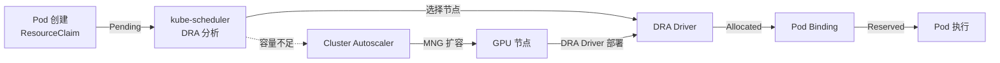
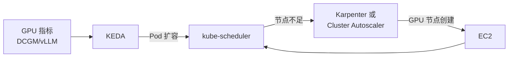
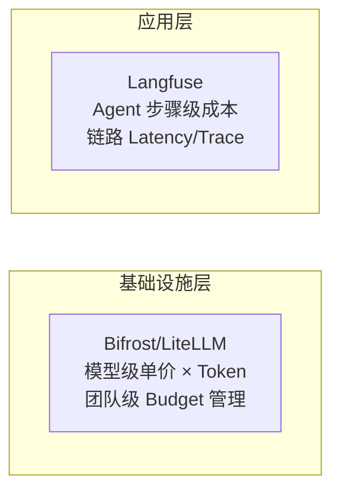

import Tabs from '@theme/Tabs';
import TabItem from '@theme/TabItem';
import { SpecificationTable, ComparisonTable } from '@site/src/components/tables';
import { DraLimitationsTable, ScalingDecisionTable } from '@site/src/components/GpuResourceTables';
import {
  SpotInstancePricingInference,
  SavingsPlansPricingTraining,
  CostOptimizationStrategies,
  KarpenterGpuOptimization
} from '@site/src/components/AgenticSolutionsTables';

# GPU 资源管理

EKS 环境中 GPU 资源管理策略由三个轴构成。

| 轴 | 核心问题 | 主要技术 |
|---|---|---|
| **配置** | 何时创建什么 GPU 节点？ | Karpenter、EKS Auto Mode、Managed Node Group |
| **调度** | GPU Pod 放置在哪个节点？ | Device Plugin、DRA、Topology-Aware Routing |
| **伸缩** | 如何应对流量变化？ | KEDA、HPA、Cluster Autoscaler |

本文档涵盖各轴的架构和设计判断标准。GPU 硬件分区（MIG、Time-Slicing）和 NVIDIA 软件栈请参阅 [NVIDIA GPU 栈](./nvidia-gpu-stack.md)。

---

## Karpenter GPU NodePool

:::info Karpenter v1.2+ GA
Karpenter 从 v1.0 起为 GA 状态，本文档所有示例使用 `karpenter.sh/v1` API。
:::

### GPU 节点自动配置概念

Karpenter 分析 Pending Pod 的资源请求（`nvidia.com/gpu`、内存、CPU）自动配置最优 EC2 实例。GPU 工作负载中 Karpenter 的核心价值如下：

- **实例多样性**：单一 NodePool 支持 p4d、p5、g5、g6e 等多种 GPU 实例
- **Spot/On-Demand 混合**：通过 capacity-type 调节成本和稳定性平衡
- **Consolidation**：自动清理闲置 GPU 节点节省成本
- **基于 Taint 的隔离**：在 GPU 节点设置 `nvidia.com/gpu` taint 排除非 GPU 工作负载

### NodePool 配置示例

```yaml
apiVersion: karpenter.sh/v1
kind: NodePool
metadata:
  name: gpu-inference-pool
spec:
  template:
    metadata:
      labels:
        node-type: gpu-inference
        workload: genai
    spec:
      requirements:
        - key: kubernetes.io/arch
          operator: In
          values: ["amd64"]
        - key: karpenter.sh/capacity-type
          operator: In
          values: ["on-demand", "spot"]
        - key: node.kubernetes.io/instance-type
          operator: In
          values:
            - p4d.24xlarge    # 8x A100 40GB
            - p5.48xlarge     # 8x H100 80GB
            - g5.48xlarge     # 8x A10G 24GB
        - key: karpenter.k8s.aws/instance-gpu-count
          operator: Gt
          values: ["0"]
      nodeClassRef:
        group: karpenter.k8s.aws
        kind: EC2NodeClass
        name: gpu-nodeclass
      taints:
        - key: nvidia.com/gpu
          value: "true"
          effect: NoSchedule
  limits:
    cpu: 1000
    memory: 4000Gi
    nvidia.com/gpu: 64
  disruption:
    consolidationPolicy: WhenEmptyOrUnderutilized
    consolidateAfter: 30s
  weight: 100
```

**设计要点：**

- `limits.nvidia.com/gpu: 64` — 集群全局 GPU 上限防止成本失控
- `disruption.consolidateAfter: 30s` — GPU 节点成本高，快速清理是关键
- `weight: 100` — 多 NodePool 中本池的优先级设置

### GPU 实例类型对比

<ComparisonTable
  headers={['实例类型', 'GPU', 'GPU 内存', 'vCPU', '内存', '网络', '用途']}
  rows={[
    { id: '1', cells: ['p4d.24xlarge', '8x A100', '40GB x 8', '96', '1152 GiB', '400 Gbps EFA', '大规模 LLM 推理'], recommended: true },
    { id: '2', cells: ['p5.48xlarge', '8x H100', '80GB x 8', '192', '2048 GiB', '3200 Gbps EFA', '超大规模模型、训练'] },
    { id: '3', cells: ['p5e.48xlarge', '8x H200', '141GB x 8', '192', '2048 GiB', '3200 Gbps EFA', '大规模模型训练/推理'] },
    { id: '4', cells: ['g5.48xlarge', '8x A10G', '24GB x 8', '192', '768 GiB', '100 Gbps', '中小规模模型推理'] },
    { id: '5', cells: ['g6e.xlarge ~ g6e.48xlarge', 'NVIDIA L40S', '最大 8x48GB', '最大 192', '最大 768 GiB', '最大 100 Gbps', '性价比推理'] },
    { id: '6', cells: ['trn2.48xlarge', '16x Trainium2', '-', '192', '2048 GiB', '1600 Gbps', 'AWS 原生训练'] }
  ]}
/>

:::tip 实例选择指南
- **p5e.48xlarge**：100B+ 参数模型，利用 H200 最大内存
- **p5.48xlarge**：70B+ 参数模型，需要最高性能时
- **p4d.24xlarge**：13B-70B 参数模型，性价比均衡
- **g6e**：13B-70B 模型，L40S 高性价比推理
- **g5.48xlarge**：7B 以下模型，高性价比推理
- **trn2.48xlarge**：AWS 原生训练工作负载
:::

:::tip EKS Auto Mode
EKS Auto Mode 自动检测 GPU 工作负载并配置合适的 GPU 实例。无需单独 NodePool 设置，根据 Pod 的资源请求自动选择最优实例。
:::

---

## Kubernetes GPU 调度

### Device Plugin 模型

Kubernetes 中使用 GPU 的基本方式是 NVIDIA Device Plugin。向 kubelet 注册 `nvidia.com/gpu` 扩展资源，Pod 在 `resources.requests` 中指定 GPU 数量。

```yaml
resources:
  requests:
    nvidia.com/gpu: 1
  limits:
    nvidia.com/gpu: 1
```

Device Plugin 简单稳定，但只能以**整 GPU 单位**分配，不支持基于属性的选择（如 MIG 配置文件、特定 GPU 型号）。

### Topology-Aware Routing

K8s 1.33+ 稳定化的 Topology-Aware Routing 最小化 GPU 节点间网络延迟。优先将流量路由到同一 AZ（可用区）内的 GPU 节点，特别改善多节点 Tensor 并行化工作负载的性能。

```yaml
apiVersion: v1
kind: Service
metadata:
  name: vllm-inference
  annotations:
    service.kubernetes.io/topology-mode: "Auto"
spec:
  selector:
    app: vllm
  ports:
    - port: 8000
  trafficDistribution: PreferClose
```

### Gang Scheduling

大规模 LLM 训练或 Tensor 并行推理中，多个 GPU Pod 必须**同时**调度。如果只有部分被放置，其余在 Pending 状态占用资源会导致死锁。

**解决方法：**
- **Coscheduling Plugin**（scheduler-plugins）：通过 PodGroup CRD 指定最小 Pod 数实现 all-or-nothing 调度
- **Volcano**：批处理调度器原生支持 Gang Scheduling
- **KAI Scheduler**：NVIDIA 的 GPU 感知调度器，GPU 拓扑感知 Gang Scheduling（详见 [NVIDIA GPU 栈](./nvidia-gpu-stack.md#kai-scheduler)）

---

## DRA（Dynamic Resource Allocation）

### 概念与必要性

DRA 是克服 Device Plugin 局限的 Kubernetes 新一代 GPU 资源管理范式。

<DraLimitationsTable />

:::info DRA 版本历史
- **K8s 1.26-1.30**：Alpha（`v1alpha2` API，需要 feature gate）
- **K8s 1.31**：升级为 Beta，默认启用
- **K8s 1.32**：新实现（KEP #4381），`v1beta1` API
- **K8s 1.33+**：`v1beta1` 稳定化
- **K8s 1.34+**：**DRA GA（Stable）**，优先级替代（prioritized alternatives）支持
- **K8s 1.35**：GA，推荐生产使用
:::

### DRA 核心模型

DRA 将**声明式资源请求**（ResourceClaim）和**即时分配**分离。Pod 以属性方式请求 GPU（如"H100 GPU 1 个，MIG 3g.20gb 配置文件"），DRA Driver 与实际硬件匹配。



### DRA vs Device Plugin 对比

<ComparisonTable
  headers={['项目', 'Device Plugin', 'DRA']}
  rows={[
    { id: '1', cells: ['资源分配', '节点启动时静态注册', 'Pod 调度时动态分配'] },
    { id: '2', cells: ['分配单位', '仅完整 GPU', 'GPU 可分割（MIG、Time-Slicing）'] },
    { id: '3', cells: ['属性选择', '不可（基于索引）', '通过 CEL 表达式匹配 GPU 属性'] },
    { id: '4', cells: ['多资源协调', '不可', 'Pod 级别同时协调多个资源'] },
    { id: '5', cells: ['Karpenter 兼容', '完全支持', '不支持（需要 MNG）'] },
    { id: '6', cells: ['成熟度', '生产级', 'K8s 1.34+ GA'], recommended: true }
  ]}
/>

### 节点配置兼容性

:::danger DRA 与 Karpenter/Auto Mode 不兼容

| 节点配置 | DRA 兼容 | 备注 |
|---|---|---|
| **Managed Node Group** | 支持 | 推荐 |
| **Self-Managed Node Group** | 支持 | 需要手动配置 |
| **Karpenter** | 不支持 | 有 ResourceClaim 的 Pod 会跳过 |
| **EKS Auto Mode** | 不支持 | 内部基于 Karpenter，相同限制 |
:::

**Karpenter 无法支持 DRA 的原因：**

Karpenter 分析 Pod 需求计算**尚不存在节点**的最优实例。在 DRA 中此计算不可能。

1. **ResourceSlice 在节点存在后才创建**：DRA Driver 在节点上检测 GPU 后发布 ResourceSlice，但 Karpenter 在节点创建前就需要这些信息（鸡和蛋问题）
2. **实例→ResourceSlice 映射缺失**：Device Plugin 中 `p5.48xlarge → nvidia.com/gpu: 8` 可静态得知，但 DRA 中内容随 Driver 实现而变
3. **CEL 表达式模拟不可能**：评估所需的 ResourceSlice 属性值在节点创建前不存在

而 **Cluster Autoscaler 无需解析 DRA 也能工作**。因为它只需"有 Pending Pod 所以扩容 MNG"这样简单的判断。

### DRA 选择指南

:::tip 何时使用 DRA
**需要 DRA 的情况：**
- 需要 GPU 分区（MIG、Time-Slicing、MPS）
- 多租户环境中基于 CEL 的 GPU 属性选择
- 拓扑感知调度（NVLink、NUMA）
- P6e-GB200 UltraServer 环境（DRA 必须）
- K8s 1.34+ 环境

**Device Plugin 足够的情况：**
- 仅需完整 GPU 单位分配
- 正在使用 Karpenter 或 EKS Auto Mode
- K8s 1.33 以下
:::

---

## KEDA GPU 自动伸缩

### 伸缩架构

GPU 工作负载的自动伸缩以**两阶段链**运作。



1. **工作负载伸缩（KEDA/HPA）**：基于 GPU 指标调整 Pod 数
2. **节点伸缩（Karpenter/CA）**：Pending Pod 出现时自动配置 GPU 节点

### LLM 服务指标 ScaledObject

LLM 服务中比简单 GPU 使用率更敏感的伸缩信号是 **KV Cache 饱和率**、**TTFT**、**等待队列长度**。

```yaml
apiVersion: keda.sh/v1alpha1
kind: ScaledObject
metadata:
  name: llm-serving-scaler
spec:
  scaleTargetRef:
    name: llm-serving
  minReplicaCount: 2
  maxReplicaCount: 10
  triggers:
    # KV Cache 饱和 — LLM 服务最敏感的信号
    - type: prometheus
      metadata:
        query: avg(vllm_gpu_cache_usage_perc{model="exaone"})
        threshold: "80"
    # 等待中的请求数
    - type: prometheus
      metadata:
        query: sum(vllm_num_requests_waiting{model="exaone"})
        threshold: "10"
    # TTFT SLO 违约临近
    - type: prometheus
      metadata:
        query: |
          histogram_quantile(0.95,
            rate(vllm_time_to_first_token_seconds_bucket[5m]))
        threshold: "2"
```

### Disaggregated Serving 伸缩标准

Prefill 和 Decode 分离运营时，各角色的瓶颈信号不同。

| | Prefill | Decode |
|---|---|---|
| **瓶颈信号** | TTFT 增加、输入队列积压 | TPS 下降、KV Cache 饱和 |
| **伸缩标准** | 输入 Token 处理等待时间 | 并发生成会话数 |
| **伸缩单位** | GPU compute 密集 | GPU memory 密集 |

### 伸缩阈值推荐

<SpecificationTable
  headers={['工作负载类型', '扩容阈值', '缩容阈值', 'Cooldown']}
  rows={[
    { id: '1', cells: ['实时推理', 'GPU 70%', 'GPU 30%', '60 秒'] },
    { id: '2', cells: ['批处理', 'GPU 85%', 'GPU 40%', '300 秒'] },
    { id: '3', cells: ['对话服务', 'GPU 60%', 'GPU 25%', '30 秒'] }
  ]}
/>

### DRA 工作负载的扩容

DRA 工作负载无法使用 Karpenter，因此以 **MNG + Cluster Autoscaler + KEDA** 组合构成。

```
LLM 指标 (KV Cache, TTFT, Queue)
  → KEDA: Pod 扩容
    → kube-scheduler: ResourceClaim 匹配尝试
      ├─ 成功 → 放置在现有节点
      └─ 失败 → Pod Pending
           → Cluster Autoscaler: MNG +1
             → 新 GPU 节点 → 安装 DRA Driver
               → 创建 ResourceSlice → Pod 放置
```

---

## 成本优化策略

### GPU 工作负载成本对比

#### 推理工作负载（每小时）

<SpotInstancePricingInference />

#### 训练工作负载（每小时）

<SavingsPlansPricingTraining />

### 各成本优化策略效果

<CostOptimizationStrategies />

### Karpenter 4 大成本优化策略

<KarpenterGpuOptimization />

| 策略 | 核心机制 | 预期节省 | 适用对象 |
|------|-------------|----------|----------|
| **Spot 实例优先** | `capacity-type: spot` + 多种实例类型指定 | 60-90% | 推理（stateless）工作负载 |
| **按时段 Disruption Budget** | 工作时间 `nodes: 10%`，非工作时间 `nodes: 50%` | 30-40% | 工作时间模式明显的服务 |
| **Consolidation** | `WhenEmptyOrUnderutilized` + `consolidateAfter: 30s` | 20-30% | 所有 GPU 工作负载 |
| **按工作负载实例优化** | 小模型→g5、大模型→p5、weight 设置优先级 | 15-25% | 运营多种模型大小 |

:::tip 成本优化组合效果
**推理工作负载：** Spot(70%) + Consolidation(20%) + 按时段调度(30%) = **总约 85% 节省**

**训练工作负载：** Savings Plans 1 年约定(35%) + 实验用 Spot(40%) + 检查点重启 = **总约 60% 节省**
:::

### LLMOps 成本治理

与基础设施成本一起追踪 **Token 级成本**才能获得完整的成本可见性。



- **基础设施层**（Bifrost/LiteLLM）：模型级 Token 单价、团队/项目级预算分配、月度成本报告
- **应用层**（Langfuse）：Agent 工作流步骤级 Token 消费、端到端成本、基于 Trace 的瓶颈分析

:::warning Spot 实例注意事项
- **中断处理**：2 分钟前中断通知。必须通过 `terminationGracePeriodSeconds` 和 `preStop` hook 实现优雅关闭
- **工作负载适用性**：适合无状态（stateless）推理工作负载
- **可用性**：特定实例类型的 Spot 可用性可能较低，建议指定多种类型
:::

### 成本优化清单

<SpecificationTable
  headers={['项目', '说明', '预期节省']}
  rows={[
    { id: '1', cells: ['Spot 实例利用', '非生产及容错工作负载', '60-90%'] },
    { id: '2', cells: ['Consolidation 启用', '闲置节点自动清理', '20-30%'] },
    { id: '3', cells: ['Right-sizing', '选择匹配工作负载的实例', '15-25%'] },
    { id: '4', cells: ['基于调度的伸缩', '非工作时间缩减资源', '30-40%'] }
  ]}
/>

---

## 相关文档

- [NVIDIA GPU 栈](./nvidia-gpu-stack.md) — GPU Operator、DCGM、MIG、Time-Slicing、Dynamo
- [EKS GPU 节点策略](./eks-gpu-node-strategy.md) — Auto Mode + Karpenter + Hybrid Node 配置
- [vLLM 模型服务](../inference-frameworks/vllm-model-serving.md) — 推理引擎部署

## 参考资料

- [Karpenter 官方文档](https://karpenter.sh/)
- [KEDA 官方文档](https://keda.sh/)
- [AWS GPU 实例指南](https://aws.amazon.com/ec2/instance-types/#Accelerated_Computing)
- [Kubernetes DRA Documentation](https://kubernetes.io/docs/concepts/scheduling-eviction/dynamic-resource-allocation/)
