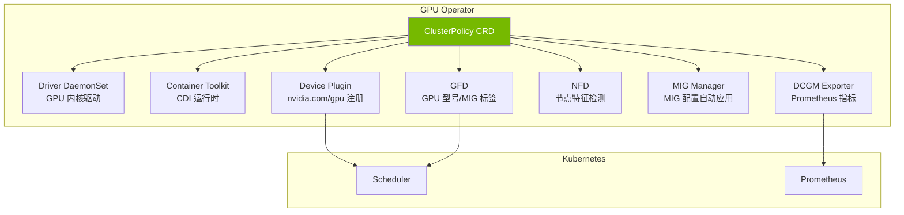
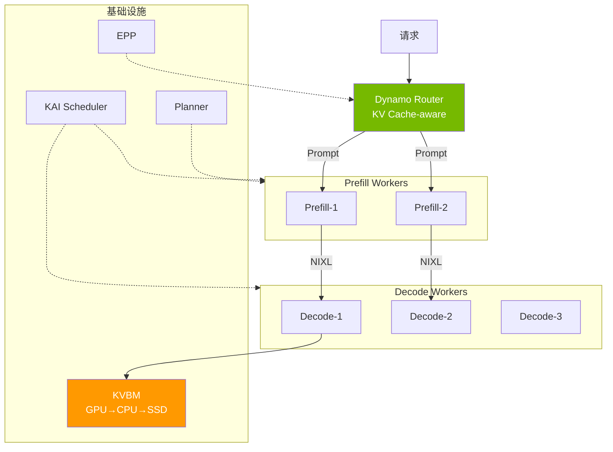

import Tabs from '@theme/Tabs';
import TabItem from '@theme/TabItem';
import { SpecificationTable, ComparisonTable } from '@site/src/components/tables';

# NVIDIA GPU 堆栈

NVIDIA GPU 软件栈以层次结构构成，用于在 Kubernetes 环境中运营 GPU。

| 层 | 角色 | 核心组件 |
|------|------|-------------|
| **基础设施自动化** | 声明式管理 GPU 驱动、运行时、插件 | GPU Operator（ClusterPolicy CRD）|
| **监控** | 采集 GPU 状态并暴露 Prometheus 指标 | DCGM、DCGM Exporter |
| **分区** | 单 GPU 被多个工作负载共享 | MIG、Time-Slicing |
| **推理优化** | 数据中心级 LLM 服务 | Dynamo、KAI Scheduler |

本文档涵盖各组件的架构和设计判断标准。GPU 节点配置（Karpenter）、伸缩（KEDA）、成本优化请参阅 [GPU 资源管理](./gpu-resource-management.md)。

---

## GPU Operator 架构

### 概念

GPU Operator 是通过一个 **ClusterPolicy CRD** 捆绑整个 GPU 栈的编排层。各组件可独立 enable/disable，节点添加时自动配置 GPU 环境。

:::info GPU Operator v25.10.1（2026.03 基准）

| 组件 | 版本 | 角色 |
|----------|------|------|
| GPU Operator | **v25.10.1** | GPU 栈生命周期管理 |
| NVIDIA Driver | **580.126.18** | GPU 内核驱动 |
| DCGM | **v4.5.2** | GPU 监控引擎 |
| DCGM Exporter | **v4.5.2-4.8.1** | Prometheus 指标暴露 |
| Device Plugin | **v0.19.0** | K8s GPU 资源注册 |
| GFD | **v0.19.0** | GPU 节点标签 |
| MIG Manager | **v0.13.1** | MIG 分区自动管理 |
| Container Toolkit（CDI）| **v1.17.5** | 容器 GPU 运行时 |

**v25.10.1 主要新功能：** Blackwell（B200/GB200）支持、HPC Job Mapping、CDMM（Confidential Computing）、CDI（Container Device Interface）
:::

### 组件结构



**各组件角色：**

- **Driver DaemonSet**：在节点安装 GPU 内核驱动。AL2023/Bottlerocket 中 AMI 预装因此 `enabled: false`
- **Container Toolkit（CDI）**：向容器运行时注入 GPU 设备。基于 CDI（Container Device Interface）独立于运行时
- **Device Plugin**：向 kubelet 注册 `nvidia.com/gpu` 扩展资源。使 kube-scheduler 能放置 GPU Pod
- **GFD（GPU Feature Discovery）**：将 GPU 型号、驱动版本、MIG 配置等暴露为节点标签。用于 nodeSelector/nodeAffinity
- **NFD（Node Feature Discovery）**：将硬件特征（CPU、PCIe、NUMA 等）暴露为节点标签
- **MIG Manager**：基于 ConfigMap 自动应用 MIG 配置。节点标签变更时重新配置
- **DCGM Exporter**：以 Prometheus 格式暴露 DCGM 指标

### EKS 环境别 GPU Operator 配置

| 环境 | Driver | Toolkit | Device Plugin | MIG | 备注 |
|------|--------|---------|---------------|-----|------|
| **EKS Auto Mode** | 否（AWS 自动）| 否（AWS 自动）| 否（标签禁用）| 否 | DCGM/NFD/GFD 正常 |
| **Karpenter（Self-Managed）** | 否（AL2023 AMI）| 否（AL2023 AMI）| 是 | 是 | 完全支持 |
| **Managed Node Group** | 否（AL2023 AMI）| 否（AL2023 AMI）| 是 | 是 | 完全支持 |
| **Hybrid Node（本地）** | 是（必须）| 是（必须）| 是 | 是 | GPU Operator 必须 |

:::caution AMI 别 GPU Driver 限制
- **AL2023 / Bottlerocket**：GPU 驱动预装在 AMI 中。`driver` 和 `toolkit` 都必须 `enabled: false`
- **EKS Auto Mode**：AWS 自动管理驱动。Device Plugin 通过节点标签 `nvidia.com/gpu.deploy.device-plugin: "false"` 禁用
:::

### EKS Auto Mode 中的 GPU Operator

Auto Mode 中 AWS 管理 GPU 驱动和 Device Plugin，但**安装 GPU Operator 仍然有用的情况**：

- **DCGM Exporter**：GPU 指标采集（Auto Mode 本身不提供 DCGM）
- **GFD/NFD**：GPU 型号级节点标签用于 nodeSelector
- **KAI Scheduler**：与依赖 ClusterPolicy 的项目兼容

```yaml
# Auto Mode NodePool — 仅通过标签禁用 Device Plugin
apiVersion: karpenter.sh/v1
kind: NodePool
metadata:
  name: gpu-auto-mode
spec:
  template:
    metadata:
      labels:
        nvidia.com/gpu.deploy.device-plugin: "false"
    spec:
      requirements:
        - key: eks.amazonaws.com/instance-family
          operator: In
          values: ["p5", "p4d"]
      nodeClassRef:
        group: eks.amazonaws.com
        kind: NodeClass
        name: default
```

---

## DCGM 监控

### 概述

NVIDIA DCGM（Data Center GPU Manager）是采集 GPU 状态并向 Prometheus 暴露指标的监控引擎。GPU Operator 以 DaemonSet 自动部署 DCGM Exporter。

### 部署方式选择

<Tabs>
  <TabItem value="daemonset" label="DaemonSet（推荐）" default>

| 项目 | 内容 |
|------|------|
| **资源效率** | 每节点 1 个实例 — 开销最小 |
| **管理** | GPU Operator 自动管理 |
| **指标范围** | 采集节点所有 GPU 指标 |
| **适用环境** | 生产环境（大多数情况）|

  </TabItem>
  <TabItem value="sidecar" label="Sidecar（特殊用途）">

| 项目 | 内容 |
|------|------|
| **资源效率** | 每 Pod 1 个实例 — 开销高 |
| **指标范围** | 仅采集该 Pod 的 GPU 指标 |
| **适用环境** | 多租户计费、Pod 级隔离需要时 |

K8s 1.33+ 稳定化的 Sidecar Containers（`restartPolicy: Always`）可与 Pod 生命周期一起运营。

  </TabItem>
</Tabs>

### 主要 GPU 指标

<SpecificationTable
  headers={['指标', '说明', '用途']}
  rows={[
    { id: '1', cells: ['DCGM_FI_DEV_GPU_UTIL', 'GPU 核心使用率（%）', 'HPA/KEDA 触发'] },
    { id: '2', cells: ['DCGM_FI_DEV_MEM_COPY_UTIL', '内存带宽使用率（%）', '内存瓶颈检测'] },
    { id: '3', cells: ['DCGM_FI_DEV_FB_USED / FB_FREE', '帧缓冲使用量/余量（MB）', 'OOM 防护、容量规划'] },
    { id: '4', cells: ['DCGM_FI_DEV_POWER_USAGE', '功耗（W）', '成本和散热管理'] },
    { id: '5', cells: ['DCGM_FI_DEV_GPU_TEMP', 'GPU 温度（C）', '热节流防护'] },
    { id: '6', cells: ['DCGM_FI_DEV_SM_CLOCK', 'SM 时钟速度（MHz）', '性能监控'] }
  ]}
/>

### Prometheus 联动概念

DCGM Exporter 通过 `:9400/metrics` 端点暴露 Prometheus 格式指标。安装 GPU Operator 时设置 `dcgmExporter.serviceMonitor.enabled=true` 会自动创建 ServiceMonitor。

**采集链：**

```
GPU 硬件 → DCGM 引擎 → DCGM Exporter (:9400) → Prometheus → Grafana/KEDA
```

**核心设计决策：**
- **采集周期**：15 秒（默认）。LLM 服务中建议缩短至 10 秒
- **指标过滤**：通过 `/etc/dcgm-exporter/dcp-metrics-included.csv` 仅采集需要的指标控制基数
- **Pod-GPU 映射**：设置 `DCGM_EXPORTER_KUBERNETES=true` 时 `pod`、`namespace`、`container` 标签添加到指标

---

## GPU 分区策略

### MIG（Multi-Instance GPU）

MIG 将 Ampere/Hopper/Blackwell 架构 GPU（A100、H100、H200、B200）分割为最多 7 个**硬件独立的** GPU 实例。各 MIG 实例具有独立的内存、缓存、SM（Streaming Multiprocessor），保证工作负载间无干扰的稳定性能。

**MIG 的核心价值：**
- **硬件隔离**：内存、SM、L2 缓存完全分离保证 QoS
- **并发执行**：多个推理工作负载无性能下降同时执行
- **GPU Operator 自动管理**：MIG Manager 基于 ConfigMap 自动应用配置

**A100 40GB MIG 配置文件：**

<SpecificationTable
  headers={['配置', '内存', 'SM 数', '用途', '预估吞吐量']}
  rows={[
    { id: '1', cells: ['1g.5gb', '5GB', '14', '小型模型（3B 以下）', '~20 tok/s'] },
    { id: '2', cells: ['1g.10gb', '10GB', '14', '小型模型（3B-7B）', '~25 tok/s'] },
    { id: '3', cells: ['2g.10gb', '10GB', '28', '中型模型（7B-13B）', '~50 tok/s'] },
    { id: '4', cells: ['3g.20gb', '20GB', '42', '中大型模型（13B-30B）', '~100 tok/s'] },
    { id: '5', cells: ['4g.20gb', '20GB', '56', '大型模型（13B-30B）', '~130 tok/s'] },
    { id: '6', cells: ['7g.40gb', '40GB', '84', '完整 GPU（70B+）', '~200 tok/s'] }
  ]}
/>

**MIG 配置管理：**

GPU Operator 的 MIG Manager 监视节点标签（`nvidia.com/mig.config`）自动应用 MIG 配置。在 ConfigMap 中定义配置，变更节点标签后 MIG Manager 重新配置 GPU。

```yaml
# MIG 配置 ConfigMap（mig-parted 格式）
apiVersion: v1
kind: ConfigMap
metadata:
  name: default-mig-parted-config
  namespace: gpu-operator
data:
  config.yaml: |
    version: v1
    mig-configs:
      all-1g.5gb:          # 7 个小型实例
        - devices: all
          mig-enabled: true
          mig-devices:
            "1g.5gb": 7
      mixed-balanced:      # 混合配置
        - devices: all
          mig-enabled: true
          mig-devices:
            "3g.20gb": 1
            "2g.10gb": 1
            "1g.5gb": 2
      single-7g:           # 单一大型
        - devices: all
          mig-enabled: true
          mig-devices:
            "7g.40gb": 1
```

Pod 使用 MIG 设备时请求 `nvidia.com/mig-<profile>` 资源。

```yaml
resources:
  requests:
    nvidia.com/mig-1g.5gb: 1
  limits:
    nvidia.com/mig-1g.5gb: 1
```

### Time-Slicing

Time-Slicing 基于时间分割 GPU 计算时间让多个 Pod 共享同一 GPU。与 MIG 不同**在所有 NVIDIA GPU 上可用**，但工作负载间没有内存隔离。

**配置方法：**

在 GPU Operator 的 ClusterPolicy 中引用 ConfigMap 激活 Time-Slicing。

```yaml
# Time-Slicing ConfigMap
apiVersion: v1
kind: ConfigMap
metadata:
  name: time-slicing-config
  namespace: gpu-operator
data:
  any: |-
    version: v1
    sharing:
      timeSlicing:
        resources:
          - name: nvidia.com/gpu
            replicas: 4    # 每个 GPU 被 4 个 Pod 共享
```

Pod 与普通 GPU 请求相同请求 `nvidia.com/gpu: 1`。在启用 Time-Slicing 的节点上分配 GPU 片段。

### MIG vs Time-Slicing 对比

<ComparisonTable
  headers={['项目', 'MIG', 'Time-Slicing']}
  rows={[
    { id: '1', cells: ['隔离级别', '硬件隔离（内存、SM、缓存）', '软件时分（无隔离）'] },
    { id: '2', cells: ['支持 GPU', 'A100、H100、H200、B200', '所有 NVIDIA GPU'] },
    { id: '3', cells: ['最大分割', '7 个实例', '无限制（性能下降成比例）'] },
    { id: '4', cells: ['性能可预测', '有保证（QoS）', '随并发工作负载数波动'] },
    { id: '5', cells: ['内存安全', 'OOM 不影响其他实例', 'OOM 影响其他工作负载'] },
    { id: '6', cells: ['适用环境', '生产推理、多租户', '开发/测试、批推理'], recommended: true }
  ]}
/>

:::warning Time-Slicing 性能特性
- **上下文切换开销**：约 1% 水平微乎其微
- **并发执行性能下降**：共享 GPU 内存和计算，随并发工作负载数 **50-100% 性能下降**
- **无内存隔离**：一个工作负载的 OOM 影响其他工作负载
- **适合**：批推理、开发/测试环境 | **不适合**：实时推理（SLA）、高性能训练
:::

---

## Dynamo：数据中心级推理优化

### 概述

**NVIDIA Dynamo** 是优化数据中心级 LLM 推理的开源框架。支持 vLLM、SGLang、TensorRT-LLM 后端，比传统方案实现**最高 7 倍性能提升**。

:::info Dynamo v1.0 GA（2026.03）
- **服务模式**：Aggregated + Disaggregated 同等支持
- **核心技术**：Flash Indexer、NIXL、KAI Scheduler、Planner、EPP
- **部署方式**：Kubernetes Operator + CRD（DGDR）
- **许可**：Apache 2.0
:::

### 核心架构

Dynamo 同时支持 Aggregated Serving 和 Disaggregated Serving。Disaggregated 模式分离 Prefill（Prompt 处理）和 Decode（Token 生成）独立伸缩。



### 核心组件

| 组件 | 角色 | 优势 |
|----------|------|------|
| **Disaggregated Serving** | Prefill/Decode Worker 分离 | 各阶段独立伸缩、GPU 利用最大化 |
| **Flash Indexer** | Radix tree 基于 worker 级 KV cache 索引 | Prefix 匹配优化、KV 复用率最大化 |
| **KVBM** | GPU → CPU → SSD 3-tier 缓存 | 内存效率最大化、大规模上下文支持 |
| **NIXL** | NVIDIA Inference Transfer Library | GPU 间 KV Cache 超高速传输（NVLink/RDMA）。Dynamo、llm-d、production-stack、aibrix 等公共使用 |
| **Planner** | SLO 自动伸缩 | Profiling → 基于 SLO 目标自动 Prefill/Decode 伸缩 |
| **EPP** | Endpoint Picker Protocol | 与 K8s Gateway API 原生集成 |
| **AIConfigurator** | 自动 TP/PP 推荐 | 基于模型大小、GPU 内存、网络拓扑的最优并行化 |

### 与 llm-d 的选择指南

llm-d 和 Dynamo 都负责 LLM 推理路由/调度，**在路由层竞争**所以选择使用。

```
llm-d:    Client → llm-d Router → vLLM Workers
Dynamo:   Client → Dynamo Router → Prefill Workers → (NIXL) → Decode Workers
```

<ComparisonTable
  headers={['项目', 'llm-d', 'Dynamo']}
  rows={[
    { id: '1', cells: ['架构', 'Aggregated + Disaggregated', 'Aggregated + Disaggregated（同等支持）'] },
    { id: '2', cells: ['KV Cache 路由', 'Prefix-aware', 'Prefix-aware + Flash Indexer（radix tree）'] },
    { id: '3', cells: ['KV Cache 传输', 'NIXL', 'NIXL（NVLink/RDMA）'] },
    { id: '4', cells: ['Pod 调度', 'K8s 默认调度器', 'KAI Scheduler（GPU-aware）'] },
    { id: '5', cells: ['自动伸缩', 'HPA/KEDA 联动', 'Planner（SLO）+ KEDA/HPA'] },
    { id: '6', cells: ['后端', 'vLLM', 'vLLM、SGLang、TRT-LLM'] },
    { id: '7', cells: ['复杂度', '低 — 在现有 vLLM 上添加路由器', '高 — 替换整个服务栈'] },
    { id: '8', cells: ['成熟度', 'v0.5+', 'v1.0 GA'] }
  ]}
/>

| 场景 | 推荐 |
|----------|------|
| 在现有 vLLM 上仅添加路由 | **llm-d** |
| 小~中规模（GPU 8 个以下）| **llm-d** |
| Gateway API K8s 原生 | **llm-d** |
| 大规模（GPU 16 个+）、吞吐量最大化 | **Dynamo** |
| 长上下文（128K+）工作负载 | **Dynamo**（3-tier KV cache）|
| 快速引入、低运维复杂度 | **llm-d** |

:::tip 迁移路径
从 llm-d 开始规模增大后转向 Dynamo 是现实的。两者都共享 vLLM 后端和 NIXL KV 传输。核心差异是 Dynamo 的 Flash Indexer、KAI Scheduler、Planner。Dynamo 1.0 可将 llm-d 作为内部组件集成，与其说完全替代不如视为超集。
:::

---

## KAI Scheduler

KAI Scheduler 是 NVIDIA 的 **GPU 感知 Kubernetes Pod 调度器**。与默认 kube-scheduler 不同，识别 GPU 拓扑（NVLink、PCIe）、MIG 片段、Gang Scheduling 来决定最优 Pod 放置。

### 核心功能

| 功能 | 说明 |
|------|------|
| **GPU Topology Awareness** | 识别 NVLink/PCIe 连接结构最小化通信成本 |
| **MIG-aware Scheduling** | 将 MIG 片段作为独立调度单位识别 |
| **Gang Scheduling** | 分布式训练中保证所有 Pod 同时放置 |
| **Fair-share Scheduling** | 命名空间/团队级 GPU 配额管理 |
| **Preemption** | 基于优先级的 Pod 替换 |

### 设计考量

- **ClusterPolicy 依赖**：KAI Scheduler 需要安装 GPU Operator 的 ClusterPolicy 才能运行
- **EKS Auto Mode**：安装 GPU Operator 后仅通过标签禁用 Device Plugin 即可使用 KAI Scheduler
- **与 kube-scheduler 的关系**：KAI Scheduler 不替代 kube-scheduler，而是作为仅对 GPU 工作负载委托调度的 Secondary Scheduler 运行

:::info KAI Scheduler 不等于自动伸缩
KAI Scheduler 是决定**将 Pod 放置在哪个节点**的调度器。与增加 Pod 数的自动伸缩（KEDA/HPA）或添加节点的配置（Karpenter）是不同角色。
:::

---

## 相关文档

- [GPU 资源管理](./gpu-resource-management.md) — Karpenter、KEDA、DRA、成本优化
- [EKS GPU 节点策略](./eks-gpu-node-strategy.md) — Auto Mode + Karpenter + Hybrid Node 配置
- [vLLM 模型服务](../inference-frameworks/vllm-model-serving.md) — vLLM 推理引擎
- [llm-d EKS Auto Mode](../inference-frameworks/llm-d-eks-automode.md) — llm-d 详细架构

## 参考资料

- [NVIDIA GPU Operator Documentation](https://docs.nvidia.com/datacenter/cloud-native/gpu-operator/latest/)
- [NVIDIA DCGM Exporter](https://github.com/NVIDIA/dcgm-exporter)
- [NVIDIA Dynamo GitHub](https://github.com/ai-dynamo/dynamo)
- [NIXL - NVIDIA Inference Transfer Library](https://github.com/ai-dynamo/nixl)
- [KAI Scheduler](https://github.com/NVIDIA/KAI-Scheduler)
