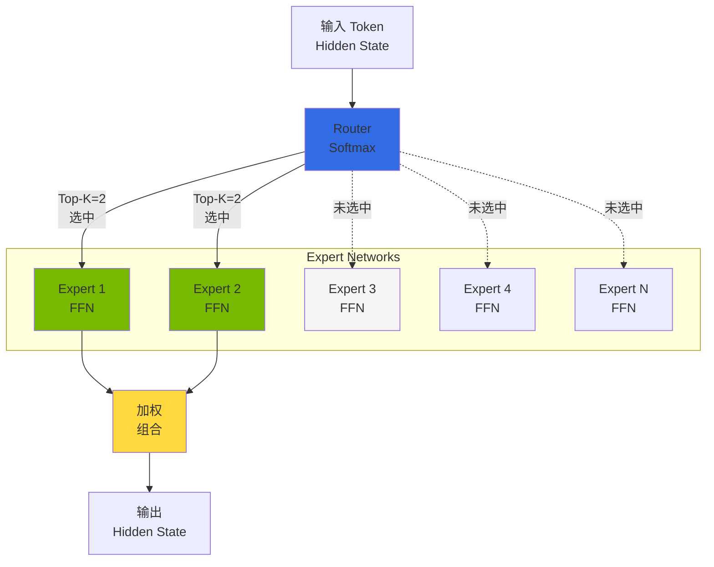
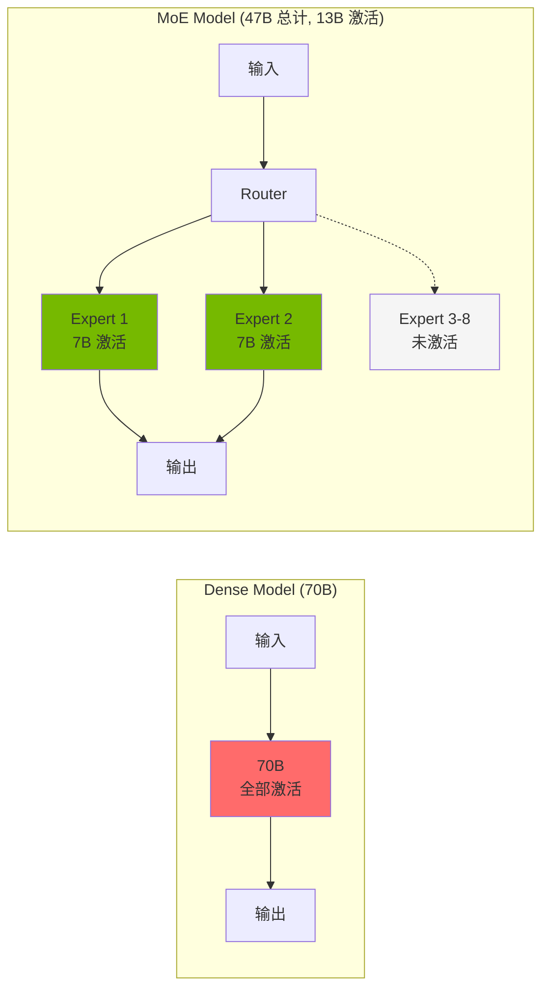
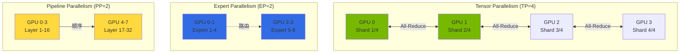
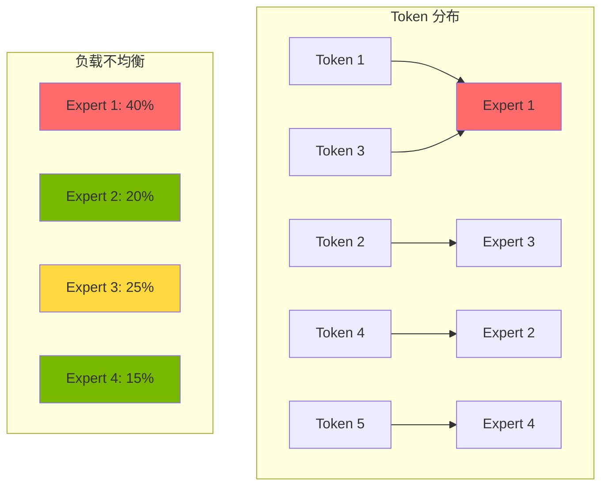
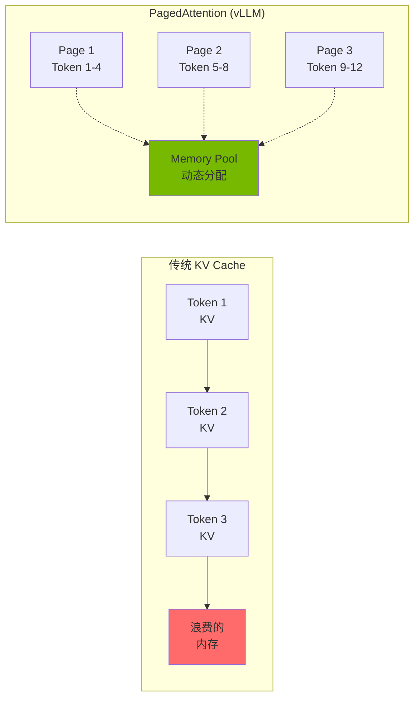
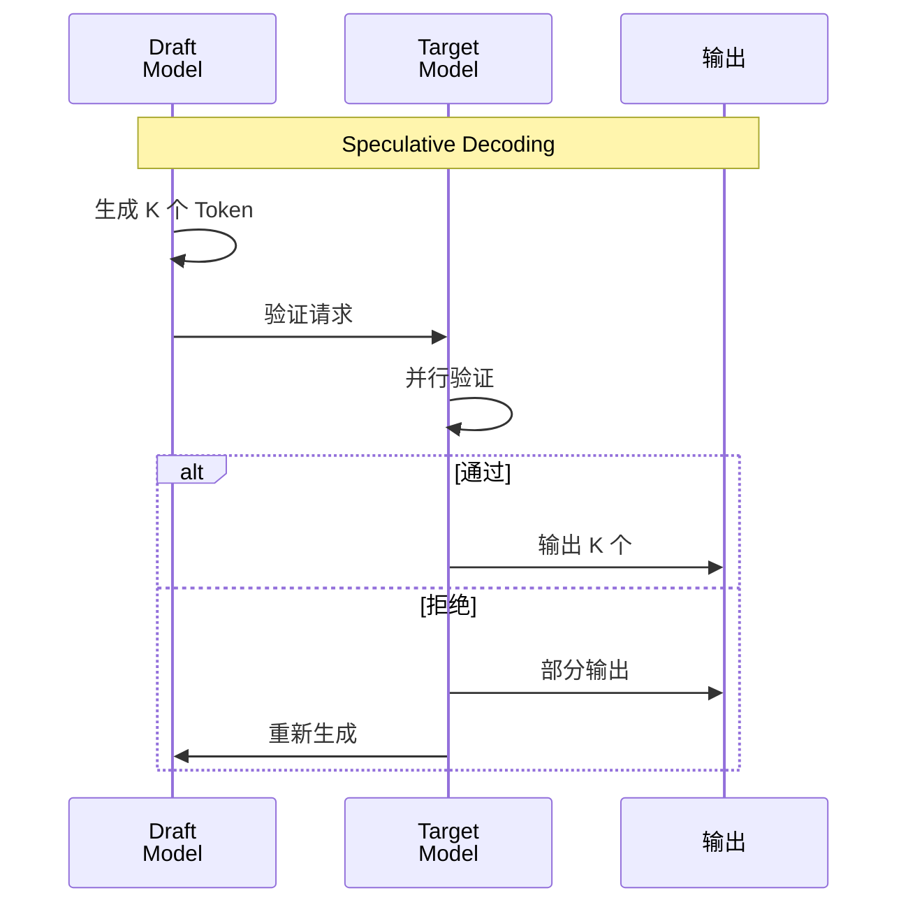

import { RoutingMechanisms, MoeVsDense, GpuMemoryRequirements, ParallelizationStrategies, TensorParallelismConfig, VllmVsTgi, KvCacheConfig, BatchOptimization, MonitoringMetrics, GpuVsTrainium2 } from '@site/src/components/MoeModelTables';

# MoE 模型服务概念指南

> **当前版本**：vLLM v0.18+ / v0.19.x（2026-04 基准）

> **创建日期**：2025-02-09 | **修改日期**：2026-04-06 | **阅读时间**：约 6 分钟

## 概述

Mixture of Experts（MoE）模型是最大化大规模语言模型效率的架构。仅激活部分 Expert，以比 Dense 模型更少的计算达到同等质量。

本文档涵盖 MoE 架构核心概念、各模型资源需求、分布式部署策略。

:::tip 实战部署指南
MoE 模型的 EKS 部署 YAML、helm 命令、多节点配置等实战部署请参阅 [自定义模型部署指南](../reference-architecture/model-lifecycle/custom-model-deployment.md)。
:::

---

## MoE 架构理解

### Expert 网络结构

MoE 模型由多个"Expert"网络和选择它们的"Router（Gate）"网络组成。

### 路由机制

MoE 模型的核心是根据输入 Token 选择合适 Expert 的路由机制。

<RoutingMechanisms />

:::info 路由工作原理

1. **Gate 计算**：将输入 Token 的 hidden state 通过 Gate 网络
2. **Expert 选择**：从 Softmax 输出中选择 Top-K Expert
3. **并行处理**：选中的 Expert 并行处理输入
4. **加权求和**：用 Gate 权重组合 Expert 输出

:::

### MoE vs Dense 模型对比

<MoeVsDense />

:::tip MoE 模型的优势

- **计算效率**：仅激活部分参数提升推理速度
- **可扩展性**：通过添加 Expert 扩展模型容量
- **专业化**：各 Expert 可特化于特定领域/任务

:::

---

## GPU 内存需求

MoE 模型虽然激活参数少，但需要将全部 Expert 加载到内存。

<GpuMemoryRequirements />

:::info 最新 MoE 模型内存优化

**DeepSeek-V3**：使用 Multi-head Latent Attention（MLA）架构显著减少 KV 缓存内存。比传统 MHA 约节省 40% 内存，实际内存需求可能低于标称值。

**GLM-5**（2026 年 2 月发布）：744B 总参数 / 40B 激活，256 个 experts 中激活 8 个。SWE-bench Verified 77.8%，Agentic Coding 第 1 名（55.00），MIT 许可。FP8 量化版需要约 744GB VRAM（2x p5.48xlarge，PP=2）。HuggingFace：`zai-org/GLM-5-FP8`

**Kimi K2.5**（2026 年 1 月发布）：约 1T 总参数 / 32B 激活，Modified DeepSeek V3 MoE 架构。SWE-bench Verified 76.8%，HumanEval 99%，Agent Swarm 支持。INT4 量化版需要约 500GB VRAM（1x p5.48xlarge，TP=8）。HuggingFace：`moonshotai/Kimi-K2.5`

准确内存需求取决于批大小和序列长度，建议进行分析。
:::

:::warning 内存计算注意事项

- **KV Cache**：根据批大小和序列长度需要额外内存
- **Activation Memory**：推理中存储中间激活值的空间
- **CUDA Context**：每 GPU 约 1-2GB CUDA 开销
- **Safety Margin**：实际运营建议预留 10-20% 余量

:::

---

## 分布式部署策略

大规模 MoE 模型无法加载到单个 GPU，分布式部署是必须的。

<ParallelizationStrategies />

### Tensor Parallelism 配置

张量并行将模型各层分割到多个 GPU。

<TensorParallelismConfig />

:::tip 张量并行优化

- **利用 NVLink**：使用支持 NVLink 的实例实现 GPU 间高速通信
- **TP 大小选择**：根据模型大小和 GPU 内存选择最小 TP
- **通信开销**：TP 越大 All-Reduce 通信越多

:::

### Expert Parallelism

Expert 并行将 MoE 模型的 Expert 分布到多个 GPU。vLLM v0.6+ 中 Expert 在 TP 内自动分布放置。

### Expert 激活模式

MoE 模型性能优化需要理解 Expert 激活模式。

:::info Expert 负载均衡

- **Auxiliary Loss**：训练时引导 Expert 间均匀分配的辅助损失
- **Capacity Factor**：限制每个 Expert 可处理的最大 Token 数
- **Token Dropping**：容量超出时丢弃 Token（推理时建议禁用）

:::

### 700B+ MoE 模型多节点部署概念

GLM-5、Kimi K2.5 等 700B+ MoE 模型无法加载到单节点，多节点部署是必须的。vLLM v0.18+ 支持基于 **LeaderWorkerSet（LWS）** 的多节点部署。

| 模型 | 总参数 | 激活参数 | 推荐配置 | VRAM 需求 |
|------|-----------|------------|---------|-----------|
| GLM-5 FP8 | 744B | 40B | 2x p5.48xlarge, PP=2, TP=8 | ~744GB |
| Kimi K2.5 INT4 | ~1T | 32B | 1x p5.48xlarge, TP=8 | ~500GB |
| DeepSeek-V3 | 671B | 37B | 2x p5.48xlarge, PP=2, TP=8 | ~671GB |
| Mixtral 8x22B | 141B | 39B | 1x p5.48xlarge, TP=4 | ~282GB |
| Mixtral 8x7B | 47B | 13B | 1x p4d.24xlarge, TP=2 | ~94GB |

:::tip 700B+ MoE 模型部署建议

- **使用 LeaderWorkerSet**：无 Ray 依赖的 Kubernetes 原生多节点部署
- **Pipeline Parallelism**：PP=2 以上跨节点分割层
- **FP8 量化**：节省内存（推荐 GLM-5 FP8 版本）
- **网络优化**：通过 NCCL 设置优化节点间通信（推荐 EFA）
- **INT4/AWQ 量化**：可单节点部署时考虑（Kimi K2.5）

:::

:::warning 多节点部署注意事项

- **网络带宽**：节点间 All-Reduce 通信开销（推荐 EFA）
- **加载时间**：700B+ 模型初始加载可能需要 20-30 分钟
- **内存余量**：需要 10-15% Safety margin
- **LeaderWorkerSet CRD**：集群需安装 LWS Operator

:::

---

## vLLM MoE 服务功能

vLLM v0.18+ 为 MoE 模型提供以下优化：

- **Expert Parallelism**：多 GPU 分布 Expert
- **Tensor Parallelism**：层内张量分割
- **PagedAttention**：高效 KV Cache 管理
- **Continuous Batching**：动态批处理
- **FP8 KV Cache**：2 倍内存节省
- **Improved Prefix Caching**：400%+ 吞吐量提升
- **Multi-LoRA Serving**：单一基础模型上同时服务多个 LoRA 适配器
- **GGUF Quantization**：支持 GGUF 格式量化模型

:::warning TGI 进入维护模式
Text Generation Inference（TGI）从 2025 年开始进入维护模式。**新部署请使用 vLLM。** 从 TGI 迁移时 vLLM 提供 OpenAI 兼容 API，客户端代码变更最小化。
:::

### vLLM vs TGI 性能对比

<VllmVsTgi />

---

## AWS Trainium2 MoE 推理

### Trainium2 概述

AWS Trainium2 是 AWS 设计的第 2 代 ML 加速器，提供比 GPU 更高性价比的推理。

**主要特点：**
- **高性能**：单个 trn2.48xlarge 可推理 Llama 3.1 405B
- **成本效率**：比 GPU 最高节省 50%
- **NeuronX SDK**：支持 PyTorch 2.5+，最少代码变更即可上手
- **NxD Inference**：简化大规模 LLM 部署的 PyTorch 库
- **FP8 量化**：提升内存效率
- **Flash Decoding**：支持 Speculative Decoding

### GPU vs Trainium2 成本对比

<GpuVsTrainium2 />

:::tip Trainium2 推荐使用场景

- **成本优化**：需要比 GPU 节省 50% 以上
- **大规模部署**：运营数十~数百推理端点
- **稳定工作负载**：稳定性和成本比实验性功能更重要的生产环境
- **AWS 原生**：偏好 AWS 生态内完全托管方案

:::

:::warning Trainium2 限制

- **模型支持**：并非所有模型都支持，需确认 NeuronX SDK 兼容性
- **自定义内核**：部分自定义 CUDA 内核需要移植到 Neuron
- **调试**：比 GPU 调试工具有限
- **区域可用性**：仅在部分 AWS 区域可用

:::

---

## 性能优化概念

### KV Cache 优化

KV Cache 是对推理性能有重大影响的核心要素。

<KvCacheConfig />

### Speculative Decoding

Speculative Decoding 使用小型 Draft 模型提升推理速度。

:::info Speculative Decoding 效果

- **速度提升**：1.5x - 2.5x 吞吐量增加（因工作负载而异）
- **质量维持**：输出质量相同（通过验证过程保证）
- **额外内存**：需要 Draft 模型的额外 GPU 内存

:::

### 批处理优化

<BatchOptimization />

---

## 监控指标

### 主要监控指标

<MonitoringMetrics />

核心告警标准：

| 指标 | 阈值 | 严重度 | 说明 |
|--------|--------|--------|------|
| P95 响应延迟 | 大于 30 秒 | Warning | MoE 模型响应延迟 |
| KV Cache 使用率 | 大于 95% | Critical | 可能拒绝新请求 |
| 等待请求数 | 大于 100 | Warning | 需要扩容 |

---

## 总结

### 核心要点

1. **架构理解**：掌握 Expert 网络和路由机制的工作原理
2. **内存规划**：需要加载全部 Expert，确保充足 GPU 内存
3. **分布式部署**：合理组合张量并行和 Expert 并行
4. **推理引擎选择**：推荐 vLLM（最新优化技术及活跃更新）
5. **性能优化**：应用 KV Cache、Speculative Decoding、批处理优化

### 下一步

- [GPU 资源管理](./gpu-resource-management.md) - GPU 集群动态资源分配
- [Inference Gateway 路由](../reference-architecture/inference-gateway/routing-strategy.md) - 多模型路由策略
- [Agentic AI 平台架构](../design-architecture/foundations/agentic-platform-architecture.md) - 整体平台架构

---

## 参考资料

- [vLLM 官方文档](https://docs.vllm.ai/)
- [Mixtral 模型卡](https://huggingface.co/mistralai/Mixtral-8x7B-Instruct-v0.1)
- [MoE 架构论文](https://arxiv.org/abs/2101.03961)
- [PagedAttention 论文](https://arxiv.org/abs/2309.06180)
