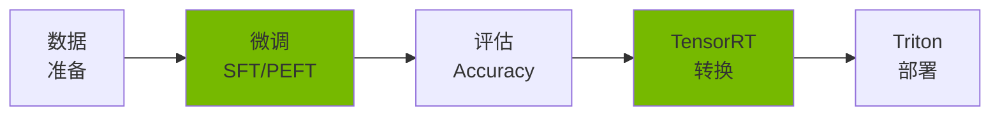
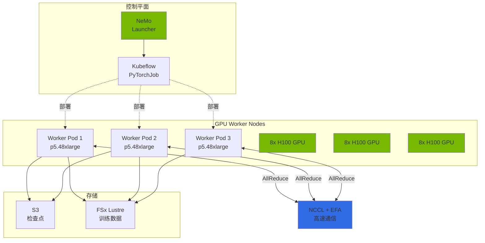
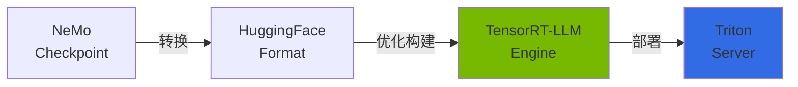
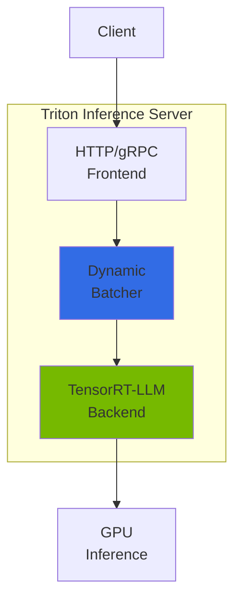
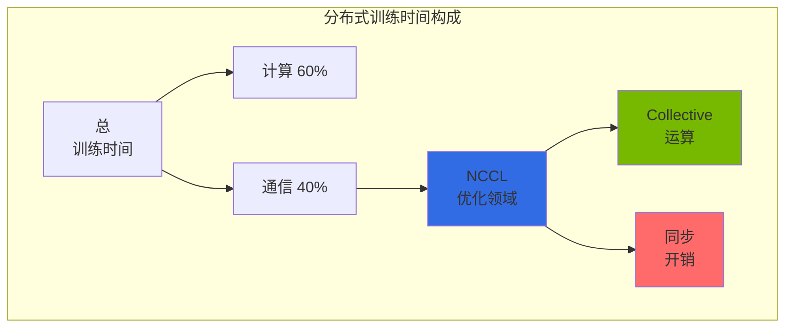
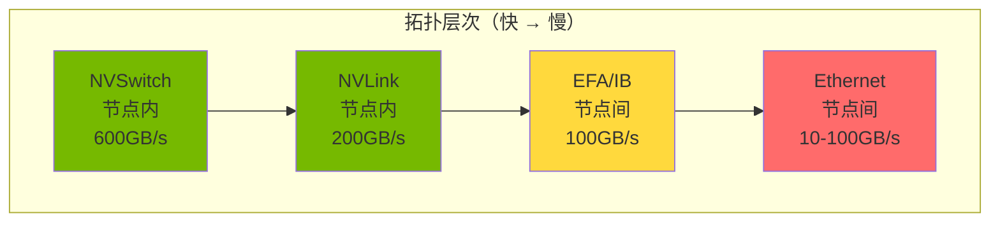

import { NemoComponents, GPURequirements, CheckpointSharding, MonitoringMetrics, NCCLImportance } from '@site/src/components/NemoTables';

# NeMo 框架

> 📅 **创建日期**：2026-02-13 | **修改日期**：2026-04-05 | ⏱️ **阅读时间**：约 4 分钟

NVIDIA NeMo 是用于大规模语言模型（LLM）训练、微调和优化的端到端框架。在 Kubernetes 环境中支持分布式训练和高效模型部署。

## 概述

### NeMo 解决的问题

在 Agentic AI 平台中使用通用 LLM（GPT-4、Claude 等）时存在以下局限：

- **领域知识不足**：缺乏对特定行业/企业专业术语和上下文的理解
- **成本问题**：大规模调用时 API 成本急剧增长（按 token 计费）
- **延迟**：外部 API 调用导致响应延迟
- **数据隐私**：无法将敏感数据传输到外部服务
- **本地需求**：金融/医疗等受监管行业的自有基础设施运营需求

NeMo 通过**领域特化模型微调**解决这些问题。

### NeMo 核心功能



<NemoComponents />

**主要价值：**

- **高效微调**：通过 LoRA/QLoRA 仅训练全部参数的 0.1%
- **分布式训练**：Multi-node、Multi-GPU 自动并行化（Tensor/Pipeline/Data Parallelism）
- **推理优化**：TensorRT-LLM 转换提升 2-4 倍性能
- **企业支持**：检查点管理、监控、生产部署流水线

---

## EKS 部署架构

### NeMo on EKS 配置



### 容器配置

**NeMo 容器镜像：**

```
nvcr.io/nvidia/nemo:25.02
├── PyTorch 2.5.1
├── CUDA 12.6
├── NCCL 2.23+
├── Megatron-LM (NeMo 集成)
├── TensorRT-LLM 0.13+
└── Triton Inference Server 2.50+
```

**主要依赖：**

- **Kubeflow Training Operator**：通过 PyTorchJob CRD 编排分布式训练
- **GPU Operator**：NVIDIA 驱动、Device Plugin、DCGM 自动安装
- **EFA Device Plugin**：激活节点间 RDMA 通信
- **Karpenter**：GPU 节点自动伸缩

<GPURequirements />

---

## 微调指南

### SFT（Supervised Fine-Tuning）概念

**SFT 是什么？**：在预训练模型上用领域级 instruction-response 数据进行额外训练，提升特定任务性能。

```
预训练模型（通用）→ SFT → 领域特化模型
```

**何时使用？**

- 客户 FAQ 聊天机器人：学习特定产品/服务相关 Q&A
- 金融报告生成：学习金融术语和格式
- 医疗诊断辅助：学习医学术语和诊断模式

**数据格式：**

```json
{"input": "EKS Auto Mode 是什么？", "output": "EKS Auto Mode 是 AWS 自动管理节点配置、伸缩、安全补丁的完全托管 Kubernetes 计算选项。"}
{"input": "Karpenter 的主要功能是什么？", "output": "Karpenter 提供自动节点配置、bin-packing 优化、Spot 实例集成、drift 检测功能。"}
```

### PEFT/LoRA：高效微调

**PEFT（Parameter-Efficient Fine-Tuning）**：不训练全部模型参数而是**仅训练部分适配器层**，节省内存和时间。

**LoRA（Low-Rank Adaptation）**：PEFT 的代表方法，冻结原始权重（freeze）**仅训练两个低秩矩阵（A、B）**。

```
原始权重 W (freeze) + LoRA 增量 (A × B) = 最终权重
```

**LoRA 核心参数：**

| 参数 | 说明 | 推荐值 | 影响 |
|---------|------|--------|------|
| `r`（rank）| 低秩矩阵的秩 | 8-64 | 越大表达力越强、内存越多 |
| `alpha` | 缩放系数 | 与 r 相同 | 调节 LoRA 权重影响力 |
| `dropout` | Dropout 比率 | 0.1 | 防止过拟合 |
| `target_modules` | 训练的层 | q_proj, v_proj | Attention 层选择 |

**内存节省效果：**

- **Full Fine-Tuning（7B 模型）**：需要约 120GB VRAM（A100 80GB × 2）
- **LoRA Fine-Tuning（7B 模型）**：需要约 24GB VRAM（A100 80GB × 1）
- **节省率**：约 80% 内存减少

### 微调执行示例

```python
# nemo_lora_finetune.py
from nemo.collections.llm import finetune
from nemo.collections.llm.peft import LoRA

# LoRA 设置
lora_config = LoRA(
    r=32,  # rank
    alpha=32,  # scaling
    dropout=0.1,
    target_modules=["q_proj", "v_proj", "k_proj", "o_proj"],
)

# 执行微调
model = finetune(
    model_path="/models/llama-3.1-8b.nemo",
    data_path="/data/train.jsonl",
    peft_config=lora_config,
    trainer_config={
        "devices": 8,  # 8 GPU
        "max_epochs": 3,
        "precision": "bf16",  # BFloat16 (A100/H100)
    },
    output_path="/output/llama-3.1-8b-finetuned",
)
```

**详细流水线**：数据预处理、多节点分布式训练、超参数调优等请参阅 [自定义模型流水线](../reference-architecture/model-lifecycle/custom-model-pipeline.md) 文档。

---

## 检查点管理

### 基于 S3 的检查点存储

NeMo 在训练期间定期保存**检查点（模型状态快照）**。通过此：

- **恢复训练**：故障时从最后检查点重启
- **最优模型选择**：选择验证损失最低的检查点
- **版本管理**：比较多个实验的检查点

**S3 存储结构：**

```
s3://nemo-checkpoints/
└── llama-3.1-8b-finetune/
    ├── checkpoint-epoch=1-step=500/
    │   ├── model_weights.ckpt
    │   ├── optimizer_states.ckpt
    │   └── metadata.yaml
    ├── checkpoint-epoch=2-step=1000/
    └── checkpoint-epoch=3-step=1500/
```

### 大规模模型检查点分片

70B 以上大规模模型的单一检查点文件可达数百 GB。NeMo 通过**分片（sharding）**将其分割为多个文件。

<CheckpointSharding />

**分片设置：**

```yaml
trainer:
  checkpoint:
    save_sharded_checkpoint: true
    shard_size_gb: 10  # 以 10GB 为单位分割
    num_workers: 8  # 并行保存 Worker 数
    compression: "gzip"  # 压缩（可选）
```

**分片存储结构：**

```
s3://checkpoints/llama-405b/
└── checkpoint-step=1000/
    ├── shard-00000-of-00040.ckpt  (10GB)
    ├── shard-00001-of-00040.ckpt  (10GB)
    ├── ...
    └── shard-00039-of-00040.ckpt  (10GB)
```

### 检查点转换

```bash
# NeMo → HuggingFace 转换
python -m nemo.collections.llm.scripts.convert_nemo_to_hf \
  --input_path /checkpoints/llama-finetuned.nemo \
  --output_path /models/llama-finetuned-hf \
  --model_type llama
```

---

## TensorRT-LLM 转换

### 什么是 TensorRT-LLM？

NVIDIA TensorRT-LLM 是面向 LLM 推理的优化引擎。将 PyTorch 模型转换为**高度优化的执行图**，推理速度提升 2-4 倍。



### 性能提升对比

| 优化技术 | 内存节省 | 速度提升 | 说明 |
|------------|-----------|----------|------|
| **FP8 量化** | 50% | 1.5-2x | BFloat16 → FP8（H100 专用）|
| **PagedAttention** | 40% | - | KV Cache 动态内存管理 |
| **In-flight Batching** | - | 2-3x | 连续批处理 |
| **Kernel Fusion** | - | 1.3-1.5x | 计算内核融合 |
| **综合效果** | **60-70%** | **2-4x** | 以上技术的复合效果 |

### 转换概念

```python
from tensorrt_llm import LLM

# 将 HuggingFace 模型转换为 TensorRT-LLM 引擎
llm = LLM(
    model="/models/llama-finetuned-hf",
    max_input_len=4096,
    max_output_len=2048,
    max_batch_size=64,
    dtype="fp8",  # FP8 量化
    enable_paged_kv_cache=True,
    enable_chunked_context=True,
)

# 保存引擎
llm.save("/engines/llama-finetuned-trt")
```

**转换时间**：7B 模型基准约 10-20 分钟（A100 1 个）

---

## Triton Inference Server

### Triton 与 NeMo 的关系

**Triton Inference Server** 是 NVIDIA 的生产推理服务器，以 HTTP/gRPC API 服务 TensorRT-LLM 引擎。

```
客户端 → Triton Server → TensorRT-LLM 后端 → GPU
```

### Triton 架构概念



**核心功能：**

- **动态批处理**：自动组合多个请求优化 GPU 利用率
- **模型集成**：将多个模型连接为流水线（例：Tokenizer → LLM → Detokenizer）
- **后端支持**：TensorRT-LLM、PyTorch、ONNX、TensorFlow 等
- **指标采集**：Prometheus 兼容指标（吞吐量、延迟、GPU 使用率）

### 模型仓库结构

```
/models/
└── llama-finetuned/
    ├── config.pbtxt  # Triton 配置文件
    ├── 1/  # 版本 1
    │   └── model.plan  # TensorRT-LLM 引擎
    └── tokenizer/
        ├── tokenizer.json
        └── tokenizer_config.json
```

**config.pbtxt 核心设置：**

```protobuf
name: "llama-finetuned"
backend: "tensorrtllm"
max_batch_size: 64

parameters {
  key: "max_tokens_in_paged_kv_cache"
  value: { string_value: "8192" }
}

parameters {
  key: "batch_scheduler_policy"
  value: { string_value: "inflight_fused_batching" }
}
```

---

## NCCL 分布式通信

### NCCL 的角色

**NCCL（NVIDIA Collective Communication Library）**是在分布式 GPU 训练中负责**多 GPU 间高速通信**的核心库。



**为什么重要？**

<NCCLImportance />

### Collective 运算概念

#### 1. AllReduce（最重要）

汇总所有 GPU 的数据并将结果分发给所有 GPU。

```
初始状态:
GPU 0: [1, 2, 3]
GPU 1: [4, 5, 6]
GPU 2: [7, 8, 9]
GPU 3: [10, 11, 12]

AllReduce 后:
所有 GPU: [22, 26, 30]  # 各元素求和
```

**使用场景**：分布式训练中各 GPU 梯度平均化

#### 2. AllGather

收集所有 GPU 数据并将全部数据分发给每个 GPU。

```
初始状态:
GPU 0: [1, 2]
GPU 1: [3, 4]

AllGather 后:
所有 GPU: [1, 2, 3, 4]
```

**使用场景**：Tensor Parallelism 中汇集分布的张量

#### 3. ReduceScatter

先汇总数据再分割分发给各 GPU（AllGather 的逆运算）。

```
初始状态:
GPU 0: [1, 2, 3, 4]
GPU 1: [5, 6, 7, 8]

ReduceScatter 后:
GPU 0: [6, 8]   # (1+5), (2+6)
GPU 1: [10, 12] # (3+7), (4+8)
```

**使用场景**：Pipeline Parallelism 中传递中间结果

#### 4. Broadcast

将一个 GPU 的数据复制到所有 GPU。

```
初始状态:
GPU 0: [1, 2, 3]
GPU 1: [0, 0, 0]

Broadcast 后:
所有 GPU: [1, 2, 3]
```

**使用场景**：从 Master GPU 分发模型检查点

### 网络拓扑优化

NCCL 自动检测 GPU 间物理连接拓扑并选择最优路径。



**按拓扑的算法选择：**

- **NVSwitch（H100 节点）**：Tree 算法（并行广播）
- **NVLink（A100 节点）**：Ring 算法（循环传递）
- **EFA 节点间**：Hierarchical 算法（节点内 Ring → 节点间 Tree）

### NCCL 调优参数

```bash
# 核心 NCCL 环境变量

# 1. 算法选择
export NCCL_ALGO=Ring  # 或 Tree

# 2. 协议
export NCCL_PROTO=Simple  # Simple（吞吐量）或 LL（延迟）

# 3. 通道数（重要！）
export NCCL_MIN_NCHANNELS=4
export NCCL_MAX_NCHANNELS=8  # 越多带宽越高、开销越大

# 4. EFA 设置（AWS）
export FI_PROVIDER=efa
export FI_EFA_USE_DEVICE_RDMA=1
export NCCL_IB_DISABLE=0

# 5. 调试
export NCCL_DEBUG=INFO  # 诊断性能问题时有用
```

**通道数推荐值：**

- **8 GPU 节点内**：4-8 通道
- **多节点（16+ GPU）**：8-16 通道
- **大规模（64+ GPU）**：16-32 通道

---

## 监控

### 主要指标

<MonitoringMetrics />

**监控栈**：Prometheus + Grafana + DCGM Exporter

详细监控设置请参阅 [监控和可观测性设置](../reference-architecture/integrations/monitoring-observability-setup.md)。

---

## 相关文档

- [GPU 资源管理](./gpu-resource-management.md) - Karpenter、KEDA、DRA GPU 自动伸缩
- [vLLM 模型服务](./vllm-model-serving.md) - 生产推理服务器
- [MoE 模型服务](./moe-model-serving.md) - Mixture of Experts 架构
- [自定义模型流水线](../reference-architecture/model-lifecycle/custom-model-pipeline.md) - 从数据准备到部署的完整流水线

:::tip 建议

- **微调前**：用基础模型测量 baseline 性能
- **优先使用 LoRA**：比全量微调节省 80% 内存
- **TensorRT-LLM 必须**：推理性能提升 2-4 倍
- **NCCL 调优**：多节点训练时优化通道数和算法可提升 20-30% 性能

:::

:::warning 注意事项

- **GPU 成本**：大规模训练每小时可产生数十万成本。积极利用 Spot 实例和检查点
- **检查点必须**：在 S3 等永久存储中设置自动保存（应对节点故障）
- **EFA 安全组**：使用 EFA 时需要允许所有流量（同安全组内）
- **内存溢出**：OOM 发生时减少 `micro_batch_size` 或启用 `gradient_checkpointing`

:::
