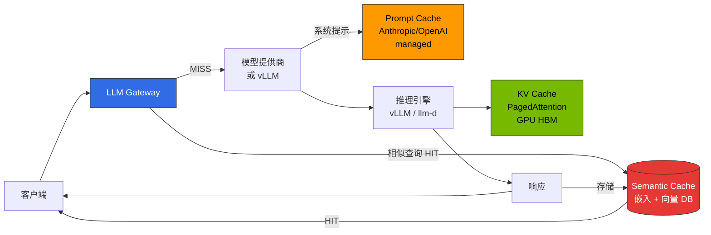
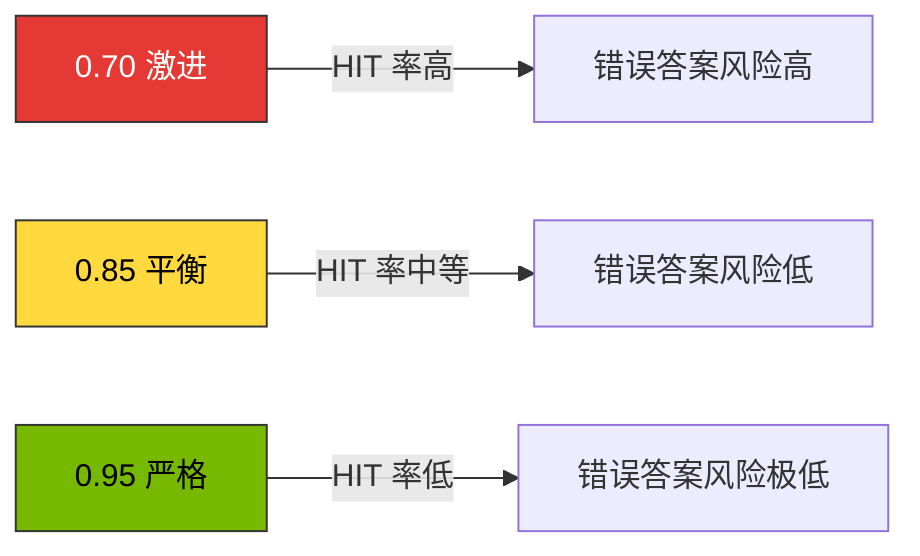

# Semantic Caching 策略

> 撰写日期：2026-04-17 | 阅读时间：约 10 分钟

本文档涵盖 LLM 推理流水线中**网关级别语义缓存（Semantic Caching）**的设计原则和运营考虑事项。

**实现指南**：工具比较表、Gateway 集成模式、配置示例、部署代码片段请参阅[推理网关配置指南 — Semantic Caching 实现选项](../../reference-architecture/inference-gateway-setup#semantic-caching-构现选项-advanced)。

## 1. 概述

### 为什么需要 Semantic Cache

在大规模 LLM 服务中，用户查询**表达不同但含义相同**的情况非常多。传统的字符串完全匹配缓存（HTTP cache、Redis key-value）无法消除这种重复。Semantic Cache 通过**基于嵌入的相似度**检测语义相似的请求并重用先前的响应，同时改善以下 3 个问题。

- **减少 token 成本**：缓存 HIT 时跳过 LLM 调用，节省 API 成本·GPU 时间
- **缩短延迟**：用向量查询（数 ms）响应，而不是生成延迟（数百 ms ~ 数秒）
- **释放 GPU 容量**：在自托管 vLLM/llm-d 环境中有效扩大吞吐量（throughput）

### 预期节省率（按阈值）

节省率因**用户查询的重复性**、**领域**（FAQ/客户支持/代码生成）、**提示结构**而有很大差异，下表数值为公开实现文档·供应商博客中观察到的一般范围。各组织应通过**渐进式推出**和 A/B 评估验证实际效果。

| 相似度阈值 | 运营策略 | 观察到的节省率范围 | 特点 |
|--------------|----------|-------------------|------|
| **0.95（严格）** | 仅缓存几乎相同的查询 | 约 10-15% | 错误答案风险极低，严格质量要求服务 |
| **0.85（平衡）** | 允许含义相同·表达差异 | 约 30-40% | 一般 LLM 聊天/助手推荐默认值 |
| **0.70（激进）** | 将相关主题也归为一组 | 约 50-60% | 仅限 FAQ/静态 KB 等重复率极高的工作负载 |

参考来源：[Redis — Building an LLM semantic cache](https://redis.io/blog/building-llm-applications-with-kernel-memory-and-redis/)、[Portkey Semantic Cache 文档](https://docs.portkey.ai/docs/product/ai-gateway/cache-simple-and-semantic)、[Helicone Caching 文档](https://docs.helicone.ai/features/advanced-usage/caching)、[GPTCache README](https://github.com/zilliztech/GPTCache)。

:::warning 节省率数值必须验证
上述数字是基于公开资料的**大致范围**。并非所有领域都有相同的 HIT 率。通过仪表板（§6）测量**自身工作负载的实际 HIT 率·false-positive 率**后确定阈值。
:::

---

## 2. 缓存层次划分

LLM 推理流水线中存在 **3 种不同的缓存层次**。各自的操作位置·存储单位·成本影响不同，Semantic Cache **补充而非替代**其他 2 层。

### 3 层缓存流程图

### 各层次比较表

| 项目 | KV Cache（vLLM PagedAttention） | Prompt Cache（Anthropic/OpenAI managed） | Semantic Cache（Gateway 级别） |
|------|-------------------------------|----------------------------------------|-------------------------------|
| **操作位置** | 推理引擎内部（GPU HBM） | 模型提供商侧 | Gateway（Bifrost/LiteLLM/Portkey）前端 |
| **存储单位** | token 单位 KV 块 | 显式 `cache_control` 标记区间 | 完整响应对象（文本/JSON） |
| **匹配方式** | **前缀（prefix）完全匹配** | 提供商内部基于哈希的完全匹配 | **嵌入余弦相似度** |
| **主要目的** | TTFT·吞吐量改善 | 减少重复系统提示成本 | **直接消除重复 LLM 调用** |
| **成本影响** | 节省 GPU 时间（自托管） | 输入 token 单价折扣（托管） | 跳过 API 调用本身 |
| **失败时影响** | 仅性能下降 | 缓存未应用时一般单价 | **直接影响响应质量**（错误答案风险） |
| **相关文档** | [vLLM 模型服务](../model-serving/inference-frameworks/vllm-model-serving.md) | 提供商官方文档 | 本文档 |

:::tip 三个层次可独立组合
Semantic Cache HIT → 立即响应（省略 LLM 调用）。MISS 时调用提供商 → Prompt Cache 减少系统提示输入成本 → 推理引擎内部 KV Cache 改善生成速度。三个层次**相互正交（orthogonal）**，通常同时启用。
:::

### 应用时机比较

- **原型/单模型**：仅 KV Cache（自动）+ Prompt Cache（提供商支持时）即可
- **多租户/多提供商**：添加 Gateway 级别 Semantic Cache — 吸收相同查询在多个用户间重复的模式
- **FAQ/聊天机器人/固定 KB**：降低 Semantic Cache 阈值（0.80~0.85）积极重用
- **代码生成/IDE 代理**：Semantic Cache **保守应用**（0.95）或禁用 — 即使相似查询，文件上下文不同导致重用风险大

---

## 3. 相似度阈值设计

### 各阈值的权衡

### 阈值选择标准

| 阈值 | 适合的工作负载 | 不适合的工作负载 | 备注 |
|--------|-------------|---------------|------|
| **0.95 以上** | 代码生成、法律·医疗助手、金融咨询 | （广泛适用） | 仅几乎无表达差异的相同查询 HIT |
| **0.85-0.94（推荐）** | 一般聊天机器人、客户支持、文档摘要、产品 Q&A | 代码生成（上下文敏感） | 允许含义相同·表达差异。大多数服务的默认值 |
| **0.75-0.84** | FAQ、静态 KB、内部文档搜索结果说明 | 对话推理、多轮对话 | 误报增加 — 需要响应验证层 |
| **0.70 以下** | 几乎不使用 — 仅限大量 FAQ | 所有通用服务 | 无关查询可能被归为一组的风险 |

### 设置阈值时的考虑因素

1. **用户容错度**：客户支持等"最接近的答案"即可时设低，代码·计算则设高
2. **领域词汇多样性**：术语同义词多的领域（医疗/法律）嵌入能很好地归类含义，即使降低也相对安全
3. **嵌入模型质量**：强大的嵌入（如 `text-embedding-3-large`、`bge-m3`）降低阈值也能保持安全性
4. **对话上下文**：多轮对话必须将前几轮包含在哈希键中（参见 §5）
5. **语言·区域**：多语言服务按语言分离 namespace 防止交叉污染

:::warning 阈值不是固定值，是基于观测的调优目标
初期以 0.90 保守开始，在 Langfuse/Grafana 仪表板中监控 **HIT 率、用户不满指标（👎、重新生成点击等）**，每次调整 0.05 是安全的做法。
:::

---

## 4. 实现考虑事项

实现 Semantic Cache 时考虑以下因素选择解决方案。

### 主要考虑因素

1. **现有基础设施复用可能性**：如果已有 Redis/Milvus 等向量 DB，可以无需额外后端实现
2. **网关集成必要性**：路由·防护栏和缓存是统一管理还是分离层
3. **托管 vs 自托管**：运营负担·合规性·成本权衡
4. **可观测性需求**：缓存 HIT/MISS 跟踪、false-positive 监控水平
5. **向量搜索引擎偏好**：Redis/Milvus/FAISS/Qdrant 等组织的标准栈

### 实现模式

**模式 A：Gateway 一体型** — 在单一产品中实现路由·缓存·可观测性（如 Portkey、Helicone）
- 优点：统一配置、快速部署
- 缺点：供应商锁定、高级功能依赖托管计划

**模式 B：模块化** — 网关（Bifrost/LiteLLM）+ 独立缓存层（RedisVL、GPTCache）
- 优点：各层可独立更换、优先开源
- 缺点：集成复杂度增加

**模式 C：托管型** — Redis Enterprise LangCache、Portkey SaaS
- 优点：运营负担最小、包含合规认证
- 缺点：成本、区域限制

具体的工具比较表、配置示例、部署代码片段请参阅 [Inference Gateway 配置指南 — Semantic Caching 实现选项](../../reference-architecture/inference-gateway-setup#semantic-caching-构现选项-advanced)。

---

## 5. 缓存键设计和多租户

Semantic Cache 位于**网关前端**，跳过 LLM 调用本身，因此缓存键设计和 namespace 分离直接影响响应质量·安全性·多租户。

### 缓存键组成要素

最简单的键是 `embedding(user_query)` 一个，但在实际服务中**必须**一起包含以下要素到键中。

**必须包含的要素：**
- `model_id`：防止模型种类·版本交叉污染（例：`glm-5` ≠ `qwen3-4b`）
- `system_prompt_hash`：系统提示不同则完全不同的答案
- `tenant_id | user_id`：多租户/按用户隔离
- `language | locale`：防止语言交叉污染
- `tool_set_hash`：代理的可用工具集
- `embedding(user_query)`：语义相似度匹配目标

### 多租户 namespace 策略

| 层次 | namespace 模式示例 | 隔离目的 |
|------|-------------------|----------|
| **组织/租户** | `cache:{tenantId}:*` | 数据隔离、审计边界 |
| **用户** | `cache:{tenantId}:{userId}:*` | 防止包含个人信息的查询在用户间泄露 |
| **语言** | `cache:{tenantId}:ko:*` / `:en:*` | 多语言服务中防止交叉污染 |
| **领域** | `cache:{tenantId}:support:*` / `:billing:*` | 阻止上下文不同的领域间重用 |
| **模型版本** | `cache:{...}:glm-5:v2026-03:*` | 模型升级时可批量 invalidation |

### 非确定性（non-determinism）处理

`temperature > 0`、`top_p < 1` 或包含工具调用的请求**每次响应不同**，简单重用可能导致用户体验下降。

**推荐策略：**
- 流式·代理型请求**默认禁用缓存**
- 仅对确定可重现的端点（如 `/summarize`、`/classify`）选择性允许
- 推荐仅缓存 `temperature=0` 请求的路由规则

具体的各 Gateway（kgateway、LiteLLM、Bifrost）集成模式、配置示例、代码片段请参阅 [Inference Gateway 配置指南 — Semantic Caching 实现选项](../../reference-architecture/inference-gateway-setup#semantic-caching-构现选项-advanced)。

---

## 6. 可观测性（Langfuse 联动）

Semantic Cache 是**直接影响用户**的层次，因此没有可观测性就无法运营。请务必使用 Langfuse 或同级观测栈收集以下内容。

### Langfuse Trace 标签

在每个请求 trace 上 attach 以下属性（Langfuse Python/TypeScript SDK 都支持 `metadata` 或 `tags`）。

- `cache_hit`：`true` / `false`
- `similarity_score`：`0.92`（HIT 时，匹配的最高相似度）
- `cache_source`：`redis-semantic` / `portkey` / `helicone` 等
- `cache_namespace`：`{tenant}:{lang}:{domain}`（禁止包含 PII）
- `cache_ttl_remaining_s`：剩余 TTL（调试用）
- `cache_eviction_reason`：MISS 原因（`below_threshold`、`namespace_miss`、`ttl_expired`）

### 仪表板推荐面板

使用 Langfuse 的自定义仪表板或 Prometheus + Grafana 可视化以下内容。

| 面板 | 查询/指标 | 目标值 |
|------|------------|--------|
| **整体 HIT 率** | `count(cache_hit=true) / count(*)` | 15-40%（按服务特性） |
| **HIT 率（按 namespace）** | group by `cache_namespace` | 监控租户偏差 |
| **similarity_score 分布** | histogram of `similarity_score` on HIT | 阈值附近 bin 需注意 |
| **False-positive 代理** | 👎 反馈 / 重新生成点击率（cache_hit=true 条件） | 相比基线无上升 |
| **节省 token 总计** | `sum(tokens_saved)` on HIT | 成本报告 |
| **缓存存储大小** | Redis `DBSIZE`、内存使用量 | TTL·eviction 策略检查 |

### 告警规则

| 告警 | 条件 | 严重度 |
|------|------|--------|
| HIT 率急剧下降 | HIT 率低于前 24h 平均的 50% | Warning — 可能是嵌入/Redis 故障 |
| HIT 率异常上升 | HIT 率超过 70% + false-positive 代理同步上升 | Critical — 怀疑阈值配置错误 |
| similarity_score 偏向 | 阈值 ±0.02 内 HIT 比例 > 40% | Warning — 边界匹配过多 |
| Redis 延迟 | P99 > 20ms | Warning — 缓存成为瓶颈 |

### Langfuse OTel 联动参考

Bifrost/LiteLLM 的 OTel 传输设置遵循现有 [LLMOps Observability](../../operations-mlops/llmops-observability) 和 [推理网关配置指南](../../reference-architecture/inference-gateway-setup) 文档。缓存相关标签在应用/网关插件层作为 span attribute 添加。

---

## 7. 实战检查清单

### 安全 & 隐私

- 禁止缓存包含 PII 的提示（将 Guardrails 部署在 Semantic Cache **前端**）
- 检测到提示注入时禁止缓存存储
- 防止跨租户泄露（强制 namespace 设计单元测试）
- 审计日志至少保留 90 天（HIT/MISS、namespace、similarity_score）

### 运营 & 生命周期

- **TTL**：静态 KB 7-30 天 / 产品信息 1-24h / 新闻·时序禁用
- **模型版本更换**：在键中包含版本（`glm-5:v2026-03`）→ 自然过期
- **嵌入模型更换**：必须全量重建
- **故障 fallback**：Redis 故障时 fail-open（提前确保原始 rate limit）
- **渐进式推出**：新策略通过 A/B 验证

### 质量防护栏

- 大响应·工具调用结果禁止缓存或短 TTL
- 用户 👎 反馈时自动 eviction 该 entry
- 每周评估缓存 HIT 样本（Ragas/LLM-judge）

### 部署前检查

- [ ] 缓存键包含 `model_id`、`system_prompt_hash`、`tenant_id`、`language`
- [ ] Guardrails 部署在缓存前端
- [ ] Langfuse 跟踪记录 `cache_hit`、`similarity_score`
- [ ] 配置 HIT 率 / false-positive 仪表板
- [ ] 验证 Redis 故障时 fail-open 场景

---

## 8. 各领域应用模式

即使是相同的 Semantic Cache 引擎，**键构成·阈值·TTL** 也会因领域而大不相同。

| 领域 | 阈值 | TTL | 特性 |
|--------|--------|-----|------|
| **FAQ / 产品 Q&A** | 0.80-0.85 | 24-72h | 查询重复性、答案固定性。键：`tenant+language+product_version` |
| **内部 KB** | 0.85-0.90 | 1-7d | 按权限隔离优先。键：`tenant+role_hash+language` |
| **客户支持** | 0.85 | 6-24h | PII 由 Guardrails redact 后嵌入。键：`tenant+intent+language` |
| **代码生成/IDE** | 0.97+ 或禁用 | 30m-2h | 上下文依赖性高。重构·调试建议禁用 |

**注意事项：**
- FAQ/产品 Q&A：产品版本变更时通过 `product_version` 键自然失效
- 内部 KB：ACL 变更时必须 flush 该用户 namespace
- 客户支持：PII（姓名、订单号）必须经过 Guardrails
- 代码生成：文件·仓库上下文不同，即使相同查询也需要不同答案

---

## 9. FAQ

**Q1. Semantic Cache 和 RAG 有何不同？**  
RAG 是从向量 DB 获取用于生成新响应的上下文，Semantic Cache 是重用现有完成响应。RAG 在 LLM 调用前增强输入，Semantic Cache 避免 LLM 调用本身。

**Q2. 流式响应也可以缓存吗？**  
可以，但重组·再现的复杂度高。初期建议从非流式端点开始应用。

**Q3. 嵌入模型选择标准是什么？**  
多语言用 `bge-m3`、`text-embedding-3-large`。仅英语用 `text-embedding-3-small`。模型更换时必须全量缓存失效。

**Q4. 为什么缓存 `temperature > 0` 请求有风险？**  
用户有意提高 temperature 是想要多样的答案，但返回相同答案违背期望。创意端点默认禁用缓存。

**Q5. 如果缓存 HIT 率低怎么办？**  
按顺序进行：检查 namespace 过度细分 → 降低阈值 0.05 → 评估嵌入模型质量。非 FAQ 的话 10-15% HIT 率也正常。

**Q6. 缓存响应的合规性问题？**  
在医疗·金融·法律领域，缓存 HIT 也可能有审计日志记录义务。务必记录 `cache_hit=true` 并遵守监管保存期限。

---

## 10. 参考资料

### 官方文档 & 代码仓库

- [Redis — Semantic Caching (RedisVL)](https://redis.io/docs/latest/develop/ai/redisvl/user_guide/semantic_caching/)
- [Redis LangCache（托管）](https://redis.io/langcache/)
- [Portkey — Semantic Cache](https://docs.portkey.ai/docs/product/ai-gateway/cache-simple-and-semantic)
- [Helicone — Caching](https://docs.helicone.ai/features/advanced-usage/caching)
- [LiteLLM — Caching](https://docs.litellm.ai/docs/proxy/caching)
- [Bifrost 官方文档](https://www.getmaxim.ai/bifrost/docs)
- [GPTCache (Zilliz)](https://github.com/zilliztech/GPTCache)

### 相关文档

- **实现指南**：[推理网关配置指南 — Semantic Caching 实现选项](../../reference-architecture/inference-gateway-setup#semantic-caching-构现选项-advanced) — 工具比较表、配置示例、部署代码片段
- [推理网关路由策略](../../reference-architecture/inference-gateway-routing)
- [OpenClaw AI Gateway 部署](../../reference-architecture/openclaw-ai-gateway.mdx)
- [LLMOps Observability](../../operations-mlops/llmops-observability)
- [Milvus 向量数据库](../../operations-mlops/milvus-vector-database)
- [Ragas 评估](../../operations-mlops/ragas-evaluation)

### 研究 & 背景

- [Anthropic — Prompt Caching](https://docs.anthropic.com/en/docs/build-with-claude/prompt-caching)
- [OpenAI — Prompt Caching](https://platform.openai.com/docs/guides/prompt-caching)
- [vLLM — PagedAttention (KV Cache)](https://docs.vllm.ai/en/latest/design/paged_attention.html)
