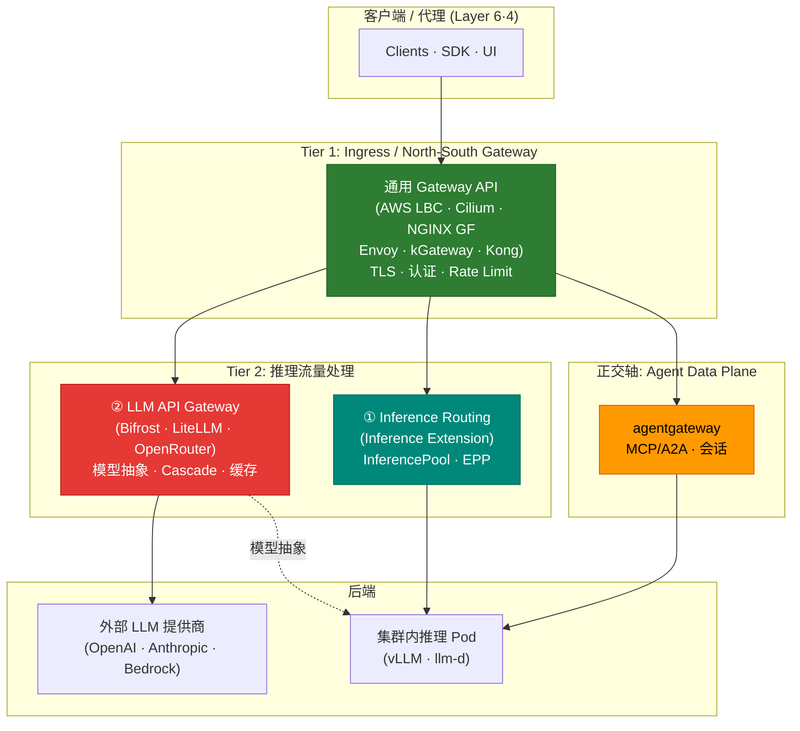

import Tabs from '@theme/Tabs';
import TabItem from '@theme/TabItem';

> 📅 **撰写日期**：2026-06-17 | **修订日期**：2026-06-17 | ⏱️ **阅读时间**：约 9 分钟

## 概述

Agentic AI 平台的网关层由具有不同职责的多个组件构成。此前，“推理网关（Inference Gateway）”一词同时指代**集群内推理 Pod 路由**和**外部 LLM 提供商代理**两种不同对象，造成混淆。本文档对网关层的**术语和角色进行统一定义**，并提供各层应使用何种解决方案的判断标准。

本文档聚焦于**定义与映射（map）**。各层的详细比较和部署步骤请参考正文链接所指向的专用文档。

:::info 本文档的定位
网关层对应[平台架构](../../design-architecture/foundations/agentic-platform-architecture.md)的 **Layer 5（Gateway & Routing）**。请求流向为 Layer 6（入口）→ Layer 5（网关）→ Layer 4（Agent），当 Agent 需要推理时再经由 Layer 5 调用 Layer 2（模型服务）。
:::

## 网关层定义

平台全局使用以下术语。不再使用含糊的“推理网关”，而是将集群内路由与 LLM API 代理**明确区分**。

| 层级 | 名称 | 角色 | 代表实现 |
|------|------|------|----------|
| **Tier 1** | Ingress / North-South Gateway | 外部流量接入、TLS 终止、路径路由、认证、Rate Limiting | AWS LBC · Cilium · NGINX GF · Envoy Gateway · kGateway · Kong |
| **Tier 2 ①** | Inference Routing（集群内） | 路由到集群内推理 Pod 组，KV 缓存/负载感知的端点选择 | Gateway API **Inference Extension**（InferencePool · EPP） |
| **Tier 2 ②** | LLM API Gateway（提供商代理） | 外部/内部模型抽象、模型选择/Cascade、成本追踪、Semantic Caching | Bifrost · LiteLLM · OpenRouter · Portkey · Helicone · Kong AI Gateway |
| **正交轴** | Agent Data Plane | MCP/A2A 协议、stateful 会话、工具路由 | agentgateway |

:::tip 核心区分 — Tier 2 ① vs ②
- **Tier 2 ① Inference Routing** 在**集群内部**运行。HTTPRoute 将 InferencePool 作为后端引用，EPP（Endpoint Picker）综合 KV 缓存和负载选择 vLLM/llm-d Pod 端点。处理自托管模型基础设施。
- **Tier 2 ② LLM API Gateway** **抽象模型 API**。通过 OpenAI 兼容 API 将外部提供商（OpenAI · Anthropic · Bedrock）或自托管模型暴露为统一接口，执行基于复杂度的 Cascade、成本追踪和缓存。
- 两者**并非互斥**。自托管推理用 ①、外部提供商集成用 ② 的混合配置较为常见。
:::

`Agent Data Plane`（agentgateway）是**正交轴**，而非层级。因为它处理 AI 专用协议（MCP/A2A）和 stateful 会话而非 HTTP 流量，故不纳入 Tier 1–2 的线性分层。

## 整体结构

## 各层应使用何种方案

各层的方案选型、详细比较和部署步骤在专用文档中说明。本表是**应在何处阅读什么**的地图。

| 层级 | 用什么填充 | 详细参考 |
|------|-----------|----------|
| **Tier 1** Ingress | 6 种通用 Gateway API 实现的比较与选型 | [Gateway API 采用指南](/docs/eks-best-practices/networking-performance/gateway-api-adoption-guide)（EKS Best Practices） |
| **Tier 2 ①** Inference Routing | Gateway API Inference Extension（InferencePool · EPP） | [路由策略 — Gateway API Inference Extension](./routing-strategy.md#gateway-api-inference-extension) |
| **Tier 2 ②** LLM API Gateway | Bifrost·LiteLLM·OpenRouter 等的比较及 Cascade/Semantic 策略 | [路由策略 — LLM Gateway 比较](./routing-strategy.md#llm-gateway-解决方案比较) · [部署指南](../../reference-architecture/inference-gateway/setup/) |
| **Agent Data Plane** | agentgateway（MCP/A2A） | [路由策略 — agentgateway 数据平面](./routing-strategy.md#agentgateway-数据平面) |

:::note Tier 1 与 Tier 2 的关系
**Tier 1（通用网关）** 从 EKS 网络视角深入讨论，负责包括 NGINX Ingress 退役应对在内的全部 North-South 流量。**Tier 2** 在其之上承担面向推理流量的专用路由。大多数 Agentic 平台会**同时**配置 Tier 1 和 Tier 2，而用何种方案组合填充这两层是设计的核心。
:::

## 流量流向示例

- **外部 LLM 调用**：Client → Tier 1（kgateway）→ Tier 2 ②（Bifrost/LiteLLM，Cascade·缓存）→ 外部提供商 → 响应 + 成本记录
- **自托管推理**：Client → Tier 1（kgateway）→ Tier 2 ①（InferencePool·EPP）→ vLLM/llm-d Pod → 响应
- **代理工具调用**：Client → Tier 1（kgateway）→ Agent Data Plane（agentgateway，MCP/A2A）→ 工具·会话

## 参考资料

### 官方文档
- [Kubernetes Gateway API](https://gateway-api.sigs.k8s.io/) — Tier 1 通用网关标准
- [Gateway API Inference Extension](https://gateway-api-inference-extension.sigs.k8s.io/) — Tier 2 ① 集群内推理路由（InferencePool·EPP）

### 相关文档（内部）
- [推理网关 & LLM Gateway 路由策略](./routing-strategy.md) — Tier 2 方案比较、Cascade、Semantic 策略
- [推理网关配置指南](../../reference-architecture/inference-gateway/setup/) — Tier 2 部署步骤（Helm·HTTPRoute·OTel）
- [Gateway API 采用指南](/docs/eks-best-practices/networking-performance/gateway-api-adoption-guide) — Tier 1 通用网关 6 种比较与选型
- [平台架构](../../design-architecture/foundations/agentic-platform-architecture.md) — Layer 5（Gateway & Routing）定义
