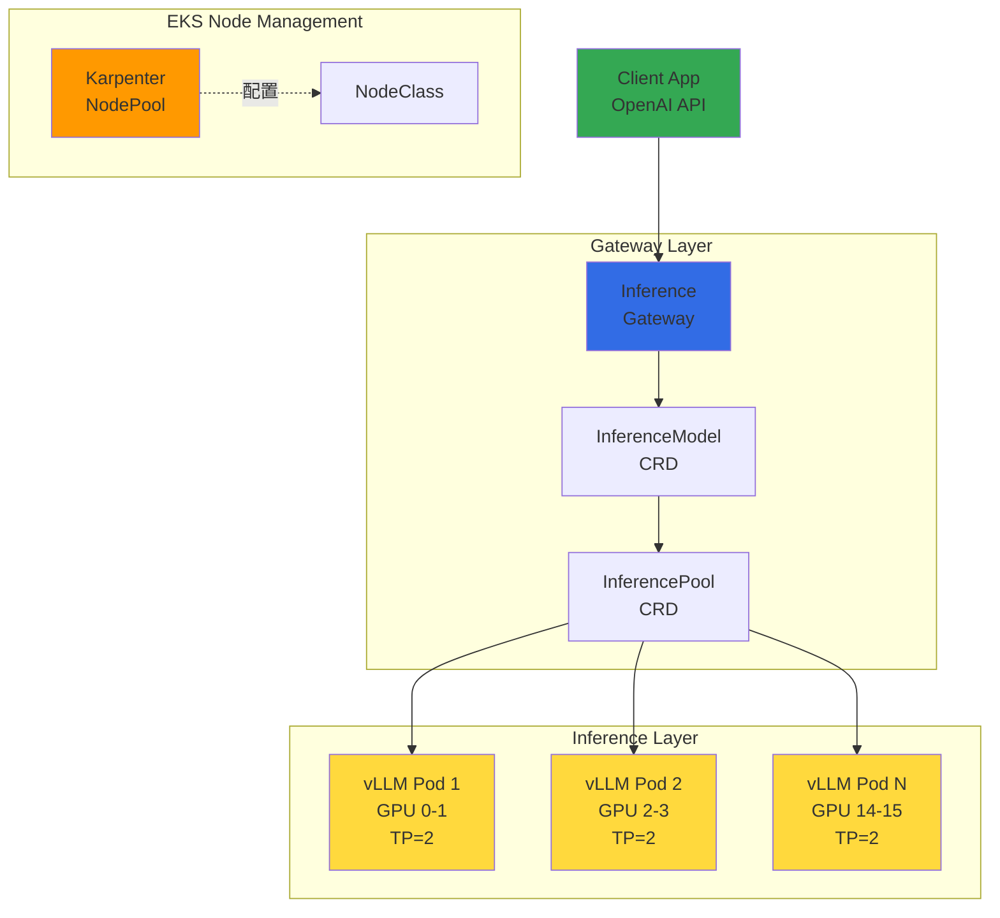
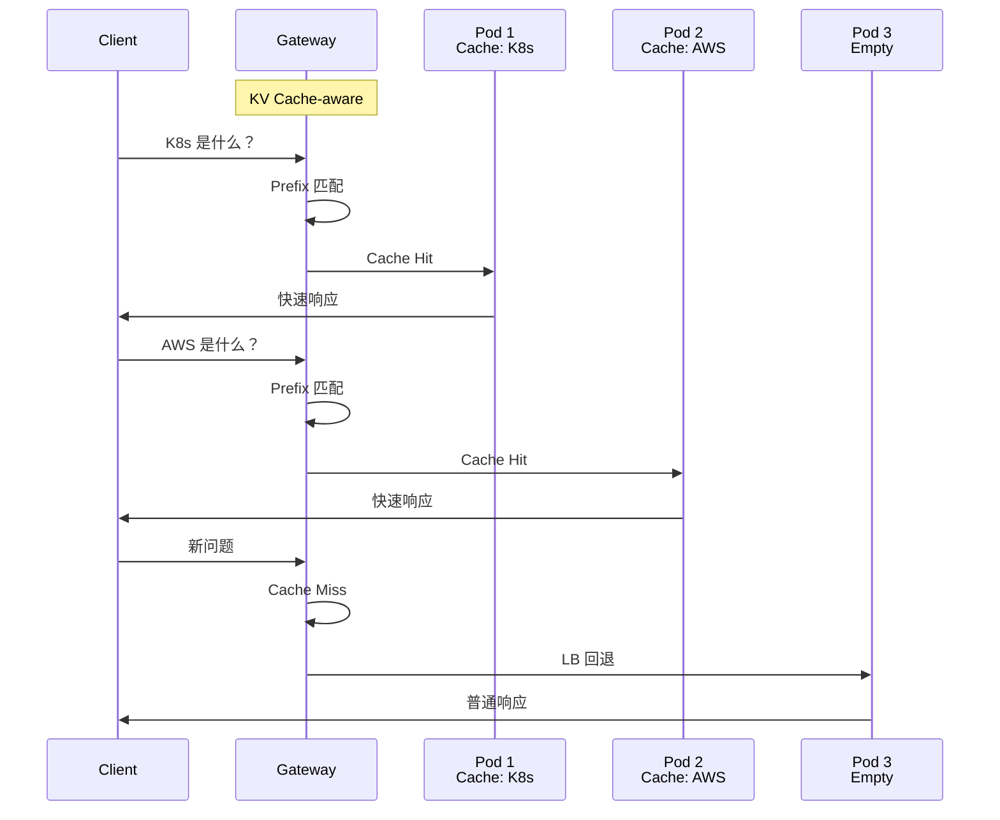
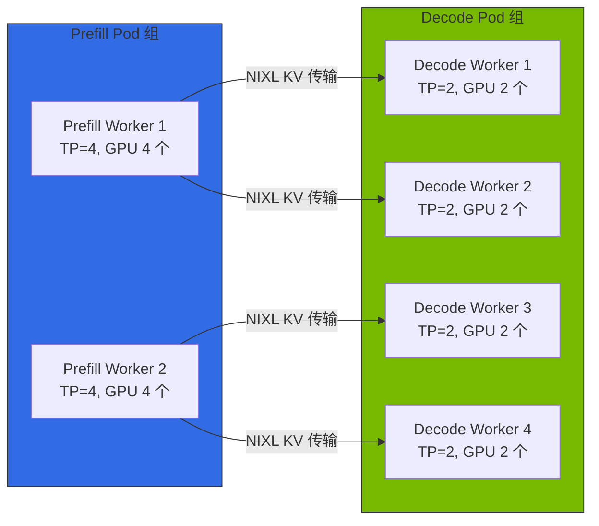
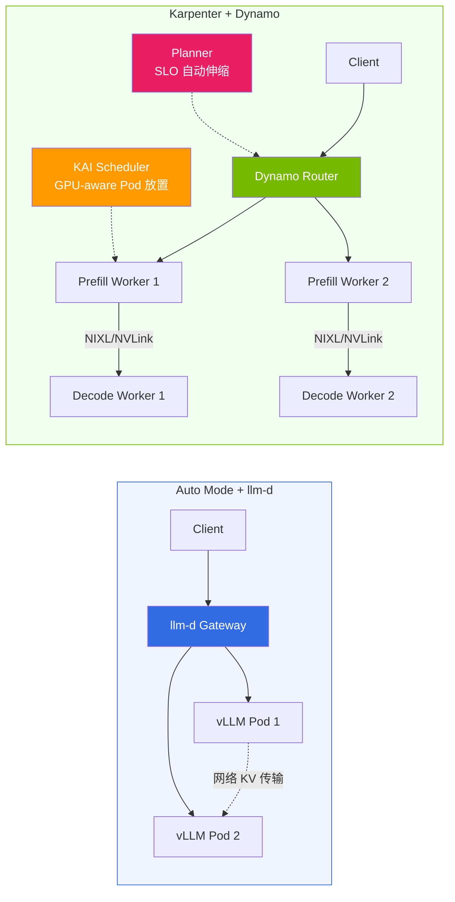

import { ComparisonTable, SpecificationTable } from '@site/src/components/tables';
import {
  WellLitPathTable, VllmComparisonTable, Qwen3SpecsTable, P5InstanceTable, P5eInstanceTable,
  GatewayCRDTable, DefaultDeploymentTable, KVCacheEffectsTable, MonitoringMetricsTable,
  ModelLoadingTable, CostOptimizationTable
} from '@site/src/components/LlmdTables';

# 基于 llm-d 的 EKS 分布式推理指南

> **当前版本**：llm-d v0.5+（2026.03）

> **创建日期**：2026-02-10 | **修改日期**：2026-04-06 | **阅读时间**：约 8 分钟

## 概述

llm-d 是 Red Hat 主导的 Apache 2.0 许可 Kubernetes 原生分布式推理栈。结合 vLLM 推理引擎、基于 Envoy 的 Inference Gateway 和 Kubernetes Gateway API，为大规模语言模型提供智能推理路由。

传统 vLLM 部署依赖简单的 Round-Robin 负载均衡，而 llm-d 通过 KV Cache 状态感知的智能路由，将相同 prefix 的请求转发到已持有该 KV Cache 的 Pod。从而显著缩短 Time To First Token（TTFT）并节省 GPU 算力。

:::tip 实战部署指南
llm-d 的 EKS 部署 YAML、helmfile 命令、集群创建等实战部署请参阅 [自定义模型部署指南](../reference-architecture/custom-model-deployment.md)。
:::

:::warning llm-d Inference Gateway 不等于通用 Gateway API 实现
llm-d 的基于 Envoy 的 Inference Gateway 是专为 **LLM 推理请求**设计的特殊用途网关。

- **llm-d Gateway**：基于 InferenceModel/InferencePool CRD、KV Cache 感知路由、推理流量专用
- **通用 Gateway API**：基于 HTTPRoute/GRPCRoute、TLS/认证/Rate Limiting、集群全局流量管理

生产环境推荐通用 Gateway API 实现负责集群入口，llm-d 在其下层优化 AI 推理流量。
:::

### llm-d 的 3 条 Well-Lit Path

llm-d 提供三条经过验证的部署路径。

<WellLitPathTable />

---

## 架构

llm-d 的 Intelligent Inference Scheduling 架构如下构成。



### llm-d vs 传统 vLLM 部署对比

<VllmComparisonTable />

### Gateway API CRD

llm-d 使用 Kubernetes Gateway API 和 Inference Extension CRD。

<GatewayCRDTable />

### 默认部署配置

<DefaultDeploymentTable />

### Qwen3-32B 模型选定原因

<Qwen3SpecsTable />

:::info Qwen3-32B 选定背景
Qwen3-32B 是 llm-d 的官方默认模型，Apache 2.0 许可商业使用自由。BF16 基准约 65GB VRAM，TP=2（2x GPU）可在 H100 80GB 上稳定服务。
:::

---

## KV Cache 感知路由

llm-d 的核心差异化是 KV Cache 状态感知的智能路由。



### 路由工作原理

1. **请求接收**：客户端向 Inference Gateway 发送推理请求
2. **Prefix 分析**：Gateway 对请求的 prompt prefix 进行哈希识别
3. **Cache 查询**：检查各 vLLM Pod 的 KV Cache 状态，搜索持有该 prefix 的 Pod
4. **智能路由**：Cache hit 时路由到该 Pod，miss 时基于负载进行负载均衡
5. **响应返回**：vLLM 通过 Gateway 将推理结果返回给客户端

### KV Cache 感知路由效果

<KVCacheEffectsTable />

:::tip 最大化 Cache Hit Rate
在使用相同系统 Prompt 的应用中 KV Cache 感知路由效果最大化。例如 RAG 流水线中反复引用相同上下文文档时，复用该 prefix 的 KV Cache 可显著缩短 TTFT。
:::

---

## EKS Auto Mode 集成

### Auto Mode 的优势和限制

**优势：**
- **GPU 驱动自动管理**：AWS 自动安装和更新 NVIDIA GPU 驱动
- **NodeClass 自动选择**：使用 `default` NodeClass 时 Auto Mode 自动选择最优 AMI 和驱动版本
- **运维简化**：消除驱动安装、CUDA 版本管理、驱动兼容性验证等运维负担
- **GPU Operator 可安装**：仅通过标签禁用 Device Plugin，DCGM/NFD/GFD 正常运行

**限制：**
- **MIG/Time-Slicing 不可**：Auto Mode 的 NodeClass 是 AWS 托管（只读），无法设置 GPU 分割
- **Custom AMI 不可**：需要特定 CUDA 版本或驱动锁定时无法应对

### Auto Mode vs Karpenter + GPU Operator 对比

| 标准 | EKS Auto Mode | Auto Mode + GPU Operator | Karpenter + GPU Operator |
|------|:---:|:---:|:---:|
| **适用模型大小** | 70B+（GPU 全量利用）| 70B+（GPU 全量利用）| 7B~30B（可 MIG 分割）|
| **GPU 驱动管理** | AWS 自动管理 | AWS 自动管理 | AMI 预装 |
| **Device Plugin** | AWS 管理 | 通过标签禁用 | GPU Operator 管理 |
| **DCGM 监控** | 仅基本指标 | DCGM Exporter 精细指标 | DCGM Exporter 精细指标 |
| **MIG / Time-Slicing** | 不可 | 不可 | 可以 |
| **KAI Scheduler** | 不可 | 可以（依赖 ClusterPolicy）| 可以 |
| **运维复杂度** | 低 | 中 | 中 |

按模型大小的详细成本分析请参阅 [EKS GPU 节点策略](./eks-gpu-node-strategy.md)。

### GPU 实例规格

<P5InstanceTable />

<P5eInstanceTable />

:::tip 实例选择指南
- **p5e.48xlarge（H200）**：100B+ 参数模型，最大内存利用
- **p5.48xlarge（H100）**：70B+ 参数模型，最高性能
- **g6e family（L40S）**：13B-70B 模型，性价比推理
:::

:::danger llm-d + DRA 使用时节点限制
llm-d ModelService 以 **DRA（ResourceClaim）** 方式请求 GPU 时，Karpenter 和 EKS Auto Mode 无法配置节点。DRA 的 ResourceSlice 需要节点创建后 DRA Driver 发布，因此 Karpenter 无法进行节点创建前的模拟。

- **使用 DRA 的部署**：必须用 **Managed Node Group + Cluster Autoscaler** 管理 GPU 节点
- **不使用 DRA 的部署**（`nvidia.com/gpu` Device Plugin 方式）：Auto Mode 和 Karpenter 正常工作
- **P6e-GB200 UltraServer**：DRA 必须（Device Plugin 不支持）

详情：[EKS GPU 节点策略 — DRA 工作负载的 MNG 策略](./eks-gpu-node-strategy.md#56-dra-工作负载的-managed-node-group-策略)
:::

---

## llm-d v0.5+ 主要功能

| 功能 | 说明 | 状态 |
|------|------|:----:|
| **Prefill/Decode Disaggregation** | 将 Prefill 和 Decode 分为独立 Pod 组，最大化大批量和长上下文吞吐量 | GA |
| **Expert Parallelism** | 将 MoE 模型（Mixtral、DeepSeek）的 Expert 分布到多个节点服务 | GA |
| **LoRA 适配器热交换** | 在单一基础模型上动态加载/卸载多个 LoRA 适配器 | GA |
| **多模型服务** | 在一个集群中通过 InferenceModel CRD 同时服务多个模型 | GA |
| **Gateway API Inference Extension** | 基于की InferencePool/InferenceModel CRD 的 K8s 原生路由 | GA |

### Disaggregated Serving 概念

Disaggregated Serving 分离 LLM 推理的两个阶段并分别独立优化：



| 阶段 | 特性 | 优化方向 |
|------|------|-----------|
| **Prefill** | 一次性处理整个 Prompt（compute-bound）| 集中 GPU 计算、高 TP |
| **Decode** | 逐 Token 自回归生成（memory-bound）| 集中 GPU 内存、低 TP |

**NIXL（NVIDIA Inference Xfer Library）**：Dynamo、llm-d、production-stack、aibrix 等大多数项目使用的公共 KV 传输引擎。通过 GPU 间直接通信（NVLink/RDMA）超高速传输 KV Cache。

### EKS Auto Mode 中的 Disaggregated Serving

Auto Mode 中无法进行 MIG 分区，因此**以实例（节点）为单位分离 Prefill/Decode 角色**。

```
Prefill NodePool (compute-heavy):
  p5.48xlarge x N 台 -> Prefill Pod (各 TP=4, GPU 4 个)

Decode NodePool (memory-heavy):
  p5.48xlarge x N 台 -> Decode Pod (各 TP=2, GPU 2 个 x 4 Pod/节点)
```

| 项目 | Auto Mode（节点分离）| Karpenter + GPU Operator（MIG 分离）|
|------|----------------------|-------------------------------------|
| **分离单位** | 实例（节点）| GPU 单位（MIG 分区）|
| **GPU 利用率** | Decode Pod TP=2 x 4 个/节点可优化 | MIG 在单 GPU 内分割，高利用率 |
| **运维复杂度** | 低 | 中（GPU Operator + MIG 设置）|
| **伸缩** | Prefill/Decode 独立伸缩方便 | 节点内 MIG 重配置时中断 |

:::tip GPU 空闲最小化
**推荐策略**：先用 Auto Mode 验证，需要成本优化时转向 Karpenter + GPU Operator + MIG。
:::

---

## llm-d vs NVIDIA Dynamo

llm-d 和 NVIDIA Dynamo 都提供 LLM 推理路由/调度但方法不同。详细对比请参阅 [NVIDIA GPU 栈 — llm-d vs Dynamo](./nvidia-gpu-stack.md#与-llm-d-的选择指南)。

| 项目 | llm-d | NVIDIA Dynamo |
|------|-------|---------------|
| **主导** | Red Hat（Apache 2.0）| NVIDIA（Apache 2.0）|
| **架构** | Aggregated + Disaggregated | Aggregated + Disaggregated（同等支持）|
| **KV Cache 传输** | NIXL（也支持网络）| NIXL（NVLink/RDMA 超高速）|
| **KV Cache 索引** | Prefix-aware 路由 | Flash Indexer（radix tree）|
| **路由** | Gateway API + Envoy EPP | Dynamo Router + 自有 EPP（Gateway API 集成）|
| **Pod 调度** | K8s 默认调度器 | KAI Scheduler（GPU-aware Pod 放置）|
| **自动伸缩** | HPA/KEDA 联动 | Planner（SLO：profiling -> autoscale）+ KEDA/HPA |
| **GPU Operator 需要** | 可选（Auto Mode 兼容）| 需要（KAI Scheduler 依赖 ClusterPolicy）|
| **复杂度** | 低 | 高 |
| **优势** | K8s 原生、轻量、快速引入 | Flash Indexer、KAI Scheduler、Planner SLO 自动伸缩 |

:::tip 选择指南
- **EKS Auto Mode + 快速启动**：llm-d（GPU Operator 可选）
- **小~中规模（GPU 16 个以下）**：llm-d
- **大规模（GPU 16 个+）、最大吞吐量**：Dynamo（Flash Indexer + Planner）
- **长上下文（128K+）**：Dynamo（3-tier KV Cache：GPU->CPU->SSD）
- **K8s Gateway API 标准遵从**：llm-d

从 llm-d 开始，规模增长后转向 Dynamo 是现实的。Dynamo 1.0 可将 llm-d 作为内部组件集成，与其说是完全替代关系，不如将 Dynamo 视为包含 llm-d 的超集。
:::

### 迁移路径



**分阶段迁移路径：**

| Phase | 配置 | 适用对象 |
|-------|------|----------|
| **Phase 1** | Auto Mode + llm-d | PoC、开发环境、GPU 16 个以下 |
| **Phase 1.5** | Auto Mode + GPU Operator + llm-d | 加强监控/调度 |
| **Phase 2a** | Karpenter + llm-d Disaggregated | 中规模生产、MIG 利用 |
| **Phase 2b** | MNG + DRA + llm-d | P6e-GB200、DRA 必须环境 |
| **Phase 3** | Karpenter + Dynamo | 大规模（GPU 16 个+）、最大性能 |

:::caution 迁移注意事项
Auto Mode 和 Karpenter 自管理可以在同一集群中混用。Phase 1.5 中在 Auto Mode NodePool 添加 `nvidia.com/gpu.deploy.device-plugin: "false"` 标签防止 Device Plugin 冲突。
:::

---

## 监控

### 主要监控指标

<MonitoringMetricsTable />

### 模型加载时间

<ModelLoadingTable />

### 成本优化

<CostOptimizationTable />

:::warning 成本注意
p5.48xlarge 每小时约 $98.32（us-west-2 On-Demand 基准）。2 台运营时**月约 $141,580**。测试完成后务必清理资源。
:::

---

## EKS Auto Mode GPU 实例支持现状（2026.04 验证）

### 实例支持矩阵

| 实例类型 | GPU | VRAM（总计）| Auto Mode 支持 | 验证状态 |
|-------------|-----|-----------|---------------|----------|
| g5.xlarge~48xlarge | A10G | 24~192GB | 正常 | 配置确认 |
| g6.xlarge~48xlarge | L4 | 24~192GB | 正常 | 配置确认 |
| g6e.xlarge~48xlarge | L40S | 48~384GB | 正常 | 配置确认 |
| p4d.24xlarge | A100 40GB x 8 | 320GB | 正常 | dry-run 确认 |
| p5.48xlarge | H100 80GB x 8 | 640GB | 正常 | **Spot 配置确认**（us-east-2）|
| p5en.48xlarge | H200 141GB x 8 | 1,128GB | 受限 | dry-run 通过，offering 匹配可能失败 |
| **p6-b200.48xlarge** | **B200 192GB x 8** | **1,536GB** | **不支持** | **`NoCompatibleInstanceTypes` 发生** |

:::warning p6 实例不支持
截至 2026 年 4 月，EKS Auto Mode 的托管 Karpenter **无法配置 p6-b200.48xlarge**。需要 p6 实例时请使用 EKS Standard Mode + Karpenter。
:::

### 按区域 GPU 容量可用性

| 区域 | p5.48xlarge On-Demand | p5.48xlarge Spot | Spot 价格 |
|------|---------------------|-----------------|----------|
| ap-northeast-2（首尔）| InsufficientCapacity | 未确认 | -- |
| **us-east-2（Ohio）** | 可用性波动 | **获取成功** | **$13~15/hr** |

**Spot 价格对比（us-east-2，2026.04）**：

| 实例 | On-Demand | Spot（最低）| VRAM | 节省率 |
|---------|-----------|------------|------|-------|
| p5.48xlarge | $55/hr | $12.5/hr | 640GB | 77% |
| p5en.48xlarge | ~$76/hr | $12.1/hr | 1,128GB | 84% |
| p6-b200.48xlarge | $114/hr | $11.4/hr | 1,536GB | 90% |

### GPU 配额注意事项

| 配额名称 | 适用实例 | 默认值 |
|-----------|-------------|--------|
| Running On-Demand P instances | p4d, p4de, p5, p5en | 384 |
| Running On-Demand G and VT instances | g5, g6, g6e | **64** |

:::caution G 实例配额陷阱
GPU NodePool 中同时设置 `instance-category: [g, p]` 时，Karpenter 可能先尝试 G 类型实例。只使用 P 类型请明确指定 `instance-category: [p]`。
:::

---

## 下一步

- [EKS GPU 节点策略](./eks-gpu-node-strategy.md) -- Auto Mode vs Karpenter vs Hybrid Node，按模型大小成本分析
- [vLLM 模型服务及性能优化](./vllm-model-serving.md) -- vLLM 基本概念及部署
- [MoE 模型服务指南](./moe-model-serving.md) -- Mixture of Experts 模型服务
- [GPU 资源管理](./gpu-resource-management.md) -- GPU 集群资源管理

---

## 参考资料

- [llm-d GitHub](https://github.com/llm-d/llm-d)
- [llm-d Deployer (Helm Charts)](https://github.com/llm-d/llm-d-deployer)
- [EKS Auto Mode 文档](https://docs.aws.amazon.com/eks/latest/userguide/automode.html)
- [Gateway API Inference Extension](https://gateway-api.sigs.k8s.io/geps/gep-3567/)
- [vLLM 官方文档](https://docs.vllm.ai/)
- [Qwen3-32B HuggingFace](https://huggingface.co/Qwen/Qwen3-32B)
