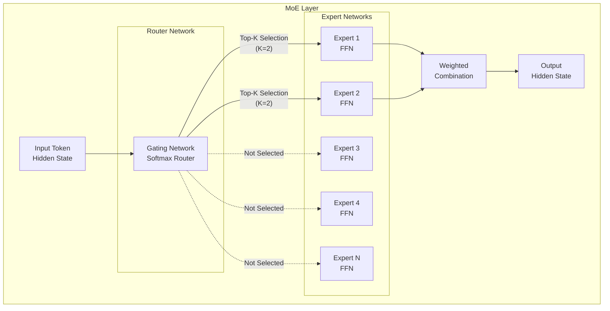
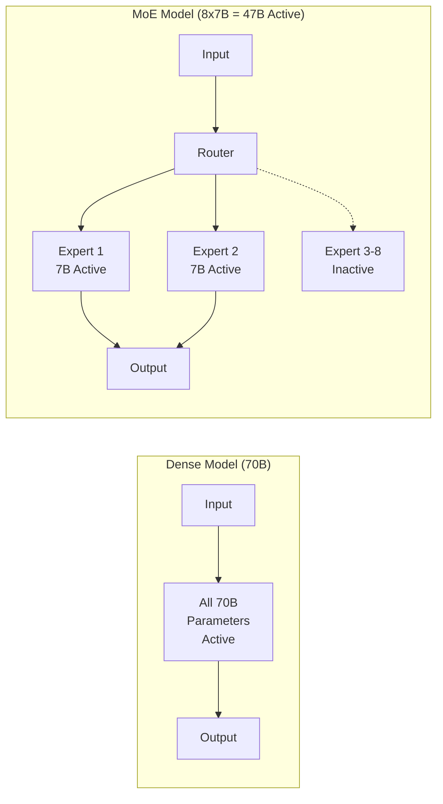
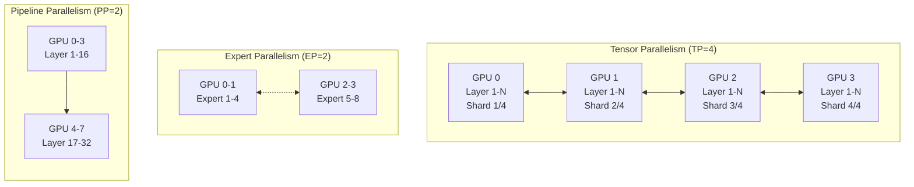
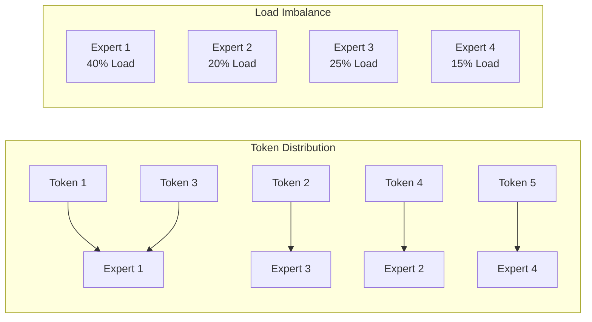
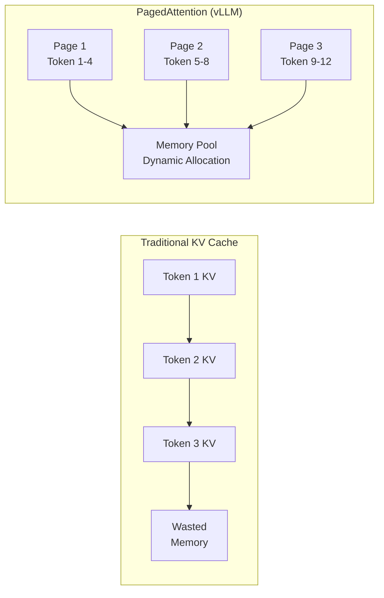
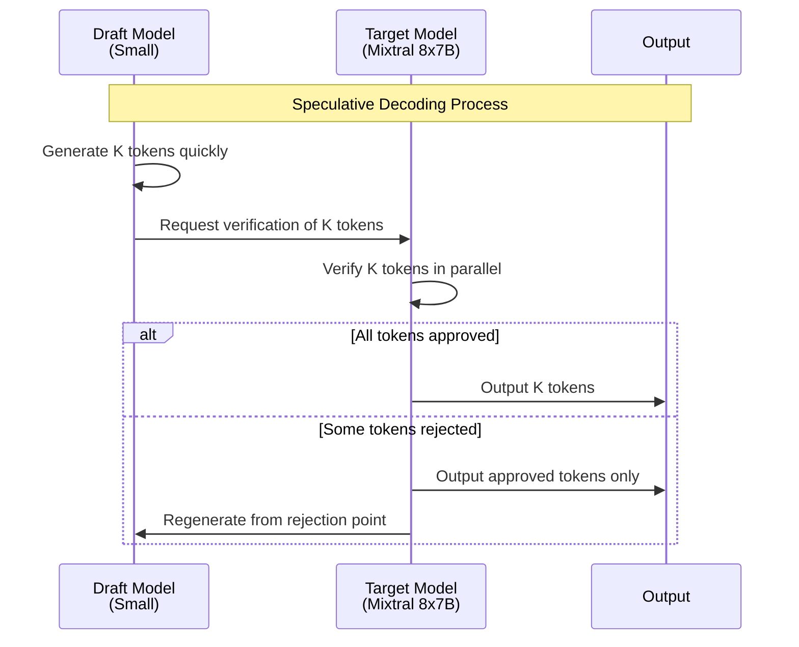

import { RoutingMechanisms, MoeVsDense, GpuMemoryRequirements, ParallelizationStrategies, TensorParallelismConfig, VllmVsTgi, KvCacheConfig, BatchOptimization, MonitoringMetrics, GpuVsTrainium2 } from '@site/src/components/MoeModelTables';

# MoE 模型服务指南

> 📅 **撰写日期**: 2025-02-05 | **修改日期**: 2026-02-14 | ⏱️ **阅读时间**: 约 5 分钟

## 概述

Mixture of Experts（MoE）模型代表了一种创新架构，可最大化大语言模型的效率。本文涵盖如何在 Amazon EKS 环境中高效部署和运营 Mixtral、DeepSeek-MoE 和 Qwen-MoE 等 MoE 模型。

### 核心目标

- **理解 MoE 架构**：学习专家网络和路由机制的工作原理
- **高效部署**：使用 vLLM 和 TGI 优化 MoE 模型服务
- **资源优化**：GPU 内存管理和分布式部署策略
- **性能调优**：KV Cache 和推测解码等高级优化技术

---

## 理解 MoE 架构

### 专家网络结构

MoE 模型由多个"专家（Expert）"网络和一个在其中进行选择的"路由器（Gate）"网络组成。



### 路由机制

MoE 模型的核心是根据输入 Token 选择合适专家的路由机制。

<RoutingMechanisms />

:::info 路由工作原理

1. **Gate 计算**：将输入 Token 的隐藏状态通过 Gate 网络
2. **专家选择**：从 Softmax 输出中选择 Top-K 个专家
3. **并行处理**：选中的专家并行处理输入
4. **加权组合**：使用 Gate 权重组合专家输出

:::

### MoE 与 Dense 模型对比

<MoeVsDense />



:::tip MoE 模型的优势

- **计算效率**：仅激活所有参数的一个子集，提升推理速度
- **可扩展性**：通过增加专家来扩展模型容量
- **专业化**：每个专家可以专注于特定领域/任务

:::

---

## MoE 模型服务注意事项

### GPU 内存需求

MoE 模型激活的参数较少，但必须将所有专家加载到内存中。

<GpuMemoryRequirements />

:::warning 重要的内存计算说明

- **KV Cache**：根据批处理大小和序列长度需要额外内存
- **激活内存**：推理期间中间激活值的空间
- **CUDA 上下文**：每个 GPU 大约 1-2GB CUDA 开销
- **安全余量**：生产运营中预留 10-20% 的额外空间

:::

### 分布式部署策略

大型 MoE 模型无法加载到单个 GPU 上，因此分布式部署至关重要。



<ParallelizationStrategies />

### 专家激活模式

理解专家激活模式对于优化 MoE 模型性能至关重要。



:::info 专家负载均衡

- **辅助损失**：训练时使用辅助损失鼓励专家均匀分布
- **容量因子**：限制每个专家处理的最大 Token 数
- **Token 丢弃**：超出容量时丢弃 Token（推理时不推荐使用）

:::

---

## 使用 vLLM 部署 MoE

### vLLM MoE 支持特性

vLLM 为 MoE 模型提供以下优化：

- **Expert Parallelism**：将专家分布到多个 GPU
- **Tensor Parallelism**：在层内拆分张量
- **PagedAttention**：高效 KV Cache 管理
- **Continuous Batching**：动态批处理

### Mixtral 8x7B 部署 YAML

```yaml
apiVersion: apps/v1
kind: Deployment
metadata:
  name: mixtral-8x7b-vllm
  namespace: inference
  labels:
    app: mixtral-8x7b
    serving-engine: vllm
spec:
  replicas: 1
  selector:
    matchLabels:
      app: mixtral-8x7b
  template:
    metadata:
      labels:
        app: mixtral-8x7b
        serving-engine: vllm
    spec:
      nodeSelector:
        node.kubernetes.io/instance-type: p4d.24xlarge
      tolerations:
        - key: nvidia.com/gpu
          operator: Exists
          effect: NoSchedule
      containers:
        - name: vllm
          image: vllm/vllm-openai:v0.6.0
          ports:
            - name: http
              containerPort: 8000
              protocol: TCP
          env:
            - name: HUGGING_FACE_HUB_TOKEN
              valueFrom:
                secretKeyRef:
                  name: hf-token
                  key: token
            - name: VLLM_ATTENTION_BACKEND
              value: "FLASH_ATTN"
          args:
            - "--model"
            - "mistralai/Mixtral-8x7B-Instruct-v0.1"
            - "--tensor-parallel-size"
            - "2"
            - "--max-model-len"
            - "32768"
            - "--gpu-memory-utilization"
            - "0.90"
            - "--enable-chunked-prefill"
            - "--max-num-batched-tokens"
            - "32768"
            - "--trust-remote-code"
            - "--dtype"
            - "bfloat16"
          resources:
            requests:
              nvidia.com/gpu: 2
              memory: "180Gi"
              cpu: "24"
            limits:
              nvidia.com/gpu: 2
              memory: "200Gi"
              cpu: "32"
          volumeMounts:
            - name: model-cache
              mountPath: /root/.cache/huggingface
            - name: shm
              mountPath: /dev/shm
          livenessProbe:
            httpGet:
              path: /health
              port: 8000
            initialDelaySeconds: 300
            periodSeconds: 30
            timeoutSeconds: 10
          readinessProbe:
            httpGet:
              path: /health
              port: 8000
            initialDelaySeconds: 120
            periodSeconds: 10
            timeoutSeconds: 5
      volumes:
        - name: model-cache
          persistentVolumeClaim:
            claimName: model-cache-pvc
        - name: shm
          emptyDir:
            medium: Memory
            sizeLimit: 16Gi
      terminationGracePeriodSeconds: 120
```

### Mixtral 8x22B 大规模部署（4 GPU）

```yaml
apiVersion: apps/v1
kind: Deployment
metadata:
  name: mixtral-8x22b-vllm
  namespace: inference
  labels:
    app: mixtral-8x22b
    serving-engine: vllm
spec:
  replicas: 1
  selector:
    matchLabels:
      app: mixtral-8x22b
  template:
    metadata:
      labels:
        app: mixtral-8x22b
        serving-engine: vllm
    spec:
      nodeSelector:
        node.kubernetes.io/instance-type: p5.48xlarge
      tolerations:
        - key: nvidia.com/gpu
          operator: Exists
          effect: NoSchedule
      containers:
        - name: vllm
          image: vllm/vllm-openai:v0.6.0
          ports:
            - name: http
              containerPort: 8000
          env:
            - name: HUGGING_FACE_HUB_TOKEN
              valueFrom:
                secretKeyRef:
                  name: hf-token
                  key: token
            - name: NCCL_DEBUG
              value: "INFO"
            - name: NCCL_IB_DISABLE
              value: "0"
          args:
            - "--model"
            - "mistralai/Mixtral-8x22B-Instruct-v0.1"
            - "--tensor-parallel-size"
            - "4"
            - "--max-model-len"
            - "65536"
            - "--gpu-memory-utilization"
            - "0.92"
            - "--enable-chunked-prefill"
            - "--max-num-batched-tokens"
            - "65536"
            - "--dtype"
            - "bfloat16"
            - "--enforce-eager"
          resources:
            requests:
              nvidia.com/gpu: 4
              memory: "400Gi"
              cpu: "48"
            limits:
              nvidia.com/gpu: 4
              memory: "500Gi"
              cpu: "64"
          volumeMounts:
            - name: model-cache
              mountPath: /root/.cache/huggingface
            - name: shm
              mountPath: /dev/shm
      volumes:
        - name: model-cache
          persistentVolumeClaim:
            claimName: model-cache-pvc
        - name: shm
          emptyDir:
            medium: Memory
            sizeLimit: 32Gi
```

### vLLM Tensor Parallelism 配置

Tensor Parallelism 将模型的每一层拆分到多个 GPU 上。

<TensorParallelismConfig />

:::tip Tensor Parallelism 优化

- **NVLink 利用**：使用支持 NVLink 的实例实现高速 GPU 通信
- **TP 大小选择**：根据模型大小和 GPU 内存选择最小 TP 大小
- **通信开销**：更大的 TP 大小会增加 All-Reduce 通信量

:::

### vLLM Expert Parallelism 配置

Expert Parallelism 将 MoE 模型的专家分布到多个 GPU 上。

```yaml
# 启用 Expert Parallelism 示例
args:
  - "--model"
  - "mistralai/Mixtral-8x7B-Instruct-v0.1"
  - "--tensor-parallel-size"
  - "2"
  # Expert Parallelism 在 vLLM 中会自动优化
  # 专家在 TP 内分布
  - "--distributed-executor-backend"
  - "ray"  # 或 "mp"（multiprocessing）
```

---

## 使用 TGI 部署 MoE

### TGI MoE 支持特性

Text Generation Inference（TGI）是 Hugging Face 开发的高性能推理服务器。

- **Flash Attention 2**：内存高效的注意力计算
- **Paged Attention**：动态 KV Cache 管理
- **Tensor Parallelism**：多 GPU 分布式推理
- **Quantization**：支持 AWQ、GPTQ、EETQ

### TGI Mixtral 8x7B 部署 YAML

```yaml
apiVersion: apps/v1
kind: Deployment
metadata:
  name: mixtral-8x7b-tgi
  namespace: inference
  labels:
    app: mixtral-8x7b
    serving-engine: tgi
spec:
  replicas: 1
  selector:
    matchLabels:
      app: mixtral-8x7b-tgi
  template:
    metadata:
      labels:
        app: mixtral-8x7b-tgi
        serving-engine: tgi
    spec:
      nodeSelector:
        node.kubernetes.io/instance-type: p4d.24xlarge
      tolerations:
        - key: nvidia.com/gpu
          operator: Exists
          effect: NoSchedule
      containers:
        - name: tgi
          image: ghcr.io/huggingface/text-generation-inference:2.3.0
          ports:
            - name: http
              containerPort: 8080
              protocol: TCP
          env:
            - name: HUGGING_FACE_HUB_TOKEN
              valueFrom:
                secretKeyRef:
                  name: hf-token
                  key: token
            - name: MODEL_ID
              value: "mistralai/Mixtral-8x7B-Instruct-v0.1"
            - name: NUM_SHARD
              value: "2"
            - name: MAX_INPUT_LENGTH
              value: "8192"
            - name: MAX_TOTAL_TOKENS
              value: "32768"
            - name: MAX_BATCH_PREFILL_TOKENS
              value: "32768"
            - name: DTYPE
              value: "bfloat16"
            - name: QUANTIZE
              value: ""  # 或 "awq"、"gptq"
            - name: TRUST_REMOTE_CODE
              value: "true"
          resources:
            requests:
              nvidia.com/gpu: 2
              memory: "180Gi"
              cpu: "24"
            limits:
              nvidia.com/gpu: 2
              memory: "200Gi"
              cpu: "32"
          volumeMounts:
            - name: model-cache
              mountPath: /data
            - name: shm
              mountPath: /dev/shm
          livenessProbe:
            httpGet:
              path: /health
              port: 8080
            initialDelaySeconds: 300
            periodSeconds: 30
          readinessProbe:
            httpGet:
              path: /health
              port: 8080
            initialDelaySeconds: 120
            periodSeconds: 10
      volumes:
        - name: model-cache
          persistentVolumeClaim:
            claimName: model-cache-pvc
        - name: shm
          emptyDir:
            medium: Memory
            sizeLimit: 16Gi
```

### TGI 量化部署（AWQ）

使用 AWQ 量化模型提高内存效率。

```yaml
apiVersion: apps/v1
kind: Deployment
metadata:
  name: mixtral-8x7b-tgi-awq
  namespace: inference
spec:
  replicas: 1
  selector:
    matchLabels:
      app: mixtral-8x7b-tgi-awq
  template:
    metadata:
      labels:
        app: mixtral-8x7b-tgi-awq
    spec:
      nodeSelector:
        node.kubernetes.io/instance-type: g5.48xlarge
      tolerations:
        - key: nvidia.com/gpu
          operator: Exists
          effect: NoSchedule
      containers:
        - name: tgi
          image: ghcr.io/huggingface/text-generation-inference:2.3.0
          ports:
            - name: http
              containerPort: 8080
          env:
            - name: HUGGING_FACE_HUB_TOKEN
              valueFrom:
                secretKeyRef:
                  name: hf-token
                  key: token
            - name: MODEL_ID
              value: "TheBloke/Mixtral-8x7B-Instruct-v0.1-AWQ"
            - name: NUM_SHARD
              value: "2"
            - name: MAX_INPUT_LENGTH
              value: "8192"
            - name: MAX_TOTAL_TOKENS
              value: "16384"
            - name: QUANTIZE
              value: "awq"
          resources:
            requests:
              nvidia.com/gpu: 2
              memory: "90Gi"
              cpu: "16"
            limits:
              nvidia.com/gpu: 2
              memory: "120Gi"
              cpu: "24"
```

### vLLM 与 TGI 性能对比

<VllmVsTgi />

:::tip 推理引擎选择指南

- **vLLM**：需要最大吞吐量时，大规模批处理场景
- **TGI**：Hugging Face 生态系统集成，易于部署
- **两者皆可**：两个引擎都能很好地支持 MoE 模型，根据工作负载选择

:::

---

## Service 和 Ingress 配置

### MoE 模型 Service YAML

```yaml
apiVersion: v1
kind: Service
metadata:
  name: mixtral-8x7b-service
  namespace: inference
  labels:
    app: mixtral-8x7b
spec:
  type: ClusterIP
  ports:
    - name: http
      port: 8000
      targetPort: 8000
      protocol: TCP
  selector:
    app: mixtral-8x7b
---
apiVersion: v1
kind: Service
metadata:
  name: mixtral-8x7b-tgi-service
  namespace: inference
  labels:
    app: mixtral-8x7b-tgi
spec:
  type: ClusterIP
  ports:
    - name: http
      port: 8080
      targetPort: 8080
      protocol: TCP
  selector:
    app: mixtral-8x7b-tgi
```

### Gateway API HTTPRoute 配置

```yaml
apiVersion: gateway.networking.k8s.io/v1
kind: HTTPRoute
metadata:
  name: moe-model-route
  namespace: inference
spec:
  parentRefs:
    - name: inference-gateway
      namespace: gateway-system
  hostnames:
    - "inference.example.com"
  rules:
    - matches:
        - path:
            type: PathPrefix
            value: /v1/mixtral
      backendRefs:
        - name: mixtral-8x7b-service
          port: 8000
      filters:
        - type: URLRewrite
          urlRewrite:
            path:
              type: ReplacePrefixMatch
              replacePrefixMatch: /v1
    - matches:
        - path:
            type: PathPrefix
            value: /v1/mixtral-tgi
      backendRefs:
        - name: mixtral-8x7b-tgi-service
          port: 8080
```

---

## 性能优化

### KV Cache 优化

KV Cache 是显著影响推理性能的关键要素。



#### vLLM KV Cache 配置

```yaml
args:
  - "--model"
  - "mistralai/Mixtral-8x7B-Instruct-v0.1"
  # 分配给 KV Cache 的 GPU 内存比例
  - "--gpu-memory-utilization"
  - "0.90"
  # 最大序列长度（影响 KV Cache 大小）
  - "--max-model-len"
  - "32768"
  # 使用分块预填充提高内存效率
  - "--enable-chunked-prefill"
  # 每批次最大 Token 数
  - "--max-num-batched-tokens"
  - "32768"
```

<KvCacheConfig />

### 推测解码

推测解码使用小型草稿模型来加速推理速度。



#### vLLM 推测解码配置

```yaml
args:
  - "--model"
  - "mistralai/Mixtral-8x7B-Instruct-v0.1"
  - "--tensor-parallel-size"
  - "2"
  # 启用推测解码
  - "--speculative-model"
  - "mistralai/Mistral-7B-Instruct-v0.2"
  # 草稿模型生成的 Token 数
  - "--num-speculative-tokens"
  - "5"
  # 草稿模型的 Tensor Parallel 大小
  - "--speculative-draft-tensor-parallel-size"
  - "1"
```

:::info 推测解码效果

- **速度提升**：吞吐量提升 1.5 倍 - 2.5 倍（因工作负载而异）
- **质量保持**：输出质量保持不变（通过验证保证）
- **额外内存**：草稿模型需要额外的 GPU 内存

:::

### 批处理优化

高效的批处理可最大化 GPU 利用率。

```yaml
args:
  - "--model"
  - "mistralai/Mixtral-8x7B-Instruct-v0.1"
  # 连续批处理设置
  - "--max-num-seqs"
  - "256"  # 最大并发序列数
  - "--max-num-batched-tokens"
  - "32768"  # 每批次最大 Token 数
  # 分离预填充和解码
  - "--enable-chunked-prefill"
  - "--max-num-batched-tokens"
  - "32768"
```

<BatchOptimization />

---

## 监控与告警

### MoE 模型特定指标

```yaml
apiVersion: monitoring.coreos.com/v1
kind: ServiceMonitor
metadata:
  name: moe-model-monitor
  namespace: monitoring
spec:
  selector:
    matchLabels:
      app: mixtral-8x7b
  endpoints:
    - port: http
      path: /metrics
      interval: 15s
  namespaceSelector:
    matchNames:
      - inference
```

### 关键监控指标

<MonitoringMetrics />

### Prometheus 告警规则

```yaml
apiVersion: monitoring.coreos.com/v1
kind: PrometheusRule
metadata:
  name: moe-model-alerts
  namespace: monitoring
spec:
  groups:
    - name: moe-model-alerts
      rules:
        - alert: MoEModelHighLatency
          expr: |
            histogram_quantile(0.95,
              rate(vllm:e2e_request_latency_seconds_bucket[5m])
            ) > 30
          for: 5m
          labels:
            severity: warning
          annotations:
            summary: "MoE 模型响应延迟（P95 > 30s）"
            description: "{{ $labels.model_name }} 的 P95 延迟超过 30 秒。"

        - alert: MoEModelKVCacheFull
          expr: vllm:gpu_cache_usage_perc > 0.95
          for: 2m
          labels:
            severity: critical
          annotations:
            summary: "KV Cache 容量不足"
            description: "KV Cache 利用率超过 95%。新请求可能被拒绝。"

        - alert: MoEModelQueueBacklog
          expr: vllm:num_requests_waiting > 100
          for: 5m
          labels:
            severity: warning
          annotations:
            summary: "请求队列积压增加"
            description: "等待请求超过 100 个。请考虑扩容。"
```

---

## 故障排除

### 常见问题与解决方案

#### OOM（内存不足）错误

```bash
# 症状：CUDA out of memory 错误
# 解决方案：
# 1. 降低 gpu-memory-utilization 值
--gpu-memory-utilization 0.85

# 2. 减小 max-model-len
--max-model-len 16384

# 3. 增加 tensor parallel size（使用更多 GPU）
--tensor-parallel-size 4
```

#### 模型加载缓慢

```bash
# 症状：模型加载超过 10 分钟
# 解决方案：
# 1. 使用模型缓存 PVC
# 2. 使用 FSx for Lustre 实现快速模型加载
# 3. 预下载模型
```

#### 专家负载不均衡

```bash
# 症状：仅特定 GPU 显示高利用率
# 解决方案：
# 1. 增加批处理大小以改善 Token 分布
--max-num-seqs 256

# 2. 多样化输入以激活不同的专家
```

:::warning 调试技巧

- **调整日志级别**：使用 `VLLM_LOGGING_LEVEL=DEBUG` 环境变量获取详细日志
- **NCCL 调试**：使用 `NCCL_DEBUG=INFO` 诊断 GPU 通信问题
- **内存分析**：使用 `nvidia-smi dmon` 进行实时 GPU 内存监控

:::

---

## 总结

MoE 模型服务实现了大语言模型的高效部署。

### 核心要点

1. **理解架构**：学习专家网络和路由机制的工作原理
2. **规划内存**：确保足够的 GPU 内存来加载所有专家
3. **分布式部署**：适当组合 Tensor Parallelism 和 Expert Parallelism
4. **选择引擎**：选择 vLLM（高吞吐量）或 TGI（易于部署）
5. **优化性能**：应用 KV Cache、推测解码和批处理优化

### 后续步骤

- [GPU 资源管理](./gpu-resource-management.md) - 动态 GPU 集群资源分配
- [推理网关路由](./inference-gateway-routing.md) - 多模型路由策略
- [Agentic AI 平台架构](./agentic-platform-architecture.md) - 完整平台搭建

---

## 参考资料

- [vLLM 官方文档](https://docs.vllm.ai/)
- [TGI 官方文档](https://huggingface.co/docs/text-generation-inference)
- [Mixtral 模型卡](https://huggingface.co/mistralai/Mixtral-8x7B-Instruct-v0.1)
- [MoE 架构论文](https://arxiv.org/abs/2101.03961)
- [PagedAttention 论文](https://arxiv.org/abs/2309.06180)
