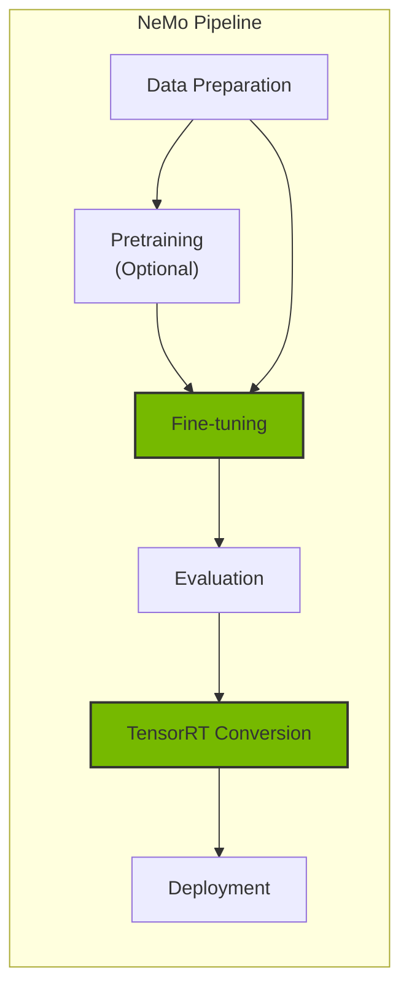
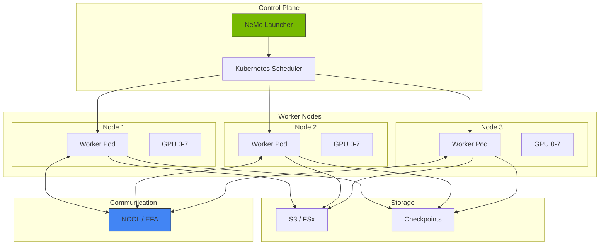
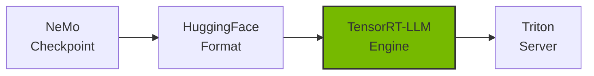
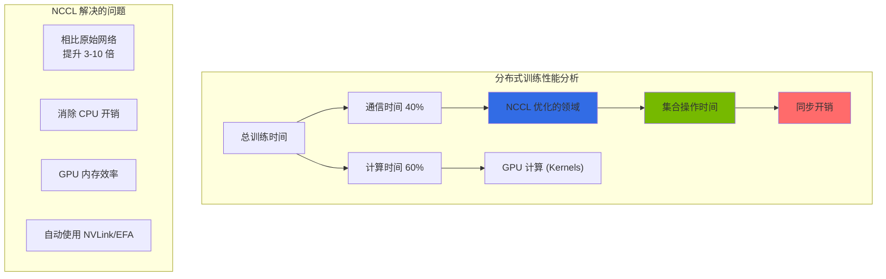
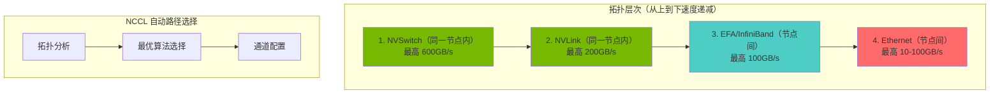

import { NemoComponents, GPURequirements, CheckpointSharding, MonitoringMetrics, NCCLImportance } from '@site/src/components/NemoTables';

# NeMo 框架

NVIDIA NeMo 是一个端到端的框架，用于训练、微调和优化大语言模型（LLM）。它支持在 Kubernetes 环境中进行分布式训练和高效模型部署。

## 概述

### 为什么需要 NeMo

当 Agentic AI 平台需要领域专用模型时：

- **领域适配**：为特定行业/领域定制模型
- **性能优化**：通过 TensorRT-LLM 加速推理
- **成本效率**：用较小的微调模型替代大型模型
- **数据隐私**：使用敏感数据进行本地训练



### NeMo 框架组件

<NemoComponents />

## EKS 部署架构

### 分布式训练架构



### GPU 节点需求

<GPURequirements />

## NeMo 容器部署

### Helm Chart 安装

```bash
# 认证 NVIDIA NGC 镜像仓库
kubectl create secret docker-registry ngc-secret \
  --docker-server=nvcr.io \
  --docker-username='$oauthtoken' \
  --docker-password=${NGC_API_KEY} \
  --namespace=nemo

# 安装 NeMo Operator
helm repo add nvidia https://helm.ngc.nvidia.com/nvidia
helm repo update

helm install nemo-operator nvidia/nemo-operator \
  --namespace nemo \
  --create-namespace \
  --set operator.image.repository=nvcr.io/nvidia/nemo-operator \
  --set operator.image.tag=24.07
```

### NeMo 训练任务定义

```yaml
apiVersion: nemo.nvidia.com/v1alpha1
kind: NeMoTraining
metadata:
  name: llama-finetune
  namespace: nemo
spec:
  # 模型配置
  model:
    name: "meta-llama/Llama-2-7b-hf"
    source: "huggingface"

  # 训练配置
  training:
    type: "sft"  # 监督微调
    epochs: 3
    batchSize: 4
    gradientAccumulationSteps: 8
    learningRate: 2e-5

    # 分布式训练配置
    distributed:
      tensorParallelism: 1
      pipelineParallelism: 1
      dataParallelism: 8

  # 数据配置
  data:
    trainDataset: "s3://nemo-data/train.jsonl"
    valDataset: "s3://nemo-data/val.jsonl"
    format: "jsonl"

  # 资源配置
  resources:
    nodes: 1
    gpusPerNode: 8
    gpuType: "nvidia.com/gpu"

  # 检查点配置
  checkpoint:
    enabled: true
    path: "s3://nemo-checkpoints/llama-finetune"
    saveInterval: 500

  # 容器镜像
  image:
    repository: "nvcr.io/nvidia/nemo"
    tag: "24.07"
    pullSecrets:
      - name: ngc-secret
```

### 使用 PyTorchJob 进行分布式训练

```yaml
apiVersion: kubeflow.org/v1
kind: PyTorchJob
metadata:
  name: nemo-distributed-training
  namespace: nemo
spec:
  pytorchReplicaSpecs:
    Master:
      replicas: 1
      restartPolicy: OnFailure
      template:
        spec:
          containers:
          - name: pytorch
            image: nvcr.io/nvidia/nemo:24.07
            command:
            - python
            - -m
            - nemo.collections.llm.recipes.finetune
            - --config-path=/config
            - --config-name=llama_finetune
            env:
            - name: NCCL_DEBUG
              value: "INFO"
            - name: NCCL_IB_DISABLE
              value: "0"
            resources:
              limits:
                nvidia.com/gpu: 8
                vpc.amazonaws.com/efa: 4
            volumeMounts:
            - name: config
              mountPath: /config
            - name: data
              mountPath: /data
            - name: shm
              mountPath: /dev/shm
          volumes:
          - name: config
            configMap:
              name: nemo-config
          - name: data
            persistentVolumeClaim:
              claimName: training-data-pvc
          - name: shm
            emptyDir:
              medium: Memory
              sizeLimit: 64Gi
    Worker:
      replicas: 3
      restartPolicy: OnFailure
      template:
        spec:
          containers:
          - name: pytorch
            image: nvcr.io/nvidia/nemo:24.07
            # Worker 配置与 Master 相同
```

## 微调指南

### SFT（监督微调）

```python
# nemo_sft_config.yaml
trainer:
  devices: 8
  num_nodes: 1
  accelerator: gpu
  precision: bf16
  max_epochs: 3
  val_check_interval: 500

model:
  # 基础模型
  restore_from_path: /models/llama-2-7b.nemo

  # LoRA 配置（高效微调）
  peft:
    peft_scheme: "lora"
    lora_tuning:
      adapter_dim: 32
      alpha: 32
      dropout: 0.1
      target_modules:
        - "q_proj"
        - "v_proj"
        - "k_proj"
        - "o_proj"

  # 数据配置
  data:
    train_ds:
      file_path: /data/train.jsonl
      micro_batch_size: 4
      global_batch_size: 32
    validation_ds:
      file_path: /data/val.jsonl
      micro_batch_size: 4

  # 优化器配置
  optim:
    name: fused_adam
    lr: 2e-5
    weight_decay: 0.01
    betas:
      - 0.9
      - 0.98
```

### 数据格式

```json
{"input": "Answer the following question: What is EKS?", "output": "Amazon EKS (Elastic Kubernetes Service) is a managed Kubernetes service provided by AWS."}
{"input": "Explain the key features of Karpenter.", "output": "Karpenter provides automatic node provisioning, consolidation, and drift detection features for Kubernetes node auto-scaling."}
```

### PEFT/LoRA 微调

```python
from nemo.collections.llm import finetune
from nemo.collections.llm.peft import LoRA

# LoRA 配置
lora_config = LoRA(
    r=32,
    alpha=32,
    dropout=0.1,
    target_modules=["q_proj", "v_proj", "k_proj", "o_proj"],
)

# 运行微调
model = finetune(
    model_path="/models/llama-2-7b.nemo",
    data_path="/data/train.jsonl",
    peft_config=lora_config,
    trainer_config={
        "devices": 8,
        "max_epochs": 3,
        "precision": "bf16",
    },
    output_path="/output/llama-2-7b-finetuned",
)
```

## 检查点管理

### S3 检查点保存

```yaml
apiVersion: v1
kind: ConfigMap
metadata:
  name: nemo-checkpoint-config
  namespace: nemo
data:
  checkpoint.yaml: |
    checkpoint:
      save_dir: "s3://nemo-checkpoints/${JOB_NAME}"
      save_top_k: 3
      save_last: true
      save_interval: 500

      # 自动恢复配置
      resume:
        enabled: true
        resume_from_checkpoint: "auto"  # 从最新检查点自动恢复
```

### 检查点转换

```bash
# 将 NeMo 检查点转换为 HuggingFace 格式
python -m nemo.collections.llm.scripts.convert_nemo_to_hf \
  --input_path /checkpoints/llama-finetuned.nemo \
  --output_path /models/llama-finetuned-hf \
  --model_type llama
```

## TensorRT-LLM 转换与优化

### 模型转换管道



### TensorRT-LLM 转换脚本

```python
# convert_to_trt.py
from tensorrt_llm import LLM, SamplingParams
from tensorrt_llm.builder import BuildConfig

# 构建配置
build_config = BuildConfig(
    max_input_len=4096,
    max_output_len=2048,
    max_batch_size=64,

    # 量化配置
    quantization="fp8",  # FP8 量化以节省内存

    # 优化配置
    use_paged_kv_cache=True,
    use_inflight_batching=True,
)

# 模型转换
llm = LLM(
    model="/models/llama-finetuned-hf",
    build_config=build_config,
)

# 保存引擎
llm.save("/engines/llama-finetuned-trt")
```

### 使用 Kubernetes Job 运行转换

```yaml
apiVersion: batch/v1
kind: Job
metadata:
  name: trt-llm-conversion
  namespace: nemo
spec:
  template:
    spec:
      containers:
      - name: converter
        image: nvcr.io/nvidia/tritonserver:24.07-trtllm-python-py3
        command:
        - python
        - /scripts/convert_to_trt.py
        - --input=/models/llama-finetuned-hf
        - --output=/engines/llama-finetuned-trt
        - --quantization=fp8
        - --max-batch-size=64
        resources:
          limits:
            nvidia.com/gpu: 1
            memory: "80Gi"
        volumeMounts:
        - name: models
          mountPath: /models
        - name: engines
          mountPath: /engines
        - name: scripts
          mountPath: /scripts
      volumes:
      - name: models
        persistentVolumeClaim:
          claimName: models-pvc
      - name: engines
        persistentVolumeClaim:
          claimName: engines-pvc
      - name: scripts
        configMap:
          name: conversion-scripts
      restartPolicy: Never
```

## Triton Inference Server 部署

### TensorRT-LLM 后端配置

```yaml
apiVersion: apps/v1
kind: Deployment
metadata:
  name: triton-trtllm
  namespace: inference
spec:
  replicas: 2
  selector:
    matchLabels:
      app: triton-trtllm
  template:
    metadata:
      labels:
        app: triton-trtllm
    spec:
      containers:
      - name: triton
        image: nvcr.io/nvidia/tritonserver:24.07-trtllm-python-py3
        args:
        - tritonserver
        - --model-repository=/models
        - --http-port=8000
        - --grpc-port=8001
        - --metrics-port=8002
        ports:
        - containerPort: 8000
          name: http
        - containerPort: 8001
          name: grpc
        - containerPort: 8002
          name: metrics
        resources:
          limits:
            nvidia.com/gpu: 1
            memory: "80Gi"
        volumeMounts:
        - name: model-repository
          mountPath: /models
      volumes:
      - name: model-repository
        persistentVolumeClaim:
          claimName: triton-models-pvc
```

### 模型仓库结构

```
/models/
└── llama-finetuned/
    ├── config.pbtxt
    ├── 1/
    │   └── model.plan
    └── tokenizer/
        ├── tokenizer.json
        └── tokenizer_config.json
```

### config.pbtxt 配置

```protobuf
name: "llama-finetuned"
backend: "tensorrtllm"
max_batch_size: 64

input [
  {
    name: "input_ids"
    data_type: TYPE_INT32
    dims: [-1]
  },
  {
    name: "input_lengths"
    data_type: TYPE_INT32
    dims: [1]
  }
]

output [
  {
    name: "output_ids"
    data_type: TYPE_INT32
    dims: [-1]
  }
]

instance_group [
  {
    count: 1
    kind: KIND_GPU
    gpus: [0]
  }
]

parameters {
  key: "max_tokens_in_paged_kv_cache"
  value: { string_value: "8192" }
}

parameters {
  key: "batch_scheduler_policy"
  value: { string_value: "inflight_fused_batching" }
}
```

## 监控与日志

### 训练指标收集

```yaml
apiVersion: monitoring.coreos.com/v1
kind: ServiceMonitor
metadata:
  name: nemo-training-monitor
  namespace: nemo
spec:
  selector:
    matchLabels:
      app: nemo-training
  endpoints:
  - port: metrics
    interval: 30s
    path: /metrics
```

### 关键监控指标

<MonitoringMetrics />

---

## 深入了解：分布式训练中的 NCCL

### NCCL 的角色与重要性

NCCL（**NVIDIA Collective Communication Library**）是负责分布式 GPU 训练中**多 GPU 间高速通信**的核心库。深度学习模型的性能直接受到 NCCL 优化程度的影响。



**为什么 NCCL 在分布式训练中至关重要：**

<NCCLImportance />

### 核心集合操作

#### 1. AllReduce - 最重要的操作

AllReduce 对所有 GPU 的数据求和并将结果分发给所有 GPU：

```
初始状态：
GPU 0: [1, 2, 3]
GPU 1: [4, 5, 6]
GPU 2: [7, 8, 9]
GPU 3: [10, 11, 12]

AllReduce 后：
GPU 0: [22, 26, 30]  # 1+4+7+10, 2+5+8+11, 3+6+9+12
GPU 1: [22, 26, 30]
GPU 2: [22, 26, 30]
GPU 3: [22, 26, 30]
```

**AllReduce 使用示例（分布式训练中）：**

```python
import torch
import torch.distributed as dist

# 初始化分布式训练
dist.init_process_group("nccl")
rank = dist.get_rank()
world_size = dist.get_world_size()

# 每个 GPU 的梯度（各不相同）
gradients = torch.randn(1024, device=f"cuda:{rank}")

# AllReduce：对所有 GPU 的梯度求和并取平均
dist.all_reduce(gradients, op=dist.ReduceOp.SUM)
gradients /= world_size

# 现在所有 GPU 都有相同的梯度
# 更新时模型权重保持同步
```

#### 2. AllGather - 收集所有数据

AllGather 收集所有 GPU 的数据并将完整数据集分发给每个 GPU：

```
初始状态：
GPU 0: [1, 2]
GPU 1: [3, 4]
GPU 2: [5, 6]
GPU 3: [7, 8]

AllGather 后：
GPU 0: [1, 2, 3, 4, 5, 6, 7, 8]
GPU 1: [1, 2, 3, 4, 5, 6, 7, 8]
GPU 2: [1, 2, 3, 4, 5, 6, 7, 8]
GPU 3: [1, 2, 3, 4, 5, 6, 7, 8]
```

**AllGather 使用场景：**

```python
# 示例：在批归一化中收集所有 GPU 的统计信息
local_batch_stats = compute_batch_stats(local_batch)

# AllGather 收集所有 GPU 的统计信息
all_batch_stats = [torch.empty_like(local_batch_stats) for _ in range(world_size)]
dist.all_gather(all_batch_stats, local_batch_stats)

# 计算全局统计信息
global_mean = torch.stack(all_batch_stats).mean(dim=0)
global_std = torch.stack(all_batch_stats).std(dim=0)
```

#### 3. ReduceScatter - AllGather 的逆操作

ReduceScatter 先对数据求和，然后分区并分发给每个 GPU：

```
初始状态：
GPU 0: [1, 2, 3, 4, 5, 6, 7, 8]
GPU 1: [9, 10, 11, 12, 13, 14, 15, 16]
GPU 2: [17, 18, 19, 20, 21, 22, 23, 24]
GPU 3: [25, 26, 27, 28, 29, 30, 31, 32]

ReduceScatter 求和并分区后：
GPU 0: [52, 56]      # (1+9+17+25), (2+10+18+26)
GPU 1: [60, 64]      # (3+11+19+27), (4+12+20+28)
GPU 2: [68, 72]      # (5+13+21+29), (6+14+22+30)
GPU 3: [76, 80]      # (7+15+23+31), (8+16+24+32)
```

**ReduceScatter 使用场景（模型并行）：**

```python
# 在模型并行中对计算结果求和并分区
local_output = model_fragment(input_data)

# ReduceScatter：对所有片段求和然后分区到每个 GPU
reduced_output = torch.empty(output_size // world_size, device=local_output.device)
dist.reduce_scatter(reduced_output, [local_output] * world_size)
```

#### 4. Broadcast - 数据分发

Broadcast 将一个 GPU 的数据复制到所有 GPU：

```
初始状态：
GPU 0: [1, 2, 3, 4]
GPU 1: [0, 0, 0, 0]
GPU 2: [0, 0, 0, 0]
GPU 3: [0, 0, 0, 0]

Broadcast 后：
GPU 0: [1, 2, 3, 4]
GPU 1: [1, 2, 3, 4]
GPU 2: [1, 2, 3, 4]
GPU 3: [1, 2, 3, 4]
```

**Broadcast 使用场景：**

```python
# 从主 GPU 广播模型检查点
model_state = load_checkpoint() if rank == 0 else None

# Broadcast：将主 GPU 的模型状态分发给所有 GPU
dist.broadcast_object_list([model_state], src=0)
model.load_state_dict(model_state)
```

### 网络拓扑感知

NCCL 自动检测 GPU 之间的物理连接拓扑并选择最优路径：



### NCCL 性能调优参数

```yaml
# NCCL 环境变量完整指南

# 1. 算法选择
export NCCL_ALGO=Ring           # Ring（默认）、Tree、CollNet
export NCCL_ALGO_ALL=Ring       # 指定 AllReduce 算法
export NCCL_ALGO_TREE=Tree      # 强制使用 Tree 算法

# 2. 协议选择
export NCCL_PROTO=Simple        # Simple（默认）或 LL（低延迟）

# 3. 通道设置（非常重要）
export NCCL_MIN_NCHANNELS=4     # 最小通道数（默认 4）
export NCCL_MAX_NCHANNELS=8     # 最大通道数（默认 32）

# 4. 缓冲区大小
export NCCL_BUFFSIZE=2097152    # 默认 2MB，建议 1MB-4MB

# 5. 调试设置
export NCCL_DEBUG=INFO          # TRACE、DEBUG、INFO、WARN
export NCCL_DEBUG_FILE=/var/log/nccl-debug.txt
export NCCL_DEBUG_SUBSYS=ALL    # 追踪所有子系统

# 6. 网络接口
export NCCL_SOCKET_IFNAME=eth0  # 使用的网络接口
export NCCL_IB_DISABLE=0        # 使用 InfiniBand

# 7. EFA 设置（AWS）
export FI_PROVIDER=efa
export FI_EFA_USE_DEVICE_RDMA=1
export FI_EFA_FORK_SAFE=1

# 8. 内核优化
export NCCL_CHECKS_DISABLE=0    # 启用安全检查（生产环境）
export NCCL_COMM_BLOCKING_WAIT=0
export NCCL_ASYNC_ERROR_HANDLING=1

# 9. P2P 设置
export NCCL_P2P_DISABLE=0       # 启用 GPU P2P 通信
export NCCL_P2P_LEVEL=SYS       # P2P 级别：LOC（本地）、SYS（系统）

# 10. 超时设置
export NCCL_COMM_WAIT_TIMEOUT=0 # 0 = 无限等待
```

### Kubernetes 集成要点

import Tabs from '@theme/Tabs';
import TabItem from '@theme/TabItem';

> 📅 **撰写日期**: 2026-02-13 | **修改日期**: 2026-02-14 | ⏱️ **阅读时间**: 约 3 分钟


<Tabs>
<TabItem value="config" label="NCCL Configuration" default>

```yaml
apiVersion: v1
kind: Pod
metadata:
  name: distributed-training
spec:
  containers:
  - name: trainer
    image: nvcr.io/nvidia/pytorch:24.01-py3
    env:
    # NCCL 核心设置
    - name: NCCL_DEBUG
      value: "INFO"  # 启用 NCCL 日志
    - name: NCCL_DEBUG_SUBSYS
      value: "INIT,GRAPH,ENV"

    # 网络接口选择
    - name: NCCL_SOCKET_IFNAME
      value: "eth0"  # 主网络接口
    - name: NCCL_IB_DISABLE
      value: "0"  # 如可用则启用 InfiniBand

    # 性能调优
    - name: NCCL_NET_GDR_LEVEL
      value: "5"  # GPUDirect RDMA 级别
    - name: NCCL_P2P_LEVEL
      value: "NVL"  # 使用 NVLink 进行 P2P
    - name: NCCL_CROSS_NIC
      value: "1"  # 使用多个 NIC

    # EFA 专用设置（AWS）
    - name: FI_PROVIDER
      value: "efa"
    - name: FI_EFA_USE_DEVICE_RDMA
      value: "1"
    - name: NCCL_PROTO
      value: "simple"

    resources:
      limits:
        nvidia.com/gpu: 8
```

</TabItem>
<TabItem value="topology" label="Topology Detection">

```yaml
# 包含 NCCL 拓扑信息的 ConfigMap
apiVersion: v1
kind: ConfigMap
metadata:
  name: nccl-topology
data:
  topology.xml: |
    <?xml version="1.0" encoding="UTF-8"?>
    <system version="1">
      <gpu dev="0" numa="0" pci="0000:10:1c.0">
        <nvlink target="1" count="12"/>
        <nvlink target="2" count="12"/>
        <nvlink target="3" count="12"/>
      </gpu>
      <gpu dev="1" numa="0" pci="0000:10:1d.0">
        <nvlink target="0" count="12"/>
        <nvlink target="2" count="12"/>
        <nvlink target="3" count="12"/>
      </gpu>
      <!-- 更多 GPU... -->
    </system>
---
apiVersion: v1
kind: Pod
metadata:
  name: training-with-topology
spec:
  containers:
  - name: trainer
    volumeMounts:
    - name: nccl-topology
      mountPath: /etc/nccl
    env:
    - name: NCCL_TOPO_FILE
      value: /etc/nccl/topology.xml
  volumes:
  - name: nccl-topology
    configMap:
      name: nccl-topology
```

</TabItem>
<TabItem value="benchmark" label="NCCL Benchmark">

```yaml
# 用于网络验证的 NCCL Tests DaemonSet
apiVersion: apps/v1
kind: DaemonSet
metadata:
  name: nccl-tests
  namespace: gpu-testing
spec:
  selector:
    matchLabels:
      app: nccl-tests
  template:
    metadata:
      labels:
        app: nccl-tests
    spec:
      hostNetwork: true  # 访问主机网络
      containers:
      - name: nccl-test
        image: nvcr.io/nvidia/pytorch:24.01-py3
        command:
        - /bin/bash
        - -c
        - |
          # 安装 NCCL tests
          git clone https://github.com/NVIDIA/nccl-tests.git
          cd nccl-tests
          make MPI=1

          # 运行 all-reduce 基准测试
          mpirun --allow-run-as-root \
            -np 8 \
            --hostfile /etc/mpi/hostfile \
            --bind-to none \
            -x NCCL_DEBUG=INFO \
            -x NCCL_SOCKET_IFNAME=eth0 \
            ./build/all_reduce_perf -b 8 -e 4G -f 2 -g 1
        resources:
          limits:
            nvidia.com/gpu: 8
        volumeMounts:
        - name: dshm
          mountPath: /dev/shm
      volumes:
      - name: dshm
        emptyDir:
          medium: Memory
          sizeLimit: 64Gi
```

</TabItem>
</Tabs>

**NCCL 性能影响因素：**

1. **网络带宽**：InfiniBand (200-400 Gbps) > EFA (100 Gbps) > Ethernet (25-100 Gbps)
2. **GPU 互连**：NVLink (600 GB/s) > PCIe 5.0 (128 GB/s)
3. **拓扑感知**：直接连接减少延迟
4. **协议选择**：`simple` 适用于小消息，`LL128` 适用于大消息

---

## 相关文档

- [GPU 资源管理](./gpu-resource-management.md)
- [MoE 模型服务](./moe-model-serving.md)
- [推理网关](./inference-gateway-routing.md)

:::tip 建议

- 微调前先用基础模型测量基线性能
- LoRA/QLoRA 可以在有限 GPU 资源下微调大型模型
- TensorRT-LLM 转换可将推理性能提升 2-4 倍
- NCCL 调优对分布式训练性能至关重要 - 先使用 `NCCL_DEBUG=INFO` 了解通信模式
:::

:::warning 注意事项

- 大规模训练会产生大量 GPU 费用。请利用 Spot 实例和检查点
- 分布式训练决定节点数量时需考虑 NCCL 通信开销
- 始终将检查点保存到 S3 等持久存储
- NCCL 配置不当可能导致性能下降 50% 以上 - 务必使用 NCCL tests 进行验证
:::
