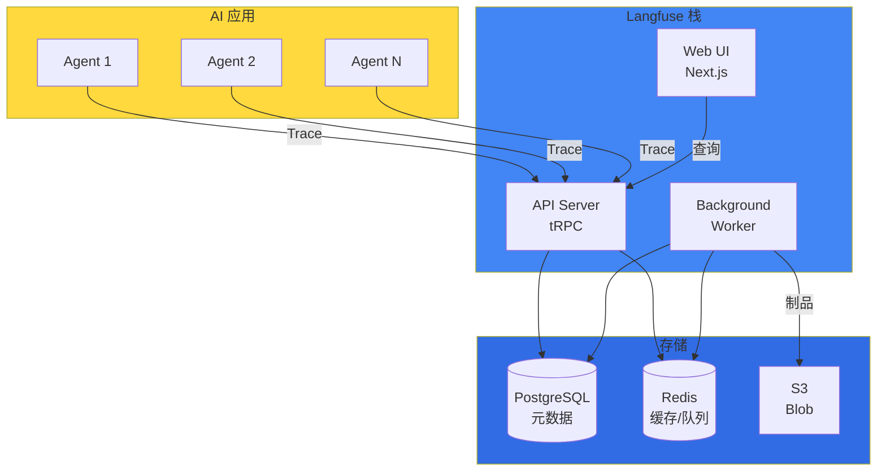
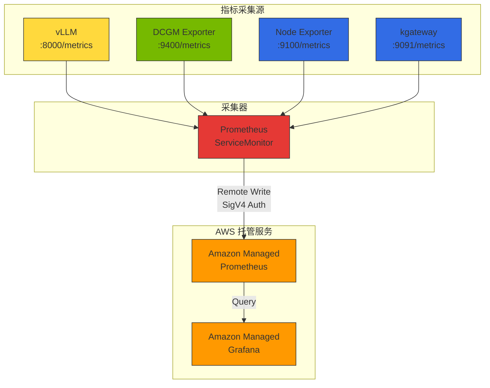
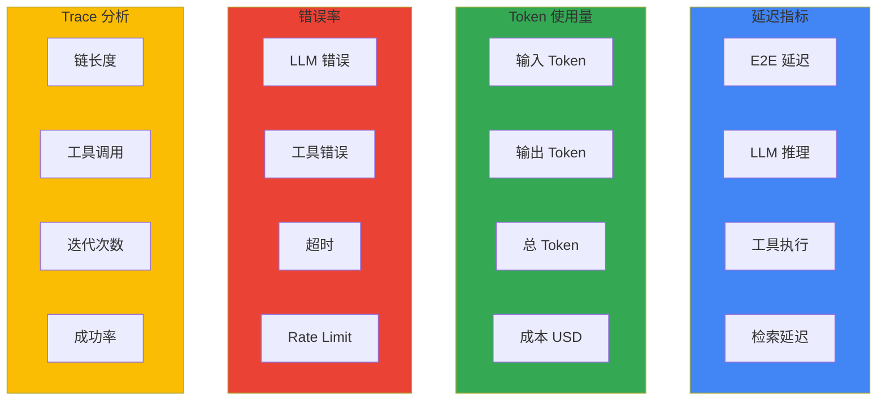

import {
  LangFuseVsLangSmithTable, LatencyMetricsTable, TokenUsageMetricsTable, ErrorRateMetricsTable,
  DailyChecksTable, WeeklyChecksTable, MaturityModelTable
} from '@site/src/components/AgentMonitoringTables';

# AI Agent 监控与运营

本文档从概念层面介绍 Agentic AI 应用的监控架构、核心指标设计和告警策略。

:::info 实战部署指南
Langfuse Helm 部署、AMP/AMG 配置、ServiceMonitor YAML、Grafana 仪表板 JSON 等实战配置请参阅 [监控栈配置指南](../reference-architecture/monitoring-observability-setup.md)。
:::

## 概述

Agentic AI 应用执行复杂的推理链和多种工具调用，仅靠传统 APM 工具难以获得充分的可见性。Langfuse 和 LangSmith 等 LLM 专用可观测性工具提供以下核心功能：

- **Trace 追踪**：追踪 LLM 调用、工具执行、Agent 推理过程的完整流程
- **Token 使用量分析**：输入/输出 Token 数及成本计算
- **质量评估**：响应质量评分和反馈收集
- **调试**：通过 Prompt 和响应内容审查诊断问题

:::info 目标读者
本文档面向平台运维人员、MLOps 工程师、AI 开发者。需要对 Kubernetes 和 Python 有基本了解。
:::

---

## 监控架构

### Langfuse 架构概述

Langfuse v2.75.0 以上由以下组件构成：



### AMP/AMG 集成数据流



### 监控数据层次

| 层次 | 采集工具 | 指标模式 | 可确认项目 |
|------|----------|-----------|--------------|
| **LLM 推理** | Langfuse | trace, generation | Token 使用量、成本、TTFT、按用户模式 |
| **模型服务器** | vLLM Prometheus | `vllm_*` | 请求数、批大小、KV cache 使用率、TPS |
| **GPU** | DCGM Exporter | `DCGM_FI_DEV_*` | GPU 利用率、温度、功耗、内存使用量 |
| **基础设施** | Node Exporter | `node_*` | CPU、内存、网络、磁盘 I/O |
| **网关** | kgateway | `envoy_*` | 请求数、延迟、错误率、上游状态 |

---

## Langfuse vs LangSmith 对比

<LangFuseVsLangSmithTable />

:::tip 选择指南

- **Langfuse**：数据主权重要或需要成本优化时
- **LangSmith**：以 LangChain 开发为主力，需要快速启动时
:::

### AWS 原生可观测性：CloudWatch Generative AI Observability

Amazon CloudWatch Generative AI Observability 是面向 LLM 和 AI Agent 监控的 AWS 原生方案：

- **基础设施无关监控**：支持 Bedrock、EKS、ECS、本地等所有环境的 AI 工作负载
- **Agent/工具追踪**：Agent、知识库、工具调用的默认视图
- **端到端追踪**：跨整个 AI 栈的追踪
- **框架兼容**：支持 LangChain、LangGraph、CrewAI 等外部框架

同时使用 Langfuse v2.75.0（自托管数据主权）和 CloudWatch Gen AI Observability（AWS 原生集成）可获得最全面的可观测性。

---

## 核心监控指标

定义 Agentic AI 应用中需要追踪的核心指标。

### 指标类别



### Latency 指标

<LatencyMetricsTable />

### Token Usage 指标

<TokenUsageMetricsTable />

### Error Rate 指标

<ErrorRateMetricsTable />

---

## PromQL 查询参考

### GPU 指标

```promql
# 全部 GPU 平均利用率
avg(DCGM_FI_DEV_GPU_UTIL)

# 按节点 GPU 利用率
avg(DCGM_FI_DEV_GPU_UTIL) by (Hostname)

# GPU 内存使用率
avg(DCGM_FI_DEV_FB_USED / DCGM_FI_DEV_FB_FREE * 100) by (gpu)
```

### vLLM 指标

```promql
# 全部 TPS（每秒生成 Token）
rate(vllm_generation_tokens_total[5m])

# 按模型 TPS
sum(rate(vllm_generation_tokens_total[5m])) by (model)

# TTFT P99 (Time to First Token)
histogram_quantile(0.99, rate(vllm_time_to_first_token_seconds_bucket[5m]))

# TTFT P95
histogram_quantile(0.95, rate(vllm_time_to_first_token_seconds_bucket[5m]))

# E2E 延迟 P99
histogram_quantile(0.99, rate(vllm_e2e_request_latency_seconds_bucket[5m]))

# 平均批大小
avg(vllm_num_requests_running)
```

### Gateway 指标

```promql
# 5xx 错误率 (%)
rate(envoy_http_downstream_rq_xx{envoy_response_code_class="5"}[5m]) 
/ 
rate(envoy_http_downstream_rq_total[5m]) * 100

# 上游健康检查失败率
sum(rate(envoy_cluster_upstream_cx_connect_fail[5m])) by (envoy_cluster_name)
```

### 成本指标

```promql
# 每日总成本
sum(increase(llm_cost_dollars_total[24h]))

# 按租户每日成本
sum(increase(llm_cost_dollars_total[24h])) by (tenant_id)

# 按模型成本比例
sum(increase(llm_cost_dollars_total[24h])) by (model)
/ ignoring(model) group_left
sum(increase(llm_cost_dollars_total[24h]))

# 预算使用率（月度）
sum(increase(llm_cost_dollars_total[30d])) by (tenant_id)
/ on(tenant_id) group_left
tenant_monthly_budget_usd
```

---

## 告警策略

### 告警阈值设计

| 告警 | 条件 | 严重度 | 持续时间 |
|------|------|--------|----------|
| **Agent High Latency** | P99 延迟大于 10 秒 | Warning | 5 分钟 |
| **Agent High Error Rate** | 错误率大于 5% | Critical | 5 分钟 |
| **LLM Rate Limit** | Rate limit 错误大于 10 次/5 分钟 | Warning | 2 分钟 |
| **Daily Cost Budget** | 每日成本大于 $100 | Warning | 立即 |
| **GPU High Temperature** | GPU 温度大于 85 度 | Warning | 5 分钟 |
| **GPU Memory Full** | GPU 内存大于 95% | Critical | 3 分钟 |
| **vLLM High Latency** | P99 E2E 延迟大于 30 秒 | Warning | 5 分钟 |

### 告警层次结构

1. **基础设施层**：GPU 温度、内存、功率异常
2. **模型服务器层**：vLLM 延迟增加、KV cache 不足
3. **应用层**：Agent 错误率、Rate limit
4. **业务层**：成本超支、SLA 违约

:::tip 监控最佳实践

1. **层级间指标关联**：LLM 请求增加 -> GPU 利用率上升 -> 基础设施负载增加的相关性分析
2. **异常检测**：P99 延迟突然增加时同时检查 GPU 温度或内存使用量
3. **容量规划**：平均 GPU 利用率超过 70% 时考虑增加 GPU 节点
4. **成本优化**：优先使用低 TTFT 模型改善用户体验 + 提高吞吐量
:::

---

## 成本追踪

### 成本追踪概念

按以下标准追踪 LLM 使用成本：

- **按模型**：各模型总成本和请求数，识别最高成本模型
- **按租户**：租户/团队每日 Token 使用量和预算使用率
- **按时间**：峰值时段分析、成本趋势

### 按模型成本参考（2026 基准）

| 模型 | 输入（$/1K tok）| 输出（$/1K tok）|
|------|----------------|----------------|
| GPT-4o | $0.0025 | $0.01 |
| GPT-4o-mini | $0.00015 | $0.0006 |
| Claude Sonnet 4 | $0.003 | $0.015 |
| Claude 3.5 Haiku | $0.0008 | $0.004 |

:::tip 成本优化提示

1. **模型选择优化**：简单任务使用低成本模型（GPT-4o-mini、Claude 3.5 Haiku）
2. **Prompt 优化**：移除不必要上下文减少输入 Token
3. **缓存利用**：对重复查询缓存响应
4. **Cascade Routing**：先尝试低成本模型失败时再回退到高性能模型
:::

---

## 运营检查清单

### 每日检查项目

<DailyChecksTable />

### 每周检查项目

<WeeklyChecksTable />

---

## 监控成熟度模型

<MaturityModelTable />

---

## 下一步

- [监控栈配置指南](../reference-architecture/monitoring-observability-setup.md) - AMP/AMG 部署、Langfuse Helm 安装、ServiceMonitor、Grafana 仪表板实战配置
- [LLMOps Observability 对比指南](./llmops-observability.md) - Langfuse vs LangSmith vs Helicone 深度对比
- [Agentic AI Platform 架构](../design-architecture/agentic-platform-architecture.md) - 整体平台设计
- [RAG 评估框架](./ragas-evaluation.md) - 利用 Ragas 的质量评估

## 参考资料

- [Langfuse Documentation](https://langfuse.com/docs)
- [LangSmith Documentation](https://docs.smith.langchain.com/)
- [CloudWatch Generative AI Observability](https://aws.amazon.com/blogs/mt/launching-amazon-cloudwatch-generative-ai-observability-preview/)
- [OpenTelemetry Documentation](https://opentelemetry.io/docs/)
- [Prometheus Monitoring](https://prometheus.io/docs/)
