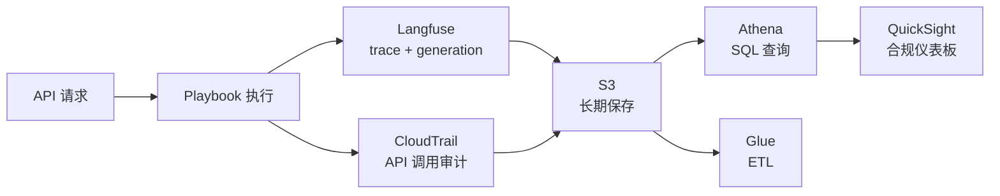

# Agentic Playbook

像 Infrastructure-as-Code（IaC）一样声明式定义 Agent 工作流、自动化合规、保障审计追踪的实战指南。

## 什么是 Playbook？

**Agentic Playbook** 是像 Kubernetes Manifest 或 Terraform 一样以**声明式（Declarative）**方式定义 AI Agent 行为的框架。

### 为什么需要？

| 阶段 | 特征 | 问题点 |
|------|------|--------|
| **简单 Prompt** | "请做代码审查" | 不可重现、不可审计、责任不明确 |
| **可重现工作流** | 用 LangGraph 定义步骤 | 代码管理、无审批门控 |
| **可审计流程** | Playbook YAML | 声明式定义、GitOps 部署、审计日志自动化 |

:::tip IaC 类比
- **Terraform**：声明基础设施状态 → `terraform apply` → 创建实际资源
- **Playbook**：声明 Agent 工作流 → `playbook run` → 执行实际任务 + 审计日志
:::

### 核心特征

1. **声明式定义**：用 YAML 表达工作流
2. **审批门控**：auto/manual/conditional 策略
3. **审计追踪**：Langfuse + CloudTrail 自动联动
4. **GitOps 部署**：ArgoCD 版本管理和回滚
5. **合规标签**：SOC2、ISO27001 映射

## Playbook YAML 规范

### 基本结构

```yaml
apiVersion: agenticops/v1
kind: Playbook
metadata:
  name: playbook-name
  compliance: [SOC2-CC7.1, ISO27001-A.14.2.1]
  tags: [security, code-review]
spec:
  trigger: event-name
  stages:
    - name: stage-1
      agent: model-name
      guardrails: [rule-1, rule-2]
      approval: auto|manual|conditional
      sla: duration
  rollback:
    on-failure: action
    notification: [channel-1, channel-2]
```

### 实战示例：代码审查 Agent

```yaml
apiVersion: agenticops/v1
kind: Playbook
metadata:
  name: code-review-agent
  compliance: [SOC2-CC7.1, ISO27001-A.14.2.1]
  tags: [security, code-quality, pr-automation]
  description: "Pull Request 创建时自动代码审查和安全检查"

spec:
  trigger: pull-request-created
  
  stages:
    # Stage 1: 代码分析
    - name: code-analysis
      agent: glm-5
      guardrails: 
        - no-secrets-in-code
        - pii-detection
        - owasp-basic-check
      approval: auto
      timeout: 10m
      output-schema: code-analysis-report.json
      
    # Stage 2: 安全深度审查
    - name: security-review
      agent: glm-5
      lora: security-specialist  # 应用 LoRA 适配器
      rag-source: security-policies  # 内部安全策略 RAG
      guardrails: 
        - owasp-top-10
        - cwe-top-25
      approval: manual  # 需要安全团队审批
      approvers:
        - role: security-team
        - user: security-lead@company.com
      sla: 4h
      notification:
        on-pending: [slack-security-channel]
      output-schema: security-report.json
      
    # Stage 3: 合规检查
    - name: compliance-check
      agent: glm-5
      rag-source: compliance-policies  # SOC2、ISO27001 文档 RAG
      guardrails:
        - gdpr-compliance
        - sox-compliance
      approval: conditional
      conditions:
        - if: security-report.risk-level >= HIGH
          then: manual
        - else: auto
      audit-log: required  # 强制审计日志记录
      output-schema: compliance-report.json
      
    # Stage 4: 最终审批
    - name: final-approval
      agent: glm-5
      approval: manual
      approvers:
        - role: tech-lead
      context:
        - code-analysis-report.json
        - security-report.json
        - compliance-report.json
      sla: 2h
      
  rollback:
    on-failure: revert-to-previous
    notification: 
      - slack-security
      - email-ciso
    audit:
      log-to: [langfuse, cloudtrail, s3]
      
  monitoring:
    metrics:
      - name: approval-latency
        target: p95 < 4h
      - name: false-positive-rate
        target: < 5%
    alerts:
      - condition: approval-latency > 6h
        notify: [slack-eng-ops]
```

:::caution 注意事项
- **审批 SLA**：超过 `sla: 4h` 时自动升级
- **审计日志**：设置 `audit-log: required` 的 Stage 所有 I/O 记录到 Langfuse + CloudTrail
- **回滚策略**：失败时自动回滚，重要操作务必设置 approval
:::

## 实现技术映射

Playbook 各组件到实际技术栈的映射：

| Playbook 组件 | 现有技术 | Agentic AI Platform 层 | 备注 |
|------------------|----------|--------------------------|------|
| **工作流定义** | LangGraph / CrewAI / AutoGen | L2 Orchestration | 多 Agent 协作 |
| **Agent 管理** | Kagent / A2A Protocol | L2 Gateway-Agents | Agent 生命周期 |
| **Guardrails** | NeMo Guardrails / Guardrails AI | L2 Orchestration | 实时安全措施 |
| **审计日志** | Langfuse + S3 | Operations | trace + generation 记录 |
| **Prompt 管理** | Langfuse Prompts | Operations | 版本管理、A/B 测试 |
| **评估** | RAGAS / DeepEval / LangSmith | Operations | 质量指标 |
| **部署** | ArgoCD + GitOps | Infrastructure | Kubernetes Operator 模式 |
| **审批门控** | PagerDuty / Slack API | Operations | 人工介入点 |
| **RAG 源** | Milvus + Neo4j | L2 Gateway-Agents | Vector + Graph RAG |
| **LoRA 适配器** | vLLM + HuggingFace PEFT | L1 Model Serving | 模型特化 |

## 审批门控模式

### 1. Auto Approval（自动通过）

通过 Guardrails 后立即进入下一 Stage：

```yaml
- name: code-formatting
  agent: glm-5
  guardrails: [style-guide-check]
  approval: auto
```

**适用场景**：格式化、Lint 检查、简单代码分析

### 2. Manual Approval（手动审批）

指定团队/角色必须审批：

```yaml
- name: production-deployment
  agent: glm-5
  approval: manual
  approvers:
    - role: sre-team
    - user: release-manager@company.com
  sla: 2h
  notification:
    on-pending: [slack-sre, pagerduty-sre]
```

**适用场景**：生产部署、安全变更、数据删除

### 3. Conditional Approval（条件审批）

仅在特定条件下要求手动审批：

```yaml
- name: database-migration
  agent: glm-5
  approval: conditional
  conditions:
    - if: migration.affected-rows > 10000
      then: manual
      approvers: [dba-team]
    - if: migration.affected-rows > 1000
      then: manual
      approvers: [tech-lead]
    - else: auto
  sla: 1h
```

**适用场景**：基于风险等级的审批、基于成本的审批、基于影响范围的审批

## 审计追踪实现

### 审计日志架构



### 审计日志保留策略

| 日志类型 | 保留期间 | 存储 | 检索方式 |
|----------|----------|---------|---------|
| **实时追踪** | 7 天 | Langfuse（PostgreSQL）| Langfuse UI |
| **短期审计** | 90 天 | S3 Standard | Athena |
| **长期保存** | 7 年 | S3 Glacier | Glue + Athena |
| **合规证据** | 永久 | S3 Glacier Deep Archive | 手动恢复 |

:::warning 合规要求
- **SOC2 Type II**：最少 12 个月日志保留
- **ISO27001**：安全事件最少 6 个月保留
- **GDPR**：个人信息处理日志最少 3 年保留
- **金融监管**：电子金融交易日志 5 年保留
:::

## GitOps 部署工作流

### ArgoCD Application 定义

```yaml
apiVersion: argoproj.io/v1alpha1
kind: Application
metadata:
  name: agentic-playbooks
  namespace: argocd
spec:
  project: default
  source:
    repoURL: https://github.com/company/playbooks
    targetRevision: main
    path: overlays/production
    kustomize:
      version: v5.0.0
  destination:
    server: https://kubernetes.default.svc
    namespace: agentic-ops
  syncPolicy:
    automated:
      prune: true
      selfHeal: true
    syncOptions:
      - CreateNamespace=true
```

## 参考资料

- [LangGraph 官方文档](https://langchain-ai.github.io/langgraph/)
- [NeMo Guardrails 指南](https://docs.nvidia.com/nemo/guardrails/)
- [Langfuse Tracing API](https://langfuse.com/docs/tracing)
- [ArgoCD Best Practices](https://argo-cd.readthedocs.io/en/stable/user-guide/best_practices/)
- [RAGAS Evaluation Metrics](https://docs.ragas.io/en/latest/concepts/metrics/index.html)
- [AWS CloudTrail 日志](https://docs.aws.amazon.com/cloudtrail/)

## 下一步

- **[自定义模型流水线](../reference-architecture/custom-model-pipeline.md)**：Layer 3 模型调整指南（含 LoRA Fine-tuning）
- **[Milvus 向量数据库](./milvus-vector-database.md)**：Layer 2 知识增强实现（RAG 流水线）
- **[AgenticOps](/docs/aidlc/agentic-ops)**：运营反馈循环
