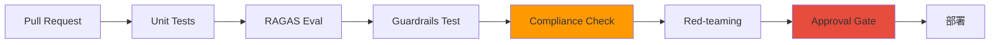

# 企业合规框架

提供 AI 平台在企业环境中运营时必须遵守的合规框架和实战映射指南。

## 为什么需要 AI 合规

### 传统 IT 合规 vs AI 运营合规

:::info 核心差异
传统 IT 合规针对**静态系统**，而 AI 合规针对**非确定性且持续学习的系统**。
:::

| 领域 | 传统 IT 合规 | AI 运营合规 |
|------|---------------------|---------------------|
| **可预测性** | 代码 → 相同输入 = 相同输出 | 模型 → 相同输入也可能不同输出 |
| **访问控制** | DB/API 级别 | 模型 API + Prompt + 输出过滤 |
| **审计追踪** | 事务日志 | 推理 Trace + Token 使用量 |
| **变更管理** | 代码部署 | 模型版本 + LoRA 适配器 + Playbook |
| **事件响应** | 回滚 + Hotfix | 模型切换 + Guardrails 强化 |

### AI 特有风险

:::caution AI 特有的合规风险
- **幻觉（Hallucination）**：模型生成非事实信息
- **Prompt 注入**：恶意输入操纵模型行为
- **PII 泄露**：训练数据中包含的个人信息泄露
- **模型偏见**：对特定群体的歧视性输出
- **Token 滥用**：成本暴增和资源耗尽
:::

---

## SOC2 Trust Criteria 与 AI 运营映射

### SOC2 控制映射表

| SOC2 控制 | Trust Criteria | AI 运营实现 | 技术栈 |
|-----------|----------------|-------------|----------|
| **CC6.1-6.8** | 逻辑/物理访问控制 | 模型 API 认证 + 数据访问控制 | **Pod Identity + RBAC + API Key** |
| **CC7.1-7.4** | 系统监控 | 推理请求追踪 + GPU 资源监控 | **Langfuse + AMP/AMG + DCGM** |
| **CC7.3** | 异常检测和事件响应 | 自动告警 + Playbook rollback | **PagerDuty + ArgoCD** |
| **CC8.1** | 变更管理 | Playbook 版本管理 + 审批门控 | **GitOps + Approval Gate** |

---

## ISO27001 Annex A 与 AI 运营映射

### ISO27001 控制映射表

| Annex A | 控制领域 | AI 运营实现 | 技术栈 |
|---------|----------|-------------|----------|
| **A.8** | 资产管理 | 模型注册表 + LoRA 适配器管理 | **ECR + MLflow Model Registry** |
| **A.9** | 访问控制 | API Key 管理 + RBAC + 多租户隔离 | **kgateway + Pod Identity** |
| **A.12** | 运营安全 | 日志 + 监控 + 备份 | **CloudTrail + AMP/AMG + S3** |
| **A.14** | 系统开发安全 | Playbook CI/CD + 代码审查自动化 | **ArgoCD + Guardrails API** |
| **A.16** | 信息安全事件管理 | 自动检测 + 自动响应 | **告警 + Playbook rollback** |
| **A.17** | 业务连续性 | 多 AZ 部署 + 自动伸缩 | **EKS + Karpenter** |

---

## 金融监管映射

### 电子金融监管规定映射

| 条款 | 内容 | AI 运营映射 | 实现 |
|------|------|-------------|------|
| **第 15 条** | 访问控制和权限管理 | 模型 API 认证 + 审计日志 | **API Key + CloudTrail** |
| **第 17 条** | 电子金融交易信息加密 | 数据加密 + TLS | **KMS + ALB TLS** |
| **第 34 条** | 交易限额设置 | Token 使用量限制 + Rate Limiting | **kgateway rate-limit** |

### ISMS-P（个人信息保护认证）映射

| 项目 | 要求 | AI 运营映射 | 实现 |
|------|---------|-------------|------|
| **2.6** | 访问控制 | API Key + RBAC + 多因素认证 | **Pod Identity + MFA** |
| **2.9** | 系统和服务开发安全 | Playbook 版本管理 + Guardrails | **Git + Guardrails API** |
| **2.11** | 信息安全事件管理 | 自动事件检测和响应 | **告警 + 自动回滚** |

---

## 自动验证 CI/CD 流水线



### 流水线步骤说明

| 步骤 | 目的 | 工具 | 失败时措施 |
|------|------|------|-------------|
| **Unit Tests** | 功能正确性验证 | pytest | PR 阻断 |
| **RAGAS Eval** | RAG 准确度验证 | RAGAS | 未达阈值时 PR 阻断 |
| **Guardrails Test** | PII、幻觉、偏见验证 | Guardrails AI | 立即失败 |
| **Compliance Check** | SOC2/ISO27001 控制确认 | 自定义脚本 | 通知审计团队 |
| **Red-teaming** | 对抗性 Prompt 测试 | Garak | 安全团队升级 |
| **Approval Gate** | 手动审批 | GitHub Actions | 等待审批 |

---

## 审计数据保留策略

### 按数据分类的保留标准

| 数据 | 保留位置 | 保留期间 | 访问权限 | 法律依据 |
|--------|----------|----------|----------|----------|
| **推理 Trace** | Langfuse + S3 | 3 年 | 审计团队、DevOps | ISO27001 A.12.4 |
| **API 调用日志** | CloudTrail + S3 | 5 年 | 安全团队、审计团队 | 电子金融监管规定第 19 条 |
| **模型变更历史** | Git + ECR | 永久 | DevOps、ML 团队 | SOC2 CC8.1 |
| **GPU 指标** | AMP + S3 | 1 年 | 运维团队 | 内部策略 |
| **PII 检测日志** | CloudWatch + S3 | 3 年 | 安全团队、合规团队 | ISMS-P 2.11 |

### S3 Lifecycle 策略示例

```json
{
  "Rules": [
    {
      "Id": "inference-trace-lifecycle",
      "Status": "Enabled",
      "Transitions": [
        {
          "Days": 90,
          "StorageClass": "STANDARD_IA"
        },
        {
          "Days": 365,
          "StorageClass": "GLACIER"
        }
      ],
      "Expiration": {
        "Days": 1095
      }
    }
  ]
}
```

:::warning 审计数据完整性保障
- **S3 Object Lock**：防删除（WORM 模式）
- **CloudTrail 验证**：`aws cloudtrail validate-logs` 验证篡改
- **Langfuse Immutable Trace**：Trace 创建后不可修改
:::

---

## 实战检查清单

### SOC2 审计准备

- [ ] CC6.1-6.8：Pod Identity + RBAC 设置完成
- [ ] CC7.1-7.4：Langfuse + AMP/AMG 监控构建
- [ ] CC7.3：PagerDuty 告警 + 自动回滚设置
- [ ] CC8.1：GitOps + Approval Gate 应用

### ISO27001 认证准备

- [ ] A.8：MLflow Model Registry 构建
- [ ] A.9：kgateway + API Key 管理体系
- [ ] A.12：CloudTrail + S3 审计日志保留
- [ ] A.14：CI/CD 流水线自动验证
- [ ] A.16：事件响应 Playbook 编写
- [ ] A.17：多 AZ + Karpenter 自动伸缩

### 金融监管遵从

- [ ] 电子金融监管规定第 15 条：API 访问控制
- [ ] 电子金融监管规定第 17 条：TLS + KMS 加密
- [ ] 电子金融监管规定第 34 条：Rate Limiting
- [ ] ISMS-P 2.6：MFA 应用
- [ ] ISMS-P 2.9：Guardrails API 集成
- [ ] ISMS-P 2.11：自动事件响应

---

## 参考资料

- [SOC2 Trust Services Criteria](https://www.aicpa-cima.com/resources/landing/trust-services-criteria)
- [ISO/IEC 27001:2022](https://www.iso.org/standard/82875.html)
- [Langfuse Compliance Guide](https://langfuse.com/docs/compliance)
- [Guardrails AI Security](https://docs.guardrailsai.com/concepts/security/)
