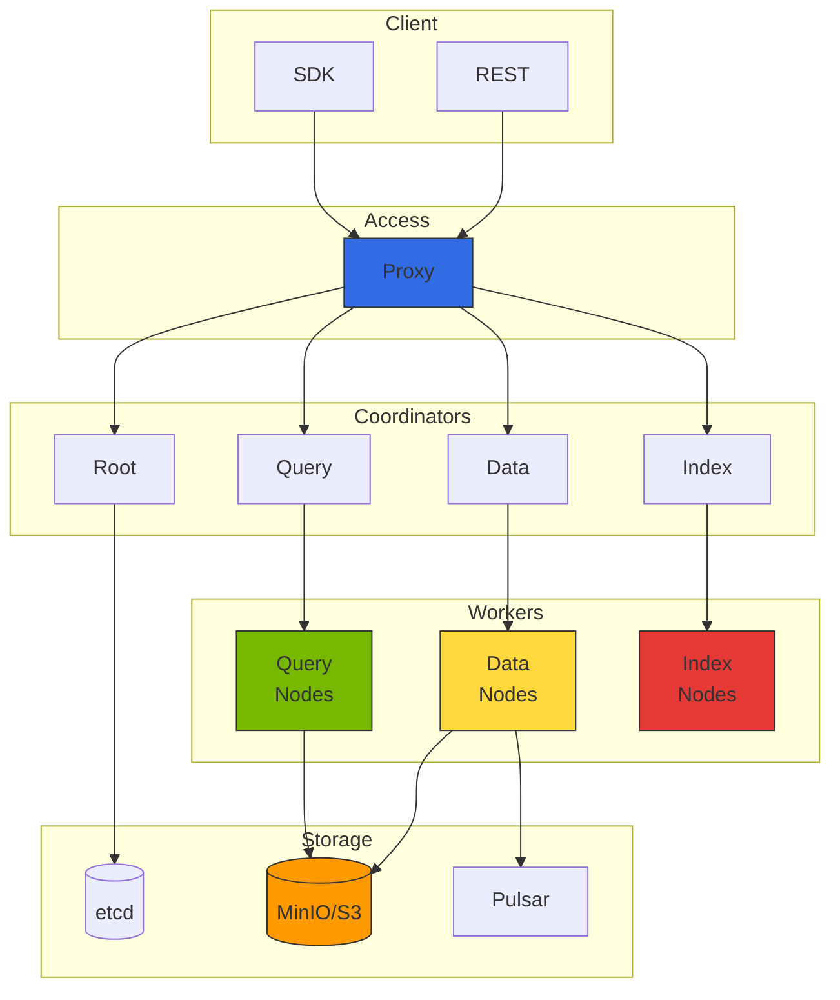

import {
  ComponentRolesTable, IndexComparisonTable, MonitoringMetricsTable,
  GPUInstanceTable, GPUIndexingPerformanceTable, StorageCostComparisonTable
} from '@site/src/components/MilvusTables';

# Milvus 向量数据库集成

> 📅 **创建日期**：2026-02-13 | **修改日期**：2026-02-14 | ⏱️ **阅读时间**：约 4 分钟

Milvus v2.4.x 是用于大规模向量相似度搜索的开源向量数据库。在 Agentic AI 平台中作为 RAG（Retrieval-Augmented Generation）流水线的核心组件使用。

## 概述

### 为什么需要 Milvus

在 Agentic AI 系统中向量数据库承担以下角色：

- **知识存储**：将文档、FAQ、产品信息等存储为嵌入向量
- **语义搜索**：基于语义相似性而非关键词的搜索
- **上下文提供**：向 LLM 提供相关信息减少幻觉
- **长期记忆**：存储 Agent 的对话历史和学习内容


## Milvus 集群架构

### 分布式架构组件



### 组件角色

<ComponentRolesTable />

## EKS 部署指南

### 部署概述

Milvus 可通过 Helm Chart 部署到 EKS。生产环境需考虑以下组件：

- **Cluster Mode**：分布式架构提供高可用
- **etcd**：元数据存储（推荐最少 3 副本）
- **Storage**：MinIO 或 Amazon S3/S3 Express One Zone
- **Message Queue**：Pulsar（事件流）
- **Query/Data/Index Nodes**：按工作负载伸缩

**推荐资源配置：**
- Proxy：2+ 副本，1-2 CPU，2-4Gi 内存
- Query Node：3+ 副本，2-4 CPU，8-16Gi 内存
- Data Node：2+ 副本，1-2 CPU，4-8Gi 内存
- Index Node：2+ 副本，2-4 CPU，8-16Gi 内存

### Amazon S3 集成

使用 Amazon S3 替代 MinIO 可减少运维负担。使用 S3 Express One Zone 可获得更快性能和更低延迟。

:::tip S3 Express One Zone 优势

- **10 倍性能**：比标准 S3 快 10 倍的数据访问
- **一致的毫秒级延迟**：个位数毫秒延迟
- **成本效率**：请求成本降低 50%
- **单 AZ**：与同 AZ 内计算资源配合使用时最优

:::

:::info 详细部署指南
Milvus 部署详细步骤、Helm values 设置、S3 IAM 策略示例请参阅 [Milvus 官方 Helm Chart 文档](https://milvus.io/docs/install_cluster-helm.md)。
:::

## 索引类型选择指南

### 主要索引类型对比

<IndexComparisonTable />

### SCANN 索引（Milvus 2.4+）

Google 的 Scalable Nearest Neighbors（SCANN）索引是 Milvus 2.4 新增的高性能索引：

```python
# 创建 SCANN 索引
index_params = {
    "metric_type": "COSINE",
    "index_type": "SCANN",
    "params": {
        "nlist": 1024,  # 集群数
        "with_raw_data": True,  # 是否存储原始数据
    }
}

collection.create_index(field_name="embedding", index_params=index_params)
collection.load()
```

## LangChain/LlamaIndex 集成

### LangChain 集成示例

```python
from langchain_community.vectorstores import Milvus
from langchain_openai import OpenAIEmbeddings
from langchain.text_splitter import RecursiveCharacterTextSplitter
from langchain_community.document_loaders import DirectoryLoader

# 加载和分割文档
loader = DirectoryLoader("./documents", glob="**/*.md")
documents = loader.load()

text_splitter = RecursiveCharacterTextSplitter(
    chunk_size=1000,
    chunk_overlap=200,
    length_function=len,
)
splits = text_splitter.split_documents(documents)

# 设置嵌入模型
embeddings = OpenAIEmbeddings(model="text-embedding-3-small")

# 创建 Milvus 向量存储
vectorstore = Milvus.from_documents(
    documents=splits,
    embedding=embeddings,
    connection_args={
        "host": "milvus-proxy.ai-data.svc.cluster.local",
        "port": "19530",
    },
    collection_name="langchain_docs",
    drop_old=True,
)

# 相似度搜索
query = "Kubernetes 中如何调度 GPU"
docs = vectorstore.similarity_search(query, k=5)
```

### RAG 流水线完整配置

```python
from langchain_openai import ChatOpenAI
from langchain.chains import RetrievalQA
from langchain.prompts import PromptTemplate

# LLM 设置
llm = ChatOpenAI(model="gpt-4o", temperature=0)

# Prompt 模板
prompt_template = """请使用以下上下文回答问题。
如果上下文中没有答案，请说"没有相关信息"。

上下文：
{context}

问题：{question}

回答："""

PROMPT = PromptTemplate(
    template=prompt_template,
    input_variables=["context", "question"]
)

# RAG 链配置
qa_chain = RetrievalQA.from_chain_type(
    llm=llm,
    chain_type="stuff",
    retriever=vectorstore.as_retriever(
        search_type="mmr",
        search_kwargs={"k": 5, "fetch_k": 10}
    ),
    chain_type_kwargs={"prompt": PROMPT},
    return_source_documents=True,
)

# 执行查询
result = qa_chain.invoke({"query": "GPU 资源管理方法？"})
print(f"Answer: {result['result']}")
```

## 监控和指标

### Prometheus 指标采集

Milvus 在 `/metrics` 端点提供 Prometheus 格式指标。可使用 ServiceMonitor 自动采集。

### 主要监控指标

<MonitoringMetricsTable />

## Kubernetes Operator 部署

### GPU 加速索引

为 Index Node 分配 GPU 可大幅提升索引构建速度。

**推荐 GPU 实例：**

<GPUInstanceTable />

**GPU 索引性能对比：**

<GPUIndexingPerformanceTable />

### 存储成本对比

<StorageCostComparisonTable />

**推荐：**
- **开发/测试**：MinIO（简单设置）
- **生产（一般）**：S3 Standard（成本效率）
- **生产（高性能）**：S3 Express One Zone（10 倍性能）

---

## 相关文档

- [Agentic AI 平台架构](../design-architecture/foundations/agentic-platform-architecture.md)
- [Agentic AI 技术挑战](../design-architecture/foundations/agentic-ai-challenges.md)
- [Ragas RAG 评估框架](../operations-mlops/governance/ragas-evaluation.md)
- [Agent 监控](../operations-mlops/observability/agent-monitoring.md)

:::info 建议

- 生产环境运营最少 3 个 Query Node
- 大规模数据集（1 亿+ 向量）考虑 DISKANN 索引
- 使用 S3 存储可大幅降低运维复杂度
- S3 Express One Zone 提供 10 倍性能和 50% 更低的请求成本
- 使用 GPU 索引可大幅缩短构建时间（推荐 g5.xlarge）
- Milvus v2.4.x 提供 SCANN 索引、混合搜索、标量过滤、动态 Schema 等高级功能
- 使用 Helm Chart 版本 4.1.x 部署 Milvus 2.4.x
:::

:::warning 注意事项

- 索引构建消耗大量 CPU/内存，请在单独时段执行
- 删除集合时数据永久删除，请先确认备份
- GPU Index Node 成本较高，仅在需要时启用
- S3 Express One Zone 限于单 AZ，请考虑高可用需求
:::
