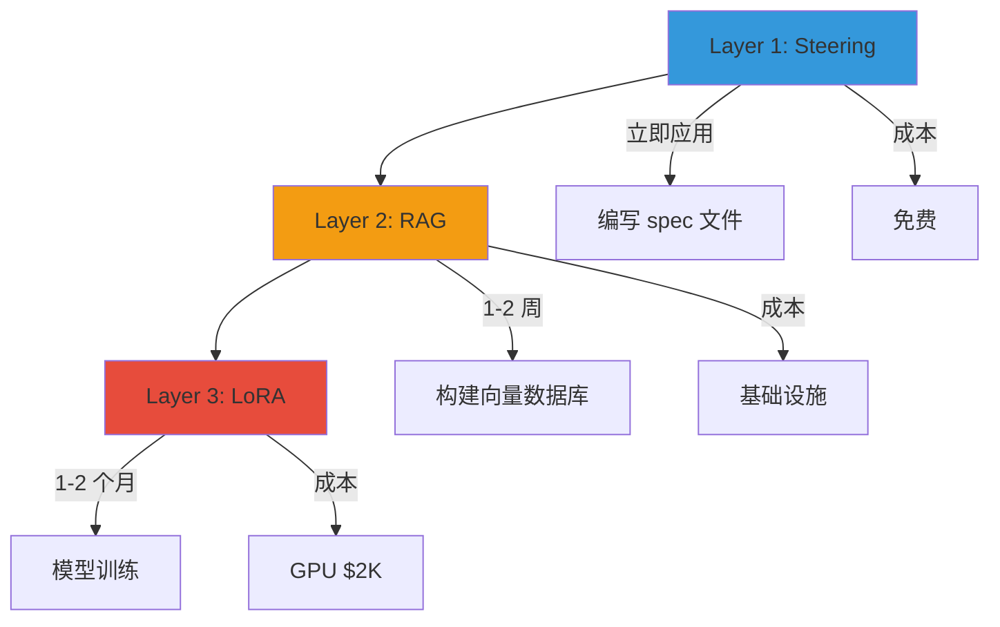
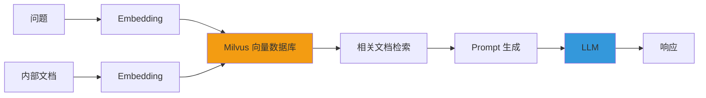
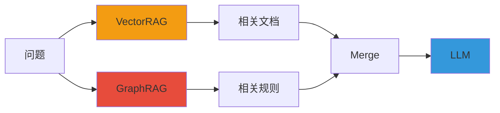

# 领域特化（LoRA + RAG）

提供将通用 LLM 优化为金融/通信/制造等**特定领域**以大幅提升编码质量的 3 层策略。

:::tip 核心问题
"为什么用 Claude 或 GPT 生成的代码不遵循我们公司的标准？"
→ **因为模型没有学习到你的领域知识。**
:::

---

## 3 层详解

领域特化按 **Steering → RAG → LoRA** 顺序渐进式应用。



### Layer 1：Steering（立即应用）

**定义**：通过 spec 文件明确定义编码规则指导 LLM。

**优点**：立即应用、零成本、维护简单（只需修改 spec 文件）

**缺点**：复杂领域逻辑有局限、浪费上下文窗口

### Layer 2：RAG（1-2 周）

**定义**：将内部文档嵌入到向量数据库，实时检索相关信息加入 Prompt。

**优点**：自动反映最新文档（无需重新训练）、内部 API 规范准确度高、不修改模型权重

**缺点**：需要基础设施（Milvus、Neo4j）、检索质量直接决定输出质量、嵌入成本

### Layer 3：LoRA（1-2 个月）

**定义**：用领域数据调整模型权重本身，生成**领域专家水准**的输出。

**优点**：一致的代码风格、领域术语最高准确度、复杂模式学习
**缺点**：GPU 训练成本（$2,000）、需要收集训练数据

:::info Kiro GLM-5 vs 自托管
Kiro IDE 从 2026 年 4 月起原生支持 GLM-5 可立即使用。但 **LoRA Fine-tuning、多客户 LoRA 热交换、合规自主控制**仅在自托管中可行。
**推荐**：原型用 Kiro，生产级领域特化用自托管
:::

QLoRA 训练方法、NeMo/Unsloth 框架、检查点管理等详细实现请参阅 [自定义模型流水线指南](../reference-architecture/custom-model-pipeline.md)。

---

## 按场景所需层级表

| 需求 | Layer 1（Steering）| Layer 2（RAG）| Layer 3（LoRA）| 推荐组合 |
|---------|-------------------|--------------|---------------|----------|
| **编码规范** | 足够 | 过度 | 不需要 | **Layer 1** |
| **内部 API 使用** | 不足 | 必须 | 不需要 | **Layer 1 + 2** |
| **领域专业术语** | 有限 | 辅助 | 需要 | **Layer 2 + 3** |
| **SOC2 流程** | Playbook 足够 | 不需要 | 不需要 | **Layer 1** |
| **一致代码风格** | 仅基本 | 辅助 | 最有效 | **Layer 1 + 3** |
| **遗留迁移模式** | 不可能 | 提供示例 | 核心 | **Layer 2 + 3** |

:::tip 性价比
- **仅 Layer 1**：免费，60% 改善
- **Layer 1 + 2**：基础设施成本，80% 改善
- **Layer 1 + 2 + 3**：$2,000，**95% 改善**
:::

---

## VectorRAG 构成

VectorRAG 是基于**文档检索**的领域特化方式。

### 架构



### 数据流

1. **文档收集**：Confluence、GitHub、Wiki → 爬虫
2. **分块**：512 Token 单位分割（overlap 50 Token）
3. **嵌入**：OpenAI `text-embedding-3-large` 或 BGE-M3
4. **向量存储**：存入 Milvus 集合
5. **检索**：问题嵌入 → 余弦相似度 Top-K
6. **LLM 传递**：检索结果 + 问题 → LLM

:::warning 分块大小优化
- 太小：上下文丢失
- 太大：噪声增加
- **推荐**：512 Token，overlap 50
:::

---

## GraphRAG 构成

GraphRAG 是基于**知识图谱**的领域特化方式。明确建模金融业务术语/法规的**关系**。

### 架构

```mermaid
graph TD
    Q[问题："贷款审批条件？"] --> P[解析]
    P --> E1[实体提取]
    E1 --> |贷款, 审批| N[Neo4j]
    N --> R[关系探索]
    R --> |信用评分 >= 600| C[条件]
    C --> L[LLM]
    L --> A[响应生成]
    
    style N fill:#e74c3c
    style L fill:#3498db
```

### VectorRAG + GraphRAG 混合



**优势**：
- VectorRAG：反映最新文档
- GraphRAG：复杂规则推理
- 混合：**准确性 + 灵活性**

---

## FSI SI 实战场景

### 场景 1：COBOL → Java 遗留迁移

#### 各层效果对比

| 方法 | 准确率 | 一致性 | 成本 | 备注 |
|--------|--------|--------|------|------|
| **仅 Steering** | 60% | 低 | 免费 | 语法正确但金融逻辑错误 |
| **+ RAG** | 80% | 中 | 基础设施 | 准确率提升，模式不一致 |
| **+ LoRA** | **95%** | **高** | **$2,000** | **一致模式 + 金融逻辑** |

#### ROI 分析

**假设**：10,000 模块迁移目标，开发者时薪 $50

| 方法 | 时间/模块 | 总时间 | 总成本 | 备注 |
|------|----------|---------|---------|------|
| **手动** | 2 小时 | 20,000 小时 | $1,000,000 | - |
| **LLM（Steering+RAG）** | 1 小时 | 10,000 小时 | $500,000 | **节省：$500,000** |
| **LLM（+ LoRA）** | 30 分钟 | 5,000 小时 | $250,000 + $2,000 | **节省：$748,000** |

**ROI**：LoRA 训练成本 $2,000，节省 $748,000 → **ROI：374 倍**

### 场景 2：内部框架代码生成

使用独有框架的 SI 环境中，通用 LLM 无法生成准确代码。

#### 效果

- **内部框架代码生成准确率**：95%
- **新员工入职时间**：3 个月 → 1 个月

### 场景 3：法规遵从代码自动生成

将金融法规自动反映到代码中。

### 场景 4：多客户运营

SI 公司在**同一平台运营多个客户**时，按客户热交换 LoRA 适配器。

#### 按客户配置

| 客户 | 领域 | Base Model | LoRA | RAG |
|------|--------|-----------|------|-----|
| **A 银行** | 账务系统 | GLM-5-32B | 银行-账务 | 银行-API |
| **B 证券** | 订单结算 | GLM-5-32B | 证券-订单 | 证券-API |
| **C 保险** | 合同管理 | GLM-5-32B | 保险-合同 | 保险-API |

---

## 分阶段引入路线图

| Phase | 时间 | 配置 | 效果 | 成本 |
|-------|------|------|------|------|
| **1** | 立即 | Steering + Playbook | 合规 + 基本质量 | 免费 |
| **2** | 1-2 周 | + VectorRAG（Milvus）| 内部知识准确度提升 | 基础设施 |
| **3** | 2-4 周 | + SLM Cascade | 成本优化（节省 70%）| +$500/月 |
| **4** | 1-2 个月 | + LoRA Fine-tuning | 领域专业性 + 风格一致性 | GPU $2K |

各 Phase 详细实现指南请参阅 [自定义模型流水线构建指南](../reference-architecture/custom-model-pipeline.md)。

---

## 参考资料

- [LoRA Paper (Hu et al., 2021)](https://arxiv.org/abs/2106.09685)
- [QLoRA Paper (Dettmers et al., 2023)](https://arxiv.org/abs/2305.14314)
- [vLLM Multi-LoRA](https://docs.vllm.ai/en/latest/models/lora.html)
- [Langchain RAG Tutorial](https://python.langchain.com/docs/tutorials/rag/)
- [Neo4j GraphRAG](https://neo4j.com/labs/genai-ecosystem/langchain/)
- [RAGAS Evaluation](https://docs.ragas.io/)
- [Unsloth Fast Training](https://github.com/unslothai/unsloth)
- [NeMo Framework](https://docs.nvidia.com/nemo-framework/user-guide/latest/)
