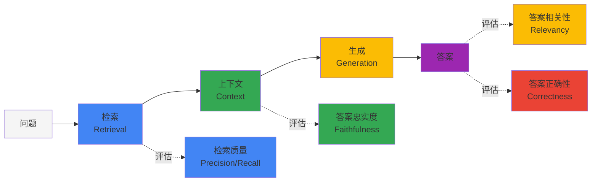
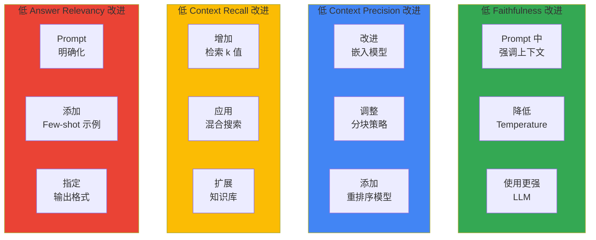

import { RagasVsBedrockComparison, RagasMetrics, CostOptimizationStrategies, CostComparison, ImprovementChecklist } from '@site/src/components/RagasTables';

# Ragas RAG 评估框架

> 📅 **创建日期**：2026-02-13 | **修改日期**：2026-02-14 | ⏱️ **阅读时间**：约 3 分钟

Ragas（RAG Assessment）是客观评估 RAG（Retrieval-Augmented Generation）流水线质量的开源框架。在 Agentic AI 平台中，对于 RAG 系统的性能测量和持续改进至关重要。

## 概述

### 为什么需要 RAG 评估

RAG 系统由多个组件（检索、生成、上下文处理）构成，难以测量整体质量：



### Ragas vs AWS Bedrock RAG Evaluation

:::tip AWS Bedrock RAG Evaluation GA
AWS Bedrock RAG Evaluation 于 **2025 年 3 月 GA**。与 Bedrock 原生集成，无需额外设置即可执行 RAG 评估。
:::

<RagasVsBedrockComparison />

**AWS Bedrock RAG Evaluation 指标：**

- **Context Relevance**：检索的上下文是否与问题相关
- **Coverage**：答案是否涵盖问题的所有方面
- **Correctness**：答案是否准确（对比 ground truth）
- **Faithfulness**：答案是否忠实于上下文

### Ragas 核心指标

<RagasMetrics />

:::note Ragas 0.2+ API 变更
Ragas 0.2 以上版本已移除 `context_relevancy` 指标。上下文质量评估请组合使用 `context_precision` 和 `context_recall`。
:::

## 安装和基本设置

### Python 环境设置

```bash
# 安装 Ragas（推荐 0.2+）
pip install "ragas>=0.2" langchain-openai datasets

# 额外依赖
pip install pandas numpy
```

### 基本评估代码

```python
from ragas import evaluate
from ragas.metrics import (
    faithfulness,
    answer_relevancy,
    context_precision,
    context_recall,
)
from datasets import Dataset

# 准备评估数据集
eval_data = {
    "question": [
        "Kubernetes 中如何进行 GPU 调度？",
        "Karpenter 的主要功能是什么？",
    ],
    "answer": [
        "Kubernetes 中 GPU 调度通过 NVIDIA Device Plugin 进行...",
        "Karpenter 提供自动节点配置、合并（consolidation）、漂移检测功能...",
    ],
    "contexts": [
        ["GPU 调度通过 Device Plugin 进行...", "NVIDIA GPU Operator 是..."],
        ["Karpenter 是 Kubernetes 节点自动伸缩器...", "通过 NodePool CRD..."],
    ],
    "ground_truth": [
        "使用 NVIDIA Device Plugin 和 GPU Operator 进行 GPU 资源调度。",
        "Karpenter 提供自动节点配置、合并、漂移检测、中断处理功能。",
    ],
}

dataset = Dataset.from_dict(eval_data)

# 执行评估（含错误处理）
try:
    results = evaluate(
        dataset,
        metrics=[
            faithfulness,
            answer_relevancy,
            context_precision,
            context_recall,
        ],
    )
    print(results)
except Exception as e:
    print(f"评估中发生错误: {e}")
    # 日志记录或重试逻辑
```

## 核心指标详细说明

### 1. Faithfulness（忠实度）

测量答案对提供上下文的忠实程度。是检测幻觉（hallucination）的核心指标。

```python
from ragas.metrics import faithfulness

# Faithfulness 计算过程:
# 1. 将答案分解为单个声明（claims）
# 2. 验证每个声明是否可从上下文推断
# 3. 已验证声明数 / 总声明数 = Faithfulness 分数

# 分数解释:
# 1.0: 所有声明都有上下文支持
# 0.5: 一半声明有上下文支持
# 0.0: 没有声明有上下文支持（严重幻觉）
```

### 2. Answer Relevancy（答案相关性）

测量答案与问题的相关程度。

```python
from ragas.metrics import answer_relevancy

# Answer Relevancy 计算过程:
# 1. 从答案反向生成问题
# 2. 计算生成问题与原始问题的相似度
# 3. 多次重复取平均

# 分数解释:
# 高分: 答案直接与问题相关
# 低分: 答案包含与问题无关的内容
```

### 3. Context Precision（上下文精确度）

测量检索上下文中实际有用信息的比例。

```python
from ragas.metrics import context_precision

# Context Precision 计算:
# - 识别生成 Ground truth 答案所需的上下文
# - 确认排名靠前的上下文是否包含有用信息
# - 相关上下文排名越高分数越高
```

### 4. Context Recall（上下文召回率）

测量生成正确答案所需的信息是否包含在检索的上下文中。

```python
from ragas.metrics import context_recall

# Context Recall 计算:
# 1. 将 Ground truth 分解为单个句子
# 2. 确认每个句子是否可从检索的上下文推断
# 3. 可推断句子数 / 总句子数 = Recall 分数
```

## 综合评估流水线

### 完整 RAG 系统评估

```python
import os
from ragas import evaluate
from ragas.metrics import (
    faithfulness,
    answer_relevancy,
    context_precision,
    context_recall,
    answer_correctness,
)
from datasets import Dataset
from langchain_openai import ChatOpenAI, OpenAIEmbeddings

# LLM 设置（评估用）
os.environ["OPENAI_API_KEY"] = "your-api-key"

def evaluate_rag_pipeline(questions, rag_chain, ground_truths):
    """RAG 流水线综合评估"""
    
    answers = []
    contexts = []
    
    for question in questions:
        # 执行 RAG 链
        result = rag_chain.invoke({"query": question})
        answers.append(result["result"])
        contexts.append([doc.page_content for doc in result["source_documents"]])
    
    # 构建评估数据集
    eval_dataset = Dataset.from_dict({
        "question": questions,
        "answer": answers,
        "contexts": contexts,
        "ground_truth": ground_truths,
    })
    
    # 用全部指标评估
    results = evaluate(
        eval_dataset,
        metrics=[
            faithfulness,
            answer_relevancy,
            context_precision,
            context_recall,
            answer_correctness,
        ],
    )
    
    return results
```

## CI/CD 流水线集成

### GitHub Actions 工作流

```yaml
# .github/workflows/rag-evaluation.yml
name: RAG Pipeline Evaluation

on:
  push:
    paths:
      - 'src/rag/**'
      - 'data/knowledge_base/**'
  pull_request:
    paths:
      - 'src/rag/**'
  schedule:
    - cron: '0 0 * * *'  # 每天午夜

jobs:
  evaluate:
    runs-on: ubuntu-latest
    
    steps:
    - uses: actions/checkout@v4
    
    - name: Set up Python
      uses: actions/setup-python@v5
      with:
        python-version: '3.11'
    
    - name: Install dependencies
      run: |
        pip install ragas langchain-openai datasets pandas
    
    - name: Run RAG Evaluation
      env:
        OPENAI_API_KEY: ${{ secrets.OPENAI_API_KEY }}
      run: |
        python scripts/evaluate_rag.py --output results/evaluation.json
    
    - name: Check Quality Gates
      run: |
        python scripts/check_quality_gates.py results/evaluation.json
```

### 质量门控脚本

```python
# scripts/check_quality_gates.py
import json
import sys

QUALITY_GATES = {
    "faithfulness": 0.8,
    "answer_relevancy": 0.75,
    "context_precision": 0.7,
    "context_recall": 0.7,
}

def check_quality_gates(results_file):
    with open(results_file) as f:
        results = json.load(f)
    
    failed_gates = []
    
    for metric, threshold in QUALITY_GATES.items():
        score = results["metrics"].get(metric, 0)
        if score < threshold:
            failed_gates.append({
                "metric": metric,
                "score": score,
                "threshold": threshold,
            })
    
    if failed_gates:
        print("Quality gates failed:")
        for gate in failed_gates:
            print(f"  - {gate['metric']}: {gate['score']:.2f} < {gate['threshold']}")
        sys.exit(1)
    else:
        print("All quality gates passed!")
        sys.exit(0)

if __name__ == "__main__":
    check_quality_gates(sys.argv[1])
```

## Kubernetes Job 定期评估

### 评估 Job 定义

```yaml
apiVersion: batch/v1
kind: CronJob
metadata:
  name: rag-evaluation
  namespace: genai-platform
spec:
  schedule: "0 6 * * *"  # 每天早上 6 点
  jobTemplate:
    spec:
      template:
        spec:
          containers:
          - name: evaluator
            image: your-registry/rag-evaluator:latest
            env:
            - name: OPENAI_API_KEY
              valueFrom:
                secretKeyRef:
                  name: openai-credentials
                  key: api-key
            - name: MILVUS_HOST
              value: "milvus-proxy.ai-data.svc.cluster.local"
            - name: RESULTS_BUCKET
              value: "s3://rag-evaluation-results"
            command:
            - python
            - /app/evaluate.py
            - --config=/app/config/evaluation.yaml
            - --output=s3
            resources:
              requests:
                cpu: "1"
                memory: "2Gi"
              limits:
                cpu: "2"
                memory: "4Gi"
          restartPolicy: OnFailure
          serviceAccountName: rag-evaluator
```

## 评估结果解读和改进指南

### 成本优化策略

RAG 评估需要 LLM API 调用，会产生成本。使用以下策略优化成本：

<CostOptimizationStrategies />

### AWS Bedrock RAG Evaluation 使用

使用 AWS Bedrock RAG Evaluation 可以更便捷地进行评估：

```python
import boto3

bedrock = boto3.client('bedrock-agent-runtime')

# 执行 RAG 评估
response = bedrock.evaluate_rag(
    evaluationJobName='rag-eval-2026-02-13',
    evaluationDatasetLocation={
        's3Uri': 's3://my-bucket/eval-dataset.jsonl'
    },
    evaluationMetrics=[
        'CONTEXT_RELEVANCE',
        'COVERAGE',
        'CORRECTNESS',
        'FAITHFULNESS'
    ],
    modelId='anthropic.claude-3-sonnet-20240229-v1:0',
    outputDataConfig={
        's3Uri': 's3://my-bucket/eval-results/'
    }
)
```

**成本对比（1000 个评估基准）：**

<CostComparison />

### 按指标改进方向



### 改进检查清单

<ImprovementChecklist />

## 相关文档

- [Milvus 向量数据库](../data-infrastructure/milvus-vector-database.md)
- [Agent 监控](../observability/agent-monitoring.md)
- [Agentic AI 平台架构](../../design-architecture/foundations/agentic-platform-architecture.md)

:::tip 建议

- 评估数据集至少包含 50 个以上的多样化问题
- Ground truth 使用领域专家验证的正确答案
- 通过定期评估追踪质量随时间的变化
:::

:::warning 注意事项

- Ragas 评估需要 LLM API 调用，会产生成本
- 大规模评估时利用批处理和缓存
- 评估结果可能因使用的 LLM 而异
:::
