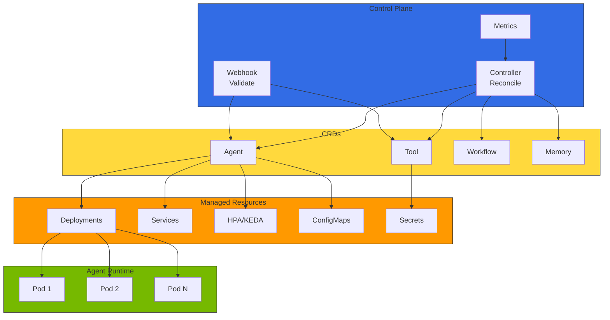
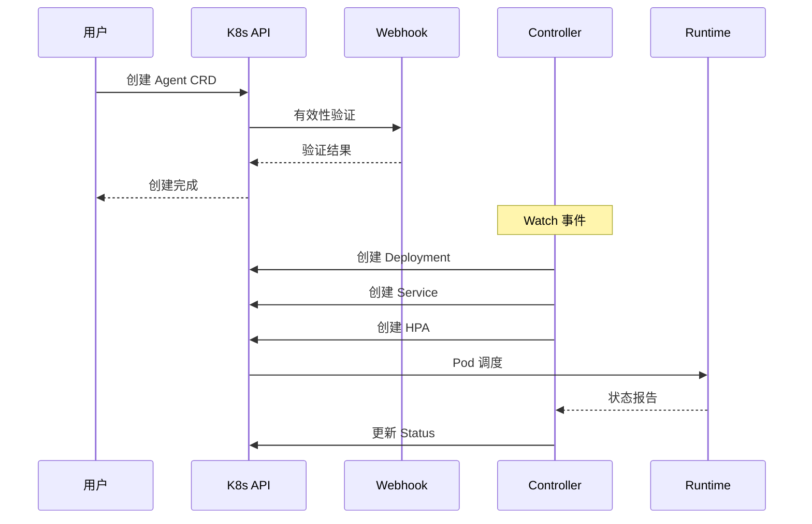
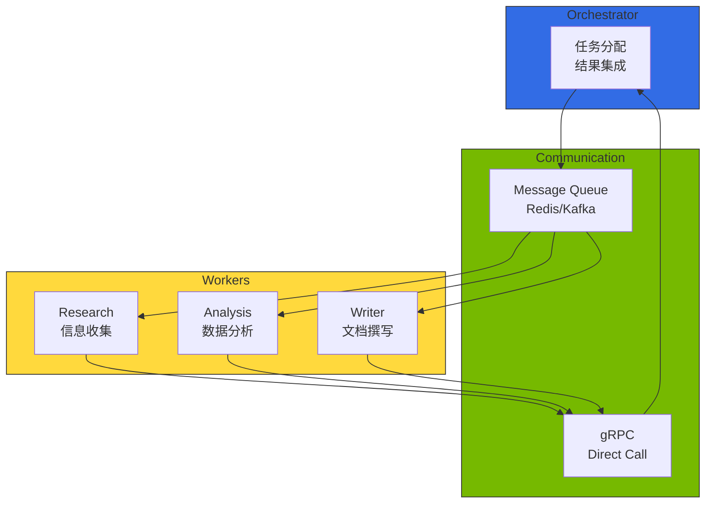
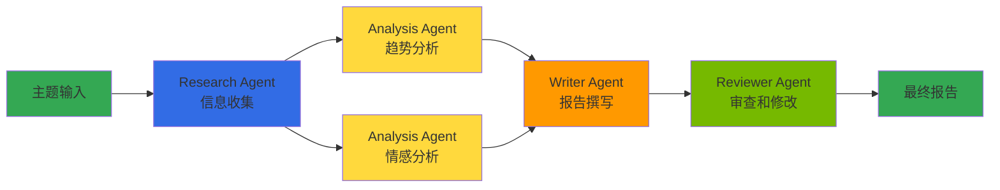

# Kagent - Kubernetes AI Agent 管理

在多模型生态中，AI Agent 需要调用多个 LLM/SLM、通过 MCP/A2A 协议连接工具和其他 Agent，并根据流量动态伸缩。Kubernetes 的 **Operator 模式**是以 CRD 声明式定义这些 Agent 并自动管理生命周期的最自然方式。Kagent 是将此模式应用于 AI Agent 的参考架构。

## 概述

Kagent 通过 Custom Resource Definition（CRD）声明式定义 Agent、工具、工作流，Operator 自动部署和管理。无需直接编写 Deployment、Service、ConfigMap，一个 `Agent` CRD 即可统一管理模型连接、工具绑定、伸缩策略。

:::warning Kagent 项目状态
Kagent 目前处于参考架构和设计模式阶段，官方开源项目尚未公开。本文档示例基于概念性实现。生产环境请考虑 **Bedrock AgentCore**、**KubeAI**、**LangGraph Platform** 等经过验证的替代方案。

Kagent 部署指南请参阅 [Kagent 官方文档](https://github.com/kagent-dev/kagent)。
:::

### 替代方案对比

import { SolutionsComparisonTable } from '@site/src/components/KagentTables';

<SolutionsComparisonTable />

### 主要功能

- **声明式 Agent 管理**：基于 YAML 的 Agent 定义和部署
- **工具注册表**：以 CRD 集中管理 Agent 可用工具
- **自动伸缩**：通过 HPA/KEDA 集成动态扩展
- **多 Agent 编排**：为复杂工作流的 Agent 间协作
- **可观测性集成**：与 Langfuse/LangSmith、OpenTelemetry 原生联动

:::info 目标读者
本文档面向 Kubernetes 管理员、平台工程师、MLOps 工程师。需要了解 Kubernetes 基本概念（Pod、Deployment、CRD）。
:::

:::tip re:Invent 2025 相关 Session

**CNS421: Streamline Amazon EKS Operations with Agentic AI** — 介绍利用 Kagent 等 AI Agent 的 EKS 集群自动管理、实时问题诊断、自动恢复方法。

**主要内容：**
- **Model Context Protocol（MCP）**：AI Agent 与 AWS 服务集成的标准协议
- **自动化事件响应**：Pod 故障、资源不足、网络问题的自动诊断和恢复
- **AWS 服务集成**：与 CloudWatch、Systems Manager、EKS API 的原生联动

[查看 Session 视频](https://www.youtube.com/watch?v=4s-a0jY4kSE)
:::

---

## Kagent 架构

Kagent 遵循 Kubernetes Operator 模式，由 Controller、CRD、Webhook 构成。



### 组件说明

import { ComponentsTable } from '@site/src/components/KagentTables';

<ComponentsTable />

### 组件交互



### 前置条件

- Kubernetes 集群（v1.25 以上）
- kubectl CLI 工具
- Helm v3（Helm 安装时）
- cert-manager（Webhook TLS 证书管理）

---

## CRD 结构

### Agent CRD

Agent CRD 声明式定义 AI Agent 的所有配置。以下是核心 Spec 结构：

```yaml
apiVersion: kagent.dev/v1alpha1
kind: Agent
metadata:
  name: customer-support-agent
  namespace: ai-agents
spec:
  # Agent 基本信息
  displayName: "客户支持 Agent"
  description: "响应客户咨询并创建工单的 AI Agent"

  # 模型设置
  model:
    provider: openai          # openai, anthropic, bedrock, vllm
    name: gpt-4-turbo
    endpoint: ""              # 自定义端点（vLLM 等）
    temperature: 0.7
    maxTokens: 4096
    apiKeySecretRef:
      name: openai-api-key
      key: api-key

  # 系统 Prompt
  systemPrompt: |
    你是一个友好专业的客户支持 Agent。

  # 使用的工具列表
  tools:
    - name: search-knowledge-base
    - name: create-ticket

  # 内存设置
  memory:
    type: redis
    config:
      host: redis-master.ai-data.svc.cluster.local
      ttl: 3600
      maxHistory: 50

  # 伸缩设置
  scaling:
    minReplicas: 2
    maxReplicas: 10
    metrics:
      - type: cpu
        target:
          averageUtilization: 70
    keda:
      enabled: true
      triggers:
        - type: prometheus
          metadata:
            metricName: agent_active_sessions
            threshold: "50"

  # 资源限制
  resources:
    requests:
      memory: "512Mi"
      cpu: "250m"
    limits:
      memory: "1Gi"
      cpu: "500m"

  # 可观测性设置
  observability:
    tracing:
      enabled: true
      provider: langfuse       # langfuse, langsmith, cloudwatch
    metrics:
      enabled: true
      port: 9090
```

### Tool CRD

Tool CRD 定义 Agent 可使用的工具。工具类型有 `api`、`retrieval`、`code`、`human`。

**主要字段：**

| 字段 | 说明 | 示例 |
|------|------|------|
| `spec.type` | 工具类型 | `retrieval`、`api`、`code`、`human` |
| `spec.description` | LLM 选择工具时参考的说明 | "从知识库搜索文档" |
| `spec.retrieval` | 向量存储连接设置 | Milvus、Pinecone 等 |
| `spec.api` | REST API 调用设置 | 端点、认证、超时 |
| `spec.parameters` | 输入参数 Schema | name、type、required、enum |
| `spec.output` | 输出 Schema | JSON Schema 格式 |

### Memory CRD

用于存储 Agent 对话上下文和状态的内存设置。

**主要功能：**

| 功能 | 说明 |
|------|------|
| **会话内存** | 基于 Redis/PostgreSQL 的短期对话记录（TTL 设置）|
| **对话压缩** | 超过阈值时用 LLM 摘要对话 |
| **长期内存** | 基于向量存储的 Agent 经验积累 |
| **内存类型** | `redis`、`postgres`、`in-memory` |

### Workflow CRD

使用 Workflow CRD 定义多 Agent 工作流。

**核心结构：**

| 字段 | 说明 |
|------|------|
| `spec.input` | 工作流输入参数定义 |
| `spec.steps` | 逐步 Agent 执行定义（顺序/并行）|
| `spec.steps[].dependsOn` | 依赖步骤指定（DAG 构建）|
| `spec.steps[].parallel` | 并行执行与否 |
| `spec.output` | 工作流最终输出映射 |
| `spec.errorHandling` | 步骤/工作流失败时行为 |
| `spec.timeout` | 整体工作流超时 |
| `spec.concurrency` | 并发执行限制（queue/reject/replace）|

---

## 多 Agent 编排

定义多个 Agent 协作处理复杂任务的工作流。

### Agent 间通信模式



### 编排模式

| 模式 | 说明 | 适合情况 |
|------|------|-----------|
| **顺序流水线** | 逐步顺序执行，前步输出为下步输入 | 数据处理、ETL |
| **并行扇出** | 同一输入并行传递给多个 Agent | 多角度分析、A/B 对比 |
| **DAG 工作流** | 基于依赖的有向无环图执行 | 复杂研究、报告生成 |
| **循环** | 反复执行直到满足条件 | 审查-修改循环、质量验证 |
| **路由** | 根据输入内容分支到不同 Agent | 咨询分类、专业领域分配 |

### 工作流示例：研究报告



工作流执行状态通过 `WorkflowRun` CRD 追踪：

| 状态 | 说明 |
|------|------|
| `Pending` | 等待执行 |
| `Running` | 一个以上步骤执行中 |
| `Succeeded` | 所有步骤成功完成 |
| `Failed` | 一个以上步骤失败（重试耗尽）|

---

## Agent 生命周期管理

### Operator 管理的资源

创建 Agent CRD 后 Controller 自动创建/管理以下资源：

```
Agent CRD 创建
  ├── Deployment（Agent Pod 管理）
  ├── Service（网络访问）
  ├── HPA/KEDA ScaledObject（自动伸缩）
  ├── ConfigMap（Agent 配置）
  └── Secret 引用（API Key、认证信息）
```

### 更新策略

| 策略 | 说明 | 推荐场景 |
|------|------|-------------|
| **滚动更新** | 默认策略。逐步替换 Pod | 一般配置变更 |
| **金丝雀部署** | 以独立 Agent CRD 测试新版本 | 模型变更、Prompt 大规模修改 |
| **蓝绿部署** | 同时运营两个版本后切换流量 | 零停机迁移 |

### 伸缩策略

| 指标 | 说明 | 阈值示例 |
|--------|------|-----------|
| CPU 使用率 | 基于基本资源的伸缩 | 70% |
| 内存使用率 | 内存压力时扩容 | 80% |
| 活跃会话数 | KEDA + Prometheus 自定义指标 | 50 会话/Pod |
| 请求吞吐量 | 基于每秒请求数 | 100 RPS/Pod |

---

## 可观测性集成

### 支持的可观测性 Provider

| Provider | 类型 | 说明 |
|-----------|------|------|
| **Langfuse** | Tracing | OSS LLM 可观测性（可自托管）|
| **LangSmith** | Tracing | LangChain 生态 Tracing |
| **CloudWatch** | 指标/日志 | AWS 原生 Generative AI Observability |
| **OpenTelemetry** | 通用 | 分布式追踪标准 |
| **Prometheus** | 指标 | ServiceMonitor 指标采集 |

### 核心告警规则

| 告警 | 条件 | 严重度 |
|------|------|--------|
| Agent 错误率增加 | 错误率大于 5%（5 分钟持续）| Critical |
| Agent 响应延迟 | P99 大于 30 秒（5 分钟持续）| Warning |
| Pod 可用性下降 | Ready Pod 低于 50%（5 分钟持续）| Critical |

---

## 总结

利用 Kagent 可以在 Kubernetes 环境中声明式管理 AI Agent。主要优势如下：

- **声明式管理**：基于 YAML 的 Agent 定义支持 GitOps 工作流
- **自动化运维**：通过 Operator 模式自动恢复和伸缩
- **标准化**：通过 CRD 标准化 Agent 定义
- **可扩展性**：利用 Kubernetes 原生伸缩机制
- **可观测性**：集成监控和追踪支持

:::tip 下一步

- [Agentic AI Platform 架构](../design-architecture/agentic-platform-architecture.md) - 整体平台设计
- [Agent 监控](../operations-mlops/agent-monitoring.md) - Langfuse/LangSmith 集成指南
- [GPU 资源管理](../model-serving/gpu-infrastructure/gpu-resource-management.md) - 动态资源分配

:::

---

## 参考资料

- [Kagent 概念和设计模式](https://github.com/kagent-dev/kagent)（参考架构）
- [KubeAI - Kubernetes AI Platform](https://github.com/substratusai/kubeai)
- [Bedrock AgentCore](https://docs.aws.amazon.com/bedrock/latest/userguide/agents-core.html) - AWS 托管 Agent Runtime
- [LangGraph Platform](https://langchain-ai.github.io/langgraph/) - Agent 工作流框架
- [Kubernetes Operator Pattern](https://kubernetes.io/docs/concepts/extend-kubernetes/operator/)
- [KEDA Documentation](https://keda.sh/docs/)
- [re:Invent 2025 CNS421 - Streamline EKS Operations with Agentic AI](https://www.youtube.com/watch?v=4s-a0jY4kSE)
