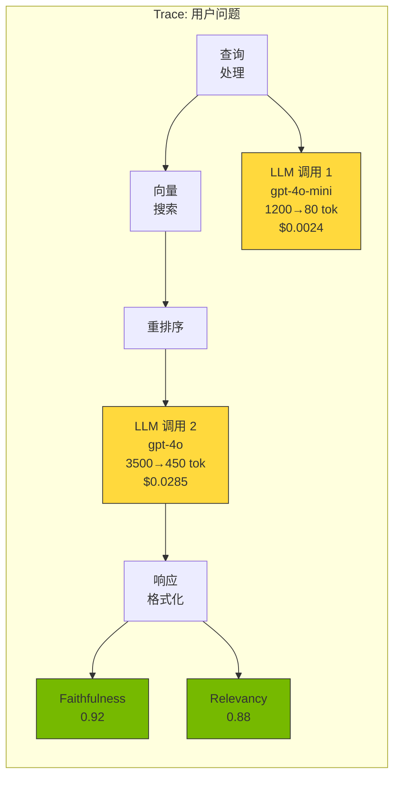
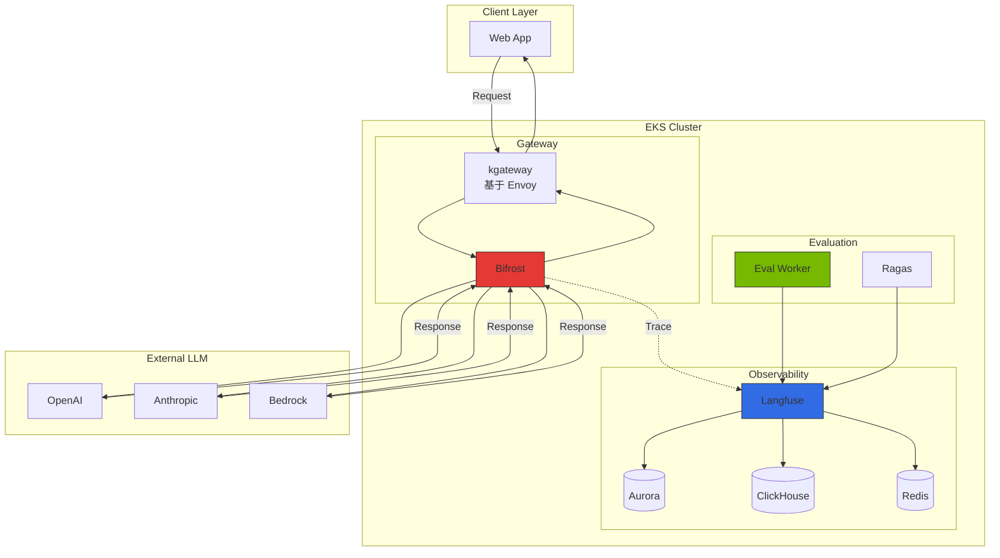

# LLMOps Observability 对比指南

## 1. 概述

### 1.1 传统 APM 在 LLM 工作负载中不足的原因

传统 APM 工具无法满足 LLM 应用的特殊需求：

- **Token 成本追踪不可**：传统 APM 仅测量 CPU/内存使用量，无法追踪 LLM API 调用的实际成本（输入/输出 Token 数和 Provider 定价）
- **Prompt 质量评估缺失**：记录 HTTP 请求/响应正文，但缺乏 Prompt 模板版本管理、A/B 测试、质量评估指标
- **链追踪局限**：LangChain/LlamaIndex 等框架的复杂链和 Agent 工作流通过简单 HTTP trace 难以获得可见性
- **语义上下文不足**：仅测量 latency/throughput，无法评估"答案是否准确"、"是否产生幻觉"等语义质量

### 1.2 LLMOps Observability 的 4 大核心领域

1. **Tracing**：追踪完整请求生命周期（Prompt -> LLM -> 响应），嵌套链/Agent 步骤级可见性
2. **Evaluation**：通过自动/手动评估测量响应质量（准确度、忠实度、相关性、毒性等）
3. **Prompt Management**：Prompt 模板版本管理、A/B 测试、生产部署流水线
4. **Cost Tracking**：按 Provider/模型的 Token 成本实时汇总，团队/项目级预算管理

:::info 实战部署指南
Langfuse Helm 部署、Redis/ClickHouse 配置、kgateway sub-path 路由、Bifrost OTel 联动等实战配置请参阅 [监控栈配置指南](../reference-architecture/monitoring-observability-setup.md)。
:::

---

## 2. 核心概念

### 2.1 Trace 结构

### 2.2 主要概念定义

| 概念 | 说明 |
|------|------|
| **Trace** | 表示请求完整生命周期的顶层单位。用户问题 -> 多次 LLM 调用 -> 最终响应 |
| **Span** | 构成 Trace 的各步骤（LLM 调用、工具调用、向量搜索、后处理）|
| **Generation** | LLM API 调用详情：输入输出 Token、模型名、参数、延迟、成本 |
| **Score** | 响应质量评估指标：自动（LLM-as-Judge）、手动（人类反馈）|
| **Session** | 在对话应用中将多个 Trace 关联的上下文 |

---

## 3. 方案对比

### 3.1 Langfuse

**开源 LLMOps Observability 平台**（MIT 许可，完全自托管支持）

**核心功能**：
- **Tracing**：LangChain、LlamaIndex、OpenAI SDK 原生集成，嵌套链/Agent 完整可见性
- **Prompt Management**：Prompt 模板版本管理、A/B 测试、生产/预发布环境分离
- **Evaluation**：LLM-as-Judge、规则自动评估、Annotation Queue 手动评估、Dataset 管理
- **架构**：PostgreSQL（元数据）+ ClickHouse（分析）+ Redis（缓存）

**优点**：完整数据所有权、无限扩展、强大评估流水线、成本效率（自托管）

**缺点**：运维开销（PG+CH+Redis 管理）、初始配置复杂度

### 3.2 LangSmith

**LangChain AI 提供的云端 Observability 平台**

**核心功能**：
- LangChain/LangGraph 零代码集成
- Hub（Prompt 市场）：社区共享、版本管理、Fork/Share
- Evaluator 库：预定义评估器、对比模式
- Annotation Queue：团队协作、RLHF 数据源

**优点**：LangChain 深度集成、托管服务、5 分钟内集成

**缺点**：LangChain 依赖、仅云端（企业版才可自托管）、按 Trace 计费

### 3.3 Helicone

**基于 Rust 的高性能 LLM Gateway + Observability 集成方案**

**核心功能**：
- Zero-Code 集成：仅更改 OpenAI endpoint URL 即可自动追踪
- 内置 Gateway 功能：Rate limiting、Caching、Retries、Load balancing
- 实时成本仪表板

**优点**：超快集成（仅更改 URL）、高性能（Rust，低于 10ms 延迟）、内置 Gateway 功能

**缺点**：缺少 Prompt 管理/评估流水线、嵌套 Span 追踪有限

### 3.4 方案对比表

| 功能 | Langfuse | LangSmith | Helicone |
|------|----------|-----------|----------|
| **许可** | MIT（开源）| Proprietary | Proprietary（可自托管）|
| **自托管** | 完全支持 | 仅企业版 | 支持 |
| **Tracing** | ★★★★★ | ★★★★★ | ★★★ |
| **Prompt Management** | ★★★★★（版本、A/B）| ★★★★（Hub）| ★★（简单存储）|
| **Evaluation** | ★★★★★（Pipeline）| ★★★★★ | ★（无）|
| **Cost Tracking** | ★★★★★ | ★★★★ | ★★★★ |
| **LangChain 集成** | ★★★★ | ★★★★★ | ★★★ |
| **框架中立性** | ★★★★★ | ★★★ | ★★★★★ |
| **Gateway 功能** | 无 | 无 | ★★★★★ |
| **扩展上限** | 无限（自托管）| 计划限制 | 计划限制 |
| **数据主权** | ★★★★★ | ★★ | ★★★★ |

---

## 4. 混合架构推荐

### 4.1 为什么单一方案不够

企业环境存在复合需求：

1. **Gateway 分离需要**：Rate limiting、Caching、Failover 需独立于 Observability 管理
2. **多框架支持**：LangChain、LlamaIndex、自定义代码混合
3. **数据主权和成本**：敏感数据无法传输到云端，大流量时计费急剧增长
4. **高级评估流水线**：集成 Ragas 等专业框架、CI/CD 回归测试自动化

### 4.2 推荐组合：kgateway + Bifrost（Gateway）+ Langfuse（Observability）

**优势**：
- **Gateway 职责分离**：kgateway（基于 Envoy）负责流量管理、认证、Rate limiting，Bifrost 负责 Provider 路由和 Caching
- **Observability 专业化**：Langfuse 负责 Tracing、评估、Prompt 管理
- **完全自托管**：所有组件在 EKS 上运行
- **可扩展性**：各层独立伸缩

---

## 5. OpenTelemetry 集成架构

### 5.1 为什么集成 OpenTelemetry

Langfuse 提供 LLM 专用 Observability，但完整应用上下文由现有 APM 管理。使用 OpenTelemetry：

- **统一仪表板**：在同一画面查看 LLM Trace + 现有 APM Trace
- **相关性分析**：追踪 HTTP 请求 -> DB 查询 -> LLM 调用的完整流程
- **单一检测 SDK**：仅用 OpenTelemetry 同时发送到 Langfuse 和现有 APM

### 5.2 OTel Semantic Conventions 映射

| OTEL 属性 | Langfuse 字段 | 说明 |
|-----------|---------------|------|
| `llm.model` | `model` | 模型名（gpt-4o、claude-3-opus 等）|
| `llm.input_tokens` | `usage.input` | 输入 Token 数 |
| `llm.output_tokens` | `usage.output` | 输出 Token 数 |
| `llm.temperature` | `modelParameters.temperature` | Temperature 参数 |
| `llm.request.prompt` | `input` | Prompt |
| `llm.response.completion` | `output` | 响应文本 |
| `llm.total_cost` | `calculatedTotalCost` | 计算成本 |

---

## 6. 评估流水线概念

### 6.1 评估方式

Langfuse Evaluation 支持三种方式：

1. **LLM-as-Judge**：使用单独 LLM 评估响应质量（Faithfulness、Relevancy 等）
2. **规则**：Python 函数自定义评估逻辑（正则匹配、关键词检查）
3. **手动评估**：在 Annotation Queue 中人工直接评估（RLHF 数据收集）

### 6.2 评估指标

| 指标 | 范围 | 说明 | 评估方法 |
|--------|------|------|-----------|
| **Faithfulness** | 0-1 | 响应是否忠实于提供的上下文？ | LLM-as-Judge |
| **Answer Relevancy** | 0-1 | 响应是否与问题相关？ | Ragas（嵌入相似度）|
| **Context Precision** | 0-1 | 检索的上下文是否与问题相关？ | Ragas |
| **Context Recall** | 0-1 | Ground Truth 是否包含在检索的上下文中？ | Ragas |
| **Toxicity** | 0-1 | 响应是否包含有害内容？ | Detoxify 库 |
| **Latency** | ms | 响应生成延迟 | 自动采集 |
| **Cost** | USD | 每请求成本 | 自动计算 |

### 6.3 Ragas 联动

Ragas 是 RAG 系统专用评估框架，与 Langfuse 集成提供更精确的评估。详情请参阅 [RAG Evaluation with Ragas](./ragas-evaluation.md)。

---

## 7. 按场景推荐

| 场景 | 推荐方案 | 原因 |
|----------|-------------|------|
| **LangChain/LangGraph 为主开发** | LangSmith | LangChain 原生集成，一行代码追踪完整链 |
| **数据主权必须（金融/医疗）** | Langfuse（自托管）| 所有数据存储在自有基础设施，GDPR/HIPAA 合规 |
| **快速启动（MVP/PoC）** | Helicone | 仅更改 URL 即可追踪，内置 Gateway 功能 |
| **Prompt 工程团队运营** | Langfuse | Prompt 版本管理、A/B 测试、Dataset + 自动评估 |
| **企业混合** | Bifrost + Langfuse | Gateway/Observability 职责分离、独立伸缩 |
| **全栈 GenAI 平台** | kgateway + Bifrost + Langfuse + Ragas | API 管理 + LLM 路由 + 追踪 + 质量评估 |
| **大流量（月 1000 万+ Trace）** | Langfuse + ClickHouse 集群 | 水平扩展、成本效率 |

---

## 8. 总结

1. **LLMOps Observability 是必须的**：传统 APM 无法支持 LLM 工作负载的 Token 成本、Prompt 质量、链追踪。
2. **三大方案**：Langfuse（开源、自托管、评估流水线）、LangSmith（LangChain 最优、托管）、Helicone（代理模式、Gateway+Observability 集成）
3. **推荐混合架构**：Bifrost（Gateway）+ Langfuse（Observability）组合最适合企业环境
4. **OpenTelemetry 集成**：将现有 APM 和 LLMOps Observability 连接到统一仪表板
5. **评估流水线**：利用 LLM-as-Judge、Ragas、Annotation Queue 的自动/手动质量评估

---

## 参考资料

### 官方文档
- [Langfuse Documentation](https://langfuse.com/docs)
- [LangSmith Documentation](https://docs.smith.langchain.com)
- [Helicone Documentation](https://docs.helicone.ai)
- [OpenTelemetry LLM Semantic Conventions](https://opentelemetry.io/docs/specs/semconv/gen-ai/)
- [Ragas Documentation](https://docs.ragas.io)

### 相关文档
- [监控栈配置指南](../reference-architecture/monitoring-observability-setup.md) - Langfuse 部署、Bifrost OTel 联动、kgateway 路由实战配置
- [Bifrost Gateway 配置指南](../reference-architecture/inference-gateway-routing.md)
- [RAG Evaluation with Ragas](./ragas-evaluation.md)
- [Agent 监控与运营](./agent-monitoring.md)
