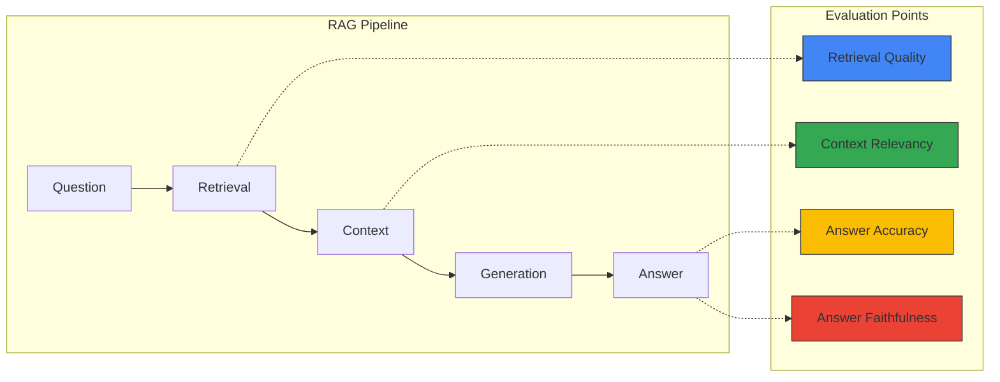
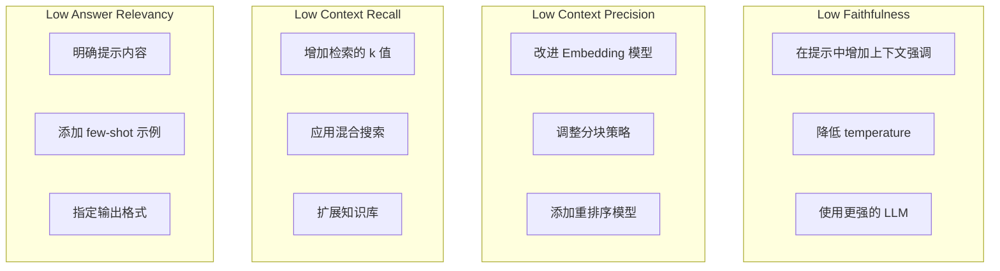

import { RagasVsBedrockComparison, RagasMetrics, CostOptimizationStrategies, CostComparison, ImprovementChecklist } from '@site/src/components/RagasTables';

# Ragas RAG 评估框架

Ragas（RAG Assessment）是一个用于客观评估 RAG（检索增强生成）管道质量的开源框架。它对于衡量 Agentic AI 平台中 RAG 系统的性能并持续改进至关重要。

## 概述

### 为什么需要 RAG 评估

RAG 系统由多个组件（检索、生成、上下文处理）组成，使得整体质量难以衡量：



### Ragas 核心指标

<RagasMetrics />

## 安装与基本设置

### Python 环境设置

```bash
# 安装 Ragas
pip install ragas langchain-openai datasets

# 额外依赖
pip install pandas numpy
```

### 基本评估代码

```python
from ragas import evaluate
from ragas.metrics import (
    faithfulness,
    answer_relevancy,
    context_precision,
    context_recall,
)
from datasets import Dataset

# 准备评估数据集
eval_data = {
    "question": [
        "How do you perform GPU scheduling in Kubernetes?",
        "What are the key features of Karpenter?",
    ],
    "answer": [
        "GPU scheduling in Kubernetes is performed through NVIDIA Device Plugin...",
        "Karpenter provides automatic node provisioning, consolidation, and drift detection...",
    ],
    "contexts": [
        ["GPU scheduling is through Device Plugin...", "NVIDIA GPU Operator is..."],
        ["Karpenter is a Kubernetes node auto-scaler...", "NodePool CRD is used..."],
    ],
    "ground_truth": [
        "GPU resources are scheduled using NVIDIA Device Plugin and GPU Operator.",
        "Karpenter provides automatic node provisioning, consolidation, drift detection, and disruption handling.",
    ],
}

dataset = Dataset.from_dict(eval_data)

# 运行评估
results = evaluate(
    dataset,
    metrics=[
        faithfulness,
        answer_relevancy,
        context_precision,
        context_recall,
    ],
)

print(results)
```

## 核心指标详解

### 1. 忠实度（Faithfulness）

衡量答案对所提供上下文的忠实程度。该指标是检测幻觉的关键。

```python
from ragas.metrics import faithfulness

# 忠实度计算过程：
# 1. 将答案分解为独立的声明
# 2. 验证每个声明是否可以从上下文中推断
# 3. 忠实度分数 = 已验证声明数 / 总声明数

# 分数解读：
# 1.0：所有声明都有上下文支持
# 0.5：一半的声明有上下文支持
# 0.0：没有声明有上下文支持（严重幻觉）
```

### 2. 答案相关性（Answer Relevancy）

衡量答案与问题的相关程度。

```python
from ragas.metrics import answer_relevancy

# 答案相关性计算过程：
# 1. 从答案生成问题（逆向工程）
# 2. 计算生成问题与原始问题的相似度
# 3. 重复多次取平均值

# 分数解读：
# 高分：答案与问题直接相关
# 低分：答案包含无关内容
```

### 3. 上下文精确度（Context Precision）

衡量检索到的上下文中实际有用信息的占比。

```python
from ragas.metrics import context_precision

# 上下文精确度计算：
# - 识别生成真实答案所需的上下文
# - 检查有用信息是否在排名靠前的上下文中
# - 相关上下文排名越靠前，分数越高
```

### 4. 上下文召回率（Context Recall）

衡量生成正确答案所需的信息是否包含在检索到的上下文中。

```python
from ragas.metrics import context_recall

# 上下文召回率计算：
# 1. 将真实答案分解为独立句子
# 2. 检查每个句子是否可以从检索到的上下文中推断
# 3. 召回率分数 = 可推断句子数 / 总句子数
```

## 综合评估管道

### 完整 RAG 系统评估

```python
import os
from ragas import evaluate
from ragas.metrics import (
    faithfulness,
    answer_relevancy,
    context_precision,
    context_recall,
    context_relevancy,
    answer_correctness,
)
from datasets import Dataset
from langchain_openai import ChatOpenAI, OpenAIEmbeddings

# LLM 配置（用于评估）
os.environ["OPENAI_API_KEY"] = "your-api-key"

def evaluate_rag_pipeline(questions, rag_chain, ground_truths):
    """综合 RAG 管道评估"""

    answers = []
    contexts = []

    for question in questions:
        # 运行 RAG 链
        result = rag_chain.invoke({"query": question})
        answers.append(result["result"])
        contexts.append([doc.page_content for doc in result["source_documents"]])

    # 构建评估数据集
    eval_dataset = Dataset.from_dict({
        "question": questions,
        "answer": answers,
        "contexts": contexts,
        "ground_truth": ground_truths,
    })

    # 使用所有指标进行评估
    results = evaluate(
        eval_dataset,
        metrics=[
            faithfulness,
            answer_relevancy,
            context_precision,
            context_recall,
            context_relevancy,
            answer_correctness,
        ],
    )

    return results

# 使用示例
questions = [
    "How do you set up Karpenter in EKS?",
    "How do you configure GPU node auto-scaling?",
    "How do you set up dynamic routing in Inference Gateway?",
]

ground_truths = [
    "Karpenter is installed via Helm chart and configured with NodePool CRD.",
    "Configure GPU-based scaling by integrating DCGM Exporter metrics with KEDA.",
    "Set up weighted traffic distribution using Gateway API HTTPRoute.",
]

# 运行评估
results = evaluate_rag_pipeline(questions, rag_chain, ground_truths)
print(results.to_pandas())
```

### 分析评估结果

```python
import pandas as pd
import matplotlib.pyplot as plt

def analyze_evaluation_results(results):
    """分析并可视化评估结果"""

    df = results.to_pandas()

    # 各指标平均分
    metrics_summary = df.mean(numeric_only=True)
    print("=== 各指标平均分 ===")
    print(metrics_summary)

    # 识别需要改进的领域
    print("\n=== 需要改进的领域 ===")
    for metric, score in metrics_summary.items():
        if score < 0.7:
            print(f"⚠️ {metric}: {score:.2f} - 需要改进")
        elif score < 0.85:
            print(f"📊 {metric}: {score:.2f} - 尚可")
        else:
            print(f"✅ {metric}: {score:.2f} - 优秀")

    # 可视化
    fig, ax = plt.subplots(figsize=(10, 6))
    metrics_summary.plot(kind='bar', ax=ax, color=['#4285f4', '#34a853', '#fbbc04', '#ea4335', '#9c27b0', '#00bcd4'])
    ax.set_ylabel('Score')
    ax.set_title('RAG Pipeline Evaluation Results')
    ax.set_ylim(0, 1)
    ax.axhline(y=0.7, color='r', linestyle='--', label='Minimum Threshold')
    ax.legend()
    plt.tight_layout()
    plt.savefig('rag_evaluation_results.png')

    return metrics_summary

# 运行分析
summary = analyze_evaluation_results(results)
```

## CI/CD 管道集成

### GitHub Actions 工作流

```yaml
# .github/workflows/rag-evaluation.yml
name: RAG Pipeline Evaluation

on:
  push:
    paths:
      - 'src/rag/**'
      - 'data/knowledge_base/**'
  pull_request:
    paths:
      - 'src/rag/**'
  schedule:
    - cron: '0 0 * * *'  # 每天午夜执行

jobs:
  evaluate:
    runs-on: ubuntu-latest

    steps:
    - uses: actions/checkout@v4

    - name: Set up Python
      uses: actions/setup-python@v5
      with:
        python-version: '3.11'

    - name: Install dependencies
      run: |
        pip install ragas langchain-openai datasets pandas

    - name: Run RAG Evaluation
      env:
        OPENAI_API_KEY: ${{ secrets.OPENAI_API_KEY }}
      run: |
        python scripts/evaluate_rag.py --output results/evaluation.json

    - name: Check Quality Gates
      run: |
        python scripts/check_quality_gates.py results/evaluation.json

    - name: Upload Results
      uses: actions/upload-artifact@v4
      with:
        name: evaluation-results
        path: results/

    - name: Comment PR with Results
      if: github.event_name == 'pull_request'
      uses: actions/github-script@v7
      with:
        script: |
          const fs = require('fs');
          const results = JSON.parse(fs.readFileSync('results/evaluation.json'));

          let comment = '## RAG Evaluation Results\n\n';
          comment += '| Metric | Score | Status |\n';
          comment += '|--------|-------|--------|\n';

          for (const [metric, score] of Object.entries(results.metrics)) {
            const status = score >= 0.7 ? '✅' : '⚠️';
            comment += `| ${metric} | ${score.toFixed(2)} | ${status} |\n`;
          }

          github.rest.issues.createComment({
            issue_number: context.issue.number,
            owner: context.repo.owner,
            repo: context.repo.repo,
            body: comment
          });
```

### 质量门控脚本

```python
# scripts/check_quality_gates.py
import json
import sys

> 📅 **撰写日期**: 2026-02-13 | **修改日期**: 2026-02-14 | ⏱️ **阅读时间**: 约 2 分钟


QUALITY_GATES = {
    "faithfulness": 0.8,
    "answer_relevancy": 0.75,
    "context_precision": 0.7,
    "context_recall": 0.7,
}

def check_quality_gates(results_file):
    with open(results_file) as f:
        results = json.load(f)

    failed_gates = []

    for metric, threshold in QUALITY_GATES.items():
        score = results["metrics"].get(metric, 0)
        if score < threshold:
            failed_gates.append({
                "metric": metric,
                "score": score,
                "threshold": threshold,
            })

    if failed_gates:
        print("❌ 质量门控未通过：")
        for gate in failed_gates:
            print(f"  - {gate['metric']}: {gate['score']:.2f} < {gate['threshold']}")
        sys.exit(1)
    else:
        print("✅ 所有质量门控已通过！")
        sys.exit(0)

if __name__ == "__main__":
    check_quality_gates(sys.argv[1])
```

## Kubernetes 定时评估任务

### 评估任务定义

```yaml
apiVersion: batch/v1
kind: CronJob
metadata:
  name: rag-evaluation
  namespace: genai-platform
spec:
  schedule: "0 6 * * *"  # 每天早上 6 点
  jobTemplate:
    spec:
      template:
        spec:
          containers:
          - name: evaluator
            image: your-registry/rag-evaluator:latest
            env:
            - name: OPENAI_API_KEY
              valueFrom:
                secretKeyRef:
                  name: openai-credentials
                  key: api-key
            - name: MILVUS_HOST
              value: "milvus-proxy.milvus.svc.cluster.local"
            - name: RESULTS_BUCKET
              value: "s3://rag-evaluation-results"
            command:
            - python
            - /app/evaluate.py
            - --config=/app/config/evaluation.yaml
            - --output=s3
            resources:
              requests:
                cpu: "1"
                memory: "2Gi"
              limits:
                cpu: "2"
                memory: "4Gi"
          restartPolicy: OnFailure
          serviceAccountName: rag-evaluator
```

### 评估配置 ConfigMap

```yaml
apiVersion: v1
kind: ConfigMap
metadata:
  name: rag-evaluation-config
  namespace: genai-platform
data:
  evaluation.yaml: |
    evaluation:
      metrics:
        - faithfulness
        - answer_relevancy
        - context_precision
        - context_recall

      test_sets:
        - name: "general_knowledge"
          path: "s3://test-data/general.json"
          weight: 0.4
        - name: "technical_docs"
          path: "s3://test-data/technical.json"
          weight: 0.6

      quality_gates:
        faithfulness: 0.8
        answer_relevancy: 0.75
        context_precision: 0.7
        context_recall: 0.7

      alerts:
        slack_webhook: "https://hooks.slack.com/..."
        threshold_drop: 0.1  # 下降 10% 以上时告警
```

## 评估结果解读与改进指南

### 各指标改进方向



### 改进清单

<ImprovementChecklist />

## 相关文档

- [Milvus 向量数据库](./milvus-vector-database.md)
- [Agent 监控](./agent-monitoring.md)
- [Agentic AI 平台架构](./agentic-platform-architecture.md)

:::tip 建议

- 评估数据集中至少包含 50 个多样化的问题
- 使用领域专家验证过的答案作为真实标准
- 通过定期评估跟踪质量随时间的变化
:::

:::warning 注意事项

- Ragas 评估需要调用 LLM API，会产生费用
- 对于大规模评估，请使用批处理和缓存
- 评估结果可能因使用的 LLM 不同而有所差异
:::
