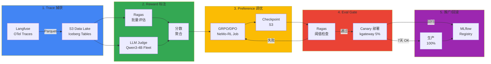
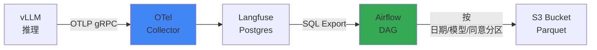

# EKS 上的持续训练流水线

## 概述

持续训练流水线是将生产推理追踪自动转换为训练数据以持续改进模型的 **Self-Improving Agent Loop** 实现架构。收集 Langfuse OTel 追踪到 S3 Data Lake，通过 Reward Labeler 评估质量，然后执行 GRPO/DPO preference tuning。评估通过后通过 Canary 部署逐步推广到生产。

### 为什么需要持续训练

传统训练方式依赖于**静态数据集**。但生产用户反馈持续产生，如果无法反映这些反馈，随着时间推移模型将与**实际使用模式脱节**。

| 问题 | 传统方式 | 持续训练 |
|------|----------|---------------------|
| **数据收集** | 手动标注（每月 1 次）| 自动 trace 收集（实时）|
| **反馈反映** | 3-6 个月 | 1 周 |
| **质量改进** | 等待新数据集 | 立即反映用户反馈 |
| **成本** | 标注 $10K/月 | Reward Model 自动化 |

:::tip 设计文档链接
本文档介绍如何在 EKS 上实现[自我改进 Agent 循环](../design-architecture/self-improving-agent-loop.md)的 5 阶段架构。设计背景和战略决策请参考设计文档。
:::

### 5 阶段流水线流程



**核心概念：**

1. **Trace → Dataset**：将 Langfuse 生产推理日志转换为训练数据
2. **Reward Labeling**：通过 Ragas + LLM Judge 将 trace 质量评分为 0-1
3. **GRPO/DPO**：高分 trace 作为偏好（preference），低分作为非偏好进行训练
4. **Eval Gate**：训练后验证质量阈值
5. **Canary → 100%**：渐进式流量增加，回归时立即回滚

---

## 1. Trace → Dataset 物化器

### 1-1. Langfuse OTel → S3 Parquet

Langfuse 通过 OpenTelemetry 协议收集推理追踪。将其以 Parquet 格式存储到 S3，以便进行大规模批量分析。



#### Langfuse Trace Schema

```sql
-- Langfuse traces 表结构（PostgreSQL）
CREATE TABLE traces (
    id UUID PRIMARY KEY,
    timestamp TIMESTAMP,
    user_id TEXT,
    session_id TEXT,
    input TEXT,
    output TEXT,
    model TEXT,
    latency_ms INT,
    token_count INT,
    metadata JSONB,
    user_consent BOOLEAN  -- GDPR 同意状态
);

-- 示例数据
{
  "id": "trace-12345",
  "timestamp": "2026-04-18T03:15:00Z",
  "user_id": "user-abc",
  "input": "EKS Auto Mode 和 Karpenter 的区别是什么？",
  "output": "EKS Auto Mode 是 AWS 完全托管的节点组...",
  "model": "glm-5-32b",
  "latency_ms": 850,
  "token_count": 512,
  "metadata": {
    "domain": "eks-documentation",
    "feedback_score": 4.5
  },
  "user_consent": true
}
```

#### S3 分区策略

```bash
s3://training-data-lake/
└── langfuse-traces/
    ├── date=2026-04-18/
    │   ├── model=glm-5-32b/
    │   │   ├── consent=true/
    │   │   │   └── traces-000001.parquet  (10k 行)
    │   │   └── consent=false/
    │   │       └── traces-000002.parquet
    │   └── model=qwen3-coder/
    │       └── consent=true/
    │           └── traces-000003.parquet
    └── date=2026-04-19/
        └── ...
```

**分区原因：**

- **日期**：优化时间范围查询（例如：最近 7 天数据）
- **模型**：按模型跟踪性能、分离 A/B 测试
- **同意**：遵守 GDPR/CCPA 法规，排除未同意数据的训练

#### Apache Iceberg vs Hudi

| 特性 | Apache Iceberg | Apache Hudi |
|------|---------------|-------------|
| **快照隔离** | 完美的 ACID 事务 | 基于时间线的一致性 |
| **Schema 演化** | 自动添加/删除列 | 需要手动迁移 |
| **查询性能** | 分区修剪优化 | COW/MOR 模式选择 |
| **AWS 集成** | Glue Catalog 原生 | EMR 优化 |
| **推荐用途** | 大规模分析查询 | 实时 upsert 为中心 |

:::tip 推荐 Iceberg
持续训练是**读取为中心的工作负载**（批量训练），因此推荐 Iceberg。由于 Schema 变更频繁（新增元数据字段），自动 Schema Evolution 有利。
:::

#### Airflow DAG 示例

```python
# dags/langfuse_to_s3.py
from airflow import DAG
from airflow.providers.postgres.hooks.postgres import PostgresHook
from airflow.providers.amazon.aws.hooks.s3 import S3Hook
from airflow.operators.python import PythonOperator
from datetime import datetime, timedelta
import pandas as pd
import pyarrow as pa
import pyarrow.parquet as pq

def export_langfuse_traces(**context):
    """Langfuse Postgres → S3 Parquet 转换"""
    
    # Langfuse DB 连接
    pg_hook = PostgresHook(postgres_conn_id='langfuse_db')
    
    # 提取昨天的数据（仅 user_consent=true）
    yesterday = context['ds']
    query = f"""
        SELECT 
            id, timestamp, user_id, session_id,
            input, output, model, latency_ms, token_count,
            metadata
        FROM traces
        WHERE DATE(timestamp) = '{yesterday}'
          AND user_consent = true
          AND output IS NOT NULL
        ORDER BY timestamp
    """
    
    df = pg_hook.get_pandas_df(query)
    
    # 按模型分组保存 Parquet
    for model, group in df.groupby('model'):
        table = pa.Table.from_pandas(group)
        
        # S3 路径：s3://bucket/date=2026-04-18/model=glm-5-32b/consent=true/
        s3_key = f"langfuse-traces/date={yesterday}/model={model}/consent=true/traces-{context['ti'].xcom_pull()}.parquet"
        
        # S3 上传
        s3_hook = S3Hook(aws_conn_id='aws_default')
        with s3_hook.get_conn().open(f"s3://training-data-lake/{s3_key}", 'wb') as f:
            pq.write_table(table, f, compression='snappy')
    
    return len(df)

with DAG(
    dag_id='langfuse_to_s3_daily',
    schedule_interval='0 6 * * *',  # 每天早上 6 点
    start_date=datetime(2026, 4, 1),
    catchup=False,
    default_args={
        'retries': 3,
        'retry_delay': timedelta(minutes=5),
    }
) as dag:
    
    export_task = PythonOperator(
        task_id='export_traces',
        python_callable=export_langfuse_traces,
    )
```

#### AWS Glue Catalog 注册

```python
# glue_iceberg_table.py
import boto3

glue = boto3.client('glue')

# Iceberg 表定义
glue.create_table(
    DatabaseName='training_data',
    TableInput={
        'Name': 'langfuse_traces',
        'StorageDescriptor': {
            'Columns': [
                {'Name': 'id', 'Type': 'string'},
                {'Name': 'timestamp', 'Type': 'timestamp'},
                {'Name': 'user_id', 'Type': 'string'},
                {'Name': 'input', 'Type': 'string'},
                {'Name': 'output', 'Type': 'string'},
                {'Name': 'model', 'Type': 'string'},
                {'Name': 'latency_ms', 'Type': 'int'},
                {'Name': 'metadata', 'Type': 'struct<feedback_score:double,domain:string>'},
            ],
            'Location': 's3://training-data-lake/langfuse-traces/',
            'InputFormat': 'org.apache.iceberg.mr.hive.HiveIcebergInputFormat',
            'OutputFormat': 'org.apache.iceberg.mr.hive.HiveIcebergOutputFormat',
            'SerdeInfo': {
                'SerializationLibrary': 'org.apache.iceberg.mr.hive.HiveIcebergSerDe'
            }
        },
        'PartitionKeys': [
            {'Name': 'date', 'Type': 'date'},
            {'Name': 'model', 'Type': 'string'},
            {'Name': 'consent', 'Type': 'boolean'},
        ],
        'Parameters': {
            'table_type': 'ICEBERG',
            'format': 'parquet',
            'write.parquet.compression-codec': 'snappy',
        }
    }
)
```

---

## 2. Reward Labeler Fleet

### 2-1. Reward Labeling 概念

**Reward Labeling** 是将每个 trace 的质量评分为 0-1 之间的过程。该分数在 GRPO/DPO 训练中用作**偏好信号**。

```
高分 trace（0.8-1.0）→ 偏好示例（训练时权重 ↑）
低分 trace（0.0-0.3）→ 非偏好示例（训练时权重 ↓）
```

### 2-2. 评估指标组合

#### Ragas 指标

[Ragas 评估框架](../operations-mlops/ragas-evaluation.md)客观测量 RAG 系统的质量。

```python
from ragas.metrics import faithfulness, answer_relevancy, context_precision

# Ragas 批量评估
scores = {
    'faithfulness': 0.92,      # 答案是否忠实于上下文
    'answer_relevancy': 0.88,  # 答案是否与问题相关
    'context_precision': 0.85  # 检索的上下文是否准确
}

# 加权平均计算最终 Reward
reward = (
    0.5 * scores['faithfulness'] +
    0.3 * scores['answer_relevancy'] +
    0.2 * scores['context_precision']
)
# → reward = 0.896
```

#### LLM-as-a-Judge

使用小模型（Qwen3-4B）作为 judge 评估答案质量。

```python
# LLM Judge 提示
JUDGE_PROMPT = """
请评估以下问题和答案。

**问题**：{question}
**答案**：{answer}

**评估标准**：
1. 准确性：是否存在技术错误？
2. 完整性：是否涵盖问题的所有方面？
3. 清晰度：是否易于理解？

请以 0.0-1.0 之间的分数输出。仅以 JSON 格式回复：
{{"score": 0.85, "reasoning": "..."}}
"""

# 使用 Qwen3-4B 评估（vLLM 批量推理）
judge_response = vllm_client.chat.completions.create(
    model="qwen3-coder-4b",
    messages=[{"role": "user", "content": JUDGE_PROMPT.format(question=q, answer=a)}],
    temperature=0.1,
    max_tokens=200,
)

judge_score = json.loads(judge_response.choices[0].message.content)['score']
# → judge_score = 0.85
```

#### 最终 Reward 汇总

```python
# Ragas + LLM Judge 组合
final_reward = (
    0.6 * ragas_reward +      # Ragas 权重 60%
    0.4 * judge_score         # Judge 权重 40%
)
```

### 2-3. KServe InferenceService 部署

将 Qwen3-4B Judge 模型通过 KServe 部署为高可用 fleet。

```yaml
# reward-labeler-inference.yaml
apiVersion: serving.kserve.io/v1beta1
kind: InferenceService
metadata:
  name: reward-labeler-qwen3
  namespace: training-pipeline
spec:
  predictor:
    minReplicas: 3
    maxReplicas: 10
    containers:
    - name: kserve-container
      image: vllm/vllm-openai:v0.18.2
      args:
      - --model=Qwen/Qwen3-Coder-4B-Instruct
      - --served-model-name=qwen3-judge
      - --tensor-parallel-size=1
      - --max-model-len=8192
      - --gpu-memory-utilization=0.9
      resources:
        requests:
          nvidia.com/gpu: 1
          memory: 16Gi
        limits:
          nvidia.com/gpu: 1
          memory: 24Gi
      env:
      - name: SERVED_MODEL_NAME
        value: "qwen3-judge"
---
apiVersion: keda.sh/v1alpha1
kind: ScaledObject
metadata:
  name: reward-labeler-scaler
  namespace: training-pipeline
spec:
  scaleTargetRef:
    name: reward-labeler-qwen3
  minReplicaCount: 3
  maxReplicaCount: 10
  triggers:
  - type: prometheus
    metadata:
      serverAddress: http://prometheus:9090
      metricName: vllm_requests_running
      threshold: "10"
      query: |
        avg(vllm_requests_running{model="qwen3-judge"})
```

**自动扩展策略：**

- **最小 3 replica**：保证基本吞吐量
- **最大 10 replica**：应对批量评估峰值
- **触发器**：vLLM 等待请求数 > 10 时扩展

### 2-4. 批量评估 Job

```python
# batch_reward_labeling.py
import pandas as pd
from ragas import evaluate
from ragas.metrics import faithfulness, answer_relevancy, context_precision
import openai
import json
from concurrent.futures import ThreadPoolExecutor

# 从 S3 加载最近 7 天的 trace
df = pd.read_parquet(
    's3://training-data-lake/langfuse-traces/',
    filters=[
        ('date', '>=', '2026-04-11'),
        ('date', '<=', '2026-04-18'),
        ('model', '=', 'glm-5-32b'),
        ('consent', '=', True),
    ]
)

# Ragas 评估
ragas_results = evaluate(
    df,
    metrics=[faithfulness, answer_relevancy, context_precision]
)

# LLM Judge 评估（并行处理）
def judge_single_trace(row):
    response = openai.ChatCompletion.create(
        model="qwen3-judge",
        messages=[{
            "role": "user",
            "content": JUDGE_PROMPT.format(
                question=row['input'],
                answer=row['output']
            )
        }],
        temperature=0.1,
        max_tokens=200,
        # KServe InferenceService 端点
        api_base="http://reward-labeler-qwen3.training-pipeline.svc.cluster.local:8000/v1"
    )
    return json.loads(response.choices[0].message.content)['score']

with ThreadPoolExecutor(max_workers=50) as executor:
    judge_scores = list(executor.map(judge_single_trace, df.to_dict('records')))

# 计算最终 Reward
df['ragas_reward'] = (
    0.5 * ragas_results['faithfulness'] +
    0.3 * ragas_results['answer_relevancy'] +
    0.2 * ragas_results['context_precision']
)
df['judge_score'] = judge_scores
df['final_reward'] = 0.6 * df['ragas_reward'] + 0.4 * df['judge_score']

# 保存标注数据集到 S3
df.to_parquet('s3://training-data-lake/labeled-dataset/2026-04-18.parquet')
```

### 2-5. 成本示例

| 资源 | 规格 | 每小时成本 | 每日成本（运行 10 小时）|
|--------|------|-----------|----------------------|
| **Qwen3-4B Judge Fleet** | g6.xlarge × 3 | $0.93 | $9.30 |
| **Ragas 评估（Bedrock Claude）** | - | 按 API 调用 | $5-10（基于 1 万 trace）|
| **Airflow/Kubernetes** | 现有基础设施 | - | - |
| **总成本** | - | - | **$15-20/天** |

年约 $5,000-7,000，相比手动标注（$10K/月）**节约 95%**。

---

## 3. GRPO/DPO 训练 Job

### 3-1. GRPO vs DPO 概念

#### GRPO（Group Relative Policy Optimization）

**GRPO** 是根据 reward 对同一提示的多个响应进行排序学习的方法。

```
提示："EKS Auto Mode 的优点是什么？"

响应 A（reward=0.9）："AWS 完全管理节点，减少运营负担..."
响应 B（reward=0.6）："Auto Mode 很方便..."
响应 C（reward=0.3）："不太清楚。"

训练：按 A > B > C 顺序优化策略
```

**优点：**

- 学习**相对排名**而非绝对分数 → 对标注噪声稳健
- 每个提示生成多个响应 → 数据效率高
- 相比 RLHF 更简单（无需单独训练 Reward Model）

#### DPO（Direct Preference Optimization）

**DPO** 是直接学习偏好/非偏好对的方法。

```
提示："Karpenter 的主要功能是什么？"

偏好（reward >= 0.7）：
"Karpenter 提供自动节点配置、bin-packing 优化..."

非偏好（reward < 0.5）：
"Karpenter 是扩展工具。"（过于简短）

训练：偏好响应概率 ↑，非偏好响应概率 ↓
```

**优点：**

- 无需像 RLHF 那样的独立 Value Function，**单一 Loss 训练**
- 稳定训练（相比 PPO 超参数调优简单）
- 生产应用案例多（Llama 3.1、Claude 3 等）

#### 选择标准

| 情况 | 推荐方法 | 原因 |
|------|----------|------|
| **可生成多样响应** | GRPO | 排名学习提高数据效率 ↑ |
| **明确偏好/非偏好区分** | DPO | 简单且稳定 |
| **标注噪声多** | GRPO | 相对排名比绝对分数更稳健 |
| **快速原型** | DPO | 超参数调优简单 |

### 3-2. 基于 NeMo-RL 的 GRPO 训练

[NeMo Framework](../model-serving/inference-frameworks/nemo-framework.md) 是 NVIDIA 的大规模模型训练框架。

```python
# nemo_grpo_training.py
from nemo.collections.llm import GRPO, GPTModel
from nemo.collections.nlp.data import PreferenceDataset

# 加载训练数据
dataset = PreferenceDataset(
    data_path='s3://training-data-lake/labeled-dataset/',
    reward_column='final_reward',
    min_reward_threshold=0.5,  # 排除 0.5 以下
)

# 加载基础模型
model = GPTModel.from_pretrained('glm-5-32b')

# GRPO 配置
grpo_config = GRPO(
    num_iterations=1000,
    batch_size=32,
    learning_rate=1e-5,
    kl_coeff=0.1,  # KL divergence 惩罚（避免过度偏离原始模型）
    cliprange=0.2,
    vf_coeff=0.5,
)

# 分布式训练执行
trainer = Trainer(
    devices=8,  # 8 个 H100
    num_nodes=3,  # 3 节点 = 24 GPU
    precision='bf16',
    strategy='fsdp',  # Fully Sharded Data Parallel
)

trainer.fit(model, grpo_config, dataset)
```

### 3-3. 基于 TRL 的 DPO 训练

[TRL (Transformer Reinforcement Learning)](https://github.com/huggingface/trl) 是 HuggingFace 的 RLHF 库。

```python
# trl_dpo_training.py
from trl import DPOTrainer, DPOConfig
from transformers import AutoModelForCausalLM, AutoTokenizer
from datasets import load_dataset

# 加载模型
model = AutoModelForCausalLM.from_pretrained('glm-5-32b', torch_dtype='bfloat16')
tokenizer = AutoTokenizer.from_pretrained('glm-5-32b')

# 准备偏好/非偏好数据集
def format_dpo_dataset(example):
    """根据 Reward 区分偏好/非偏好"""
    if example['final_reward'] >= 0.7:
        return {
            'prompt': example['input'],
            'chosen': example['output'],
            'rejected': None,  # 非偏好示例单独匹配
        }
    else:
        return None

dataset = load_dataset('parquet', data_files='s3://training-data-lake/labeled-dataset/*.parquet')
dpo_dataset = dataset.map(format_dpo_dataset).filter(lambda x: x is not None)

# DPO 训练配置
training_args = DPOConfig(
    output_dir='/output/glm-5-dpo',
    per_device_train_batch_size=4,
    gradient_accumulation_steps=8,
    learning_rate=5e-7,
    max_length=4096,
    beta=0.1,  # DPO temperature（越高越强调偏好差异）
    num_train_epochs=1,
    bf16=True,
    logging_steps=10,
    save_strategy='steps',
    save_steps=100,
)

# 执行训练
trainer = DPOTrainer(
    model=model,
    args=training_args,
    train_dataset=dpo_dataset,
    tokenizer=tokenizer,
)

trainer.train()
```

### 3-4. Kubernetes Job YAML

```yaml
# grpo-training-job.yaml
apiVersion: batch/v1
kind: Job
metadata:
  name: grpo-training-glm5
  namespace: training-pipeline
spec:
  parallelism: 3  # 3 节点并行执行
  completions: 1
  template:
    metadata:
      labels:
        app: grpo-training
        karpenter.sh/capacity-type: spot  # 使用 Spot 实例
    spec:
      nodeSelector:
        node.kubernetes.io/instance-type: p5en.48xlarge  # H200 8 个
      tolerations:
      - key: nvidia.com/gpu
        operator: Exists
        effect: NoSchedule
      - key: karpenter.sh/capacity-type
        operator: Equal
        value: spot
        effect: NoSchedule
      
      volumes:
      - name: checkpoint-storage
        persistentVolumeClaim:
          claimName: training-checkpoints
      
      containers:
      - name: nemo-trainer
        image: nvcr.io/nvidia/nemo:26.02
        command:
        - python
        - /workspace/nemo_grpo_training.py
        args:
        - --data-path=s3://training-data-lake/labeled-dataset/
        - --output-path=/checkpoints/grpo-run-001
        - --num-nodes=3
        - --devices=8
        volumeMounts:
        - name: checkpoint-storage
          mountPath: /checkpoints
        resources:
          requests:
            nvidia.com/gpu: 8
            memory: 1600Gi  # H200 141GB × 8 + 开销
          limits:
            nvidia.com/gpu: 8
            memory: 1600Gi
        env:
        - name: NCCL_DEBUG
          value: "INFO"
        - name: NCCL_MIN_NCHANNELS
          value: "16"
        - name: FI_PROVIDER
          value: "efa"
        - name: FI_EFA_USE_DEVICE_RDMA
          value: "1"
      
      restartPolicy: OnFailure
---
# Karpenter NodePool - Spot 实例
apiVersion: karpenter.sh/v1
kind: NodePool
metadata:
  name: training-spot-pool
spec:
  disruption:
    consolidationPolicy: WhenEmpty
    consolidateAfter: 5m
  template:
    spec:
      requirements:
      - key: karpenter.sh/capacity-type
        operator: In
        values: ["spot"]
      - key: node.kubernetes.io/instance-type
        operator: In
        values: ["p5en.48xlarge"]
      - key: topology.kubernetes.io/zone
        operator: In
        values: ["us-east-2a", "us-east-2b"]
      
      nodeClassRef:
        name: training-gpu-class
      
      taints:
      - key: nvidia.com/gpu
        effect: NoSchedule
      - key: karpenter.sh/capacity-type
        value: spot
        effect: NoSchedule
```

#### Volcano 批量调度

[Volcano](https://volcano.sh/) 是面向 AI/ML 工作负载的批量调度器。Gang Scheduling 等待所有节点就绪后同时执行。

```yaml
# volcano-job.yaml
apiVersion: batch.volcano.sh/v1alpha1
kind: Job
metadata:
  name: grpo-training-volcano
spec:
  minAvailable: 3  # 等待 3 个节点全部就绪
  schedulerName: volcano
  queue: training-queue
  tasks:
  - name: trainer
    replicas: 3
    template:
      spec:
        # （与上面相同的容器规格）
```

**Gang Scheduling 的必要性：**

```
普通 Kubernetes：
  节点1：立即启动 → 等待其他节点 → GPU 空闲
  节点2：5 分钟后启动
  节点3：10 分钟后启动
  → 节点1 的 GPU 浪费 10 分钟

Volcano Gang Scheduling：
  节点1、2、3：等待全部就绪
  → 10 分钟后同时启动 → 所有 GPU 立即使用
```

### 3-5. 成本示例

| 资源 | 规格 | 每小时成本 | 训练时间（1 epoch）| 总成本 |
|--------|------|-----------|-------------------|---------|
| **p5en.48xlarge Spot** | H200 8 个 × 3 节点 | $10-15/GPU-hr | 4-6 小时 | **$960-2,160** |
| **FSx Lustre（训练数据）** | 1.2 MB/s/TiB | $0.14/GB-月 | - | ~$50 |
| **S3 checkpoint 保存** | - | $0.023/GB | - | ~$10 |
| **每次迭代总成本** | - | - | - | **$1,020-2,220** |

:::warning 成本免责声明
p5en Spot 价格根据需求波动。为应对 Spot 中断，必须自动保存 checkpoint。假设每年 24 次迭代，约 $24K-53K。
:::

---

## 4. Eval Gate

### 4-1. 阈值验证

训练后的模型部署前必须通过质量基准线（threshold）。

```python
# eval_gate.py
from ragas import evaluate
from ragas.metrics import faithfulness, answer_relevancy

# 测试数据集（代表生产的 500 个样本）
test_dataset = load_test_dataset('s3://training-data-lake/test-dataset.parquet')

# 新模型评估
new_model_results = evaluate(
    test_dataset,
    model='glm-5-dpo-checkpoint-1000',
    metrics=[faithfulness, answer_relevancy]
)

# 基准模型评估
baseline_results = evaluate(
    test_dataset,
    model='glm-5-baseline',
    metrics=[faithfulness, answer_relevancy]
)

# 阈值验证
THRESHOLDS = {
    'faithfulness': 0.85,
    'answer_relevancy': 0.80,
}

REGRESSION_TOLERANCE = {
    'faithfulness': 0.03,  # 下降超过 3%p 时失败
    'p99_latency_ms': 0.10,  # 增加超过 10% 时失败
}

def check_eval_gate(new, baseline, thresholds, regression):
    failures = []
    
    # 绝对阈值验证
    for metric, threshold in thresholds.items():
        if new[metric] < threshold:
            failures.append(f"{metric}: {new[metric]:.3f} < {threshold}")
    
    # 回归验证
    if baseline['faithfulness'] - new['faithfulness'] > regression['faithfulness']:
        failures.append(f"Faithfulness 回归：{baseline['faithfulness']:.3f} → {new['faithfulness']:.3f}")
    
    if (new['p99_latency_ms'] - baseline['p99_latency_ms']) / baseline['p99_latency_ms'] > regression['p99_latency_ms']:
        failures.append(f"延迟回归：{baseline['p99_latency_ms']:.0f}ms → {new['p99_latency_ms']:.0f}ms")
    
    if failures:
        print("❌ Eval Gate 失败：")
        for f in failures:
            print(f"  - {f}")
        return False
    else:
        print("✅ Eval Gate 通过")
        return True

passed = check_eval_gate(new_model_results, baseline_results, THRESHOLDS, REGRESSION_TOLERANCE)
```

### 4-2. Canary Deployment（kgateway）

使用 [Gateway API](https://gateway-api.sigs.k8s.io/) 的 HTTPRoute 进行流量渐进切换。

#### Stage 1：5% Canary

```yaml
# canary-5-percent.yaml
apiVersion: gateway.networking.k8s.io/v1
kind: HTTPRoute
metadata:
  name: model-serving-canary
  namespace: model-serving
spec:
  parentRefs:
  - name: inference-gateway
    namespace: kgateway-system
  
  hostnames:
  - "api.example.com"
  
  rules:
  - matches:
    - path:
        type: PathPrefix
        value: /v1/chat/completions
    
    backendRefs:
    # 现有 stable 版本（95%）
    - name: vllm-glm5-stable
      port: 8000
      weight: 95
    
    # 新 canary 版本（5%）
    - name: vllm-glm5-canary
      port: 8000
      weight: 5
```

#### Stage 2：25%（24 小时后无问题）

```yaml
# canary-25-percent.yaml
backendRefs:
- name: vllm-glm5-stable
  port: 8000
  weight: 75
- name: vllm-glm5-canary
  port: 8000
  weight: 25
```

#### Stage 3：100%（7 天后最终升级）

```yaml
# canary-100-percent.yaml
backendRefs:
- name: vllm-glm5-canary
  port: 8000
  weight: 100
```

### 4-3. Canary 监控

```yaml
# canary-monitor-rules.yaml
apiVersion: v1
kind: ConfigMap
metadata:
  name: prometheus-canary-rules
  namespace: monitoring
data:
  canary-alerts.yml: |
    groups:
    - name: canary-monitoring
      interval: 30s
      rules:
      # Faithfulness 回归检测
      - alert: CanaryFaithfulnessDrop
        expr: |
          (
            avg_over_time(langfuse_trace_faithfulness{model="glm5-canary"}[1h])
            -
            avg_over_time(langfuse_trace_faithfulness{model="glm5-stable"}[1h])
          ) < -0.03
        for: 10m
        annotations:
          summary: "Canary 模型 faithfulness 下降超过 3%p"
          description: "Canary：{{ $value | humanize }}pp 下降"
      
      # P99 延迟回归
      - alert: CanaryLatencyRegression
        expr: |
          (
            histogram_quantile(0.99, vllm_request_duration_seconds{model="glm5-canary"})
            /
            histogram_quantile(0.99, vllm_request_duration_seconds{model="glm5-stable"})
          ) > 1.10
        for: 5m
        annotations:
          summary: "Canary 模型 P99 延迟增加超过 10%"
      
      # 错误率增加
      - alert: CanaryErrorRateHigh
        expr: |
          rate(vllm_request_errors_total{model="glm5-canary"}[5m])
          >
          rate(vllm_request_errors_total{model="glm5-stable"}[5m]) * 2
        for: 5m
        annotations:
          summary: "Canary 模型错误率增加超过 2 倍"
```

### 4-4. CI 集成（Argo Workflows）

```yaml
# canary-deployment-workflow.yaml
apiVersion: argoproj.io/v1alpha1
kind: Workflow
metadata:
  generateName: canary-deployment-
  namespace: training-pipeline
spec:
  entrypoint: canary-pipeline
  
  templates:
  - name: canary-pipeline
    steps:
    # Step 1：Eval Gate
    - - name: eval-gate
        template: run-eval-gate
    
    # Step 2：Canary 5%
    - - name: deploy-canary-5
        template: apply-canary-weight
        arguments:
          parameters:
          - name: weight
            value: "5"
        when: "{{steps.eval-gate.outputs.result}} == passed"
    
    # Step 3：24 小时等待 + 监控
    - - name: monitor-24h
        template: monitor-canary
        arguments:
          parameters:
          - name: duration
            value: "24h"
    
    # Step 4：Canary 25%
    - - name: deploy-canary-25
        template: apply-canary-weight
        arguments:
          parameters:
          - name: weight
            value: "25"
        when: "{{steps.monitor-24h.outputs.result}} == healthy"
    
    # Step 5：7 天等待
    - - name: monitor-7d
        template: monitor-canary
        arguments:
          parameters:
          - name: duration
            value: "168h"
    
    # Step 6：100% 升级
    - - name: promote-to-production
        template: apply-canary-weight
        arguments:
          parameters:
          - name: weight
            value: "100"
        when: "{{steps.monitor-7d.outputs.result}} == healthy"
  
  - name: run-eval-gate
    script:
      image: python:3.11
      command: [python]
      source: |
        # （上面的 eval_gate.py 代码）
        passed = check_eval_gate(...)
        print("passed" if passed else "failed")
  
  - name: apply-canary-weight
    inputs:
      parameters:
      - name: weight
    resource:
      action: apply
      manifest: |
        apiVersion: gateway.networking.k8s.io/v1
        kind: HTTPRoute
        metadata:
          name: model-serving-canary
        spec:
          rules:
          - backendRefs:
            - name: vllm-glm5-stable
              weight: {{100 - inputs.parameters.weight}}
            - name: vllm-glm5-canary
              weight: {{inputs.parameters.weight}}
  
  - name: monitor-canary
    inputs:
      parameters:
      - name: duration
    script:
      image: curlimages/curl:latest
      command: [sh]
      source: |
        # 从 Prometheus 查询 canary 指标
        sleep {{inputs.parameters.duration}}
        
        # 检查 Faithfulness
        faithfulness_drop=$(curl -s 'http://prometheus:9090/api/v1/query?query=...')
        if [ "$faithfulness_drop" -lt "-0.03" ]; then
          echo "unhealthy"
          exit 1
        fi
        
        echo "healthy"
```

---

## 5. Registry & Rollback

### 5-1. MLflow Model Registry

[MLflow](https://mlflow.org/) 跟踪模型版本和生命周期。

```python
# mlflow_registry.py
import mlflow
from mlflow.tracking import MlflowClient

mlflow.set_tracking_uri("http://mlflow-server.mlflow.svc.cluster.local:5000")
client = MlflowClient()

# 注册新模型
model_uri = "s3://training-checkpoints/grpo-run-001/checkpoint-1000"

with mlflow.start_run(run_name="grpo-iteration-001"):
    # 记录指标
    mlflow.log_metrics({
        "faithfulness": 0.92,
        "answer_relevancy": 0.88,
        "p99_latency_ms": 850,
        "training_loss": 0.15,
    })
    
    # 注册模型
    mlflow.register_model(
        model_uri=model_uri,
        name="glm-5-grpo",
        tags={
            "iteration": "001",
            "training_date": "2026-04-18",
            "base_model": "glm-5-32b",
            "method": "GRPO",
            "eval_gate_status": "passed",
        }
    )

# Stage 转换（None → Staging → Production）
client.transition_model_version_stage(
    name="glm-5-grpo",
    version=1,
    stage="Staging",  # Canary 部署中
)

# 7 天后升级到 Production
client.transition_model_version_stage(
    name="glm-5-grpo",
    version=1,
    stage="Production",
)

# 存档旧版本
client.transition_model_version_stage(
    name="glm-5-grpo",
    version=0,  # 之前的 baseline 模型
    stage="Archived",
)
```

### 5-2. Agent Versioning 联动

[Agent Versioning](../../aidlc/enterprise/agent-versioning/index.md) 同步 agent 代码和模型版本。

```yaml
# agent-version-manifest.yaml
apiVersion: v1
kind: ConfigMap
metadata:
  name: agent-version-config
  namespace: agentic-platform
data:
  versions.yaml: |
    agents:
      - name: code-assistant
        version: v2.3.0
        model:
          name: glm-5-grpo
          version: 1
          registry: mlflow
          stage: Production
        tools:
          - mcp-github
          - mcp-jira
        prompt_version: v2.3.0
      
      - name: docs-writer
        version: v1.5.0
        model:
          name: glm-5-grpo
          version: 0  # 仍使用旧版本
          registry: mlflow
          stage: Production
```

### 5-3. Bedrock Agents 混合同步

在混合架构（EKS + Bedrock）中，EKS 模型更新也需要反映到 Bedrock Agent。

```python
# sync_to_bedrock.py
import boto3

bedrock = boto3.client('bedrock-agent')

# EKS 新模型信息
eks_model_version = "glm-5-grpo-v1"
eks_endpoint = "http://vllm-glm5-canary.model-serving.svc.cluster.local:8000"

# 更新 Bedrock Agent
bedrock.update_agent(
    agentId='AGENT123',
    agentName='code-assistant',
    foundationModel='anthropic.claude-3-sonnet-20240229-v1:0',  # fallback 模型
    instruction=f"""
    对于代码生成任务使用自定义 EKS 模型：
    - 模型：{eks_model_version}
    - 端点：{eks_endpoint}
    
    如果 EKS 模型不可用则回退到 Claude Sonnet。
    """,
)
```

### 5-4. Rollback YAML

发现回归时立即回滚到之前的 stable 版本。

```yaml
# rollback-to-stable.yaml
apiVersion: gateway.networking.k8s.io/v1
kind: HTTPRoute
metadata:
  name: model-serving-rollback
  namespace: model-serving
spec:
  rules:
  - backendRefs:
    # 移除 Canary，100% 恢复到 stable
    - name: vllm-glm5-stable
      port: 8000
      weight: 100
---
# 停止 Canary Deployment
apiVersion: apps/v1
kind: Deployment
metadata:
  name: vllm-glm5-canary
  namespace: model-serving
spec:
  replicas: 0  # 立即缩减
```

**Rollback 自动化（Argo Rollouts）：**

```yaml
apiVersion: argoproj.io/v1alpha1
kind: Rollout
metadata:
  name: vllm-glm5
  namespace: model-serving
spec:
  replicas: 3
  strategy:
    canary:
      steps:
      - setWeight: 5
      - pause: {duration: 24h}
      - setWeight: 25
      - pause: {duration: 168h}
      - setWeight: 100
      
      # 自动回滚条件
      analysis:
        templates:
        - templateName: canary-quality-check
        args:
        - name: service-name
          value: vllm-glm5-canary
  
  revisionHistoryLimit: 5  # 保留最近 5 个版本
```

### 5-5. Checkpoint 保留策略

S3 checkpoint 通过 lifecycle 策略优化成本。

```json
{
  "Rules": [
    {
      "Id": "archive-old-checkpoints",
      "Status": "Enabled",
      "Prefix": "training-checkpoints/",
      "Transitions": [
        {
          "Days": 30,
          "StorageClass": "GLACIER_IR"
        },
        {
          "Days": 90,
          "StorageClass": "DEEP_ARCHIVE"
        }
      ],
      "Expiration": {
        "Days": 365
      }
    },
    {
      "Id": "keep-production-checkpoints",
      "Status": "Enabled",
      "Prefix": "training-checkpoints/production/",
      "Transitions": [],
      "Expiration": null
    }
  ]
}
```

**保留策略：**

- **最近 30 天**：S3 Standard（立即访问）
- **30-90 天**：Glacier Instant Retrieval（偶尔访问）
- **90-365 天**：Glacier Deep Archive（长期保存）
- **Production checkpoint**：永久保留

---

## 6. 观测·成本 KPI

### 6-1. GPU-hours per Quality Improvement

**KPI 定义**：Faithfulness 提升 0.01 所需的 GPU 时间和成本

```python
# kpi_calculation.py
import pandas as pd

# 训练历史
training_runs = pd.DataFrame([
    {'iteration': 1, 'gpu_hours': 96, 'cost_usd': 1200, 'faithfulness_delta': 0.02},
    {'iteration': 2, 'gpu_hours': 120, 'cost_usd': 1500, 'faithfulness_delta': 0.015},
    {'iteration': 3, 'gpu_hours': 144, 'cost_usd': 1800, 'faithfulness_delta': 0.01},
])

# 计算 KPI
training_runs['gpu_hours_per_0.01_improvement'] = training_runs['gpu_hours'] / (training_runs['faithfulness_delta'] * 100)
training_runs['cost_per_0.01_improvement'] = training_runs['cost_usd'] / (training_runs['faithfulness_delta'] * 100)

print(training_runs)
```

**结果示例：**

| iteration | gpu_hours | cost_usd | faithfulness_delta | gpu_hours_per_0.01 | cost_per_0.01 |
|-----------|-----------|----------|-------------------|-------------------|--------------|
| 1 | 96 | $1,200 | 0.020 | 48 | $600 |
| 2 | 120 | $1,500 | 0.015 | 80 | $1,000 |
| 3 | 144 | $1,800 | 0.010 | 144 | $1,800 |

**解释**：初期可快速改进，但随着迭代出现**边际效益递减**。成本效率下降时考虑停止训练。

### 6-2. AMP Recording Rule

通过 Prometheus Recording Rule 预计算 KPI 以优化仪表板查询性能。

```yaml
# amp-recording-rules.yaml
apiVersion: v1
kind: ConfigMap
metadata:
  name: continuous-training-recording-rules
  namespace: monitoring
data:
  rules.yml: |
    groups:
    - name: continuous-training-kpi
      interval: 1m
      rules:
      # 按模型平均 Faithfulness（1 小时窗口）
      - record: model:faithfulness:avg1h
        expr: |
          avg_over_time(langfuse_trace_faithfulness[1h])
      
      # Canary vs Stable Faithfulness 差异
      - record: canary:faithfulness:delta
        expr: |
          model:faithfulness:avg1h{model="glm5-canary"}
          -
          model:faithfulness:avg1h{model="glm5-stable"}
      
      # GPU 使用时间（累积）
      - record: training:gpu_hours:total
        expr: |
          sum(
            rate(container_gpu_allocation{namespace="training-pipeline"}[5m])
          ) * 3600
      
      # 训练成本估算（GPU-hour × $12.5）
      - record: training:cost_usd:total
        expr: |
          training:gpu_hours:total * 12.5
      
      # Quality Improvement per Dollar
      - record: training:improvement_per_dollar
        expr: |
          increase(model:faithfulness:avg1h[7d])
          /
          increase(training:cost_usd:total[7d])
```

### 6-3. Grafana 仪表板

```json
{
  "dashboard": {
    "title": "Continuous Training KPI",
    "panels": [
      {
        "title": "Faithfulness 趋势（7天）",
        "targets": [
          {
            "expr": "model:faithfulness:avg1h{model=\"glm5-canary\"}"
          },
          {
            "expr": "model:faithfulness:avg1h{model=\"glm5-stable\"}"
          }
        ],
        "type": "graph"
      },
      {
        "title": "每周训练成本",
        "targets": [
          {
            "expr": "increase(training:cost_usd:total[7d])"
          }
        ],
        "type": "stat"
      },
      {
        "title": "每 $1000 的质量改进",
        "targets": [
          {
            "expr": "training:improvement_per_dollar * 1000"
          }
        ],
        "type": "gauge",
        "thresholds": [
          {"value": 0, "color": "red"},
          {"value": 0.005, "color": "yellow"},
          {"value": 0.01, "color": "green"}
        ]
      },
      {
        "title": "Canary 部署时间线",
        "targets": [
          {
            "expr": "sum(rate(vllm_request_success_total{model=\"glm5-canary\"}[5m])) / sum(rate(vllm_request_success_total[5m]))"
          }
        ],
        "type": "graph",
        "annotations": [
          {"text": "Canary 5%", "time": "2026-04-18T06:00:00Z"},
          {"text": "Canary 25%", "time": "2026-04-19T06:00:00Z"},
          {"text": "Production 100%", "time": "2026-04-25T06:00:00Z"}
        ]
      }
    ]
  }
}
```

### 6-4. 每周/每月节奏建议

| 周期 | 动作 | 目标 |
|------|------|------|
| **每周** | Trace 收集 → Reward Labeling | 确保至少 5,000 个高质量 trace |
| **每两周** | GRPO/DPO 训练迭代 | Faithfulness +0.01 改进 |
| **每月** | 全面评估 + Canary 部署 | 生产质量提升 1% |
| **每季度** | 成本 vs ROI 分析 | 决定继续/停止训练 |

**推荐起始周期：**

- **初期 3 个月**：每两周迭代（快速改进）
- **成熟期（6 个月+）**：每月迭代（稳定化）

### 6-5. 盈亏平衡分析

```python
# roi_analysis.py
# 假设：模型质量提升 1% → 用户满意度提升 5% → 流失率降低 2%

# 当前指标
monthly_revenue = 100_000  # $100K/月
churn_rate = 0.10  # 10% 月流失率
ltv_per_user = 5_000  # 用户生命周期价值 $5K

# 训练成本
training_cost_per_iteration = 2_000
iterations_per_month = 2
monthly_training_cost = training_cost_per_iteration * iterations_per_month  # $4K

# 质量改进效果
quality_improvement_per_month = 0.01  # 1% faithfulness 提升
churn_reduction = quality_improvement_per_month * 2  # 2% 流失率降低

# 收入增加
retained_users = (monthly_revenue / ltv_per_user) * churn_reduction
revenue_increase = retained_users * ltv_per_user

print(f"月训练成本：${monthly_training_cost:,}")
print(f"月收入增加：${revenue_increase:,.0f}")
print(f"净利润：${revenue_increase - monthly_training_cost:,.0f}")
print(f"ROI：{(revenue_increase / monthly_training_cost - 1) * 100:.1f}%")
```

**输出示例：**

```
月训练成本：$4,000
月收入增加：$20,000
净利润：$16,000
ROI：400%
```

---

## 总结

持续训练流水线通过 5 阶段工作流将生产反馈自动反映到模型改进中：

1. **Trace → Dataset**：Langfuse OTel → S3 Iceberg（按日期/模型/同意分区）
2. **Reward Labeling**：Ragas + Qwen3-4B Judge Fleet（KServe + KEDA）
3. **GRPO/DPO 训练**：NeMo-RL 或 TRL（Karpenter Spot p5en.48xlarge × 3 节点）
4. **Eval Gate**：阈值验证 + Canary 5% → 25% → 100%（kgateway）
5. **Registry & Rollback**：MLflow + Agent Versioning + 自动回滚

**核心要点：**

- **成本效率**：Spot 实例 + 每两周迭代 → $4K/月
- **质量改进**：月 1% faithfulness 提升目标
- **安全性**：Eval Gate + 渐进 Canary + 自动回滚
- **ROI**：训练成本可实现 400% 收入增长

### 下一步

- [自我改进 Agent 循环](../design-architecture/self-improving-agent-loop.md) - 设计架构和策略
- [自定义模型流水线](./custom-model-pipeline.md) - SFT 训练前提条件
- [Cascade Routing 调优](./cascade-routing-tuning.md) - 部署后路由优化
- [Agent Versioning](../../aidlc/enterprise/agent-versioning/index.md) - 模型·代码·提示同步

---

## 参考资料

| 资料 | 链接 |
|------|------|
| **GRPO Paper** | [arxiv.org/abs/2402.03300](https://arxiv.org/abs/2402.03300) |
| **DPO Paper** | [arxiv.org/abs/2305.18290](https://arxiv.org/abs/2305.18290) |
| **NeMo Framework** | [docs.nvidia.com/nemo-framework](https://docs.nvidia.com/nemo-framework/user-guide/latest/) |
| **TRL Library** | [github.com/huggingface/trl](https://github.com/huggingface/trl) |
| **Apache Iceberg** | [iceberg.apache.org](https://iceberg.apache.org/) |
| **Karpenter** | [karpenter.sh](https://karpenter.sh/) |
| **Volcano Scheduler** | [volcano.sh](https://volcano.sh/) |
| **Gateway API** | [gateway-api.sigs.k8s.io](https://gateway-api.sigs.k8s.io/) |
| **MLflow** | [mlflow.org](https://mlflow.org/) |
| **Ragas** | [docs.ragas.io](https://docs.ragas.io/) |

:::tip 生产检查清单

- [ ] 启用 Langfuse OTel trace 收集（添加 user_consent 字段）
- [ ] 配置 S3 Data Lake + Glue Iceberg 表
- [ ] 部署 Reward Labeler Fleet（Qwen3-4B KServe + KEDA）
- [ ] 配置 NeMo-RL 或 TRL 训练环境（Karpenter Spot 节点池）
- [ ] 定义 Eval Gate Threshold（faithfulness >= 0.85）
- [ ] 设置 Canary Deployment HTTPRoute + 监控告警
- [ ] 连接 MLflow Registry + Agent Versioning
- [ ] 自动化 Rollback（Argo Rollouts）
- [ ] 构建成本 KPI 仪表板（Grafana）
- [ ] 制定每两周/每月迭代计划

:::
