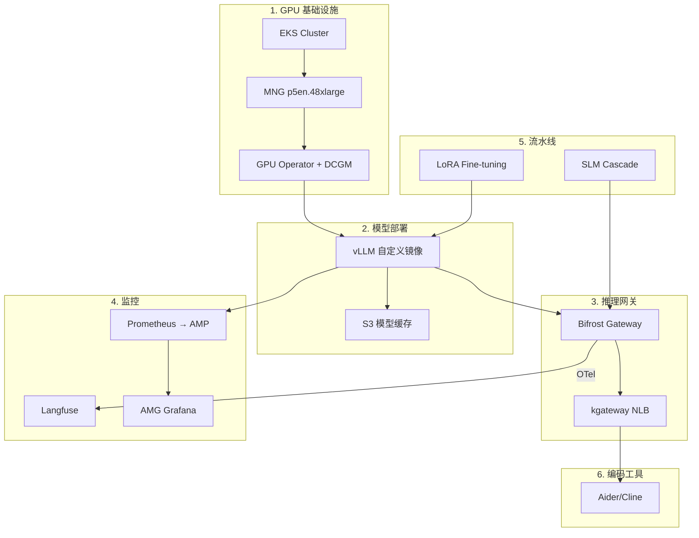
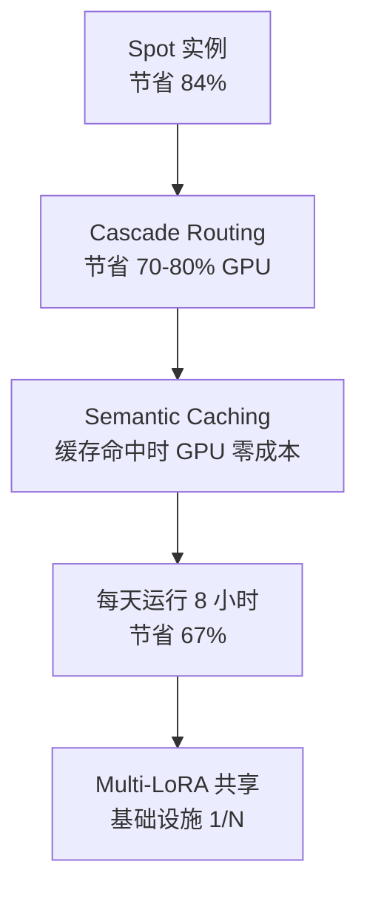

import DocCardList from '@theme/DocCardList';

# Reference Architecture

本节提供 Agentic AI Platform 的**实战部署与配置指南**。概念和设计原则请参阅[文档章节](../design-architecture/agentic-platform-architecture.md)，此处聚焦于实际集群部署和运维所需的具体配置、YAML 清单和验证流程。

:::info Documentation vs Reference Architecture
| 区分 | Documentation | Reference Architecture |
|------|--------------|----------------------|
| **重点** | 架构概念、设计原则、技术对比 | 实战部署流程、清单、验证 |
| **读者** | 决策者、架构师 | 平台工程师、DevOps |
| **产出物** | 架构文档、决策记录 | 可部署的 YAML、脚本、检查清单 |
| **更新频率** | 设计变更时 | 部署/运维经验积累时 |
:::

## 平台架构

Agentic AI Platform 的完整架构，包括基于 Ontology 的 Knowledge Feature Store、6 层结构、模型服务/微调管道。

<iframe
  src="https://viewer.diagrams.net/?highlight=0000ff&nav=1&title=Agentic%20AI%20Platform&url=https%3A%2F%2Fraw.githubusercontent.com%2Fdevfloor9%2Fengineering-playbook%2Fmain%2Fstatic%2FAgentic%2520AI%2520Platform(with%2520Ontology%2520and%2520fine%2520tunning%2520feature).drawio"
  style={{width: '100%', height: '1200px', border: 'none', borderRadius: '12px', background: '#fff'}}
  title="Agentic AI Platform Architecture"
  loading="lazy"
/>

:::tip 在 draw.io 中编辑
[在 draw.io 中打开](https://app.diagrams.net/?src=about#Hdevfloor9%2Fengineering-playbook%2Fmain%2Fstatic%2FAgentic%20AI%20Platform(with%20Ontology%20and%20fine%20tunning%20feature).drawio) — 通过 GitHub 集成直接编辑。
:::

---

## 整体架构概览

下图展示了 Reference Architecture 的 6 个领域及部署顺序。

## 部署顺序

Reference Architecture 按以下顺序配置。每个阶段依赖前一阶段的产出，因此**必须按顺序执行**。

### Phase 1：GPU 基础设施配置

配置 EKS 集群和 GPU 节点组。包含 Auto Mode 与 Standard Mode 的差异、GPU Operator 安装注意事项。

| 项目 | 详情 |
|------|------|
| EKS 版本 | 1.32+（推荐 1.33）|
| 节点组 | MNG p5en.48xlarge（Spot）|
| GPU Operator | `devicePlugin.enabled=false`（防止 Auto Mode 冲突）|
| 监控代理 | DCGM Exporter、GFD、Node Status Exporter |

### Phase 2：模型部署

使用 vLLM 服务大型开源模型。涵盖自定义镜像构建、S3 模型缓存、多节点部署注意事项。

| 项目 | 详情 |
|------|------|
| 服务引擎 | vLLM（自定义镜像）|
| 模型缓存 | S3 → s5cmd → NVMe emptyDir |
| 并行化 | Tensor Parallelism（推荐单节点）|
| 验证 | OpenAI 兼容 API 端点 |

### Phase 3：推理网关

配置基于 kgateway + Bifrost/LiteLLM 的 2-Tier 推理网关。包含基于复杂度的 Cascade Routing、Semantic Caching、Guardrails。

| 项目 | 详情 |
|------|------|
| L1 网关 | kgateway（Gateway API、mTLS、rate limiting）|
| L2-A 网关 | Bifrost（CEL Rules 条件路由、failover）或 LiteLLM（原生 complexity-based routing）|
| 负载均衡器 | NLB（TCP/TLS）|
| 路由策略 | 基于复杂度的 Cascade（SLM → LLM）、Hybrid Routing、Fallback |

### Phase 4：监控与可观测性

配置基于 Prometheus + AMP + AMG + Langfuse 的监控栈。

| 项目 | 详情 |
|------|------|
| 指标采集 | Prometheus → AMP（Pod Identity 认证）|
| 仪表板 | AMG Grafana（SigV4 `ec2_iam_role`）|
| LLM 可观测性 | Langfuse（OTel traces、成本追踪）|
| GPU 指标 | DCGM Exporter（GPU 利用率、VRAM、温度）|

### Phase 5：流水线

配置 LoRA Fine-tuning 和 Cascade Routing 流水线。

| 项目 | 详情 |
|------|------|
| Fine-tuning | LoRA 适配器训练 → S3 存储 → vLLM 热加载 |
| Cascade Routing | SLM（8B）→ LLM（744B）成本优化 |
| 评估 | Ragas + 自定义基准测试 |

### Phase 6：编码工具对接

将 Aider、Cline 等 AI 编码工具连接到自托管模型。

| 项目 | 详情 |
|------|------|
| 编码工具 | Aider、Cline、Continue.dev |
| 协议 | OpenAI 兼容 API |
| 连接路径 | 编码工具 → NLB → kgateway → Bifrost/LiteLLM → vLLM |
| 监控 | Bifrost/LiteLLM OTel → Langfuse（按请求追踪）|

## 文档列表

<DocCardList />

## 核心设计原则

Reference Architecture 遵循以下原则。

### 1. 单节点优先（Single-Node First）

多节点分布式部署会显著增加复杂度和故障可能性。选择 VRAM 充足的实例（p5en、p6），**优先在单节点上仅用 Tensor Parallelism 进行服务**。

### 2. 利用 Spot 实例

GPU Spot 实例比 On-Demand 便宜 80-85%。推理工作负载是无状态的，Spot 回收时可立即在新实例上重启。模型权重从 S3 快速恢复。

### 3. 标准工具链

尽可能使用 CNCF 和 Kubernetes 生态的标准工具。

| 领域 | 标准工具 | 替代方案 |
|------|----------|------|
| GPU 调度 | Karpenter / MNG | Auto Mode NodePool |
| 模型服务 | vLLM | SGLang、llm-d |
| AI 网关 | Bifrost / LiteLLM | OpenClaw、Helicone |
| 指标 | Prometheus + AMP | CloudWatch |
| LLM 可观测性 | Langfuse | Helicone、LangSmith |
| 分布式训练 | LeaderWorkerSet（LWS）| KubeRay |

### 4. 分层成本优化

成本优化采用**分层方法**而非单一技术。

## 前置条件

部署 Reference Architecture 的前置条件。

### AWS 账户与权限

- EKS 集群创建权限（IAM、VPC、EC2、EKS）
- GPU 实例 Spot 配额（p5en.48xlarge：vCPU 192 个以上）
- S3 存储桶创建权限
- AMP/AMG 创建权限（监控配置时）
- ECR 注册表创建权限（自定义镜像构建时）

### 工具

| 工具 | 最低版本 | 用途 |
|------|----------|------|
| `eksctl` | 0.200+ | EKS 集群管理 |
| `kubectl` | 1.32+ | Kubernetes 资源管理 |
| `helm` | 3.16+ | Chart 部署 |
| `aws` CLI | 2.22+ | AWS 资源管理 |
| `docker` | 27+ | 自定义镜像构建 |
| `s5cmd` | 2.2+ | 高速 S3 同步 |

### 网络

- 公有子网：NLB 部署用（编码工具外部访问时）
- 私有子网：GPU 节点、vLLM、Bifrost 部署用
- NAT Gateway：S3、ECR、HuggingFace Hub 访问用
- VPC 端点（推荐）：S3、ECR、AMP

## 下一步

关于概念和架构设计，请参阅以下文档：

- [Agentic AI Platform 架构](../design-architecture/agentic-platform-architecture.md) — 整体设计原则与组件结构
- [GPU 资源管理](../model-serving/gpu-resource-management.md) — Karpenter、KEDA、DRA 基于 GPU 的自动伸缩
- [vLLM 模型服务](../model-serving/vllm-model-serving.md) — vLLM 架构与优化技术
- [Inference Gateway 路由](../design-architecture/inference-gateway-routing.md) — kgateway + AI 网关设计

---

:::tip 反馈
本 Reference Architecture 基于实战部署经验持续更新。如有改进建议或额外案例，请提交 Issue。
:::
