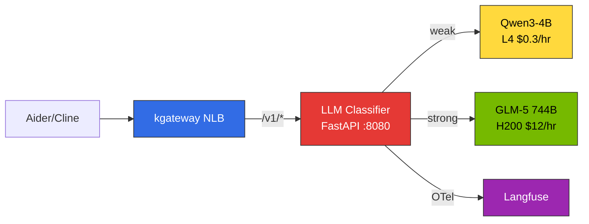
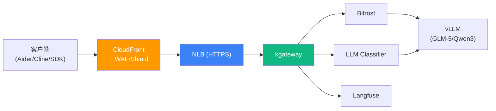
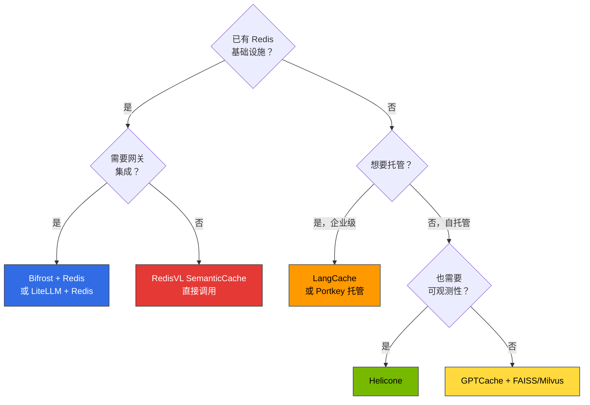

# 高级功能

本文档涵盖生产环境的高级配置。添加基于提示词的自动路由（LLM Classifier）、安全层（CloudFront + WAF/Shield）、成本优化（Semantic Caching），完成完整的推理管道。

:::tip 所需时间
**学习**：45分钟 | **部署**：60-90分钟
:::

:::info 前提条件
本文档的组件以完成 [基础部署](./basic-deployment.md) 的环境为前提。请先确认 kgateway、HTTPRoute、Bifrost 正常运行。
:::

---

## 1. LLM Classifier 部署 {#llm-classifier-部署}

### 1.1 架构概览

LLM Classifier 是在 kgateway 后运行的 **Python FastAPI 基础轻量路由器**。接收客户端（Aider、Cline 等）的 OpenAI 兼容请求，分析提示词内容，自动代理到 weak（SLM）或 strong（LLM）后端。



**核心特性：**
- 客户端使用 `model: "auto"`（或任意模型名）请求 — 无需感知模型选择
- 基于关键词匹配 + 令牌长度 + 对话轮数的分类
- 使用 Langfuse OTel SDK 直接发送 trace
- 容器镜像小于 50MB（FastAPI + httpx）

### 1.2 分类逻辑（extproc_http.py）

```python
"""LLM Classifier — 基于提示词的自动模型路由"""
import os, httpx
from fastapi import FastAPI, Request
from fastapi.responses import StreamingResponse

app = FastAPI()

# --- 分类配置 ---
STRONG_KEYWORDS = [
    "重构", "架构", "设计", "分析", "优化", "调试", "迁移",
    "refactor", "architect", "design", "analyze", "optimize", "debug",
    "migration", "complex", "performance", "security", "review",
]
TOKEN_THRESHOLD = 500
TURN_THRESHOLD = 5

# --- 后端配置 ---
WEAK_URL = os.getenv("WEAK_BACKEND", "http://qwen3-serving:8000")
STRONG_URL = os.getenv("STRONG_BACKEND", "http://glm5-serving:8000")

def classify(messages: list[dict]) -> str:
    """分析提示词内容 → weak / strong 决策"""
    content = " ".join(
        m.get("content", "") for m in messages if m.get("content")
    )
    lower = content.lower()
    # 1. 关键词匹配
    if any(kw in lower for kw in STRONG_KEYWORDS):
        return "strong"
    # 2. 输入长度
    if len(content) > TOKEN_THRESHOLD:
        return "strong"
    # 3. 对话轮数
    if len(messages) > TURN_THRESHOLD:
        return "strong"
    return "weak"

@app.api_route("/v1/{path:path}", methods=["POST"])
async def proxy(path: str, request: Request):
    body = await request.json()
    messages = body.get("messages", [])
    tier = classify(messages)
    backend = STRONG_URL if tier == "strong" else WEAK_URL
    target = f"{backend}/v1/{path}"

    async with httpx.AsyncClient(timeout=300) as client:
        if body.get("stream"):
            req = client.build_request("POST", target, json=body)
            resp = await client.send(req, stream=True)
            return StreamingResponse(
                resp.aiter_bytes(),
                status_code=resp.status_code,
                headers=dict(resp.headers),
            )
        resp = await client.post(target, json=body)
        return resp.json()
```

:::tip Langfuse OTel 集成
在以上代码中添加 OpenTelemetry SDK 可将分类决策 + 后端响应时间直接记录到 Langfuse。安装 `opentelemetry-sdk`、`opentelemetry-exporter-otlp` 包，并将 `OTEL_EXPORTER_OTLP_ENDPOINT` 设置为 Langfuse OTLP 端点。
:::

### 1.3 Dockerfile

```dockerfile
FROM python:3.11-slim
RUN pip install --no-cache-dir fastapi uvicorn httpx
COPY extproc_http.py /app/
WORKDIR /app
CMD ["uvicorn", "extproc_http:app", "--host", "0.0.0.0", "--port", "8080", "--workers", "2"]
```

```bash
# 构建并推送到 ECR
docker buildx build --platform linux/amd64 \
  -t <ACCOUNT_ID>.dkr.ecr.us-east-2.amazonaws.com/llm-classifier:latest \
  --push .
```

### 1.4 K8s Deployment + Service

```yaml
apiVersion: apps/v1
kind: Deployment
metadata:
  name: llm-classifier
  namespace: ai-inference
spec:
  replicas: 2
  selector:
    matchLabels:
      app: llm-classifier
  template:
    metadata:
      labels:
        app: llm-classifier
    spec:
      containers:
      - name: classifier
        image: <ACCOUNT_ID>.dkr.ecr.us-east-2.amazonaws.com/llm-classifier:latest
        ports:
        - containerPort: 8080
          name: http
        env:
        - name: WEAK_BACKEND
          value: "http://qwen3-serving.ai-inference.svc.cluster.local:8000"
        - name: STRONG_BACKEND
          value: "http://glm5-serving.ai-inference.svc.cluster.local:8000"
        resources:
          requests:
            cpu: 250m
            memory: 256Mi
          limits:
            cpu: 500m
            memory: 512Mi
        readinessProbe:
          httpGet:
            path: /docs
            port: 8080
          initialDelaySeconds: 5
          periodSeconds: 10
        livenessProbe:
          httpGet:
            path: /docs
            port: 8080
          initialDelaySeconds: 10
          periodSeconds: 30
---
apiVersion: v1
kind: Service
metadata:
  name: llm-classifier
  namespace: ai-inference
spec:
  selector:
    app: llm-classifier
  ports:
  - name: http
    port: 8080
    targetPort: 8080
  type: ClusterIP
```

### 1.5 kgateway HTTPRoute 配置

kgateway 将 `/v1/*` 路径路由到 LLM Classifier。替代基础部署的 vLLM 直接路由或 Bifrost 经由路由。

```yaml
apiVersion: gateway.networking.k8s.io/v1
kind: HTTPRoute
metadata:
  name: llm-classifier-route
  namespace: ai-inference
spec:
  parentRefs:
    - name: unified-gateway
      namespace: ai-gateway
  rules:
    - matches:
        - path:
            type: PathPrefix
            value: /v1/
      backendRefs:
        - name: llm-classifier
          port: 8080
      timeouts:
        request: 300s
        backendRequest: 300s
```

:::caution 超时设置
LLM 推理可能需要数十秒。将 `timeouts.request` 和 `backendRequest` 设置得足够长（GLM-5 744B 基准最少 120s，推荐 300s）。
:::

### 1.6 Aider/Cline 连接

使用 LLM Classifier 时**所有客户端连接到单一端点**。模型名可以是任意值（Classifier 忽略并基于提示词分类）。

#### Aider

```bash
# LLM Classifier 自动分支 — 无需 double-prefix
OPENAI_API_BASE="http://<NLB_ENDPOINT>/v1" \
OPENAI_API_KEY="dummy" \
aider --model openai/auto
```

#### Cline

Settings -> API Provider -> OpenAI Compatible
- Base URL：`http://<NLB_ENDPOINT>/v1`
- Model：`auto`
- API Key：`dummy`

#### Python 客户端

```python
from openai import OpenAI

client = OpenAI(
    base_url="http://<NLB_ENDPOINT>/v1",
    api_key="dummy"
)

# 简单请求 → Qwen3-4B（自动）
response = client.chat.completions.create(
    model="auto",
    messages=[{"role": "user", "content": "Hello"}]
)

# 复杂请求 → GLM-5 744B（自动）
response = client.chat.completions.create(
    model="auto",
    messages=[{"role": "user", "content": "请重构这段代码并分析架构"}]
)
```

:::info 相比 Bifrost 的优势
经由 Bifrost 时需要的 `provider/model` 格式（`openai/glm-5`）和 Aider double-prefix 技巧（`openai/openai/glm-5`）**完全不需要**。所有客户端使用相同的 `model: "auto"` 连接即可。
:::

### 1.7 路由端点结构（包含 LLM Classifier）

```
http://<NLB_ENDPOINT>/v1/*           → LLM Classifier → Qwen3-4B 或 GLM-5（自动分支）
http://<NLB_ENDPOINT>/langfuse/*     → Langfuse（Observability UI）
http://<NLB_ENDPOINT>/_next/*        → Langfuse（静态资源）
http://<NLB_ENDPOINT>/api/public/*   → Langfuse（API + OTel）
https://<AMG_ENDPOINT>               → Grafana（独立托管）
```

---

## 2. CloudFront + WAF/Shield 安全层 {#cloudfront-waf}

生产环境中不直接暴露 NLB，在前端配置 **CloudFront + WAF/Shield** 执行 DDoS 防御、请求过滤、TLS 终止。

### 架构



### 2.1 NLB TLS 监听器配置

将现有 HTTP Gateway 转换为 HTTPS。需要 ACM 证书。

```bash
# 1. 请求 ACM 证书（NLB 区域 — us-east-2）
aws acm request-certificate \
  --domain-name "api.your-company.com" \
  --validation-method DNS \
  --region us-east-2

# 2. DNS 验证完成后确认 ARN
export NLB_CERT_ARN=$(aws acm list-certificates --region us-east-2 \
  --query "CertificateSummaryList[?DomainName=='api.your-company.com'].CertificateArn" \
  --output text)
```

将 Gateway 资源更新为 HTTPS：

```yaml
apiVersion: gateway.networking.k8s.io/v1
kind: Gateway
metadata:
  name: unified-gateway
  namespace: ai-gateway
  annotations:
    service.beta.kubernetes.io/aws-load-balancer-type: "external"
    service.beta.kubernetes.io/aws-load-balancer-nlb-target-type: "ip"
    service.beta.kubernetes.io/aws-load-balancer-scheme: "internet-facing"
    # TLS 终止
    service.beta.kubernetes.io/aws-load-balancer-ssl-cert: "${NLB_CERT_ARN}"
    service.beta.kubernetes.io/aws-load-balancer-ssl-ports: "443"
    # SG 限制：仅允许 CloudFront IP 段
    service.beta.kubernetes.io/aws-load-balancer-security-groups: "${CF_RESTRICTED_SG_ID}"
spec:
  gatewayClassName: kgateway
  listeners:
    - name: https
      protocol: HTTPS
      port: 443
      tls:
        mode: Terminate
        certificateRefs:
          - name: nlb-tls-cert
      allowedRoutes:
        namespaces:
          from: All
```

:::warning NLB Security Group 限制
NLB 的 Security Group 应**仅允许 CloudFront Managed Prefix List**。`0.0.0.0/0` 开放将被公司策略自动阻止。

```bash
# 确认 CloudFront Managed Prefix List
aws ec2 describe-managed-prefix-lists \
  --filters "Name=prefix-list-name,Values=com.amazonaws.global.cloudfront.origin-facing" \
  --query "PrefixLists[0].PrefixListId" --output text

# SG 中仅允许 CloudFront prefix list
aws ec2 authorize-security-group-ingress \
  --group-id ${CF_RESTRICTED_SG_ID} \
  --ip-permissions "IpProtocol=tcp,FromPort=443,ToPort=443,PrefixListIds=[{PrefixListId=${CF_PREFIX_LIST_ID}}]"
```
:::

### 2.2 WAF WebACL 创建

```bash
# 创建 WAF WebACL（CloudFront 用必须在 us-east-1）
aws wafv2 create-web-acl \
  --name "inference-gateway-waf" \
  --scope CLOUDFRONT \
  --region us-east-1 \
  --default-action '{"Allow":{}}' \
  --rules '[
    {
      "Name": "AWSManagedRulesCommonRuleSet",
      "Priority": 1,
      "Statement": {
        "ManagedRuleGroupStatement": {
          "VendorName": "AWS",
          "Name": "AWSManagedRulesCommonRuleSet"
        }
      },
      "OverrideAction": {"None":{}},
      "VisibilityConfig": {
        "SampledRequestsEnabled": true,
        "CloudWatchMetricsEnabled": true,
        "MetricName": "CommonRuleSet"
      }
    },
    {
      "Name": "RateLimit",
      "Priority": 2,
      "Statement": {
        "RateBasedStatement": {
          "Limit": 2000,
          "AggregateKeyType": "IP"
        }
      },
      "Action": {"Block":{}},
      "VisibilityConfig": {
        "SampledRequestsEnabled": true,
        "CloudWatchMetricsEnabled": true,
        "MetricName": "RateLimit"
      }
    },
    {
      "Name": "AWSManagedRulesKnownBadInputsRuleSet",
      "Priority": 3,
      "Statement": {
        "ManagedRuleGroupStatement": {
          "VendorName": "AWS",
          "Name": "AWSManagedRulesKnownBadInputsRuleSet"
        }
      },
      "OverrideAction": {"None":{}},
      "VisibilityConfig": {
        "SampledRequestsEnabled": true,
        "CloudWatchMetricsEnabled": true,
        "MetricName": "KnownBadInputs"
      }
    }
  ]' \
  --visibility-config '{
    "SampledRequestsEnabled": true,
    "CloudWatchMetricsEnabled": true,
    "MetricName": "InferenceGatewayWAF"
  }'
```

WAF 规则配置：

| 规则 | 用途 | 配置 |
|------|------|------|
| **AWSManagedRulesCommonRuleSet** | SQL Injection、XSS、常规攻击防御 | AWS 托管 |
| **RateLimit** | 每 IP 请求限制 | 2,000 req/5min（可调整）|
| **KnownBadInputsRuleSet** | Log4j、已知恶意模式阻止 | AWS 托管 |

### 2.3 CloudFront 分发创建

```bash
# 确认 NLB DNS 名称
export NLB_DNS=$(kubectl get gateway unified-gateway -n ai-gateway \
  -o jsonpath='{.status.addresses[0].value}')

# 创建 CloudFront 分发
aws cloudfront create-distribution \
  --distribution-config "{
    \"CallerReference\": \"inference-gateway-$(date +%s)\",
    \"Origins\": {
      \"Quantity\": 1,
      \"Items\": [{
        \"Id\": \"nlb-origin\",
        \"DomainName\": \"${NLB_DNS}\",
        \"CustomOriginConfig\": {
          \"HTTPPort\": 80,
          \"HTTPSPort\": 443,
          \"OriginProtocolPolicy\": \"https-only\",
          \"OriginSslProtocols\": {\"Quantity\": 1, \"Items\": [\"TLSv1.2\"]}
        }
      }]
    },
    \"DefaultCacheBehavior\": {
      \"TargetOriginId\": \"nlb-origin\",
      \"ViewerProtocolPolicy\": \"https-only\",
      \"AllowedMethods\": {
        \"Quantity\": 7,
        \"Items\": [\"GET\",\"HEAD\",\"OPTIONS\",\"PUT\",\"POST\",\"PATCH\",\"DELETE\"],
        \"CachedMethods\": {\"Quantity\": 2, \"Items\": [\"GET\",\"HEAD\"]}
      },
      \"CachePolicyId\": \"4135ea2d-6df8-44a3-9df3-4b5a84be39ad\",
      \"OriginRequestPolicyId\": \"216adef6-5c7f-47e4-b989-5492eafa07d3\",
      \"Compress\": true,
      \"ForwardedValues\": {
        \"QueryString\": true,
        \"Cookies\": {\"Forward\": \"none\"},
        \"Headers\": {
          \"Quantity\": 3,
          \"Items\": [\"Authorization\", \"Content-Type\", \"X-Api-Key\"]
        }
      }
    },
    \"Enabled\": true,
    \"WebACLId\": \"${WAF_ACL_ARN}\",
    \"Comment\": \"Inference Gateway - kgateway + Bifrost\",
    \"PriceClass\": \"PriceClass_200\",
    \"ViewerCertificate\": {
      \"CloudFrontDefaultCertificate\": true
    }
  }"
```

:::tip 缓存策略
LLM 推理 API（`/v1/chat/completions`）是 **POST 请求**，因此不会被 CloudFront 缓存。使用 `CachingDisabled` 策略（`4135ea2d-...`），用 `AllOriginRequestPolicy`（`216adef6-...`）将所有头传递到 Origin。仅 Langfuse 静态资源（`/_next/*`）受益于缓存。
:::

### 2.4 Shield Standard

CloudFront 分发**自动应用 AWS Shield Standard**（无额外费用）。包含 L3/L4 DDoS 防御。

对于大规模服务考虑升级 Shield Advanced（$3,000/月）：
- L7 DDoS 防御
- AWS DDoS Response Team (DRT) 支持
- WAF 费用豁免
- 成本保护（DDoS 导致的扩展费用退款）

### 2.5 客户端端点变更

部署完成后通过 CloudFront 域名访问：

```bash
# 确认 CloudFront 域名
export CF_DOMAIN=$(aws cloudfront list-distributions \
  --query "DistributionList.Items[?Comment=='Inference Gateway - kgateway + Bifrost'].DomainName" \
  --output text)

echo "Endpoint: https://${CF_DOMAIN}/v1"
```

**IDE/客户端配置变更**：

```bash
# Aider
OPENAI_API_BASE="https://${CF_DOMAIN}/v1" \
OPENAI_API_KEY="dummy" \
aider --model openai/auto

# Python SDK
from openai import OpenAI
client = OpenAI(
    base_url=f"https://{CF_DOMAIN}/v1",
    api_key="dummy"
)
```

### 2.6 验证

```bash
# 1. 确认 CloudFront → NLB → kgateway 路径
curl -s https://${CF_DOMAIN}/v1/models | jq .

# 2. 确认 WAF 运行（阻止 SQL Injection 模式）
curl -s -o /dev/null -w "%{http_code}" \
  "https://${CF_DOMAIN}/v1/models?id=1%20OR%201=1"
# 预期：403（WAF 阻止）

# 3. 确认 Rate Limit（超过 2000 req/5min）
for i in $(seq 1 100); do
  curl -s -o /dev/null -w "%{http_code}\n" \
    https://${CF_DOMAIN}/v1/models &
done

# 4. 确认阻止 NLB 直接访问（SG 仅允许 CF prefix）
curl -s -o /dev/null -w "%{http_code}" \
  "https://${NLB_DNS}/v1/models"
# 预期：timeout（无法直接访问）
```

### 2.7 连接路径总结

```
变更前：客户端 → NLB（HTTP，公开）→ kgateway → Bifrost → vLLM
变更后：客户端 → CloudFront（HTTPS，WAF/Shield）→ NLB（HTTPS，仅允许 CF）→ kgateway → Bifrost → vLLM
```

| 区间 | 协议 | 安全 |
|------|---------|------|
| 客户端 → CloudFront | HTTPS（TLS 1.2+）| WAF 规则 + Shield Standard + Rate Limit |
| CloudFront → NLB | HTTPS（TLS 1.2）| SG：仅允许 CloudFront Prefix List |
| NLB → kgateway | HTTP（集群内部）| VPC 内部通信、NetworkPolicy |
| kgateway → Bifrost/vLLM | HTTP（集群内部）| Service 间通信 |

---

## 3. Semantic Caching 实现选项（高级）{#semantic-caching-实现选项-advanced}

:::info 概念及设计原则
Semantic Caching 的概念、相似度阈值设计、缓存键结构、可观测性策略参阅 [Semantic Caching 策略](../../model-serving/inference-frameworks/semantic-caching-strategy.md)。本节涵盖实际实现的工具比较和部署配置。
:::

### 3.1 实现工具比较（2026-04 基准）

基于官方文档和仓库整理的主要选项。功能快速变化，部署时请重新确认官方文档。

| 工具 | 许可证 | 后端 | 主要优势 | 限制 | 官方资料 |
|------|----------|--------|---------|------|----------|
| **GPTCache** | OSS（MIT）| Redis / Milvus / FAISS / SQLite | 多样后端、适配器丰富、从早期就专注 Semantic Cache | 2024 后发布频率降低，相比 LangChain/LiteLLM 社区驱动 | [GitHub](https://github.com/zilliztech/GPTCache) |
| **Redis Semantic Cache (RedisVL)** | OSS（MIT）| Redis Stack / Redis 8+ | 复用现有 Redis 基础设施、原生提供 `SemanticCache` 类、内置向量搜索 | 嵌入管道和 TTL 策略由应用程序直接配置 | [RedisVL — Semantic Cache](https://redis.io/docs/latest/develop/ai/redisvl/user_guide/semantic_caching/) |
| **Portkey** | SaaS + Self-host（OSS Gateway，Apache 2.0）| 内置存储 / Redis | 网关一体化（路由/护栏/缓存集成）、Virtual Keys 多租户 | 高级功能依赖托管计划、自托管配置复杂 | [Portkey Semantic Cache](https://docs.portkey.ai/docs/product/ai-gateway/cache-simple-and-semantic) |
| **Helicone** | OSS（Apache 2.0）/ SaaS | ClickHouse（可观测性）+ Redis/S3（缓存）| 可观测性·日志与缓存集成、Rust 网关低延迟 | 自托管全栈依赖多、缓存基础是 exact-match（Semantic 是高级功能）| [Helicone Caching](https://docs.helicone.ai/features/advanced-usage/caching) |
| **Bifrost + Redis** | OSS（Apache 2.0）+ OSS Redis | Redis | Go 基础低延迟、CEL Rules 缓存键自定义、复用现有 Bifrost 部署 | Semantic Cache 本身需插件/sidecar 直接配置 | [Bifrost 文档](https://www.getmaxim.ai/bifrost/docs) |
| **LangCache (Redis Labs)** | 托管 SaaS（Redis Enterprise）| Redis Enterprise | 完全托管、包含嵌入模型·治理（2025 下半年 GA）| 仅限 Enterprise、区域限制、费用 | [Redis LangCache](https://redis.io/langcache/) |

### 3.2 工具选择决策树



### 3.3 场景别推荐

| 场景 | 推荐组合 | 理由 |
|----------|----------|------|
| **现有 EKS + Redis 运营** | Bifrost + Redis + RedisVL | 无需引入新供应商，复用现有基础设施 |
| **托管 + 合规** | Portkey 托管或 LangCache | SOC2/HIPAA 等认证、运营负担最小 |
| **可观测性优先** | Helicone | 缓存·路由·日志在单一产品中 |
| **初期 PoC / 原型** | LiteLLM + Redis（`cache: true`）| 配置 1-2 行启用、快速验证 |
| **开源强约束** | GPTCache + Milvus | 无供应商锁定、后端选择自由 |

### 3.4 Gateway 别集成模式

#### LiteLLM

基础启用（exact-match）：

```yaml
# litellm_config.yaml
litellm_settings:
  cache: true
  cache_params:
    type: "redis"
    host: "redis-service.default.svc.cluster.local"
    port: 6379
```

启用 Semantic Cache：

```yaml
litellm_settings:
  cache: true
  cache_params:
    type: "redis-semantic-cache"
    host: "redis-service.default.svc.cluster.local"
    port: 6379
    similarity_threshold: 0.85
    embedding_model: "text-embedding-3-small"
```

详细选项参阅 [LiteLLM Caching 文档](https://docs.litellm.ai/docs/proxy/caching)。

#### Bifrost + RedisVL Sidecar

Bifrost 本身仅支持 exact-match 缓存，因此 Semantic Cache 通过以下两种方法实现。

**方法 A：Python 代理前端** — 在 Bifrost 前部署使用 RedisVL `SemanticCache` 类的轻量 FastAPI 代理

```python
from redisvl.extensions.session_manager import SemanticCache
from fastapi import FastAPI, Request
import httpx

app = FastAPI()

cache = SemanticCache(
    name="llm_cache",
    redis_url="redis://redis-service:6379",
    distance_threshold=0.15,  # 1 - similarity（0.85 similarity = 0.15 distance）
)

@app.post("/v1/{path:path}")
async def proxy(path: str, request: Request):
    body = await request.json()
    query = body["messages"][-1]["content"]
    
    # Semantic Cache 查询
    cached = cache.check(prompt=query)
    if cached:
        return {"choices": [{"message": {"content": cached[0]["response"]}}]}
    
    # MISS → Bifrost 调用
    async with httpx.AsyncClient() as client:
        resp = await client.post(f"http://bifrost:8080/v1/{path}", json=body)
        result = resp.json()
    
    # 保存响应
    cache.store(prompt=query, response=result["choices"][0]["message"]["content"])
    return result
```

**方法 B：CEL Rules 基于头的分支** — 通过 Bifrost CEL Rules 仅将带 `x-cache-enabled: true` 头的请求经由 Redis

```json
{
  "plugins": [
    {
      "enabled": true,
      "name": "cel_rules",
      "config": {
        "rules": [
          {
            "condition": "request.header['x-cache-enabled'] == 'true'",
            "action": "route",
            "target": "redis-semantic-proxy"
          }
        ]
      }
    }
  ]
}
```

#### Portkey

Portkey 是网关一体化，内置支持缓存。

```typescript
import Portkey from "portkey-ai";

const portkey = new Portkey({
  apiKey: "YOUR_PORTKEY_API_KEY",
  config: {
    cache: {
      mode: "semantic",
      max_age: 3600,  // TTL 1小时
    },
    strategy: {
      mode: "fallback",
      targets: [
        { provider: "openai", model: "gpt-4o" },
        { provider: "anthropic", model: "claude-sonnet-4" },
      ],
    },
  },
});

const response = await portkey.chat.completions.create({
  messages: [{ role: "user", content: "Hello" }],
  model: "gpt-4o",
});
```

结合 Virtual Keys 也可实现按租户分离缓存策略。详情参阅 [Portkey Semantic Cache 文档](https://docs.portkey.ai/docs/product/ai-gateway/cache-simple-and-semantic)。

#### Helicone

Helicone 通过请求头控制缓存。

```bash
curl https://oai.helicone.ai/v1/chat/completions \
  -H "Authorization: Bearer YOUR_OPENAI_KEY" \
  -H "Helicone-Auth: Bearer YOUR_HELICONE_KEY" \
  -H "Helicone-Cache-Enabled: true" \
  -H "Helicone-Cache-Seed: prod-v1" \
  -d '{
    "model": "gpt-4o",
    "messages": [{"role": "user", "content": "Hello"}]
  }'
```

Semantic 模式是高级功能，参阅 [Helicone Caching 文档](https://docs.helicone.ai/features/advanced-usage/caching)。

### 3.5 缓存键设计示例（YAML）

实际实现中生成缓存键的伪代码示例。

```yaml
# 缓存键生成逻辑（伪代码）
cache_key_components:
  model_id: "glm-5"                      # 模型种类
  system_prompt_hash: "a3f2e1b"          # 系统提示词 SHA256（8字符）
  tenant_id: "org-12345"                 # 组织/租户
  language: "ko"                         # 语言
  tool_set_hash: "c9d8e7f"               # 代理工具集哈希
  embedding: [0.12, -0.34, ...]         # 用户查询嵌入（向量 DB 存储）

# Redis key 格式
redis_key: "cache:org-12345:ko:glm-5:a3f2e1b:c9d8e7f"
# 向量 DB 中 embedding 相似度搜索 → 超过阈值 HIT 时用 redis_key 查询响应
```

### 3.6 部署前检查事项

- [ ] 阈值初始值 0.90 设置（保守起步）
- [ ] TTL 策略文档化（按域差异化应用）
- [ ] Guardrails（PII redaction）部署在缓存**前**确认
- [ ] Langfuse trace 添加 `cache_hit`、`similarity_score` 标签
- [ ] Redis 故障时 fail-open 场景验证
- [ ] 通过 A/B 测试渐进式推出（流量 10% → 50% → 100%）

---

## 下一步

高级功能配置已完成。进行以下步骤：

1. **故障排除**：部署中发生错误时参考 [故障排除指南](./troubleshooting-guide.md)。
2. **监控强化**：参考 [Langfuse 部署指南](../monitoring-observability-setup.md) 完成 OTel 集成和仪表板。
3. **运营流程**：参考 [Agent 监控](../../operations-mlops/agent-monitoring.md) 建立生产运营体系。

---

## 参考资料

- [Semantic Caching 策略](../../model-serving/inference-frameworks/semantic-caching-strategy.md) - 概念、阈值设计、可观测性、按域模式
- [推理网关路由](../inference-gateway-routing.md) - kgateway 架构及路由策略
- [Langfuse 部署指南](../monitoring-observability-setup.md) - Helm 安装、OTel 集成、Redis/ClickHouse 配置
- [Agent 监控](../../operations-mlops/agent-monitoring.md) - Langfuse 架构及组件
