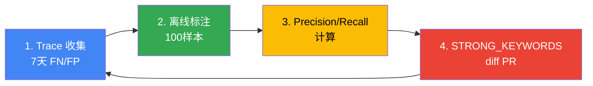

# Cascade Routing 实战调优

> 编写日期：2026-04-18 | 阅读时间：约 20 分钟

本文档是在生产环境中**调优 Inference Gateway 的 Cascade Routing** 的实战指南。架构概念和基本实现请先参考[网关路由策略](./inference-gateway-routing.md)。

:::info 目标读者
本文档面向平台运维人员和 MLOps 工程师。假设已部署基于 LLM Classifier 或 LiteLLM 的 Cascade Routing，并希望基于实际生产流量优化准确性和成本。
:::

---

## 1. 调优目标与 SLO 定义

Cascade Routing 调优必须同时实现**成本节约**和**质量维持**。如果没有明确的 SLO，过度优化可能导致用户体验下降。

### SLO 示例（GLM-5 + Qwen3-4B 环境）

| 指标 | 目标值 | 测量方法 | 备注 |
|------|--------|----------|------|
| **TTFT P95** | < 3秒 | Langfuse trace `time_to_first_token` | Qwen3-4B 基准，GLM-5 为 < 10秒 |
| **Cost per 1k Requests** | < $5.00 | 每日总成本 / 请求数 × 1000 | 当前 $8.20，目标节约 38% |
| **Misroute Rate** | ≤ 5% | (FN + FP) / 总请求 | FN：需要 strong 但使用了 weak；FP：使用了 strong 但 weak 足够 |
| **SLM 使用率** | 60-70% | weak 路由 / 总请求 | 太低则成本节约不足，太高则质量下降 |
| **用户满意度** | ≥ 4.0/5.0 | Langfuse 反馈分数平均 | thumb-down < 10% |

### 测量周期

- **实时监控**：TTFT P95、Cost per Request（Grafana 仪表板）
- **每日审查**：Misroute Rate、SLM 使用率（Langfuse 分析）
- **每周调优**：关键词添加/删除、阈值调整（基于离线标注）

### 成功指标计算示例

```python
# 基于 Langfuse trace 数据计算
def calculate_metrics(traces: list):
    total = len(traces)
    weak_count = sum(1 for t in traces if t.tags.get("tier") == "weak")
    misroute_count = sum(1 for t in traces if t.tags.get("misroute"))
    total_cost = sum(t.calculated_total_cost or 0 for t in traces)
    
    return {
        "slm_usage_rate": weak_count / total * 100,
        "misroute_rate": misroute_count / total * 100,
        "cost_per_1k": (total_cost / total) * 1000,
    }
```

:::warning SLO 权衡
SLM 使用率过高会降低质量，过低则成本节约效果不明显。**通过每周 A/B 测试找到最佳平衡点**。
:::

---

## 2. 分类阈值基准（v7 baseline）

### 经过生产验证的分类标准

在 GLM-5 744B（H200 × 8，$12/hr）和 Qwen3-4B（L4 × 1，$0.3/hr）环境中经过 2 周生产测试得出的基准。

#### STRONG_KEYWORDS（17个）

```python
STRONG_KEYWORDS = [
    # 中文（7个）
    "重构", "架构", "设计", "分析", "优化", "调试", "迁移",
    
    # 英文（10个）
    "refactor", "architect", "design", "analyze", "optimize", "debug",
    "migration", "complex", "performance", "security"
]
```

**关键词选择依据**：
- **重构/refactor**：需要理解整体代码结构 — Qwen3-4B 在 1,000 行以上代码库中会丢失上下文
- **架构/architect**：多文件依赖分析 — SLM 的浅层推理不足
- **分析/analyze**：根因追踪 — GLM-5 的链式思考必不可少
- **优化/optimize**：算法复杂度计算 — 数学推理能力差异
- **调试/debug**：堆栈跟踪回溯 — 需要长上下文
- **迁移/migration**：API 变更映射 — 需要深入理解框架
- **complex**：用户明确提及复杂度
- **performance**：性能分析、瓶颈识别 — 系统级理解
- **security**：CVE 分析、漏洞检测 — 安全领域知识

#### TOKEN_THRESHOLD（500字）

```python
TOKEN_THRESHOLD = 500  # 中文约 250-300 tokens
```

**依据**：
- **500字以下**：简单查询（代码片段说明、单个函数编写）— Qwen3-4B 足够
- **500字以上**：多轮对话累积、包含长代码块 — 需要 GLM-5
- 中英混合时，英文 token 密度高，建议添加 `len(content.encode('utf-8')) > 600` 条件

#### TURN_THRESHOLD（5轮）

```python
TURN_THRESHOLD = 5
```

**依据**：
- **5轮以下**：独立查询 — context window 负担小
- **5轮以上**：累积上下文复杂化，引用先前对话增多 — 利用 GLM-5 的长上下文处理能力

### v7 完整分类逻辑代码

```python
STRONG_KEYWORDS = [
    "重构", "架构", "设计", "分析", "优化", "调试", "迁移",
    "refactor", "architect", "design", "analyze", "optimize", "debug",
    "migration", "complex", "performance", "security"
]
TOKEN_THRESHOLD = 500
TURN_THRESHOLD = 5

def classify_v7(messages: list[dict]) -> str:
    """
    v7 分类标准（2周生产验证）
    - Misroute Rate: 4.2%
    - SLM 使用率: 68%
    - Cost per 1k: $5.80
    """
    content = " ".join(m.get("content", "") for m in messages if m.get("content"))
    lower = content.lower()
    
    # 1. 关键词匹配（最高优先级）
    if any(kw in lower for kw in STRONG_KEYWORDS):
        return "strong"
    
    # 2. 输入长度
    if len(content) > TOKEN_THRESHOLD:
        return "strong"
    
    # 3. 对话轮数
    if len(messages) > TURN_THRESHOLD:
        return "strong"
    
    return "weak"
```

### 推导过程摘要

| 版本 | STRONG_KEYWORDS 数量 | TOKEN_THRESHOLD | TURN_THRESHOLD | Misroute Rate | SLM 使用率 | 备注 |
|------|-------------------|----------------|----------------|---------------|-----------|------|
| v1 | 5个 | 1000 | 10 | 12.3% | 82% | SLM 过度使用，质量下降 |
| v3 | 10个 | 750 | 7 | 8.1% | 74% | 增加关键词提高准确性 |
| v5 | 15个 | 600 | 6 | 5.6% | 70% | 强化中文关键词 |
| **v7** | **17个** | **500** | **5** | **4.2%** | **68%** | **当前生产基准** |

---

## 3. 基于 Langfuse OTel trace 的 misroute 检测

### Misroute 定义

| 类型 | 说明 | 检测方法 |
|------|------|----------|
| **False Negative（FN）** | 路由到 weak 但需要 strong | thumb-down + `tier: weak` 标签 |
| **False Positive（FP）** | 路由到 strong 但 weak 足够 | `tier: strong` + 简单查询模式（手动标注）|

### Langfuse 追踪标签结构

LLM Classifier 向 Langfuse 发送所有请求时带以下标签：

```python
from langfuse import Langfuse

langfuse = Langfuse()

# 分类时添加标签
trace = langfuse.trace(
    name="llm_request",
    tags=["tier:weak", "keyword_match:false", "turn_count:3"],
    metadata={
        "classifier_version": "v7",
        "content_length": 320,
        "strong_keywords_found": [],
    }
)
```

### Misroute 检测查询（Langfuse UI）

#### FN 检测（weak → 需要 strong）

**过滤器**：
```
tags: tier:weak
feedback.score: <= 2  (thumb-down)
```

**提取信息**：
- 完整提示
- 响应质量
- 用户反馈评论

**每周分析流程**：
1. Langfuse UI → Traces → Filter: `tier:weak AND feedback.score <= 2`
2. 随机抽取 100 个样本
3. 手动标注是否真正需要 strong
4. 提取共同模式 → 推导候选关键词

#### FP 检测（strong → weak 足够）

**过滤器**：
```
tags: tier:strong
calculated_total_cost: > 0.01  (产生较高成本的请求)
metadata.content_length: < 200  (短查询)
```

**提取信息**：
- 提示简洁性
- 实际响应复杂度
- TTFT（< 2秒则 weak 可能足够）

### Python 脚本自动提取

```python
from langfuse import Langfuse
import pandas as pd

langfuse = Langfuse()

def extract_fn_candidates(days=7, limit=100):
    """提取 FN 候选 — weak 路由但收到 thumb-down"""
    traces = langfuse.get_traces(
        tags=["tier:weak"],
        from_timestamp=datetime.now() - timedelta(days=days),
        limit=limit
    )
    
    fn_candidates = []
    for trace in traces:
        feedback = trace.get_feedback()
        if feedback and feedback.score <= 2:
            fn_candidates.append({
                "trace_id": trace.id,
                "prompt": trace.input,
                "response": trace.output,
                "feedback_comment": feedback.comment,
                "content_length": len(trace.input),
            })
    
    return pd.DataFrame(fn_candidates)

# 每周 FN 分析
fn_df = extract_fn_candidates(days=7, limit=200)
fn_df.to_csv("fn_candidates_week12.csv")
```

### 基于重试模式的 FN 检测（高级）

用户在 5 分钟内重复相似查询表明首次响应不满意。

```python
def detect_retry_pattern(traces):
    """同一用户在 5 分钟内重试相似查询时标记为 FN"""
    user_sessions = defaultdict(list)
    
    for trace in traces:
        user_id = trace.user_id
        user_sessions[user_id].append(trace)
    
    fn_retries = []
    for user_id, sessions in user_sessions.items():
        for i in range(len(sessions) - 1):
            current = sessions[i]
            next_req = sessions[i + 1]
            
            time_diff = (next_req.timestamp - current.timestamp).seconds
            if time_diff < 300:  # 5分钟内
                similarity = cosine_similarity(current.input, next_req.input)
                if similarity > 0.8 and current.tags.get("tier") == "weak":
                    fn_retries.append(current.id)
    
    return fn_retries
```

---

## 4. 关键词·长度·轮数三维调优手册

### 每周调优周期（4步）



### 步骤1：Trace 收集

```bash
# 通过 Langfuse API 下载一周的 trace
curl -X POST https://langfuse.your-domain.com/api/public/traces \
  -H "Authorization: Bearer ${LANGFUSE_SECRET_KEY}" \
  -d '{
    "filter": {
      "tags": ["tier:weak", "tier:strong"],
      "from": "2026-04-11T00:00:00Z",
      "to": "2026-04-18T00:00:00Z"
    },
    "limit": 1000
  }' | jq . > traces_week12.json
```

### 步骤2：离线标注（100样本）

**标注工具**：Jupyter Notebook + pandas

```python
import pandas as pd
import json

# 加载 Trace
with open("traces_week12.json") as f:
    traces = json.load(f)["data"]

# 随机抽取 100 个样本
sample = pd.DataFrame(traces).sample(100)

# 添加标注列
sample["ground_truth"] = None  # 手动输入 "weak" 或 "strong"

# 保存 CSV
sample.to_csv("labeling_week12.csv", index=False)
```

**标注标准**：
- **需要 strong**：多文件引用、算法说明、复杂调试、安全分析
- **weak 足够**：单个函数编写、简单查询、语法说明、代码格式化

### 步骤3：Precision/Recall 计算

```python
def evaluate_classifier(df):
    """
    Precision：预测为 strong 中实际为 strong 的比例（最小化 FP）
    Recall：实际为 strong 中预测为 strong 的比例（最小化 FN）
    """
    tp = len(df[(df.predicted == "strong") & (df.ground_truth == "strong")])
    fp = len(df[(df.predicted == "strong") & (df.ground_truth == "weak")])
    fn = len(df[(df.predicted == "weak") & (df.ground_truth == "strong")])
    tn = len(df[(df.predicted == "weak") & (df.ground_truth == "weak")])
    
    precision = tp / (tp + fp) if (tp + fp) > 0 else 0
    recall = tp / (tp + fn) if (tp + fn) > 0 else 0
    f1 = 2 * (precision * recall) / (precision + recall) if (precision + recall) > 0 else 0
    
    return {
        "precision": precision,
        "recall": recall,
        "f1": f1,
        "misroute_rate": (fp + fn) / len(df) * 100
    }

# 标注完成后评估
df = pd.read_csv("labeling_week12_labeled.csv")
metrics = evaluate_classifier(df)
print(f"Precision: {metrics['precision']:.2%}")
print(f"Recall: {metrics['recall']:.2%}")
print(f"F1: {metrics['f1']:.2%}")
print(f"Misroute Rate: {metrics['misroute_rate']:.1%}")
```

### 步骤4：STRONG_KEYWORDS diff PR

**从 FN 案例中提取共同关键词**：

```python
def extract_keyword_candidates(fn_traces):
    """从 FN 案例中提取高频词"""
    from collections import Counter
    import re
    
    words = []
    for trace in fn_traces:
        content = trace["input"].lower()
        words.extend(re.findall(r'\b\w+\b', content))
    
    # 移除停用词
    stopwords = {"the", "a", "is", "in", "to", "for", "and", "of", "的", "是", "这"}
    filtered = [w for w in words if w not in stopwords and len(w) > 3]
    
    # 按频率排序
    counter = Counter(filtered)
    return counter.most_common(20)

# 输出候选关键词
candidates = extract_keyword_candidates(fn_df.to_dict("records"))
print("前 20 个候选关键词：")
for word, count in candidates:
    print(f"  {word}: {count}次")
```

**PR 示例**：

```markdown
## [Cascade Routing] STRONG_KEYWORDS 调优 — Week 12

### 变更内容
- 向 `STRONG_KEYWORDS` 添加 3 个：review"、"benchmark"、"scale"

### 依据
- FN 分析结果显示 100 个中有 12 个 "code review" 查询 → weak 路由 → 质量下降
- "benchmark" 关键词频繁出现在性能比较分析请求中（8个）
- "scale" 关键词见于系统可扩展性设计查询（6个）

### Before/After 指标（预期）
| 指标 | Before (v7) | After (v8) |
|------|------------|-----------|
| Misroute Rate | 4.2% | 3.1% |
| SLM 使用率 | 68% | 64% |
| Cost per 1k | $5.80 | $6.20 |

### 部署计划
- Canary 部署：10% → 50% → 100%（各阶段观察 2 天）
```

---

## 5. Canary 阈值部署

### 基于 kgateway BackendRef Weight 的 Canary

将 LLM Classifier 从 v7 升级到 v8 时，通过渐进式流量切换最小化风险。

#### Phase 1：10% Canary

```yaml
apiVersion: gateway.networking.k8s.io/v1
kind: HTTPRoute
metadata:
  name: llm-classifier-canary
  namespace: ai-inference
spec:
  parentRefs:
    - name: unified-gateway
      namespace: ai-gateway
  rules:
    - matches:
        - path:
            type: PathPrefix
            value: /v1/
      backendRefs:
        # v7 (stable) - 90%
        - name: llm-classifier-v7
          port: 8080
          weight: 90
        # v8 (canary) - 10%
        - name: llm-classifier-v8
          port: 8080
          weight: 10
      timeouts:
        request: 300s
```

**观察期**：48小时

**监控指标**：
```promql
# v8 错误率
rate(envoy_http_downstream_rq_xx{envoy_response_code_class="5", backend="llm-classifier-v8"}[5m])
/ 
rate(envoy_http_downstream_rq_total{backend="llm-classifier-v8"}[5m]) * 100

# v8 P99 延迟
histogram_quantile(0.99, 
  rate(envoy_http_downstream_rq_time_bucket{backend="llm-classifier-v8"}[5m])
)
```

#### Phase 2：50%（错误率 < 2%）

```bash
# 调整 weight（v7: 50%，v8: 50%）
kubectl patch httproute llm-classifier-canary -n ai-inference --type=json -p='[
  {"op": "replace", "path": "/spec/rules/0/backendRefs/0/weight", "value": 50},
  {"op": "replace", "path": "/spec/rules/0/backendRefs/1/weight", "value": 50}
]'
```

**观察期**：48小时

#### Phase 3：100%（错误率 < 2%，P99 < 15s）

```bash
# 完全切换到 v8
kubectl patch httproute llm-classifier-canary -n ai-inference --type=json -p='[
  {"op": "replace", "path": "/spec/rules/0/backendRefs/0/weight", "value": 0},
  {"op": "replace", "path": "/spec/rules/0/backendRefs/1/weight", "value": 100}
]'
```

### 回滚触发器

| 条件 | 动作 | 恢复时间 |
|------|--------|----------|
| **5xx > 2%**（连续 5 分钟）| 立即将 weight 回滚至 0 | < 1分钟 |
| **P99 > 15s**（连续 5 分钟）| 立即将 weight 回滚至 0 | < 1分钟 |
| **Misroute Rate > 8%**（Langfuse 每日分析）| 次日将 weight 设为 0，恢复 v7 | 12小时 |

**自动回滚脚本**：

```bash
#!/bin/bash
# auto_rollback.sh

# 检查 5xx 错误率
ERROR_RATE=$(curl -s "http://prometheus:9090/api/v1/query?query=rate(envoy_http_downstream_rq_xx%7Benvoy_response_code_class%3D%225%22%2Cbackend%3D%22llm-classifier-v8%22%7D%5B5m%5D)%2Frate(envoy_http_downstream_rq_total%7Bbackend%3D%22llm-classifier-v8%22%7D%5B5m%5D)*100" | jq -r '.data.result[0].value[1]')

if (( $(echo "$ERROR_RATE > 2" | bc -l) )); then
  echo "ERROR: 5xx rate ${ERROR_RATE}% > 2%, rolling back..."
  kubectl patch httproute llm-classifier-canary -n ai-inference --type=json -p='[
    {"op": "replace", "path": "/spec/rules/0/backendRefs/0/weight", "value": 100},
    {"op": "replace", "path": "/spec/rules/0/backendRefs/1/weight", "value": 0}
  ]'
  exit 1
fi

echo "OK: 5xx rate ${ERROR_RATE}%"
```

---

## 6. Spot 中断·Rate limit Fallback

### Spot 中断时自动降级

如果 GLM-5 在 p5en.48xlarge Spot 上运行，Spot 中断时应自动 Fallback 到 Qwen3-4B。

#### kgateway Retry 配置

```yaml
apiVersion: gateway.networking.k8s.io/v1
kind: HTTPRoute
metadata:
  name: llm-classifier-route
  namespace: ai-inference
spec:
  parentRefs:
    - name: unified-gateway
      namespace: ai-gateway
  rules:
    - matches:
        - path:
            type: PathPrefix
            value: /v1/
      backendRefs:
        # Primary：LLM Classifier（GLM-5 + Qwen3 自动分支）
        - name: llm-classifier
          port: 8080
          weight: 100
      # Fallback 设置
      filters:
        - type: ExtensionRef
          extensionRef:
            group: gateway.envoyproxy.io
            kind: EnvoyRetry
            name: llm-fallback-policy
---
apiVersion: gateway.envoyproxy.io/v1alpha1
kind: EnvoyRetry
metadata:
  name: llm-fallback-policy
  namespace: ai-inference
spec:
  retryOn:
    - "5xx"
    - "connect-failure"
    - "refused-stream"
    - "retriable-status-codes"
  retriableStatusCodes:
    - 503  # Service Unavailable（Spot 中断）
    - 429  # Rate Limit
  numRetries: 2
  perTryTimeout: 30s
  retryHostPredicate:
    - name: envoy.retry_host_predicates.previous_hosts
```

#### LLM Classifier 内部 Fallback 逻辑

```python
import httpx
from fastapi import Request, HTTPException

WEAK_URL = "http://qwen3-serving:8000"
STRONG_URL = "http://glm5-serving:8000"
FALLBACK_URL = WEAK_URL  # GLM-5 故障时 Fallback 到 Qwen3

@app.post("/v1/{path:path}")
async def proxy(path: str, request: Request):
    body = await request.json()
    messages = body.get("messages", [])
    tier = classify_v7(messages)
    backend = STRONG_URL if tier == "strong" else WEAK_URL
    target = f"{backend}/v1/{path}"
    
    async with httpx.AsyncClient(timeout=300) as client:
        try:
            resp = await client.post(target, json=body)
            resp.raise_for_status()
            return resp.json()
        except (httpx.HTTPStatusError, httpx.ConnectError) as e:
            if backend == STRONG_URL:
                # GLM-5 故障 → Fallback 到 Qwen3
                print(f"WARN: GLM-5 unavailable, falling back to Qwen3. Error: {e}")
                fallback_target = f"{FALLBACK_URL}/v1/{path}"
                resp = await client.post(fallback_target, json=body)
                return resp.json()
            else:
                raise HTTPException(status_code=503, detail="All backends unavailable")
```

### Rate Limit Fallback（外部提供商）

使用 Bifrost/LiteLLM 调用外部 LLM API（OpenAI、Anthropic）时发生 Rate Limit，自动切换到其他提供商。

#### LiteLLM Fallback 配置

```yaml
# litellm_config.yaml
model_list:
  # Primary：OpenAI GPT-4o
  - model_name: gpt-4o
    litellm_params:
      model: gpt-4o
      api_key: os.environ/OPENAI_API_KEY
  
  # Fallback：Anthropic Claude Sonnet 4.6
  - model_name: gpt-4o
    litellm_params:
      model: claude-sonnet-4.6
      api_key: os.environ/ANTHROPIC_API_KEY

router_settings:
  routing_strategy: simple-shuffle
  fallbacks:
    - gpt-4o: ["claude-sonnet-4.6"]
  retry_policy:
    - TimeoutError
    - InternalServerError
    - RateLimitError  # 429 自动 Fallback
  num_retries: 2
```

#### Bifrost CEL Rules Fallback

Bifrost 通过 CEL Rules 实现基于请求头的 Fallback。

```json
{
  "plugins": [
    {
      "enabled": true,
      "name": "cel_rules",
      "config": {
        "rules": [
          {
            "condition": "response.status == 429",
            "action": "retry",
            "target": "anthropic",
            "max_retries": 2
          }
        ]
      }
    }
  ]
}
```

---

## 7. 成本漂移监控·告警

### AMP Recording Rule（每小时成本）

```yaml
# prometheus-rules.yaml
apiVersion: monitoring.coreos.com/v1
kind: PrometheusRule
metadata:
  name: cascade-cost-rules
  namespace: observability
spec:
  groups:
    - name: llm_cost
      interval: 60s
      rules:
        # GLM-5 每小时成本（H200 x8 Spot $12/hr）
        - record: cascade:glm5_cost_usd_per_hour
          expr: |
            12.0 * count(up{job="glm5-serving"} == 1)
        
        # Qwen3 每小时成本（L4 x1 Spot $0.3/hr）
        - record: cascade:qwen3_cost_usd_per_hour
          expr: |
            0.3 * count(up{job="qwen3-serving"} == 1)
        
        # 总每小时成本
        - record: cascade:total_cost_usd_per_hour
          expr: |
            cascade:glm5_cost_usd_per_hour + cascade:qwen3_cost_usd_per_hour
        
        # 每请求平均成本（最近 1 小时）
        - record: cascade:cost_per_request_usd
          expr: |
            increase(cascade:total_cost_usd_per_hour[1h]) 
            / 
            increase(llm_requests_total[1h])
```

### Grafana 面板（成本趋势）

```json
{
  "title": "Cascade Routing Cost Trend",
  "targets": [
    {
      "expr": "cascade:total_cost_usd_per_hour",
      "legendFormat": "Total Cost ($/hr)"
    },
    {
      "expr": "cascade:glm5_cost_usd_per_hour",
      "legendFormat": "GLM-5 Cost ($/hr)"
    },
    {
      "expr": "cascade:qwen3_cost_usd_per_hour",
      "legendFormat": "Qwen3 Cost ($/hr)"
    }
  ],
  "yAxes": [
    {
      "label": "Cost (USD/hr)",
      "format": "currencyUSD"
    }
  ]
}
```

### 预算 80% 告警

```yaml
# alertmanager-config.yaml
apiVersion: monitoring.coreos.com/v1
kind: PrometheusRule
metadata:
  name: cascade-budget-alerts
  namespace: observability
spec:
  groups:
    - name: budget
      rules:
        # 每日预算 80% 达成
        - alert: DailyBudget80Percent
          expr: |
            sum(increase(cascade:total_cost_usd_per_hour[24h])) > 80.0
          for: 5m
          labels:
            severity: warning
          annotations:
            summary: "达到每日预算的 80%"
            description: "过去 24 小时总成本：{{ $value | humanize }}。预算：$100/天"
        
        # 每月预算 90% 达成
        - alert: MonthlyBudget90Percent
          expr: |
            sum(increase(cascade:total_cost_usd_per_hour[30d])) > 2700.0
          for: 1h
          labels:
            severity: critical
          annotations:
            summary: "达到每月预算的 90%"
            description: "过去 30 天总成本：{{ $value | humanize }}。预算：$3000/月"
```

### 成本漂移检测（每周对比）

```promql
# 本周 vs 上周成本增长率
(
  sum(increase(cascade:total_cost_usd_per_hour[7d]))
  -
  sum(increase(cascade:total_cost_usd_per_hour[7d] offset 7d))
)
/
sum(increase(cascade:total_cost_usd_per_hour[7d] offset 7d))
* 100
```

**告警条件**：每周成本增长超过 20% 时发送 Slack 通知

```yaml
- alert: CostDriftDetected
  expr: |
    (
      sum(increase(cascade:total_cost_usd_per_hour[7d]))
      - sum(increase(cascade:total_cost_usd_per_hour[7d] offset 7d))
    )
    / sum(increase(cascade:total_cost_usd_per_hour[7d] offset 7d))
    * 100 > 20
  labels:
    severity: warning
  annotations:
    summary: "检测到成本漂移 — 增长超过 20%"
    description: "每周成本增长 {{ $value | humanize }}%"
```

---

## 8. 反模式与实战陷阱

### 反模式 1：Bifrost single base_url 绕过失败

**问题**：Bifrost 每个 provider 仅支持单个 `network_config.base_url`，因此 SLM 和 LLM 位于不同 Service 时无法作为同一 provider 路由。

**错误尝试**：
```json
{
  "providers": {
    "openai": {
      "keys": [
        {"name": "qwen3", "models": ["qwen3-4b"]},
        {"name": "glm5", "models": ["glm-5"]}
      ],
      "network_config": {
        "base_url": "???"  // 无法设置 2 个 base_url
      }
    }
  }
}
```

**正确解决方案**：将 LLM Classifier 放在 Bifrost 前面自动选择后端。

### 反模式 2：强行部署 RouteLLM 到生产环境

**问题**：RouteLLM 是研究项目，部署到 K8s 时会出现以下问题：
- `torch`、`transformers` 依赖冲突
- 容器镜像 10GB+（不适合轻量路由器）
- pip dependency resolution 失败

**教训**：仅参考 RouteLLM 的 MF classifier **概念**，生产环境使用 LLM Classifier（启发式）或 LiteLLM（外部提供商）。

### 反模式 3：缺少 model: "auto" 硬编码

**问题**：LLM Classifier 要求客户端使用 `model: "auto"`（或任意模型名）请求，但某些 IDE 不会自动填充 `model` 字段。

**症状**：客户端硬编码 `model: "glm-5"` → LLM Classifier 仅分析 `messages` → 忽略 `model` 字段 → 选择与预期不同的后端

**解决方案**：LLM Classifier 强制移除 `model` 字段。

```python
@app.post("/v1/{path:path}")
async def proxy(path: str, request: Request):
    body = await request.json()
    messages = body.get("messages", [])
    tier = classify_v7(messages)
    
    # 强制移除 model 字段（后端使用自己的 model）
    body.pop("model", None)
    
    backend = STRONG_URL if tier == "strong" else WEAK_URL
    target = f"{backend}/v1/{path}"
    # ...
```

### 反模式 4：缺少中英文关键词

**问题**：中国用户使用"重构"，英语用户使用"refactor" → 需要注册所有语言的关键词。

**缺失示例**：
```python
STRONG_KEYWORDS = ["refactor", "architect"]  # 缺少"重构"、"架构"
```

**结果**：所有中文查询都路由到 weak → 质量下降

**解决方案**：主要关键词中英文并列。

```python
STRONG_KEYWORDS = [
    "重构", "refactor",
    "架构", "architect",
    "设计", "design",
    # ...
]
```

### 反模式 5：无 Canary 部署直接从 v7 切换到 v8

**问题**：新版本立即 100% 部署 → 出现 bug 时影响全部流量。

**教训**：必须分阶段切换 10% → 50% → 100%。

### 反模式 6：仅关注 Misroute Rate 而忽略 SLM 使用率

**问题**：Misroute Rate 达到 2% 但 SLM 使用率 30% → 成本节约不足。

**平衡点**：必须同时满足 Misroute Rate ≤ 5%、SLM 使用率 60-70%。

---

## 相关文档

### 架构及策略
- [网关路由策略](./inference-gateway-routing.md) - 2-Tier 架构、Cascade/Semantic Router、LLM Classifier 概念
- [推理网关部署指南](./inference-gateway-setup/) - kgateway Helm 安装、HTTPRoute YAML、LLM Classifier 部署代码

### 监控及成本
- [Agent 监控](../operations-mlops/observability/agent-monitoring.md) - Langfuse 架构、核心指标、告警策略
- [监控栈配置指南](./monitoring-observability-setup.md) - Langfuse Helm、AMP/AMG、ServiceMonitor、Grafana 仪表板
- [编码工具 & 成本分析](./coding-tools-cost-analysis.md) - Aider/Cline 连接、成本优化技巧

### 框架及模型
- [vLLM 模型服务](../model-serving/inference-frameworks/vllm-model-serving.md) - vLLM 部署、PagedAttention、Multi-LoRA
- [Semantic Caching 策略](../model-serving/inference-frameworks/semantic-caching-strategy.md) - 3 层缓存、相似度阈值、可观测性

---

## 参考资料

### 官方文档
- [Langfuse Documentation](https://langfuse.com/docs)
- [LiteLLM Routing](https://docs.litellm.ai/docs/routing)
- [Bifrost Documentation](https://www.getmaxim.ai/bifrost/docs)
- [Kubernetes Gateway API](https://gateway-api.sigs.k8s.io/)
- [Amazon Managed Prometheus](https://docs.aws.amazon.com/prometheus/)

### 研究资料
- [RouteLLM: Learning to Route LLMs with Preference Data (arXiv)](https://arxiv.org/abs/2406.18665)
- [LMSYS Chatbot Arena Leaderboard](https://chat.lmsys.org/?leaderboard)
- [FrugalGPT: How to Use Large Language Models While Reducing Cost and Improving Performance](https://arxiv.org/abs/2305.05176)

### 相关博客
- [LLM Router Pattern: Model Switching](https://markaicode.com/llm-router-pattern-model-switching/)
- [Cost-Effective LLM Inference with Cascade Routing](https://www.anthropic.com/research/cost-effective-inference)
