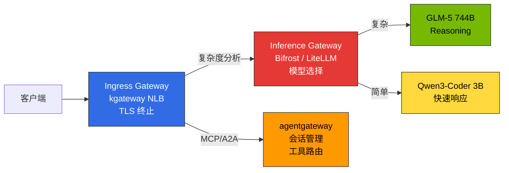
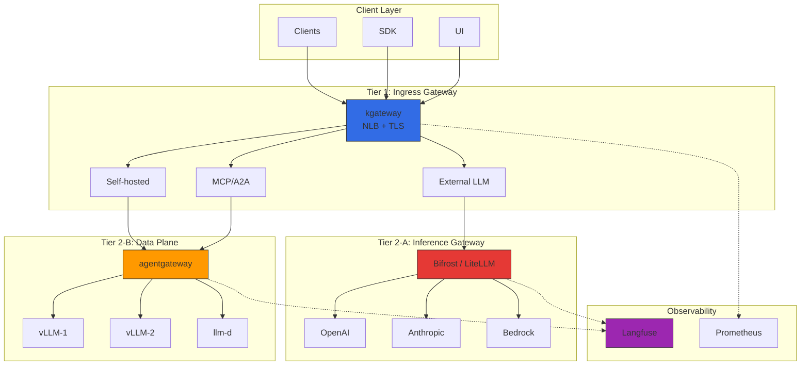
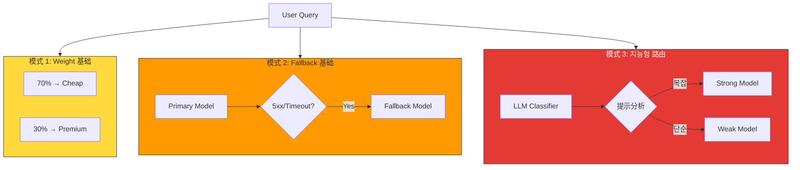
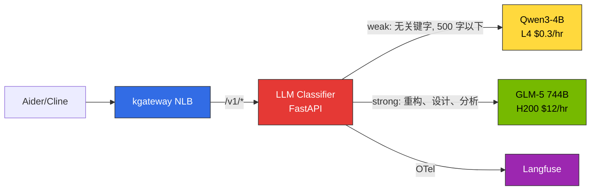
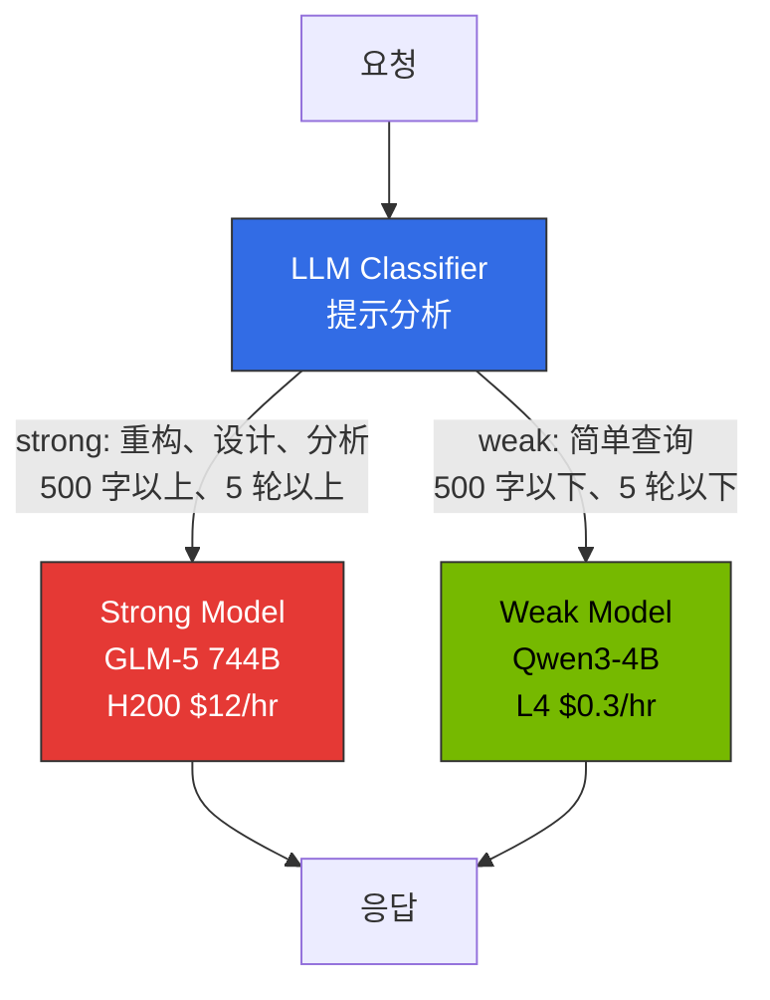
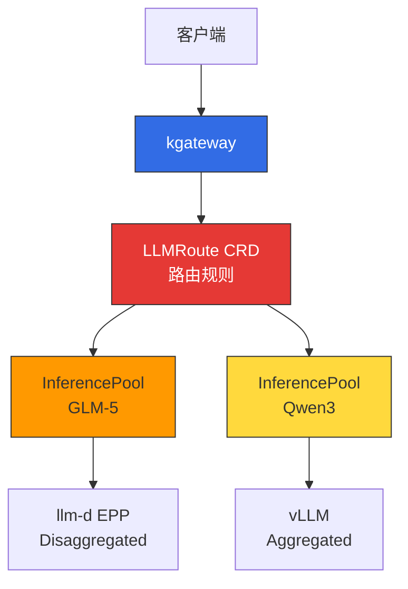

# 推理网关 & LLM Gateway 路由策略

> 撰写日期：2025-02-05 | 修订日期：2026-04-17 | 阅读时间：约 15 分钟

本文档涵盖 2-Tier 网关架构和路由策略（Cascade / Semantic Router / Hybrid）的**设计原则**。实际的 Helm 安装、HTTPRoute 清单、OTel 联动等**部署步骤**请参考[推理网关配置指南](./setup)。

## 概述

在大规模 AI 模型服务环境中，需要分离**基础设施流量管理**和 **LLM 提供商抽象**。单一 Gateway 复杂性急剧增加，各层优化困难。

**2-Tier Gateway 架构**：
- **L1（Ingress Gateway）**：kgateway — Kubernetes Gateway API 标准、流量路由、mTLS、rate limiting
- **L2-A（Inference Gateway）**：Bifrost/LiteLLM — 提供商集成、cascade routing、semantic caching
- **L2-B（Data Plane）**：agentgateway — MCP/A2A 协议、stateful 会话管理

各层独立管理，分离基础设施和 AI 工作负载。

---

## 2-Tier Gateway 架构

### Gateway 层次划分

LLM 推理平台需要明确区分 **3 种不同的 Gateway 角色**：

| Gateway 类型 | 作用 | 实现 | 位置 |
|-------------|------|-------|------|
| **Ingress Gateway** | 接收外部流量、TLS 终止、基于路径的路由 | kgateway（NLB 联动） | Tier 1 |
| **Inference Gateway** | 模型选择、智能路由、请求级联 | Bifrost / LiteLLM | Tier 2-A |
| **Data Plane** | MCP/A2A 协议、stateful 会话、工具路由 | agentgateway | Tier 2-B |



**核心原则：**
- **Ingress Gateway (kgateway)**: 仅负责网络级别流量控制. 不包含模型选择逻辑
- **Inference Gateway (Bifrost/LiteLLM)**: 分析请求复杂度 → 自动选择合适的模型 → 成本优化
- **Data Plane (agentgateway)**: AI 专用协议 (MCP/A2A) 处理、维护 stateful 会话

### 整体结构



### 按 Tier 角色划分

| Tier | 组件 | 职责 | 协议 |
|------|----------|------|----------|
| **Tier 1** | kgateway (Envoy 基础） | 流量路由, mTLS, rate limiting, 网络策略 | HTTP/HTTPS, gRPC |
| **Tier 2-A** | Bifrost / LiteLLM | 智能模型选择, 成本跟踪, request cascading, semantic caching | OpenAI-compatible API |
| **Tier 2-B** | agentgateway | MCP/A2A 会话管理, 自有推理基础设施路由, 防止 Tool Poisoning | HTTP, JSON-RPC, MCP, A2A |

### 流量流程

**外部 LLM**: Client → kgateway → Bifrost/LiteLLM (Cascade + Cache) → OpenAI → 响应 + 成本记录
**自有 vLLM**: Client → kgateway → agentgateway → vLLM → 响应

---

## kgateway (L1 Inference Gateway)

### 基于 Gateway API 的路由

kgateway实现了 Kubernetes Gateway API 标准，实现供应商中立的配置.

import { ComponentStructureTable } from '@site/src/components/InferenceGatewayTables';

<ComponentStructureTable />

Gateway API v1.2.0+提供了 HTTPRoute 改进、GRPCRoute 稳定化、BackendTLSPolicy， kgateway v2.0+完全支持这些功能.

### Dynamic Routing 概念

| 路由类型 | 标准 | 使用场景 |
|------------|------|----------|
| **基于 Header** | `x-model-id`, `x-provider` | 按模型/提供商选择后端 |
| **基于路径** | `/v1/chat/completions`, `/v1/embeddings` | 按 API 类型分离服务 |
| **基于权重** | backendRef weight | 金丝雀部署, A/B 测试 |
| **复合条件** | header + 路径 + tier | 按高级/普通客户分配后端 |

金丝雀部署从 5-10% 流量开始逐步增加，, 出现问题时 weight=0立即回滚。

### 负载均衡策略

| 策略 | 说明 | 适用场景 |
|------|------|--------------|
| **Round Robin** | 顺序分配（默认） | 均匀的模型实例 |
| **Random** | 随机分配 | 大规模后端池 |
| **Consistent Hash** | 相同键 → 相同后端 | KV Cache 复用、会话保持 |

Consistent Hash在 LLM 推理中特别有用. 将同一用户的请求路由到相同的 vLLM 实例， 可提高 prefix cache 命中率， TTFT(Time to First Token)可显著改善.

### Topology-Aware Routing (Kubernetes 1.33+)

Kubernetes 1.33+利用 topology-aware routing， 优先保证同一 AZ 内 Pod 间通信， 节省跨 AZ 数据传输成本.

import { TopologyEffectsTable } from '@site/src/components/InferenceGatewayTables';

<TopologyEffectsTable />

### 故障应对概念

| 机制 | 说明 | LLM 推理考虑因素 |
|----------|------|-------------------|
| **超时** | 按请求限制最大处理时间 | LLM 生成长响应需要数十秒. 需要足够的超时 (120s+) |
| **重试** | 5xx, 超时, 连接失败时自动 重试 | 最多限制 3 次. 无限重试导致系统过载 |
| **断路器** | 连续失败时临时阻断后端 | `maxEjectionPercent` 50% 以下，设置以保证至少一半的后端可用 |

流式响应时 `backendRequest` 超时到第一个字节，`request`是整个请求时间. POST 重试需要保证幂等性（注意工具调用）。

---

## LLM Gateway 解决方案比较

### 主要解决方案比较表

| 解决方案 | 语言 | 主要特性 | Cascade Routing | 许可证 | 适用环境 |
|--------|------|-----------|-----------------|----------|-----------|
| **Bifrost** | Go/Rust | 50x faster, CEL Rules 条件路由, failover | CEL Rules + 外部 classifier | Apache 2.0 | 高性能、低成本、自托管 |
| **LiteLLM** | Python | 100+ 提供商, complexity-based routing 原生 | `routing_strategy: complexity-based` | MIT | Python 生态系统、快速原型 |
| **vLLM Semantic Router** | Python | vLLM 专用、基于轻量嵌入的路由 | 基于嵌入相似度 | Apache 2.0 | vLLM 独立环境 |
| **Portkey** | TypeScript | SOC2 认证、semantic caching、Virtual Keys | 지원 | Proprietary + OSS | 企业、合规 |
| **Kong AI Gateway** | Lua/C | MCP 支持、利用现有 Kong 基础设施 | 插件 | Apache 2.0 / Enterprise | 现有 Kong 用户 |
| **Helicone** | Rust | Gateway + Observability 集成、高性能 | 지원 | Apache 2.0 | 同时需要高性能 + 可观测性 |

### Bifrost vs LiteLLM

**Bifrost**: Go/Rust 实现 Python 相比 50 倍的 throughput, 1/10 内存使用. 通过 CEL Rules 条件路由 (基于 Header cascade, failover) 可实现. Helm Chart 部署, OpenAI 兼容 API. 代理延迟 100us 以下. 智能 cascade 在 App 中计算 complexity score → `x-complexity-score` header → CEL rule 分支模式或 Go Plugin实现.

**LiteLLM**: 支持 100+ 提供商, **complexity-based routing 原生** (`routing_strategy: complexity-based` 通过 1 行配置激活), Langfuse 一行集成 (`success_callback: ["langfuse"]`), LangChain/LlamaIndex 直接集成. 但基于 Python，throughput 低、内存使用量高.

### 选择标准

| 使用场景 | 推荐解决方案 | 原因 |
|-----------|-----------|------|
| 智能 cascade（优先便利性） | **LiteLLM** | Complexity-based routing 原生, 설정 1줄 |
| 智能 cascade（优先性能） | **Bifrost** | CEL Rules + 外部 classifier, 50x 빠름 |
| vLLM 独立环境 | **vLLM Semantic Router** | vLLM 原生、轻量 路由 |
| 高性能、低成本自托管 | **Bifrost** | 50x 快速处理、低内存 |
| Python 生态系统（LangChain） | **LiteLLM** | 原生 集成、100+ 提供商 |
| 企业合规 | **Portkey** | SOC2/HIPAA/GDPR, Semantic Cache |
| 고성능 + 可观测性集成 | **Helicone** | Rust 基础 All-in-one |

### 按场景推荐组合

| 시나리오 | 推荐组合 | 原因 |
|----------|----------|------|
| **创业/PoC** | kgateway + LiteLLM | 低成本、10 分钟部署、complexity routing 1 行 |
| **以自托管为中心（性能）** | kgateway + Bifrost (CEL cascade) + agentgateway | 高性能、外部+自有池 2-Tier |
| **企业多 提供商** | kgateway + Portkey + Langfuse | 규정 준수, 250+ 提供商 |
| **混合（外部+自有）** | kgateway + Bifrost/LiteLLM + agentgateway | 外部用 Bifrost/LiteLLM、自有用 agentgateway |
| **全球部署** | Cloudflare AI Gateway + kgateway | Edge caching, DDoS 방어 |

---

## Request Cascading：智能模型路由

### 概念

**Request Cascading**是自动分析请求复杂度并路由到合适模型的智能优化技术. 简单查询自动分配到廉价快速的模型，复杂 reasoning 分配到强大模型，同时改善成本和延迟. IDE 只使用单一端点，模型选择在平台级别集中控制.

### Cascading 的 3 种模式

| 模式 | 说明 | 实现 | 使用场景 |
|------|------|------|----------|
| **1. Weight 基础** | 按固定比例分配流量 | kgateway `backendRef weight` | A/B 测试、渐进式模型迁移 |
| **2. Fallback 基础** | 错误时自动切换到其他模型 | kgateway retry + 多个 backendRef | 提高可用性、避免 rate limit |
| **3. 지능형 路由** | 分析请求后自动选择模型 | **LLM Classifier** / LiteLLM / vLLM Semantic Router | 成本优化, 保持质量 |



### Request Cascading 实战实现

智能 cascade routing 分析请求复杂度并自动路由到合适的模型. 以自托管环境中实际验证的方法为中心进行说明.

#### 方法 A：LLM Classifier（推荐 — 实战验证）

**LLM Classifier**是基于 Python FastAPI 的轻量路由器, 直接分析提示内容并自动选择 SLM/LLM. kgateway 后端作为 ExtProc（External Processing）或独立服务运行, 客户端只使用单一端点（`/v1`）.



**分类标准：**

| 标准 | weak (SLM) | strong (LLM) |
|------|-----------|-------------|
| **키워드** | 없음 | 重构、架构、设计、分析、调试、优化、迁移等 |
| **입력 길이** | 500 字 以下 | 500 字 이상 |
| **대화 턴 수** | 5 轮 이하 | 5 轮 초과 |

**核心分类逻辑：**

```python
STRONG_KEYWORDS = ["重构", "架构", "设计", "分析", "优化", "调试",
                   "迁移", "refactor", "architect", "design", "analyze",
                   "optimize", "debug", "migration", "complex"]
TOKEN_THRESHOLD = 500

def classify(messages: list[dict]) -> str:
    content = " ".join(m.get("content", "") for m in messages if m.get("content"))
    # 关键字匹配
    if any(kw in content.lower() for kw in STRONG_KEYWORDS):
        return "strong"
    # 输入长度
    if len(content) > TOKEN_THRESHOLD:
        return "strong"
    # 对话轮次
    if len(messages) > 5:
        return "strong"
    return "weak"
```

**优点**: 无需修改客户端、直接分析提示内容、直接传输 Langfuse OTel、部署简单（单个 Pod）
**단점**: 分类准确度依赖启发式（可通过 ML classifier 逐步改进）

:::tip LLM Classifier 最优的原因
标准 OpenAI 兼容客户端（Aider、Cline 等）**只设置单个 `base_url`**. LLM Classifier在这个单一端点后分析提示并直接代理到后端 vLLM 实例. 客户端完全无感知模型选择.
:::

#### Bifrost 自托管 Cascade 限制

Bifrost尝试将其用于自托管 vLLM cascade，但由于以下限制 **LLM Classifier转换为**：

| 限制 | 说明 |
|------|------|
| **provider/model 포맷 강제** | 请求时必须使用 `openai/glm-5` 形式。标准 OpenAI 客户端（Aider 等）期望 `model: "auto"` 这样的单一模型名 |
| **provider당 단일 base_url** | 一个 provider（例如 `openai`）只能设置一个 `network_config.base_url`。如果 SLM 和 LLM 在不同 Service，无法作为同一 provider 路由 |
| **CEL에서 프롬프트 접근 불가** | CEL Rules只能访问 `request.headers`。无法分析请求 body（提示内容）进行路由 |
| **모델명 정규화 이슈** | 连字符删除等不可预测的规范化导致与 vLLM `served-model-name` 不一致 |

:::warning Bifrost适用于外部 LLM 提供商集成
Bifrost通过 OpenAI/Anthropic/Bedrock 等**外部提供商集成**和 **failover** 进行了优化。 自托管 vLLM 间的智能 cascade routing 更适合使用 LLM Classifier。
:::

#### RouteLLM 评估结果

[RouteLLM](https://github.com/lm-sys/RouteLLM)是 LMSYS 开发的开源路由框架，基于 Matrix Factorization 的分类模型经过学术验证 (LMSYS Chatbot Arena 数据达到 90%+ 准确度）.

但在 K8s 部署时确认了以下问题：

- **依赖冲突**: `torch`, `transformers`, `sentence-transformers` 等大型依赖树与 vLLM 环境冲突
- **容器大小**: 包含分类模型时镜像大小 10GB+（不适合轻量路由器）
- **部署不稳定**: pip dependency resolution 失败频率高
- **维护**: 研究项目性质，缺乏生产支持

**결론**: RouteLLM的 MF classifier **概念**有效，但生产部署推荐 **LLM Classifier**（轻量启发式）或 **LiteLLM complexity routing**（外部提供商环境）。

#### 方法 B：LiteLLM 原生（外部提供商环境）

LiteLLM原生支持 **complexity-based routing**。 在配置文件中只需添加 1 行即可自动分析请求复杂度并选择模型。

```yaml
model_list:
  - model_name: gpt-4-turbo
    litellm_params:
      model: gpt-4-turbo-preview
      api_key: os.environ/OPENAI_API_KEY
  - model_name: gpt-3.5-turbo
    litellm_params:
      model: gpt-3.5-turbo
      api_key: os.environ/OPENAI_API_KEY

router_settings:
  routing_strategy: complexity-based  # 通过这 1 行激活
  complexity_threshold: 0.7           # 0.7 以上 → 强大模型
```

**优点**: 通过 1 行配置激活、自动分析提示长度·代码包含·推理关键字，支持 100+ 提供商
**단점**: 基于 Python 的低 throughput、无法定制复杂度算法、自托管 vLLM 中有开销

#### 方法 C：vLLM Semantic Router（vLLM 专用）

vLLM 环境中可使用 **vLLM Semantic Router** 执行基于轻量嵌入的路由。 通过将嵌入匹配到预定义的"类别"来选择模型。

```python
# vLLM Semantic Router 配置
from vllm import SemanticRouter

router = SemanticRouter(
    categories={
        "simple": ["basic question", "quick answer", "definition"],
        "complex": ["explain in detail", "analyze", "step by step"]
    },
    models={
        "simple": "qwen3-4b",
        "complex": "glm-5-744b"
    },
    threshold=0.85
)

# 自动路由
response = router.route(prompt="Explain the architecture...")  # → glm-5-744b
```

**优点**: vLLM 原生、使用轻量嵌入（推理延迟 < 5ms）、配置简单
**단점**: vLLM 专用、需要预定义类别

### Cascade Routing 实现方法选择指南

| 환경 | 권장 접근 | 原因 |
|------|----------|------|
| **自托管 vLLM（Aider/Cline）** | **LLM Classifier** | 直接分析提示、单一端点、无需修改客户端 |
| **외부 提供商 (OpenAI/Anthropic)** | **LiteLLM** | 100+ 提供商 原生、complexity routing 1 行 |
| **vLLM 独立 + 嵌入可用** | **vLLM Semantic Router** | vLLM 原生、轻量 |
| **混合（外部 + 自有）** | **LLM Classifier + LiteLLM** | 自有用 Classifier、外部用 LiteLLM |

### Cascade Routing 策略（基于 Fallback）

根据复杂度 **cheap -> balanced -> frontier** 模型逐步尝试。

**复杂度分类标准（2026-04 标准）：**

| 복잡도 | 조건 | 권장 모델 | 토큰당 成本 |
|--------|------|----------|-----------|
| **Simple** | token < 200、无关键字 | Haiku 4.5 / GPT-4.1 nano | $0.80-$0.15/M |
| **Medium** | token 200-1000、包含代码 | Sonnet 4.6 / Gemini 2.5 Flash | $3-$0.10/M |
| **Complex** | token 1000+、reasoning 关键字 | Opus 4.7 / GPT-4.1 | $15-$10/M |

**Fallback 조건**: HTTP 5xx, Rate Limit 超出、Timeout、Quality Score < 0.7 (옵션)

### 成本节省效果 (2026-04 标准)

日 10,000 请求场景：
- Simple (50%): Haiku 4.5 — 50 tok in, 100 tok out → $0.50/天
- Medium (30%): Sonnet 4.6 — 500 tok in, 500 tok out → $2.70/天
- Complex (15%): Opus 4.7 — 1500 tok in, 1000 tok out → $3.38/天
- Very Complex (5%): Opus 4.7 — 3000 tok in, 2000 tok out → $3.00/天

**총 成本: $9.58/일 ($287/월)**

모든 요청을 Opus 4.7로 처리 시: $45/일 ($1,350/월) 相比节省 **79%**

**自托管 LLM Classifier 场景** (2026-04 标准):
- Qwen3-4B (70% weak, L4 $0.3/hr × 24hr × 30d) = $216//月
- GLM-5 744B (30% strong, H200 $12/hr × 24hr × 30d × 0.3) = $2,592//月
- Langfuse + AMP/AMG = $200//月

**총 成本: $3,008/月** (GLM-5 单独 $8,900/월 相比节省 **66%**)

### 企业模型路由模式

**实现位置优先级**: Gateway > IDE > 客户端

| 위치 | 优点 | 适用环境 |
|------|------|----------|
| **Gateway (LLM Classifier)** | 提示分析, 集中控制、客户端无修改 | 自托管 **（推荐）** |
| **Gateway (LiteLLM/Bifrost)** | 多提供商、策略一致性 | 외부 提供商 |
| **IDE (Claude Code)** | 上下文感知 | 开发工具供应商 |
| **客户端 (SDK)** | 灵活性高 | 프로토타입 |

**실전 권장**: 自托管环境中 **kgateway → LLM Classifier → vLLM** 结构部署，在中心进行路由。 开发者只使用单一端点（`/v1`），平台团队管理分类策略。 详细部署指南请参考 [网关配置指南](./setup/advanced-features#llm-classifier-部署)。

---

## 研究参考：RouteLLM

**RouteLLM**是 LMSYS 开发的开源 LLM 路由框架. 轻量分类模型（Matrix Factorization）分析请求并自动选择 strong/weak 模型。



| 项目 | RouteLLM (研究） | LLM Classifier (实战） |
|------|----------------|---------------------|
| **分类方式** | Matrix Factorization 임베딩 | 关键字 + token 长度 + 对话轮次 |
| **입력** | 用户提示 + 对话历史 | 동일 |
| **출력** | Strong/Weak + 置信度分数 | Strong/Weak |
| **额外延迟** | < 10ms (MF 推理) | < 1ms (基于规则） |
| **依赖** | torch, transformers, sentence-transformers | FastAPI, httpx (轻量） |
| **K8s 部署** | 不稳定（依赖冲突） | 稳定（50MB 镜像） |

:::warning RouteLLM 生产部署注意
RouteLLM是研究项目，不推荐 K8s 生产部署. 依赖冲突과 대형 이미지 크기(10GB+)가 문제입니다. MF classifier **概念**有用，但实战中推荐 **LLM Classifier**（自托管）或 **LiteLLM complexity routing**（外部提供商）。
:::

详细部署代码请参考 [网关配置指南](./setup/advanced-features#llm-classifier-部署)。

---

## Gateway API Inference Extension

Kubernetes Gateway API通过 **Inference Extension** 使 LLM 推理可作为 Kubernetes 原生资源管理。

### 核心 CRD（Custom Resource Definitions）

| CRD | 角色 | 示例 |
|-----|------|------|
| **InferenceModel** | 按模型定义服务策略（criticality、路由规则） | `criticality: high` → 分配专用 GPU |
| **InferencePool** | 模型服务 Pod 组（vLLM replicas） | `replicas: 3` → 3个 vLLM 实例 |
| **LLMRoute** | 将请求路由到 InferenceModel 的规则 | `x-model-id: glm-5` → GLM-5 Pool |

详细 YAML manifest 请参考 [网关配置指南](./setup)。

### Gateway API Inference Extension 集成

Gateway API Inference Extension通过 **kgateway + llm-d EPP** 联动提供 Kubernetes 原生推理路由：



**현재 상태**: CNCF 项目正在积极开发中. Kubernetes 1.34+预计提供 alpha，目前不推荐生产使用. 实战部署请参考 [Reference Architecture](../) 指南。

---

## Semantic Caching

Semantic Caching通过检测语义相似的提示并重用先前的响应，同时节省 LLM API 成本和延迟. Gateway 级别（Bifrost/LiteLLM/Portkey）通过嵌入相似度判断 HIT/MISS，因此, KV Cache（vLLM）· Prompt Cache（提供商托管）可独立组合。

**推荐默认阈值**: 0.85 — 允许含义相同·表达差异

设计原则（3 层缓存比较、相似度阈值权衡、工具比较表、缓存键设计、可观测性·实战检查清单）在单独文档中详细说明。

- **设计原则**: [Semantic Caching 策略](../../model-serving/inference-frameworks/semantic-caching-strategy.md)
- **실전 部署 示例**: [OpenClaw AI Gateway 部署](./openclaw-example.md) 的 LiteLLM + Redis 配置

---

## agentgateway 数据平面

### 概述

**agentgateway**是 kgateway 的 AI 工作负载专用数据平面。 现有 Envoy 针对 stateless HTTP/gRPC 进行了优化，但, AI 代理具有 stateful JSON-RPC 会话、MCP 协议、防止 Tool Poisoning 等特殊需求。

### Envoy vs agentgateway 比较

| 项目 | Envoy 数据平面 | agentgateway |
|------|---------------------|---------------------------|
| **会话管理** | Stateless, HTTP 基于 Cookie | Stateful JSON-RPC 会话、内存会话存储 |
| **协议** | HTTP/1.1, HTTP/2, gRPC | MCP (Model Context Protocol), A2A (Agent-to-Agent) |
| **安全** | mTLS, RBAC | 防止 Tool Poisoning, per-session Authorization |
| **路由** | 基于路径/Header | 基于会话 ID、工具调用验证 |
| **可观测性** | HTTP 指标、Access Log | LLM token 跟踪、工具调用链、成本 |

### 核心功能

#### 核心功能

**1. Stateful JSON-RPC 会话管理**: `X-MCP-Session-ID` 基于 Header 会话跟踪、Sticky Session 路由、自动清理非活跃会话（默认 30 分钟）

**2. MCP/A2A 协议 原生 支持**：`/mcp/v1` （MCP 协议）、 `/a2a/v1` （A2A 代理通信）路径支持

**3. 防止 Tool Poisoning**：允许工具列表、阻断危险工具 (`exec_shell`, `read_credentials`), 响应大小限制、完整性验证 (SHA-256)

**4. Per-session Authorization**：JWT token 验证、基于角色的工具访问、防止会话劫持

:::info agentgateway 项目现状
agentgateway是 2025 年末从 kgateway 项目分离的 AI 专用数据平面，目前正在积极开发中。 MCP 协议과 A2A 协议的 빠른 발전에 맞춰 기능이 지속적으로 추가되고 있습니다.
:::

---

## 监控 & Observability

### 核心指标

AI 推理网关中需要监控的核心指标如下：

import { MonitoringMetricsTable } from '@site/src/components/InferenceGatewayTables';

<MonitoringMetricsTable />

| 指标类别 | 주요 项目 | 的미 |
|----------------|----------|------|
| **延迟** | TTFT (Time to First Token) | 第一个 token 生成时间。用户感知响应性 |
| **吞吐量** | TPS (Tokens Per Second) | 每秒 token 生成数。模型服务效率 |
| **错误率** | 5xx / 전체 요청 | 后端故障比例。超过 5% 立即响应 |
| **缓存命中率** | Cache Hit / 전체 요청 | Semantic Cache 效率。推荐 30% 以上 |
| **成本** | 按模型 token 使用量 x 单价 | 实时成本跟踪 |

### Langfuse OTel 联动

Bifrost/LiteLLM将 OTel trace 传输到 Langfuse，跟踪提示/完成内容、token 使用 `success_callback: ["langfuse"]` 配置激活。 详细配置请参考 [监控栈设置](../integrations/monitoring-observability-setup.md)。

### 推荐告警规则

| 알림 | 조건 | 심각도 |
|------|------|--------|
| 높은 错误率 | 5xx > 5% （5 分钟） | Critical |
| 높은 延迟 | P99 > 30 秒 （5 分钟） | Warning |
| 断路器 활성화 | circuit_breaker_open == 1 | Critical |
| 缓存命中率 급락 | Cache hit < 30% | Warning |
| 예산 초과 임박 | Budget > 80% | Warning |

---

## 相关文档

### 实战部署指南

实际代码示例和 YAML manifest 请参考 Reference Architecture 部分：

- [网关配置指南](./setup) - kgateway, Bifrost, agentgateway 安装和 YAML manifest
- [OpenClaw AI Gateway 部署](./openclaw-example.md) - OpenClaw + Bifrost + Hubble 实战部署
- [自定义模型部署](../model-lifecycle/custom-model-deployment.md) - vLLM/llm-d 部署指南

### 成本及可观测性

- [编码工具 & 成本分析](../integrations/coding-tools-cost-analysis.md) - Aider/Cline 连接、NLB 集成路由模式
- [监控栈设置](../integrations/monitoring-observability-setup.md) - Langfuse OTel 联动、Prometheus、Grafana 仪表板
- [LLMOps Observability](../../operations-mlops/observability/llmops-observability.md) - Langfuse/LangSmith 基于 LLM 可观测性

### 相关基础设施

- [GPU 资源管理](../../model-serving/gpu-infrastructure/gpu-resource-management.md) - 动态资源分配策略
- [llm-d 分布式推理](../../model-serving/inference-frameworks/llm-d-eks-automode.md) - EKS Auto Mode 基于分布式推理
- [Agent 监控](../../operations-mlops/observability/agent-monitoring.md) - Langfuse 集成指南

---

## 参考资料

### 官方文档

- [Kubernetes Gateway API](https://gateway-api.sigs.k8s.io/)
- [Gateway API Inference Extension (Proposal)](https://github.com/kubernetes-sigs/gateway-api/issues/2813)
- [kgateway 官方文档](https://kgateway.dev/docs/)
- [agentgateway GitHub](https://github.com/kgateway-dev/agentgateway)
- [Bifrost 官方文档](https://www.getmaxim.ai/bifrost/docs)
- [LiteLLM 官方文档](https://docs.litellm.ai/)
- [LiteLLM Complexity Routing](https://docs.litellm.ai/docs/routing)
- [vLLM Semantic Router](https://github.com/vllm-project/semantic-router)

### LLM 提供商

- [OpenAI API Reference](https://platform.openai.com/docs/api-reference)
- [Anthropic Claude API](https://docs.anthropic.com/claude/reference)
- [AWS Bedrock](https://docs.aws.amazon.com/bedrock/)

### 相关协议

- [Model Context Protocol (MCP) Spec](https://modelcontextprotocol.io/specification)
- [Agent-to-Agent (A2A) Protocol](https://github.com/a2a-protocol/spec)

### 研究资料 & 模式

- [RouteLLM: Learning to Route LLMs with Preference Data (arXiv)](https://arxiv.org/abs/2406.18665)
- [LMSYS Chatbot Arena Leaderboard](https://chat.lmsys.org/?leaderboard)
- [LLM Router Pattern: Model Switching](https://markaicode.com/llm-router-pattern-model-switching/)
