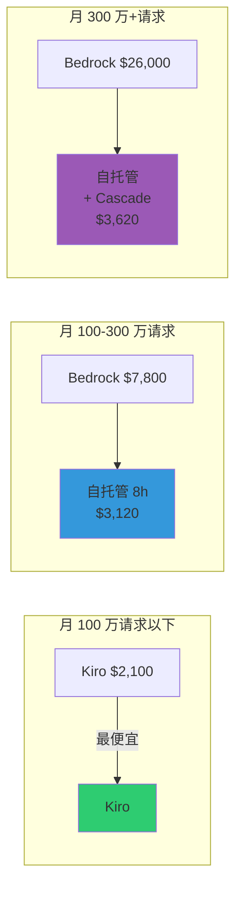
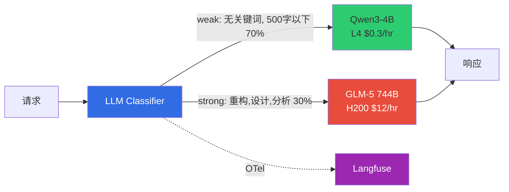

# 编码工具对接与成本分析

## 1. 概述

在企业环境中使用 AI 编码工具需要考虑 **IDE 对接**、**成本优化**、**数据主权** 三个方面。本文档提供 Aider、Cline、Continue.dev 等主要编码工具连接自托管 LLM 的方法，以及 Bedrock vs Kiro vs 自托管的成本分析。

### 为什么需要自托管对接？

| 限制 | SaaS（Kiro、Copilot）| 自托管 |
|------|---------------------|-----------|
| **数据主权** | 代码传输到外部 | VPC 内完全隔离 |
| **定制化** | 仅使用提供的模型 | LoRA Fine-tuning |
| **成本控制** | Token 单价固定 | Cascade 节省 66% |
| **可观测性** | 有限 | Langfuse 完全控制 |

:::tip 核心策略
在 kgateway 后部署 **LLM Classifier**，客户端只使用单一端点（`/v1`），根据 Prompt 内容自动选择 SLM（Qwen3-4B）/ LLM（GLM-5）。通过 Langfuse 追踪所有请求，无需手动选择模型即可通过 Cascade Routing 节省 66% 成本。
:::

---

## 2. IDE/编码工具连接

### 2.1 LLM Classifier 自动分流（推荐）

使用 **LLM Classifier** 时所有客户端通过**单一端点**连接，根据 Prompt 内容自动选择 SLM/LLM。无需手动选择模型。

| 工具 | LLM Classifier 兼容 | 设置方法 |
|------|---------------------|----------|
| **Aider** | 是 | `OPENAI_API_BASE=http://<NLB>/v1 aider --model openai/auto` |
| **Cline** | 是 | Model: `auto`, Base URL: `http://<NLB>/v1` |
| **Continue.dev** | 是 | model: `auto`, apiBase: `http://<NLB>/v1` |
| **Cursor** | 是 | 模型名无需 `/` — 使用 `auto` |

:::tip 比 Bifrost 更好的兼容性
Bifrost 需要的 `provider/model` 格式（`openai/glm-5`）和 Aider double-prefix 技巧（`openai/openai/glm-5`）**完全不需要**。Cursor 也可以无 `/` 限制使用。
:::

### 2.2 Aider 连接示例

[Aider](https://aider.chat) 是支持 Git-aware 代码修改 + 自动提交的开源 CLI 工具。

```bash
# 安装 Aider
pip install aider-chat

# LLM Classifier 自动分流 — 单一端点，自动选择模型
OPENAI_API_BASE="http://<NLB_ENDPOINT>/v1" \
OPENAI_API_KEY="dummy" \
aider --model openai/auto
```

:::info 自动模型分流
用 `model: "auto"` 请求时 LLM Classifier 分析 Prompt 内容自动选择 SLM（Qwen3-4B）或 LLM（GLM-5 744B）。简单代码补全用 Qwen3-4B（$0.3/hr），重构/架构分析用 GLM-5（$12/hr）路由。
:::

### 2.3 Continue.dev 设置示例

Continue.dev 是 VSCode/JetBrains 用 AI 编码助手。

```json
{
  "models": [
    {
      "title": "Auto (LLM Classifier)",
      "provider": "openai",
      "model": "auto",
      "apiBase": "http://<NLB_ENDPOINT>/v1",
      "apiKey": "dummy"
    }
  ]
}
```

### 2.4 Cline 设置示例

Cline 是 VSCode 用 AI 编码工具。

Settings -> API Provider -> OpenAI Compatible
- Base URL: `http://<NLB_ENDPOINT>/v1`
- Model: `auto`
- API Key: `dummy`

---

## 3. 路由架构对比

### 3.1 LLM Classifier vs Bifrost

| 项目 | **LLM Classifier（推荐）** | **Bifrost** |
|------|--------------------------|------------|
| **适用环境** | 自托管 vLLM cascade | 外部 Provider 集成（OpenAI/Anthropic）|
| **模型名格式** | `auto`（任意值可）| `provider/model` 强制 |
| **Prompt 分析** | 直接访问 body | CEL 仅访问 headers |
| **多后端** | WEAK/STRONG URL 分离 | 每 provider 单一 base_url |
| **Aider 兼容** | 无需技巧 | 需要 double-prefix |
| **Cursor 兼容** | 是 | 不可（斜杠不允许）|
| **镜像大小** | ~50MB | ~100MB |

:::info Bifrost 什么时候用？
Bifrost 针对**外部 LLM Provider**（OpenAI、Anthropic、Bedrock）集成、failover、rate limiting 优化。自托管 vLLM 间的智能 cascade 请使用 LLM Classifier。两者也可以一起用（外部用 Bifrost、自托管用 LLM Classifier）。
:::

---

## 4. Kiro vs 自托管对比

2026 年 4 月，[Kiro IDE 开始原生支持 GLM-5](https://kiro.dev/changelog/models/glm-5-now-available-in-kiro)。Kiro 在自有基础设施（us-east-1）托管开放权重模型以 0.5x credit 提供。

### 功能对比

| | **Kiro 托管** | **自托管（EKS + vLLM）** |
|---|---|---|
| **基础设施** | Kiro/AWS 管理 | 自行运维（EKS + GPU 节点）|
| **成本** | 按用量计费（0.5x credit）| GPU Spot ~$12/hr |
| **LoRA Fine-tuning** | 不可 | 领域特化定制 |
| **数据主权** | 经由 Kiro 基础设施 | VPC 内完全隔离 |
| **合规** | 依赖 Kiro 策略 | SOC2/ISO27001 自主控制 |
| **可观测性** | Kiro 仪表板 | Langfuse + AMP/AMG 完全控制 |
| **网关** | 无 | Bifrost（guardrails、caching）|
| **Steering/Spec** | 原生 | 需要单独实现 |
| **自定义端点** | 仅 Kiro 模型列表 | 自由设置 |
| **启动难度** | 立即 | 高 |

:::tip 需要自托管的情况
- **FSI/受监管行业**：数据不能经过外部服务（需要 VPC 隔离）
- **LoRA Fine-tuning**：COBOL→Java 迁移、内部框架代码生成等领域特化
- **多客户运营**：按客户 LoRA 适配器热交换 + Bifrost 路由
- **完全可观测性**：所有 trace/metric 用自有 Langfuse + AMP 收集
:::

:::info Kiro 适合的情况
- 无需基础设施配置快速原型
- 利用 Kiro Steering/Spec 原生工作流
- 希望减少 GPU 基础设施运维负担的小团队
:::

---

## 5. 成本阈值分析：Bedrock vs Kiro vs 自托管

### 5.1 每 Token 成本（2026.04 基准）

| | **Bedrock API** | **Kiro（0.5x credit）** | **自托管（EKS）** |
|---|---|---|---|
| Input（$/1M tokens）| $1.00 | ~$0.80（估算）| **可变** |
| Output（$/1M tokens）| $3.20 | ~$2.56（估算）| **可变** |
| 平均请求成本（1K in + 500 out）| **$0.0026** | **$0.0021** | **固定成本 / 请求量** |
| 月订阅 | 无（按量）| $20~200/月 | 无 |
| 最低成本 | $0 | $20/月 | $8,900/月 |
| LoRA Fine-tuning | 不可 | 不可 | 可以 |
| 数据主权 | VPC Endpoint | 不可 | VPC 隔离 |

### 5.2 自托管固定成本

| 项目 | 24/7 运营 | 8 小时/天运营 |
|------|----------|-------------|
| p5en.48xlarge Spot | $8,640/月 | $2,880/月 |
| EKS + 存储 + 监控 | $243/月 | $243/月 |
| **合计** | **$8,900/月** | **$3,120/月** |

### 5.3 月请求量别成本对比（USD）

| 月请求量 | 月 Token（M）| **Bedrock** | **Kiro** | **自托管 24/7** | **自托管 8h** | **自托管+Cascade** |
|----------|------------|------------|---------|-------------------|------------------|----------------|
| 50,000 | 75M | $130 | $105 | $8,900 | $3,120 | $3,620 |
| 200,000 | 300M | $520 | $420 | $8,900 | $3,120 | $3,620 |
| 500,000 | 750M | $1,300 | $1,050 | $8,900 | $3,120 | $3,620 |
| 1,000,000 | 1.5B | $2,600 | $2,100 | $8,900 | **$3,120** | **$3,620** |
| 3,000,000 | 4.5B | **$7,800** | **$6,300** | $8,900 | **$3,120** | **$3,620** |
| 5,000,000 | 7.5B | **$13,000** | **$10,500** | $8,900 | **$3,120** | **$3,620** |
| 10,000,000 | 15B | **$26,000** | **$21,000** | $8,900 | **$3,120** | **$3,620** |

### 5.4 盈亏平衡点

| 对比 | 盈亏平衡（月请求）| 盈亏平衡（月成本）|
|------|------------------|-----------------|
| Bedrock vs 自托管 24/7 | ~3,400,000 | ~$8,900 |
| Bedrock vs 自托管 8h | ~1,200,000 | ~$3,120 |
| Kiro vs 自托管 24/7 | ~4,200,000 | ~$8,900 |
| Kiro vs 自托管 8h | ~1,500,000 | ~$3,120 |
| Bedrock vs 自托管+Cascade | ~1,400,000 | ~$3,620 |



---

## 6. 成本优化选项（Bedrock/Kiro 不可）

仅自托管可用的成本优化策略。

### 6.1 优化选项对比

| 优化 | 效果 | 说明 |
|--------|------|------|
| **8 小时/天运营** | 节省 67% | CronJob 仅工作时间扩容（$8,900 → $3,120）|
| **Cascade Routing** | 节省 70-80% | 简单请求用 SLM（8B），复杂请求才用 GLM-5 |
| **KV Cache Aware Routing** | TTFT 缩短 90% | llm-d prefix-cache aware 调度，复用相同上下文 |
| **Semantic Caching** | GPU 成本 0（缓存命中）| Bifrost similarity threshold 0.85 缓存类似请求 |
| **Spot Instance** | 节省 84% | On-Demand $76/hr → Spot $12/hr |
| **Multi-LoRA 共享** | 基础设施成本 1/N | GLM-5 1 台 + LoRA N 个 = 服务 N 个客户 |

### 6.2 Cascade Routing 架构（LLM Classifier）



#### Cascade 成本分析

| | SLM 独立 | LLM 独立 | **Cascade（70:30）** |
|---|---|---|---|
| **月成本** | $500 | $8,900 | **$3,020** |
| **准确率** | 70% | 95% | **92%** |
| **成本节省** | - | - | **66%** |

:::tip ROI 计算
引入 LLM Classifier Cascade 后月节省 $5,880（年 $70,560）。LLM Classifier 以单一 FastAPI Pod 部署，设置耗时半天左右，**值得立即引入**。
:::

---

## 7. 选择标准总结

| 标准 | 推荐 |
|------|------|
| 月 50 万请求以下 + 快速启动 | **Kiro**（最便宜）|
| 月 50-150 万 + API 集成 | **Bedrock**（按量、无需基础设施）|
| 月 150 万+（24/7）或 120 万+（8h）| **自托管** |
| 应用 Cascade 后月 140 万+ | **自托管**（比 Bedrock 节省）|
| LoRA/合规需要 | **自托管**（与请求量无关）|
| Steering/Spec 工作流 | **Kiro** |

:::tip 成本优化策略组合
**最高性价比自托管**：8 小时/天运营 + Cascade Routing + Spot
- 月成本：~$3,620（固定）
- 可处理无限请求
- 比 Bedrock 盈亏平衡：**月 ~140 万请求**
- 10M 请求/月基准：Bedrock $26,000 vs 自托管 $3,620 → **节省 86%**
:::

---

## 8. 参考资料

| 资料 | 链接 |
|------|------|
| Aider 官方文档 | [aider.chat](https://aider.chat) |
| Continue.dev 文档 | [continue.dev](https://www.continue.dev/) |
| Bifrost Gateway | [getbifrost.ai](https://getbifrost.ai/) |
| Langfuse Observability | [langfuse.com](https://langfuse.com/) |
| Kiro 定价 | [kiro.dev/pricing](https://kiro.dev/pricing) |
| 自定义模型部署指南 | [custom-model-deployment.md](../model-lifecycle/custom-model-deployment.md) |
| 自定义模型流水线 | [custom-model-pipeline.md](../model-lifecycle/custom-model-pipeline.md) |
| Inference Gateway | [inference-gateway-routing.md](../inference-gateway/routing-strategy.md) |
